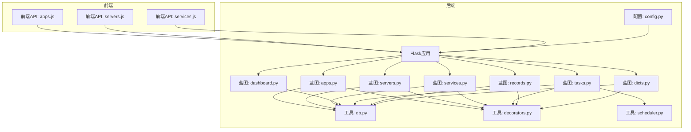
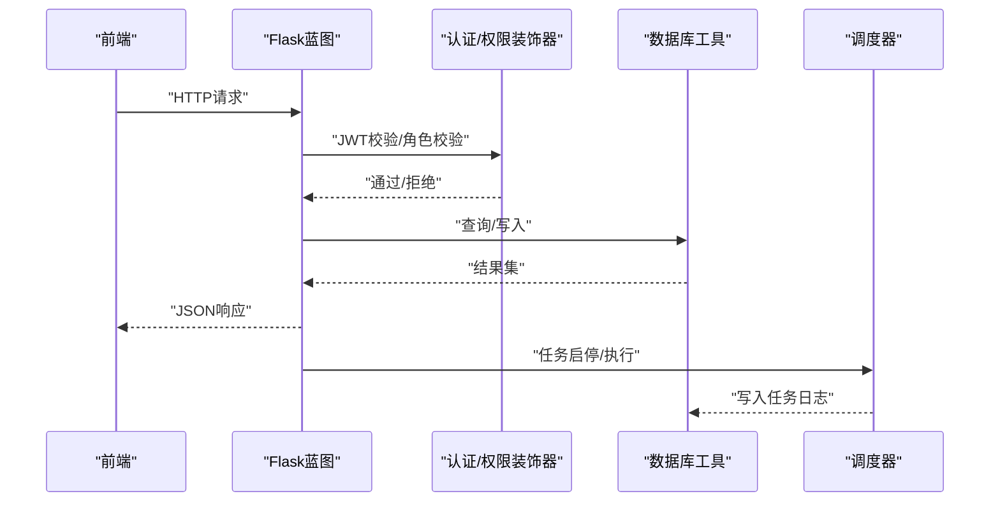
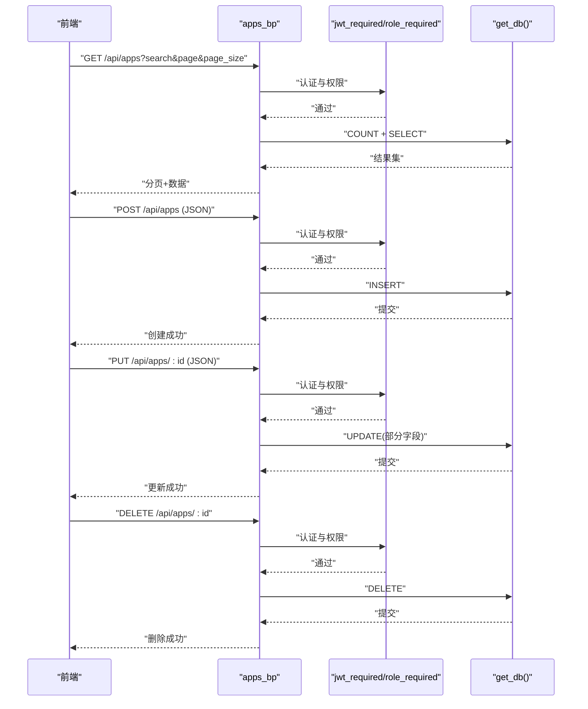
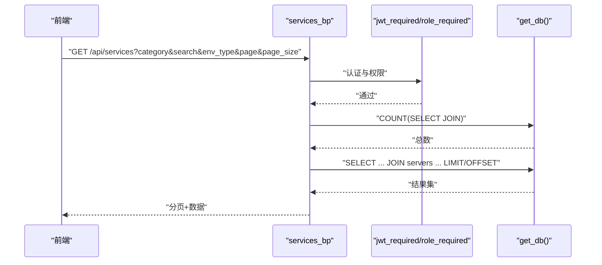
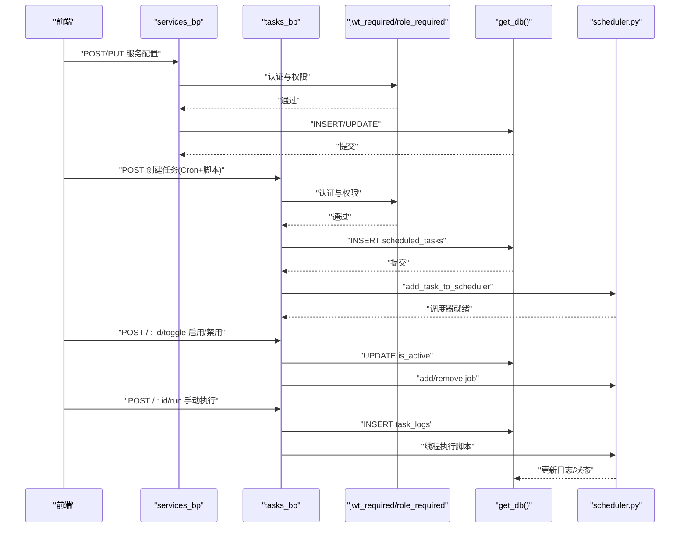
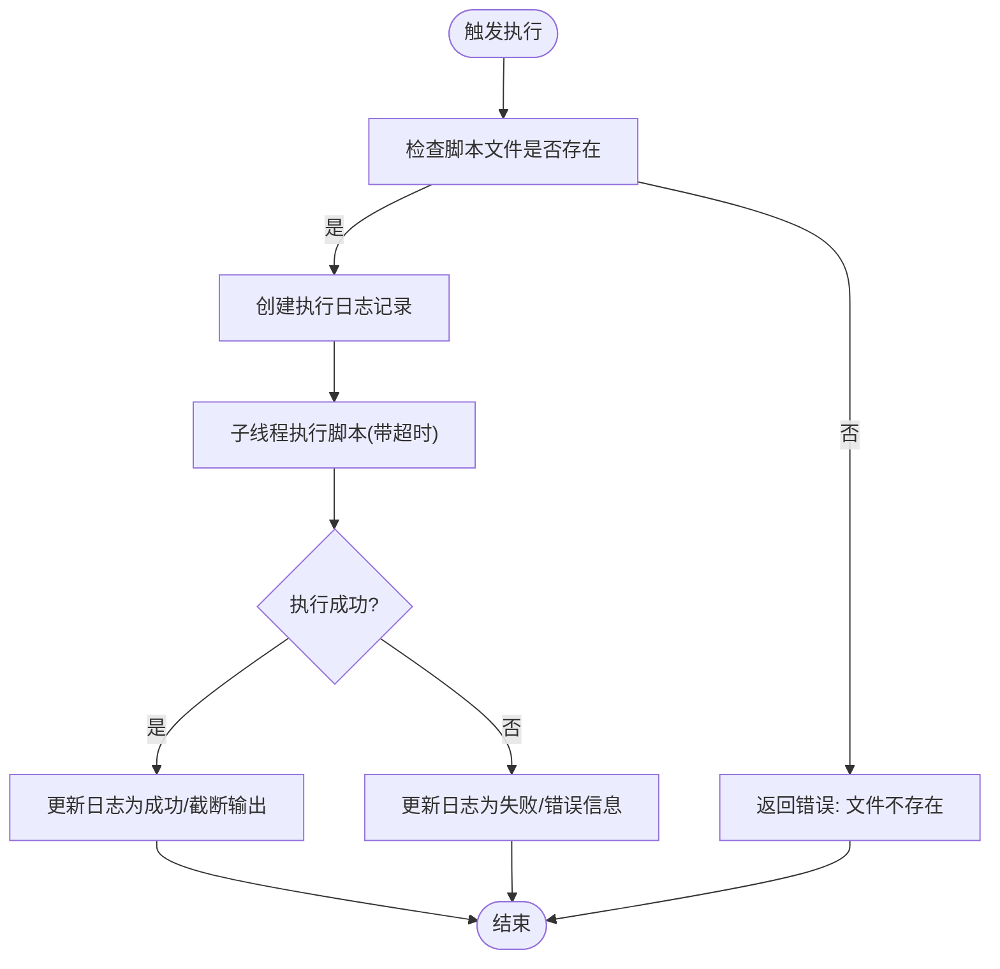
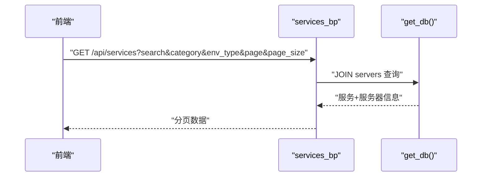
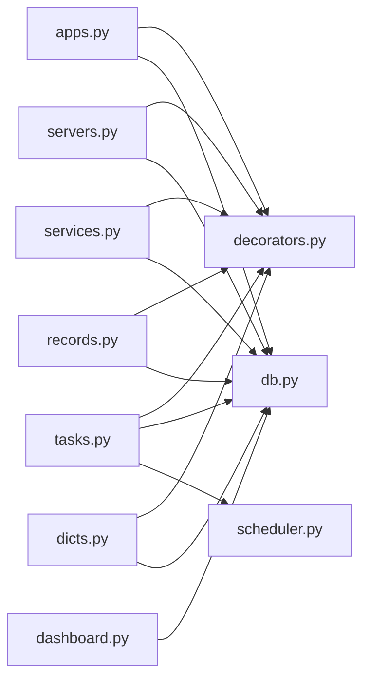

# 应用系统蓝图

<cite>
**本文引用的文件**
- [apps.py](file://backend/app/api/apps.py)
- [servers.py](file://backend/app/api/servers.py)
- [services.py](file://backend/app/api/services.py)
- [dashboard.py](file://backend/app/api/dashboard.py)
- [tasks.py](file://backend/app/api/tasks.py)
- [records.py](file://backend/app/api/records.py)
- [dicts.py](file://backend/app/api/dicts.py)
- [decorators.py](file://backend/app/utils/decorators.py)
- [db.py](file://backend/app/utils/db.py)
- [scheduler.py](file://backend/app/utils/scheduler.py)
- [config.py](file://backend/app/config.py)
- [run.py](file://backend/run.py)
- [apps.js](file://frontend/src/api/apps.js)
- [servers.js](file://frontend/src/api/servers.js)
- [services.js](file://frontend/src/api/services.js)
</cite>

## 目录
1. [简介](#简介)
2. [项目结构](#项目结构)
3. [核心组件](#核心组件)
4. [架构总览](#架构总览)
5. [详细组件分析](#详细组件分析)
6. [依赖分析](#依赖分析)
7. [性能考虑](#性能考虑)
8. [故障排查指南](#故障排查指南)
9. [结论](#结论)
10. [附录](#附录)

## 简介
本文件为“应用系统蓝图”项目的API文档，聚焦于应用生命周期与运维管理能力，覆盖应用CRUD、应用列表查询（含分组与过滤）、部署管理（配置、启停、日志、更新）、状态监控、服务管理（服务发现、负载均衡、故障转移）、以及配置模板与版本控制机制。文档以代码为依据，结合前后端交互与后端工具模块，提供清晰的接口定义、调用流程与最佳实践。

## 项目结构
后端采用Flask微服务风格，按功能域划分蓝图；前端通过统一请求封装与各模块API对接。核心目录与职责如下：
- backend/app/api：各业务域API（应用、服务器、服务、仪表盘、任务、记录、字典）
- backend/app/utils：通用工具（认证、数据库、调度器）
- backend/app/config.py：应用配置（数据库、JWT、上传等）
- backend/run.py：应用入口
- frontend/src/api：前端HTTP请求封装

图表来源
- [apps.py:1-168](file://backend/app/api/apps.py#L1-L168)
- [servers.py:1-232](file://backend/app/api/servers.py#L1-L232)
- [services.py:1-182](file://backend/app/api/services.py#L1-L182)
- [dashboard.py:1-91](file://backend/app/api/dashboard.py#L1-L91)
- [tasks.py:1-458](file://backend/app/api/tasks.py#L1-L458)
- [records.py:1-114](file://backend/app/api/records.py#L1-L114)
- [dicts.py:1-267](file://backend/app/api/dicts.py#L1-L267)
- [db.py:1-17](file://backend/app/utils/db.py#L1-L17)
- [decorators.py:1-95](file://backend/app/utils/decorators.py#L1-L95)
- [scheduler.py:1-249](file://backend/app/utils/scheduler.py#L1-L249)
- [config.py:1-21](file://backend/app/config.py#L1-L21)

章节来源
- [apps.py:1-168](file://backend/app/api/apps.py#L1-L168)
- [servers.py:1-232](file://backend/app/api/servers.py#L1-L232)
- [services.py:1-182](file://backend/app/api/services.py#L1-L182)
- [dashboard.py:1-91](file://backend/app/api/dashboard.py#L1-L91)
- [tasks.py:1-458](file://backend/app/api/tasks.py#L1-L458)
- [records.py:1-114](file://backend/app/api/records.py#L1-L114)
- [dicts.py:1-267](file://backend/app/api/dicts.py#L1-L267)
- [db.py:1-17](file://backend/app/utils/db.py#L1-L17)
- [decorators.py:1-95](file://backend/app/utils/decorators.py#L1-L95)
- [scheduler.py:1-249](file://backend/app/utils/scheduler.py#L1-L249)
- [config.py:1-21](file://backend/app/config.py#L1-L21)
- [run.py:1-8](file://backend/run.py#L1-L8)
- [apps.js:1-18](file://frontend/src/api/apps.js#L1-L18)
- [servers.js:1-26](file://frontend/src/api/servers.js#L1-L26)
- [services.js:1-18](file://frontend/src/api/services.js#L1-L18)

## 核心组件
- 应用管理API：提供应用的增删改查、分页与模糊检索
- 服务器管理API：提供服务器列表、详情、分页与过滤
- 服务管理API：提供服务列表、分页、过滤与服务发现
- 仪表盘API：提供统计概览、环境分布、近期变更与证书到期提醒
- 任务管理API：提供定时任务的创建、启停、手动执行、日志查询与脚本文件管理
- 记录管理API：提供变更记录的增删查
- 字典管理API：提供环境类型、平台、服务分类的字典维护
- 工具模块：认证装饰器、数据库连接、调度器

章节来源
- [apps.py:11-168](file://backend/app/api/apps.py#L11-L168)
- [servers.py:11-232](file://backend/app/api/servers.py#L11-L232)
- [services.py:11-182](file://backend/app/api/services.py#L11-L182)
- [dashboard.py:20-91](file://backend/app/api/dashboard.py#L20-L91)
- [tasks.py:33-458](file://backend/app/api/tasks.py#L33-L458)
- [records.py:20-114](file://backend/app/api/records.py#L20-L114)
- [dicts.py:124-267](file://backend/app/api/dicts.py#L124-L267)
- [decorators.py:9-95](file://backend/app/utils/decorators.py#L9-L95)
- [db.py:5-17](file://backend/app/utils/db.py#L5-L17)
- [scheduler.py:14-249](file://backend/app/utils/scheduler.py#L14-L249)

## 架构总览
后端通过蓝图组织API，统一使用JWT认证与角色校验，数据库连接由工具模块提供。定时任务由调度器模块负责周期性执行与日志落库。前端通过各自API模块封装HTTP请求，统一经由请求拦截器完成鉴权与错误处理。

图表来源
- [apps.py:11-168](file://backend/app/api/apps.py#L11-L168)
- [servers.py:11-232](file://backend/app/api/servers.py#L11-L232)
- [services.py:11-182](file://backend/app/api/services.py#L11-L182)
- [tasks.py:63-306](file://backend/app/api/tasks.py#L63-L306)
- [decorators.py:9-95](file://backend/app/utils/decorators.py#L9-L95)
- [db.py:5-17](file://backend/app/utils/db.py#L5-L17)
- [scheduler.py:146-249](file://backend/app/utils/scheduler.py#L146-L249)

## 详细组件分析

### 应用系统管理API
- 功能范围
  - 应用列表查询：支持按名称/公司/访问地址模糊搜索、分页
  - 应用CRUD：创建、更新（部分字段可选更新）、删除
- 关键点
  - 分页参数安全处理（默认值、上限限制）
  - SQL拼接与参数化防止注入
  - 部分字段更新逻辑
- 前端对接
  - 前端通过apps.js封装GET/POST/PUT/DELETE

图表来源
- [apps.py:11-168](file://backend/app/api/apps.py#L11-L168)
- [decorators.py:9-95](file://backend/app/utils/decorators.py#L9-L95)
- [db.py:5-17](file://backend/app/utils/db.py#L5-L17)
- [apps.js:1-18](file://frontend/src/api/apps.js#L1-L18)

章节来源
- [apps.py:11-168](file://backend/app/api/apps.py#L11-L168)
- [apps.js:1-18](file://frontend/src/api/apps.js#L1-L18)

### 应用列表查询（按服务器分组、按状态过滤、聚合）
- 查询维度
  - 按服务器环境类型分组（JOIN服务器表）
  - 支持服务分类过滤
  - 支持服务版本过滤
- 返回字段
  - 服务基本信息与所属服务器的主机名/IP/映射IP/环境类型
  - 支持按环境类型、内网IP、分类、服务名排序
- 实现要点
  - 多表JOIN与条件拼接
  - 分页与总数统计
  - 字段选择避免冗余

图表来源
- [services.py:11-84](file://backend/app/api/services.py#L11-L84)
- [decorators.py:9-95](file://backend/app/utils/decorators.py#L9-L95)
- [db.py:5-17](file://backend/app/utils/db.py#L5-L17)

章节来源
- [services.py:11-84](file://backend/app/api/services.py#L11-L84)

### 应用部署管理接口
- 部署配置
  - 通过服务管理API创建/更新服务，设置服务名、版本、端口映射、内网IP等
- 启动/停止
  - 通过任务管理API创建定时任务，配置Cron表达式与脚本文件，支持启用/禁用与手动执行
- 日志查看
  - 通过任务管理API查询任务日志，返回最近N条执行记录
- 配置更新
  - 通过服务管理API更新服务字段，或通过任务管理API替换脚本文件并重载调度器

图表来源
- [services.py:86-155](file://backend/app/api/services.py#L86-L155)
- [tasks.py:63-306](file://backend/app/api/tasks.py#L63-L306)
- [scheduler.py:146-249](file://backend/app/utils/scheduler.py#L146-L249)
- [decorators.py:9-95](file://backend/app/utils/decorators.py#L9-L95)
- [db.py:5-17](file://backend/app/utils/db.py#L5-L17)

章节来源
- [services.py:86-155](file://backend/app/api/services.py#L86-L155)
- [tasks.py:63-306](file://backend/app/api/tasks.py#L63-L306)
- [scheduler.py:146-249](file://backend/app/utils/scheduler.py#L146-L249)

### 应用状态监控
- 运行状态检测
  - 通过任务管理API的手动执行与日志查询，实时掌握脚本执行状态与输出
- 进程监控
  - 调度器在独立线程中执行脚本，避免阻塞主进程
- 性能指标收集
  - 可在脚本内部采集指标并通过日志或数据库上报（由业务脚本实现）

图表来源
- [tasks.py:309-421](file://backend/app/api/tasks.py#L309-L421)
- [scheduler.py:32-144](file://backend/app/utils/scheduler.py#L32-L144)

章节来源
- [tasks.py:309-421](file://backend/app/api/tasks.py#L309-L421)
- [scheduler.py:32-144](file://backend/app/utils/scheduler.py#L32-L144)

### 应用服务管理（服务发现、负载均衡、故障转移）
- 服务发现
  - 通过服务管理API查询服务列表，返回服务与所属服务器的关联信息，便于前端展示与选择
- 负载均衡
  - 通过服务的端口映射与内网IP，结合外部网关或反向代理实现流量分发（由基础设施实现）
- 故障转移
  - 通过变更记录与证书到期提醒，及时发现异常并触发告警与修复流程

图表来源
- [services.py:11-84](file://backend/app/api/services.py#L11-L84)
- [db.py:5-17](file://backend/app/utils/db.py#L5-L17)

章节来源
- [services.py:11-84](file://backend/app/api/services.py#L11-L84)

### 应用配置模板管理与版本控制
- 配置模板
  - 通过服务管理API创建/更新服务，将模板化的服务名、版本、端口映射等作为配置项
- 版本控制
  - 通过任务管理API对脚本文件进行版本化存储（按时间戳命名），支持替换与回滚
- 变更审计
  - 通过记录管理API记录变更内容，配合仪表盘展示最近变更

章节来源
- [services.py:86-155](file://backend/app/api/services.py#L86-L155)
- [tasks.py:63-137](file://backend/app/api/tasks.py#L63-L137)
- [records.py:55-87](file://backend/app/api/records.py#L55-L87)
- [dashboard.py:50-72](file://backend/app/api/dashboard.py#L50-L72)

## 依赖分析
- 组件耦合
  - API层仅依赖工具层（认证、数据库、调度器），保持高内聚低耦合
- 外部依赖
  - 数据库：pymysql
  - 定时任务：APScheduler
  - Flask：蓝图、请求上下文
- 循环依赖
  - 未见循环导入

图表来源
- [apps.py:1-168](file://backend/app/api/apps.py#L1-L168)
- [servers.py:1-232](file://backend/app/api/servers.py#L1-L232)
- [services.py:1-182](file://backend/app/api/services.py#L1-L182)
- [dashboard.py:1-91](file://backend/app/api/dashboard.py#L1-L91)
- [tasks.py:1-458](file://backend/app/api/tasks.py#L1-L458)
- [records.py:1-114](file://backend/app/api/records.py#L1-L114)
- [dicts.py:1-267](file://backend/app/api/dicts.py#L1-L267)
- [decorators.py:1-95](file://backend/app/utils/decorators.py#L1-L95)
- [db.py:1-17](file://backend/app/utils/db.py#L1-L17)
- [scheduler.py:1-249](file://backend/app/utils/scheduler.py#L1-L249)

章节来源
- [apps.py:1-168](file://backend/app/api/apps.py#L1-L168)
- [servers.py:1-232](file://backend/app/api/servers.py#L1-L232)
- [services.py:1-182](file://backend/app/api/services.py#L1-L182)
- [dashboard.py:1-91](file://backend/app/api/dashboard.py#L1-L91)
- [tasks.py:1-458](file://backend/app/api/tasks.py#L1-L458)
- [records.py:1-114](file://backend/app/api/records.py#L1-L114)
- [dicts.py:1-267](file://backend/app/api/dicts.py#L1-L267)
- [decorators.py:1-95](file://backend/app/utils/decorators.py#L1-L95)
- [db.py:1-17](file://backend/app/utils/db.py#L1-L17)
- [scheduler.py:1-249](file://backend/app/utils/scheduler.py#L1-L249)

## 性能考虑
- 分页与索引
  - 列表查询均支持分页与LIMIT/OFFSET，建议在高频查询列建立索引（如服务器环境类型、服务分类、服务名）
- SQL优化
  - 使用参数化查询，避免拼接SQL；COUNT与SELECT分离，减少重复扫描
- 调度器并发
  - 脚本执行在独立线程中进行，避免阻塞调度器；设置超时（默认300秒）防止长时间占用
- 前端缓存
  - 对静态字典（环境类型、平台、服务分类）进行本地缓存，减少重复请求

## 故障排查指南
- 认证失败
  - 检查Authorization头格式是否为Bearer Token；确认Token未过期
- 权限不足
  - 确认用户角色满足接口要求（admin/operator）
- 数据库异常
  - 检查数据库连接配置与网络连通性
- 任务执行失败
  - 查看任务日志接口返回的错误信息；确认脚本文件存在且可执行
- 超时问题
  - 调整脚本执行策略或拆分子任务，避免超过300秒超时

章节来源
- [decorators.py:9-95](file://backend/app/utils/decorators.py#L9-L95)
- [db.py:5-17](file://backend/app/utils/db.py#L5-L17)
- [tasks.py:309-421](file://backend/app/api/tasks.py#L309-L421)
- [scheduler.py:99-133](file://backend/app/utils/scheduler.py#L99-L133)

## 结论
本项目提供了完整的应用系统管理API体系，涵盖应用全生命周期与运维自动化能力。通过清晰的蓝图划分、统一的认证与权限控制、完善的任务调度与日志体系，能够支撑应用的稳定发布与持续监控。建议在生产环境中进一步强化数据库索引、任务超时与重试策略、以及前端缓存与错误兜底机制。

## 附录
- 配置说明
  - 数据库：主机、端口、用户名、密码、库名
  - JWT：密钥、过期时间
  - 上传：脚本上传目录、最大文件大小
- 启动方式
  - 通过run.py启动Flask应用，默认监听配置中的HOST与PORT

章节来源
- [config.py:4-21](file://backend/app/config.py#L4-L21)
- [run.py:1-8](file://backend/run.py#L1-L8)