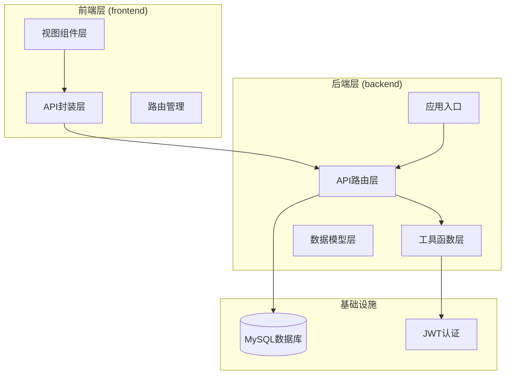
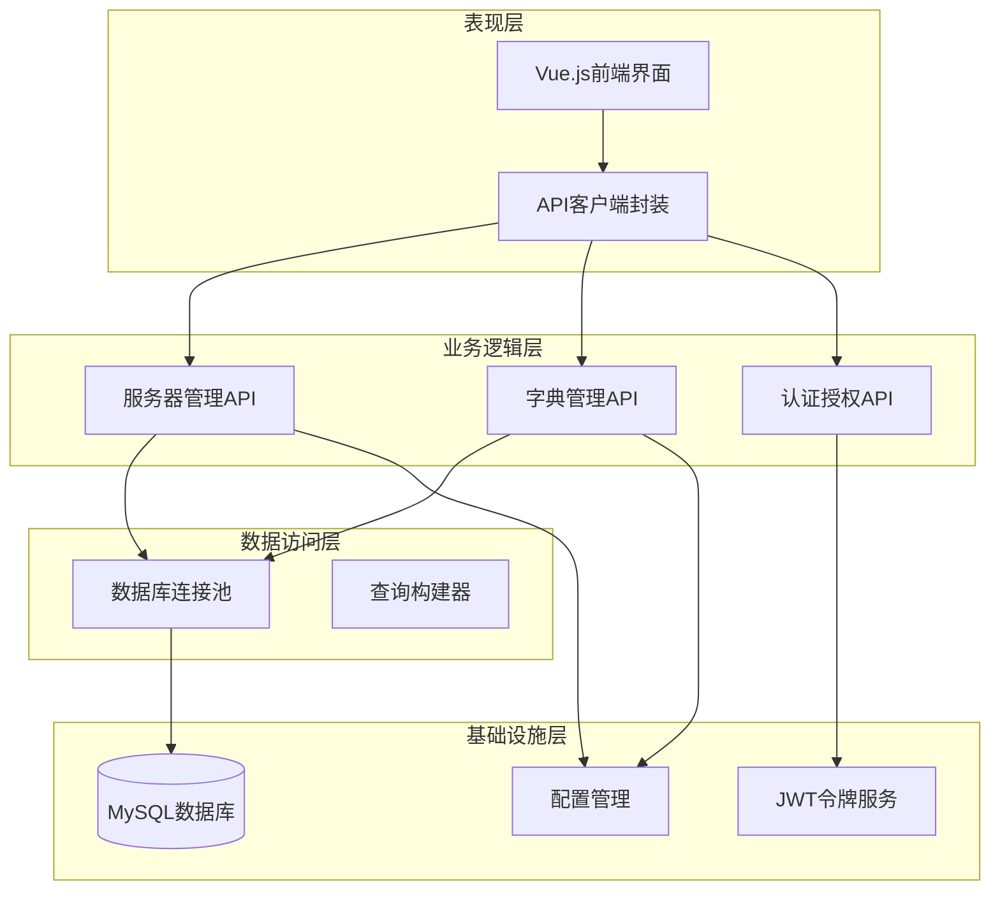
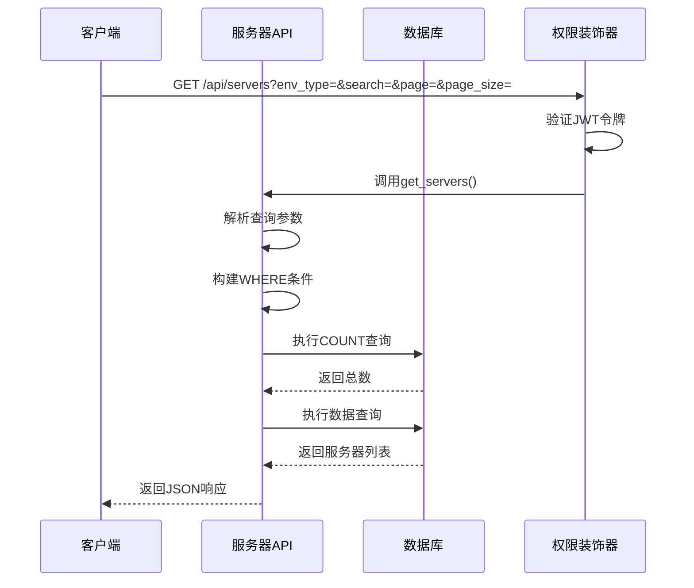
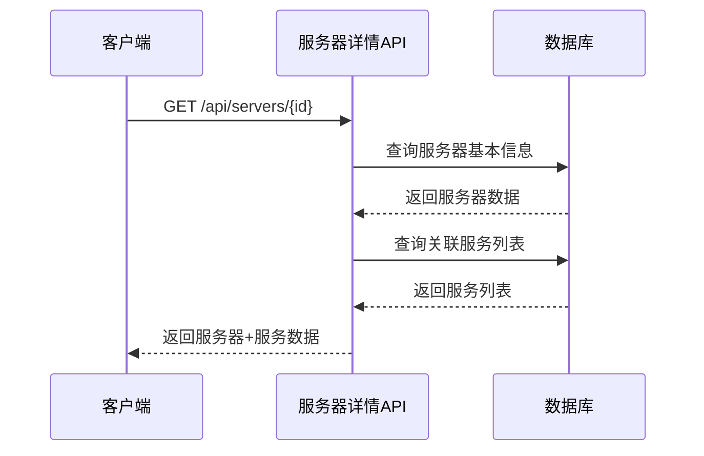
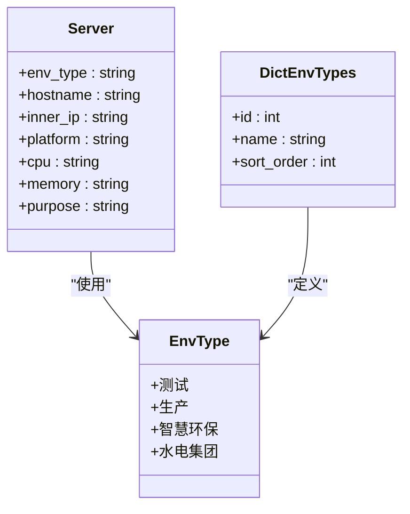
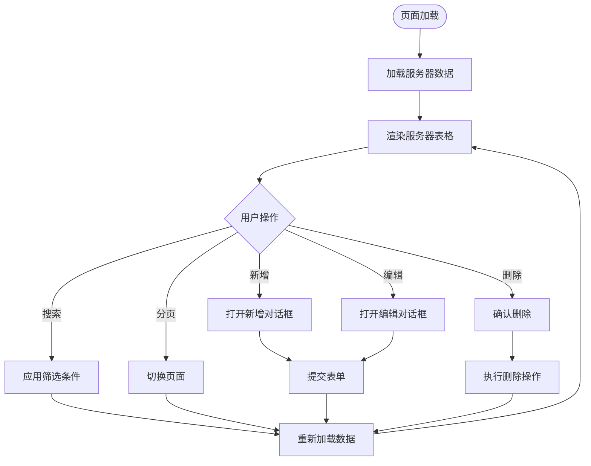
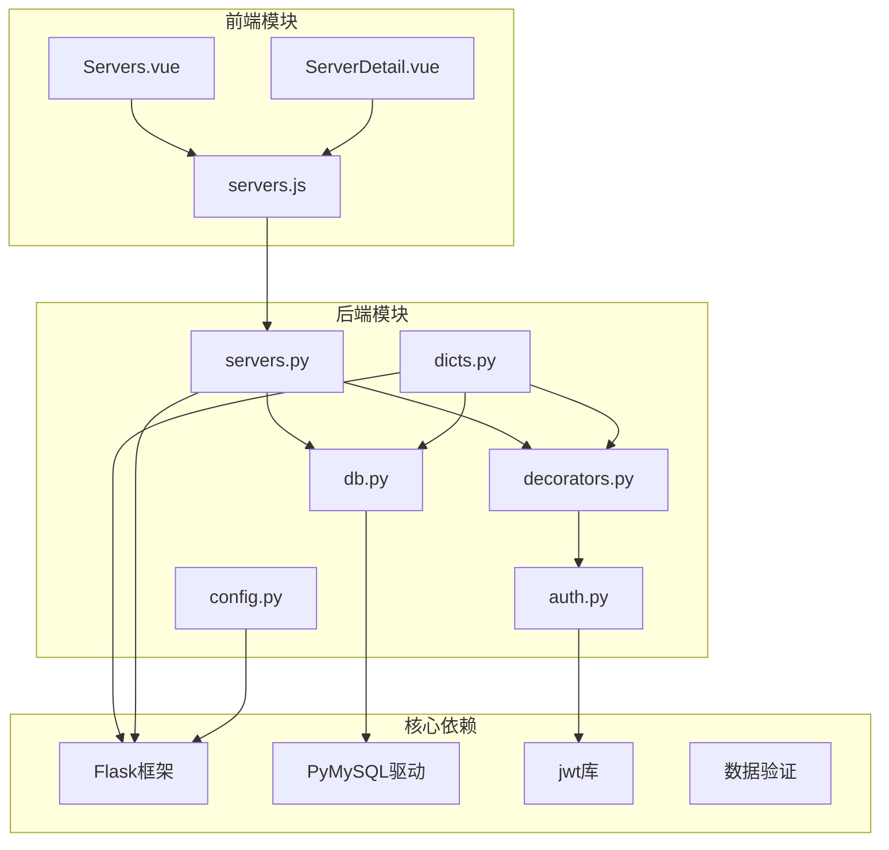

# 服务器管理蓝图

<cite>
**本文档引用的文件**
- [servers.py](file://backend/app/api/servers.py)
- [servers.js](file://frontend/src/api/servers.js)
- [dicts.py](file://backend/app/api/dicts.py)
- [db.py](file://backend/app/utils/db.py)
- [decorators.py](file://backend/app/utils/decorators.py)
- [auth.py](file://backend/app/utils/auth.py)
- [config.py](file://backend/app/config.py)
- [Servers.vue](file://frontend/src/views/Servers.vue)
- [ServerDetail.vue](file://frontend/src/views/ServerDetail.vue)
- [init_db.py](file://backend/init_db.py)
- [run.py](file://backend/run.py)
</cite>

## 目录
1. [简介](#简介)
2. [项目结构](#项目结构)
3. [核心组件](#核心组件)
4. [架构概览](#架构概览)
5. [详细组件分析](#详细组件分析)
6. [依赖关系分析](#依赖关系分析)
7. [性能考虑](#性能考虑)
8. [故障排除指南](#故障排除指南)
9. [结论](#结论)

## 简介

服务器管理蓝图是一个基于Flask + Vue.js构建的企业级运维平台，专注于服务器资产管理与监控。该系统提供了完整的服务器生命周期管理功能，包括服务器信息的创建、查询、更新、删除操作，支持多环境分类管理（开发、测试、生产），以及服务器详情展示和关联服务管理。

系统采用前后端分离架构，后端使用Python Flask框架提供RESTful API服务，前端使用Vue.js + Element Plus构建响应式用户界面。通过JWT令牌认证确保API安全性，支持多角色权限控制。

## 项目结构

该项目采用典型的前后端分离架构，主要分为以下层次：

**图表来源**
- [run.py:1-8](file://backend/run.py#L1-L8)
- [config.py:1-21](file://backend/app/config.py#L1-L21)

**章节来源**
- [run.py:1-8](file://backend/run.py#L1-L8)
- [config.py:1-21](file://backend/app/config.py#L1-L21)

## 核心组件

### 服务器管理API模块

服务器管理是整个系统的核心功能模块，提供了完整的CRUD操作和高级查询能力：

- **服务器列表查询**：支持按环境类型筛选、关键词搜索、分页查询
- **服务器详情获取**：包含服务器基础信息和关联服务列表
- **服务器创建/更新/删除**：完整的生命周期管理
- **环境类型管理**：支持动态添加、修改、删除环境类型字典

### 权限认证系统

系统实现了基于JWT的认证授权机制：

- **JWT认证装饰器**：自动验证请求头中的Bearer Token
- **角色权限控制**：支持admin和operator两种操作权限
- **用户信息注入**：将认证用户信息注入到请求上下文中

### 数据字典管理

提供灵活的字典管理功能，支持环境类型、平台、服务分类等配置项的动态管理。

**章节来源**
- [servers.py:1-232](file://backend/app/api/servers.py#L1-L232)
- [decorators.py:1-95](file://backend/app/utils/decorators.py#L1-L95)
- [dicts.py:1-267](file://backend/app/api/dicts.py#L1-L267)

## 架构概览

系统采用分层架构设计，确保各层职责清晰、耦合度低：

**图表来源**
- [servers.py:8-232](file://backend/app/api/servers.py#L8-L232)
- [dicts.py:8-267](file://backend/app/api/dicts.py#L8-L267)
- [db.py:5-17](file://backend/app/utils/db.py#L5-L17)

## 详细组件分析

### 服务器CRUD操作实现

#### 服务器列表查询功能

服务器列表查询支持多种筛选条件和分页机制：

**图表来源**
- [servers.py:11-72](file://backend/app/api/servers.py#L11-L72)
- [decorators.py:9-56](file://backend/app/utils/decorators.py#L9-L56)

查询参数支持：
- `env_type`：按环境类型筛选（测试/生产/智慧环保/水电集团）
- `search`：关键词搜索（主机名、内网IP、平台）
- `page`：当前页码（默认1，最小1）
- `page_size`：每页条数（默认10，最小1，最大100）

#### 服务器详情获取接口

服务器详情接口提供完整的服务器信息和关联服务列表：

**图表来源**
- [servers.py:75-107](file://backend/app/api/servers.py#L75-L107)

#### 服务器创建操作

服务器创建支持批量字段插入，包含完整的服务器配置信息：

**章节来源**
- [servers.py:130-166](file://backend/app/api/servers.py#L130-L166)

创建字段说明：
- `env_type`：环境类型（必填）
- `platform`：平台信息
- `hostname`：主机名（必填）
- `inner_ip`：内网IP（必填）
- `mapped_ip`：映射IP
- `public_ip`：公网IP
- `cpu`：CPU规格
- `memory`：内存规格
- `sys_disk`：系统盘大小
- `data_disk`：数据盘大小
- `purpose`：用途说明
- `os_user`：系统用户
- `os_password`：系统密码
- `docker_password`：Docker密码
- `remark`：备注信息

#### 服务器更新操作

服务器更新支持选择性字段更新，避免不必要的数据修改：

**章节来源**
- [servers.py:168-204](file://backend/app/api/servers.py#L168-L204)

更新策略：
- 只更新请求体中存在的字段
- 自动构建UPDATE SQL语句
- 支持部分字段更新

#### 服务器删除操作

服务器删除采用级联删除机制，确保数据完整性：

**章节来源**
- [servers.py:207-232](file://backend/app/api/servers.py#L207-L232)

删除特点：
- 自动删除关联的服务记录
- 事务性操作保证数据一致性
- 错误回滚机制

### 服务器环境分类管理

系统支持四种标准环境类型，满足不同业务场景需求：

**图表来源**
- [dicts.py:122-169](file://backend/app/api/dicts.py#L122-L169)
- [init_db.py:50-73](file://backend/init_db.py#L50-L73)

环境类型管理功能：
- 动态添加新的环境类型
- 修改现有环境类型的显示顺序
- 删除不再使用的环境类型
- 自动检查关联数据防止误删

### 前端交互实现

前端采用Vue.js + Element Plus构建用户界面，提供直观的操作体验：

**图表来源**
- [Servers.vue:222-231](file://frontend/src/views/Servers.vue#L222-L231)
- [Servers.vue:269-287](file://frontend/src/views/Servers.vue#L269-L287)

**章节来源**
- [Servers.vue:1-325](file://frontend/src/views/Servers.vue#L1-L325)
- [ServerDetail.vue:1-156](file://frontend/src/views/ServerDetail.vue#L1-L156)

## 依赖关系分析

系统各组件之间的依赖关系清晰明确：

**图表来源**
- [servers.py:4-6](file://backend/app/api/servers.py#L4-L6)
- [dicts.py:4-6](file://backend/app/api/dicts.py#L4-L6)
- [decorators.py:4-6](file://backend/app/utils/decorators.py#L4-L6)

**章节来源**
- [servers.py:4-6](file://backend/app/api/servers.py#L4-L6)
- [dicts.py:4-6](file://backend/app/api/dicts.py#L4-L6)
- [decorators.py:4-6](file://backend/app/utils/decorators.py#L4-L6)

## 性能考虑

### 数据库优化策略

系统在数据库层面采用了多项优化措施：

1. **索引设计**：为常用查询字段建立索引
   - `env_type`：环境类型查询索引
   - `inner_ip`：IP地址查询索引
   - `service_name`：服务名称查询索引

2. **查询优化**：使用参数化查询防止SQL注入
3. **连接池管理**：复用数据库连接减少开销
4. **分页查询**：限制每页最大条数防止超大数据集

### 缓存策略

虽然当前实现未使用缓存，但建议在高并发场景下考虑：

- 服务器列表结果缓存（5-10分钟）
- 环境类型字典缓存（永久有效）
- 用户权限信息缓存（登录有效期）

### 前端性能优化

1. **懒加载**：大型表格组件按需加载
2. **虚拟滚动**：大量数据时使用虚拟滚动
3. **防抖处理**：搜索输入防抖减少请求频率
4. **图片压缩**：图标和图片资源压缩

## 故障排除指南

### 常见问题及解决方案

#### 认证相关问题

**问题**：401 未认证错误
**原因**：缺少有效的JWT令牌
**解决**：检查Authorization头格式是否为"Bearer {token}"

**问题**：403 权限不足
**原因**：用户角色不满足操作要求
**解决**：确认用户是否具有admin或operator权限

#### 数据库连接问题

**问题**：数据库连接失败
**原因**：连接参数配置错误
**解决**：检查DB_HOST、DB_PORT、DB_USER、DB_PASSWORD配置

#### 数据验证错误

**问题**：400 参数错误
**原因**：请求参数不符合要求
**解决**：检查必填字段是否完整，格式是否正确

### 调试技巧

1. **启用调试模式**：设置FLASK_DEBUG=true查看详细错误信息
2. **日志记录**：检查后端日志输出定位问题
3. **网络抓包**：使用浏览器开发者工具查看API响应
4. **数据库查询**：直接查询数据库验证数据状态

**章节来源**
- [decorators.py:22-56](file://backend/app/utils/decorators.py#L22-L56)
- [config.py:15-21](file://backend/app/config.py#L15-L21)

## 结论

服务器管理蓝图提供了一个功能完整、架构清晰的企业级运维平台解决方案。系统的主要优势包括：

1. **完整的CRUD功能**：支持服务器全生命周期管理
2. **灵活的查询机制**：多条件筛选和分页查询
3. **安全的权限控制**：基于JWT的认证授权体系
4. **良好的扩展性**：模块化设计便于功能扩展
5. **用户友好的界面**：基于Vue.js的现代化前端体验

该系统适用于各种规模的企业运维场景，能够有效提升服务器资产管理效率和运维管理水平。通过合理的配置和扩展，可以进一步满足复杂的业务需求。