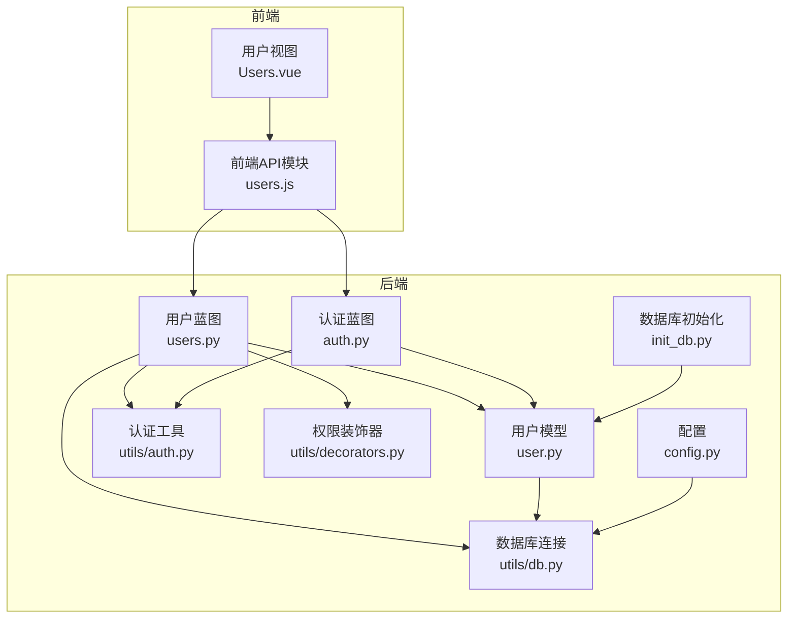
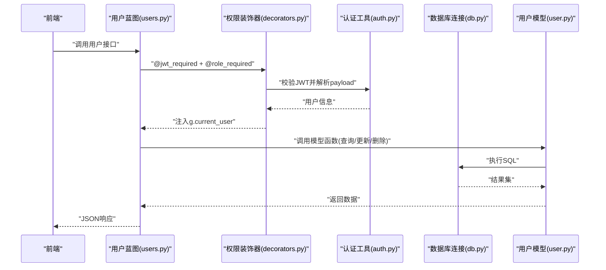
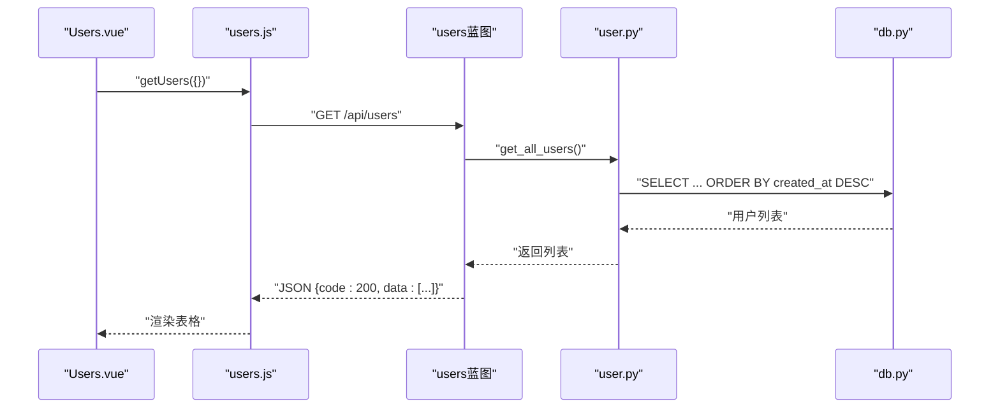
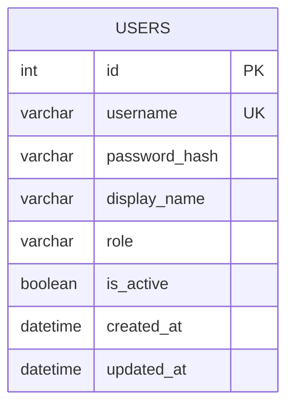
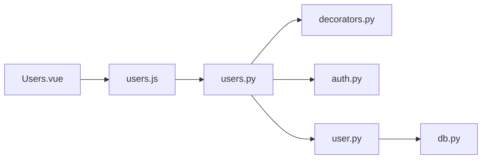

# 用户管理蓝图

<cite>
**本文引用的文件**
- [backend/app/api/users.py](file://backend/app/api/users.py)
- [backend/app/models/user.py](file://backend/app/models/user.py)
- [backend/app/utils/auth.py](file://backend/app/utils/auth.py)
- [backend/app/utils/decorators.py](file://backend/app/utils/decorators.py)
- [backend/app/utils/db.py](file://backend/app/utils/db.py)
- [backend/app/api/auth.py](file://backend/app/api/auth.py)
- [backend/app/config.py](file://backend/app/config.py)
- [backend/init_db.py](file://backend/init_db.py)
- [frontend/src/api/users.js](file://frontend/src/api/users.js)
- [frontend/src/views/Users.vue](file://frontend/src/views/Users.vue)
</cite>

## 目录
1. [简介](#简介)
2. [项目结构](#项目结构)
3. [核心组件](#核心组件)
4. [架构总览](#架构总览)
5. [详细组件分析](#详细组件分析)
6. [依赖分析](#依赖分析)
7. [性能考虑](#性能考虑)
8. [故障排查指南](#故障排查指南)
9. [结论](#结论)
10. [附录](#附录)

## 简介
本文件为“用户管理蓝图”的API文档，覆盖用户CRUD操作、用户列表查询、权限管理、批量操作以及完整的接口规范与数据模型说明。系统采用前后端分离架构：后端基于Flask提供REST API，前端使用Vue + Element Plus构建用户界面；用户权限通过JWT认证与角色控制实现，数据库采用MySQL并通过pymysql连接。

## 项目结构
后端采用蓝图组织API，用户相关逻辑集中在users蓝图；模型层封装数据库操作；工具层提供认证、权限装饰器与数据库连接；前端通过独立API模块调用后端接口，并在Users页面中展示与交互。

图表来源
- [backend/app/api/users.py:1-268](file://backend/app/api/users.py#L1-L268)
- [backend/app/models/user.py:1-183](file://backend/app/models/user.py#L1-L183)
- [backend/app/utils/auth.py:1-83](file://backend/app/utils/auth.py#L1-L83)
- [backend/app/utils/decorators.py:1-95](file://backend/app/utils/decorators.py#L1-L95)
- [backend/app/utils/db.py:1-17](file://backend/app/utils/db.py#L1-L17)
- [backend/app/api/auth.py:1-184](file://backend/app/api/auth.py#L1-L184)
- [backend/app/config.py:1-21](file://backend/app/config.py#L1-L21)
- [backend/init_db.py:1-263](file://backend/init_db.py#L1-L263)
- [frontend/src/api/users.js:1-22](file://frontend/src/api/users.js#L1-L22)
- [frontend/src/views/Users.vue:1-297](file://frontend/src/views/Users.vue#L1-L297)

章节来源
- [backend/app/api/users.py:1-268](file://backend/app/api/users.py#L1-L268)
- [backend/app/models/user.py:1-183](file://backend/app/models/user.py#L1-L183)
- [backend/app/utils/auth.py:1-83](file://backend/app/utils/auth.py#L1-L83)
- [backend/app/utils/decorators.py:1-95](file://backend/app/utils/decorators.py#L1-L95)
- [backend/app/utils/db.py:1-17](file://backend/app/utils/db.py#L1-L17)
- [backend/app/api/auth.py:1-184](file://backend/app/api/auth.py#L1-L184)
- [backend/app/config.py:1-21](file://backend/app/config.py#L1-L21)
- [backend/init_db.py:1-263](file://backend/init_db.py#L1-L263)
- [frontend/src/api/users.js:1-22](file://frontend/src/api/users.js#L1-L22)
- [frontend/src/views/Users.vue:1-297](file://frontend/src/views/Users.vue#L1-L297)

## 核心组件
- 用户蓝图(users.py)：提供用户CRUD与密码重置接口，均需管理员权限。
- 用户模型(user.py)：封装数据库操作，包括创建、查询、更新、删除与密码更新。
- 权限装饰器(decorators.py)：JWT认证与角色校验，确保仅管理员可操作用户。
- 认证工具(auth.py)：生成与验证JWT，密码哈希与校验。
- 数据库连接(utils/db.py)：统一获取MySQL连接。
- 前端API模块(users.js)：封装HTTP请求，对接后端用户接口。
- 用户视图(Users.vue)：前端展示与交互，支持搜索、新增/编辑、重置密码、删除等。

章节来源
- [backend/app/api/users.py:1-268](file://backend/app/api/users.py#L1-L268)
- [backend/app/models/user.py:1-183](file://backend/app/models/user.py#L1-L183)
- [backend/app/utils/decorators.py:1-95](file://backend/app/utils/decorators.py#L1-L95)
- [backend/app/utils/auth.py:1-83](file://backend/app/utils/auth.py#L1-L83)
- [backend/app/utils/db.py:1-17](file://backend/app/utils/db.py#L1-L17)
- [frontend/src/api/users.js:1-22](file://frontend/src/api/users.js#L1-L22)
- [frontend/src/views/Users.vue:1-297](file://frontend/src/views/Users.vue#L1-L297)

## 架构总览
用户管理采用“蓝图 + 模型 + 工具层”的分层设计：
- 接口层：users蓝图暴露REST接口，使用装饰器进行JWT与角色校验。
- 业务层：用户模型封装数据库操作，保证数据一致性。
- 工具层：认证工具负责令牌生成与校验；装饰器负责鉴权；数据库工具提供连接。
- 前端：通过API模块调用后端接口，视图组件负责UI与交互。

图表来源
- [backend/app/api/users.py:1-268](file://backend/app/api/users.py#L1-L268)
- [backend/app/utils/decorators.py:1-95](file://backend/app/utils/decorators.py#L1-L95)
- [backend/app/utils/auth.py:1-83](file://backend/app/utils/auth.py#L1-L83)
- [backend/app/utils/db.py:1-17](file://backend/app/utils/db.py#L1-L17)
- [backend/app/models/user.py:1-183](file://backend/app/models/user.py#L1-L183)

## 详细组件分析

### 用户CRUD接口
- 获取用户列表
  - 方法：GET /api/users
  - 权限：管理员
  - 响应：返回code与data数组，data为用户列表
- 创建用户
  - 方法：POST /api/users
  - 权限：管理员
  - 请求体：username、password、display_name、role（默认operator）
  - 校验：必填字段校验、角色枚举校验、密码长度校验、用户名唯一性校验
  - 响应：成功返回code与message，包含新用户id
- 更新用户
  - 方法：PUT /api/users/<int:user_id>
  - 权限：管理员
  - 请求体：display_name、role、is_active（可选）
  - 校验：角色枚举校验、至少有一个字段更新
  - 响应：成功返回code与message
- 删除用户
  - 方法：DELETE /api/users/<int:user_id>
  - 权限：管理员
  - 限制：禁止删除当前登录用户
  - 响应：成功返回code与message

章节来源
- [backend/app/api/users.py:17-208](file://backend/app/api/users.py#L17-L208)
- [backend/app/models/user.py:83-159](file://backend/app/models/user.py#L83-L159)

### 用户列表查询
- 当前实现：后端返回全部用户，按创建时间倒序排列
- 前端实现：Users.vue通过getUsers(params)发起请求，params为空对象时获取全部用户
- 扩展建议：支持分页、关键词过滤、排序字段扩展（如按角色、状态）

图表来源
- [frontend/src/views/Users.vue:168-176](file://frontend/src/views/Users.vue#L168-L176)
- [frontend/src/api/users.js:3-5](file://frontend/src/api/users.js#L3-L5)
- [backend/app/api/users.py:17-31](file://backend/app/api/users.py#L17-L31)
- [backend/app/models/user.py:83-102](file://backend/app/models/user.py#L83-L102)

章节来源
- [frontend/src/views/Users.vue:168-176](file://frontend/src/views/Users.vue#L168-L176)
- [frontend/src/api/users.js:3-5](file://frontend/src/api/users.js#L3-L5)
- [backend/app/api/users.py:17-31](file://backend/app/api/users.py#L17-L31)
- [backend/app/models/user.py:83-102](file://backend/app/models/user.py#L83-L102)

### 权限管理接口
- 登录接口：POST /api/auth/login
  - 输入：username、password
  - 输出：token与用户信息（含角色）
  - 校验：用户存在、激活状态、密码正确
- 修改密码：PUT /api/auth/password
  - 输入：old_password、new_password
  - 校验：旧密码正确、新密码长度≥6
- 获取当前用户资料：GET /api/auth/profile
- 密码重置（管理员）：PUT /api/users/<int:user_id>/reset-password
  - 输入：new_password
  - 校验：新密码长度≥6、用户存在

章节来源
- [backend/app/api/auth.py:14-184](file://backend/app/api/auth.py#L14-L184)
- [backend/app/api/users.py:210-268](file://backend/app/api/users.py#L210-L268)
- [backend/app/utils/auth.py:11-83](file://backend/app/utils/auth.py#L11-L83)

### 批量操作
- 当前系统未提供批量导入、批量删除、批量状态更新接口
- 建议扩展点：
  - 批量导入：接收CSV/Excel，校验字段与唯一性，逐条插入
  - 批量删除：接收用户ID列表，逐条删除并处理自身删除限制
  - 批量状态更新：接收ID列表与状态值，批量更新is_active

章节来源
- [backend/app/api/users.py:1-268](file://backend/app/api/users.py#L1-L268)

### API接口规范

- 统一响应结构
  - 成功：{ "code": 200, "message": "...", "data": {...} }
  - 失败：{ "code": 错误码, "message": "错误信息" }
- 错误码定义
  - 400：请求参数缺失或不合法
  - 401：缺少认证信息、认证格式错误、Token无效或过期
  - 403：权限不足
  - 404：资源不存在
  - 409：冲突（如用户名已存在）
  - 500：服务器内部错误

章节来源
- [backend/app/api/users.py:45-96](file://backend/app/api/users.py#L45-L96)
- [backend/app/api/users.py:111-163](file://backend/app/api/users.py#L111-L163)
- [backend/app/api/users.py:175-207](file://backend/app/api/users.py#L175-L207)
- [backend/app/api/users.py:222-267](file://backend/app/api/users.py#L222-L267)
- [backend/app/utils/decorators.py:24-45](file://backend/app/utils/decorators.py#L24-L45)
- [backend/app/utils/decorators.py:76-89](file://backend/app/utils/decorators.py#L76-L89)

### 用户数据模型与业务规则
- 表结构（users）
  - 字段：id、username、password_hash、display_name、role、is_active、created_at、updated_at
  - 约束：username唯一；role枚举为admin/operator/viewer；is_active布尔值
- 业务规则
  - 创建用户：默认激活；密码加密存储
  - 更新用户：允许更新display_name、role、is_active；角色枚举校验
  - 删除用户：禁止删除当前登录用户
  - 密码重置：管理员可重置任意用户密码，长度≥6

图表来源
- [backend/init_db.py:34-47](file://backend/init_db.py#L34-L47)

章节来源
- [backend/init_db.py:34-47](file://backend/init_db.py#L34-L47)
- [backend/app/models/user.py:8-36](file://backend/app/models/user.py#L8-L36)
- [backend/app/models/user.py:105-135](file://backend/app/models/user.py#L105-L135)
- [backend/app/models/user.py:138-158](file://backend/app/models/user.py#L138-L158)
- [backend/app/api/users.py:77-83](file://backend/app/api/users.py#L77-L83)

## 依赖分析
- 用户蓝图依赖
  - 权限装饰器：jwt_required、role_required
  - 认证工具：生成与校验JWT
  - 用户模型：数据库操作
  - 数据库工具：连接池与游标
- 前端依赖
  - users.js：封装HTTP请求
  - Users.vue：调用API并渲染UI

图表来源
- [backend/app/api/users.py:1-268](file://backend/app/api/users.py#L1-L268)
- [backend/app/utils/decorators.py:1-95](file://backend/app/utils/decorators.py#L1-L95)
- [backend/app/utils/auth.py:1-83](file://backend/app/utils/auth.py#L1-L83)
- [backend/app/models/user.py:1-183](file://backend/app/models/user.py#L1-L183)
- [backend/app/utils/db.py:1-17](file://backend/app/utils/db.py#L1-L17)
- [frontend/src/api/users.js:1-22](file://frontend/src/api/users.js#L1-L22)
- [frontend/src/views/Users.vue:1-297](file://frontend/src/views/Users.vue#L1-L297)

章节来源
- [backend/app/api/users.py:1-268](file://backend/app/api/users.py#L1-L268)
- [backend/app/utils/decorators.py:1-95](file://backend/app/utils/decorators.py#L1-L95)
- [backend/app/utils/auth.py:1-83](file://backend/app/utils/auth.py#L1-L83)
- [backend/app/models/user.py:1-183](file://backend/app/models/user.py#L1-L183)
- [backend/app/utils/db.py:1-17](file://backend/app/utils/db.py#L1-L17)
- [frontend/src/api/users.js:1-22](file://frontend/src/api/users.js#L1-L22)
- [frontend/src/views/Users.vue:1-297](file://frontend/src/views/Users.vue#L1-L297)

## 性能考虑
- 数据库索引：users表对username与role建立索引，有利于查询与过滤
- SQL优化：查询使用ORDER BY created_at DESC，避免全表扫描
- 建议：用户列表查询若扩展分页与筛选，应增加LIMIT/OFFSET与复合索引
- 连接管理：db.py提供统一连接，注意连接池配置与超时设置

章节来源
- [backend/init_db.py:44-46](file://backend/init_db.py#L44-L46)
- [backend/app/models/user.py:94-99](file://backend/app/models/user.py#L94-L99)
- [backend/app/utils/db.py:5-17](file://backend/app/utils/db.py#L5-L17)

## 故障排查指南
- 认证失败
  - 缺少Authorization头或格式错误：返回401
  - Token无效或过期：返回401
  - 未进行JWT认证：返回401
- 权限不足
  - 非管理员访问用户接口：返回403
- 参数错误
  - 请求体为空：返回400
  - 必填字段缺失：返回400
  - 密码长度不足：返回400
  - 角色不在枚举范围内：返回400
- 资源问题
  - 用户不存在：返回404
  - 用户名冲突：返回409
  - 自身删除：返回400
- 服务器错误
  - 数据库异常或SQL执行失败：返回500

章节来源
- [backend/app/utils/decorators.py:24-45](file://backend/app/utils/decorators.py#L24-L45)
- [backend/app/utils/decorators.py:76-89](file://backend/app/utils/decorators.py#L76-L89)
- [backend/app/api/users.py:45-96](file://backend/app/api/users.py#L45-L96)
- [backend/app/api/users.py:111-163](file://backend/app/api/users.py#L111-L163)
- [backend/app/api/users.py:175-207](file://backend/app/api/users.py#L175-L207)
- [backend/app/api/users.py:222-267](file://backend/app/api/users.py#L222-L267)

## 结论
用户管理蓝图提供了完善的用户CRUD与权限控制能力，接口简洁、响应统一，具备良好的扩展性。当前未实现分页与批量操作，建议后续在保持现有鉴权与数据一致性的前提下，逐步引入分页查询、条件过滤与批量功能，以满足更大规模用户的管理需求。

## 附录

### 前端调用示例（路径）
- 获取用户列表：[frontend/src/api/users.js:getUsers:3-5](file://frontend/src/api/users.js#L3-L5)
- 创建用户：[frontend/src/api/users.js:createUser:7-9](file://frontend/src/api/users.js#L7-L9)
- 更新用户：[frontend/src/api/users.js:updateUser:11-13](file://frontend/src/api/users.js#L11-L13)
- 删除用户：[frontend/src/api/users.js:deleteUser:15-17](file://frontend/src/api/users.js#L15-L17)
- 重置密码：[frontend/src/api/users.js:resetPassword:19-21](file://frontend/src/api/users.js#L19-L21)

章节来源
- [frontend/src/api/users.js:1-22](file://frontend/src/api/users.js#L1-L22)