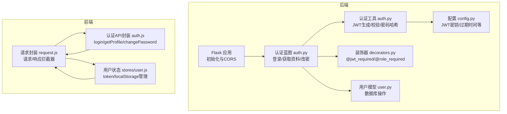
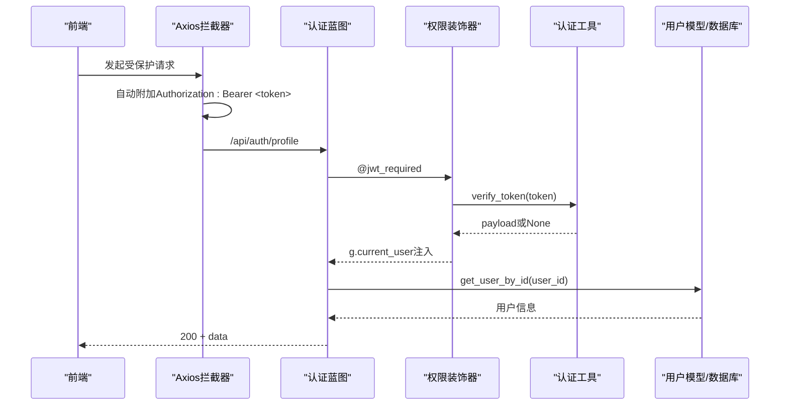
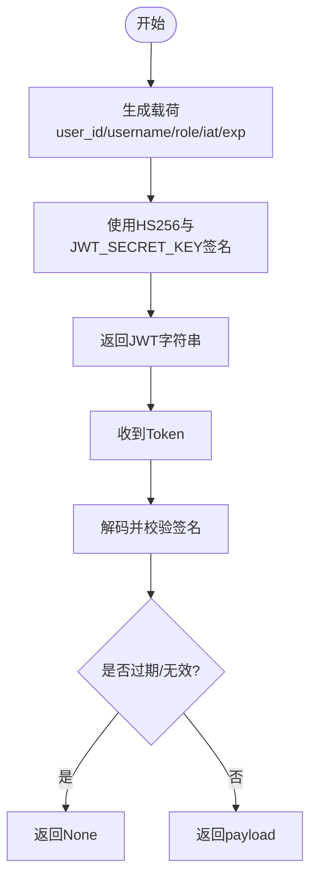
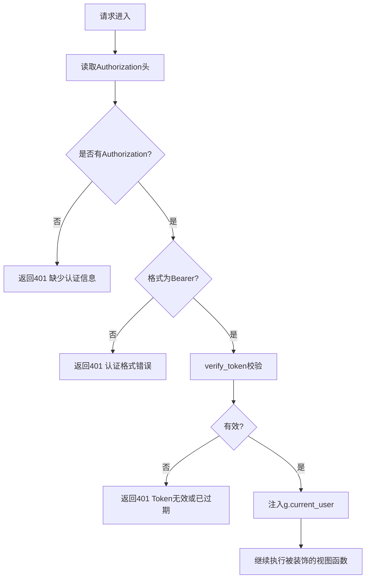
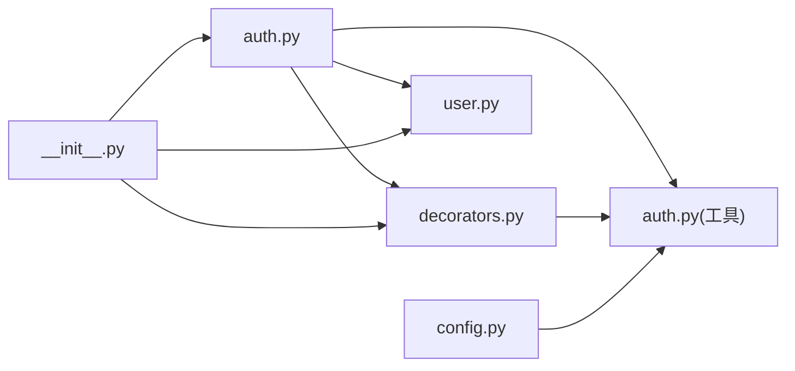

# 认证蓝图

<cite>
**本文引用的文件**
- [backend/app/api/auth.py](file://backend/app/api/auth.py)
- [backend/app/utils/auth.py](file://backend/app/utils/auth.py)
- [backend/app/utils/decorators.py](file://backend/app/utils/decorators.py)
- [backend/app/models/user.py](file://backend/app/models/user.py)
- [backend/app/config.py](file://backend/app/config.py)
- [backend/app/__init__.py](file://backend/app/__init__.py)
- [frontend/src/api/auth.js](file://frontend/src/api/auth.js)
- [frontend/src/api/request.js](file://frontend/src/api/request.js)
- [frontend/src/stores/user.js](file://frontend/src/stores/user.js)
</cite>

## 目录
1. [简介](#简介)
2. [项目结构](#项目结构)
3. [核心组件](#核心组件)
4. [架构总览](#架构总览)
5. [详细组件分析](#详细组件分析)
6. [依赖分析](#依赖分析)
7. [性能考虑](#性能考虑)
8. [故障排查指南](#故障排查指南)
9. [结论](#结论)
10. [附录](#附录)

## 简介
本文件为认证蓝图的详细API文档，覆盖用户认证系统的关键实现：JWT Token生成与验证流程、密码加密存储策略、登录接口、用户信息获取接口、密码修改接口以及认证中间件的使用方法与最佳实践。文档同时提供完整的API调用示例、请求参数、响应格式与错误处理说明，并给出前后端集成要点与安全建议。

## 项目结构
认证相关的核心代码分布在后端Flask应用的蓝图与工具模块中，前端通过Axios封装统一请求拦截器自动附加JWT Bearer Token，Pinia Store负责本地持久化与状态管理。

图表来源
- [backend/app/__init__.py:37-62](file://backend/app/__init__.py#L37-L62)
- [backend/app/api/auth.py:11-184](file://backend/app/api/auth.py#L11-L184)
- [backend/app/utils/auth.py:11-83](file://backend/app/utils/auth.py#L11-L83)
- [backend/app/utils/decorators.py:9-95](file://backend/app/utils/decorators.py#L9-L95)
- [backend/app/models/user.py:39-183](file://backend/app/models/user.py#L39-L183)
- [backend/app/config.py:4-21](file://backend/app/config.py#L4-L21)
- [frontend/src/api/request.js:13-51](file://frontend/src/api/request.js#L13-L51)
- [frontend/src/api/auth.js:3-13](file://frontend/src/api/auth.js#L3-L13)
- [frontend/src/stores/user.js:13-37](file://frontend/src/stores/user.js#L13-L37)

章节来源
- [backend/app/__init__.py:37-62](file://backend/app/__init__.py#L37-L62)
- [backend/app/config.py:4-21](file://backend/app/config.py#L4-L21)

## 核心组件
- 认证蓝图：提供登录、获取当前用户资料、修改密码三个接口，均采用JSON请求体与统一响应结构。
- 认证工具：封装JWT生成与校验、密码哈希生成与验证。
- 权限装饰器：@jwt_required从Authorization头提取Bearer Token并注入g.current_user；@role_required用于角色级权限控制。
- 用户模型：提供按用户名/ID查询用户、更新密码等数据库操作。
- 配置：定义JWT密钥、过期时长、数据库连接等全局配置。
- 前端请求封装：统一设置Authorization头、集中错误处理与登出逻辑。

章节来源
- [backend/app/api/auth.py:14-184](file://backend/app/api/auth.py#L14-L184)
- [backend/app/utils/auth.py:11-83](file://backend/app/utils/auth.py#L11-L83)
- [backend/app/utils/decorators.py:9-95](file://backend/app/utils/decorators.py#L9-L95)
- [backend/app/models/user.py:39-183](file://backend/app/models/user.py#L39-L183)
- [backend/app/config.py:4-21](file://backend/app/config.py#L4-L21)
- [frontend/src/api/request.js:13-51](file://frontend/src/api/request.js#L13-L51)

## 架构总览
认证系统遵循“前端请求拦截器附加Token -> 后端装饰器解析Token -> 业务接口执行”的链路。JWT密钥与过期时间由配置文件提供，密码以哈希形式存储，登录时比对哈希，改密时先验证旧密码再更新哈希。

图表来源
- [frontend/src/api/request.js:13-23](file://frontend/src/api/request.js#L13-L23)
- [backend/app/api/auth.py:85-115](file://backend/app/api/auth.py#L85-L115)
- [backend/app/utils/decorators.py:20-56](file://backend/app/utils/decorators.py#L20-L56)
- [backend/app/utils/auth.py:38-56](file://backend/app/utils/auth.py#L38-L56)
- [backend/app/models/user.py:61-80](file://backend/app/models/user.py#L61-L80)

## 详细组件分析

### 登录接口
- 接口路径：POST /api/auth/login
- 功能：接收用户名与密码，校验用户是否存在且已激活，验证密码哈希，签发JWT并返回用户信息与token。
- 请求体：
  - username: 字符串，必填
  - password: 字符串，必填
- 成功响应：
  - code: 200
  - message: "登录成功"
  - data.token: JWT字符串
  - data.user: 包含id、username、display_name、role
- 错误响应：
  - 400：请求体为空或缺少字段
  - 401：用户名或密码错误、用户被禁用
- 安全要点：
  - 密码以哈希形式存储，登录时仅比较哈希
  - 返回的token具有过期时间，需妥善保存

章节来源
- [backend/app/api/auth.py:14-82](file://backend/app/api/auth.py#L14-L82)
- [backend/app/utils/auth.py:11-35](file://backend/app/utils/auth.py#L11-L35)
- [backend/app/models/user.py:39-58](file://backend/app/models/user.py#L39-L58)

### 获取当前用户信息接口
- 接口路径：GET /api/auth/profile
- 鉴权：需要JWT认证（@jwt_required）
- 成功响应：
  - code: 200
  - data：包含id、username、display_name、role、is_active、created_at（ISO格式）
- 错误响应：
  - 401：缺少认证信息、Token无效或已过期
  - 404：用户不存在
- 前端集成：
  - Axios拦截器自动附加Authorization头
  - 响应拦截器统一处理非200状态与401登出逻辑

章节来源
- [backend/app/api/auth.py:85-115](file://backend/app/api/auth.py#L85-L115)
- [backend/app/utils/decorators.py:20-56](file://backend/app/utils/decorators.py#L20-L56)
- [frontend/src/api/request.js:13-51](file://frontend/src/api/request.js#L13-L51)

### 修改密码接口
- 接口路径：PUT /api/auth/password
- 鉴权：需要JWT认证（@jwt_required）
- 请求体：
  - old_password: 旧密码，必填
  - new_password: 新密码，必填，长度>=6
- 成功响应：
  - code: 200
  - message: "密码修改成功"
- 错误响应：
  - 400：请求体为空、缺少字段、旧密码错误、新密码长度不足
  - 404：用户不存在
  - 500：密码修改失败（数据库异常）
- 安全要点：
  - 先验证旧密码哈希，再更新为新密码哈希
  - 建议在生产环境增加复杂度要求与历史密码限制

章节来源
- [backend/app/api/auth.py:118-184](file://backend/app/api/auth.py#L118-L184)
- [backend/app/models/user.py:161-183](file://backend/app/models/user.py#L161-L183)

### JWT Token生成与验证流程
- 生成：
  - 载荷包含user_id、username、role、iat、exp（基于配置的过期小时数）
  - 使用HS256算法与配置中的JWT_SECRET_KEY签名
- 验证：
  - 解析并校验签名，捕获过期与无效Token异常
  - 返回payload或None
- 过期时间：
  - 默认24小时，可通过配置项调整

图表来源
- [backend/app/utils/auth.py:11-35](file://backend/app/utils/auth.py#L11-L35)
- [backend/app/utils/auth.py:38-56](file://backend/app/utils/auth.py#L38-L56)
- [backend/app/config.py:6-7](file://backend/app/config.py#L6-L7)

章节来源
- [backend/app/utils/auth.py:11-83](file://backend/app/utils/auth.py#L11-L83)
- [backend/app/config.py:6-7](file://backend/app/config.py#L6-L7)

### 认证中间件与权限装饰器
- @jwt_required：
  - 从Authorization头提取Bearer Token
  - 调用verify_token校验，失败返回401
  - 成功将user_id、username、role写入g.current_user供后续接口使用
- @role_required：
  - 必须在@jwt_required之后使用
  - 检查g.current_user['role']是否在允许列表内，否则返回403

图表来源
- [backend/app/utils/decorators.py:20-56](file://backend/app/utils/decorators.py#L20-L56)

章节来源
- [backend/app/utils/decorators.py:9-95](file://backend/app/utils/decorators.py#L9-L95)

### 密码加密存储策略
- 存储：数据库中仅保存password_hash，不保存明文密码
- 生成：使用Werkzeug的generate_password_hash生成哈希
- 验证：使用check_password_hash对比明文与存储的哈希
- 用户模型：
  - 创建用户时即生成哈希并入库
  - 更新密码时同样以哈希形式写入

章节来源
- [backend/app/models/user.py:8-36](file://backend/app/models/user.py#L8-L36)
- [backend/app/models/user.py:161-183](file://backend/app/models/user.py#L161-L183)
- [backend/app/utils/auth.py:58-82](file://backend/app/utils/auth.py#L58-L82)

### 前后端集成与最佳实践
- 前端：
  - 请求拦截器自动附加Authorization: Bearer <token>
  - 响应拦截器统一处理非200与401（清空localStorage并跳转登录页）
  - Pinia Store持久化token与用户信息，提供isLoggedIn、isAdmin等计算属性
- 最佳实践：
  - 生产环境务必设置独立的JWT_SECRET_KEY与DB凭据
  - 建议缩短过期时间或引入刷新Token机制
  - 建议在改密接口增加旧密码匹配次数限制与日志审计
  - 建议在登录接口增加账户锁定阈值与验证码

章节来源
- [frontend/src/api/request.js:13-51](file://frontend/src/api/request.js#L13-L51)
- [frontend/src/stores/user.js:13-37](file://frontend/src/stores/user.js#L13-L37)
- [frontend/src/api/auth.js:3-13](file://frontend/src/api/auth.js#L3-L13)

## 依赖分析
- 认证蓝图依赖认证工具生成JWT、依赖装饰器进行鉴权、依赖用户模型进行数据库操作。
- 装饰器依赖认证工具进行Token校验。
- 应用初始化时注册所有蓝图，确保认证蓝图可用。
- 配置提供JWT密钥与过期时间，影响认证工具行为。

图表来源
- [backend/app/api/auth.py:7-9](file://backend/app/api/auth.py#L7-L9)
- [backend/app/utils/decorators.py:6](file://backend/app/utils/decorators.py#L6)
- [backend/app/utils/auth.py:4-6](file://backend/app/utils/auth.py#L4-L6)
- [backend/app/__init__.py:39-51](file://backend/app/__init__.py#L39-L51)
- [backend/app/config.py:6](file://backend/app/config.py#L6)

章节来源
- [backend/app/api/auth.py:7-9](file://backend/app/api/auth.py#L7-L9)
- [backend/app/utils/decorators.py:6](file://backend/app/utils/decorators.py#L6)
- [backend/app/utils/auth.py:4-6](file://backend/app/utils/auth.py#L4-L6)
- [backend/app/__init__.py:39-51](file://backend/app/__init__.py#L39-L51)
- [backend/app/config.py:6](file://backend/app/config.py#L6)

## 性能考虑
- Token生成与校验开销极小，主要瓶颈在数据库查询与密码哈希计算。
- 建议：
  - 对频繁访问的用户资料接口可考虑短期缓存（注意与数据库一致性）。
  - 合理设置JWT过期时间，平衡安全性与用户体验。
  - 在高并发场景下，确保数据库连接池配置合理。

## 故障排查指南
- 400 错误（请求体为空/字段缺失/密码长度不足）：
  - 检查请求体JSON格式与必填字段
  - 确认新密码长度满足最小要求
- 401 错误（缺少认证信息/认证格式错误/Token无效或已过期/用户名或密码错误/用户被禁用）：
  - 确认Authorization头格式为Bearer <token>
  - 检查本地token是否过期或被篡改
  - 确认用户状态为激活
- 403 错误（权限不足）：
  - 确认当前用户角色在允许列表内
- 500 错误（密码修改失败/用户创建失败）：
  - 检查数据库连接与事务提交
  - 查看后端日志定位具体异常

章节来源
- [backend/app/api/auth.py:25-61](file://backend/app/api/auth.py#L25-L61)
- [backend/app/api/auth.py:130-183](file://backend/app/api/auth.py#L130-L183)
- [backend/app/utils/decorators.py:24-45](file://backend/app/utils/decorators.py#L24-L45)
- [backend/app/utils/decorators.py:76-88](file://backend/app/utils/decorators.py#L76-L88)

## 结论
认证蓝图提供了简洁可靠的JWT认证体系：登录时严格校验用户状态与密码哈希，签发带过期时间的Token；受保护接口通过装饰器自动解析与注入用户信息；密码以哈希形式存储，配合前端统一拦截器与状态管理，形成完整的认证闭环。建议在生产环境中强化密钥管理、过期策略与安全审计，并根据业务需求扩展角色权限与多因子认证。

## 附录

### API调用示例

- 登录
  - 请求
    - 方法：POST
    - 路径：/api/auth/login
    - 请求体：{"username": "...", "password": "..."}
  - 成功响应
    - 状态码：200
    - 响应体：{"code": 200, "message": "登录成功", "data": {"token": "...", "user": {"id": "...", "username": "...", "display_name": "...", "role": "..."}}}
  - 失败响应
    - 400：请求体为空或缺少字段
    - 401：用户名或密码错误、用户被禁用

- 获取当前用户信息
  - 请求
    - 方法：GET
    - 路径：/api/auth/profile
    - 头部：Authorization: Bearer <token>
  - 成功响应
    - 状态码：200
    - 响应体：{"code": 200, "data": {"id": "...", "username": "...", "display_name": "...", "role": "...", "is_active": true/false, "created_at": "ISO时间字符串"}}
  - 失败响应
    - 401：缺少认证信息/认证格式错误/Token无效或已过期
    - 404：用户不存在

- 修改密码
  - 请求
    - 方法：PUT
    - 路径：/api/auth/password
    - 头部：Authorization: Bearer <token>
    - 请求体：{"old_password": "...", "new_password": "长度>=6"}
  - 成功响应
    - 状态码：200
    - 响应体：{"code": 200, "message": "密码修改成功"}
  - 失败响应
    - 400：请求体为空/缺少字段/旧密码错误/新密码长度不足
    - 404：用户不存在
    - 500：密码修改失败

章节来源
- [backend/app/api/auth.py:14-82](file://backend/app/api/auth.py#L14-L82)
- [backend/app/api/auth.py:85-115](file://backend/app/api/auth.py#L85-L115)
- [backend/app/api/auth.py:118-184](file://backend/app/api/auth.py#L118-L184)
- [frontend/src/api/request.js:13-51](file://frontend/src/api/request.js#L13-L51)