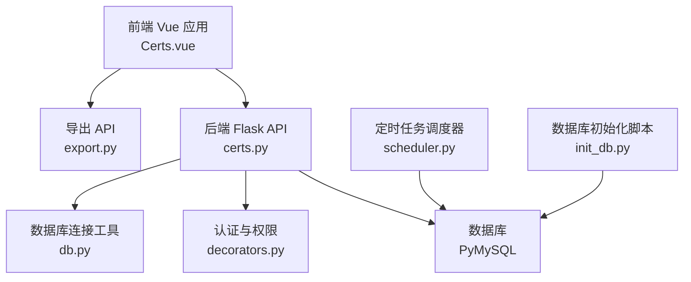
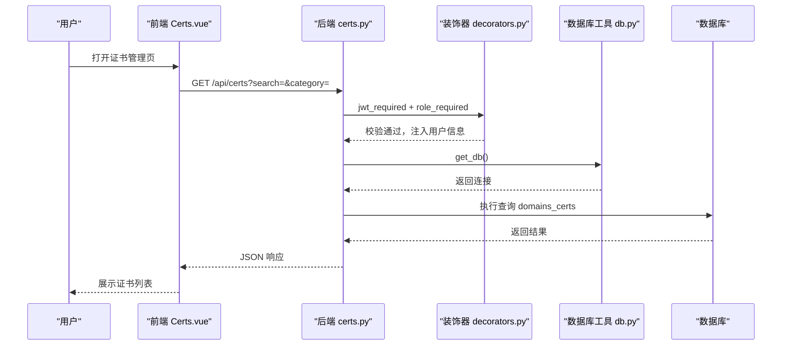
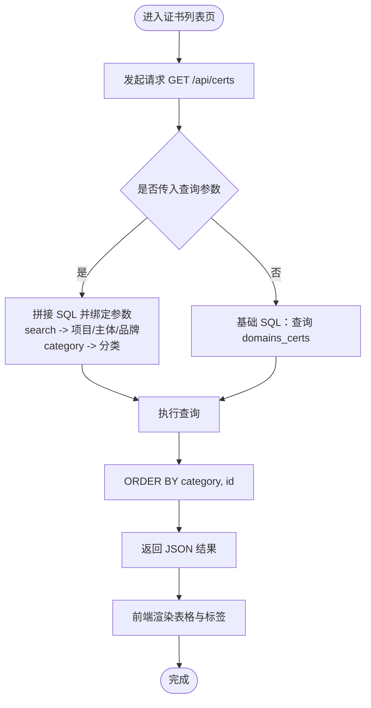
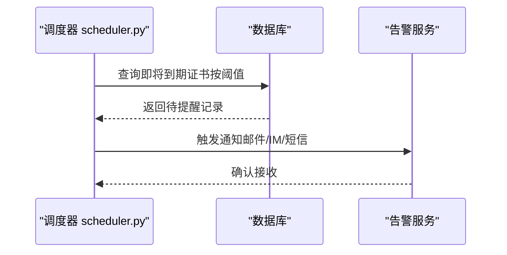
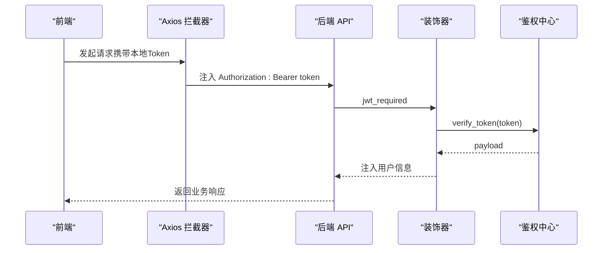
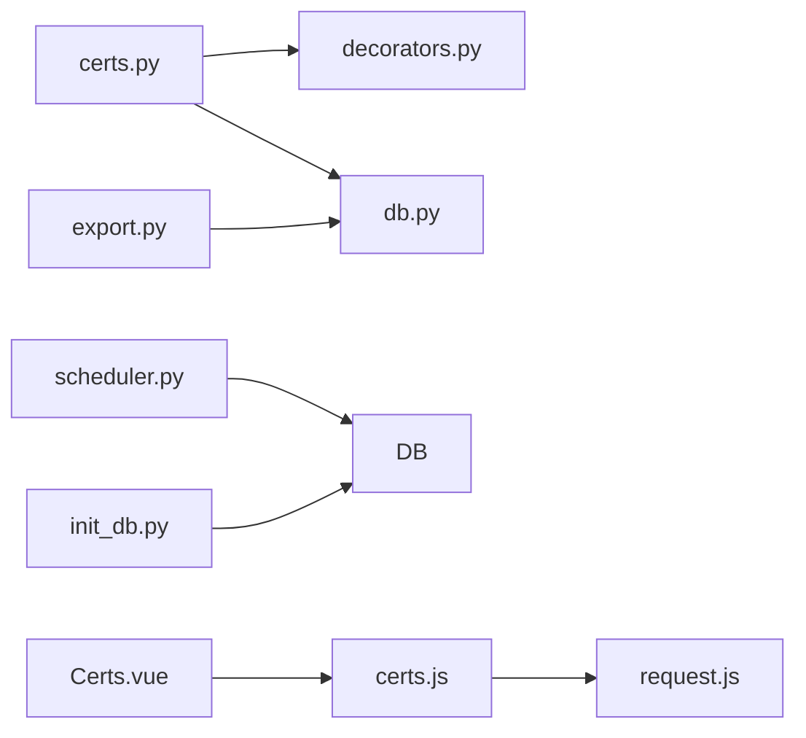

# 证书管理蓝图

<cite>
**本文引用的文件**
- [backend/app/api/certs.py](file://backend/app/api/certs.py)
- [backend/app/utils/db.py](file://backend/app/utils/db.py)
- [backend/app/utils/decorators.py](file://backend/app/utils/decorators.py)
- [backend/app/utils/scheduler.py](file://backend/app/utils/scheduler.py)
- [backend/app/api/export.py](file://backend/app/api/export.py)
- [backend/init_db.py](file://backend/init_db.py)
- [backend/app/config.py](file://backend/app/config.py)
- [frontend/src/api/certs.js](file://frontend/src/api/certs.js)
- [frontend/src/views/Certs.vue](file://frontend/src/views/Certs.vue)
- [frontend/src/api/request.js](file://frontend/src/api/request.js)
</cite>

## 目录
1. [简介](#简介)
2. [项目结构](#项目结构)
3. [核心组件](#核心组件)
4. [架构总览](#架构总览)
5. [详细组件分析](#详细组件分析)
6. [依赖分析](#依赖分析)
7. [性能考虑](#性能考虑)
8. [故障排查指南](#故障排查指南)
9. [结论](#结论)
10. [附录](#附录)

## 简介
本文件为“证书管理蓝图”项目的API文档，聚焦于域名证书的全生命周期管理能力，覆盖以下主题：
- 证书CRUD操作：创建、读取、更新、删除
- 证书列表查询：支持按分类与关键词过滤、排序规则说明
- 证书到期提醒与状态监控：基于剩余天数的状态标签与到期预警策略
- 导入导出：Excel批量导出“域名证书”工作表
- 安全与访问控制：JWT认证与角色授权
- 未来扩展建议：到期提醒与自动通知、状态监控接口、导入功能

本项目采用前后端分离架构：前端使用Vue 3 + Element Plus，通过Axios统一请求；后端使用Flask + PyMySQL，提供REST API，并通过APScheduler实现定时任务调度。

## 项目结构
- 后端
  - API层：路由定义与业务入口，如证书管理、导出等
  - 工具层：数据库连接、认证与权限装饰器、定时任务调度
  - 初始化：数据库表结构初始化脚本
- 前端
  - 页面组件：证书管理页面，包含查询、新增、编辑、删除交互
  - API封装：对后端接口的调用封装
  - 请求拦截：统一注入JWT Token与错误处理

图表来源
- [backend/app/api/certs.py:1-145](file://backend/app/api/certs.py#L1-L145)
- [backend/app/api/export.py:1-263](file://backend/app/api/export.py#L1-L263)
- [backend/app/utils/db.py:1-17](file://backend/app/utils/db.py#L1-L17)
- [backend/app/utils/decorators.py:1-95](file://backend/app/utils/decorators.py#L1-L95)
- [backend/app/utils/scheduler.py:1-249](file://backend/app/utils/scheduler.py#L1-L249)
- [backend/init_db.py:1-263](file://backend/init_db.py#L1-L263)

章节来源
- [backend/app/api/certs.py:1-145](file://backend/app/api/certs.py#L1-L145)
- [backend/app/api/export.py:1-263](file://backend/app/api/export.py#L1-L263)
- [backend/app/utils/db.py:1-17](file://backend/app/utils/db.py#L1-L17)
- [backend/app/utils/decorators.py:1-95](file://backend/app/utils/decorators.py#L1-L95)
- [backend/app/utils/scheduler.py:1-249](file://backend/app/utils/scheduler.py#L1-L249)
- [backend/init_db.py:1-263](file://backend/init_db.py#L1-L263)

## 核心组件
- 证书API蓝图：提供证书列表查询、创建、更新、删除接口
- 数据库工具：提供统一的数据库连接获取方法
- 权限装饰器：JWT认证与角色校验
- 导出API：将“域名证书”表导出为Excel
- 定时任务调度器：通用调度器，可为到期提醒等功能提供基础
- 前端页面与API封装：证书列表展示、查询、新增/编辑、删除

章节来源
- [backend/app/api/certs.py:1-145](file://backend/app/api/certs.py#L1-L145)
- [backend/app/utils/db.py:1-17](file://backend/app/utils/db.py#L1-L17)
- [backend/app/utils/decorators.py:1-95](file://backend/app/utils/decorators.py#L1-L95)
- [backend/app/api/export.py:1-263](file://backend/app/api/export.py#L1-L263)
- [backend/app/utils/scheduler.py:1-249](file://backend/app/utils/scheduler.py#L1-L249)
- [frontend/src/views/Certs.vue:1-336](file://frontend/src/views/Certs.vue#L1-L336)
- [frontend/src/api/certs.js:1-18](file://frontend/src/api/certs.js#L1-L18)

## 架构总览
后端以Blueprint组织API，证书管理位于“/api/certs”，通过装饰器实现JWT认证与角色控制；数据库连接通过工具方法统一获取；前端通过Axios封装的请求对象统一访问后端接口。

图表来源
- [backend/app/api/certs.py:11-44](file://backend/app/api/certs.py#L11-L44)
- [backend/app/utils/decorators.py:9-56](file://backend/app/utils/decorators.py#L9-L56)
- [backend/app/utils/db.py:5-17](file://backend/app/utils/db.py#L5-L17)

章节来源
- [backend/app/api/certs.py:1-145](file://backend/app/api/certs.py#L1-L145)
- [backend/app/utils/decorators.py:1-95](file://backend/app/utils/decorators.py#L1-L95)
- [backend/app/utils/db.py:1-17](file://backend/app/utils/db.py#L1-L17)

## 详细组件分析

### 证书CRUD API
- 接口概览
  - 列表查询：GET /api/certs（支持查询参数：search、category）
  - 新增：POST /api/certs（需管理员或运营人员）
  - 更新：PUT /api/certs/{id}（需管理员或运营人员）
  - 删除：DELETE /api/certs/{id}（需管理员或运营人员）

- 查询参数
  - search：支持项目/主体/品牌模糊匹配
  - category：证书分类过滤
  - 默认排序：按分类与主键升序

- 字段说明（对应 domains_certs 表）
  - seq_no：编号
  - category：分类（公众平台/域名/SSL证书）
  - project：项目
  - entity：主体（如域名）
  - purchase_date：购买日期
  - expire_date：到期日期
  - cost：费用（元）
  - remaining_days：剩余天数
  - brand：品牌
  - status：状态（正常/即将过期/已过期/已注销）
  - remark：备注

- 访问控制
  - 所有写操作均要求JWT认证并通过角色校验（admin/operator）

章节来源
- [backend/app/api/certs.py:11-145](file://backend/app/api/certs.py#L11-L145)
- [backend/app/utils/decorators.py:9-95](file://backend/app/utils/decorators.py#L9-L95)
- [backend/init_db.py:146-166](file://backend/init_db.py#L146-L166)

### 证书列表查询
- 功能特性
  - 支持按分类过滤与关键词模糊搜索
  - 默认按分类与ID排序
  - 前端页面提供分类下拉与关键词输入框

- 前端交互
  - 搜索按钮触发查询
  - 重置按钮清空条件并刷新
  - 表格展示字段包含：编号、分类、项目、主体、购买日期、到期日期、费用、剩余天数、品牌、状态、备注

- 状态与剩余天数视觉化
  - 剩余天数标签颜色策略：小于0为信息色、0~30为危险色、30~90为警告色、>=90为成功色
  - 状态标签颜色策略：正常/即将过期/已过期/已注销对应不同语义色

图表来源
- [backend/app/api/certs.py:11-44](file://backend/app/api/certs.py#L11-L44)
- [frontend/src/views/Certs.vue:184-232](file://frontend/src/views/Certs.vue#L184-L232)

章节来源
- [backend/app/api/certs.py:11-44](file://backend/app/api/certs.py#L11-L44)
- [frontend/src/views/Certs.vue:1-336](file://frontend/src/views/Certs.vue#L1-L336)

### 证书到期提醒与状态监控
- 现状
  - 前端通过剩余天数字段进行状态标签化展示
  - 状态字段支持“正常/即将过期/已过期/已注销”
  - 未发现后端内置的到期提醒或自动通知接口

- 建议实现方案
  - 新增到期提醒接口：按剩余天数阈值（如7/30/90天）查询即将到期证书
  - 新增状态监控接口：计算剩余天数、校验状态、返回链路完整性建议
  - 基于调度器（scheduler.py）实现定时扫描与告警任务

图表来源
- [backend/app/utils/scheduler.py:1-249](file://backend/app/utils/scheduler.py#L1-L249)

章节来源
- [backend/app/utils/scheduler.py:1-249](file://backend/app/utils/scheduler.py#L1-L249)
- [frontend/src/views/Certs.vue:305-320](file://frontend/src/views/Certs.vue#L305-L320)

### 证书导入导出
- 导出
  - 接口：GET /api/export/excel
  - 输出：包含“服务器管理/服务管理/应用系统/域名证书”四个工作表的Excel文件
  - “域名证书”工作表字段：序号、编号、分类、项目、主体、购买日期、到期日期、费用、剩余天数、品牌、状态、备注
  - 样式：表头加粗、居中、带边框；单元格带边框；列宽自适应

- 导入
  - 当前未提供导入接口
  - 建议：提供Excel模板下载与导入解析接口，支持批量写入domains_certs表

章节来源
- [backend/app/api/export.py:64-263](file://backend/app/api/export.py#L64-L263)
- [backend/init_db.py:146-166](file://backend/init_db.py#L146-L166)

### 安全存储与访问控制
- 认证
  - JWT：后端通过装饰器校验Authorization头中的Bearer Token
  - 前端：Axios请求拦截器自动注入本地存储的Token
  - 过期处理：响应拦截器检测401并跳转登录页

- 授权
  - 角色校验：仅admin/operator可执行写操作
  - 未认证或权限不足时返回相应HTTP状态码与错误信息

图表来源
- [frontend/src/api/request.js:14-23](file://frontend/src/api/request.js#L14-L23)
- [backend/app/utils/decorators.py:9-56](file://backend/app/utils/decorators.py#L9-L56)

章节来源
- [backend/app/utils/decorators.py:1-95](file://backend/app/utils/decorators.py#L1-L95)
- [frontend/src/api/request.js:1-54](file://frontend/src/api/request.js#L1-L54)

## 依赖分析
- 组件耦合
  - 证书API依赖数据库工具与权限装饰器
  - 导出API依赖数据库工具与Excel库
  - 定时任务调度器独立于业务API，但共享数据库配置

- 外部依赖
  - Flask、PyMySQL、APScheduler、OpenPyXL、Element Plus、Axios

图表来源
- [backend/app/api/certs.py:1-145](file://backend/app/api/certs.py#L1-L145)
- [backend/app/api/export.py:1-263](file://backend/app/api/export.py#L1-L263)
- [backend/app/utils/db.py:1-17](file://backend/app/utils/db.py#L1-L17)
- [backend/app/utils/decorators.py:1-95](file://backend/app/utils/decorators.py#L1-L95)
- [backend/app/utils/scheduler.py:1-249](file://backend/app/utils/scheduler.py#L1-L249)
- [backend/init_db.py:1-263](file://backend/init_db.py#L1-L263)
- [frontend/src/views/Certs.vue:1-336](file://frontend/src/views/Certs.vue#L1-L336)
- [frontend/src/api/certs.js:1-18](file://frontend/src/api/certs.js#L1-L18)
- [frontend/src/api/request.js:1-54](file://frontend/src/api/request.js#L1-L54)

章节来源
- [backend/app/api/certs.py:1-145](file://backend/app/api/certs.py#L1-L145)
- [backend/app/api/export.py:1-263](file://backend/app/api/export.py#L1-L263)
- [backend/app/utils/db.py:1-17](file://backend/app/utils/db.py#L1-L17)
- [backend/app/utils/decorators.py:1-95](file://backend/app/utils/decorators.py#L1-L95)
- [backend/app/utils/scheduler.py:1-249](file://backend/app/utils/scheduler.py#L1-L249)
- [backend/init_db.py:1-263](file://backend/init_db.py#L1-L263)
- [frontend/src/views/Certs.vue:1-336](file://frontend/src/views/Certs.vue#L1-L336)
- [frontend/src/api/certs.js:1-18](file://frontend/src/api/certs.js#L1-L18)
- [frontend/src/api/request.js:1-54](file://frontend/src/api/request.js#L1-L54)

## 性能考虑
- 查询优化
  - domains_certs表存在category与status索引，建议在高频查询场景下结合这两个字段
  - 列表查询默认按category与id排序，避免大结果集全量排序

- 数据库连接
  - 使用工具方法统一获取连接，确保连接池与字符集配置一致

- 前端渲染
  - 表格支持省略号与宽度适配，提升大数据量下的可读性

- 导出性能
  - Excel导出涉及多表查询与样式设置，建议在后台任务中异步执行并提供下载链接

## 故障排查指南
- 认证失败
  - 缺少Authorization头或格式不正确：返回401
  - Token无效或过期：返回401
  - 建议：确认前端已正确存储Token并在请求头注入

- 权限不足
  - 非admin/operator执行写操作：返回403
  - 建议：确认用户角色配置

- 数据库异常
  - 写操作回滚：检查字段类型与约束
  - 建议：查看后端日志与数据库错误信息

- 导出失败
  - 异常捕获并返回500错误信息
  - 建议：检查Excel库依赖与临时目录权限

章节来源
- [backend/app/utils/decorators.py:22-46](file://backend/app/utils/decorators.py#L22-L46)
- [backend/app/api/certs.py:72-78](file://backend/app/api/certs.py#L72-L78)
- [backend/app/api/export.py:258-261](file://backend/app/api/export.py#L258-L261)

## 结论
本蓝图提供了完整的证书CRUD与列表查询能力，并通过前端状态标签直观展示到期风险。当前缺少内置的到期提醒与自动通知接口，以及证书导入功能。建议后续扩展：
- 新增到期提醒与状态监控接口
- 基于调度器实现定时扫描与告警
- 提供Excel导入接口与模板
- 增强安全存储与审计日志

## 附录

### API定义总览
- 证书列表查询
  - 方法：GET
  - 路径：/api/certs
  - 查询参数：search（关键词）、category（分类）
  - 返回：JSON，包含code与data数组

- 新增证书
  - 方法：POST
  - 路径：/api/certs
  - 请求体：证书字段集合
  - 返回：JSON，包含code、message与新增记录id

- 更新证书
  - 方法：PUT
  - 路径：/api/certs/{id}
  - 请求体：可选字段集合
  - 返回：JSON，包含code与message

- 删除证书
  - 方法：DELETE
  - 路径：/api/certs/{id}
  - 返回：JSON，包含code与message

- 导出Excel
  - 方法：GET
  - 路径：/api/export/excel
  - 返回：Excel文件流

章节来源
- [backend/app/api/certs.py:11-145](file://backend/app/api/certs.py#L11-L145)
- [backend/app/api/export.py:64-263](file://backend/app/api/export.py#L64-L263)
- [frontend/src/api/certs.js:1-18](file://frontend/src/api/certs.js#L1-L18)