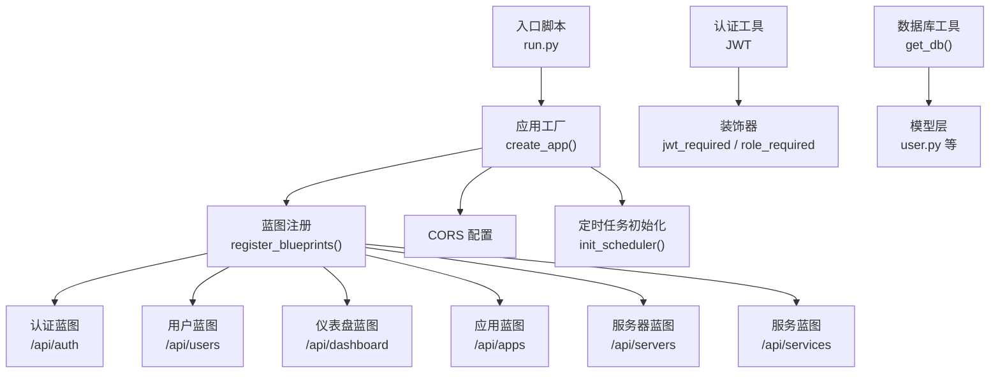
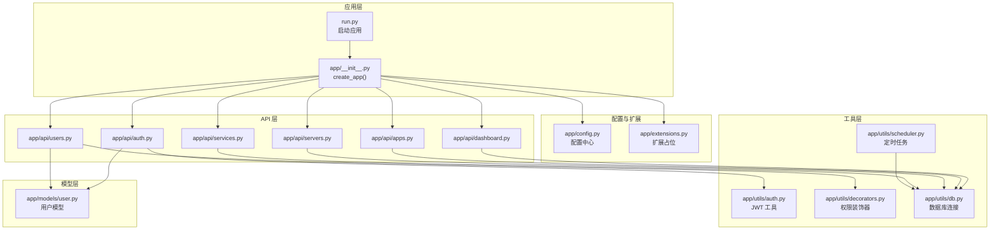
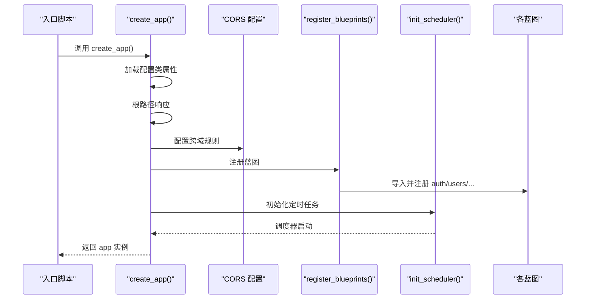
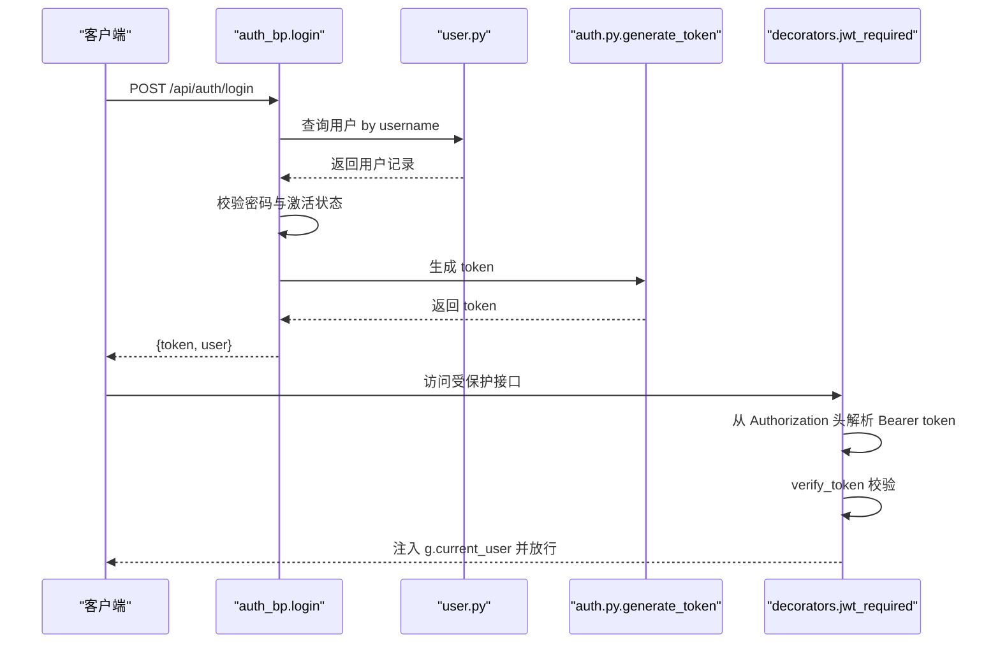
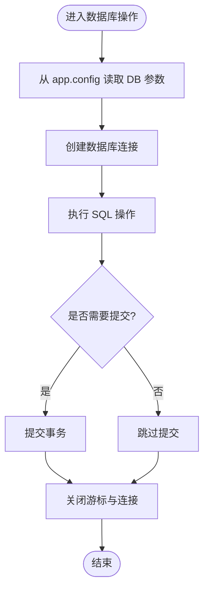
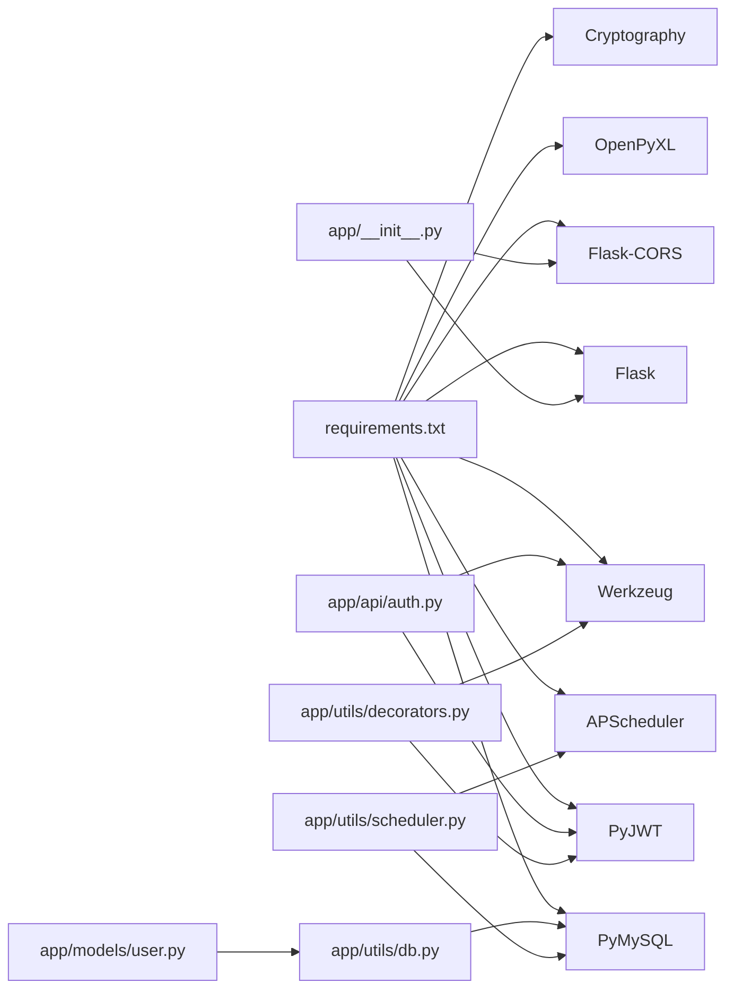

# 后端架构设计

<cite>
**本文引用的文件**
- [app/__init__.py](file://backend/app/__init__.py)
- [app/config.py](file://backend/app/config.py)
- [app/extensions.py](file://backend/app/extensions.py)
- [run.py](file://backend/run.py)
- [app/utils/db.py](file://backend/app/utils/db.py)
- [app/utils/auth.py](file://backend/app/utils/auth.py)
- [app/utils/decorators.py](file://backend/app/utils/decorators.py)
- [app/utils/scheduler.py](file://backend/app/utils/scheduler.py)
- [app/models/user.py](file://backend/app/models/user.py)
- [app/api/auth.py](file://backend/app/api/auth.py)
- [app/api/users.py](file://backend/app/api/users.py)
- [app/api/dashboard.py](file://backend/app/api/dashboard.py)
- [app/api/apps.py](file://backend/app/api/apps.py)
- [app/api/servers.py](file://backend/app/api/servers.py)
- [app/api/services.py](file://backend/app/api/services.py)
- [requirements.txt](file://backend/requirements.txt)
</cite>

## 目录
1. [引言](#引言)
2. [项目结构](#项目结构)
3. [核心组件](#核心组件)
4. [架构总览](#架构总览)
5. [详细组件分析](#详细组件分析)
6. [依赖分析](#依赖分析)
7. [性能考虑](#性能考虑)
8. [故障排查指南](#故障排查指南)
9. [结论](#结论)
10. [附录](#附录)

## 引言
本设计文档面向云运维平台后端，系统性阐述基于 Flask 的应用工厂模式、蓝图注册机制与 CORS 跨域策略；详解 JWT 认证授权体系、权限控制装饰器、数据库连接池管理；说明 MVC 在 Flask 中的落地方式、模块化 API 组织与中间件/过滤器的使用；并给出架构决策的技术考量、性能优化策略与安全防护建议。

## 项目结构
后端采用“应用工厂 + 蓝图 + 工具层 + 模型层”的分层组织方式：
- 应用工厂与入口：通过工厂函数创建应用，集中配置 CORS、蓝图注册与定时任务初始化。
- 蓝图模块：按功能域划分 API 蓝图，统一前缀与权限控制。
- 工具层：认证、装饰器、数据库连接、定时任务调度等通用能力。
- 模型层：封装数据库访问函数，隔离业务逻辑与数据访问。
- 配置与扩展：集中管理配置项与未来扩展点。

图表来源
- [app/__init__.py:6-34](file://backend/app/__init__.py#L6-L34)
- [app/__init__.py:37-62](file://backend/app/__init__.py#L37-L62)
- [run.py:1-8](file://backend/run.py#L1-L8)

章节来源
- [app/__init__.py:1-62](file://backend/app/__init__.py#L1-L62)
- [run.py:1-8](file://backend/run.py#L1-L8)

## 核心组件
- 应用工厂与入口
  - 工厂函数负责创建 Flask 应用、加载配置、注册蓝图、初始化定时任务，并设置根路径响应。
  - 入口脚本通过工厂函数创建应用并按配置启动。
- 配置中心
  - 集中定义密钥、JWT 过期时间、数据库连接参数、上传目录与大小限制、调试与监听地址。
- 数据库连接
  - 通过工具函数获取连接，使用 DictCursor 返回字典结构，便于模型层直接消费。
- 认证与授权
  - JWT 工具：生成与校验 token，支持过期与非法 token 场景。
  - 权限装饰器：统一从 Authorization 头提取 Bearer token，注入 g.current_user 并支持角色白名单校验。
- 定时任务调度
  - 基于 APScheduler 的后台调度器，支持 Cron 表达式、任务并发执行与日志落库。
- 蓝图与 API
  - 每个功能域一个蓝图，统一前缀，结合装饰器实现鉴权与授权。

章节来源
- [app/__init__.py:6-34](file://backend/app/__init__.py#L6-L34)
- [app/__init__.py:37-62](file://backend/app/__init__.py#L37-L62)
- [app/config.py:4-21](file://backend/app/config.py#L4-L21)
- [app/utils/db.py:5-17](file://backend/app/utils/db.py#L5-L17)
- [app/utils/auth.py:11-56](file://backend/app/utils/auth.py#L11-L56)
- [app/utils/decorators.py:9-95](file://backend/app/utils/decorators.py#L9-L95)
- [app/utils/scheduler.py:201-249](file://backend/app/utils/scheduler.py#L201-L249)

## 架构总览
系统采用“应用工厂 + 蓝图 + 工具层 + 模型层”的分层架构，遵循 Flask 的 MVC 思想：
- 视图层：蓝图路由与视图函数，负责请求处理与响应。
- 控制器：装饰器与工具函数承担鉴权、授权、数据库连接等横切职责。
- 模型层：数据库访问函数封装 SQL 与连接生命周期管理。

图表来源
- [run.py:1-8](file://backend/run.py#L1-L8)
- [app/__init__.py:6-34](file://backend/app/__init__.py#L6-L34)
- [app/config.py:4-21](file://backend/app/config.py#L4-L21)
- [app/utils/auth.py:11-56](file://backend/app/utils/auth.py#L11-L56)
- [app/utils/decorators.py:9-95](file://backend/app/utils/decorators.py#L9-L95)
- [app/utils/db.py:5-17](file://backend/app/utils/db.py#L5-L17)
- [app/utils/scheduler.py:201-249](file://backend/app/utils/scheduler.py#L201-L249)
- [app/models/user.py:1-183](file://backend/app/models/user.py#L1-L183)
- [app/api/auth.py:1-184](file://backend/app/api/auth.py#L1-L184)
- [app/api/users.py:1-268](file://backend/app/api/users.py#L1-L268)
- [app/api/dashboard.py:1-91](file://backend/app/api/dashboard.py#L1-L91)
- [app/api/apps.py:1-168](file://backend/app/api/apps.py#L1-L168)
- [app/api/servers.py:1-232](file://backend/app/api/servers.py#L1-L232)
- [app/api/services.py:1-182](file://backend/app/api/services.py#L1-L182)

## 详细组件分析

### 应用工厂与蓝图注册
- 工厂函数职责
  - 加载配置类属性至 app.config。
  - 设置根路径响应，返回服务状态。
  - 配置 CORS，限定 /api/* 路由允许跨域并支持凭据。
  - 注册全部蓝图。
  - 初始化定时任务调度器。
- 蓝图注册
  - 统一导入各功能蓝图并在工厂内集中注册，便于扩展与维护。

图表来源
- [app/__init__.py:6-34](file://backend/app/__init__.py#L6-L34)
- [app/__init__.py:37-62](file://backend/app/__init__.py#L37-L62)
- [run.py:1-8](file://backend/run.py#L1-L8)

章节来源
- [app/__init__.py:6-34](file://backend/app/__init__.py#L6-L34)
- [app/__init__.py:37-62](file://backend/app/__init__.py#L37-L62)
- [run.py:1-8](file://backend/run.py#L1-L8)

### CORS 跨域配置策略
- 资源匹配：对 /api/* 路由启用跨域。
- 允许凭据：支持携带 Cookie 与自定义头。
- 生产建议：将 origins 限定为前端域名，避免使用通配符。

章节来源
- [app/__init__.py:24-25](file://backend/app/__init__.py#L24-L25)

### 认证授权系统（JWT）
- JWT 工具
  - 生成：包含用户标识、角色、签发与过期时间，使用 HS256 算法签名。
  - 校验：捕获过期与非法 token，返回空表示验证失败。
- 权限装饰器
  - jwt_required：从 Authorization 头解析 Bearer token，校验失败返回 401；成功则将用户信息注入 g.current_user。
  - role_required：在 jwt_required 之后使用，校验 g.current_user['role'] 是否在允许列表，否则返回 403。
- 登录流程
  - 校验用户名与密码，检查用户激活状态，生成 token 返回给客户端。

图表来源
- [app/api/auth.py:14-82](file://backend/app/api/auth.py#L14-L82)
- [app/models/user.py:39-58](file://backend/app/models/user.py#L39-L58)
- [app/utils/auth.py:11-56](file://backend/app/utils/auth.py#L11-L56)
- [app/utils/decorators.py:9-56](file://backend/app/utils/decorators.py#L9-L56)

章节来源
- [app/utils/auth.py:11-56](file://backend/app/utils/auth.py#L11-L56)
- [app/utils/decorators.py:9-95](file://backend/app/utils/decorators.py#L9-L95)
- [app/api/auth.py:14-82](file://backend/app/api/auth.py#L14-L82)
- [app/models/user.py:39-58](file://backend/app/models/user.py#L39-L58)

### 数据库连接池管理
- 连接获取
  - 通过工具函数从 app.config 读取数据库参数，创建连接并指定 DictCursor。
- 生命周期
  - 每次调用均新建连接，显式关闭；模型层在 finally 中确保释放资源。
- 连接池建议
  - 当前实现为每请求新建连接；生产环境建议引入连接池（如 PyMySQL 的连接池或 SQLAlchemy 池）以降低连接开销。

图表来源
- [app/utils/db.py:5-17](file://backend/app/utils/db.py#L5-L17)
- [app/models/user.py:23-36](file://backend/app/models/user.py#L23-L36)

章节来源
- [app/utils/db.py:5-17](file://backend/app/utils/db.py#L5-L17)
- [app/models/user.py:1-183](file://backend/app/models/user.py#L1-L183)

### MVC 在 Flask 中的应用
- 视图层（Blueprint + Route）
  - 各功能蓝图定义路由与视图函数，处理请求与响应。
- 控制器（装饰器与工具）
  - 权限装饰器承担鉴权与授权，JWT 工具负责 token 签发与校验。
- 模型层（数据库访问函数）
  - 封装 SQL 与连接生命周期，提供 CRUD 能力。

章节来源
- [app/api/auth.py:1-184](file://backend/app/api/auth.py#L1-L184)
- [app/api/users.py:1-268](file://backend/app/api/users.py#L1-L268)
- [app/models/user.py:1-183](file://backend/app/models/user.py#L1-L183)
- [app/utils/decorators.py:9-95](file://backend/app/utils/decorators.py#L9-L95)
- [app/utils/auth.py:11-56](file://backend/app/utils/auth.py#L11-L56)

### 模块化 API 组织方式
- 蓝图划分
  - 认证、用户、仪表盘、应用、服务器、服务等按领域拆分蓝图，统一前缀 /api/<domain>。
- 权限策略
  - 通过装饰器组合实现“登录必选 + 角色白名单”策略，保证接口安全。
- 查询与分页
  - 列表接口普遍支持多维查询参数与分页参数，提升可用性。

章节来源
- [app/api/dashboard.py:1-91](file://backend/app/api/dashboard.py#L1-L91)
- [app/api/apps.py:1-168](file://backend/app/api/apps.py#L1-L168)
- [app/api/servers.py:1-232](file://backend/app/api/servers.py#L1-L232)
- [app/api/services.py:1-182](file://backend/app/api/services.py#L1-L182)
- [app/api/users.py:1-268](file://backend/app/api/users.py#L1-L268)

### 中间件与过滤器的使用
- 自定义中间逻辑
  - 通过装饰器实现“前置校验 + 上下文注入”，例如 jwt_required 将用户信息注入 g，供后续处理器使用。
- 过滤与序列化
  - 在视图层对返回数据进行序列化处理（如日期转字符串），保证响应一致性。

章节来源
- [app/utils/decorators.py:9-95](file://backend/app/utils/decorators.py#L9-L95)
- [app/api/dashboard.py:12-17](file://backend/app/api/dashboard.py#L12-L17)

## 依赖分析
- 外部依赖
  - Flask、Flask-CORS、PyMySQL、PyJWT、Werkzeug、APScheduler、OpenPyXL、Cryptography。
- 内部依赖
  - 蓝图依赖装饰器与工具函数；模型层依赖数据库工具；调度器依赖数据库配置与连接。

图表来源
- [requirements.txt:1-9](file://backend/requirements.txt#L1-L9)
- [app/__init__.py:1-3](file://backend/app/__init__.py#L1-L3)
- [app/api/auth.py:4-9](file://backend/app/api/auth.py#L4-L9)
- [app/utils/decorators.py:4-6](file://backend/app/utils/decorators.py#L4-L6)
- [app/utils/db.py:1-2](file://backend/app/utils/db.py#L1-L2)
- [app/utils/scheduler.py:1-8](file://backend/app/utils/scheduler.py#L1-L8)
- [app/models/user.py:4-5](file://backend/app/models/user.py#L4-L5)

章节来源
- [requirements.txt:1-9](file://backend/requirements.txt#L1-L9)
- [app/__init__.py:1-3](file://backend/app/__init__.py#L1-L3)

## 性能考虑
- 连接管理
  - 当前为每请求新建连接，建议引入连接池以减少握手与上下文切换开销。
- 序列化与分页
  - 对大数据量返回进行分页与字段裁剪，避免一次性传输过多数据。
- 定时任务
  - 使用后台线程执行脚本，避免阻塞调度器；为长耗时任务设置超时与异常处理。
- 缓存与索引
  - 对高频查询建立合适索引；对静态数据可考虑缓存策略（需结合业务场景）。

## 故障排查指南
- 认证相关
  - 401 缺少或格式错误的 Authorization 头；401 Token 无效或已过期；确认密钥一致与过期时间合理。
- 授权相关
  - 403 角色不在白名单；确认装饰器顺序（先 jwt_required 再 role_required）。
- 数据库相关
  - 连接失败或超时：检查主机、端口、账号与网络；确认连接在 finally 中关闭。
- 定时任务
  - 任务未触发：检查 Cron 表达式与调度器状态；确认脚本路径存在且可执行。

章节来源
- [app/utils/decorators.py:22-56](file://backend/app/utils/decorators.py#L22-L56)
- [app/utils/auth.py:48-56](file://backend/app/utils/auth.py#L48-L56)
- [app/utils/db.py:5-17](file://backend/app/utils/db.py#L5-L17)
- [app/utils/scheduler.py:146-186](file://backend/app/utils/scheduler.py#L146-L186)

## 结论
该后端架构以应用工厂为核心，结合蓝图与工具层实现了清晰的职责分离与良好的扩展性。JWT 认证与装饰器提供了统一的安全控制；数据库工具与模型层分离了数据访问；定时任务调度器支撑了自动化运维场景。建议在生产环境中引入连接池、细化 CORS 策略、完善监控与日志体系，持续提升稳定性与可观测性。

## 附录
- 最佳实践清单
  - 配置管理：使用环境变量覆盖默认值，区分开发/测试/生产。
  - 安全加固：固定 JWT 密钥、缩短过期时间、限制 CORS 源、输入校验与参数绑定。
  - 可靠性：连接池化、超时与重试、幂等设计、异常捕获与降级。
  - 可维护性：模块化蓝图、统一响应结构、完善的文档与注释。