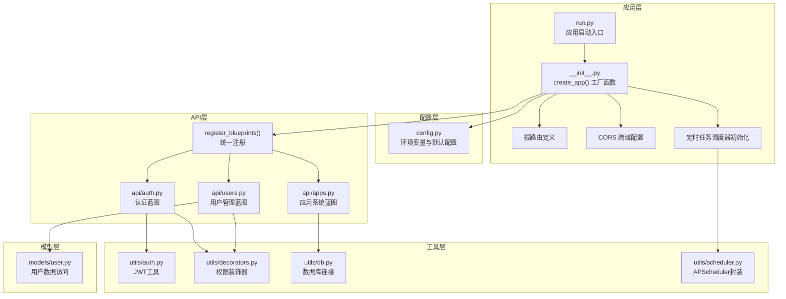
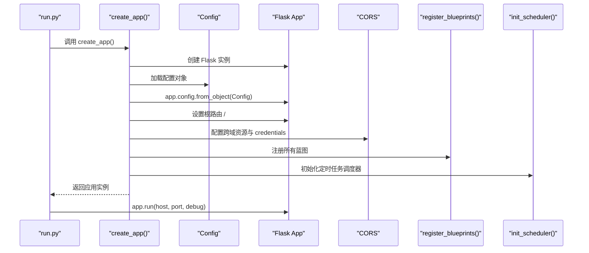
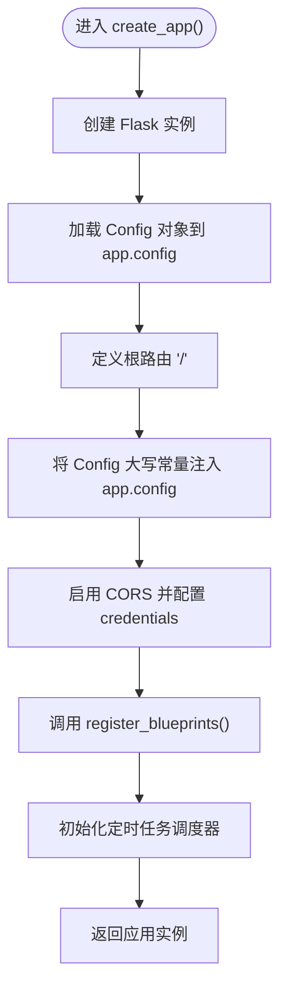
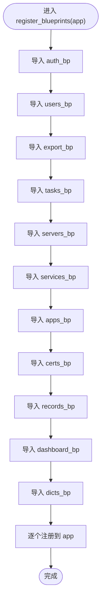
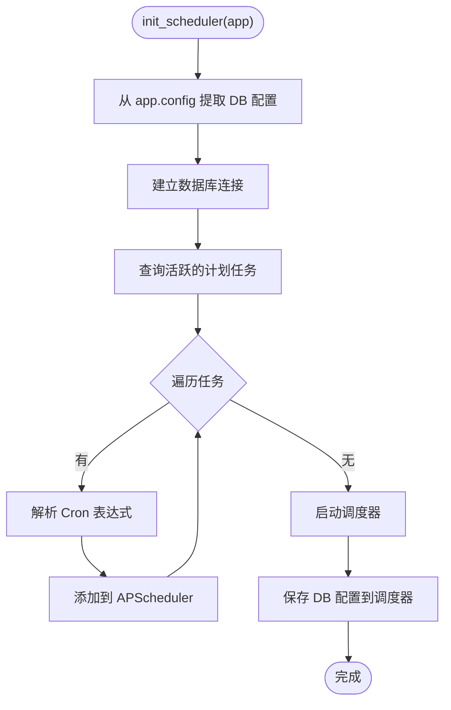
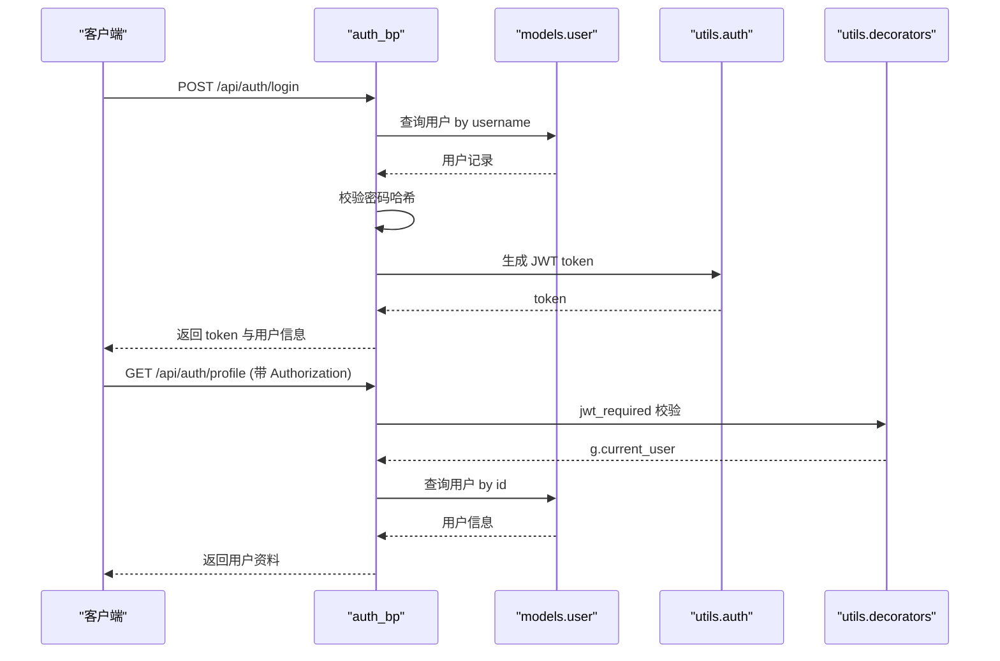
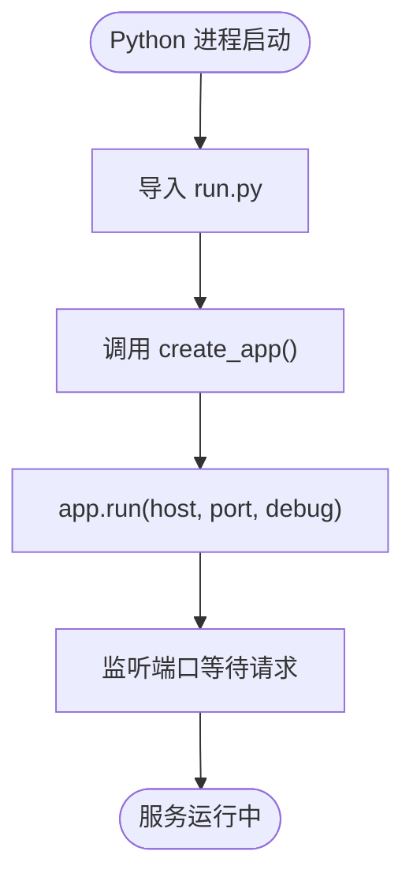
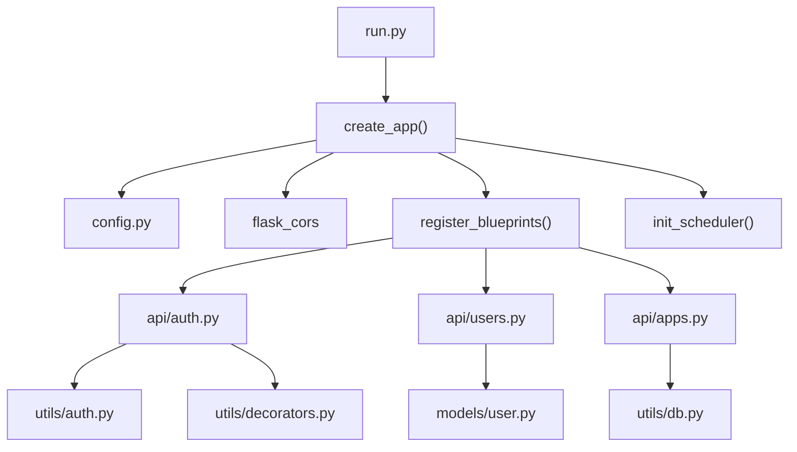

# 应用工厂模式

<cite>
**本文引用的文件**
- [backend/app/__init__.py](file://backend/app/__init__.py)
- [backend/app/config.py](file://backend/app/config.py)
- [backend/run.py](file://backend/run.py)
- [backend/app/extensions.py](file://backend/app/extensions.py)
- [backend/app/api/auth.py](file://backend/app/api/auth.py)
- [backend/app/api/users.py](file://backend/app/api/users.py)
- [backend/app/api/apps.py](file://backend/app/api/apps.py)
- [backend/app/utils/scheduler.py](file://backend/app/utils/scheduler.py)
- [backend/app/utils/auth.py](file://backend/app/utils/auth.py)
- [backend/app/utils/decorators.py](file://backend/app/utils/decorators.py)
- [backend/app/models/user.py](file://backend/app/models/user.py)
- [backend/app/utils/db.py](file://backend/app/utils/db.py)
- [backend/requirements.txt](file://backend/requirements.txt)
</cite>

## 目录
1. [简介](#简介)
2. [项目结构](#项目结构)
3. [核心组件](#核心组件)
4. [架构总览](#架构总览)
5. [详细组件分析](#详细组件分析)
6. [依赖分析](#依赖分析)
7. [性能考虑](#性能考虑)
8. [故障排查指南](#故障排查指南)
9. [结论](#结论)
10. [附录](#附录)

## 简介
本文件围绕云运维平台的Flask应用工厂模式展开，系统性阐述应用工厂函数create_app()的设计理念与实现细节，涵盖应用实例创建、配置加载机制、根路由定义、蓝图注册策略、CORS跨域配置以及应用启动流程。同时，结合实际代码路径，给出配置参数说明、错误处理机制、最佳实践建议与可视化图示，帮助开发者理解并高效使用Flask的模块化组织方式。

## 项目结构
后端采用典型的Flask项目分层组织：
- 应用入口与工厂：backend/app/__init__.py、backend/run.py
- 配置中心：backend/app/config.py
- 扩展预留：backend/app/extensions.py
- API蓝图：backend/app/api/*
- 工具与通用逻辑：backend/app/utils/*
- 数据模型：backend/app/models/*

图表来源
- [backend/app/__init__.py:1-62](file://backend/app/__init__.py#L1-L62)
- [backend/app/config.py:1-21](file://backend/app/config.py#L1-L21)
- [backend/run.py:1-8](file://backend/run.py#L1-L8)
- [backend/app/api/auth.py:1-184](file://backend/app/api/auth.py#L1-L184)
- [backend/app/api/users.py:1-268](file://backend/app/api/users.py#L1-L268)
- [backend/app/api/apps.py:1-168](file://backend/app/api/apps.py#L1-L168)
- [backend/app/utils/auth.py:1-83](file://backend/app/utils/auth.py#L1-L83)
- [backend/app/utils/decorators.py:1-95](file://backend/app/utils/decorators.py#L1-L95)
- [backend/app/models/user.py:1-183](file://backend/app/models/user.py#L1-L183)
- [backend/app/utils/db.py:1-17](file://backend/app/utils/db.py#L1-L17)
- [backend/app/utils/scheduler.py:1-249](file://backend/app/utils/scheduler.py#L1-L249)

章节来源
- [backend/app/__init__.py:1-62](file://backend/app/__init__.py#L1-L62)
- [backend/app/config.py:1-21](file://backend/app/config.py#L1-L21)
- [backend/run.py:1-8](file://backend/run.py#L1-L8)

## 核心组件
- 应用工厂函数 create_app()
  - 负责创建Flask应用实例、加载配置、注册根路由、启用CORS、注册所有蓝图、初始化定时任务调度器。
  - 关键实现位置：[backend/app/__init__.py:6-34](file://backend/app/__init__.py#L6-L34)
- 蓝图注册函数 register_blueprints()
  - 统一导入并注册各API蓝图，便于维护与扩展。
  - 关键实现位置：[backend/app/__init__.py:37-61](file://backend/app/__init__.py#L37-L61)
- 配置中心 Config
  - 从环境变量读取配置，提供默认值，覆盖app.config。
  - 关键实现位置：[backend/app/config.py:4-21](file://backend/app/config.py#L4-L21)
- 应用启动入口 run.py
  - 通过create_app()创建应用实例，并按配置启动开发服务器。
  - 关键实现位置：[backend/run.py:1-8](file://backend/run.py#L1-L8)

章节来源
- [backend/app/__init__.py:6-34](file://backend/app/__init__.py#L6-L34)
- [backend/app/__init__.py:37-61](file://backend/app/__init__.py#L37-L61)
- [backend/app/config.py:4-21](file://backend/app/config.py#L4-L21)
- [backend/run.py:1-8](file://backend/run.py#L1-L8)

## 架构总览
应用工厂模式将应用创建、配置、路由与扩展初始化集中在一个函数中，形成清晰的控制流与职责边界。下图展示应用启动的关键步骤与调用关系。

图表来源
- [backend/run.py:1-8](file://backend/run.py#L1-L8)
- [backend/app/__init__.py:6-34](file://backend/app/__init__.py#L6-L34)

## 详细组件分析

### 应用工厂函数 create_app()
- 设计理念
  - 将应用创建过程模块化，便于测试与部署；通过Config集中管理配置，避免硬编码。
  - 在工厂内部完成CORS与蓝图注册，确保应用启动即具备完整功能。
- 实现要点
  - 创建Flask实例并加载Config对象至app.config。
  - 定义根路由“/”，返回服务状态信息。
  - 动态将Config中的大写常量属性注入app.config，增强灵活性。
  - 启用CORS并对/api/*路径开放跨域且允许携带凭证。
  - 注册所有API蓝图。
  - 初始化定时任务调度器。
- 关键路径
  - [backend/app/__init__.py:6-34](file://backend/app/__init__.py#L6-L34)

图表来源
- [backend/app/__init__.py:6-34](file://backend/app/__init__.py#L6-L34)

章节来源
- [backend/app/__init__.py:6-34](file://backend/app/__init__.py#L6-L34)

### 蓝图注册函数 register_blueprints()
- 工作原理
  - 在工厂函数中统一导入各API蓝图模块，并调用app.register_blueprint()完成注册。
  - 便于集中管理与扩展新的API模块，遵循“开闭原则”。
- 注册清单
  - 认证：auth_bp
  - 用户管理：users_bp
  - 导出：export_bp
  - 任务：tasks_bp
  - 服务器：servers_bp
  - 服务：services_bp
  - 应用系统：apps_bp
  - 证书：certs_bp
  - 记录：records_bp
  - 仪表盘：dashboard_bp
  - 字典：dicts_bp
- 关键路径
  - [backend/app/__init__.py:37-61](file://backend/app/__init__.py#L37-L61)

图表来源
- [backend/app/__init__.py:37-61](file://backend/app/__init__.py#L37-L61)

章节来源
- [backend/app/__init__.py:37-61](file://backend/app/__init__.py#L37-L61)

### CORS跨域配置策略
- 配置目标
  - 对/api/*路径启用CORS，允许来自任意源的请求。
  - 启用supports_credentials=True，支持携带Cookie或Authorization头等凭证。
- 配置位置
  - [backend/app/__init__.py:24-25](file://backend/app/__init__.py#L24-L25)
- 注意事项
  - 生产环境中建议将origins限制为可信域名，避免安全风险。
  - 若前端使用自定义头部或凭证，需确保CORS配置与前端一致。

章节来源
- [backend/app/__init__.py:24-25](file://backend/app/__init__.py#L24-L25)

### 配置加载机制
- Config类
  - 从环境变量读取密钥、数据库连接信息、调试与网络参数，并设置默认值。
  - 关键字段：SECRET_KEY、JWT_SECRET_KEY、JWT_EXPIRATION_HOURS、DB_*、DEBUG、HOST、PORT、UPLOAD_FOLDER、MAX_CONTENT_LENGTH。
- 加载方式
  - 通过app.config.from_object(Config)一次性加载配置对象。
  - 通过循环遍历Config的大写常量属性，将其注入app.config，确保运行时可直接访问。
- 关键路径
  - [backend/app/config.py:4-21](file://backend/app/config.py#L4-L21)
  - [backend/app/__init__.py:8-22](file://backend/app/__init__.py#L8-L22)

章节来源
- [backend/app/config.py:4-21](file://backend/app/config.py#L4-L21)
- [backend/app/__init__.py:8-22](file://backend/app/__init__.py#L8-L22)

### 根路由定义
- 路由行为
  - 返回JSON格式的服务状态信息，包含HTTP状态码、消息与版本号。
- 关键路径
  - [backend/app/__init__.py:10-17](file://backend/app/__init__.py#L10-L17)

章节来源
- [backend/app/__init__.py:10-17](file://backend/app/__init__.py#L10-L17)

### 定时任务调度器初始化
- 初始化流程
  - 从app.config提取数据库配置，连接数据库查询活跃的计划任务。
  - 解析Cron表达式，为每个任务创建APScheduler作业并启动调度器。
  - 将数据库配置保存在调度器实例上，供回调使用。
- 关键路径
  - [backend/app/utils/scheduler.py:201-249](file://backend/app/utils/scheduler.py#L201-L249)

图表来源
- [backend/app/utils/scheduler.py:201-249](file://backend/app/utils/scheduler.py#L201-L249)

章节来源
- [backend/app/utils/scheduler.py:201-249](file://backend/app/utils/scheduler.py#L201-L249)

### API蓝图示例：认证与用户管理
- 认证蓝图（/api/auth）
  - 登录：校验用户名与密码，生成JWT令牌。
  - 获取个人资料：基于JWT鉴权，返回用户信息。
  - 修改密码：校验旧密码，更新为新密码哈希。
  - 关键路径：[backend/app/api/auth.py:11-184](file://backend/app/api/auth.py#L11-L184)
- 用户管理蓝图（/api/users）
  - 管理员权限：获取用户列表、创建用户、更新用户、删除用户、重置密码。
  - 关键路径：[backend/app/api/users.py:14-268](file://backend/app/api/users.py#L14-L268)

图表来源
- [backend/app/api/auth.py:11-184](file://backend/app/api/auth.py#L11-L184)
- [backend/app/models/user.py:1-183](file://backend/app/models/user.py#L1-183)
- [backend/app/utils/auth.py:1-83](file://backend/app/utils/auth.py#L1-L83)
- [backend/app/utils/decorators.py:1-95](file://backend/app/utils/decorators.py#L1-L95)

章节来源
- [backend/app/api/auth.py:11-184](file://backend/app/api/auth.py#L11-L184)
- [backend/app/api/users.py:14-268](file://backend/app/api/users.py#L14-L268)
- [backend/app/models/user.py:1-183](file://backend/app/models/user.py#L1-183)
- [backend/app/utils/auth.py:1-83](file://backend/app/utils/auth.py#L1-L83)
- [backend/app/utils/decorators.py:1-95](file://backend/app/utils/decorators.py#L1-L95)

### 应用启动流程
- 启动入口
  - run.py通过create_app()创建应用实例，并根据Config中的HOST、PORT、DEBUG启动开发服务器。
- 关键路径
  - [backend/run.py:1-8](file://backend/run.py#L1-L8)

图表来源
- [backend/run.py:1-8](file://backend/run.py#L1-L8)

章节来源
- [backend/run.py:1-8](file://backend/run.py#L1-L8)

## 依赖分析
- 外部依赖
  - Flask >= 3.0.0
  - Flask-CORS >= 4.0.0
  - PyMySQL >= 1.1.0
  - PyJWT >= 2.8.0
  - Werkzeug >= 3.0.0
  - APScheduler >= 3.10.0
  - OpenPyXL >= 3.1.0
  - cryptography >= 41.0.0
- 内部依赖关系
  - run.py 依赖 create_app()
  - create_app() 依赖 Config、CORS、register_blueprints、init_scheduler
  - register_blueprints() 依赖各API蓝图模块
  - API蓝图依赖 utils.auth、utils.decorators、models.user、utils.db

图表来源
- [backend/requirements.txt:1-9](file://backend/requirements.txt#L1-L9)
- [backend/app/__init__.py:1-62](file://backend/app/__init__.py#L1-L62)
- [backend/run.py:1-8](file://backend/run.py#L1-L8)

章节来源
- [backend/requirements.txt:1-9](file://backend/requirements.txt#L1-L9)
- [backend/app/__init__.py:1-62](file://backend/app/__init__.py#L1-L62)
- [backend/run.py:1-8](file://backend/run.py#L1-L8)

## 性能考虑
- 蓝图注册
  - 在工厂中集中注册，避免重复导入与延迟绑定，提升启动效率。
- CORS配置
  - 对/api/*路径启用CORS，减少不必要的跨域处理开销。
- 数据库连接
  - 通过utils.db统一获取连接，避免在蓝图内重复创建连接对象。
- 定时任务
  - 使用APScheduler后台调度，避免阻塞主请求线程；对脚本执行设置超时，防止长时间阻塞。
- 最佳实践
  - 生产环境关闭DEBUG，合理设置MAX_CONTENT_LENGTH，限制上传大小。
  - 将敏感配置放入环境变量，避免硬编码。

## 故障排查指南
- CORS相关问题
  - 现象：浏览器报跨域错误或凭证丢失。
  - 排查：确认CORS对/api/*路径启用且supports_credentials=True；生产环境将origins限制为可信域名。
  - 参考路径：[backend/app/__init__.py:24-25](file://backend/app/__init__.py#L24-L25)
- JWT认证失败
  - 现象：401未授权或403权限不足。
  - 排查：确认Authorization头格式为Bearer token；检查JWT_SECRET_KEY与JWT_EXPIRATION_HOURS；确认用户角色满足权限要求。
  - 参考路径：[backend/app/utils/decorators.py:9-95](file://backend/app/utils/decorators.py#L9-L95)，[backend/app/utils/auth.py:11-35](file://backend/app/utils/auth.py#L11-L35)
- 数据库连接异常
  - 现象：SQL执行失败或连接超时。
  - 排查：核对DB_HOST、DB_PORT、DB_USER、DB_PASSWORD、DB_NAME；确认数据库可达；检查事务提交与回滚逻辑。
  - 参考路径：[backend/app/utils/db.py:5-17](file://backend/app/utils/db.py#L5-L17)，[backend/app/utils/scheduler.py:27-29](file://backend/app/utils/scheduler.py#L27-L29)
- 定时任务未触发
  - 现象：计划任务未按预期执行。
  - 排查：确认scheduled_tasks表中任务状态为活跃且脚本路径存在；检查Cron表达式格式；查看调度器启动状态。
  - 参考路径：[backend/app/utils/scheduler.py:201-249](file://backend/app/utils/scheduler.py#L201-L249)

章节来源
- [backend/app/__init__.py:24-25](file://backend/app/__init__.py#L24-L25)
- [backend/app/utils/decorators.py:9-95](file://backend/app/utils/decorators.py#L9-L95)
- [backend/app/utils/auth.py:11-35](file://backend/app/utils/auth.py#L11-L35)
- [backend/app/utils/db.py:5-17](file://backend/app/utils/db.py#L5-L17)
- [backend/app/utils/scheduler.py:201-249](file://backend/app/utils/scheduler.py#L201-L249)

## 结论
本项目以应用工厂模式为核心，实现了配置集中化、蓝图模块化与CORS统一管理，辅以定时任务调度器与完善的权限控制体系。通过create_app()与register_blueprints()的协作，应用启动流程清晰可控，便于扩展与维护。建议在生产环境中强化CORS与认证配置，完善日志与监控，持续优化数据库与任务执行性能。

## 附录
- 配置参数说明（来自Config）
  - SECRET_KEY：Flask签名密钥
  - JWT_SECRET_KEY：JWT签名密钥
  - JWT_EXPIRATION_HOURS：JWT过期小时数
  - DB_HOST/DB_PORT/DB_USER/DB_PASSWORD/DB_NAME：数据库连接信息
  - DEBUG/HOST/PORT：调试模式与监听地址
  - UPLOAD_FOLDER/MAX_CONTENT_LENGTH：上传目录与最大内容长度
  - 参考路径：[backend/app/config.py:4-21](file://backend/app/config.py#L4-L21)
- 依赖包版本
  - 参考路径：[backend/requirements.txt:1-9](file://backend/requirements.txt#L1-L9)