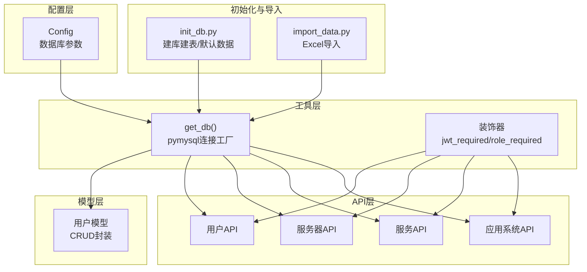
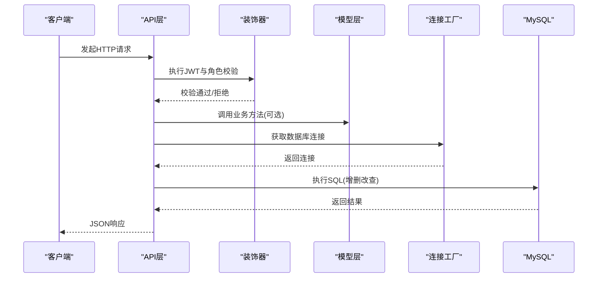
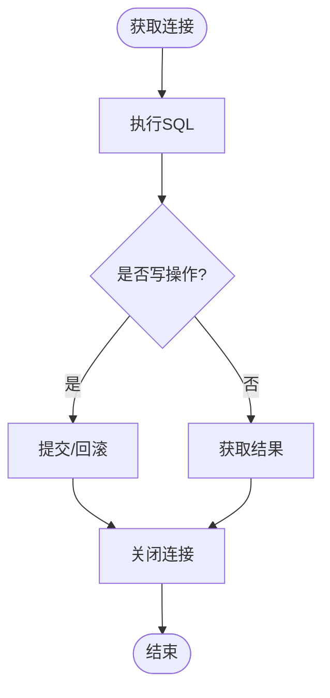
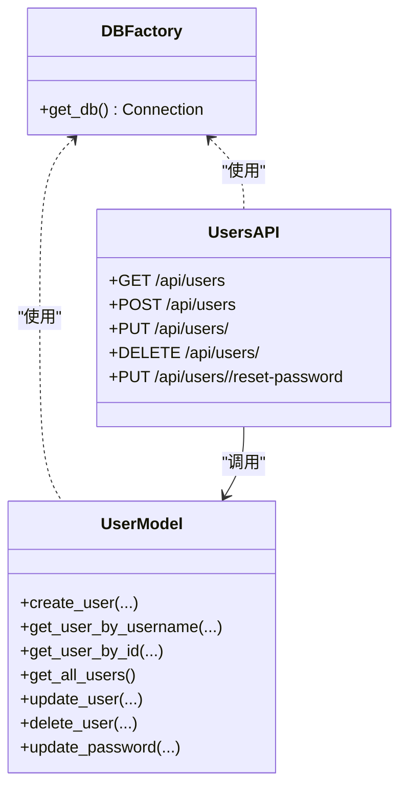
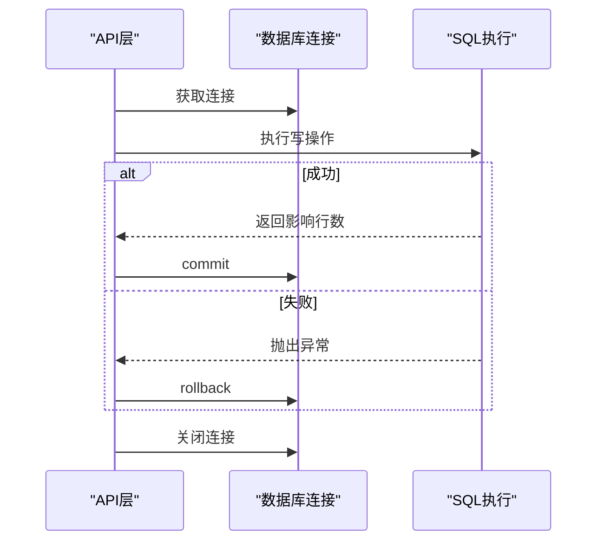
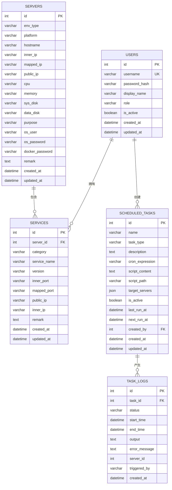
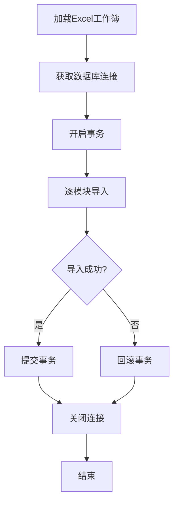
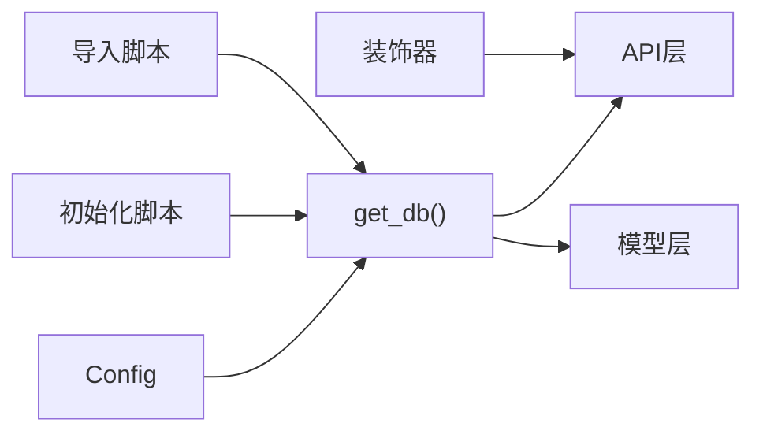

# 数据库设计

<cite>
**本文引用的文件**
- [backend/app/utils/db.py](file://backend/app/utils/db.py)
- [backend/app/config.py](file://backend/app/config.py)
- [backend/init_db.py](file://backend/init_db.py)
- [backend/import_data.py](file://backend/import_data.py)
- [backend/app/models/user.py](file://backend/app/models/user.py)
- [backend/app/api/users.py](file://backend/app/api/users.py)
- [backend/app/api/servers.py](file://backend/app/api/servers.py)
- [backend/app/api/services.py](file://backend/app/api/services.py)
- [backend/app/api/apps.py](file://backend/app/api/apps.py)
- [backend/app/utils/decorators.py](file://backend/app/utils/decorators.py)
- [backend/app/__init__.py](file://backend/app/__init__.py)
</cite>

## 目录
1. [简介](#简介)
2. [项目结构](#项目结构)
3. [核心组件](#核心组件)
4. [架构总览](#架构总览)
5. [详细组件分析](#详细组件分析)
6. [依赖分析](#依赖分析)
7. [性能考虑](#性能考虑)
8. [故障排查指南](#故障排查指南)
9. [结论](#结论)
10. [附录](#附录)

## 简介
本文件面向云运维平台的数据库设计，围绕MySQL连接池配置与管理、数据库操作封装、数据模型设计原则、ORM映射关系、性能优化与调优、备份恢复策略以及数据库迁移方案展开。文档以仓库中的实际代码为依据，结合API层、模型层、工具层与配置层的协作关系，给出可操作的实践建议与可视化图示，帮助开发者与运维人员快速理解并优化数据库层。

## 项目结构
后端采用Flask微服务风格，数据库访问通过工具层统一提供连接；API层负责HTTP请求处理与参数校验；模型层封装CRUD与业务逻辑；配置层集中管理数据库连接参数；初始化脚本负责数据库与表结构的创建及默认数据注入；导入脚本负责Excel数据批量导入。

图表来源
- [backend/app/utils/db.py:1-17](file://backend/app/utils/db.py#L1-L17)
- [backend/app/config.py:1-21](file://backend/app/config.py#L1-L21)
- [backend/app/models/user.py:1-183](file://backend/app/models/user.py#L1-L183)
- [backend/app/api/users.py:1-268](file://backend/app/api/users.py#L1-L268)
- [backend/app/api/servers.py:1-232](file://backend/app/api/servers.py#L1-L232)
- [backend/app/api/services.py:1-182](file://backend/app/api/services.py#L1-L182)
- [backend/app/api/apps.py:1-168](file://backend/app/api/apps.py#L1-L168)
- [backend/app/utils/decorators.py:1-95](file://backend/app/utils/decorators.py#L1-L95)
- [backend/init_db.py:1-263](file://backend/init_db.py#L1-L263)
- [backend/import_data.py:1-431](file://backend/import_data.py#L1-L431)

章节来源
- [backend/app/utils/db.py:1-17](file://backend/app/utils/db.py#L1-L17)
- [backend/app/config.py:1-21](file://backend/app/config.py#L1-L21)
- [backend/app/__init__.py:1-62](file://backend/app/__init__.py#L1-L62)

## 核心组件
- 数据库连接工厂：提供基于Flask配置的MySQL连接，返回Dict游标，便于字典化结果。
- 配置中心：集中管理数据库主机、端口、用户、密码、库名等参数。
- API层：各资源API均通过工具层获取连接，执行SQL并返回JSON响应。
- 模型层：用户模型封装CRUD，内部同样使用工具层连接，保证一致性。
- 初始化与导入：初始化脚本创建数据库与表结构，并插入默认字典数据；导入脚本负责Excel数据清洗与批量写入。

章节来源
- [backend/app/utils/db.py:1-17](file://backend/app/utils/db.py#L1-L17)
- [backend/app/config.py:1-21](file://backend/app/config.py#L1-L21)
- [backend/app/models/user.py:1-183](file://backend/app/models/user.py#L1-L183)
- [backend/init_db.py:1-263](file://backend/init_db.py#L1-L263)
- [backend/import_data.py:1-431](file://backend/import_data.py#L1-L431)

## 架构总览
数据库层整体遵循“配置驱动 + 工具层统一封装 + API/模型层按需使用”的模式。API层与模型层共享同一连接工厂，确保连接参数一致、行为一致。装饰器层在API层前置进行认证与授权，减少重复校验逻辑。

图表来源
- [backend/app/api/users.py:1-268](file://backend/app/api/users.py#L1-L268)
- [backend/app/utils/decorators.py:1-95](file://backend/app/utils/decorators.py#L1-L95)
- [backend/app/models/user.py:1-183](file://backend/app/models/user.py#L1-L183)
- [backend/app/utils/db.py:1-17](file://backend/app/utils/db.py#L1-L17)

## 详细组件分析

### 数据库连接池与管理机制
- 连接工厂：工具层提供统一的连接工厂，从Flask配置读取数据库参数，返回pymysql连接，游标类型为字典游标，便于直接使用键值访问。
- 连接生命周期：API与模型层在每次请求或业务调用时获取连接，执行完成后关闭连接，避免长连接占用资源。
- 超时与异常：当前实现未显式设置连接超时与自动重试，建议在生产环境增加连接超时、重试与连接健康检查。
- 异常恢复：API层在写操作失败时执行回滚，保证数据一致性；模型层在异常时关闭连接，避免泄漏。

图表来源
- [backend/app/utils/db.py:1-17](file://backend/app/utils/db.py#L1-L17)
- [backend/app/api/servers.py:130-232](file://backend/app/api/servers.py#L130-L232)
- [backend/app/api/services.py:86-182](file://backend/app/api/services.py#L86-L182)
- [backend/app/api/apps.py:71-168](file://backend/app/api/apps.py#L71-L168)

章节来源
- [backend/app/utils/db.py:1-17](file://backend/app/utils/db.py#L1-L17)
- [backend/app/api/servers.py:130-232](file://backend/app/api/servers.py#L130-L232)
- [backend/app/api/services.py:86-182](file://backend/app/api/services.py#L86-L182)
- [backend/app/api/apps.py:71-168](file://backend/app/api/apps.py#L71-L168)

### 数据库操作封装与统一接口设计
- 统一入口：所有API与模型层通过工具层获取连接，避免分散配置。
- CRUD封装：模型层提供用户CRUD方法，内部使用with上下文管理游标与连接，保证异常时资源释放。
- 参数化查询：API与模型层均使用参数化SQL，防止注入攻击。
- 错误处理：API层捕获异常并返回标准化JSON；模型层在finally中关闭连接，避免泄漏。

图表来源
- [backend/app/utils/db.py:1-17](file://backend/app/utils/db.py#L1-L17)
- [backend/app/models/user.py:1-183](file://backend/app/models/user.py#L1-L183)
- [backend/app/api/users.py:1-268](file://backend/app/api/users.py#L1-L268)

章节来源
- [backend/app/models/user.py:1-183](file://backend/app/models/user.py#L1-L183)
- [backend/app/api/users.py:1-268](file://backend/app/api/users.py#L1-L268)

### 事务管理与错误处理机制
- 写操作事务：API层在写操作（新增、更新、删除）后执行commit或rollback，确保原子性。
- 模型层事务：模型层在with块内执行SQL并commit，异常时关闭连接。
- 异常传播：API层捕获异常并返回统一错误码与消息；模型层在finally中关闭连接，避免资源泄漏。

图表来源
- [backend/app/api/servers.py:130-232](file://backend/app/api/servers.py#L130-L232)
- [backend/app/api/services.py:86-182](file://backend/app/api/services.py#L86-L182)
- [backend/app/api/apps.py:71-168](file://backend/app/api/apps.py#L71-L168)
- [backend/app/models/user.py:1-183](file://backend/app/models/user.py#L1-L183)

章节来源
- [backend/app/api/servers.py:130-232](file://backend/app/api/servers.py#L130-L232)
- [backend/app/api/services.py:86-182](file://backend/app/api/services.py#L86-L182)
- [backend/app/api/apps.py:71-168](file://backend/app/api/apps.py#L71-L168)
- [backend/app/models/user.py:1-183](file://backend/app/models/user.py#L1-L183)

### 数据模型设计原则
- 表结构设计：采用InnoDB引擎，utf8mb4字符集，统一使用自增主键与时间戳字段，便于审计与排序。
- 字段约束：关键字段设置NOT NULL与默认值；唯一索引用于用户名等唯一标识；普通索引覆盖高频查询字段。
- 索引优化策略：为高频过滤字段建立单列索引；复合查询场景考虑联合索引；避免过度索引导致写入性能下降。
- 外键关系：服务表与服务器表、定时任务与用户表之间建立外键约束，保证参照完整性。

图表来源
- [backend/init_db.py:33-226](file://backend/init_db.py#L33-L226)

章节来源
- [backend/init_db.py:33-226](file://backend/init_db.py#L33-L226)

### ORM映射关系
- 一对多关系：
  - 用户与服务：一个用户可创建多个定时任务（一对多），服务属于某服务器（一对多）。
  - 服务器与服务：一台服务器可包含多个服务。
- 多对多关系：当前未发现显式的多对多表；可通过JSON字段或中间表实现，但本项目未见此类设计。
- 外键约束：通过外键保证参照完整性；级联删除用于维护数据一致性。

章节来源
- [backend/init_db.py:92-93](file://backend/init_db.py#L92-L93)
- [backend/init_db.py:204-205](file://backend/init_db.py#L204-L205)
- [backend/init_db.py:224-225](file://backend/init_db.py#L224-L225)

### 数据库初始化与默认数据
- 初始化脚本负责创建数据库与所有表结构，设置字符集与索引，并插入默认字典数据（环境类型、平台、服务分类）。
- 默认管理员账户在初始化时插入，便于首次登录。

章节来源
- [backend/init_db.py:22-259](file://backend/init_db.py#L22-L259)

### Excel数据导入流程
- 清洗与转换：提供字符串、日期、数值清洗函数，兼容多种输入格式。
- 分模块导入：分别导入更新记录、服务器台账、应用系统、域名证书等模块。
- 事务控制：导入过程在事务中执行，失败时回滚，保证数据一致性。

图表来源
- [backend/import_data.py:11-34](file://backend/import_data.py#L11-L34)
- [backend/import_data.py:84-121](file://backend/import_data.py#L84-L121)
- [backend/import_data.py:123-191](file://backend/import_data.py#L123-L191)
- [backend/import_data.py:233-282](file://backend/import_data.py#L233-L282)
- [backend/import_data.py:285-317](file://backend/import_data.py#L285-L317)
- [backend/import_data.py:378-426](file://backend/import_data.py#L378-L426)

章节来源
- [backend/import_data.py:11-431](file://backend/import_data.py#L11-L431)

## 依赖分析
- 配置依赖：所有数据库连接参数来源于配置类，确保全局一致。
- 工具依赖：API层与模型层均依赖工具层的连接工厂，降低耦合度。
- 蓝图注册：应用启动时注册所有API蓝图，形成统一的服务入口。

图表来源
- [backend/app/config.py:1-21](file://backend/app/config.py#L1-L21)
- [backend/app/utils/db.py:1-17](file://backend/app/utils/db.py#L1-L17)
- [backend/app/__init__.py:37-62](file://backend/app/__init__.py#L37-L62)

章节来源
- [backend/app/config.py:1-21](file://backend/app/config.py#L1-L21)
- [backend/app/utils/db.py:1-17](file://backend/app/utils/db.py#L1-L17)
- [backend/app/__init__.py:37-62](file://backend/app/__init__.py#L37-L62)

## 性能考虑
- 连接池调优（建议）
  - 连接池大小：根据并发请求数与数据库承载能力设定最小/最大连接数。
  - 连接超时：设置连接超时与Socket超时，避免长时间占用连接。
  - 自动重试：对瞬时网络抖动或锁等待失败进行有限次数重试。
  - 连接健康检查：定期检测连接可用性，剔除不可用连接。
- SQL优化
  - 索引策略：为高频过滤字段建立索引；避免在索引列上使用函数或隐式转换。
  - 分页优化：大表分页使用覆盖索引或延迟关联，避免OFFSET过大导致的性能问题。
  - 批量写入：导入脚本已采用事务批量写入，建议进一步拆分批次与控制单批条数。
- 缓存与异步
  - 读多写少场景引入Redis缓存热点数据。
  - 写操作异步化：通过消息队列解耦写入压力。
- 监控与告警
  - 指标监控：连接数、慢查询、锁等待、QPS/P95等。
  - 日志审计：记录慢SQL与异常事务，辅助定位问题。

[本节为通用性能建议，不直接分析具体文件]

## 故障排查指南
- 连接失败
  - 检查数据库主机、端口、用户、密码是否正确（来自配置）。
  - 确认防火墙与网络连通性。
- 写入失败
  - 查看API层返回的错误码与消息；确认是否触发了回滚。
  - 检查唯一约束冲突与外键约束。
- 导入失败
  - 查看导入脚本的异常日志与回滚提示。
  - 核对Excel数据格式与清洗规则。
- 权限问题
  - 确认JWT Token有效且角色满足API要求。
  - 检查装饰器链路是否正确执行。

章节来源
- [backend/app/api/users.py:1-268](file://backend/app/api/users.py#L1-L268)
- [backend/app/utils/decorators.py:1-95](file://backend/app/utils/decorators.py#L1-L95)
- [backend/import_data.py:11-34](file://backend/import_data.py#L11-L34)

## 结论
本项目的数据库层以配置为中心、工具统一封装、API与模型共享连接工厂，实现了清晰的职责分离与一致的访问方式。初始化脚本与导入脚本提供了完整的建库建表与数据注入能力。建议在生产环境中引入连接池、超时与重试、索引优化与监控告警，以进一步提升稳定性与性能。

[本节为总结性内容，不直接分析具体文件]

## 附录

### 数据库迁移方案（建议）
- 版本化迁移
  - 使用迁移工具（如Alembic或自定义脚本）记录DDL变更历史。
  - 每次变更生成迁移脚本，先在测试环境验证，再灰度到生产。
- 回滚策略
  - 保留逆向迁移脚本，确保可回滚到上一个稳定版本。
  - 对关键变更执行预检查（如索引存在性、数据一致性）。
- 在线DDL
  - 使用pt-online-schema-change等工具进行无锁结构变更。
  - 控制变更窗口与流量削峰。

[本节为通用迁移建议，不直接分析具体文件]