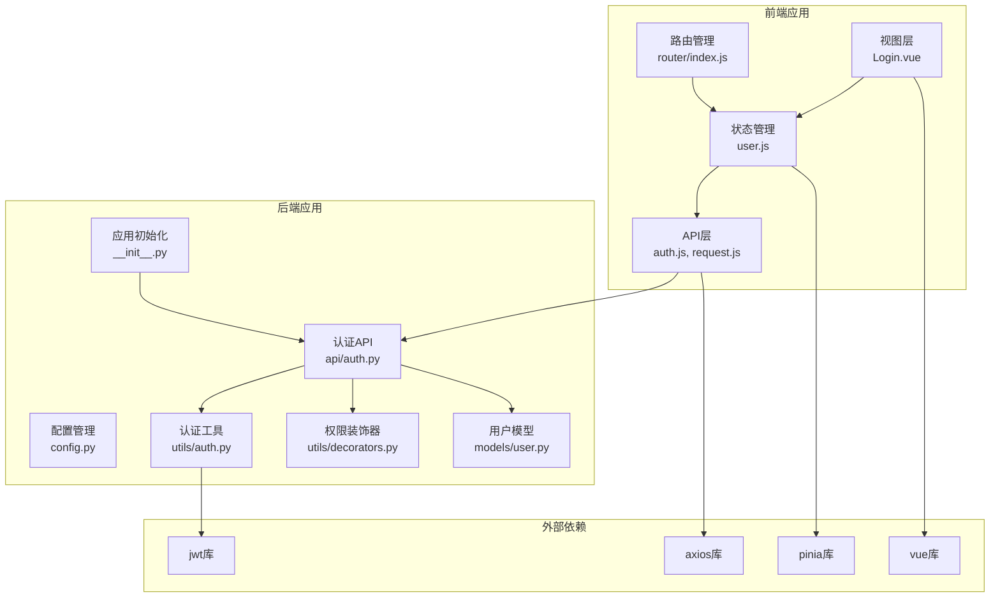
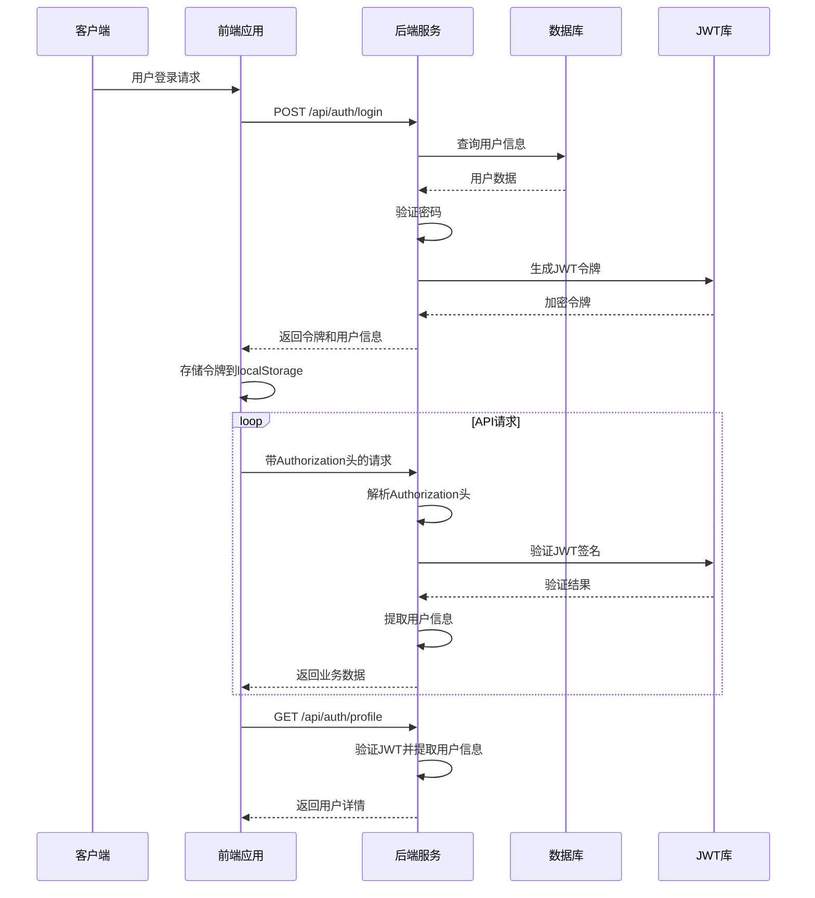
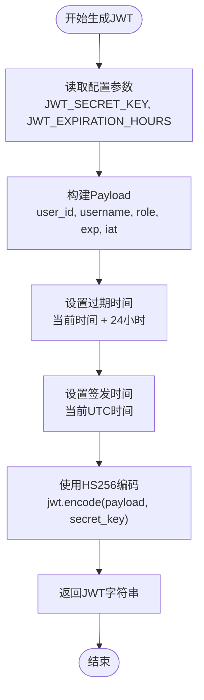
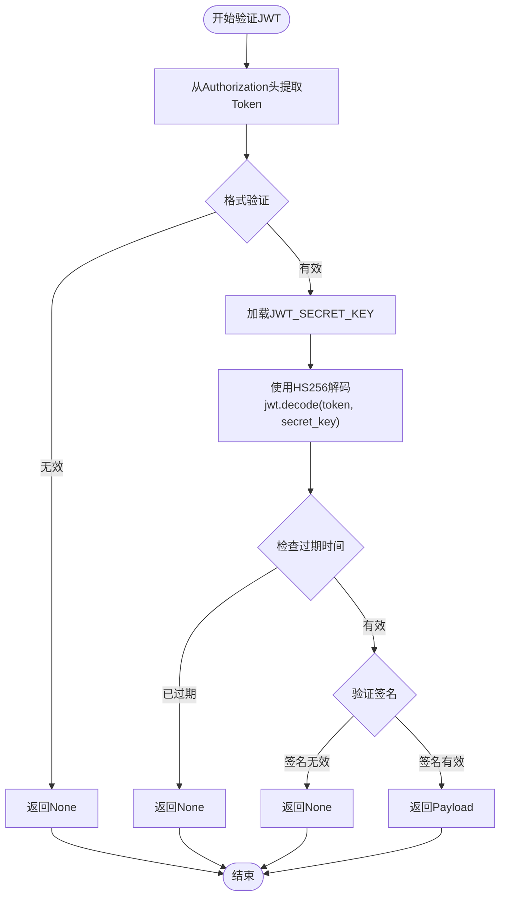
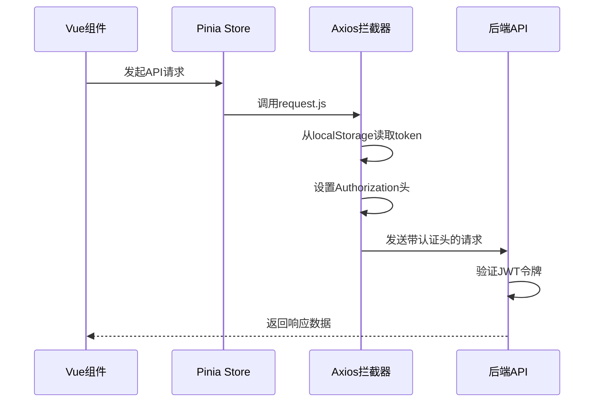
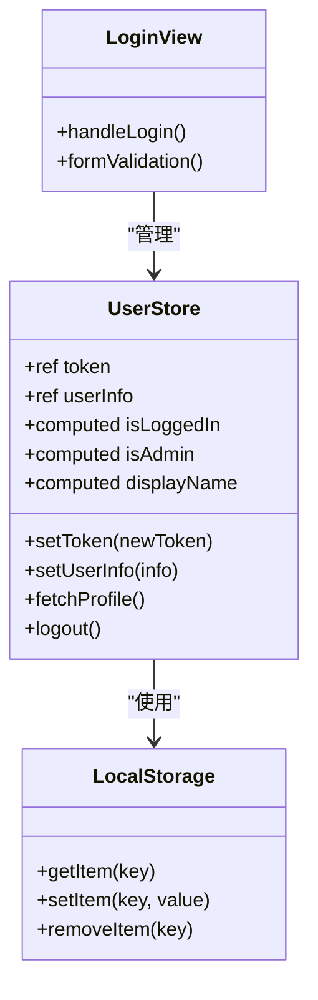
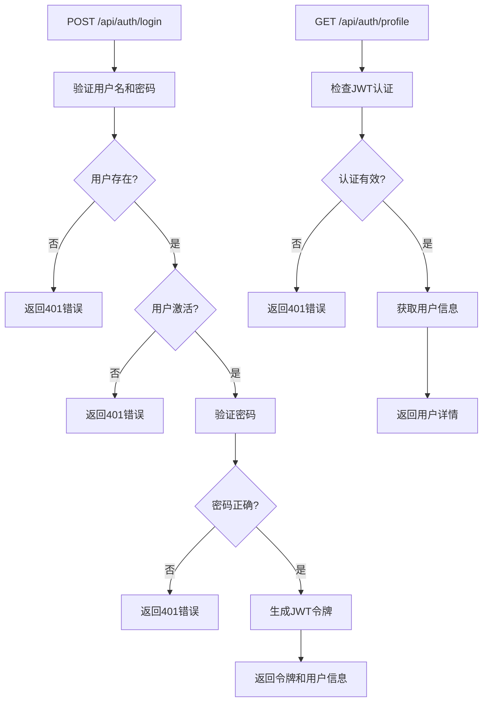
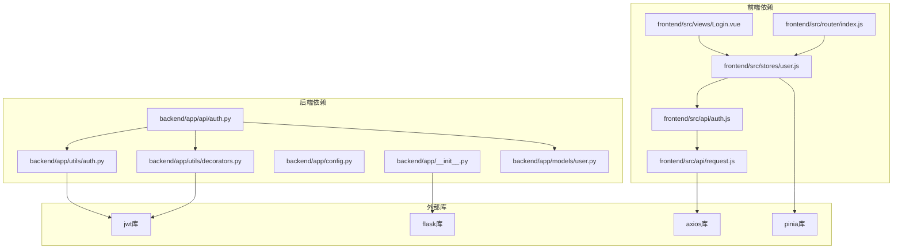

# JWT Token机制

<cite>
**本文档引用的文件**
- [backend/app/utils/auth.py](file://backend/app/utils/auth.py)
- [backend/app/utils/decorators.py](file://backend/app/utils/decorators.py)
- [backend/app/api/auth.py](file://backend/app/api/auth.py)
- [backend/app/config.py](file://backend/app/config.py)
- [backend/app/__init__.py](file://backend/app/__init__.py)
- [frontend/src/api/auth.js](file://frontend/src/api/auth.js)
- [frontend/src/api/request.js](file://frontend/src/api/request.js)
- [frontend/src/stores/user.js](file://frontend/src/stores/user.js)
- [frontend/src/views/Login.vue](file://frontend/src/views/Login.vue)
- [frontend/src/router/index.js](file://frontend/src/router/index.js)
- [backend/app/models/user.py](file://backend/app/models/user.py)
</cite>

## 目录
1. [简介](#简介)
2. [项目结构](#项目结构)
3. [核心组件](#核心组件)
4. [架构概览](#架构概览)
5. [详细组件分析](#详细组件分析)
6. [依赖关系分析](#依赖关系分析)
7. [性能考虑](#性能考虑)
8. [故障排除指南](#故障排除指南)
9. [结论](#结论)

## 简介

本项目实现了基于JWT（JSON Web Token）的认证机制，为运维管理平台提供安全的用户身份验证和授权功能。JWT作为一种开放标准（RFC 7519），允许各方之间安全地传输声明（claims）。本系统的JWT实现采用HS256签名算法，支持用户登录认证、权限验证和会话管理。

## 项目结构

项目采用前后端分离架构，JWT认证机制分布在以下模块中：

**图表来源**
- [backend/app/__init__.py:1-62](file://backend/app/__init__.py#L1-L62)
- [backend/app/config.py:1-21](file://backend/app/config.py#L1-L21)
- [frontend/src/api/request.js:1-54](file://frontend/src/api/request.js#L1-L54)

**章节来源**
- [backend/app/__init__.py:1-62](file://backend/app/__init__.py#L1-L62)
- [frontend/src/router/index.js:1-61](file://frontend/src/router/index.js#L1-L61)

## 核心组件

### JWT生成组件

JWT生成组件负责创建加密令牌，包含以下关键功能：
- Payload结构设计：包含用户标识、角色信息和时间戳
- HS256签名算法：使用对称密钥进行数字签名
- 过期时间管理：基于配置的过期时长设置

### 权限验证组件

权限验证组件提供多层安全控制：
- Bearer Token解析：从Authorization头部提取JWT
- 签名验证：使用相同密钥验证令牌完整性
- 用户信息提取：从有效载荷中恢复用户上下文

### 前端存储组件

前端存储组件管理本地认证状态：
- Token持久化：使用localStorage存储访问令牌
- 用户信息缓存：存储用户基本信息以减少API调用
- 自动清理机制：处理过期和失效的认证状态

**章节来源**
- [backend/app/utils/auth.py:11-35](file://backend/app/utils/auth.py#L11-L35)
- [backend/app/utils/decorators.py:9-56](file://backend/app/utils/decorators.py#L9-L56)
- [frontend/src/stores/user.js:1-41](file://frontend/src/stores/user.js#L1-L41)

## 架构概览

系统采用分层架构实现JWT认证，确保安全性、可维护性和扩展性：

**图表来源**
- [frontend/src/views/Login.vue:50-66](file://frontend/src/views/Login.vue#L50-L66)
- [backend/app/api/auth.py:14-82](file://backend/app/api/auth.py#L14-L82)
- [backend/app/utils/auth.py:11-35](file://backend/app/utils/auth.py#L11-L35)

## 详细组件分析

### JWT生成与验证流程

#### 生成流程

JWT生成过程包含以下步骤：

**图表来源**
- [backend/app/utils/auth.py:23-35](file://backend/app/utils/auth.py#L23-L35)

#### 验证流程

JWT验证过程确保令牌的完整性和有效性：

**图表来源**
- [backend/app/utils/decorators.py:22-54](file://backend/app/utils/decorators.py#L22-L54)
- [backend/app/utils/auth.py:48-55](file://backend/app/utils/auth.py#L48-L55)

**章节来源**
- [backend/app/utils/auth.py:11-55](file://backend/app/utils/auth.py#L11-L55)
- [backend/app/utils/decorators.py:9-95](file://backend/app/utils/decorators.py#L9-L95)

### Payload结构设计

JWT的有效载荷包含以下标准化字段：

| 字段 | 类型 | 描述 | 示例值 |
|------|------|------|--------|
| `user_id` | 整数 | 用户唯一标识符 | 12345 |
| `username` | 字符串 | 用户名 | "john_doe" |
| `role` | 字符串 | 用户角色 | "admin" |
| `exp` | 时间戳 | 过期时间 | 1700000000 |
| `iat` | 时间戳 | 签发时间 | 1699996400 |

**章节来源**
- [backend/app/utils/auth.py:25-31](file://backend/app/utils/auth.py#L25-L31)

### HTTP请求传递机制

前端通过拦截器自动添加认证头：

**图表来源**
- [frontend/src/api/request.js:14-23](file://frontend/src/api/request.js#L14-L23)

**章节来源**
- [frontend/src/api/request.js:1-54](file://frontend/src/api/request.js#L1-L54)

### 前端存储策略

前端采用localStorage进行持久化存储：

**图表来源**
- [frontend/src/stores/user.js:1-41](file://frontend/src/stores/user.js#L1-L41)
- [frontend/src/views/Login.vue:50-66](file://frontend/src/views/Login.vue#L50-L66)

**章节来源**
- [frontend/src/stores/user.js:1-41](file://frontend/src/stores/user.js#L1-L41)
- [frontend/src/views/Login.vue:1-114](file://frontend/src/views/Login.vue#L1-L114)

### 后端认证API

认证API提供完整的登录和用户信息管理功能：

**图表来源**
- [backend/app/api/auth.py:14-82](file://backend/app/api/auth.py#L14-L82)
- [backend/app/api/auth.py:85-115](file://backend/app/api/auth.py#L85-L115)

**章节来源**
- [backend/app/api/auth.py:1-184](file://backend/app/api/auth.py#L1-L184)

## 依赖关系分析

系统各组件之间的依赖关系如下：

**图表来源**
- [backend/app/api/auth.py:1-10](file://backend/app/api/auth.py#L1-L10)
- [backend/app/utils/auth.py:1-8](file://backend/app/utils/auth.py#L1-L8)
- [frontend/src/api/auth.js:1-5](file://frontend/src/api/auth.js#L1-L5)

**章节来源**
- [backend/app/__init__.py:37-62](file://backend/app/__init__.py#L37-L62)
- [frontend/src/router/index.js:1-61](file://frontend/src/router/index.js#L1-L61)

## 性能考虑

### JWT性能特性

JWT认证机制具有以下性能优势：
- **无状态性**：服务器无需存储会话状态，降低内存占用
- **快速验证**：客户端本地验证，减少服务器计算开销
- **跨域支持**：便于微服务架构部署

### 性能优化建议

1. **令牌过期时间优化**：根据业务需求调整JWT_EXPIRATION_HOURS配置
2. **缓存策略**：合理利用localStorage减少重复认证
3. **并发处理**：避免同时发起大量认证请求

## 故障排除指南

### 常见问题及解决方案

#### 令牌过期问题
- **症状**：API返回401错误，提示Token无效或已过期
- **原因**：JWT过期时间已到达
- **解决方案**：重新登录获取新令牌

#### 认证头格式错误
- **症状**：后端返回401错误，提示认证格式错误
- **原因**：Authorization头格式不正确
- **解决方案**：确保使用"Bearer {token}"格式

#### 密钥配置问题
- **症状**：JWT验证失败，签名验证错误
- **原因**：JWT_SECRET_KEY配置不正确
- **解决方案**：检查环境变量配置

**章节来源**
- [backend/app/utils/decorators.py:22-45](file://backend/app/utils/decorators.py#L22-L45)
- [frontend/src/api/request.js:35-50](file://frontend/src/api/request.js#L35-L50)

## 结论

本项目的JWT认证机制实现了完整的用户身份验证和授权功能。通过前后端协作，系统提供了安全、可靠的认证体验。主要特点包括：

1. **安全性**：采用HS256算法和强密钥管理
2. **易用性**：自动化的令牌管理和存储
3. **可维护性**：清晰的代码结构和配置管理
4. **扩展性**：支持角色权限控制和多层装饰器

建议在生产环境中进一步加强安全措施，如实现令牌刷新机制、增强CSRF防护和实施更严格的密钥轮换策略。