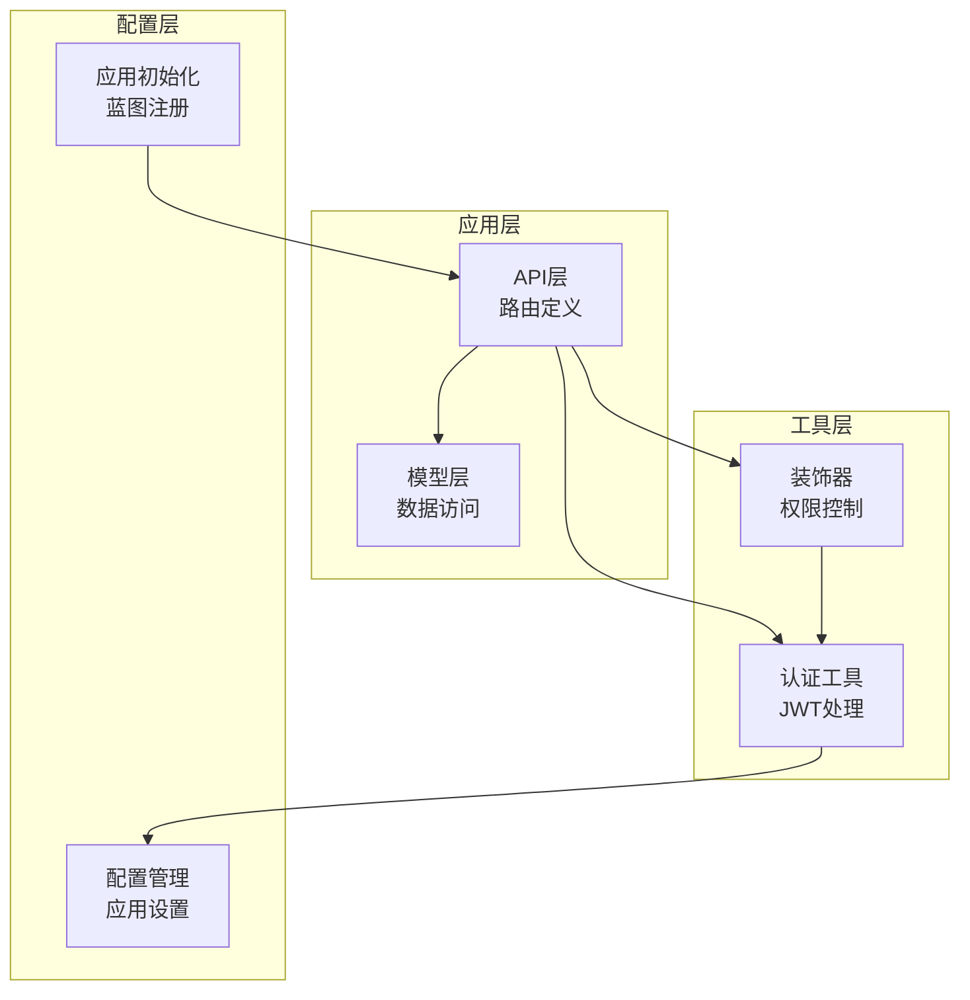
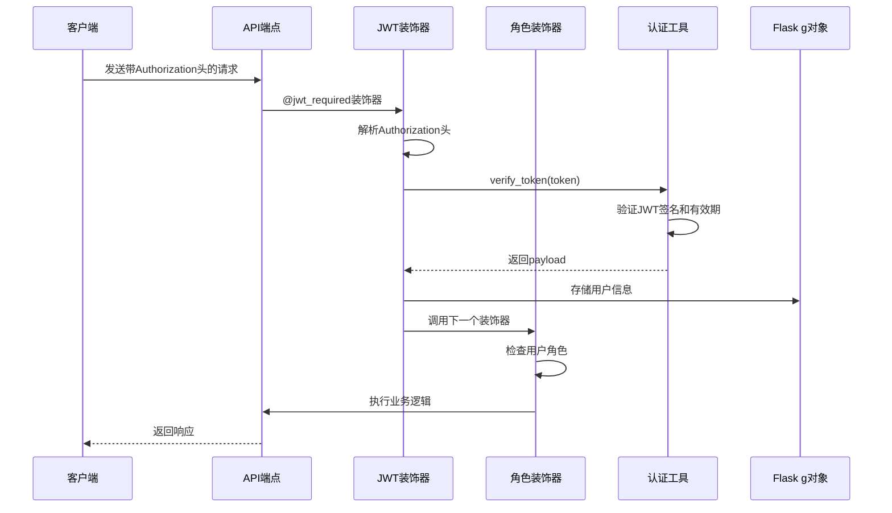
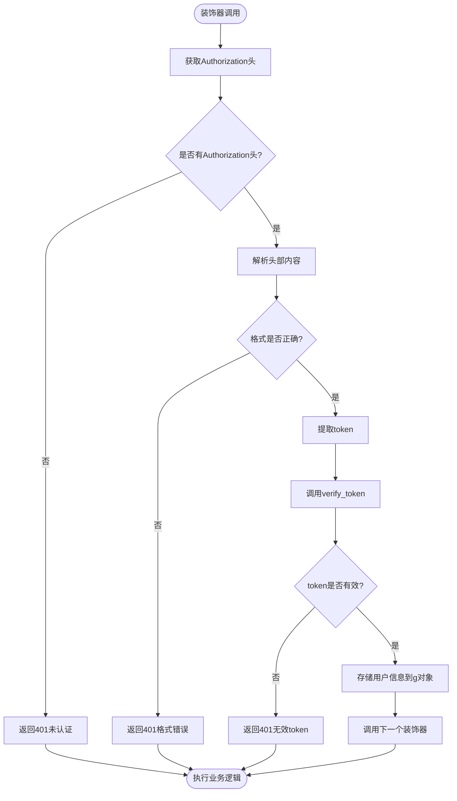
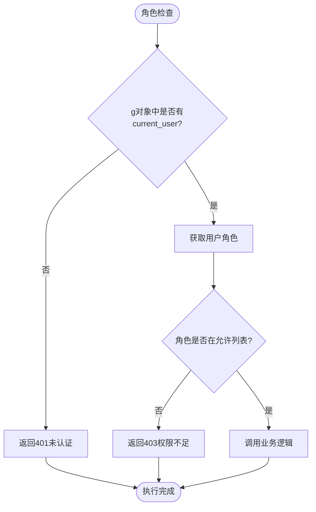
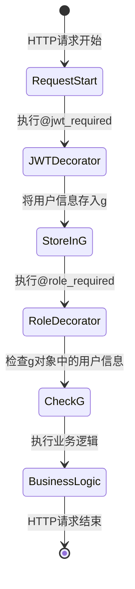
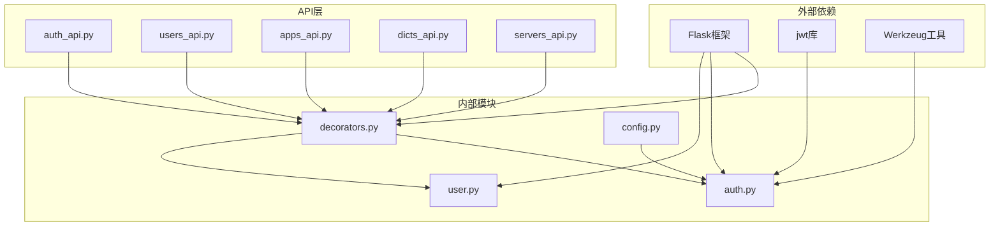

# 权限控制装饰器

<cite>
**本文档引用的文件**
- [decorators.py](file://backend/app/utils/decorators.py)
- [auth.py](file://backend/app/utils/auth.py)
- [user.py](file://backend/app/models/user.py)
- [auth_api.py](file://backend/app/api/auth.py)
- [users_api.py](file://backend/app/api/users.py)
- [apps_api.py](file://backend/app/api/apps.py)
- [dicts_api.py](file://backend/app/api/dicts.py)
- [servers_api.py](file://backend/app/api/servers.py)
- [config.py](file://backend/app/config.py)
- [app_init.py](file://backend/app/__init__.py)
</cite>

## 目录
1. [简介](#简介)
2. [项目结构](#项目结构)
3. [核心组件](#核心组件)
4. [架构概览](#架构概览)
5. [详细组件分析](#详细组件分析)
6. [依赖分析](#依赖分析)
7. [性能考虑](#性能考虑)
8. [故障排除指南](#故障排除指南)
9. [结论](#结论)

## 简介

本项目实现了一套完整的权限控制装饰器系统，基于Flask框架构建，采用JWT（JSON Web Token）认证机制实现细粒度的权限控制。该系统提供了两个核心装饰器：`@jwt_required`用于JWT认证，`@role_required`用于角色权限检查，支持装饰器链式调用和灵活的权限组合。

系统设计遵循最小权限原则，通过装饰器自动处理认证和授权逻辑，开发者只需关注业务逻辑实现。每个API端点都可以独立配置所需的权限级别，实现了高度模块化的权限控制架构。

## 项目结构

权限控制装饰器系统主要分布在以下目录结构中：



**图表来源**
- [decorators.py:1-95](file://backend/app/utils/decorators.py#L1-L95)
- [auth.py:1-83](file://backend/app/utils/auth.py#L1-L83)
- [config.py:1-21](file://backend/app/config.py#L1-L21)

**章节来源**
- [app_init.py:1-62](file://backend/app/__init__.py#L1-L62)
- [config.py:1-21](file://backend/app/config.py#L1-L21)

## 核心组件

权限控制装饰器系统由三个核心组件构成：

### 1. JWT认证装饰器 (`@jwt_required`)
负责从HTTP请求头中提取和验证JWT令牌，将用户信息注入到Flask的g对象中。

### 2. 角色权限装饰器 (`@role_required`)
在JWT认证基础上，检查用户的角色权限是否满足要求。

### 3. 认证工具模块
提供JWT令牌的生成、验证和密码哈希功能。

**章节来源**
- [decorators.py:9-56](file://backend/app/utils/decorators.py#L9-L56)
- [decorators.py:59-95](file://backend/app/utils/decorators.py#L59-L95)
- [auth.py:11-83](file://backend/app/utils/auth.py#L11-L83)

## 架构概览

系统采用分层架构设计，通过装饰器实现横切关注点的分离：



**图表来源**
- [decorators.py:9-56](file://backend/app/utils/decorators.py#L9-L56)
- [decorators.py:59-95](file://backend/app/utils/decorators.py#L59-L95)
- [auth.py:38-56](file://backend/app/utils/auth.py#L38-L56)

## 详细组件分析

### JWT认证装饰器实现

JWT装饰器是整个权限控制系统的核心，负责处理用户身份认证的所有细节。

#### 实现原理



**图表来源**
- [decorators.py:20-56](file://backend/app/utils/decorators.py#L20-L56)

#### 关键特性

1. **严格的头部格式验证**：只接受标准的"Bearer <token>"格式
2. **自动用户信息注入**：将用户ID、用户名和角色存储到`g.current_user`
3. **统一的错误处理**：标准化的401状态码和错误消息
4. **透明的装饰器链**：不影响被装饰函数的正常执行

**章节来源**
- [decorators.py:9-56](file://backend/app/utils/decorators.py#L9-L56)

### 角色权限装饰器实现

角色权限装饰器建立在JWT认证的基础上，提供细粒度的权限控制能力。

#### 设计思路



**图表来源**
- [decorators.py:73-95](file://backend/app/utils/decorators.py#L73-L95)

#### 权限检查逻辑

1. **依赖链验证**：确保`@jwt_required`装饰器先于`@role_required`执行
2. **角色匹配算法**：使用简单的成员检查操作
3. **灵活的角色配置**：支持单角色和多角色组合
4. **清晰的错误反馈**：明确指出需要的角色权限

**章节来源**
- [decorators.py:59-95](file://backend/app/utils/decorators.py#L59-L95)

### 认证工具模块

认证工具模块提供了JWT令牌处理和密码安全功能。

#### JWT令牌处理

| 功能 | 方法 | 参数 | 返回值 |
|------|------|------|--------|
| 生成令牌 | `generate_token` | user_id, username, role | JWT字符串 |
| 验证令牌 | `verify_token` | token | payload字典或None |

#### 密码安全功能

| 功能 | 方法 | 参数 | 返回值 |
|------|------|------|--------|
| 哈希密码 | `hash_password` | password | 密码哈希值 |
| 验证密码 | `check_password` | password_hash, password | 布尔值 |

**章节来源**
- [auth.py:11-83](file://backend/app/utils/auth.py#L11-L83)

### Flask g对象机制

Flask的g对象是请求级别的全局存储容器，为权限控制提供了便利的数据传递机制。

#### 生命周期管理



**图表来源**
- [decorators.py:47-52](file://backend/app/utils/decorators.py#L47-L52)

#### 数据存储结构

装饰器将用户信息以字典形式存储在g对象中：
- `g.current_user['user_id']`: 用户唯一标识
- `g.current_user['username']`: 用户名
- `g.current_user['role']`: 用户角色

**章节来源**
- [decorators.py:47-52](file://backend/app/utils/decorators.py#L47-L52)

## 依赖分析

权限控制装饰器系统具有清晰的依赖关系和模块化设计。



**图表来源**
- [decorators.py:4-6](file://backend/app/utils/decorators.py#L4-L6)
- [auth.py:4-8](file://backend/app/utils/auth.py#L4-L8)

### 模块间耦合度分析

| 组件 | 主要依赖 | 内聚性 | 耦合度 |
|------|----------|--------|--------|
| decorators.py | Flask, auth.py | 高内聚 | 低耦合 |
| auth.py | Flask, jwt, datetime | 高内聚 | 中等耦合 |
| 所有API模块 | decorators.py | 中等内聚 | 低耦合 |

**章节来源**
- [decorators.py:4-6](file://backend/app/utils/decorators.py#L4-L6)
- [auth.py:4-8](file://backend/app/utils/auth.py#L4-L8)

## 性能考虑

权限控制装饰器系统在设计时充分考虑了性能优化：

### 1. 认证缓存策略
- JWT令牌验证结果在请求生命周期内复用
- 避免重复的数据库查询操作

### 2. 内存使用优化
- 用户信息仅存储在g对象中，生命周期短
- 不在内存中保留敏感信息超过必要时间

### 3. 错误快速返回
- 在认证失败时立即返回，避免不必要的处理
- 减少系统资源浪费

### 4. 异常处理效率
- 使用异常捕获机制快速识别无效令牌
- 避免复杂的条件判断逻辑

## 故障排除指南

### 常见问题及解决方案

#### 1. 401 未认证错误
**症状**：API返回401状态码
**原因**：
- 缺少Authorization头
- Authorization头格式不正确
- JWT令牌无效或已过期

**解决方法**：
```python
# 正确的Authorization头格式
Authorization: Bearer <your_jwt_token>
```

#### 2. 403 权限不足错误
**症状**：API返回403状态码
**原因**：
- 用户角色不在允许列表中
- 装饰器顺序错误

**解决方法**：
```python
# 确保装饰器顺序正确
@jwt_required
@role_required(['admin'])
def protected_route():
    pass
```

#### 3. JWT配置问题
**症状**：令牌生成或验证失败
**原因**：
- JWT_SECRET_KEY配置错误
- JWT_EXPIRATION_HOURS设置不当

**解决方法**：
```python
# 检查配置文件
JWT_SECRET_KEY = os.environ.get('JWT_SECRET_KEY', 'jwt-secret-key-change-in-prod')
JWT_EXPIRATION_HOURS = 24
```

**章节来源**
- [decorators.py:24-45](file://backend/app/utils/decorators.py#L24-L45)
- [decorators.py:76-88](file://backend/app/utils/decorators.py#L76-L88)
- [config.py:5-7](file://backend/app/config.py#L5-L7)

## 结论

权限控制装饰器系统通过简洁而强大的设计，为运维管理平台提供了可靠的权限控制机制。系统的主要优势包括：

### 技术优势
1. **模块化设计**：装饰器职责单一，易于维护和测试
2. **链式调用**：支持灵活的权限组合和扩展
3. **标准化响应**：统一的错误处理和响应格式
4. **安全性**：基于JWT的标准认证机制

### 最佳实践建议
1. **装饰器顺序**：始终将`@jwt_required`放在`@role_required`之前
2. **角色设计**：合理规划角色层次，避免过度复杂的权限组合
3. **错误处理**：在业务逻辑中适当处理装饰器返回的错误状态
4. **配置管理**：确保JWT密钥的安全存储和定期轮换

### 扩展方向
1. **细粒度权限**：可以扩展支持基于资源的权限控制
2. **权限缓存**：实现用户权限的缓存机制
3. **审计日志**：添加权限访问的审计记录功能
4. **动态权限**：支持运行时权限的动态调整

该系统为开发者提供了一个坚实的基础，可以根据具体需求进行定制和扩展，满足不同场景下的权限控制需求。