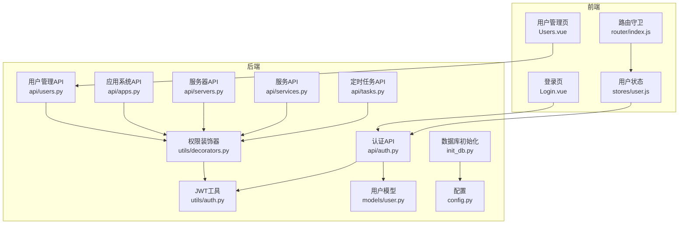
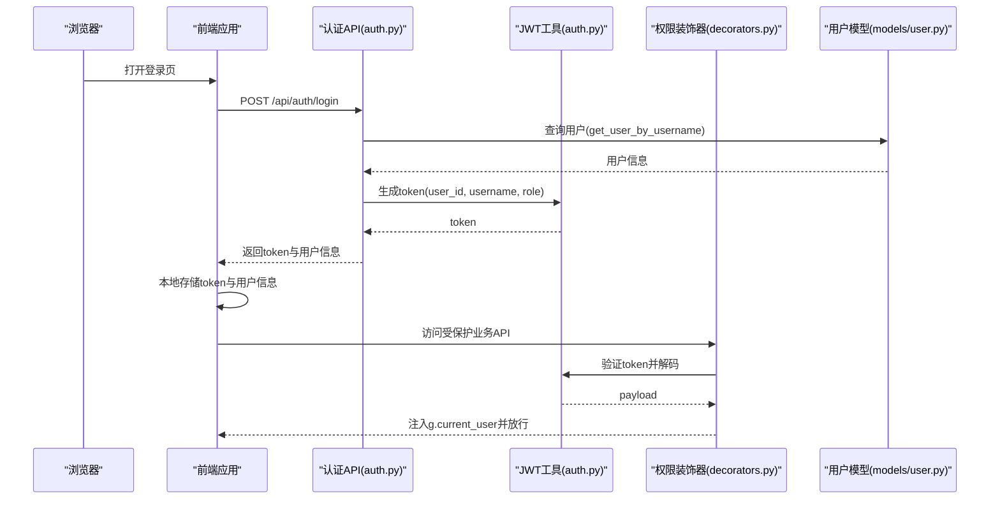
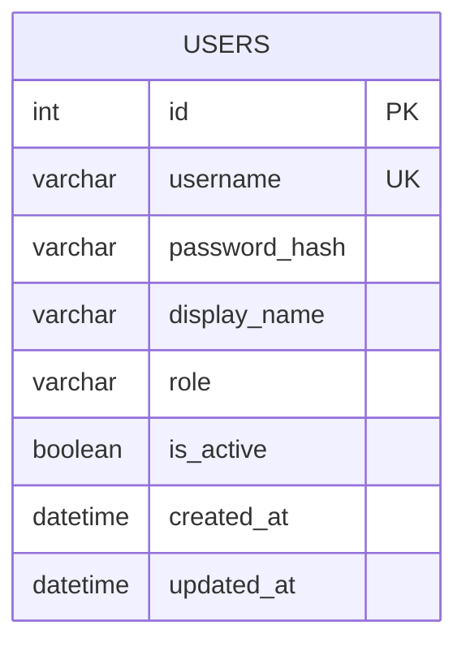
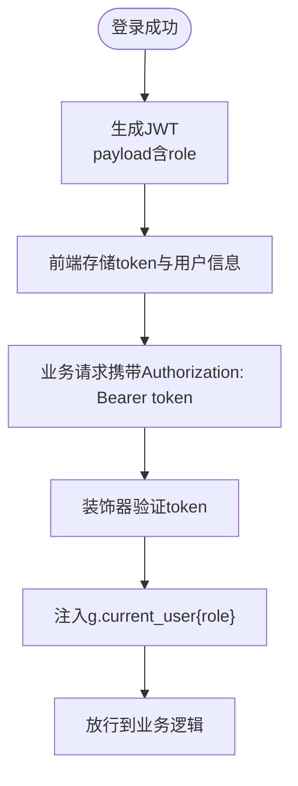
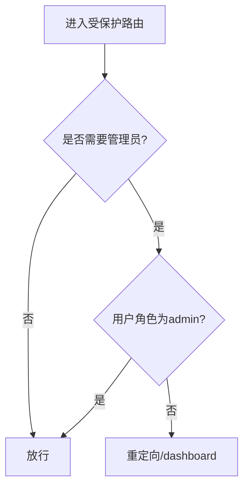
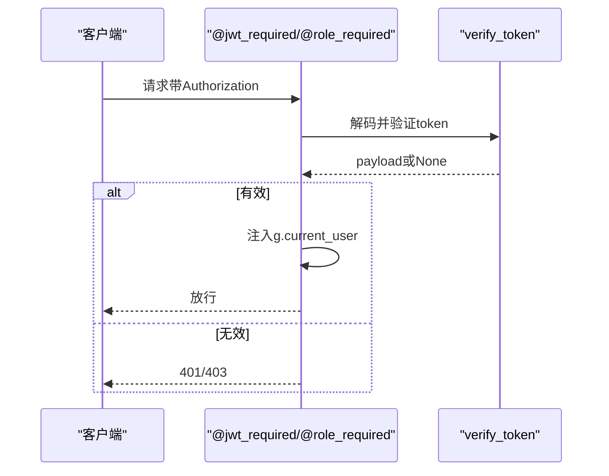
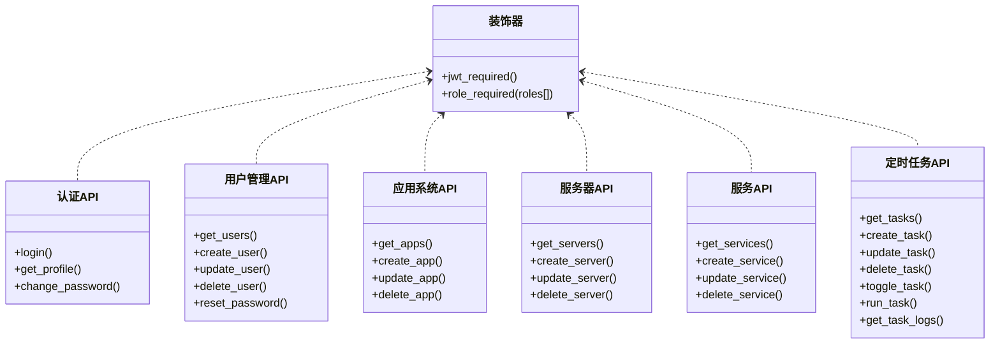
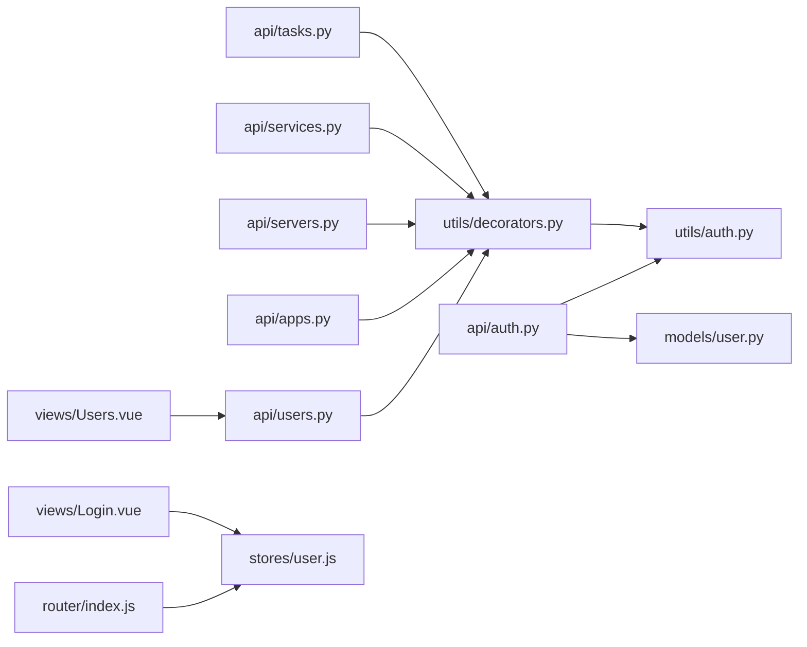

# 角色权限模型

<cite>
**本文引用的文件**
- [backend/app/models/user.py](file://backend/app/models/user.py)
- [backend/app/utils/auth.py](file://backend/app/utils/auth.py)
- [backend/app/utils/decorators.py](file://backend/app/utils/decorators.py)
- [backend/app/api/auth.py](file://backend/app/api/auth.py)
- [backend/app/api/users.py](file://backend/app/api/users.py)
- [backend/app/api/apps.py](file://backend/app/api/apps.py)
- [backend/app/api/servers.py](file://backend/app/api/servers.py)
- [backend/app/api/services.py](file://backend/app/api/services.py)
- [backend/app/api/tasks.py](file://backend/app/api/tasks.py)
- [backend/app/config.py](file://backend/app/config.py)
- [backend/init_db.py](file://backend/init_db.py)
- [frontend/src/stores/user.js](file://frontend/src/stores/user.js)
- [frontend/src/router/index.js](file://frontend/src/router/index.js)
- [frontend/src/views/Login.vue](file://frontend/src/views/Login.vue)
- [frontend/src/views/Users.vue](file://frontend/src/views/Users.vue)
</cite>

## 目录
1. [简介](#简介)
2. [项目结构](#项目结构)
3. [核心组件](#核心组件)
4. [架构总览](#架构总览)
5. [详细组件分析](#详细组件分析)
6. [依赖分析](#依赖分析)
7. [性能考虑](#性能考虑)
8. [故障排查指南](#故障排查指南)
9. [结论](#结论)
10. [附录](#附录)

## 简介
本文件系统性梳理该云平台项目的角色权限模型，覆盖角色定义、JWT Token 中角色字段的存储与传递、权限分级策略、资源访问控制、操作权限验证、数据隔离机制、动态管理（角色分配/继承/临时权限）以及与业务功能的对应关系。文档以“后端 API + 前端路由/状态”为主线，结合数据库表结构，给出可落地的权限设计与实践建议。

## 项目结构
后端采用 Flask Blueprints 组织 API，权限控制通过装饰器实现；前端使用 Vue + Pinia + Element Plus，配合路由守卫实现基于角色的页面级访问控制。数据库初始化脚本定义了用户表及角色字段，确保前后端一致。

**图表来源**
- [frontend/src/views/Login.vue:50-66](file://frontend/src/views/Login.vue#L50-L66)
- [frontend/src/views/Users.vue:113-233](file://frontend/src/views/Users.vue#L113-L233)
- [frontend/src/router/index.js:36-58](file://frontend/src/router/index.js#L36-L58)
- [frontend/src/stores/user.js:5-40](file://frontend/src/stores/user.js#L5-L40)
- [backend/app/api/auth.py:14-82](file://backend/app/api/auth.py#L14-L82)
- [backend/app/api/users.py:17-30](file://backend/app/api/users.py#L17-L30)
- [backend/app/api/apps.py:11-68](file://backend/app/api/apps.py#L11-L68)
- [backend/app/api/servers.py:11-72](file://backend/app/api/servers.py#L11-L72)
- [backend/app/api/services.py:11-83](file://backend/app/api/services.py#L11-L83)
- [backend/app/api/tasks.py:33-60](file://backend/app/api/tasks.py#L33-L60)
- [backend/app/utils/auth.py:11-35](file://backend/app/utils/auth.py#L11-L35)
- [backend/app/utils/decorators.py:9-56](file://backend/app/utils/decorators.py#L9-L56)
- [backend/app/models/user.py:8-36](file://backend/app/models/user.py#L8-L36)
- [backend/app/config.py:4-20](file://backend/app/config.py#L4-L20)
- [backend/init_db.py:34-46](file://backend/init_db.py#L34-L46)

**章节来源**
- [backend/app/api/auth.py:14-82](file://backend/app/api/auth.py#L14-L82)
- [backend/app/utils/decorators.py:9-56](file://backend/app/utils/decorators.py#L9-L56)
- [backend/app/utils/auth.py:11-35](file://backend/app/utils/auth.py#L11-L35)
- [backend/app/models/user.py:8-36](file://backend/app/models/user.py#L8-L36)
- [backend/app/config.py:4-20](file://backend/app/config.py#L4-L20)
- [backend/init_db.py:34-46](file://backend/init_db.py#L34-L46)
- [frontend/src/router/index.js:36-58](file://frontend/src/router/index.js#L36-L58)
- [frontend/src/stores/user.js:5-40](file://frontend/src/stores/user.js#L5-L40)
- [frontend/src/views/Login.vue:50-66](file://frontend/src/views/Login.vue#L50-L66)
- [frontend/src/views/Users.vue:113-233](file://frontend/src/views/Users.vue#L113-L233)

## 核心组件
- 用户模型与持久化：负责用户创建、查询、更新、删除与密码更新，支持角色字段写入与校验。
- JWT 工具：生成与验证 JWT，payload 包含 user_id、username、role、exp、iat，并从配置读取密钥与过期时间。
- 权限装饰器：统一的 @jwt_required 与 @role_required，前者解析 Authorization 头并注入 g.current_user，后者按角色白名单校验。
- 认证 API：登录成功后携带 token 与用户信息返回，前端持久化至本地存储。
- 业务 API：各模块 API 对应资源 CRUD，部分接口要求 admin/operator，部分要求 admin/operator 或仅 jwt_required。
- 前端路由与状态：路由守卫根据 token 与用户角色控制页面访问；Pinia store 存储 token 与用户信息，计算 isAdmin 等派生状态。

**章节来源**
- [backend/app/models/user.py:8-36](file://backend/app/models/user.py#L8-L36)
- [backend/app/utils/auth.py:11-35](file://backend/app/utils/auth.py#L11-L35)
- [backend/app/utils/decorators.py:9-56](file://backend/app/utils/decorators.py#L9-L56)
- [backend/app/api/auth.py:14-82](file://backend/app/api/auth.py#L14-L82)
- [frontend/src/router/index.js:36-58](file://frontend/src/router/index.js#L36-L58)
- [frontend/src/stores/user.js:5-40](file://frontend/src/stores/user.js#L5-L40)

## 架构总览
下图展示从登录到业务调用的完整链路，重点标注 JWT 的生成、传递与校验，以及角色权限在后端装饰器层的集中控制。

**图表来源**
- [frontend/src/views/Login.vue:50-66](file://frontend/src/views/Login.vue#L50-L66)
- [backend/app/api/auth.py:14-82](file://backend/app/api/auth.py#L14-L82)
- [backend/app/utils/auth.py:11-35](file://backend/app/utils/auth.py#L11-L35)
- [backend/app/utils/decorators.py:9-56](file://backend/app/utils/decorators.py#L9-L56)
- [backend/app/models/user.py:39-58](file://backend/app/models/user.py#L39-L58)

## 详细组件分析

### 角色定义与数据模型
- 角色枚举：admin（管理员）、operator（运维工程师）、viewer（只读用户）。数据库 users 表的 role 字段默认值为 operator，初始化脚本插入默认管理员账户。
- 用户模型：创建用户时可指定 role；更新用户时允许修改 role 与 is_active；删除用户时禁止删除自身。
- 前端角色展示：用户管理页支持选择角色选项，标签颜色与文本映射 admin/operator/viewer。

**图表来源**
- [backend/init_db.py:34-46](file://backend/init_db.py#L34-L46)
- [backend/app/models/user.py:8-36](file://backend/app/models/user.py#L8-L36)
- [frontend/src/views/Users.vue:72-79](file://frontend/src/views/Users.vue#L72-L79)

**章节来源**
- [backend/init_db.py:34-46](file://backend/init_db.py#L34-L46)
- [backend/app/models/user.py:8-36](file://backend/app/models/user.py#L8-L36)
- [frontend/src/views/Users.vue:72-79](file://frontend/src/views/Users.vue#L72-L79)

### JWT Token 中的角色存储与传递
- 生成：登录成功后，后端调用生成 token 的函数，payload 写入 user_id、username、role、exp、iat。
- 传递：前端将 token 存入本地存储并在后续请求头 Authorization: Bearer <token> 发送。
- 验证：装饰器从请求头提取 Bearer token，调用验证函数解码；若有效，将 {user_id, username, role} 注入 g.current_user，供后续业务使用。

**图表来源**
- [backend/app/api/auth.py:63-82](file://backend/app/api/auth.py#L63-L82)
- [backend/app/utils/auth.py:11-35](file://backend/app/utils/auth.py#L11-L35)
- [backend/app/utils/decorators.py:20-56](file://backend/app/utils/decorators.py#L20-L56)
- [frontend/src/stores/user.js:13-21](file://frontend/src/stores/user.js#L13-L21)

**章节来源**
- [backend/app/api/auth.py:63-82](file://backend/app/api/auth.py#L63-L82)
- [backend/app/utils/auth.py:11-35](file://backend/app/utils/auth.py#L11-L35)
- [backend/app/utils/decorators.py:20-56](file://backend/app/utils/decorators.py#L20-L56)
- [frontend/src/stores/user.js:13-21](file://frontend/src/stores/user.js#L13-L21)

### 权限分级策略与资源访问控制
- 页面级访问控制：路由守卫根据 meta.requiresAuth 与 requiresAdmin 控制访问；非管理员访问 /users 将被重定向至仪表盘。
- 接口级访问控制：装饰器 @jwt_required 保证认证，@role_required 按角色白名单放行；部分模块仅需登录，部分需要 admin/operator。
- 资源隔离：业务 API 未见显式的“按用户隔离”逻辑，建议在查询接口增加基于用户上下文的过滤（例如仅返回当前用户可见的服务器/服务）。

**图表来源**
- [frontend/src/router/index.js:48-54](file://frontend/src/router/index.js#L48-L54)

**章节来源**
- [frontend/src/router/index.js:36-58](file://frontend/src/router/index.js#L36-L58)
- [backend/app/api/users.py:17-30](file://backend/app/api/users.py#L17-L30)
- [backend/app/api/apps.py:71-73](file://backend/app/api/apps.py#L71-L73)
- [backend/app/api/servers.py:130-132](file://backend/app/api/servers.py#L130-L132)
- [backend/app/api/services.py:86-88](file://backend/app/api/services.py#L86-L88)
- [backend/app/api/tasks.py:63-65](file://backend/app/api/tasks.py#L63-L65)

### 操作权限验证流程
- 登录：提交用户名/密码，后端校验激活状态与密码，成功后签发 token。
- 访问：请求头携带 token，装饰器验证签名与有效期，注入用户角色，再由 @role_required 校验角色白名单。
- 失败：缺少认证信息、格式错误、token 无效或过期、权限不足均返回相应状态码。

**图表来源**
- [backend/app/utils/decorators.py:9-56](file://backend/app/utils/decorators.py#L9-L56)
- [backend/app/utils/auth.py:38-56](file://backend/app/utils/auth.py#L38-L56)

**章节来源**
- [backend/app/api/auth.py:14-82](file://backend/app/api/auth.py#L14-L82)
- [backend/app/utils/decorators.py:9-56](file://backend/app/utils/decorators.py#L9-L56)
- [backend/app/utils/auth.py:38-56](file://backend/app/utils/auth.py#L38-L56)

### 动态管理：角色分配、继承与临时权限
- 角色分配：用户管理 API 支持创建/更新用户时设置 role；前端提供角色选择。
- 角色继承：当前实现未体现角色继承（如 admin 继承 operator 权限），建议在装饰器层统一抽象“角色层级”或在业务层做角色集合合并。
- 临时权限：当前未提供临时权限授予机制；可在装饰器层引入“临时授权矩阵”或“豁免列表”，并结合业务上下文动态判定。

**章节来源**
- [backend/app/api/users.py:33-96](file://backend/app/api/users.py#L33-L96)
- [frontend/src/views/Users.vue:72-79](file://frontend/src/views/Users.vue#L72-L79)
- [backend/app/utils/decorators.py:59-94](file://backend/app/utils/decorators.py#L59-L94)

### 权限模型与业务功能对应关系
- 认证与个人资料：登录、获取个人资料、修改密码（均需 JWT）。
- 用户管理：仅管理员可查看/创建/更新/删除用户，且禁止删除自身。
- 应用系统：登录即可查询；创建/更新/删除需 admin/operator。
- 服务器：查询需登录；创建/更新/删除需 admin/operator。
- 服务：查询需登录；创建/更新/删除需 admin/operator。
- 定时任务：查询需登录；创建/更新/删除/启停/手动执行需 admin/operator；日志查询需登录。

**图表来源**
- [backend/app/api/auth.py:85-115](file://backend/app/api/auth.py#L85-L115)
- [backend/app/api/users.py:17-30](file://backend/app/api/users.py#L17-L30)
- [backend/app/api/apps.py:71-104](file://backend/app/api/apps.py#L71-L104)
- [backend/app/api/servers.py:130-165](file://backend/app/api/servers.py#L130-L165)
- [backend/app/api/services.py:86-118](file://backend/app/api/services.py#L86-L118)
- [backend/app/api/tasks.py:63-136](file://backend/app/api/tasks.py#L63-L136)

**章节来源**
- [backend/app/api/auth.py:85-115](file://backend/app/api/auth.py#L85-L115)
- [backend/app/api/users.py:17-30](file://backend/app/api/users.py#L17-L30)
- [backend/app/api/apps.py:71-104](file://backend/app/api/apps.py#L71-L104)
- [backend/app/api/servers.py:130-165](file://backend/app/api/servers.py#L130-L165)
- [backend/app/api/services.py:86-118](file://backend/app/api/services.py#L86-L118)
- [backend/app/api/tasks.py:63-136](file://backend/app/api/tasks.py#L63-L136)

### 实际应用场景与配置示例
- 场景一：新用户入职
  - 管理员在“用户管理”页面创建用户，初始角色设为 operator，密码满足最小长度要求。
  - 前端路由守卫对 /users 设置 requiresAdmin，非管理员无法访问。
- 场景二：运维变更
  - 运维工程师登录后可查看/创建/更新服务器与服务，但删除操作仍需管理员。
  - 定时任务的创建/启停/手动执行由运维工程师负责，日志查询无需管理员。
- 场景三：只读审计
  - 将用户角色设为 viewer，限制其仅能查看数据，无法修改或删除。

**章节来源**
- [frontend/src/views/Users.vue:113-233](file://frontend/src/views/Users.vue#L113-L233)
- [frontend/src/router/index.js:24-26](file://frontend/src/router/index.js#L24-L26)
- [backend/app/api/servers.py:130-165](file://backend/app/api/servers.py#L130-L165)
- [backend/app/api/services.py:86-118](file://backend/app/api/services.py#L86-L118)
- [backend/app/api/tasks.py:63-136](file://backend/app/api/tasks.py#L63-L136)

## 依赖分析
- 后端依赖链：API 层依赖装饰器与 JWT 工具；装饰器依赖 JWT 工具；认证 API 依赖用户模型；用户模型依赖数据库连接工具。
- 前端依赖链：路由守卫依赖本地存储；用户 store 依赖认证 API；登录页依赖认证 API 与用户 store。

**图表来源**
- [backend/app/api/auth.py:7-9](file://backend/app/api/auth.py#L7-L9)
- [backend/app/utils/decorators.py](file://backend/app/utils/decorators.py#L6)
- [backend/app/models/user.py](file://backend/app/models/user.py#L4)
- [frontend/src/router/index.js](file://frontend/src/router/index.js#L3)
- [frontend/src/stores/user.js](file://frontend/src/stores/user.js#L3)
- [frontend/src/views/Login.vue](file://frontend/src/views/Login.vue#L32)
- [frontend/src/views/Users.vue](file://frontend/src/views/Users.vue#L113)

**章节来源**
- [backend/app/api/auth.py:7-9](file://backend/app/api/auth.py#L7-L9)
- [backend/app/utils/decorators.py](file://backend/app/utils/decorators.py#L6)
- [backend/app/models/user.py](file://backend/app/models/user.py#L4)
- [frontend/src/router/index.js](file://frontend/src/router/index.js#L3)
- [frontend/src/stores/user.js](file://frontend/src/stores/user.js#L3)
- [frontend/src/views/Login.vue](file://frontend/src/views/Login.vue#L32)
- [frontend/src/views/Users.vue](file://frontend/src/views/Users.vue#L113)

## 性能考虑
- JWT 解析与验证：建议在网关或中间层复用解码结果，避免重复解码。
- 装饰器链路：尽量减少装饰器嵌套层级，保持鉴权逻辑轻量。
- 数据库查询：用户管理与业务查询建议增加索引与分页，避免全表扫描。
- 前端缓存：用户信息与菜单权限可在登录后缓存，减少重复请求。

## 故障排查指南
- 401 缺少认证信息/格式错误：检查请求头 Authorization 是否为 "Bearer <token>"，确认 token 未过期。
- 401 Token 无效或已过期：核对 JWT_SECRET_KEY 与签发配置一致，检查系统时间与时区。
- 403 权限不足：确认当前用户角色是否在 @role_required 白名单中。
- 登录失败：检查用户名是否存在、账户是否激活、密码是否正确。
- 用户管理异常：确认调用者具备管理员权限，且未尝试删除自身。

**章节来源**
- [backend/app/utils/decorators.py:22-45](file://backend/app/utils/decorators.py#L22-L45)
- [backend/app/utils/auth.py:48-55](file://backend/app/utils/auth.py#L48-L55)
- [backend/app/api/auth.py:40-61](file://backend/app/api/auth.py#L40-L61)
- [backend/app/api/users.py:175-181](file://backend/app/api/users.py#L175-L181)

## 结论
该权限模型以 JWT 为核心，通过装饰器在统一入口处完成认证与授权，配合前端路由守卫实现页面级访问控制。角色定义清晰，业务 API 按需设置访问级别。建议后续增强角色继承、临时权限与资源隔离能力，并在查询接口中加入基于用户上下文的数据过滤，进一步提升安全性与可维护性。

## 附录
- 配置项参考
  - JWT_SECRET_KEY：用于签名与验证 JWT 的密钥。
  - JWT_EXPIRATION_HOURS：JWT 过期时间（小时）。
  - DB_*：数据库连接参数。
- 默认管理员账户
  - 初始化脚本会插入默认管理员账户，便于首次部署与调试。

**章节来源**
- [backend/app/config.py:4-20](file://backend/app/config.py#L4-L20)
- [backend/init_db.py:228-233](file://backend/init_db.py#L228-L233)