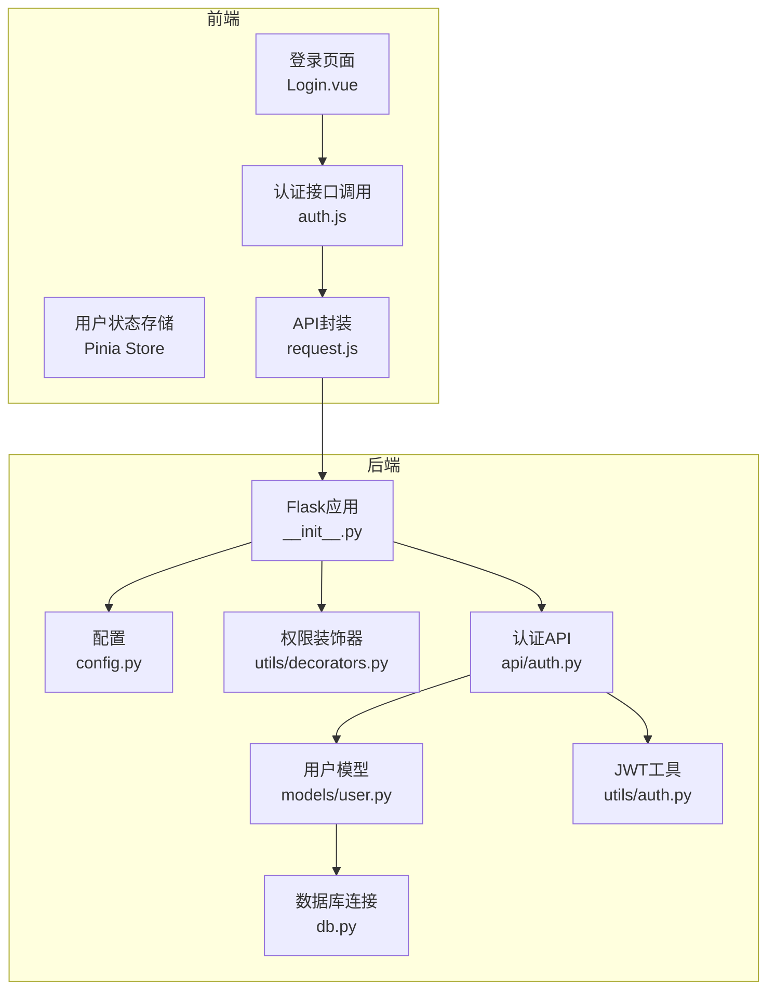
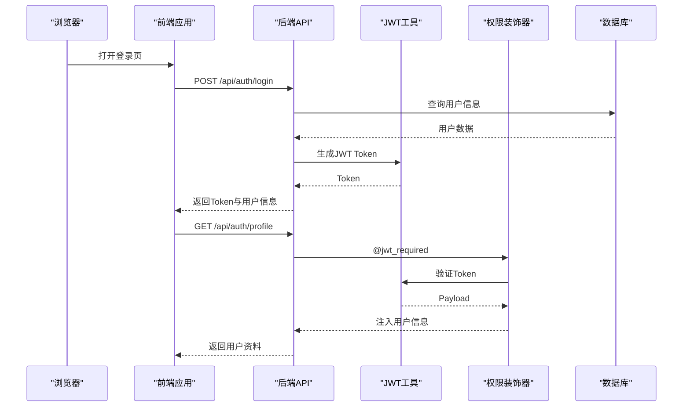
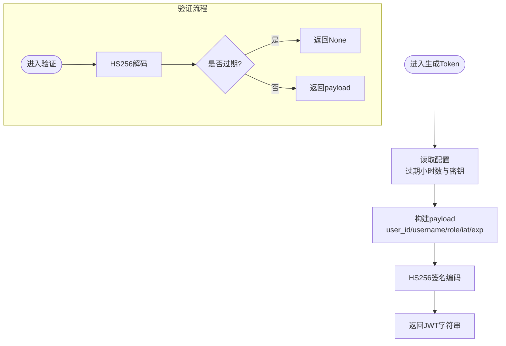
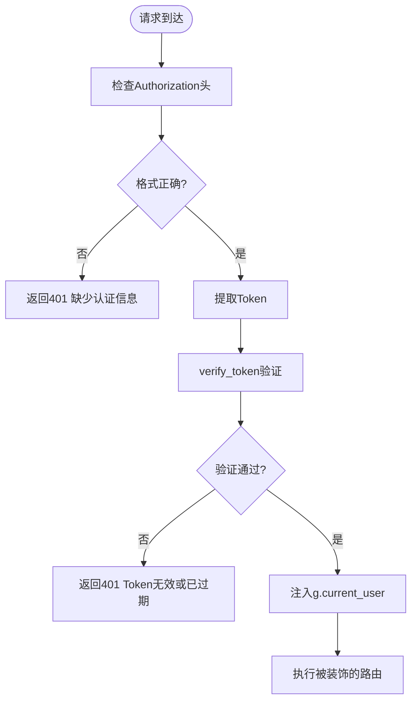
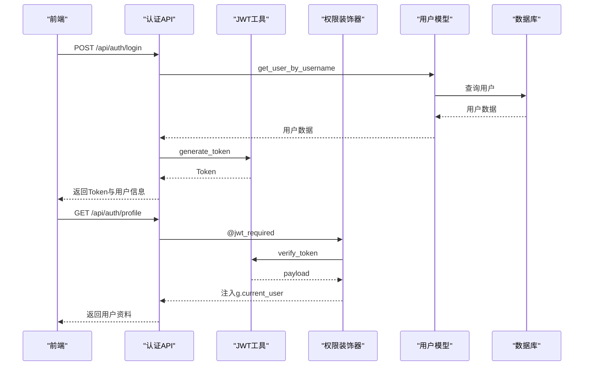
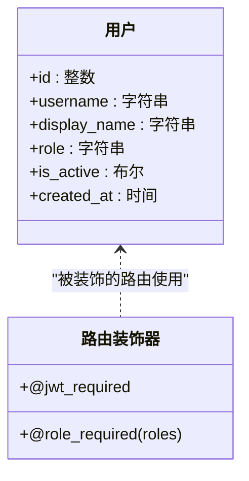
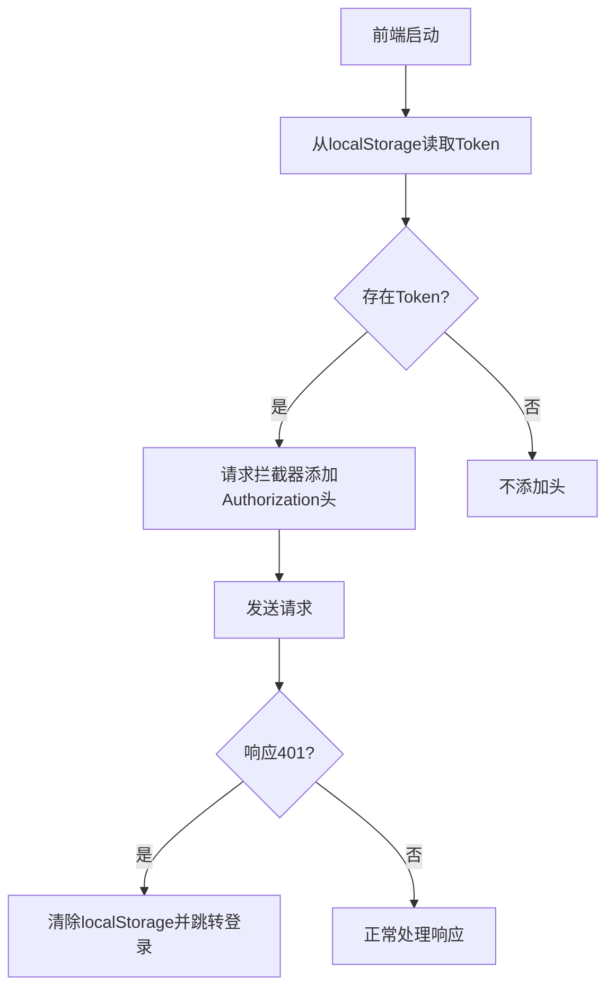
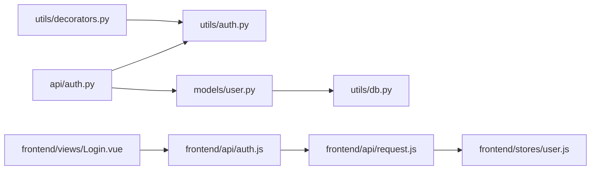

# 认证授权系统

<cite>
**本文档引用的文件**
- [backend/app/api/auth.py](file://backend/app/api/auth.py)
- [backend/app/utils/auth.py](file://backend/app/utils/auth.py)
- [backend/app/utils/decorators.py](file://backend/app/utils/decorators.py)
- [backend/app/models/user.py](file://backend/app/models/user.py)
- [backend/app/config.py](file://backend/app/config.py)
- [backend/app/utils/db.py](file://backend/app/utils/db.py)
- [backend/app/__init__.py](file://backend/app/__init__.py)
- [frontend/src/stores/user.js](file://frontend/src/stores/user.js)
- [frontend/src/api/auth.js](file://frontend/src/api/auth.js)
- [frontend/src/api/request.js](file://frontend/src/api/request.js)
- [frontend/src/views/Login.vue](file://frontend/src/views/Login.vue)
- [backend/init_db.py](file://backend/init_db.py)
</cite>

## 目录
1. [简介](#简介)
2. [项目结构](#项目结构)
3. [核心组件](#核心组件)
4. [架构总览](#架构总览)
5. [详细组件分析](#详细组件分析)
6. [依赖关系分析](#依赖关系分析)
7. [性能考虑](#性能考虑)
8. [故障排除指南](#故障排除指南)
9. [结论](#结论)
10. [附录](#附录)

## 简介
本文件为云运维平台的认证授权系统技术文档，围绕JWT Token的生成、验证与刷新机制，权限控制装饰器设计与实现，用户认证流程，角色权限模型，以及前后端集成细节进行全面阐述。文档同时提供安全最佳实践与常见问题的解决方案，帮助开发者与运维人员理解并优化系统的安全性与可用性。

## 项目结构
认证授权系统由后端Flask应用与前端Vue应用组成，采用前后端分离架构：
- 后端负责用户认证、权限校验、JWT签发与验证、数据库交互
- 前端负责用户界面、Token存储与携带、统一请求拦截与错误处理

图表来源
- [backend/app/__init__.py:37-62](file://backend/app/__init__.py#L37-L62)
- [backend/app/api/auth.py:11-115](file://backend/app/api/auth.py#L11-L115)
- [backend/app/utils/auth.py:11-36](file://backend/app/utils/auth.py#L11-L36)
- [backend/app/utils/decorators.py:9-57](file://backend/app/utils/decorators.py#L9-L57)
- [backend/app/models/user.py:39-80](file://backend/app/models/user.py#L39-L80)
- [backend/app/utils/db.py:5-17](file://backend/app/utils/db.py#L5-L17)
- [frontend/src/views/Login.vue:50-66](file://frontend/src/views/Login.vue#L50-L66)
- [frontend/src/api/request.js:13-23](file://frontend/src/api/request.js#L13-L23)

章节来源
- [backend/app/__init__.py:6-35](file://backend/app/__init__.py#L6-L35)
- [frontend/src/views/Login.vue:1-114](file://frontend/src/views/Login.vue#L1-L114)

## 核心组件
- JWT工具模块：负责Token生成、验证与密码哈希处理
- 权限装饰器模块：提供JWT认证与角色权限检查
- 用户模型模块：封装数据库用户相关操作
- 认证API模块：提供登录、获取用户资料、修改密码等接口
- 前端状态与请求拦截：负责Token持久化、请求头注入与统一错误处理

章节来源
- [backend/app/utils/auth.py:11-83](file://backend/app/utils/auth.py#L11-L83)
- [backend/app/utils/decorators.py:9-95](file://backend/app/utils/decorators.py#L9-L95)
- [backend/app/models/user.py:8-183](file://backend/app/models/user.py#L8-L183)
- [backend/app/api/auth.py:14-184](file://backend/app/api/auth.py#L14-L184)
- [frontend/src/stores/user.js:5-41](file://frontend/src/stores/user.js#L5-L41)
- [frontend/src/api/request.js:13-51](file://frontend/src/api/request.js#L13-L51)

## 架构总览
认证授权系统采用“前端Token存储 + 后端JWT验证 + 装饰器权限控制”的整体架构。用户通过前端登录成功后，后端签发JWT，前端将其存储在本地并随每次请求携带；后端通过装饰器解析请求头中的Bearer Token，验证有效性并将用户信息注入到请求上下文中，供业务逻辑使用。

图表来源
- [backend/app/api/auth.py:14-82](file://backend/app/api/auth.py#L14-L82)
- [backend/app/utils/auth.py:11-36](file://backend/app/utils/auth.py#L11-L36)
- [backend/app/utils/decorators.py:9-57](file://backend/app/utils/decorators.py#L9-L57)
- [frontend/src/api/request.js:13-23](file://frontend/src/api/request.js#L13-L23)

## 详细组件分析

### JWT Token生成与验证
- Token生成：包含用户ID、用户名、角色、签发时间与过期时间，使用对称加密算法HS256签名，密钥来自配置项
- Token验证：解析并验证签名，处理过期与无效Token异常，返回payload或None
- 密码处理：使用Werkzeug的哈希函数生成密码哈希，用于存储与验证

图表来源
- [backend/app/utils/auth.py:11-36](file://backend/app/utils/auth.py#L11-L36)
- [backend/app/utils/auth.py:38-56](file://backend/app/utils/auth.py#L38-L56)

章节来源
- [backend/app/utils/auth.py:11-83](file://backend/app/utils/auth.py#L11-L83)
- [backend/app/config.py:4-21](file://backend/app/config.py#L4-L21)

### 权限控制装饰器
- @jwt_required：从Authorization头提取Bearer Token，验证后将用户信息注入flask.g，供后续路由使用
- @role_required：在@jwt_required之后使用，检查当前用户角色是否在允许列表中，否则返回403

图表来源
- [backend/app/utils/decorators.py:9-57](file://backend/app/utils/decorators.py#L9-L57)

章节来源
- [backend/app/utils/decorators.py:9-95](file://backend/app/utils/decorators.py#L9-L95)

### 用户认证流程（登录到权限检查）
- 登录：前端提交用户名与密码，后端查询用户并校验密码，生成Token返回
- 获取用户资料：携带Token访问受保护接口，装饰器验证Token并返回用户信息
- 修改密码：携带Token访问修改接口，验证旧密码后更新新密码

图表来源
- [backend/app/api/auth.py:14-115](file://backend/app/api/auth.py#L14-L115)
- [backend/app/utils/auth.py:11-36](file://backend/app/utils/auth.py#L11-L36)
- [backend/app/utils/decorators.py:9-57](file://backend/app/utils/decorators.py#L9-L57)
- [backend/app/models/user.py:39-80](file://backend/app/models/user.py#L39-L80)

章节来源
- [backend/app/api/auth.py:14-184](file://backend/app/api/auth.py#L14-L184)
- [backend/app/models/user.py:8-183](file://backend/app/models/user.py#L8-L183)

### 角色权限模型
- 角色定义：支持admin（管理员）、operator（运维工程师）、viewer（普通用户）
- 角色检查：通过@role_required装饰器在路由上声明所需角色集合
- 默认用户：初始化脚本创建默认管理员账户，便于系统上线后快速登录

图表来源
- [backend/app/models/user.py:8-183](file://backend/app/models/user.py#L8-L183)
- [backend/app/utils/decorators.py:59-95](file://backend/app/utils/decorators.py#L59-L95)
- [backend/init_db.py:33-47](file://backend/init_db.py#L33-L47)

章节来源
- [backend/app/models/user.py:8-183](file://backend/app/models/user.py#L8-L183)
- [backend/init_db.py:33-47](file://backend/init_db.py#L33-L47)

### 认证中间件与Token存储策略
- 前端：使用localStorage存储Token与用户信息；请求拦截器自动在Authorization头添加Bearer Token
- 后端：装饰器从请求头解析并验证Token，验证失败统一返回401
- 会话管理：基于Token的无状态会话，无需服务端维护会话状态

图表来源
- [frontend/src/stores/user.js:5-41](file://frontend/src/stores/user.js#L5-L41)
- [frontend/src/api/request.js:13-51](file://frontend/src/api/request.js#L13-L51)
- [frontend/src/views/Login.vue:50-66](file://frontend/src/views/Login.vue#L50-L66)

章节来源
- [frontend/src/stores/user.js:5-41](file://frontend/src/stores/user.js#L5-L41)
- [frontend/src/api/request.js:13-51](file://frontend/src/api/request.js#L13-L51)
- [frontend/src/views/Login.vue:50-66](file://frontend/src/views/Login.vue#L50-L66)

### 数据库与配置
- 数据库初始化：创建用户表及索引，插入默认管理员账户
- 配置项：包含JWT密钥、过期时间、数据库连接参数等

章节来源
- [backend/init_db.py:22-259](file://backend/init_db.py#L22-L259)
- [backend/app/config.py:4-21](file://backend/app/config.py#L4-L21)
- [backend/app/utils/db.py:5-17](file://backend/app/utils/db.py#L5-L17)

## 依赖关系分析
- 认证API依赖JWT工具与用户模型
- 权限装饰器依赖JWT工具进行Token验证
- 用户模型依赖数据库工具进行数据访问
- 前端请求拦截器依赖用户状态存储

图表来源
- [backend/app/api/auth.py:7-9](file://backend/app/api/auth.py#L7-L9)
- [backend/app/utils/auth.py:4-6](file://backend/app/utils/auth.py#L4-L6)
- [backend/app/utils/decorators.py:6](file://backend/app/utils/decorators.py#L6)
- [backend/app/models/user.py:4](file://backend/app/models/user.py#L4)
- [backend/app/utils/db.py:2](file://backend/app/utils/db.py#L2)
- [frontend/src/api/request.js:13-23](file://frontend/src/api/request.js#L13-L23)
- [frontend/src/stores/user.js:5-41](file://frontend/src/stores/user.js#L5-L41)
- [frontend/src/api/auth.js:1-14](file://frontend/src/api/auth.js#L1-L14)
- [frontend/src/views/Login.vue:50-66](file://frontend/src/views/Login.vue#L50-L66)

章节来源
- [backend/app/api/auth.py:7-9](file://backend/app/api/auth.py#L7-L9)
- [backend/app/utils/decorators.py:6](file://backend/app/utils/decorators.py#L6)
- [backend/app/models/user.py:4](file://backend/app/models/user.py#L4)
- [backend/app/utils/db.py:2](file://backend/app/utils/db.py#L2)
- [frontend/src/api/request.js:13-23](file://frontend/src/api/request.js#L13-L23)
- [frontend/src/stores/user.js:5-41](file://frontend/src/stores/user.js#L5-L41)
- [frontend/src/api/auth.js:1-14](file://frontend/src/api/auth.js#L1-L14)
- [frontend/src/views/Login.vue:50-66](file://frontend/src/views/Login.vue#L50-L66)

## 性能考虑
- Token过期时间：默认24小时，可根据业务场景调整，平衡安全与用户体验
- 密钥管理：生产环境必须使用强随机密钥，避免硬编码
- 数据库索引：用户表对username与role建立索引，提升查询效率
- 前端拦截器：统一处理401错误，减少重复代码与错误处理成本

## 故障排除指南
- 登录失败：检查用户名与密码是否为空，确认用户是否激活，核对密码哈希是否匹配
- Token无效或过期：确认前端是否正确携带Authorization头，后端密钥是否一致，Token是否超过过期时间
- 权限不足：确认@role_required装饰器声明的角色集合是否包含当前用户角色
- 数据库连接：检查配置项中的数据库主机、端口、账号与密码是否正确

章节来源
- [backend/app/api/auth.py:23-61](file://backend/app/api/auth.py#L23-L61)
- [backend/app/utils/decorators.py:22-45](file://backend/app/utils/decorators.py#L22-L45)
- [backend/app/utils/auth.py:48-56](file://backend/app/utils/auth.py#L48-L56)
- [backend/app/config.py:9-17](file://backend/app/config.py#L9-L17)

## 结论
该认证授权系统通过JWT实现无状态认证，结合装饰器实现细粒度权限控制，前后端协同完成用户登录、Token携带与权限检查的完整链路。系统具备清晰的职责划分与良好的扩展性，建议在生产环境中强化密钥管理、完善Token刷新策略，并持续监控与审计认证相关日志。

## 附录
- 安全最佳实践
  - 强制HTTPS传输，防止Token在传输过程中被窃取
  - 生产环境使用强随机密钥，定期轮换
  - 限制Token过期时间，结合刷新机制降低风险
  - 对敏感接口增加额外校验（如IP白名单、设备指纹等）
  - 定期清理无效Token与审计日志
- 常见问题
  - Token未携带：前端拦截器未正确设置Authorization头
  - 密钥不一致：后端配置与前端或跨服务配置不一致
  - 角色权限错误：装饰器顺序错误或角色集合声明不正确
  - 数据库连接失败：配置项错误或网络不可达