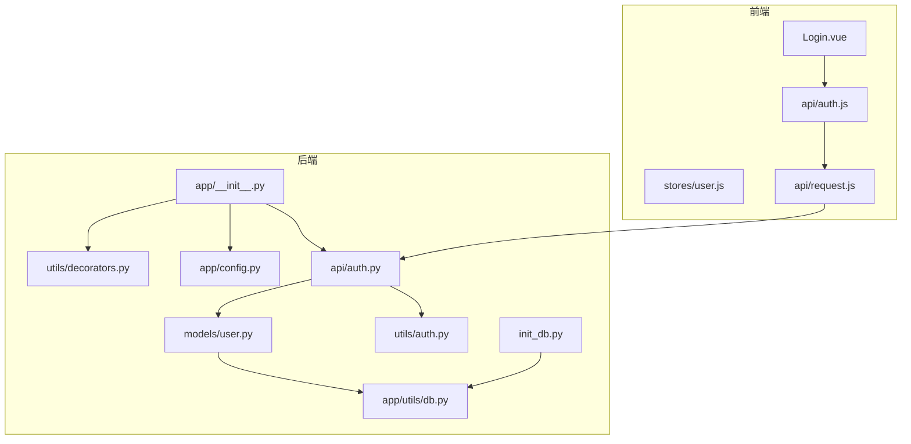
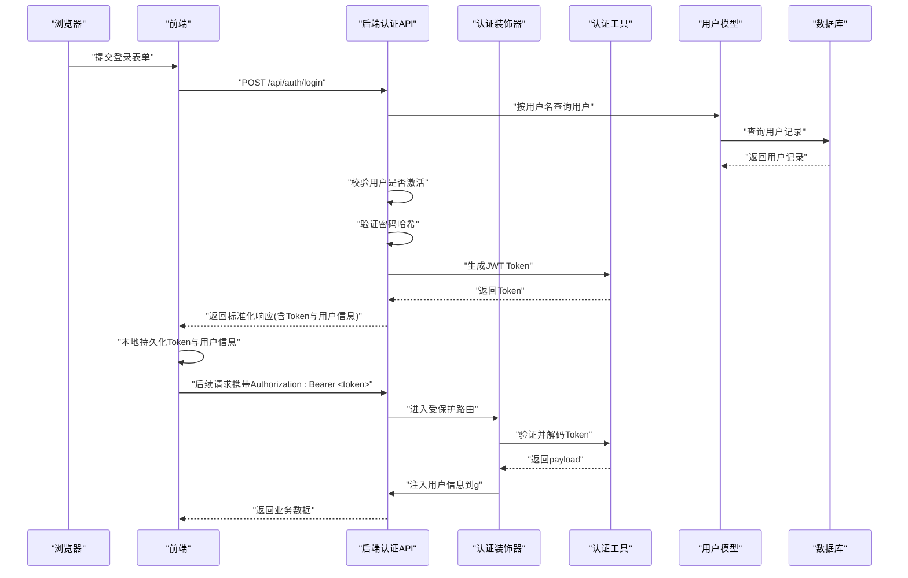
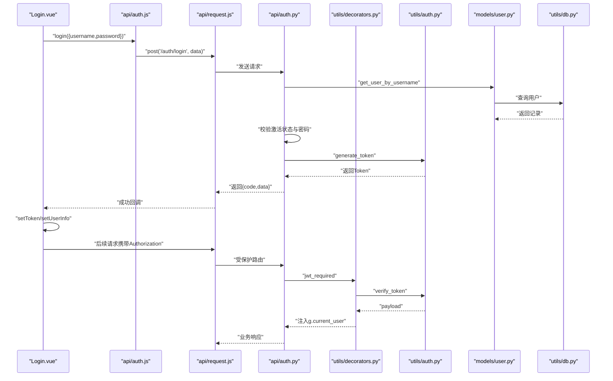
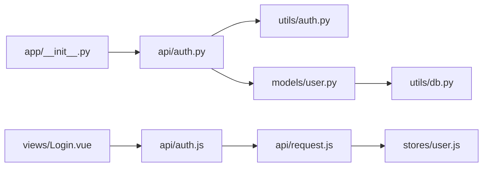

# 认证流程

<cite>
**本文引用的文件**
- [backend/app/api/auth.py](file://backend/app/api/auth.py)
- [backend/app/utils/auth.py](file://backend/app/utils/auth.py)
- [backend/app/utils/decorators.py](file://backend/app/utils/decorators.py)
- [backend/app/models/user.py](file://backend/app/models/user.py)
- [backend/app/utils/db.py](file://backend/app/utils/db.py)
- [backend/app/config.py](file://backend/app/config.py)
- [backend/app/__init__.py](file://backend/app/__init__.py)
- [backend/init_db.py](file://backend/init_db.py)
- [frontend/src/api/auth.js](file://frontend/src/api/auth.js)
- [frontend/src/api/request.js](file://frontend/src/api/request.js)
- [frontend/src/stores/user.js](file://frontend/src/stores/user.js)
- [frontend/src/views/Login.vue](file://frontend/src/views/Login.vue)
</cite>

## 目录
1. [简介](#简介)
2. [项目结构](#项目结构)
3. [核心组件](#核心组件)
4. [架构总览](#架构总览)
5. [详细组件分析](#详细组件分析)
6. [依赖关系分析](#依赖关系分析)
7. [性能考量](#性能考量)
8. [故障排查指南](#故障排查指南)
9. [结论](#结论)
10. [附录](#附录)

## 简介
本文件面向开发者与运维人员，系统性梳理该云平台项目的用户认证流程，覆盖从用户登录请求到权限验证的完整链路。文档重点说明：
- 登录接口的实现细节：用户名密码校验、数据库查询、Token生成与响应格式
- 认证中间件工作流：请求拦截、Token解析、用户信息注入与权限检查
- 前端认证状态管理：登录状态持久化、Token存储策略与自动登录机制
- 认证失败处理：错误响应格式、重定向逻辑与用户体验优化
- 提供认证流程时序图与代码示例路径，便于快速定位问题与调试

## 项目结构
后端采用Flask微服务架构，认证相关模块集中在以下位置：
- 后端认证API：backend/app/api/auth.py
- 认证工具与装饰器：backend/app/utils/auth.py、backend/app/utils/decorators.py
- 用户模型与数据库工具：backend/app/models/user.py、backend/app/utils/db.py
- 配置与应用入口：backend/app/config.py、backend/app/__init__.py
- 数据库初始化：backend/init_db.py
- 前端认证API封装与状态管理：frontend/src/api/auth.js、frontend/src/api/request.js、frontend/src/stores/user.js、frontend/src/views/Login.vue

图表来源
- [backend/app/__init__.py:37-62](file://backend/app/__init__.py#L37-L62)
- [backend/app/api/auth.py:14-82](file://backend/app/api/auth.py#L14-L82)
- [backend/app/utils/auth.py:11-35](file://backend/app/utils/auth.py#L11-L35)
- [backend/app/utils/decorators.py:9-56](file://backend/app/utils/decorators.py#L9-L56)
- [backend/app/models/user.py:39-58](file://backend/app/models/user.py#L39-L58)
- [backend/app/utils/db.py:5-16](file://backend/app/utils/db.py#L5-L16)
- [frontend/src/api/auth.js:3-5](file://frontend/src/api/auth.js#L3-L5)
- [frontend/src/api/request.js:13-23](file://frontend/src/api/request.js#L13-L23)
- [frontend/src/stores/user.js:6-21](file://frontend/src/stores/user.js#L6-L21)
- [frontend/src/views/Login.vue:50-66](file://frontend/src/views/Login.vue#L50-L66)

章节来源
- [backend/app/__init__.py:37-62](file://backend/app/__init__.py#L37-L62)
- [frontend/src/api/auth.js:3-5](file://frontend/src/api/auth.js#L3-L5)
- [frontend/src/api/request.js:13-23](file://frontend/src/api/request.js#L13-L23)
- [frontend/src/stores/user.js:6-21](file://frontend/src/stores/user.js#L6-L21)
- [frontend/src/views/Login.vue:50-66](file://frontend/src/views/Login.vue#L50-L66)

## 核心组件
- 登录接口：接收用户名与密码，校验用户是否存在、是否激活，验证密码哈希，签发JWT Token并返回标准化响应
- Token生成与验证：基于HS256算法，支持自定义密钥与过期时间配置
- 认证中间件：从请求头提取Bearer Token，验证后将用户信息注入到Flask全局对象，供后续路由使用
- 前端认证状态管理：使用Pinia Store持久化Token与用户信息，统一在请求拦截器中附加Authorization头
- 数据模型：提供按用户名与ID查询用户、更新密码等基础能力

章节来源
- [backend/app/api/auth.py:14-82](file://backend/app/api/auth.py#L14-L82)
- [backend/app/utils/auth.py:11-35](file://backend/app/utils/auth.py#L11-L35)
- [backend/app/utils/decorators.py:9-56](file://backend/app/utils/decorators.py#L9-L56)
- [frontend/src/api/auth.js:3-5](file://frontend/src/api/auth.js#L3-L5)
- [frontend/src/api/request.js:13-23](file://frontend/src/api/request.js#L13-L23)
- [frontend/src/stores/user.js:6-21](file://frontend/src/stores/user.js#L6-L21)

## 架构总览
认证链路从浏览器发起登录请求，经由前端Axios拦截器统一附加Token，后端Flask蓝图处理请求，认证装饰器解析并验证Token，最终返回业务数据或错误信息。

图表来源
- [frontend/src/views/Login.vue:50-66](file://frontend/src/views/Login.vue#L50-L66)
- [frontend/src/api/auth.js:3-5](file://frontend/src/api/auth.js#L3-L5)
- [frontend/src/api/request.js:13-23](file://frontend/src/api/request.js#L13-L23)
- [backend/app/api/auth.py:14-82](file://backend/app/api/auth.py#L14-L82)
- [backend/app/utils/decorators.py:9-56](file://backend/app/utils/decorators.py#L9-L56)
- [backend/app/utils/auth.py:11-35](file://backend/app/utils/auth.py#L11-L35)
- [backend/app/models/user.py:39-58](file://backend/app/models/user.py#L39-L58)
- [backend/app/utils/db.py:5-16](file://backend/app/utils/db.py#L5-L16)

## 详细组件分析

### 登录接口实现
- 请求体参数：用户名与密码
- 校验逻辑：
  - 请求体为空时返回400
  - 缺少用户名或密码时返回400
  - 按用户名查询用户，不存在则返回401
  - 用户未激活返回401
  - 密码哈希不匹配返回401
- 成功响应：返回200，包含Token与用户基本信息
- 失败响应：标准化错误格式，包含code与message

章节来源
- [backend/app/api/auth.py:14-82](file://backend/app/api/auth.py#L14-L82)

### Token生成与验证
- 生成：以用户ID、用户名、角色为载荷，设置签发时间与过期时间，默认24小时；使用HS256算法与配置中的密钥生成
- 验证：解码Token并校验签名，捕获过期与无效Token异常，返回None表示验证失败

章节来源
- [backend/app/utils/auth.py:11-35](file://backend/app/utils/auth.py#L11-L35)
- [backend/app/utils/auth.py:38-56](file://backend/app/utils/auth.py#L38-L56)
- [backend/app/config.py:4-7](file://backend/app/config.py#L4-L7)

### 认证中间件工作流程
- 请求拦截：从Authorization头提取Bearer Token
- 格式校验：必须为“Bearer <token>”
- Token验证：调用验证函数，失败返回401
- 用户信息注入：将用户ID、用户名、角色写入Flask全局对象，供后续路由使用

章节来源
- [backend/app/utils/decorators.py:9-56](file://backend/app/utils/decorators.py#L9-L56)

### 权限检查装饰器
- 角色权限：在@jwt_required之后使用，检查当前用户角色是否在允许列表中
- 未认证返回401，角色不符返回403

章节来源
- [backend/app/utils/decorators.py:59-95](file://backend/app/utils/decorators.py#L59-L95)

### 前端认证状态管理
- Token存储：登录成功后将Token写入localStorage，并在Pinia Store中维护
- 自动登录：页面加载时读取localStorage中的Token，用于后续请求
- 请求拦截：统一在请求头添加Authorization: Bearer <token>
- 错误处理：响应拦截器对401进行登出清理并跳转至登录页

章节来源
- [frontend/src/stores/user.js:6-21](file://frontend/src/stores/user.js#L6-L21)
- [frontend/src/api/request.js:13-23](file://frontend/src/api/request.js#L13-L23)
- [frontend/src/api/request.js:25-51](file://frontend/src/api/request.js#L25-L51)
- [frontend/src/views/Login.vue:50-66](file://frontend/src/views/Login.vue#L50-L66)

### 数据模型与数据库交互
- 用户查询：按用户名与ID查询用户，返回字典结果
- 密码更新：根据用户ID更新密码哈希
- 数据库连接：从Flask配置读取连接参数，使用DictCursor返回字典

章节来源
- [backend/app/models/user.py:39-58](file://backend/app/models/user.py#L39-L58)
- [backend/app/models/user.py:61-80](file://backend/app/models/user.py#L61-L80)
- [backend/app/models/user.py:161-182](file://backend/app/models/user.py#L161-L182)
- [backend/app/utils/db.py:5-16](file://backend/app/utils/db.py#L5-L16)

### 登录流程时序图（代码级）

图表来源
- [frontend/src/views/Login.vue:50-66](file://frontend/src/views/Login.vue#L50-L66)
- [frontend/src/api/auth.js:3-5](file://frontend/src/api/auth.js#L3-L5)
- [frontend/src/api/request.js:13-23](file://frontend/src/api/request.js#L13-L23)
- [backend/app/api/auth.py:14-82](file://backend/app/api/auth.py#L14-L82)
- [backend/app/utils/decorators.py:9-56](file://backend/app/utils/decorators.py#L9-L56)
- [backend/app/utils/auth.py:11-35](file://backend/app/utils/auth.py#L11-L35)
- [backend/app/models/user.py:39-58](file://backend/app/models/user.py#L39-L58)
- [backend/app/utils/db.py:5-16](file://backend/app/utils/db.py#L5-L16)

## 依赖关系分析
- 后端应用入口注册所有蓝图，认证API位于独立蓝图下
- 认证API依赖认证工具与用户模型；用户模型依赖数据库工具
- 前端通过统一请求封装与Pinia Store管理认证状态

图表来源
- [backend/app/__init__.py:37-62](file://backend/app/__init__.py#L37-L62)
- [backend/app/api/auth.py:7-8](file://backend/app/api/auth.py#L7-L8)
- [backend/app/utils/auth.py:4-6](file://backend/app/utils/auth.py#L4-L6)
- [backend/app/models/user.py:4](file://backend/app/models/user.py#L4)
- [frontend/src/api/auth.js:1](file://frontend/src/api/auth.js#L1)
- [frontend/src/api/request.js:1](file://frontend/src/api/request.js#L1)
- [frontend/src/stores/user.js:1](file://frontend/src/stores/user.js#L1)
- [frontend/src/views/Login.vue:32-33](file://frontend/src/views/Login.vue#L32-L33)

章节来源
- [backend/app/__init__.py:37-62](file://backend/app/__init__.py#L37-L62)
- [frontend/src/api/auth.js:1](file://frontend/src/api/auth.js#L1)
- [frontend/src/api/request.js:1](file://frontend/src/api/request.js#L1)
- [frontend/src/stores/user.js:1](file://frontend/src/stores/user.js#L1)
- [frontend/src/views/Login.vue:32-33](file://frontend/src/views/Login.vue#L32-L33)

## 性能考量
- Token过期时间：默认24小时，建议在生产环境缩短并结合刷新策略
- 密码哈希：使用安全算法，避免明文存储
- 数据库查询：用户名索引提升查询效率
- 请求拦截：统一附加Authorization头，减少重复逻辑
- 前端状态：localStorage持久化，避免频繁登录

[本节为通用指导，无需特定文件引用]

## 故障排查指南
- 登录失败
  - 检查请求体是否包含用户名与密码
  - 确认用户存在且处于激活状态
  - 核对密码哈希是否匹配
  - 查看后端返回的标准化错误响应
- Token无效或过期
  - 检查前端是否正确在请求头附加Authorization
  - 确认密钥与过期时间配置一致
  - 在响应拦截器中观察401处理逻辑
- 权限不足
  - 确认@jwt_required与@role_required的使用顺序
  - 检查用户角色是否在允许列表中
- 数据库连接
  - 核对DB_HOST、DB_PORT、DB_USER、DB_PASSWORD、DB_NAME配置
  - 确保数据库初始化脚本已执行

章节来源
- [backend/app/api/auth.py:23-82](file://backend/app/api/auth.py#L23-L82)
- [backend/app/utils/decorators.py:22-56](file://backend/app/utils/decorators.py#L22-L56)
- [frontend/src/api/request.js:25-51](file://frontend/src/api/request.js#L25-L51)
- [backend/app/config.py:9-13](file://backend/app/config.py#L9-L13)
- [backend/init_db.py:228-233](file://backend/init_db.py#L228-L233)

## 结论
该认证体系以JWT为核心，前后端协同完成登录、Token管理与权限控制。通过统一的请求拦截与响应处理，简化了跨路由的认证逻辑；通过Pinia Store与localStorage实现了轻量级的前端状态持久化。建议在生产环境中进一步完善Token刷新、角色权限细化与安全审计。

[本节为总结，无需特定文件引用]

## 附录
- 默认管理员账户：admin/admin123（初始化脚本中预置）
- 关键配置项：JWT_SECRET_KEY、JWT_EXPIRATION_HOURS、DB_*等

章节来源
- [backend/init_db.py:228-233](file://backend/init_db.py#L228-L233)
- [backend/app/config.py:4-7](file://backend/app/config.py#L4-L7)
- [backend/app/config.py:9-13](file://backend/app/config.py#L9-L13)