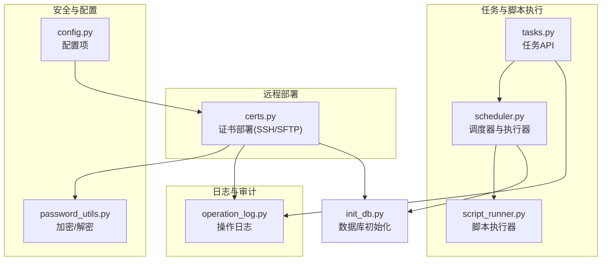
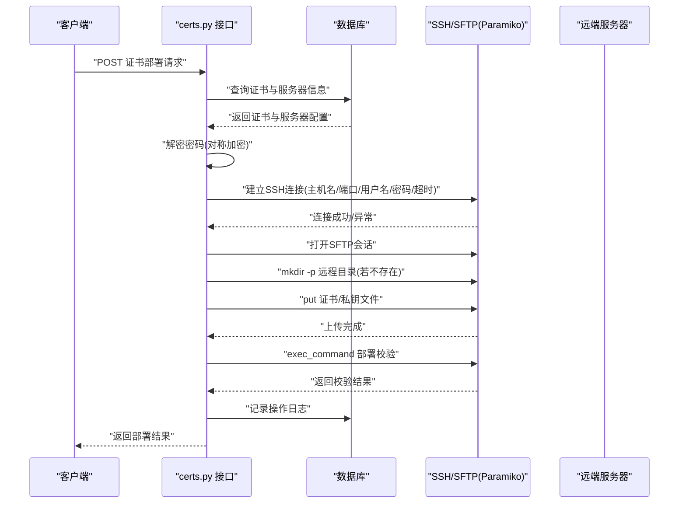
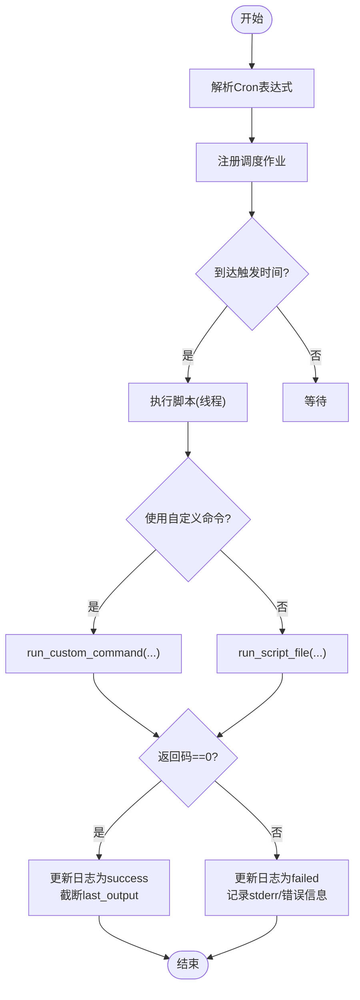
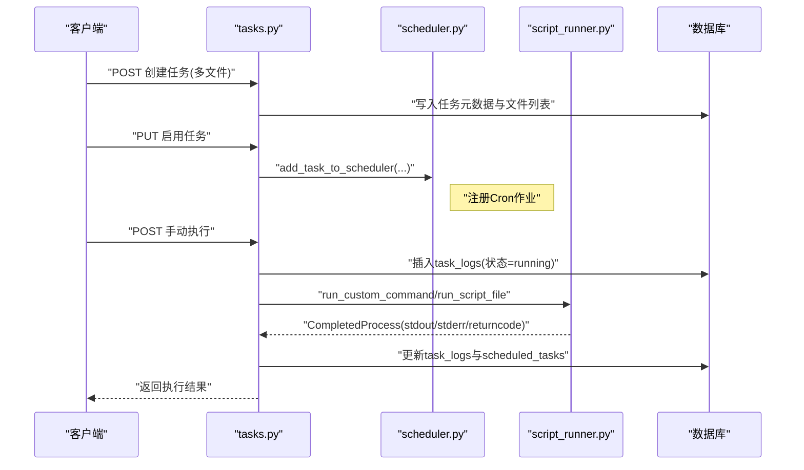
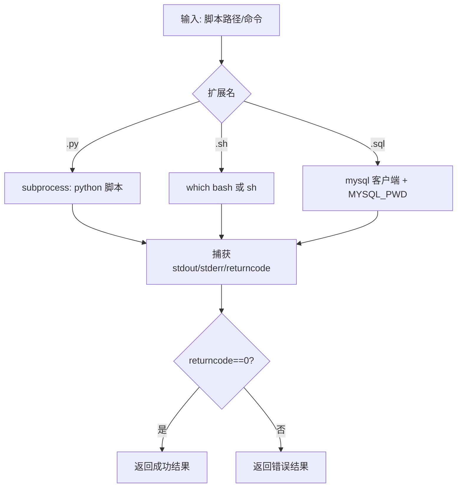
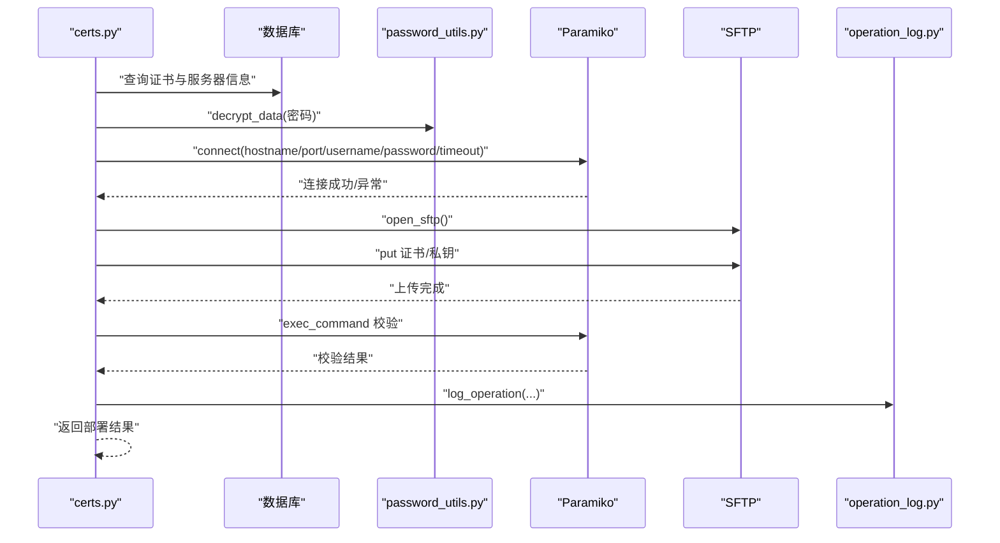
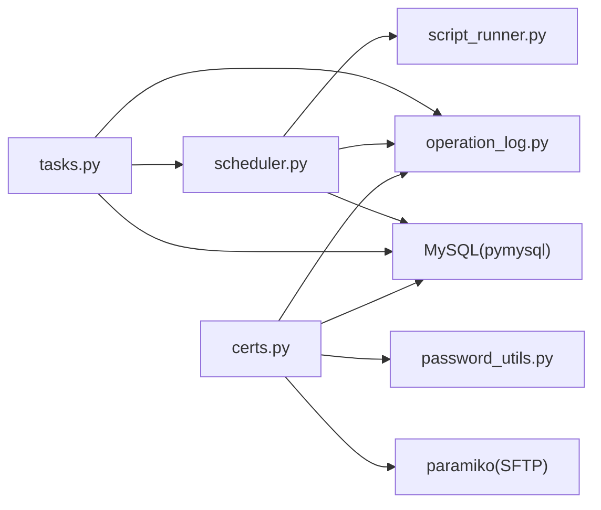

# SSH远程执行

<cite>
**本文引用的文件**
- [backend/app/utils/script_runner.py](file://backend/app/utils/script_runner.py)
- [backend/app/utils/scheduler.py](file://backend/app/utils/scheduler.py)
- [backend/app/api/tasks.py](file://backend/app/api/tasks.py)
- [backend/app/api/certs.py](file://backend/app/api/certs.py)
- [backend/app/utils/password_utils.py](file://backend/app/utils/password_utils.py)
- [backend/app/utils/operation_log.py](file://backend/app/utils/operation_log.py)
- [backend/init_db.py](file://backend/init_db.py)
- [backend/app/config.py](file://backend/app/config.py)
</cite>

## 目录
1. [简介](#简介)
2. [项目结构](#项目结构)
3. [核心组件](#核心组件)
4. [架构总览](#架构总览)
5. [详细组件分析](#详细组件分析)
6. [依赖分析](#依赖分析)
7. [性能考虑](#性能考虑)
8. [故障排查指南](#故障排查指南)
9. [结论](#结论)
10. [附录](#附录)

## 简介
本文件面向OPS平台的“SSH远程执行”能力，系统性梳理了以下方面：
- SSH连接管理：连接建立、认证机制、连接策略与超时控制
- 远程命令执行：命令发送、输出捕获、错误处理、超时控制
- 文件传输：SCP/SFTP协议使用、文件上传下载、权限设置、部署校验
- 脚本执行安全策略：命令白名单、权限控制、日志与审计
- SSH配置最佳实践：密钥管理、连接优化、并发控制
- 使用示例、错误处理策略与性能优化建议

说明：当前仓库中存在基于paramiko的证书部署流程（包含SSH/SFTP上传），但未发现通用的“远程命令执行”接口或“通用SSH连接池”。本文在“概念性概述”部分给出通用实现建议，帮助读者在现有基础上扩展。

## 项目结构
围绕SSH远程执行的相关代码主要分布在以下模块：
- 任务调度与脚本执行：scheduler、tasks、script_runner
- 证书部署（含SSH/SFTP）：certs
- 安全与配置：password_utils、config
- 日志与审计：operation_log
- 数据库初始化：init_db

图表来源
- [backend/app/utils/scheduler.py:1-200](file://backend/app/utils/scheduler.py#L1-L200)
- [backend/app/api/tasks.py:1-200](file://backend/app/api/tasks.py#L1-L200)
- [backend/app/utils/script_runner.py:1-126](file://backend/app/utils/script_runner.py#L1-L126)
- [backend/app/api/certs.py:1229-1493](file://backend/app/api/certs.py#L1229-L1493)
- [backend/app/utils/password_utils.py:1-130](file://backend/app/utils/password_utils.py#L1-L130)
- [backend/app/utils/operation_log.py:1-172](file://backend/app/utils/operation_log.py#L1-L172)
- [backend/init_db.py:220-257](file://backend/init_db.py#L220-L257)
- [backend/app/config.py:1-58](file://backend/app/config.py#L1-L58)

章节来源
- [backend/app/utils/scheduler.py:1-200](file://backend/app/utils/scheduler.py#L1-L200)
- [backend/app/api/tasks.py:1-200](file://backend/app/api/tasks.py#L1-L200)
- [backend/app/utils/script_runner.py:1-126](file://backend/app/utils/script_runner.py#L1-L126)
- [backend/app/api/certs.py:1229-1493](file://backend/app/api/certs.py#L1229-L1493)
- [backend/app/utils/password_utils.py:1-130](file://backend/app/utils/password_utils.py#L1-L130)
- [backend/app/utils/operation_log.py:1-172](file://backend/app/utils/operation_log.py#L1-L172)
- [backend/init_db.py:220-257](file://backend/init_db.py#L220-L257)
- [backend/app/config.py:1-58](file://backend/app/config.py#L1-L58)

## 核心组件
- 调度器与执行器：负责解析Cron表达式、启动执行线程、调用脚本执行器、记录任务日志与状态
- 任务API：提供任务创建、修改、启停、手动执行、日志查询等接口
- 脚本执行器：封装subprocess执行，支持Python/Shell/SQL脚本，具备超时控制与输出捕获
- 证书部署（SSH/SFTP）：基于paramiko建立SSH连接，使用SFTP上传证书文件并进行部署校验
- 安全工具：提供敏感数据对称加解密、密码哈希与校验
- 操作日志：统一记录模块、动作、目标、详情、IP与UA等信息
- 数据库初始化：定义任务日志、操作日志等表结构

章节来源
- [backend/app/utils/scheduler.py:1-200](file://backend/app/utils/scheduler.py#L1-L200)
- [backend/app/api/tasks.py:1-200](file://backend/app/api/tasks.py#L1-L200)
- [backend/app/utils/script_runner.py:1-126](file://backend/app/utils/script_runner.py#L1-L126)
- [backend/app/api/certs.py:1229-1493](file://backend/app/api/certs.py#L1229-L1493)
- [backend/app/utils/password_utils.py:1-130](file://backend/app/utils/password_utils.py#L1-L130)
- [backend/app/utils/operation_log.py:1-172](file://backend/app/utils/operation_log.py#L1-L172)
- [backend/init_db.py:220-257](file://backend/init_db.py#L220-L257)

## 架构总览
下图展示“证书部署（SSH/SFTP）”的端到端流程，体现连接建立、认证、文件传输与部署校验：

图表来源
- [backend/app/api/certs.py:1311-1493](file://backend/app/api/certs.py#L1311-L1493)
- [backend/app/utils/password_utils.py:113-129](file://backend/app/utils/password_utils.py#L113-L129)
- [backend/app/utils/operation_log.py:49-118](file://backend/app/utils/operation_log.py#L49-L118)

## 详细组件分析

### 组件A：调度器与任务执行（scheduler）
- 功能要点
  - 解析Cron表达式，创建APScheduler作业
  - 在独立线程中执行脚本，捕获stdout/stderr与异常
  - 记录任务日志（状态、开始/结束时间、输出、错误）
  - 支持自定义执行命令与多脚本目录模式
- 关键流程
  - 添加任务：解析Cron，构造CronTrigger，注册执行函数
  - 执行脚本：创建任务日志记录，更新任务最后运行时间；优先执行自定义命令，否则执行脚本文件；超时捕获TimeoutExpired
  - 更新状态：根据返回码更新任务日志与任务表的last_status/last_output
- 性能与并发
  - 使用BackgroundScheduler与线程池模型，避免阻塞主进程
  - 单任务内串行执行，避免资源竞争；可通过外部并发控制限制同时运行任务数

图表来源
- [backend/app/utils/scheduler.py:181-229](file://backend/app/utils/scheduler.py#L181-L229)
- [backend/app/utils/scheduler.py:39-178](file://backend/app/utils/scheduler.py#L39-L178)

章节来源
- [backend/app/utils/scheduler.py:1-200](file://backend/app/utils/scheduler.py#L1-L200)
- [backend/app/utils/scheduler.py:244-290](file://backend/app/utils/scheduler.py#L244-L290)

### 组件B：任务API（tasks）
- 功能要点
  - 任务创建：支持多文件上传、白名单校验（.py/.sh）、持久化任务目录
  - 任务启停：动态添加/移除调度作业
  - 手动执行：创建任务日志，异步线程执行，回写结果
  - 日志查询：按任务ID查询最近执行日志
- 安全与合规
  - 文件扩展名校验，防止非预期脚本类型
  - 与操作日志集成，记录模块、动作、目标与详情

图表来源
- [backend/app/api/tasks.py:144-200](file://backend/app/api/tasks.py#L144-L200)
- [backend/app/api/tasks.py:450-483](file://backend/app/api/tasks.py#L450-L483)
- [backend/app/api/tasks.py:521-631](file://backend/app/api/tasks.py#L521-L631)
- [backend/app/utils/scheduler.py:181-229](file://backend/app/utils/scheduler.py#L181-L229)
- [backend/app/utils/script_runner.py:19-126](file://backend/app/utils/script_runner.py#L19-L126)

章节来源
- [backend/app/api/tasks.py:1-200](file://backend/app/api/tasks.py#L1-L200)
- [backend/app/api/tasks.py:450-483](file://backend/app/api/tasks.py#L450-L483)
- [backend/app/api/tasks.py:521-631](file://backend/app/api/tasks.py#L521-L631)

### 组件C：脚本执行器（script_runner）
- 功能要点
  - 支持.py/.sh/.sql三类脚本
  - .py：直接调用Python解释器
  - .sh：优先bash，其次sh
  - .sql：通过mysql客户端执行，注入环境变量MYSQL_PWD
  - 超时控制：统一超时参数（默认300秒）
  - 输出捕获：capture_output=True，text=True
- 安全策略
  - 文件类型白名单校验（assert_allowed_script）
  - 严格shell=False的subprocess调用（避免命令注入风险）

图表来源
- [backend/app/utils/script_runner.py:49-126](file://backend/app/utils/script_runner.py#L49-L126)

章节来源
- [backend/app/utils/script_runner.py:1-126](file://backend/app/utils/script_runner.py#L1-L126)

### 组件D：证书部署（SSH/SFTP）
- 功能要点
  - 读取服务器配置与证书文件路径
  - 解密存储的密码（对称加密）
  - paramiko建立SSH连接（AutoAddPolicy、超时30秒）
  - SFTP上传证书与私钥，必要时创建远程目录
  - 部署后执行校验命令，记录操作日志
- 错误处理
  - 连接异常、文件不存在、上传失败、校验失败均返回友好错误信息

图表来源
- [backend/app/api/certs.py:1311-1493](file://backend/app/api/certs.py#L1311-L1493)
- [backend/app/utils/password_utils.py:113-129](file://backend/app/utils/password_utils.py#L113-L129)
- [backend/app/utils/operation_log.py:49-118](file://backend/app/utils/operation_log.py#L49-L118)

章节来源
- [backend/app/api/certs.py:1229-1493](file://backend/app/api/certs.py#L1229-L1493)

### 组件E：安全与配置（password_utils、config）
- 密码与敏感数据
  - 对称加密：Fernet或PBKDF2派生密钥，支持加密/解密
  - 密码哈希：bcrypt，兼容Werkzeug scrypt格式
- 配置项
  - JWT密钥、过期时间、数据库连接、上传目录、CORS等

章节来源
- [backend/app/utils/password_utils.py:1-130](file://backend/app/utils/password_utils.py#L1-L130)
- [backend/app/config.py:1-58](file://backend/app/config.py#L1-L58)

### 组件F：日志与审计（operation_log）
- 统一日志记录：模块、动作、目标、详情、IP、UA、UTC时间
- 便于审计追踪与问题定位

章节来源
- [backend/app/utils/operation_log.py:1-172](file://backend/app/utils/operation_log.py#L1-L172)

## 依赖分析
- 组件耦合
  - tasks依赖scheduler与script_runner，形成“任务—调度—执行”的链路
  - certs依赖password_utils进行密码解密、operation_log进行审计
  - scheduler依赖script_runner进行实际执行
- 外部依赖
  - APscheduler用于Cron调度
  - paramiko用于SSH/SFTP
  - MySQL客户端用于.sql执行
  - bcrypt/Fernet用于安全处理

图表来源
- [backend/app/api/tasks.py:1-200](file://backend/app/api/tasks.py#L1-L200)
- [backend/app/utils/scheduler.py:1-200](file://backend/app/utils/scheduler.py#L1-L200)
- [backend/app/utils/script_runner.py:1-126](file://backend/app/utils/script_runner.py#L1-L126)
- [backend/app/api/certs.py:1229-1493](file://backend/app/api/certs.py#L1229-L1493)
- [backend/app/utils/password_utils.py:1-130](file://backend/app/utils/password_utils.py#L1-L130)
- [backend/app/utils/operation_log.py:1-172](file://backend/app/utils/operation_log.py#L1-L172)

## 性能考虑
- 并发与资源
  - 调度器使用线程模型，建议限制同时运行任务数，避免CPU/IO争抢
  - 子进程执行脚本，注意系统ulimit与进程数上限
- 超时与健壮性
  - 统一超时300秒，可根据脚本复杂度调整
  - 对外接口建议增加请求级超时，避免阻塞
- I/O优化
  - SFTP上传前先mkdir -p，减少失败重试
  - SQL执行通过stdin传入脚本内容，避免临时文件I/O
- 缓存与复用
  - 当前未见连接池实现，建议在需要频繁远程执行的场景引入连接池与会话复用

## 故障排查指南
- 证书部署失败
  - 检查服务器IP类型与端口范围
  - 确认证书文件路径存在且可读
  - 查看连接异常与SFTP上传异常的具体错误信息
  - 校验部署后执行的校验命令是否可用
- 任务执行失败
  - 查看task_logs表的status、error_message与output
  - 确认脚本扩展名在白名单内
  - 检查数据库连接配置与调度器是否初始化成功
- 日志审计
  - 使用operation_logs接口筛选模块与动作，定位问题责任人与时间线

章节来源
- [backend/app/api/certs.py:1311-1493](file://backend/app/api/certs.py#L1311-L1493)
- [backend/app/api/tasks.py:521-631](file://backend/app/api/tasks.py#L521-L631)
- [backend/app/utils/operation_log.py:20-100](file://backend/app/utils/operation_log.py#L20-L100)

## 结论
- 项目已具备完善的任务调度与脚本执行能力，支持多文件任务、超时控制与日志记录
- 证书部署流程完整展示了SSH/SFTP的典型用法，可作为远程文件部署的参考模板
- 未发现通用的“远程命令执行”接口与“SSH连接池”，建议在此基础上扩展通用SSH客户端与连接池
- 安全方面已具备密码与敏感数据的对称加解密、密码哈希与统一操作日志，满足基本审计需求

## 附录

### 使用示例（概念性）
- 任务创建与执行
  - 上传多个脚本文件，系统自动创建任务目录并持久化
  - 启用任务后由调度器按Cron周期执行
  - 支持手动触发一次执行
- 证书部署
  - 指定服务器ID、远端路径、IP类型与端口
  - 选择系统用户或普通用户进行认证
  - 上传证书与私钥，并执行部署校验

### 错误处理策略（概念性）
- 参数校验：IP类型、端口范围、文件扩展名
- 连接异常：重试次数、超时时间、降级策略
- 传输异常：断点续传、重试、失败回滚
- 执行异常：超时、输出截断、错误码映射

### 性能优化建议（概念性）
- 引入SSH连接池，减少握手开销
- 限流与并发控制，避免资源争用
- 任务分片与并行化，提升吞吐
- 使用压缩与增量传输，降低带宽占用