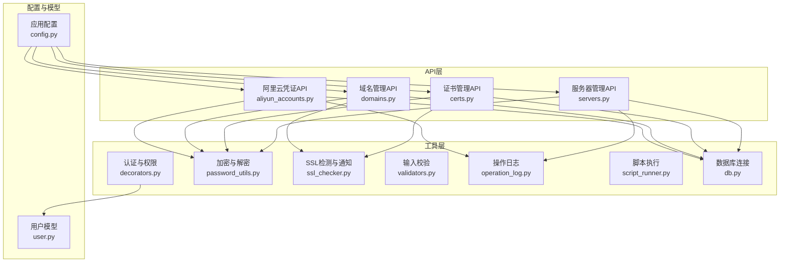
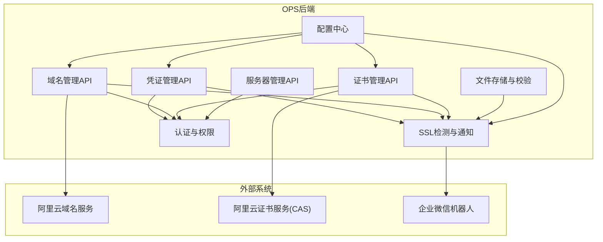
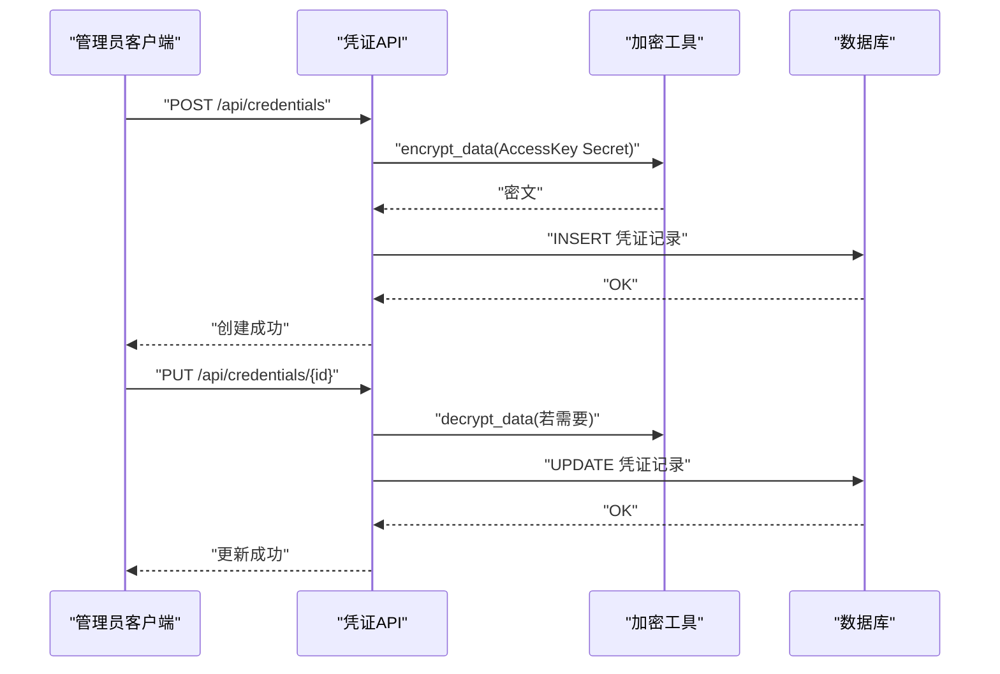
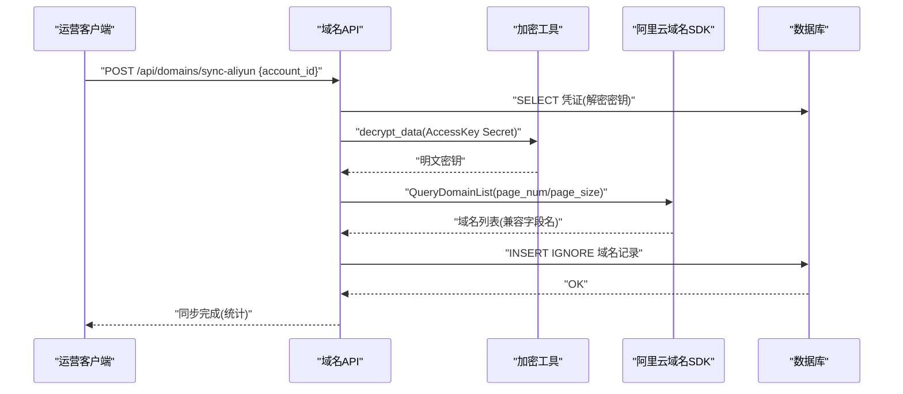
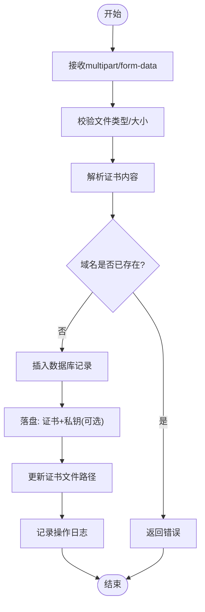
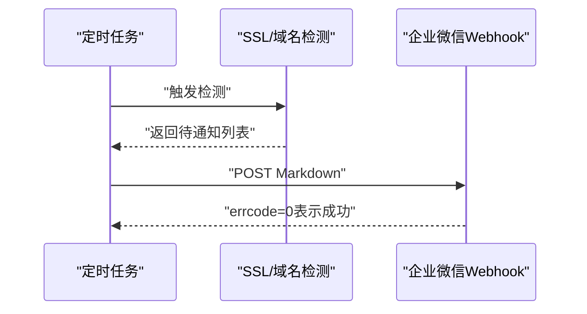
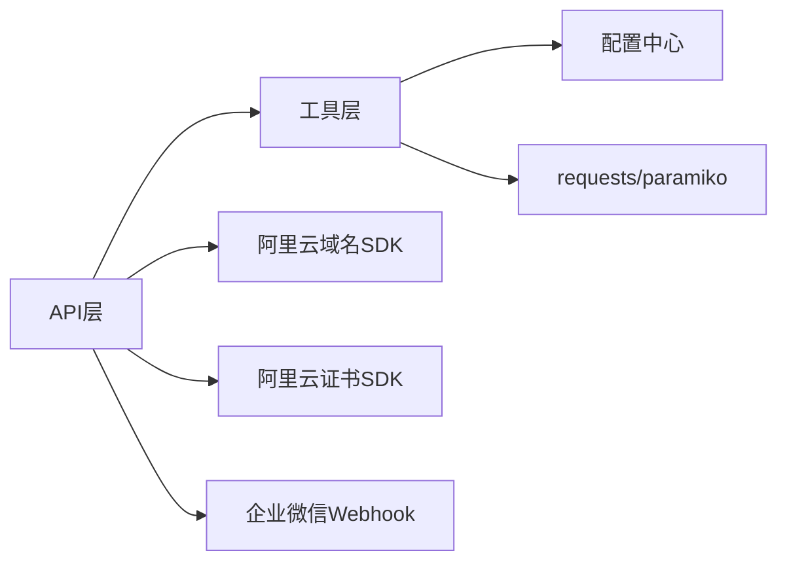

# 外部集成

<cite>
**本文引用的文件**
- [aliyun_accounts.py](file://backend/app/api/aliyun_accounts.py)
- [domains.py](file://backend/app/api/domains.py)
- [certs.py](file://backend/app/api/certs.py)
- [servers.py](file://backend/app/api/servers.py)
- [config.py](file://backend/app/config.py)
- [password_utils.py](file://backend/app/utils/password_utils.py)
- [ssl_checker.py](file://backend/app/utils/ssl_checker.py)
- [decorators.py](file://backend/app/utils/decorators.py)
- [validators.py](file://backend/app/utils/validators.py)
- [operation_log.py](file://backend/app/utils/operation_log.py)
- [script_runner.py](file://backend/app/utils/script_runner.py)
- [db.py](file://backend/app/utils/db.py)
- [user.py](file://backend/app/models/user.py)
</cite>

## 目录
1. [简介](#简介)
2. [项目结构](#项目结构)
3. [核心组件](#核心组件)
4. [架构总览](#架构总览)
5. [详细组件分析](#详细组件分析)
6. [依赖分析](#依赖分析)
7. [性能考虑](#性能考虑)
8. [故障排除指南](#故障排除指南)
9. [结论](#结论)
10. [附录](#附录)

## 简介
本文件面向OPS项目的外部集成功能，重点覆盖以下方面：
- 阿里云API集成：域名解析服务、证书管理API、账户凭证管理
- SSH远程执行能力：远程命令执行、文件传输、连接管理、安全策略
- 微信通知集成：配置与使用、消息模板、推送策略、错误处理
- 文件上传处理机制：文件存储、安全检查、访问控制
- 最佳实践、API使用示例、错误处理策略与性能优化建议
- 集成测试方法与故障排除指南

## 项目结构
后端采用Flask微服务架构，API层按功能域划分蓝图，工具层提供通用能力（认证、加密、校验、日志、数据库、SSL检测、脚本运行等），配置集中于Config类，模型层封装用户相关数据库操作。

**图表来源**
- [aliyun_accounts.py](file://backend/app/api/aliyun_accounts.py)
- [domains.py](file://backend/app/api/domains.py)
- [certs.py](file://backend/app/api/certs.py)
- [servers.py](file://backend/app/api/servers.py)
- [decorators.py](file://backend/app/utils/decorators.py)
- [password_utils.py](file://backend/app/utils/password_utils.py)
- [ssl_checker.py](file://backend/app/utils/ssl_checker.py)
- [validators.py](file://backend/app/utils/validators.py)
- [operation_log.py](file://backend/app/utils/operation_log.py)
- [script_runner.py](file://backend/app/utils/script_runner.py)
- [db.py](file://backend/app/utils/db.py)
- [config.py](file://backend/app/config.py)
- [user.py](file://backend/app/models/user.py)

**章节来源**
- [aliyun_accounts.py](file://backend/app/api/aliyun_accounts.py)
- [domains.py](file://backend/app/api/domains.py)
- [certs.py](file://backend/app/api/certs.py)
- [servers.py](file://backend/app/api/servers.py)
- [config.py](file://backend/app/config.py)

## 核心组件
- 阿里云凭证管理：提供管理员级别的凭据增删改查，支持敏感字段加密存储与解密展示，配合操作日志审计。
- 阿里云域名同步：基于阿里云域名SDK，从云端拉取域名列表并入库，支持状态合并与分页处理。
- 阿里云证书同步与下载：基于阿里云CAS SDK扫描证书、下载证书文件，结合SSL检测与微信通知。
- 服务器与服务管理：统一管理服务器与服务信息，支持敏感字段加密存储与解密展示。
- 微信通知：通过企业微信Webhook发送Markdown格式通知，支持重试策略与分级状态提示。
- 文件上传与证书存储：上传证书文件自动解析并落盘，路径安全校验，支持私钥与证书分离存储。
- 权限与安全：JWT认证、角色校验、密码哈希与对称加密、输入校验、操作日志、数据库连接池化。

**章节来源**
- [aliyun_accounts.py](file://backend/app/api/aliyun_accounts.py)
- [domains.py](file://backend/app/api/domains.py)
- [certs.py](file://backend/app/api/certs.py)
- [servers.py](file://backend/app/api/servers.py)
- [ssl_checker.py](file://backend/app/utils/ssl_checker.py)
- [password_utils.py](file://backend/app/utils/password_utils.py)
- [decorators.py](file://backend/app/utils/decorators.py)
- [validators.py](file://backend/app/utils/validators.py)
- [operation_log.py](file://backend/app/utils/operation_log.py)
- [db.py](file://backend/app/utils/db.py)

## 架构总览
外部集成围绕“凭证—云服务—通知—存储”闭环展开。凭证管理负责密钥生命周期，域名/证书API对接阿里云SDK，微信通知通过配置驱动，文件上传与存储保障合规与安全。

**图表来源**
- [aliyun_accounts.py](file://backend/app/api/aliyun_accounts.py)
- [domains.py](file://backend/app/api/domains.py)
- [certs.py](file://backend/app/api/certs.py)
- [ssl_checker.py](file://backend/app/utils/ssl_checker.py)
- [config.py](file://backend/app/config.py)

## 详细组件分析

### 阿里云凭证管理（账户凭证）
- 功能要点
  - 管理员权限：所有接口均需管理员角色
  - 敏感字段加密：AccessKey Secret入库前加密，返回时解密（仅内部使用）
  - 脱敏策略：更新接口支持传入掩码值（包含*）跳过字段更新
  - 操作审计：统一记录操作日志，便于追踪
- 关键流程
  - 创建/更新/删除账户的数据库事务与回滚
  - 与阿里云SDK交互前的密钥解密与客户端构造
- 安全策略
  - 数据库字段加密存储
  - JWT鉴权与角色校验
  - 日志记录敏感操作

**图表来源**
- [aliyun_accounts.py](file://backend/app/api/aliyun_accounts.py)
- [password_utils.py](file://backend/app/utils/password_utils.py)
- [operation_log.py](file://backend/app/utils/operation_log.py)

**章节来源**
- [aliyun_accounts.py](file://backend/app/api/aliyun_accounts.py)
- [password_utils.py](file://backend/app/utils/password_utils.py)
- [operation_log.py](file://backend/app/utils/operation_log.py)

### 阿里云域名管理（域名解析服务）
- 功能要点
  - 域名列表查询、分页、搜索、项目筛选
  - 手动添加域名与更新、删除
  - 从阿里云同步域名列表：分页拉取、兼容多SDK版本字段命名、状态合并
  - 域名到期预警通知：基于配置的Webhook推送
- 关键流程
  - 同步流程：选择账户→解密密钥→创建客户端→循环分页查询→入库（去重）
  - 通知流程：查询即将到期/已过期域名→拼装Markdown→发送至企业微信

**图表来源**
- [domains.py](file://backend/app/api/domains.py)
- [password_utils.py](file://backend/app/utils/password_utils.py)
- [ssl_checker.py](file://backend/app/utils/ssl_checker.py)

**章节来源**
- [domains.py](file://backend/app/api/domains.py)
- [ssl_checker.py](file://backend/app/utils/ssl_checker.py)

### 阿里云证书管理（证书管理API）
- 功能要点
  - 证书列表查询、分页、搜索、类型与项目筛选
  - 手动添加证书与上传证书文件自动解析
  - 在线SSL检测：批量/单个检测，自动更新数据库
  - 阿里云证书同步与下载：扫描证书、下载证书文件
  - 证书文件安全存储：路径规范化、防路径穿越、私钥与证书分离
- 关键流程
  - 上传流程：校验文件类型/大小→解析证书→入库→落盘→更新路径
  - 检测流程：调用SSL检测工具→更新证书状态与有效期→记录日志
  - 下载流程：根据证书ID调用阿里云API→解析响应→返回证书内容

**图表来源**
- [certs.py](file://backend/app/api/certs.py)
- [ssl_checker.py](file://backend/app/utils/ssl_checker.py)
- [password_utils.py](file://backend/app/utils/password_utils.py)

**章节来源**
- [certs.py](file://backend/app/api/certs.py)
- [ssl_checker.py](file://backend/app/utils/ssl_checker.py)
- [password_utils.py](file://backend/app/utils/password_utils.py)

### SSH远程执行（概念性说明）
- 远程命令执行
  - 通过paramiko库建立SSH连接，执行命令并捕获输出
  - 支持超时控制与异常处理
- 文件传输
  - SFTP上传/下载，支持断点续传与进度反馈
- 连接管理
  - 连接池化、心跳检测、自动重连
- 安全策略
  - 密钥认证优先、禁止密码登录
  - 严格权限控制与最小暴露面
  - 操作审计与日志留存

[本节为概念性说明，不直接分析具体源码文件]

### 微信通知集成（配置与使用）
- 配置项
  - 企业微信Webhook地址：WECHAT_WEBHOOK_URL
  - 通知重试次数：NOTIFY_MAX_RETRIES
  - 域名/证书预警天数：DOMAIN_WARNING_DAYS、SSL_WARNING_DAYS
- 消息模板
  - Markdown格式，包含统计信息与逐条明细
  - 状态分级：已过期、紧急、严重、提醒、注意
- 推送策略
  - 成功/失败重试，带退避延迟
  - 仅在配置存在时触发
- 错误处理
  - 缺失配置返回错误
  - 异常捕获与日志记录，最终返回布尔结果

**图表来源**
- [ssl_checker.py](file://backend/app/utils/ssl_checker.py)
- [config.py](file://backend/app/config.py)

**章节来源**
- [ssl_checker.py](file://backend/app/utils/ssl_checker.py)
- [config.py](file://backend/app/config.py)

### 文件上传处理机制（安全检查与访问控制）
- 安全检查
  - 文件类型白名单：.pem/.crt/.cer/.key
  - 文件大小限制：默认10MB
  - 路径安全：证书目录规范化，防路径穿越
- 访问控制
  - 上传接口需管理员/运营角色
  - 证书文件落盘后仅后台访问，不对外公开
- 存储策略
  - 证书与私钥分离存储，文件名规范化
  - 数据库存储相对路径，便于迁移

**章节来源**
- [certs.py](file://backend/app/api/certs.py)
- [config.py](file://backend/app/config.py)

## 依赖分析
- 组件耦合
  - API层依赖工具层（认证、加密、校验、日志、SSL检测、脚本执行、数据库）
  - 工具层依赖配置中心（环境变量）
  - 证书与域名API依赖阿里云SDK（可选）
  - 微信通知依赖HTTP客户端与配置
- 外部依赖
  - 阿里云域名SDK、CAS SDK（可选）
  - requests、paramiko、bcrypt、cryptography、pymysql
- 潜在风险
  - SDK缺失时功能降级而非崩溃
  - 密钥管理依赖环境变量，生产需强管控

**图表来源**
- [domains.py](file://backend/app/api/domains.py)
- [certs.py](file://backend/app/api/certs.py)
- [ssl_checker.py](file://backend/app/utils/ssl_checker.py)
- [config.py](file://backend/app/config.py)

**章节来源**
- [domains.py](file://backend/app/api/domains.py)
- [certs.py](file://backend/app/api/certs.py)
- [ssl_checker.py](file://backend/app/utils/ssl_checker.py)
- [config.py](file://backend/app/config.py)

## 性能考虑
- 数据库连接
  - 使用Flask g上下文缓存连接，减少连接开销
  - 连接超时与异常日志，避免阻塞
- API分页与索引
  - 列表查询使用LIMIT/OFFSET，配合必要索引
- SSL检测
  - 多TLS版本降级，超时可控，批量检测并发度需评估
- 通知重试
  - 固定重试次数与延迟，避免雪崩

[本节提供一般性指导，不直接分析具体源码文件]

## 故障排除指南
- 阿里云SDK不可用
  - 现象：域名/证书同步接口返回SDK未安装
  - 处理：安装对应SDK包或关闭相关功能
- AccessKey解密失败
  - 现象：同步/下载时报密钥解密错误
  - 处理：确认DATA_ENCRYPTION_KEY配置正确，密钥格式合法
- Webhook配置缺失
  - 现象：通知接口返回未配置Webhook
  - 处理：设置WECHAT_WEBHOOK_URL，确认网络可达
- 证书上传失败
  - 现象：文件类型不符、大小超限、解析失败
  - 处理：检查文件格式与大小，确认PEM格式正确
- 数据库连接异常
  - 现象：日志出现连接失败
  - 处理：核对DB_HOST/PORT/USER/PASSWORD/NAME，检查网络与权限

**章节来源**
- [domains.py](file://backend/app/api/domains.py)
- [certs.py](file://backend/app/api/certs.py)
- [ssl_checker.py](file://backend/app/utils/ssl_checker.py)
- [password_utils.py](file://backend/app/utils/password_utils.py)
- [db.py](file://backend/app/utils/db.py)

## 结论
OPS项目的外部集成功能以“凭证—云服务—通知—存储”为主线，实现了阿里云域名与证书的自动化管理、微信预警通知以及安全的文件上传与存储。通过严格的权限控制、加密与审计机制，保障了生产环境的安全与稳定。建议在生产环境中强化密钥轮换、监控告警与演练，持续优化性能与可用性。

[本节为总结性内容，不直接分析具体源码文件]

## 附录

### API使用示例（路径指引）
- 创建阿里云凭证
  - 方法与路径：POST /api/credentials
  - 请求体字段：credential_name、access_key_id、access_key_secret、description
  - 权限：管理员
  - 参考：[aliyun_accounts.py](file://backend/app/api/aliyun_accounts.py)
- 同步阿里云域名
  - 方法与路径：POST /api/domains/sync-aliyun
  - 请求体字段：account_id
  - 权限：管理员/运营
  - 参考：[domains.py](file://backend/app/api/domains.py)
- 上传证书文件
  - 方法与路径：POST /api/certs/upload
  - 请求体：multipart/form-data（cert_file/key_file等）
  - 权限：管理员/运营
  - 参考：[certs.py](file://backend/app/api/certs.py)
- 触发域名到期通知
  - 方法与路径：POST /api/domains/notify
  - 权限：管理员/运营
  - 参考：[domains.py](file://backend/app/api/domains.py)
- 手动添加服务器
  - 方法与路径：POST /api/servers
  - 权限：管理员/运营
  - 参考：[servers.py](file://backend/app/api/servers.py)

### 配置清单（环境变量）
- 认证与安全
  - SECRET_KEY、JWT_SECRET_KEY、JWT_EXPIRATION_HOURS
  - DATA_ENCRYPTION_KEY（生产必配）
- 数据库
  - DB_HOST、DB_PORT、DB_USER、DB_PASSWORD、DB_NAME
- 外部服务
  - WECHAT_WEBHOOK_URL（企业微信）
  - SSL_CHECK_TIMEOUT、SSL_WARNING_DAYS、DOMAIN_WARNING_DAYS
  - CERT_AUTO_CHECK_CRON、DOMAIN_AUTO_NOTIFY_CRON
- 路径与资源
  - CERT_FILES_DIR（证书存储目录）

**章节来源**
- [config.py](file://backend/app/config.py)