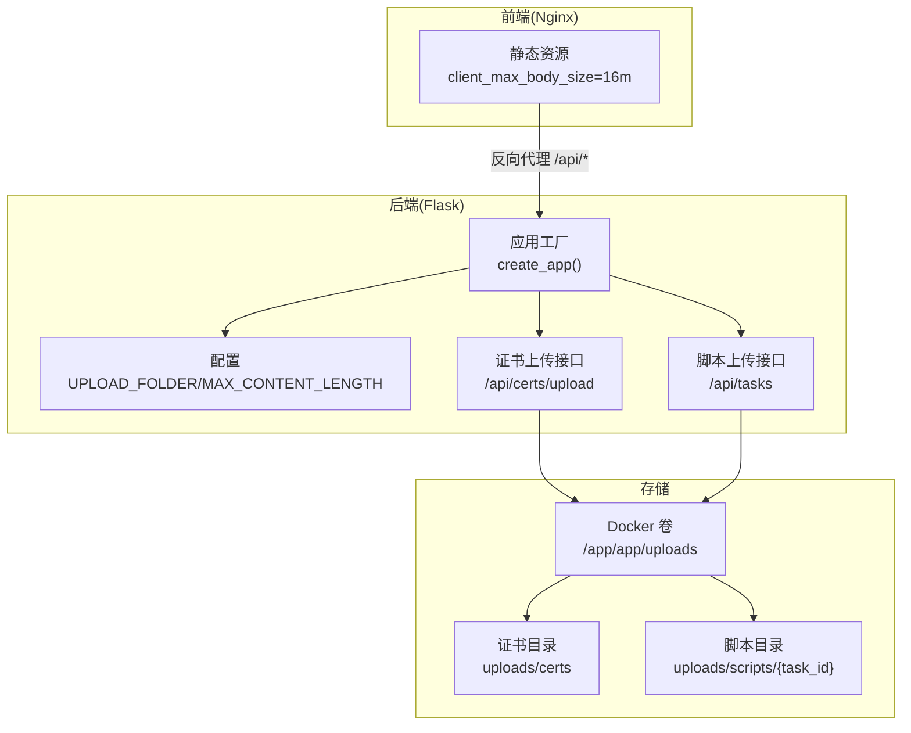
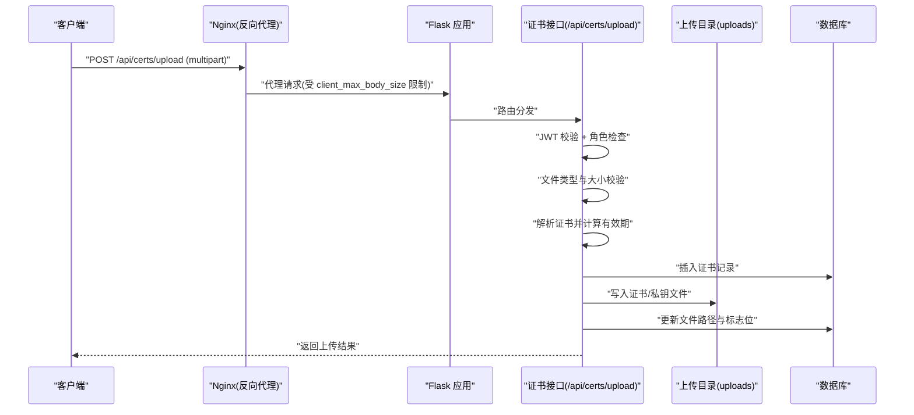
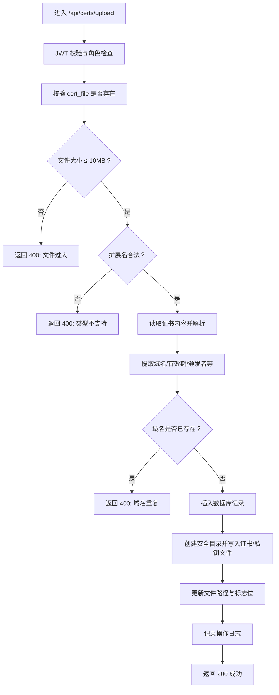
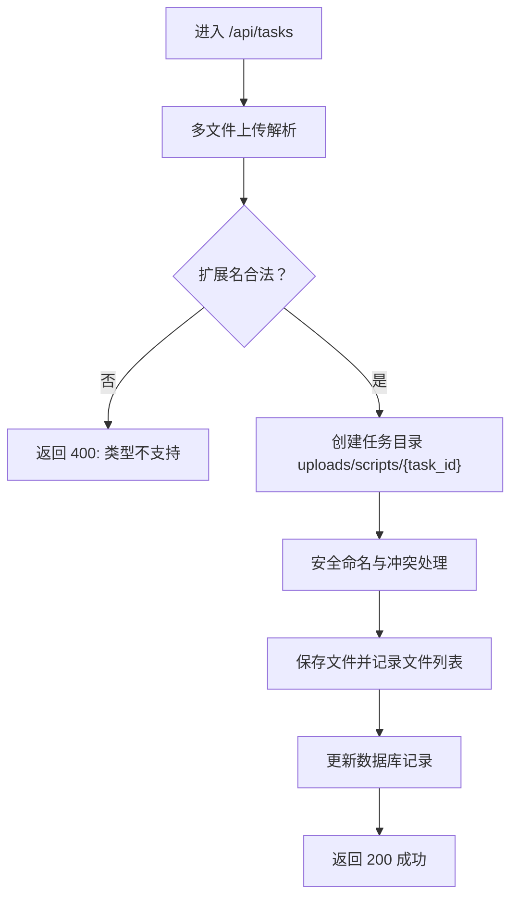
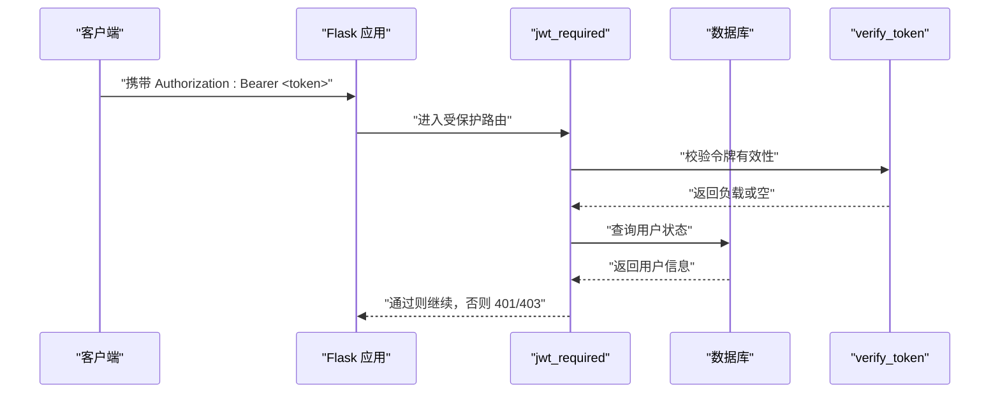
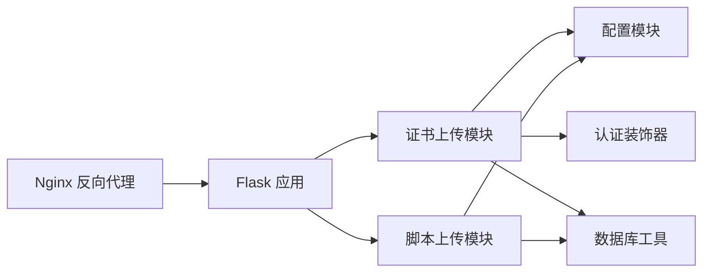

# 文件上传处理

<cite>
**本文引用的文件**
- [backend/app/config.py](file://backend/app/config.py)
- [backend/app/__init__.py](file://backend/app/__init__.py)
- [backend/app/api/certs.py](file://backend/app/api/certs.py)
- [backend/app/api/tasks.py](file://backend/app/api/tasks.py)
- [backend/app/utils/decorators.py](file://backend/app/utils/decorators.py)
- [backend/app/utils/auth.py](file://backend/app/utils/auth.py)
- [backend/app/utils/db.py](file://backend/app/utils/db.py)
- [backend/app/utils/scheduler.py](file://backend/app/utils/scheduler.py)
- [backend/docker-compose.yml](file://backend/docker-compose.yml)
- [nginx.conf](file://nginx.conf)
</cite>

## 目录
1. [简介](#简介)
2. [项目结构](#项目结构)
3. [核心组件](#核心组件)
4. [架构总览](#架构总览)
5. [详细组件分析](#详细组件分析)
6. [依赖分析](#依赖分析)
7. [性能考虑](#性能考虑)
8. [故障排除指南](#故障排除指南)
9. [结论](#结论)
10. [附录](#附录)

## 简介
本文件围绕 OPS 项目的“文件上传处理”能力，系统性梳理上传流程、安全检查、访问控制、存储策略与性能优化。重点覆盖以下方面：
- 文件接收与临时存储：基于 Flask 的请求体大小限制、multipart/form-data 解析、临时文件落盘。
- 安全检查：文件类型验证、大小限制、路径规范化防目录穿越、权限控制（JWT + 角色）。
- 存储策略：统一上传目录、按业务域分层（证书、脚本）、文件命名规则与目录结构。
- 访问控制：认证鉴权、操作日志、以及与反向代理层的协作（Nginx）。
- 性能优化：并发执行、线程池化、超时控制、数据库连接复用。
- 配置项与使用示例、常见问题排查。

## 项目结构
- 后端采用 Flask + Blueprint 组织 API，上传相关逻辑集中在证书与定时任务两个模块。
- 上传目录由配置统一管理，Nginx 作为反向代理，限制客户端上传体大小并转发至后端。
- Docker Compose 将后端挂载上传目录到持久卷，确保重启不丢失。

图表来源
- [backend/app/__init__.py:28-113](file://backend/app/__init__.py#L28-L113)
- [backend/app/config.py:26-27](file://backend/app/config.py#L26-L27)
- [backend/docker-compose.yml:60-61](file://backend/docker-compose.yml#L60-L61)

章节来源
- [backend/app/__init__.py:28-113](file://backend/app/__init__.py#L28-L113)
- [backend/app/config.py:26-27](file://backend/app/config.py#L26-L27)
- [backend/docker-compose.yml:60-61](file://backend/docker-compose.yml#L60-L61)

## 核心组件
- 配置中心：集中定义上传根目录、最大请求体大小、CORS、JWT 等。
- 证书上传模块：接收证书与可选私钥，解析证书元信息，入库并落盘。
- 脚本上传模块：支持多文件上传，按任务 ID 分目录存放，支持更新与删除。
- 权限与认证：JWT 校验 + 角色白名单，确保只有授权用户可上传。
- 存储与持久化：统一上传目录挂载到 Docker 卷，避免容器重启丢失。
- 反向代理：Nginx 限制客户端上传大小并转发请求，同时提供静态资源缓存。

章节来源
- [backend/app/config.py:10-58](file://backend/app/config.py#L10-L58)
- [backend/app/api/certs.py:323-465](file://backend/app/api/certs.py#L323-L465)
- [backend/app/api/tasks.py:79-94](file://backend/app/api/tasks.py#L79-L94)
- [backend/app/utils/decorators.py:26-163](file://backend/app/utils/decorators.py#L26-L163)
- [nginx.conf:14](file://nginx.conf#L14)

## 架构总览
下图展示一次“证书上传”的端到端流程：前端经 Nginx 限制大小后转发到后端，后端进行认证与业务校验，随后解析证书、入库并落盘到统一上传目录。

图表来源
- [backend/app/api/certs.py:323-465](file://backend/app/api/certs.py#L323-L465)
- [backend/app/utils/decorators.py:26-163](file://backend/app/utils/decorators.py#L26-L163)
- [nginx.conf:14](file://nginx.conf#L14)

## 详细组件分析

### 证书上传处理（/api/certs/upload）
- 请求与参数
  - 方法：POST
  - 内容类型：multipart/form-data
  - 字段：cert_file（必填，.pem/.crt/.cer）、key_file（可选，.key）、品牌/费用/备注/项目 ID 等表单字段
- 安全与校验
  - 大小限制：证书与私钥均不超过 10MB
  - 类型限制：证书仅允许 .pem/.crt/.cer；私钥仅允许 .key
  - 证书内容解析：从 PEM 中提取域名、颁发者、有效期等元信息
  - 唯一性约束：域名唯一，重复则拒绝
- 存储策略
  - 目录：CERT_FILES_DIR（基于 UPLOAD_FOLDER 下的 certs 子目录）
  - 路径规范化：使用绝对路径 + 基准目录前缀校验，防止路径穿越
  - 文件命名：以“安全域名前缀”命名，证书与私钥分别保存
  - 入库：记录文件路径、状态、剩余天数等
- 访问控制
  - 需要 JWT 令牌与指定角色（管理员/操作员）
  - 成功后记录操作日志
- 错误处理
  - 任一步骤失败回滚数据库并返回错误码

图表来源
- [backend/app/api/certs.py:323-465](file://backend/app/api/certs.py#L323-L465)
- [backend/app/api/certs.py:133-151](file://backend/app/api/certs.py#L133-L151)

章节来源
- [backend/app/api/certs.py:323-465](file://backend/app/api/certs.py#L323-L465)
- [backend/app/api/certs.py:133-151](file://backend/app/api/certs.py#L133-L151)
- [backend/app/utils/decorators.py:26-163](file://backend/app/utils/decorators.py#L26-L163)

### 脚本上传处理（/api/tasks）
- 目标与范围
  - 支持多文件上传，按任务 ID 分目录（uploads/scripts/{task_id}）
  - 支持创建、更新（增删文件）、删除任务及目录
- 安全与校验
  - 文件类型：.py 与 .sh
  - 文件名安全：使用安全算法规范化，避免危险字符
  - 冲突处理：同名文件自动追加序号
- 存储策略
  - 上传目录：UPLOAD_FOLDER 下的 scripts 子目录
  - 任务目录：按 task_id 创建子目录，便于隔离与清理
- 并发与执行
  - 上传完成后可选择立即执行或交由调度器按 Cron 执行
  - 执行过程使用线程池与超时控制，避免阻塞

图表来源
- [backend/app/api/tasks.py:144-254](file://backend/app/api/tasks.py#L144-L254)
- [backend/app/api/tasks.py:79-94](file://backend/app/api/tasks.py#L79-L94)

章节来源
- [backend/app/api/tasks.py:79-94](file://backend/app/api/tasks.py#L79-L94)
- [backend/app/api/tasks.py:144-254](file://backend/app/api/tasks.py#L144-L254)

### 认证与权限控制
- JWT 令牌签发与校验：包含用户标识、角色、签发/过期时间
- 装饰器链：jwt_required（校验令牌、用户状态、密码变更后失效）+ role_required（角色白名单）
- 与数据库交互：通过上下文获取连接，避免重复创建

图表来源
- [backend/app/utils/decorators.py:26-163](file://backend/app/utils/decorators.py#L26-L163)
- [backend/app/utils/auth.py:9-45](file://backend/app/utils/auth.py#L9-L45)
- [backend/app/utils/db.py:43-79](file://backend/app/utils/db.py#L43-L79)

章节来源
- [backend/app/utils/decorators.py:26-163](file://backend/app/utils/decorators.py#L26-L163)
- [backend/app/utils/auth.py:9-45](file://backend/app/utils/auth.py#L9-L45)
- [backend/app/utils/db.py:43-79](file://backend/app/utils/db.py#L43-L79)

### 存储策略与路径管理
- 上传根目录：由配置项决定（默认位于应用目录下的 uploads）
- 证书存储：CERT_FILES_DIR（uploads/certs），按证书 ID 创建子目录，文件名安全化
- 脚本存储：UPLOAD_FOLDER/scripts/{task_id}，按任务隔离
- 目录结构设计：层级清晰、易于清理与审计
- 磁盘空间管理：建议结合系统层面的磁盘配额与定期清理策略（例如按时间或大小阈值清理）

章节来源
- [backend/app/config.py:26-50](file://backend/app/config.py#L26-L50)
- [backend/app/api/certs.py:133-151](file://backend/app/api/certs.py#L133-L151)
- [backend/app/api/tasks.py:79-94](file://backend/app/api/tasks.py#L79-L94)

### 访问控制与安全检查
- 文件类型验证：明确白名单扩展名，拒绝未知类型
- 大小限制：服务端与反向代理双层限制（Nginx client_max_body_size 与 Flask MAX_CONTENT_LENGTH）
- 路径规范化：绝对路径 + 基准目录前缀校验，防止路径穿越
- 权限控制：JWT + 角色白名单，避免未授权上传
- 操作日志：上传成功后记录操作日志，便于审计与追踪

章节来源
- [backend/app/api/certs.py:350-370](file://backend/app/api/certs.py#L350-L370)
- [backend/app/api/certs.py:133-151](file://backend/app/api/certs.py#L133-L151)
- [backend/app/utils/decorators.py:26-163](file://backend/app/utils/decorators.py#L26-L163)
- [nginx.conf:14](file://nginx.conf#L14)

## 依赖分析
- 组件耦合
  - 证书上传模块依赖配置（上传目录、证书目录）、认证装饰器、数据库工具
  - 脚本上传模块依赖配置（上传目录）、安全文件名工具、数据库工具
  - 反向代理 Nginx 与后端 Flask 通过 /api/* 路由协作
- 外部依赖
  - Flask、PyMySQL、APScheduler（定时任务）
  - Docker Compose 挂载上传目录到持久卷

图表来源
- [backend/app/api/certs.py:323-465](file://backend/app/api/certs.py#L323-L465)
- [backend/app/api/tasks.py:79-94](file://backend/app/api/tasks.py#L79-L94)
- [backend/app/utils/decorators.py:26-163](file://backend/app/utils/decorators.py#L26-L163)
- [backend/app/utils/db.py:43-79](file://backend/app/utils/db.py#L43-L79)
- [nginx.conf:32-47](file://nginx.conf#L32-L47)

章节来源
- [backend/app/api/certs.py:323-465](file://backend/app/api/certs.py#L323-L465)
- [backend/app/api/tasks.py:79-94](file://backend/app/api/tasks.py#L79-L94)
- [backend/app/utils/decorators.py:26-163](file://backend/app/utils/decorators.py#L26-L163)
- [backend/app/utils/db.py:43-79](file://backend/app/utils/db.py#L43-L79)
- [nginx.conf:32-47](file://nginx.conf#L32-L47)

## 性能考虑
- 并发处理
  - Flask 默认线程模型，上传接口为 I/O 密集，适合线程并发
  - 定时任务执行使用线程池，避免阻塞主事件循环
- 超时与稳定性
  - 上传接口设置合理超时，避免长时间占用连接
  - 调度器执行脚本设置超时（如 300 秒），失败快速返回
- 缓存与静态资源
  - Nginx 对静态资源设置长缓存，减少后端压力
- 数据库连接
  - 使用 Flask 上下文缓存连接，降低连接开销

章节来源
- [backend/app/utils/scheduler.py:39-178](file://backend/app/utils/scheduler.py#L39-L178)
- [nginx.conf:26-30](file://nginx.conf#L26-L30)

## 故障排除指南
- 上传失败（400）
  - 检查文件类型是否在允许范围内
  - 检查文件大小是否超过 10MB（证书/私钥）
  - 确认表单字段与文件域名称正确
- 上传失败（401/403）
  - 确认 Authorization 头格式为 Bearer Token
  - 确认令牌未过期且用户处于启用状态
  - 确认用户角色在允许范围内
- 上传成功但找不到文件
  - 检查 Docker 卷挂载是否正确（/app/app/uploads）
  - 检查 CERT_FILES_DIR 或 uploads/scripts/{task_id} 目录权限
- 上传体过大被拒绝
  - 检查 Nginx client_max_body_size 与 Flask MAX_CONTENT_LENGTH
- 证书解析失败
  - 确认证书为 PEM 格式，且包含有效主体与有效期信息
- 定时任务无法执行
  - 检查调度器初始化日志与数据库连接配置
  - 确认任务目录存在且可写

章节来源
- [backend/app/api/certs.py:350-370](file://backend/app/api/certs.py#L350-L370)
- [backend/app/utils/decorators.py:26-163](file://backend/app/utils/decorators.py#L26-L163)
- [backend/docker-compose.yml:60-61](file://backend/docker-compose.yml#L60-L61)
- [nginx.conf:14](file://nginx.conf#L14)
- [backend/app/utils/scheduler.py:244-384](file://backend/app/utils/scheduler.py#L244-L384)

## 结论
OPS 的文件上传体系以“安全优先、结构清晰、可运维性强”为目标：通过严格的类型与大小校验、路径规范化与 JWT 权限控制，结合统一的上传目录与任务隔离，实现了稳定可靠的上传能力。配合 Nginx 的反向代理与静态资源缓存，整体具备良好的性能与可维护性。建议在生产环境中进一步完善磁盘清理策略与访问审计，持续提升安全性与可观测性。

## 附录

### 配置选项清单
- 通用
  - SECRET_KEY/JWT_SECRET_KEY：密钥，生产环境必须设置
  - JWT_EXPIRATION_HOURS：JWT 过期小时数
  - DEBUG/HOST/PORT：调试与监听
  - MAX_CONTENT_LENGTH：请求体大小限制（16MB）
  - CORS_ORIGINS/CORS_ALLOW_ALL：跨域配置
- 存储
  - UPLOAD_FOLDER：上传根目录（默认应用目录下 uploads）
  - CERT_FILES_DIR：证书文件目录（UPLOAD_FOLDER/certs）
- 数据库
  - DB_HOST/DB_PORT/DB_USER/DB_PASSWORD/DB_NAME：数据库连接参数
- 定时任务与通知
  - WECHAT_WEBHOOK_URL：企业微信通知地址
  - SSL_CHECK_TIMEOUT/SSL_WARNING_DAYS/DOMAIN_WARNING_DAYS：SSL 检测与预警参数
  - CERT_AUTO_CHECK_CRON/DOMAIN_AUTO_NOTIFY_CRON：内置任务计划

章节来源
- [backend/app/config.py:10-58](file://backend/app/config.py#L10-L58)
- [backend/app/__init__.py:47-80](file://backend/app/__init__.py#L47-L80)
- [backend/docker-compose.yml:36-59](file://backend/docker-compose.yml#L36-L59)

### 使用示例（路径指引）
- 证书上传
  - 接口：POST /api/certs/upload
  - 参数：multipart/form-data，字段包括 cert_file、key_file（可选）、品牌/费用/备注/项目 ID
  - 安全：仅允许 .pem/.crt/.cer/.key，大小不超过 10MB
  - 结果：返回证书元信息与上传状态
- 脚本上传
  - 接口：POST /api/tasks（支持多文件）
  - 参数：name/description/cron_expression/execute_command/script_files（多文件）
  - 安全：仅允许 .py/.sh，文件名安全化，冲突自动编号
  - 结果：返回任务 ID 与保存的文件列表

章节来源
- [backend/app/api/certs.py:323-465](file://backend/app/api/certs.py#L323-L465)
- [backend/app/api/tasks.py:144-254](file://backend/app/api/tasks.py#L144-L254)