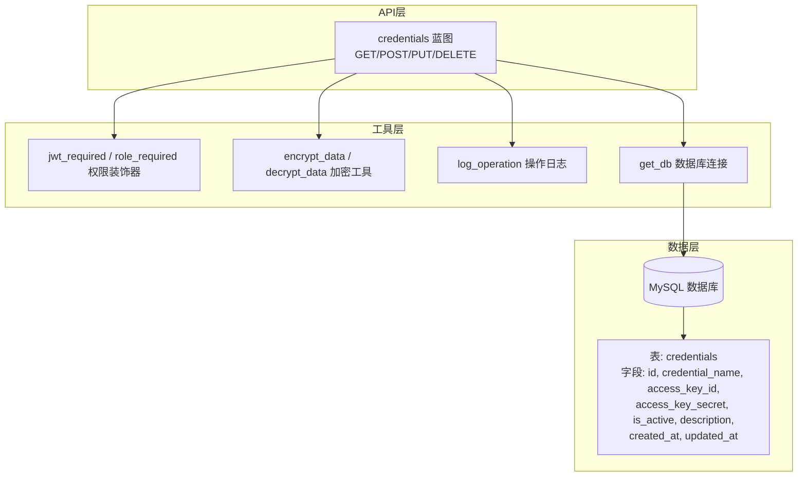
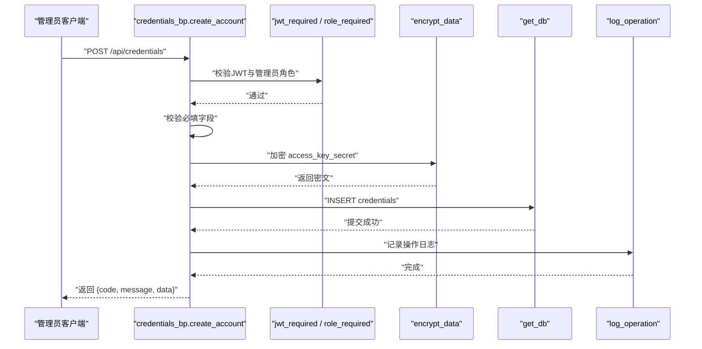
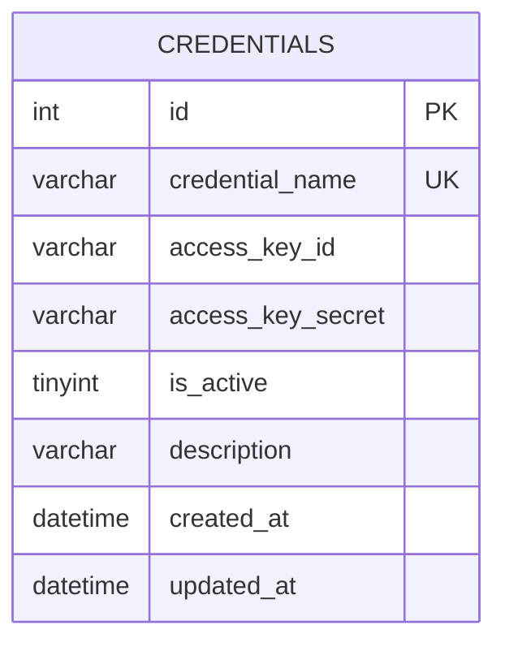
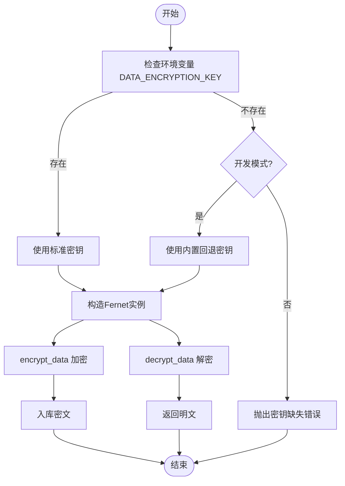
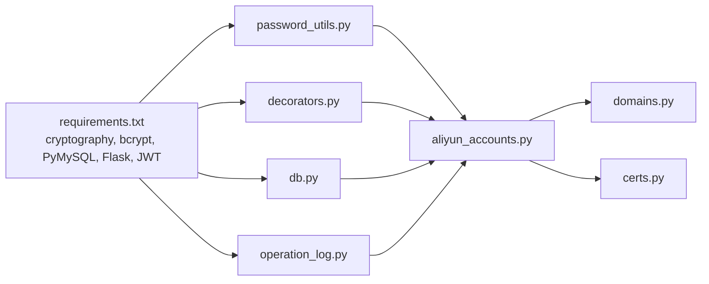

# 阿里云API集成

<cite>
**本文引用的文件**
- [aliyun_accounts.py](file://backend/app/api/aliyun_accounts.py)
- [password_utils.py](file://backend/app/utils/password_utils.py)
- [decorators.py](file://backend/app/utils/decorators.py)
- [db.py](file://backend/app/utils/db.py)
- [operation_log.py](file://backend/app/utils/operation_log.py)
- [config.py](file://backend/app/config.py)
- [requirements.txt](file://backend/requirements.txt)
- [init_db.py](file://backend/init_db.py)
- [domains.py](file://backend/app/api/domains.py)
- [certs.py](file://backend/app/api/certs.py)
</cite>

## 目录
1. [简介](#简介)
2. [项目结构](#项目结构)
3. [核心组件](#核心组件)
4. [架构总览](#架构总览)
5. [详细组件分析](#详细组件分析)
6. [依赖分析](#依赖分析)
7. [性能考虑](#性能考虑)
8. [故障排除指南](#故障排除指南)
9. [结论](#结论)
10. [附录](#附录)

## 简介
本文件面向OPS项目的阿里云API集成功能，聚焦“阿里云账户管理API”的实现与使用。内容涵盖：
- 账户凭证的CRUD能力与权限控制
- AccessKey ID与AccessKey Secret的安全存储与加密机制
- 账户状态管理与脱敏显示策略
- 数据模型设计与字段约束
- 完整的API接口文档与调用示例
- 最佳实践与故障排除建议

## 项目结构
阿里云账户管理API位于后端Flask应用的API层，围绕凭证表(credentials)进行增删改查，并通过统一的鉴权与日志工具完成安全与审计。

图表来源
- [aliyun_accounts.py:19-275](file://backend/app/api/aliyun_accounts.py#L19-L275)
- [decorators.py:26-163](file://backend/app/utils/decorators.py#L26-L163)
- [password_utils.py:93-130](file://backend/app/utils/password_utils.py#L93-L130)
- [operation_log.py:49-119](file://backend/app/utils/operation_log.py#L49-L119)
- [db.py:43-80](file://backend/app/utils/db.py#L43-L80)
- [init_db.py:290-303](file://backend/init_db.py#L290-L303)

章节来源
- [aliyun_accounts.py:1-275](file://backend/app/api/aliyun_accounts.py#L1-L275)
- [init_db.py:290-303](file://backend/init_db.py#L290-L303)

## 核心组件
- 凭证管理蓝图(credentials_bp)：提供凭证的查询、创建、更新、删除接口，均需管理员权限。
- 权限装饰器：JWT认证与角色校验，确保只有管理员可操作凭证。
- 加密工具：基于Fernet的对称加密，用于存储AccessKey Secret；支持从环境变量加载密钥或开发回退密钥。
- 数据库工具：统一的数据库连接获取与关闭，避免重复连接。
- 操作日志：记录凭证的新增、更新、删除操作，便于审计追踪。

章节来源
- [aliyun_accounts.py:5-11](file://backend/app/api/aliyun_accounts.py#L5-L11)
- [decorators.py:26-163](file://backend/app/utils/decorators.py#L26-L163)
- [password_utils.py:18-49](file://backend/app/utils/password_utils.py#L18-L49)
- [db.py:43-80](file://backend/app/utils/db.py#L43-L80)
- [operation_log.py:49-119](file://backend/app/utils/operation_log.py#L49-L119)

## 架构总览
以下序列图展示管理员通过凭证API创建新凭证的完整流程，包括鉴权、参数校验、加密存储、数据库写入与操作日志记录。

图表来源
- [aliyun_accounts.py:55-129](file://backend/app/api/aliyun_accounts.py#L55-L129)
- [decorators.py:26-163](file://backend/app/utils/decorators.py#L26-L163)
- [password_utils.py:93-111](file://backend/app/utils/password_utils.py#L93-L111)
- [operation_log.py:49-119](file://backend/app/utils/operation_log.py#L49-L119)
- [db.py:43-80](file://backend/app/utils/db.py#L43-L80)

## 详细组件分析

### 数据模型与字段设计
- 表名：credentials
- 关键字段及约束：
  - id：自增主键
  - credential_name：唯一索引，凭证名称
  - access_key_id：阿里云AccessKey ID
  - access_key_secret：阿里云AccessKey Secret（加密存储）
  - is_active：启用状态（0禁用/1启用）
  - description：描述
  - created_at/updated_at：自动时间戳

图表来源
- [init_db.py:292-302](file://backend/init_db.py#L292-L302)

章节来源
- [init_db.py:290-303](file://backend/init_db.py#L290-L303)

### 加密与解密机制
- 加密算法：Fernet（对称加密），基于cryptography库实现。
- 密钥来源：
  - 生产环境：必须通过环境变量DATA_ENCRYPTION_KEY提供标准URL安全Base64 32字节密钥。
  - 开发环境：当FLASK_DEBUG或OPS_DEV_ENCRYPTION_FALLBACK为真时，可使用内置回退密钥（不安全）。
- 加密流程：
  - 写入：创建/更新时对access_key_secret进行加密后入库。
  - 读取：查询时对access_key_secret进行解密返回。
- 安全策略：
  - 仅在必要时解密（如查询列表或业务调用前），其余场景均以密文存储。
  - 脱敏策略：在部分接口返回中对敏感字段进行脱敏显示（例如仅显示部分字符）。

图表来源
- [password_utils.py:18-49](file://backend/app/utils/password_utils.py#L18-L49)
- [password_utils.py:93-130](file://backend/app/utils/password_utils.py#L93-L130)

章节来源
- [password_utils.py:13-29](file://backend/app/utils/password_utils.py#L13-L29)
- [password_utils.py:93-130](file://backend/app/utils/password_utils.py#L93-L130)

### 权限与安全控制
- 鉴权：所有凭证接口均需携带Bearer Token，由jwt_required装饰器校验。
- 授权：role_required限制为admin角色。
- 用户状态：JWT中签发时间与用户最近密码变更时间对比，防止令牌在密码变更后仍有效。

章节来源
- [aliyun_accounts.py:19-275](file://backend/app/api/aliyun_accounts.py#L19-L275)
- [decorators.py:26-163](file://backend/app/utils/decorators.py#L26-L163)

### 操作日志与审计
- 记录模块：凭证管理（aliyun_accounts）
- 记录动作：新增(create)、更新(update)、删除(delete)
- 日志字段：操作人、模块、动作、目标、详情、IP、UA、时间等

章节来源
- [operation_log.py:49-119](file://backend/app/utils/operation_log.py#L49-L119)
- [operation_log.py:146-155](file://backend/app/utils/operation_log.py#L146-L155)

### API接口定义与行为

- GET /api/credentials
  - 功能：获取凭证列表
  - 权限：管理员
  - 行为：查询credentials表，解密access_key_secret后返回
  - 响应：code=200，data=[凭证数组]
  - 异常：数据库错误返回500

- POST /api/credentials
  - 功能：创建新凭证
  - 权限：管理员
  - 请求体：credential_name, access_key_id, access_key_secret, description(可选)
  - 行为：校验必填字段，检查凭证名称唯一性，加密secret后入库，记录操作日志
  - 响应：code=200，message=成功，data={id}
  - 异常：400(参数缺失/无更新字段)，409(名称冲突)，500(加密失败/数据库异常)

- PUT /api/credentials/<id>
  - 功能：更新指定凭证
  - 权限：管理员
  - 请求体：credential_name, access_key_id, access_key_secret(可传入脱敏值*不更新), is_active, description
  - 行为：校验账户存在与名称唯一性，构建动态SQL更新字段，若提供非脱敏secret则加密更新，记录操作日志
  - 响应：code=200，message=成功
  - 异常：400(无更新字段)，404(账户不存在)，409(名称冲突)，500(加密失败/数据库异常)

- DELETE /api/credentials/<id>
  - 功能：删除指定凭证
  - 权限：管理员
  - 行为：获取账户名称，删除记录，记录操作日志
  - 响应：code=200，message=成功
  - 异常：404(账户不存在)，500(数据库异常)

章节来源
- [aliyun_accounts.py:19-275](file://backend/app/api/aliyun_accounts.py#L19-L275)

### 脱敏与安全显示
- 脱敏判断：is_masked_value用于识别传入的脱敏值（包含*号），在更新时避免覆盖已有密文。
- 查询返回：对access_key_secret进行解密后返回，前端展示时应遵循最小暴露原则，仅在必要时显示完整密文。

章节来源
- [aliyun_accounts.py:14-16](file://backend/app/api/aliyun_accounts.py#L14-L16)
- [aliyun_accounts.py:185-195](file://backend/app/api/aliyun_accounts.py#L185-L195)

### 业务调用中的凭证使用
- 在域名与证书管理等业务中，会按is_active=1筛选启用的凭证，解密后用于调用阿里云SDK。
- 若解密失败或凭证不存在，接口返回相应错误码与提示。

章节来源
- [domains.py:364-397](file://backend/app/api/domains.py#L364-L397)
- [certs.py:816-848](file://backend/app/api/certs.py#L816-L848)

## 依赖分析
- 外部依赖：cryptography用于Fernet加密，bcrypt用于密码哈希（与凭证无关但同属安全工具），PyMySQL用于数据库访问，Flask与JWT用于Web框架与鉴权。
- 内部依赖：API层依赖工具层的加密、鉴权、日志与数据库工具；业务层（如域名、证书）依赖凭证查询与解密。

图表来源
- [requirements.txt:1-17](file://backend/requirements.txt#L1-L17)
- [password_utils.py:1-130](file://backend/app/utils/password_utils.py#L1-L130)
- [decorators.py:1-163](file://backend/app/utils/decorators.py#L1-L163)
- [db.py:1-80](file://backend/app/utils/db.py#L1-L80)
- [operation_log.py:1-172](file://backend/app/utils/operation_log.py#L1-L172)
- [aliyun_accounts.py:1-275](file://backend/app/api/aliyun_accounts.py#L1-L275)
- [domains.py:360-401](file://backend/app/api/domains.py#L360-L401)
- [certs.py:815-851](file://backend/app/api/certs.py#L815-L851)

章节来源
- [requirements.txt:1-17](file://backend/requirements.txt#L1-L17)

## 性能考虑
- 数据库连接：通过Flask g上下文缓存连接，减少重复建立连接的开销。
- 查询优化：credentials表对credential_name建立索引，有利于名称唯一性检查与查询。
- 加密成本：加密/解密为CPU密集型操作，建议批量处理与合理缓存；仅在必要时解密。
- 并发控制：数据库事务保证创建/更新的原子性，异常时回滚，避免脏数据。

章节来源
- [db.py:43-80](file://backend/app/utils/db.py#L43-L80)
- [init_db.py:299-302](file://backend/init_db.py#L299-L302)
- [aliyun_accounts.py:85-129](file://backend/app/api/aliyun_accounts.py#L85-L129)

## 故障排除指南
- 401 未认证/权限不足
  - 检查请求头Authorization是否为Bearer Token，确认JWT有效且未过期。
  - 确认用户角色为admin。
  - 参考：[decorators.py:26-163](file://backend/app/utils/decorators.py#L26-L163)

- 403 权限不足
  - 当前用户不具备admin角色。
  - 参考：[decorators.py:126-163](file://backend/app/utils/decorators.py#L126-L163)

- 400 参数错误
  - 创建/更新时缺少必填字段或无有效更新字段。
  - 参考：[aliyun_accounts.py:67-83](file://backend/app/api/aliyun_accounts.py#L67-L83)，[aliyun_accounts.py:205-209](file://backend/app/api/aliyun_accounts.py#L205-L209)

- 404 资源不存在
  - 更新/删除的目标凭证不存在。
  - 参考：[aliyun_accounts.py:153-159](file://backend/app/api/aliyun_accounts.py#L153-L159)，[aliyun_accounts.py:246-252](file://backend/app/api/aliyun_accounts.py#L246-L252)

- 409 冲突
  - 凭证名称已存在。
  - 参考：[aliyun_accounts.py:89-94](file://backend/app/api/aliyun_accounts.py#L89-L94)，[aliyun_accounts.py:162-171](file://backend/app/api/aliyun_accounts.py#L162-L171)

- 500 加密失败/数据库异常
  - DATA_ENCRYPTION_KEY未正确配置或格式不合法；数据库连接失败或事务回滚。
  - 参考：[password_utils.py:18-29](file://backend/app/utils/password_utils.py#L18-L29)，[aliyun_accounts.py:96-103](file://backend/app/api/aliyun_accounts.py#L96-L103)，[aliyun_accounts.py:122-129](file://backend/app/api/aliyun_accounts.py#L122-L129)

- 解密失败
  - access_key_secret可能被篡改或密钥变更导致无法解密。
  - 参考：[aliyun_accounts.py:42-46](file://backend/app/api/aliyun_accounts.py#L42-L46)，[password_utils.py:113-129](file://backend/app/utils/password_utils.py#L113-L129)

- 开发环境密钥问题
  - 开启开发回退密钥需明确风险，生产环境务必配置DATA_ENCRYPTION_KEY。
  - 参考：[password_utils.py:13-29](file://backend/app/utils/password_utils.py#L13-L29)

## 结论
OPS项目的阿里云API集成功能通过严格的权限控制、对称加密存储与完善的审计日志，实现了凭证的安全管理。数据模型清晰、接口职责明确，结合业务层的按需解密使用，既满足功能需求又兼顾安全性与可维护性。

## 附录

### API调用示例（路径与要点）
- 获取凭证列表
  - 方法：GET
  - 路径：/api/credentials
  - 认证：Bearer Token，admin角色
  - 响应：code=200，data为凭证数组（包含解密后的access_key_secret）

- 创建凭证
  - 方法：POST
  - 路径：/api/credentials
  - 请求体：credential_name, access_key_id, access_key_secret, description(可选)
  - 响应：code=200，data={id}

- 更新凭证
  - 方法：PUT
  - 路径：/api/credentials/{id}
  - 请求体：credential_name, access_key_id, access_key_secret(可传入脱敏值*不更新), is_active, description
  - 响应：code=200

- 删除凭证
  - 方法：DELETE
  - 路径：/api/credentials/{id}
  - 响应：code=200

章节来源
- [aliyun_accounts.py:19-275](file://backend/app/api/aliyun_accounts.py#L19-L275)

### 最佳实践建议
- 密钥管理
  - 生产环境必须设置DATA_ENCRYPTION_KEY，长度为32字节的标准URL安全Base64编码。
  - 不要在配置文件或代码中硬编码密钥。
- 权限与最小暴露
  - 仅授予admin角色访问凭证API；前端展示时避免一次性显示完整密文。
- 审计与监控
  - 操作日志记录所有凭证变更，定期审计；结合告警策略监控异常操作。
- 连接与事务
  - 使用统一数据库连接工具；对关键写操作使用事务，异常时回滚。
- 开发与测试
  - 开发环境可使用回退密钥，但仅限测试用途；生产环境严禁使用。

章节来源
- [password_utils.py:13-29](file://backend/app/utils/password_utils.py#L13-L29)
- [operation_log.py:49-119](file://backend/app/utils/operation_log.py#L49-L119)
- [db.py:43-80](file://backend/app/utils/db.py#L43-L80)