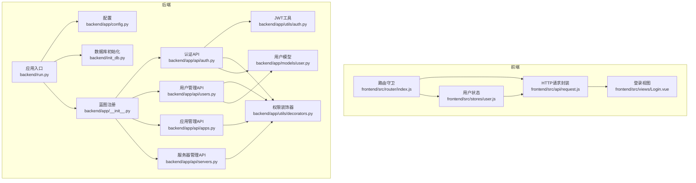
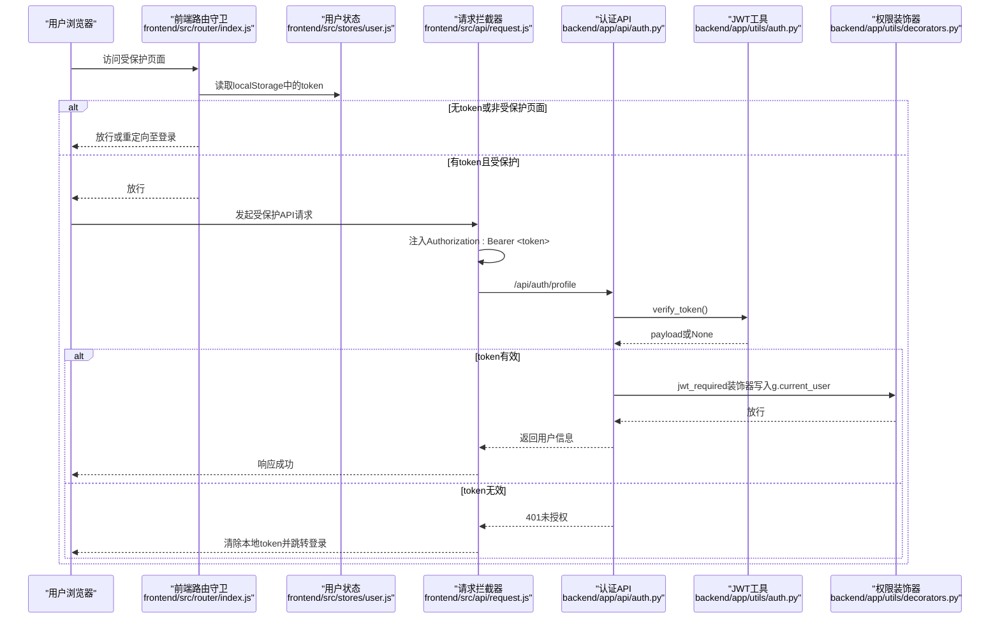
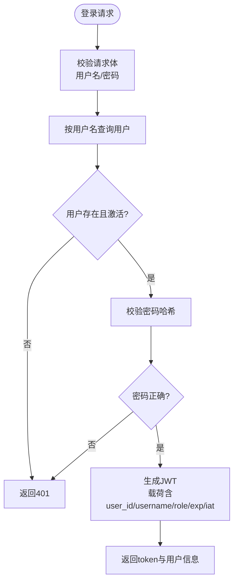
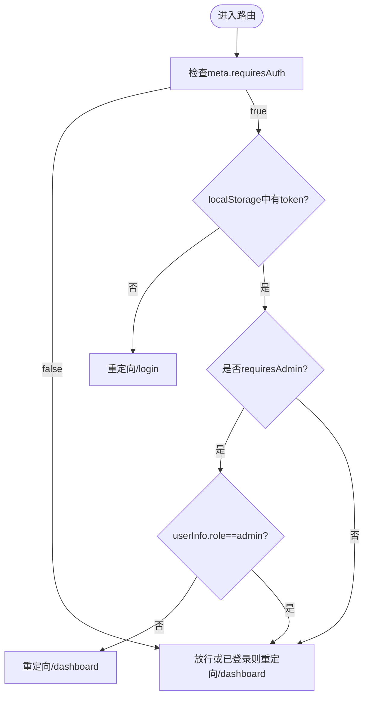
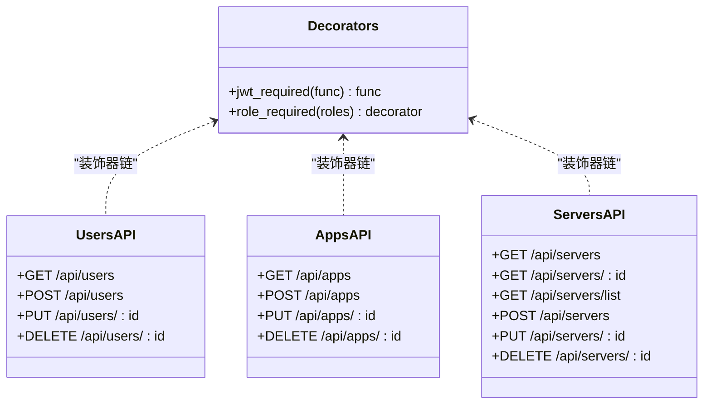
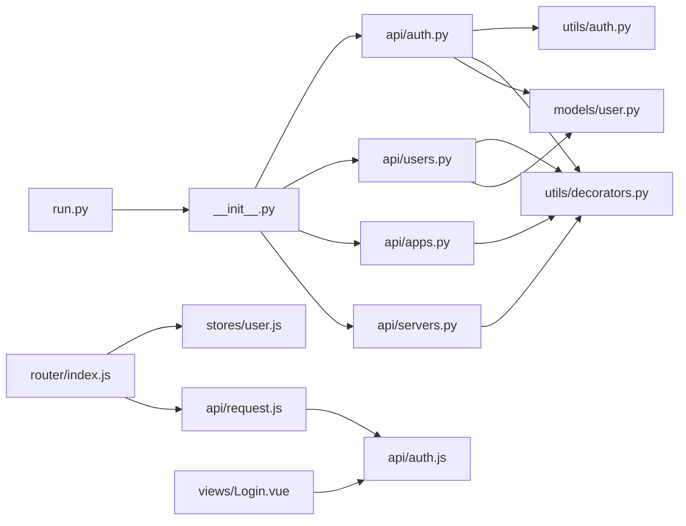

# 安全与权限控制

<cite>
**本文引用的文件**
- [backend/app/api/auth.py](file://backend/app/api/auth.py)
- [backend/app/utils/auth.py](file://backend/app/utils/auth.py)
- [backend/app/utils/decorators.py](file://backend/app/utils/decorators.py)
- [backend/app/models/user.py](file://backend/app/models/user.py)
- [backend/app/config.py](file://backend/app/config.py)
- [backend/init_db.py](file://backend/init_db.py)
- [backend/run.py](file://backend/run.py)
- [backend/app/__init__.py](file://backend/app/__init__.py)
- [frontend/src/router/index.js](file://frontend/src/router/index.js)
- [frontend/src/stores/user.js](file://frontend/src/stores/user.js)
- [frontend/src/api/request.js](file://frontend/src/api/request.js)
- [frontend/src/api/auth.js](file://frontend/src/api/auth.js)
- [frontend/src/views/Login.vue](file://frontend/src/views/Login.vue)
- [backend/app/api/users.py](file://backend/app/api/users.py)
- [backend/app/api/apps.py](file://backend/app/api/apps.py)
- [backend/app/api/servers.py](file://backend/app/api/servers.py)
</cite>

## 目录
1. [引言](#引言)
2. [项目结构](#项目结构)
3. [核心组件](#核心组件)
4. [架构总览](#架构总览)
5. [详细组件分析](#详细组件分析)
6. [依赖分析](#依赖分析)
7. [性能考虑](#性能考虑)
8. [故障排查指南](#故障排查指南)
9. [结论](#结论)
10. [附录](#附录)

## 引言
本文件面向云运维平台的安全与权限控制体系，围绕以下主题展开：
- JWT Token认证机制：生成、验证、过期处理与安全性保障
- 基于角色的权限控制（RBAC）：角色定义、权限分配策略与资源访问控制
- 前端路由守卫与后端接口装饰器的协同验证
- 跨域与传输安全策略建议
- 密码加密存储、会话管理、安全审计与常见威胁防护
- 安全配置最佳实践与漏洞防护指南

## 项目结构
后端采用Flask蓝图组织API模块，前端使用Vue Router与Pinia状态管理，整体遵循前后端分离架构。安全相关的关键点包括：
- 后端：JWT工具、认证装饰器、用户模型、配置项、数据库初始化
- 前端：路由守卫、请求拦截器、用户状态存储、登录视图

图表来源
- [backend/run.py:1-8](file://backend/run.py#L1-L8)
- [backend/app/config.py:1-21](file://backend/app/config.py#L1-L21)
- [backend/init_db.py:1-263](file://backend/init_db.py#L1-L263)
- [backend/app/__init__.py:46-61](file://backend/app/__init__.py#L46-L61)
- [backend/app/api/auth.py:1-184](file://backend/app/api/auth.py#L1-L184)
- [backend/app/api/users.py:1-268](file://backend/app/api/users.py#L1-L268)
- [backend/app/api/apps.py:1-168](file://backend/app/api/apps.py#L1-L168)
- [backend/app/api/servers.py:1-232](file://backend/app/api/servers.py#L1-L232)
- [backend/app/utils/auth.py:1-83](file://backend/app/utils/auth.py#L1-L83)
- [backend/app/utils/decorators.py:1-95](file://backend/app/utils/decorators.py#L1-L95)
- [backend/app/models/user.py:1-183](file://backend/app/models/user.py#L1-L183)
- [frontend/src/router/index.js:1-61](file://frontend/src/router/index.js#L1-L61)
- [frontend/src/stores/user.js:1-41](file://frontend/src/stores/user.js#L1-L41)
- [frontend/src/api/request.js:1-54](file://frontend/src/api/request.js#L1-L54)
- [frontend/src/views/Login.vue:1-114](file://frontend/src/views/Login.vue#L1-L114)

章节来源
- [backend/run.py:1-8](file://backend/run.py#L1-L8)
- [backend/app/__init__.py:46-61](file://backend/app/__init__.py#L46-L61)

## 核心组件
- JWT工具与认证：负责Token生成、验证与密码哈希
- 权限装饰器：统一的JWT认证与角色校验
- 用户模型：用户查询、创建、更新、删除与密码更新
- 前端路由守卫与请求拦截器：Token注入、未授权跳转、错误处理
- RBAC策略：admin/operator/viewer三类角色，不同API对角色有明确要求

章节来源
- [backend/app/utils/auth.py:11-83](file://backend/app/utils/auth.py#L11-L83)
- [backend/app/utils/decorators.py:9-95](file://backend/app/utils/decorators.py#L9-L95)
- [backend/app/models/user.py:8-183](file://backend/app/models/user.py#L8-L183)
- [frontend/src/router/index.js:35-58](file://frontend/src/router/index.js#L35-L58)
- [frontend/src/api/request.js:13-51](file://frontend/src/api/request.js#L13-L51)

## 架构总览
下图展示登录到受保护API的端到端流程，涵盖前端路由守卫、请求拦截器、后端认证与权限装饰器。

图表来源
- [frontend/src/router/index.js:35-58](file://frontend/src/router/index.js#L35-L58)
- [frontend/src/stores/user.js:13-37](file://frontend/src/stores/user.js#L13-L37)
- [frontend/src/api/request.js:13-51](file://frontend/src/api/request.js#L13-L51)
- [backend/app/api/auth.py:85-115](file://backend/app/api/auth.py#L85-L115)
- [backend/app/utils/auth.py:38-56](file://backend/app/utils/auth.py#L38-L56)
- [backend/app/utils/decorators.py:9-56](file://backend/app/utils/decorators.py#L9-L56)

## 详细组件分析

### JWT认证机制与流程
- Token生成：包含用户ID、用户名、角色、签发时间与过期时间，使用对称算法签名
- Token验证：解码并校验签名，捕获过期与无效Token异常
- 过期策略：配置项控制过期小时数，默认24小时
- 密码存储：使用强哈希算法生成密码哈希，不保存明文

图表来源
- [backend/app/api/auth.py:14-82](file://backend/app/api/auth.py#L14-L82)
- [backend/app/utils/auth.py:11-35](file://backend/app/utils/auth.py#L11-L35)
- [backend/app/models/user.py:39-58](file://backend/app/models/user.py#L39-L58)

章节来源
- [backend/app/utils/auth.py:11-83](file://backend/app/utils/auth.py#L11-L83)
- [backend/app/config.py:4-7](file://backend/app/config.py#L4-L7)
- [backend/app/api/auth.py:14-82](file://backend/app/api/auth.py#L14-L82)
- [backend/app/models/user.py:8-36](file://backend/app/models/user.py#L8-L36)

### 前端路由守卫与会话管理
- 路由守卫：根据meta标记判断是否需要认证；对管理员专属页面进行角色校验；检测token并在过期时重定向登录
- 请求拦截器：自动在请求头注入Authorization: Bearer token；统一处理401并清理本地存储
- 用户状态：Pinia Store持久化token与用户信息，支持登出清理

图表来源
- [frontend/src/router/index.js:35-58](file://frontend/src/router/index.js#L35-L58)
- [frontend/src/stores/user.js:13-37](file://frontend/src/stores/user.js#L13-L37)
- [frontend/src/api/request.js:13-51](file://frontend/src/api/request.js#L13-L51)

章节来源
- [frontend/src/router/index.js:35-58](file://frontend/src/router/index.js#L35-L58)
- [frontend/src/stores/user.js:13-37](file://frontend/src/stores/user.js#L13-L37)
- [frontend/src/api/request.js:13-51](file://frontend/src/api/request.js#L13-L51)

### 基于角色的权限控制（RBAC）
- 角色定义：admin（管理员）、operator（操作员）、viewer（只读用户）
- 接口级角色约束：
  - 用户管理：仅admin可用
  - 应用系统：admin/operator可用
  - 服务器管理：admin/operator可用
- 装饰器链：先jwt_required，再role_required，确保顺序正确

图表来源
- [backend/app/utils/decorators.py:9-95](file://backend/app/utils/decorators.py#L9-L95)
- [backend/app/api/users.py:17-207](file://backend/app/api/users.py#L17-L207)
- [backend/app/api/apps.py:11-146](file://backend/app/api/apps.py#L11-L146)
- [backend/app/api/servers.py:11-210](file://backend/app/api/servers.py#L11-L210)

章节来源
- [backend/app/api/users.py:17-207](file://backend/app/api/users.py#L17-L207)
- [backend/app/api/apps.py:11-146](file://backend/app/api/apps.py#L11-L146)
- [backend/app/api/servers.py:11-210](file://backend/app/api/servers.py#L11-L210)
- [backend/app/utils/decorators.py:59-95](file://backend/app/utils/decorators.py#L59-L95)

### 密码加密存储与会话管理
- 密码加密：后端使用强哈希算法生成密码哈希并入库
- 会话管理：基于JWT无状态会话；前端localStorage存储token与用户信息；响应拦截器统一处理401并清空本地存储
- 登录流程：前端调用登录接口，接收token与用户信息，写入localStorage并跳转首页

章节来源
- [backend/app/models/user.py:8-36](file://backend/app/models/user.py#L8-L36)
- [backend/app/api/auth.py:118-184](file://backend/app/api/auth.py#L118-L184)
- [frontend/src/api/auth.js:1-14](file://frontend/src/api/auth.js#L1-L14)
- [frontend/src/views/Login.vue:50-66](file://frontend/src/views/Login.vue#L50-L66)
- [frontend/src/stores/user.js:13-37](file://frontend/src/stores/user.js#L13-L37)
- [frontend/src/api/request.js:35-51](file://frontend/src/api/request.js#L35-L51)

### 数据库与默认账户
- 初始化脚本创建用户表与默认字典数据，并插入默认管理员账户
- 用户表包含角色字段与激活状态，配合后端认证与权限控制

章节来源
- [backend/init_db.py:33-47](file://backend/init_db.py#L33-L47)
- [backend/init_db.py:228-233](file://backend/init_db.py#L228-L233)

## 依赖分析
- 后端依赖关系：蓝图注册集中于应用入口；认证API依赖JWT工具与装饰器；用户模型提供数据库操作；配置项贯穿运行时
- 前端依赖关系：路由守卫依赖用户状态；请求拦截器依赖路由与Element Plus消息提示；登录视图依赖API与用户状态

图表来源
- [backend/run.py:1-8](file://backend/run.py#L1-L8)
- [backend/app/__init__.py:46-61](file://backend/app/__init__.py#L46-L61)
- [backend/app/api/auth.py:1-184](file://backend/app/api/auth.py#L1-L184)
- [backend/app/api/users.py:1-268](file://backend/app/api/users.py#L1-L268)
- [backend/app/api/apps.py:1-168](file://backend/app/api/apps.py#L1-L168)
- [backend/app/api/servers.py:1-232](file://backend/app/api/servers.py#L1-L232)
- [backend/app/utils/auth.py:1-83](file://backend/app/utils/auth.py#L1-L83)
- [backend/app/utils/decorators.py:1-95](file://backend/app/utils/decorators.py#L1-L95)
- [backend/app/models/user.py:1-183](file://backend/app/models/user.py#L1-L183)
- [frontend/src/router/index.js:1-61](file://frontend/src/router/index.js#L1-L61)
- [frontend/src/stores/user.js:1-41](file://frontend/src/stores/user.js#L1-L41)
- [frontend/src/api/request.js:1-54](file://frontend/src/api/request.js#L1-L54)
- [frontend/src/api/auth.js:1-14](file://frontend/src/api/auth.js#L1-L14)
- [frontend/src/views/Login.vue:1-114](file://frontend/src/views/Login.vue#L1-L114)

章节来源
- [backend/app/__init__.py:46-61](file://backend/app/__init__.py#L46-L61)
- [frontend/src/router/index.js:35-58](file://frontend/src/router/index.js#L35-L58)

## 性能考虑
- Token过期时间：合理设置过期时长以平衡安全与用户体验
- 装饰器链开销：jwt_required与role_required均为O(1)检查，对性能影响极小
- 前端拦截器：避免重复注入Authorization头，减少不必要的请求重试
- 数据库索引：用户表与常用查询字段建立索引，提升查询效率

## 故障排查指南
- 登录失败
  - 检查用户名/密码是否为空、用户是否激活、密码哈希是否匹配
  - 参考：[backend/app/api/auth.py:23-61](file://backend/app/api/auth.py#L23-L61)
- 401未授权
  - 前端：确认localStorage中token存在且格式为Bearer；响应拦截器会自动清理并跳转登录
  - 后端：确认Authorization头格式正确、Token未过期或被篡改
  - 参考：[frontend/src/api/request.js:35-51](file://frontend/src/api/request.js#L35-L51)、[backend/app/utils/decorators.py:20-56](file://backend/app/utils/decorators.py#L20-L56)
- 权限不足（403）
  - 确认当前用户角色是否满足接口所需角色
  - 参考：[backend/app/utils/decorators.py:73-95](file://backend/app/utils/decorators.py#L73-L95)
- 用户管理异常
  - 确认请求体字段完整、角色值合法、密码长度符合要求、用户名唯一
  - 参考：[backend/app/api/users.py:43-96](file://backend/app/api/users.py#L43-L96)
- 数据库初始化
  - 确认数据库连接参数正确、默认管理员账户已创建
  - 参考：[backend/init_db.py:9-25](file://backend/init_db.py#L9-L25)、[backend/init_db.py:228-233](file://backend/init_db.py#L228-L233)

章节来源
- [backend/app/api/auth.py:23-61](file://backend/app/api/auth.py#L23-L61)
- [frontend/src/api/request.js:35-51](file://frontend/src/api/request.js#L35-L51)
- [backend/app/utils/decorators.py:20-56](file://backend/app/utils/decorators.py#L20-L56)
- [backend/app/utils/decorators.py:73-95](file://backend/app/utils/decorators.py#L73-L95)
- [backend/app/api/users.py:43-96](file://backend/app/api/users.py#L43-L96)
- [backend/init_db.py:9-25](file://backend/init_db.py#L9-L25)
- [backend/init_db.py:228-233](file://backend/init_db.py#L228-L233)

## 结论
该平台采用JWT无状态认证与RBAC角色控制，结合前端路由守卫与请求拦截器，形成完整的安全边界。通过强密码哈希、严格的接口角色约束与统一的错误处理，有效提升了系统的安全性与可维护性。建议在生产环境中进一步强化密钥管理、引入HTTPS、实施更细粒度的资源级权限与审计日志。

## 附录

### 安全配置最佳实践
- 密钥管理
  - 生产环境务必设置独立的JWT密钥与Flask密钥，避免使用默认值
  - 参考：[backend/app/config.py:4-7](file://backend/app/config.py#L4-L7)
- 传输安全
  - 强制使用HTTPS，防止Token在传输中泄露
- Token策略
  - 合理设置过期时间；对敏感操作可考虑缩短有效期或二次校验
  - 参考：[backend/app/config.py:7](file://backend/app/config.py#L7)、[backend/app/utils/auth.py:23](file://backend/app/utils/auth.py#L23)
- 前端安全
  - 限制localStorage使用范围，避免XSS导致的Token泄露
  - 对输入进行严格校验与过滤
- 后端安全
  - 严格区分角色与接口权限，确保装饰器顺序正确
  - 对数据库查询参数进行白名单校验，避免注入
- 审计与监控
  - 记录登录、权限变更、高危操作等关键事件
  - 定期审查日志与异常行为

### 常见威胁与防护
- XSS
  - 前端：对用户输入与输出进行转义；避免内联事件与eval
  - 后端：对查询参数与响应内容进行严格校验
- CSRF
  - 使用同源策略与安全Cookie属性；对关键操作增加二次确认
- 会话劫持
  - 使用HTTPS；短令牌周期；必要时引入刷新令牌与设备绑定
- 权限提升
  - 严格的角色校验；最小权限原则；定期权限复核
- 暴力破解
  - 登录失败次数限制；验证码；账户锁定策略