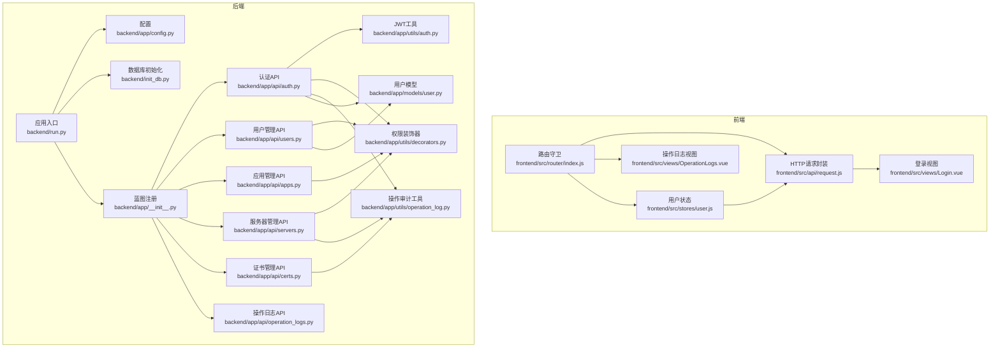
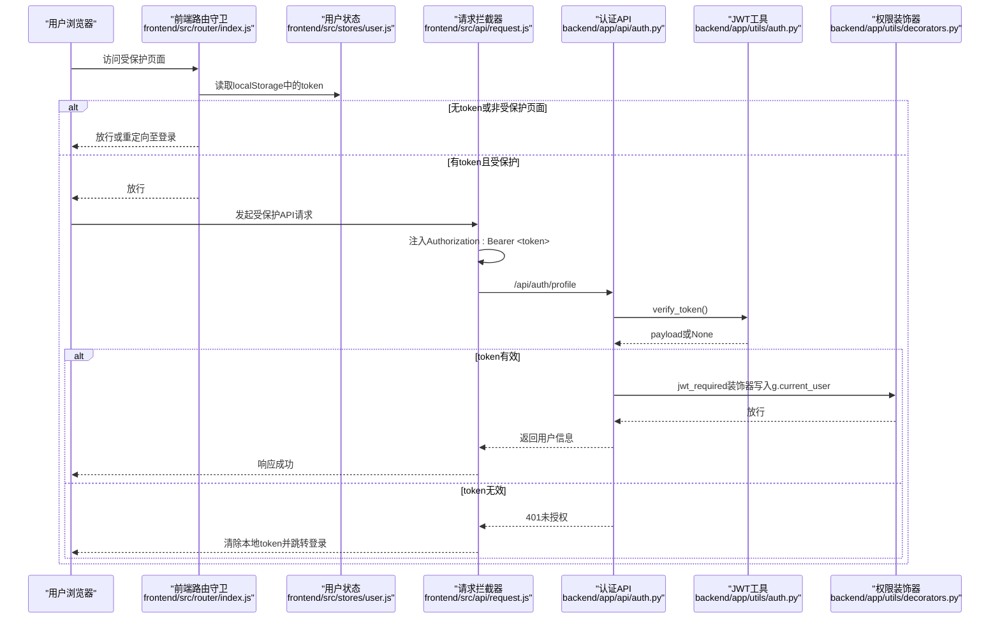
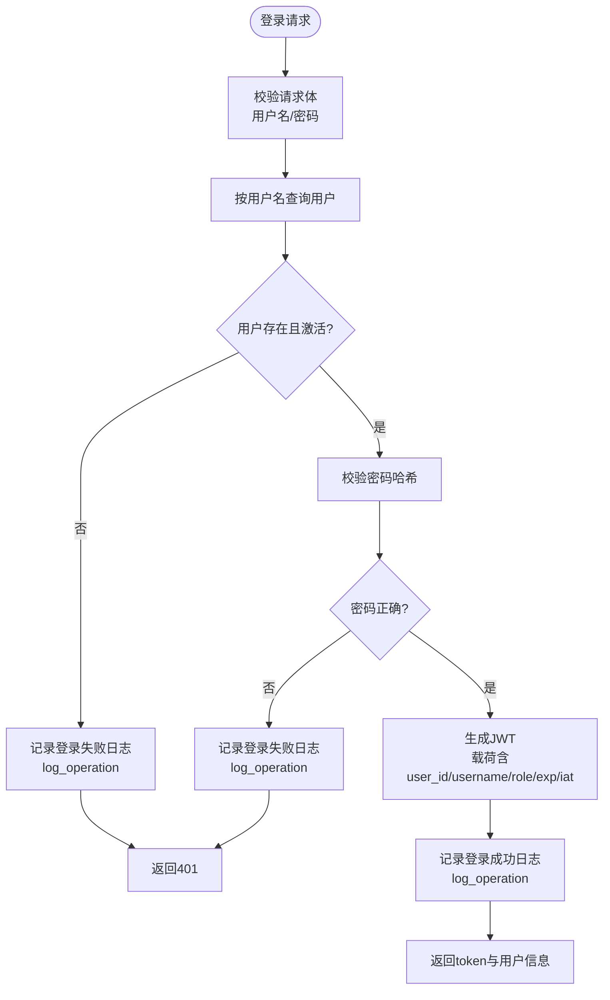
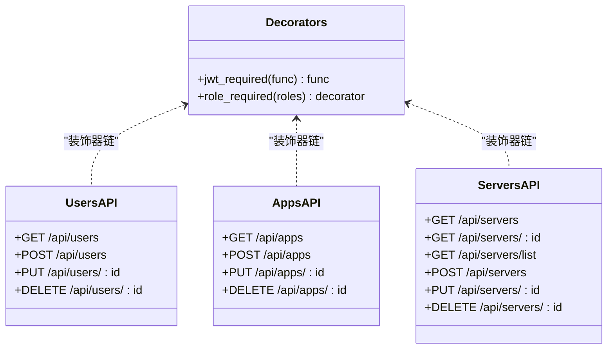
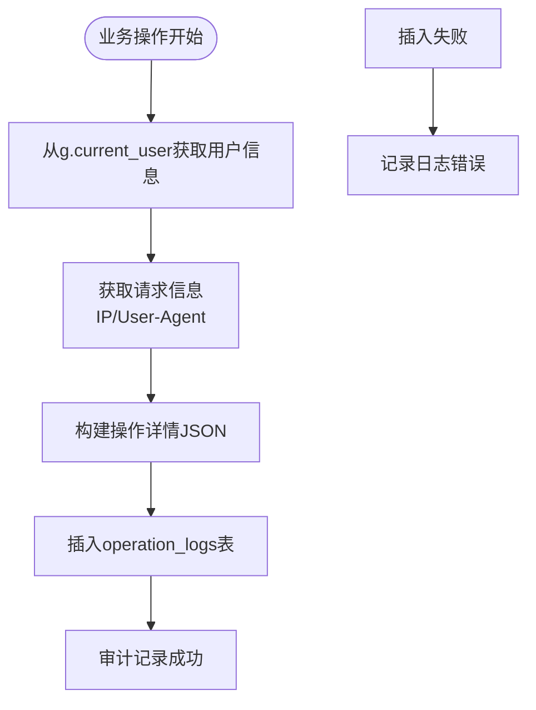
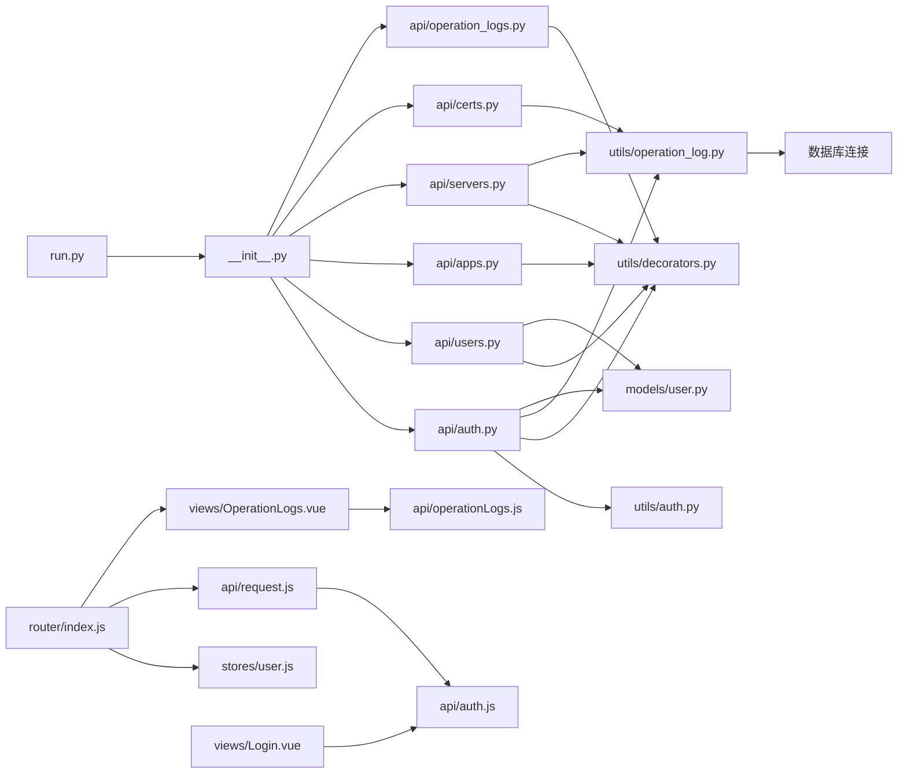

# 安全与权限控制

<cite>
**本文引用的文件**
- [backend/app/api/auth.py](file://backend/app/api/auth.py)
- [backend/app/utils/auth.py](file://backend/app/utils/auth.py)
- [backend/app/utils/decorators.py](file://backend/app/utils/decorators.py)
- [backend/app/utils/operation_log.py](file://backend/app/utils/operation_log.py)
- [backend/app/api/operation_logs.py](file://backend/app/api/operation_logs.py)
- [backend/app/models/user.py](file://backend/app/models/user.py)
- [backend/app/config.py](file://backend/app/config.py)
- [backend/init_db.py](file://backend/init_db.py)
- [backend/run.py](file://backend/run.py)
- [backend/app/__init__.py](file://backend/app/__init__.py)
- [frontend/src/router/index.js](file://frontend/src/router/index.js)
- [frontend/src/stores/user.js](file://frontend/src/stores/user.js)
- [frontend/src/api/request.js](file://frontend/src/api/request.js)
- [frontend/src/api/auth.js](file://frontend/src/api/auth.js)
- [frontend/src/views/Login.vue](file://frontend/src/views/Login.vue)
- [frontend/src/views/OperationLogs.vue](file://frontend/src/views/OperationLogs.vue)
- [frontend/src/api/operationLogs.js](file://frontend/src/api/operationLogs.js)
- [backend/app/api/users.py](file://backend/app/api/users.py)
- [backend/app/api/apps.py](file://backend/app/api/apps.py)
- [backend/app/api/servers.py](file://backend/app/api/servers.py)
- [backend/app/api/certs.py](file://backend/app/api/certs.py)
</cite>

## 更新摘要
**所做更改**
- 新增操作审计日志系统章节，详细介绍操作审计功能的实现
- 更新JWT中间件集成部分，说明用户上下文检测机制
- 增加IP地址和User-Agent捕获等安全审计能力
- 扩展安全审计日志的前端展示和查询功能
- 完善安全配置最佳实践，增加审计日志相关建议

## 目录
1. [引言](#引言)
2. [项目结构](#项目结构)
3. [核心组件](#核心组件)
4. [架构总览](#架构总览)
5. [详细组件分析](#详细组件分析)
6. [操作审计日志系统](#操作审计日志系统)
7. [依赖分析](#依赖分析)
8. [性能考虑](#性能考虑)
9. [故障排查指南](#故障排查指南)
10. [结论](#结论)
11. [附录](#附录)

## 引言
本文件面向云运维平台的安全与权限控制体系，围绕以下主题展开：
- JWT Token认证机制：生成、验证、过期处理与安全性保障
- 基于角色的权限控制（RBAC）：角色定义、权限分配策略与资源访问控制
- 前端路由守卫与后端接口装饰器的协同验证
- 操作审计日志系统：完整的操作追踪与安全审计能力
- 跨域与传输安全策略建议
- 密码加密存储、会话管理、安全审计与常见威胁防护
- 安全配置最佳实践与漏洞防护指南

## 项目结构
后端采用Flask蓝图组织API模块，前端使用Vue Router与Pinia状态管理，整体遵循前后端分离架构。安全相关的关键点包括：
- 后端：JWT工具、认证装饰器、用户模型、配置项、数据库初始化、操作审计工具
- 前端：路由守卫、请求拦截器、用户状态存储、登录视图、操作日志界面

**图表来源**
- [backend/run.py:1-8](file://backend/run.py#L1-L8)
- [backend/app/config.py:1-21](file://backend/app/config.py#L1-L21)
- [backend/init_db.py:1-263](file://backend/init_db.py#L1-L263)
- [backend/app/__init__.py:46-61](file://backend/app/__init__.py#L46-L61)
- [backend/app/api/auth.py:1-192](file://backend/app/api/auth.py#L1-L192)
- [backend/app/api/users.py:1-268](file://backend/app/api/users.py#L1-L268)
- [backend/app/api/apps.py:1-168](file://backend/app/api/apps.py#L1-L168)
- [backend/app/api/servers.py:1-251](file://backend/app/api/servers.py#L1-L251)
- [backend/app/api/certs.py:1-459](file://backend/app/api/certs.py#L1-L459)
- [backend/app/api/operation_logs.py:1-128](file://backend/app/api/operation_logs.py#L1-L128)
- [backend/app/utils/auth.py:1-83](file://backend/app/utils/auth.py#L1-L83)
- [backend/app/utils/decorators.py:1-95](file://backend/app/utils/decorators.py#L1-L95)
- [backend/app/utils/operation_log.py:1-103](file://backend/app/utils/operation_log.py#L1-L103)
- [backend/app/models/user.py:1-183](file://backend/app/models/user.py#L1-L183)
- [frontend/src/router/index.js:1-64](file://frontend/src/router/index.js#L1-L64)
- [frontend/src/stores/user.js:1-41](file://frontend/src/stores/user.js#L1-L41)
- [frontend/src/api/request.js:1-54](file://frontend/src/api/request.js#L1-L54)
- [frontend/src/views/Login.vue:1-114](file://frontend/src/views/Login.vue#L1-L114)
- [frontend/src/views/OperationLogs.vue:1-223](file://frontend/src/views/OperationLogs.vue#L1-L223)

**章节来源**
- [backend/run.py:1-8](file://backend/run.py#L1-L8)
- [backend/app/__init__.py:46-61](file://backend/app/__init__.py#L46-L61)

## 核心组件
- JWT工具与认证：负责Token生成、验证与密码哈希
- 权限装饰器：统一的JWT认证与角色校验
- 操作审计工具：记录用户操作、IP地址、User-Agent等审计信息
- 用户模型：用户查询、创建、更新、删除与密码更新
- 前端路由守卫与请求拦截器：Token注入、未授权跳转、错误处理
- RBAC策略：admin/operator/viewer三类角色，不同API对角色有明确要求

**章节来源**
- [backend/app/utils/auth.py:11-83](file://backend/app/utils/auth.py#L11-L83)
- [backend/app/utils/decorators.py:9-95](file://backend/app/utils/decorators.py#L9-L95)
- [backend/app/utils/operation_log.py:13-51](file://backend/app/utils/operation_log.py#L13-L51)
- [backend/app/models/user.py:8-183](file://backend/app/models/user.py#L8-L183)
- [frontend/src/router/index.js:35-58](file://frontend/src/router/index.js#L35-L58)
- [frontend/src/api/request.js:13-51](file://frontend/src/api/request.js#L13-L51)

## 架构总览
下图展示登录到受保护API的端到端流程，涵盖前端路由守卫、请求拦截器、后端认证与权限装饰器。

**图表来源**
- [frontend/src/router/index.js:35-58](file://frontend/src/router/index.js#L35-L58)
- [frontend/src/stores/user.js:13-37](file://frontend/src/stores/user.js#L13-L37)
- [frontend/src/api/request.js:13-51](file://frontend/src/api/request.js#L13-L51)
- [backend/app/api/auth.py:85-115](file://backend/app/api/auth.py#L85-L115)
- [backend/app/utils/auth.py:38-56](file://backend/app/utils/auth.py#L38-L56)
- [backend/app/utils/decorators.py:9-56](file://backend/app/utils/decorators.py#L9-L56)

## 详细组件分析

### JWT认证机制与流程
- Token生成：包含用户ID、用户名、角色、签发时间与过期时间，使用对称算法签名
- Token验证：解码并校验签名，捕获过期与无效Token异常
- 过期策略：配置项控制过期小时数，默认24小时
- 密码存储：使用强哈希算法生成密码哈希，不保存明文

**图表来源**
- [backend/app/api/auth.py:14-90](file://backend/app/api/auth.py#L14-L90)
- [backend/app/utils/auth.py:11-35](file://backend/app/utils/auth.py#L11-L35)
- [backend/app/models/user.py:39-58](file://backend/app/models/user.py#L39-L58)
- [backend/app/utils/operation_log.py:53-71](file://backend/app/utils/operation_log.py#L53-L71)

**章节来源**
- [backend/app/utils/auth.py:11-83](file://backend/app/utils/auth.py#L11-L83)
- [backend/app/config.py:4-7](file://backend/app/config.py#L4-L7)
- [backend/app/api/auth.py:14-90](file://backend/app/api/auth.py#L14-L90)
- [backend/app/models/user.py:8-36](file://backend/app/models/user.py#L8-L36)

### 前端路由守卫与会话管理
- 路由守卫：根据meta标记判断是否需要认证；对管理员专属页面进行角色校验；检测token并在过期时重定向登录
- 请求拦截器：自动在请求头注入Authorization: Bearer token；统一处理401并清理本地存储
- 用户状态：Pinia Store持久化token与用户信息，支持登出清理

**图表来源**
- [frontend/src/router/index.js:35-58](file://frontend/src/router/index.js#L35-L58)
- [frontend/src/stores/user.js:13-37](file://frontend/src/stores/user.js#L13-L37)
- [frontend/src/api/request.js:13-51](file://frontend/src/api/request.js#L13-L51)

**章节来源**
- [frontend/src/router/index.js:35-58](file://frontend/src/router/index.js#L35-L58)
- [frontend/src/stores/user.js:13-37](file://frontend/src/stores/user.js#L13-L37)
- [frontend/src/api/request.js:13-51](file://frontend/src/api/request.js#L13-L51)

### 基于角色的权限控制（RBAC）
- 角色定义：admin（管理员）、operator（操作员）、viewer（只读用户）
- 接口级角色约束：
  - 用户管理：仅admin可用
  - 应用系统：admin/operator可用
  - 服务器管理：admin/operator可用
- 装饰器链：先jwt_required，再role_required，确保顺序正确

**图表来源**
- [backend/app/utils/decorators.py:9-95](file://backend/app/utils/decorators.py#L9-L95)
- [backend/app/api/users.py:17-207](file://backend/app/api/users.py#L17-L207)
- [backend/app/api/apps.py:11-146](file://backend/app/api/apps.py#L11-L146)
- [backend/app/api/servers.py:11-210](file://backend/app/api/servers.py#L11-L210)

**章节来源**
- [backend/app/api/users.py:17-207](file://backend/app/api/users.py#L17-L207)
- [backend/app/api/apps.py:11-146](file://backend/app/api/apps.py#L11-L146)
- [backend/app/api/servers.py:11-210](file://backend/app/api/servers.py#L11-L210)
- [backend/app/utils/decorators.py:59-95](file://backend/app/utils/decorators.py#L59-L95)

### 密码加密存储与会话管理
- 密码加密：后端使用强哈希算法生成密码哈希并入库
- 会话管理：基于JWT无状态会话；前端localStorage存储token与用户信息；响应拦截器统一处理401并清空本地存储
- 登录流程：前端调用登录接口，接收token与用户信息，写入localStorage并跳转首页

**章节来源**
- [backend/app/models/user.py:8-36](file://backend/app/models/user.py#L8-L36)
- [backend/app/api/auth.py:118-192](file://backend/app/api/auth.py#L118-L192)
- [frontend/src/api/auth.js:1-14](file://frontend/src/api/auth.js#L1-L14)
- [frontend/src/views/Login.vue:50-66](file://frontend/src/views/Login.vue#L50-L66)
- [frontend/src/stores/user.js:13-37](file://frontend/src/stores/user.js#L13-L37)
- [frontend/src/api/request.js:35-51](file://frontend/src/api/request.js#L35-L51)

### 数据库与默认账户
- 初始化脚本创建用户表与默认字典数据，并插入默认管理员账户
- 用户表包含角色字段与激活状态，配合后端认证与权限控制
- 操作日志表包含用户ID、用户名、模块、操作类型、目标对象、IP地址、User-Agent等审计信息

**章节来源**
- [backend/init_db.py:33-47](file://backend/init_db.py#L33-L47)
- [backend/init_db.py:228-233](file://backend/init_db.py#L228-L233)
- [backend/init_db.py:209-228](file://backend/init_db.py#L209-L228)

## 操作审计日志系统

### 系统概述
操作审计日志系统为云运维平台提供了完整的操作追踪与安全审计能力，通过在关键业务操作中嵌入审计代码，实现对用户行为的全面监控。

### 核心组件
- 操作日志工具：提供log_operation函数，自动捕获用户上下文、IP地址、User-Agent等信息
- 日志API：提供操作日志查询、模块分类、操作类型筛选等功能
- 前端界面：支持按模块、操作类型、用户、时间范围等条件查询操作日志

### 审计信息采集
系统自动收集以下审计信息：
- 用户信息：user_id、username（来自JWT装饰器的g.current_user）
- 操作信息：module（模块名称）、action（操作类型）
- 目标信息：target_id、target_name（操作对象标识）
- 技术信息：IP地址、User-Agent、时间戳
- 详情信息：JSON格式的操作详情

### 审计覆盖范围
系统已在以下关键API中集成了操作审计：
- 认证模块：登录成功/失败、登出操作
- 服务器管理：创建、更新、删除服务器
- 证书管理：创建、上传、更新、删除证书
- 用户管理：用户相关操作（已在用户API中集成）

**图表来源**
- [backend/app/utils/operation_log.py:13-51](file://backend/app/utils/operation_log.py#L13-L51)
- [backend/app/api/auth.py:45-69](file://backend/app/api/auth.py#L45-L69)
- [backend/app/api/servers.py:154-156](file://backend/app/api/servers.py#L154-L156)
- [backend/app/api/certs.py:269-271](file://backend/app/api/certs.py#L269-L271)

### 日志API设计
操作日志API提供以下功能：
- 分页查询：支持page、page_size参数
- 条件筛选：支持module、action、username、start_date、end_date
- 统计查询：提供模块和操作类型的枚举列表
- 数据格式：统一的JSON响应格式，包含items、total、page、page_size

### 前端审计界面
前端操作日志界面提供：
- 多维度筛选：模块、操作类型、用户、日期范围
- 分页展示：支持10/20/50/100条每页切换
- 实时查询：支持并发获取模块和操作类型选项
- 详情展示：支持JSON格式详情的友好展示

**章节来源**
- [backend/app/utils/operation_log.py:13-103](file://backend/app/utils/operation_log.py#L13-L103)
- [backend/app/api/operation_logs.py:12-128](file://backend/app/api/operation_logs.py#L12-L128)
- [frontend/src/views/OperationLogs.vue:1-223](file://frontend/src/views/OperationLogs.vue#L1-L223)
- [frontend/src/api/operationLogs.js:1-16](file://frontend/src/api/operationLogs.js#L1-L16)

## 依赖分析
- 后端依赖关系：蓝图注册集中于应用入口；认证API依赖JWT工具与装饰器；用户模型提供数据库操作；配置项贯穿运行时；操作日志工具依赖数据库连接和装饰器
- 前端依赖关系：路由守卫依赖用户状态；请求拦截器依赖路由与Element Plus消息提示；登录视图依赖API与用户状态；操作日志界面依赖日志API

**图表来源**
- [backend/run.py:1-8](file://backend/run.py#L1-L8)
- [backend/app/__init__.py:46-61](file://backend/app/__init__.py#L46-L61)
- [backend/app/api/auth.py:1-192](file://backend/app/api/auth.py#L1-L192)
- [backend/app/api/users.py:1-268](file://backend/app/api/users.py#L1-L268)
- [backend/app/api/apps.py:1-168](file://backend/app/api/apps.py#L1-L168)
- [backend/app/api/servers.py:1-251](file://backend/app/api/servers.py#L1-L251)
- [backend/app/api/certs.py:1-459](file://backend/app/api/certs.py#L1-L459)
- [backend/app/api/operation_logs.py:1-128](file://backend/app/api/operation_logs.py#L1-L128)
- [backend/app/utils/auth.py:1-83](file://backend/app/utils/auth.py#L1-L83)
- [backend/app/utils/decorators.py:1-95](file://backend/app/utils/decorators.py#L1-L95)
- [backend/app/utils/operation_log.py:1-103](file://backend/app/utils/operation_log.py#L1-L103)
- [backend/app/models/user.py:1-183](file://backend/app/models/user.py#L1-L183)
- [frontend/src/router/index.js:1-64](file://frontend/src/router/index.js#L1-L64)
- [frontend/src/stores/user.js:1-41](file://frontend/src/stores/user.js#L1-L41)
- [frontend/src/api/request.js:1-54](file://frontend/src/api/request.js#L1-L54)
- [frontend/src/api/auth.js:1-14](file://frontend/src/api/auth.js#L1-L14)
- [frontend/src/views/Login.vue:1-114](file://frontend/src/views/Login.vue#L1-L114)
- [frontend/src/views/OperationLogs.vue:1-223](file://frontend/src/views/OperationLogs.vue#L1-L223)
- [frontend/src/api/operationLogs.js:1-16](file://frontend/src/api/operationLogs.js#L1-L16)

**章节来源**
- [backend/app/__init__.py:46-61](file://backend/app/__init__.py#L46-L61)
- [frontend/src/router/index.js:35-58](file://frontend/src/router/index.js#L35-L58)

## 性能考虑
- Token过期时间：合理设置过期时长以平衡安全与用户体验
- 装饰器链开销：jwt_required与role_required均为O(1)检查，对性能影响极小
- 前端拦截器：避免重复注入Authorization头，减少不必要的请求重试
- 数据库索引：用户表与常用查询字段建立索引，提升查询效率
- 审计日志性能：操作日志异步写入，不影响主业务流程；查询时建立适当索引优化性能

## 故障排查指南
- 登录失败
  - 检查用户名/密码是否为空、用户是否激活、密码哈希是否匹配
  - 参考：[backend/app/api/auth.py:23-61](file://backend/app/api/auth.py#L23-L61)
- 401未授权
  - 前端：确认localStorage中token存在且格式为Bearer；响应拦截器会自动清理并跳转登录
  - 后端：确认Authorization头格式正确、Token未过期或被篡改
  - 参考：[frontend/src/api/request.js:35-51](file://frontend/src/api/request.js#L35-L51)、[backend/app/utils/decorators.py:20-56](file://backend/app/utils/decorators.py#L20-L56)
- 权限不足（403）
  - 确认当前用户角色是否满足接口所需角色
  - 参考：[backend/app/utils/decorators.py:73-95](file://backend/app/utils/decorators.py#L73-L95)
- 用户管理异常
  - 确认请求体字段完整、角色值合法、密码长度符合要求、用户名唯一
  - 参考：[backend/app/api/users.py:43-96](file://backend/app/api/users.py#L43-L96)
- 数据库初始化
  - 确认数据库连接参数正确、默认管理员账户已创建、操作日志表结构正确
  - 参考：[backend/init_db.py:9-25](file://backend/init_db.py#L9-L25)、[backend/init_db.py:228-233](file://backend/init_db.py#L228-L233)
- 审计日志异常
  - 检查operation_logs表结构是否正确、数据库连接是否正常、g.current_user是否正确设置
  - 参考：[backend/app/utils/operation_log.py:28-31](file://backend/app/utils/operation_log.py#L28-L31)、[backend/app/api/operation_logs.py:12-128](file://backend/app/api/operation_logs.py#L12-L128)

**章节来源**
- [backend/app/api/auth.py:23-61](file://backend/app/api/auth.py#L23-L61)
- [frontend/src/api/request.js:35-51](file://frontend/src/api/request.js#L35-L51)
- [backend/app/utils/decorators.py:20-56](file://backend/app/utils/decorators.py#L20-L56)
- [backend/app/utils/decorators.py:73-95](file://backend/app/utils/decorators.py#L73-L95)
- [backend/app/api/users.py:43-96](file://backend/app/api/users.py#L43-L96)
- [backend/init_db.py:9-25](file://backend/init_db.py#L9-L25)
- [backend/init_db.py:228-233](file://backend/init_db.py#L228-L233)
- [backend/app/utils/operation_log.py:28-31](file://backend/app/utils/operation_log.py#L28-L31)
- [backend/app/api/operation_logs.py:12-128](file://backend/app/api/operation_logs.py#L12-L128)

## 结论
该平台采用JWT无状态认证与RBAC角色控制，结合前端路由守卫与请求拦截器，形成完整的安全边界。新增的操作审计日志系统进一步增强了平台的安全监控能力，通过自动捕获用户上下文、IP地址、User-Agent等关键信息，实现了对用户行为的全面追踪。通过强密码哈希、严格的接口角色约束、统一的错误处理以及完善的审计日志，有效提升了系统的安全性与可维护性。建议在生产环境中进一步强化密钥管理、引入HTTPS、实施更细粒度的资源级权限与持续的审计监控。

## 附录

### 安全配置最佳实践
- 密钥管理
  - 生产环境务必设置独立的JWT密钥与Flask密钥，避免使用默认值
  - 参考：[backend/app/config.py:4-7](file://backend/app/config.py#L4-L7)
- 传输安全
  - 强制使用HTTPS，防止Token在传输中泄露
- Token策略
  - 合理设置过期时间；对敏感操作可考虑缩短有效期或二次校验
  - 参考：[backend/app/config.py:7](file://backend/app/config.py#L7)、[backend/app/utils/auth.py:23](file://backend/app/utils/auth.py#L23)
- 前端安全
  - 限制localStorage使用范围，避免XSS导致的Token泄露
  - 对输入进行严格校验与过滤
- 后端安全
  - 严格区分角色与接口权限，确保装饰器顺序正确
  - 对数据库查询参数进行白名单校验，避免注入
  - 在关键业务操作中集成操作审计日志
- 审计与监控
  - 记录登录、权限变更、高危操作等关键事件
  - 定期审查日志与异常行为
  - 建立审计日志的保留策略和查询权限控制

### 常见威胁与防护
- XSS
  - 前端：对用户输入与输出进行转义；避免内联事件与eval
  - 后端：对查询参数与响应内容进行严格校验
- CSRF
  - 使用同源策略与安全Cookie属性；对关键操作增加二次确认
- 会话劫持
  - 使用HTTPS；短令牌周期；必要时引入刷新令牌与设备绑定
- 权限提升
  - 严格的角色校验；最小权限原则；定期权限复核
- 暴力破解
  - 登录失败次数限制；验证码；账户锁定策略
- 审计绕过
  - 操作审计日志作为安全防线的重要组成部分，应确保其完整性与不可篡改性
  - 建立独立的日志存储和访问控制机制

### 操作审计最佳实践
- 审计覆盖面：在所有关键业务操作中集成审计日志
- 数据完整性：确保审计信息的准确性与时效性
- 性能优化：采用异步写入和适当的索引策略
- 合规要求：遵循相关法律法规对日志保存期限的要求
- 访问控制：限制审计日志的访问权限，防止信息泄露