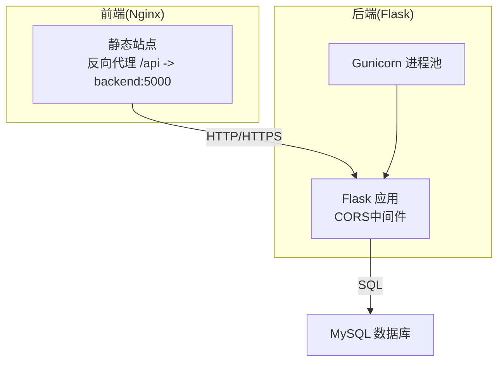
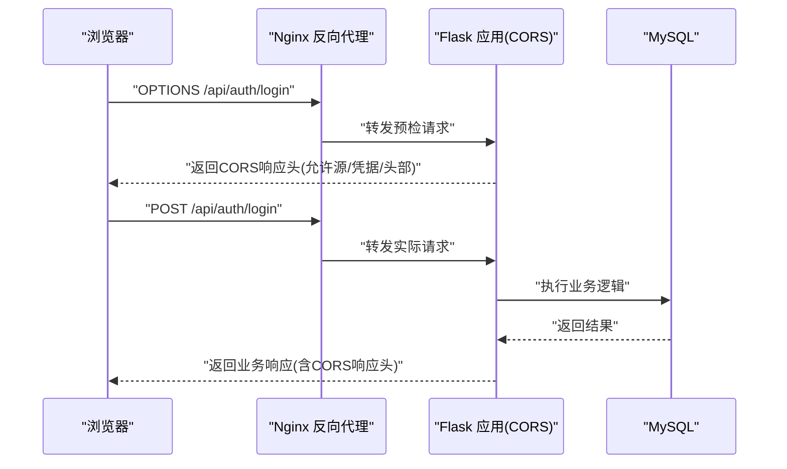
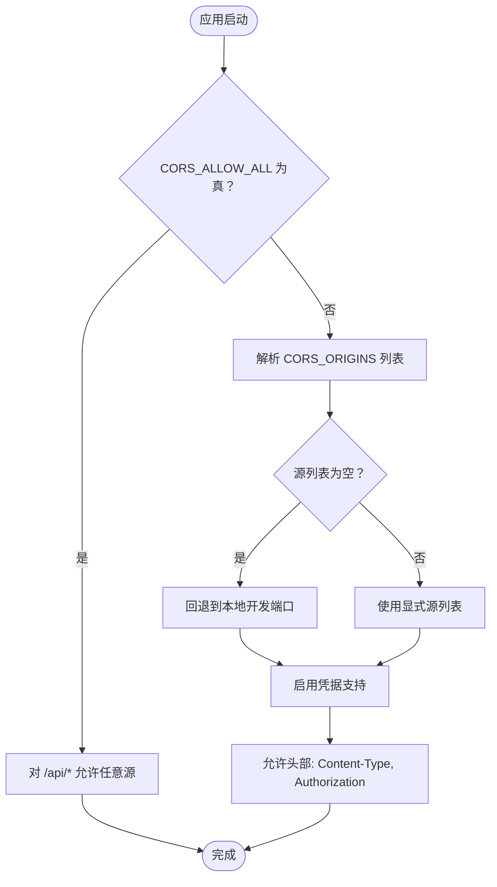
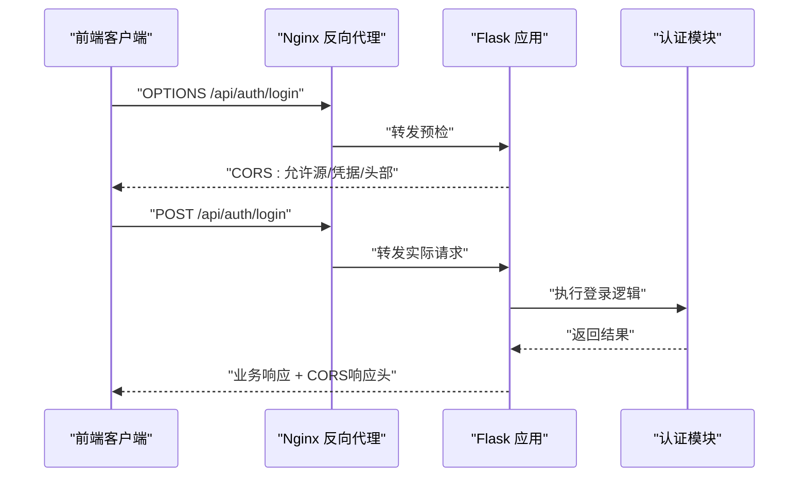
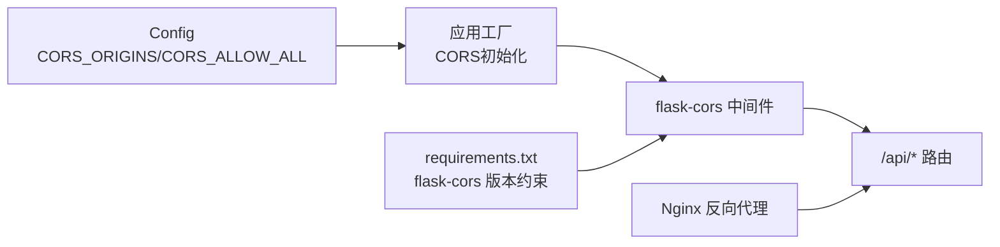

# CORS安全配置

<cite>
**本文引用的文件**
- [backend/app/__init__.py](file://backend/app/__init__.py)
- [backend/app/config.py](file://backend/app/config.py)
- [backend/Dockerfile](file://backend/Dockerfile)
- [docker-compose.yml](file://docker-compose.yml)
- [nginx.conf](file://nginx.conf)
- [backend/requirements.txt](file://backend/requirements.txt)
- [backend/app/api/auth.py](file://backend/app/api/auth.py)
</cite>

## 目录
1. [简介](#简介)
2. [项目结构](#项目结构)
3. [核心组件](#核心组件)
4. [架构总览](#架构总览)
5. [详细组件分析](#详细组件分析)
6. [依赖分析](#依赖分析)
7. [性能考量](#性能考量)
8. [故障排查指南](#故障排查指南)
9. [结论](#结论)
10. [附录](#附录)

## 简介
本文件面向OPS项目的CORS（跨域资源共享）安全配置，系统性阐述CORS基本概念、安全风险与最佳实践，并结合项目现有实现，给出生产与开发环境的差异化配置方案、预检请求处理机制、凭据传递的安全考虑，以及常见错误的诊断与修复路径。同时提供安全扫描工具使用建议，帮助团队在保障功能可用的同时提升安全性。

## 项目结构
- 后端采用Flask + Gunicorn部署，CORS通过flask-cors中间件在应用层统一配置。
- 前端通过Nginx反向代理访问后端API，Nginx负责静态资源与反向代理，不直接参与CORS头处理。
- Docker Compose编排MySQL、后端、前端三服务，后端暴露5000端口，前端监听80端口并通过Nginx转发至后端。

图表来源
- [docker-compose.yml:30-96](file://docker-compose.yml#L30-L96)
- [nginx.conf:32-47](file://nginx.conf#L32-L47)
- [backend/Dockerfile:34-36](file://backend/Dockerfile#L34-L36)

章节来源
- [docker-compose.yml:1-103](file://docker-compose.yml#L1-L103)
- [nginx.conf:1-70](file://nginx.conf#L1-L70)
- [backend/Dockerfile:1-36](file://backend/Dockerfile#L1-L36)

## 核心组件
- CORS配置入口：在应用工厂函数中根据环境变量动态决定CORS策略。
- 配置参数：
  - CORS_ORIGINS：允许的源列表，逗号分隔。
  - CORS_ALLOW_ALL：是否允许任意源（与supports_credentials同时使用时不可为“*”）。
  - supports_credentials：是否允许携带凭据（Cookie/Authorization等）。
  - allow_headers：允许的自定义头部集合。
- 默认策略：当未开启CORS_ALLOW_ALL时，使用显式源列表+支持凭据+限定允许头部（Content-Type、Authorization）。

章节来源
- [backend/app/__init__.py:64-80](file://backend/app/__init__.py#L64-L80)
- [backend/app/config.py:32-38](file://backend/app/config.py#L32-L38)
- [backend/app/config.py:55-58](file://backend/app/config.py#L55-L58)

## 架构总览
下图展示从浏览器到后端API的典型CORS交互流程，包括预检请求与实际请求阶段。

图表来源
- [backend/app/__init__.py:64-80](file://backend/app/__init__.py#L64-L80)
- [backend/app/api/auth.py:15-23](file://backend/app/api/auth.py#L15-L23)
- [nginx.conf:32-47](file://nginx.conf#L32-L47)

## 详细组件分析

### CORS配置策略与实现
- 动态策略选择
  - 当CORS_ALLOW_ALL为真时，对/api/*路径允许任意源（不启用凭据）。
  - 否则使用显式源列表，启用凭据，允许Content-Type与Authorization头部。
- 源列表解析
  - 通过Config.get_cors_origins_list()将逗号分隔字符串拆分为数组，若为空则回退到本地开发端口。
- 凭据与头部控制
  - supports_credentials为True时，客户端可携带Cookie/Authorization等凭据。
  - allow_headers限制为Content-Type与Authorization，避免过度放权。

图表来源
- [backend/app/__init__.py:64-80](file://backend/app/__init__.py#L64-L80)
- [backend/app/config.py:32-38](file://backend/app/config.py#L32-L38)
- [backend/app/config.py:55-58](file://backend/app/config.py#L55-L58)

章节来源
- [backend/app/__init__.py:64-80](file://backend/app/__init__.py#L64-L80)
- [backend/app/config.py:32-38](file://backend/app/config.py#L32-L38)
- [backend/app/config.py:55-58](file://backend/app/config.py#L55-L58)

### 开发环境与生产环境差异
- 开发环境
  - CORS_ORIGINS默认包含本地开发端口，便于前端本地联调。
  - CORS_ALLOW_ALL默认为假，确保凭据与头部受控。
- 生产环境
  - CORS_ORIGINS由部署环境显式配置，覆盖域名与协议（如https://opm.pepsikey.online）。
  - CORS_ALLOW_ALL保持为假，避免“*”带来的安全风险。
- Nginx与CORS的关系
  - Nginx仅负责反向代理与静态资源，不直接设置CORS头；CORS由后端Flask应用统一处理。

章节来源
- [backend/app/config.py:32-38](file://backend/app/config.py#L32-L38)
- [docker-compose.yml:48-49](file://docker-compose.yml#L48-L49)
- [nginx.conf:32-47](file://nginx.conf#L32-L47)

### 预检请求处理机制
- 浏览器在以下情况下会发送预检请求（OPTIONS）：
  - 自定义头部（如Authorization）或非简单方法（如POST/PUT/DELETE）。
  - 需要携带凭据（Cookie/Authorization）。
- 后端策略
  - 当supports_credentials为True时，后端需明确允许的源列表，不可为“*”，以满足浏览器要求。
  - allow_headers限制为Content-Type与Authorization，避免扩大攻击面。
- 实际请求
  - 预检通过后，浏览器发送实际请求（如POST /api/auth/login），后端返回业务响应并附带CORS响应头。

章节来源
- [backend/app/__init__.py:64-80](file://backend/app/__init__.py#L64-L80)
- [backend/app/api/auth.py:15-23](file://backend/app/api/auth.py#L15-L23)

### 凭据传递的安全考虑
- 凭据场景
  - 当前端需要携带Cookie或Authorization头时，后端需启用supports_credentials。
- 安全约束
  - 不得将origins设为“*”，必须使用显式源列表，防止跨站脚本劫持凭据。
  - 仅允许必要头部（Content-Type、Authorization），避免泄露敏感信息。
- 最小权限原则
  - 源列表仅包含必要的域名与端口；头部仅允许必需项；方法仅开放必要接口。

章节来源
- [backend/app/__init__.py:64-80](file://backend/app/__init__.py#L64-L80)
- [backend/app/config.py:32-38](file://backend/app/config.py#L32-L38)

### API端点与CORS交互示例
- 登录接口（POST /api/auth/login）
  - 需要JSON请求体与Authorization头部（预检阶段）。
  - 后端返回业务响应并附带CORS响应头，允许前端跨域读取。

图表来源
- [backend/app/api/auth.py:15-23](file://backend/app/api/auth.py#L15-L23)
- [backend/app/__init__.py:64-80](file://backend/app/__init__.py#L64-L80)
- [nginx.conf:32-47](file://nginx.conf#L32-L47)

## 依赖分析
- 组件耦合
  - 应用工厂依赖Config提供的CORS配置参数，耦合度低，便于通过环境变量切换策略。
  - CORS中间件作用于/api/*路径，范围明确，避免对静态资源产生影响。
- 外部依赖
  - flask-cors版本≥4.0.0，确保与Flask 3.x兼容。
  - Nginx负责反向代理，不参与CORS头设置，降低复杂度。
- 潜在风险
  - 若误将CORS_ALLOW_ALL设为真且origins为“*”，将导致凭据场景下的安全漏洞。
  - 若allow_headers过度放宽，可能被用于探测或滥用。

图表来源
- [backend/app/__init__.py:64-80](file://backend/app/__init__.py#L64-L80)
- [backend/app/config.py:32-38](file://backend/app/config.py#L32-L38)
- [backend/requirements.txt:1-17](file://backend/requirements.txt#L1-L17)
- [nginx.conf:32-47](file://nginx.conf#L32-L47)

章节来源
- [backend/app/__init__.py:64-80](file://backend/app/__init__.py#L64-L80)
- [backend/app/config.py:32-38](file://backend/app/config.py#L32-L38)
- [backend/requirements.txt:1-17](file://backend/requirements.txt#L1-L17)
- [nginx.conf:32-47](file://nginx.conf#L32-L47)

## 性能考量
- 预检请求开销
  - OPTIONS预检会增加一次往返，建议减少不必要的自定义头部与非简单方法。
- 头部与源列表最小化
  - 仅允许必要头部与源，有助于减少浏览器与后端的匹配成本。
- 反向代理链路
  - Nginx仅做转发，不引入额外CORS处理，有利于降低延迟与复杂度。

## 故障排查指南
- 常见CORS错误与定位
  - “Access to fetch at ‘...’ from origin ‘...’ has been blocked by CORS policy”
    - 排查点：CORS_ORIGINS是否包含当前前端源；CORS_ALLOW_ALL是否误设为真且origins为“*”。
  - “The value of the ‘Access-Control-Allow-Origin’ header in the response to preflight request contains multiple values”
    - 排查点：确保只设置一个允许的源，不要使用“*”。
  - “Request header field Authorization is not allowed by Access-Control-Allow-Headers”
    - 排查点：确认allow_headers包含Authorization。
  - “The request was made with credentials enabled but the value of the ‘Access-Control-Allow-Origin’ header is ‘*’”
    - 排查点：启用凭据时不得使用“*”，必须使用显式源列表。
- 诊断步骤
  - 在浏览器开发者工具Network标签查看预检与实际请求的CORS响应头。
  - 检查后端日志，确认CORS中间件已正确初始化。
  - 确认Nginx反向代理未覆盖或篡改CORS响应头。
- 修复建议
  - 显式配置CORS_ORIGINS，包含所有前端域名与协议。
  - 将CORS_ALLOW_ALL设为false，启用凭据时使用显式源列表。
  - 仅允许必要头部（Content-Type、Authorization）。
  - 对外暴露的生产环境务必通过环境变量覆盖默认值。

章节来源
- [backend/app/__init__.py:64-80](file://backend/app/__init__.py#L64-L80)
- [backend/app/config.py:32-38](file://backend/app/config.py#L32-L38)
- [nginx.conf:32-47](file://nginx.conf#L32-L47)

## 结论
OPS项目的CORS配置遵循“最小权限+显式源列表+凭据受控”的安全原则，通过环境变量灵活切换开发与生产策略。建议在生产环境中严格限制源列表与允许头部，避免使用“*”，并配合Nginx反向代理与Gunicorn部署，确保跨域访问既安全又高效。

## 附录

### CORS配置最佳实践清单
- 最小权限原则
  - 源列表仅包含必要域名与端口；头部仅允许必需项；方法仅开放必要接口。
- 安全头部设置
  - 显式指定允许头部（Content-Type、Authorization）；避免通配符。
- 错误处理
  - 对预检失败与凭据场景错误进行明确的错误码与提示。
- 安全扫描工具建议
  - 使用浏览器开发者工具检查CORS响应头。
  - 使用自动化扫描工具（如OWASP ZAP、Burp Suite）检测跨域配置风险。
  - 定期审计CORS_ORIGINS与allow_headers变更记录。

### 关键配置参考路径
- CORS_ORIGINS与CORS_ALLOW_ALL的环境变量配置
  - [docker-compose.yml:48-49](file://docker-compose.yml#L48-L49)
- CORS中间件初始化与策略
  - [backend/app/__init__.py:64-80](file://backend/app/__init__.py#L64-L80)
- 源列表解析与默认回退
  - [backend/app/config.py:32-38](file://backend/app/config.py#L32-L38)
  - [backend/app/config.py:55-58](file://backend/app/config.py#L55-L58)
- 反向代理与静态资源
  - [nginx.conf:32-47](file://nginx.conf#L32-L47)
- 依赖版本约束
  - [backend/requirements.txt:1-17](file://backend/requirements.txt#L1-L17)