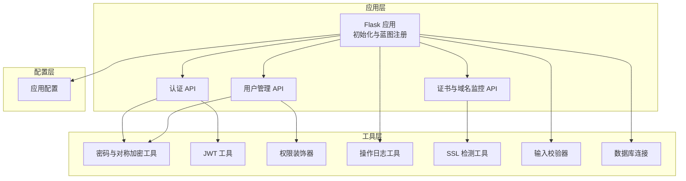
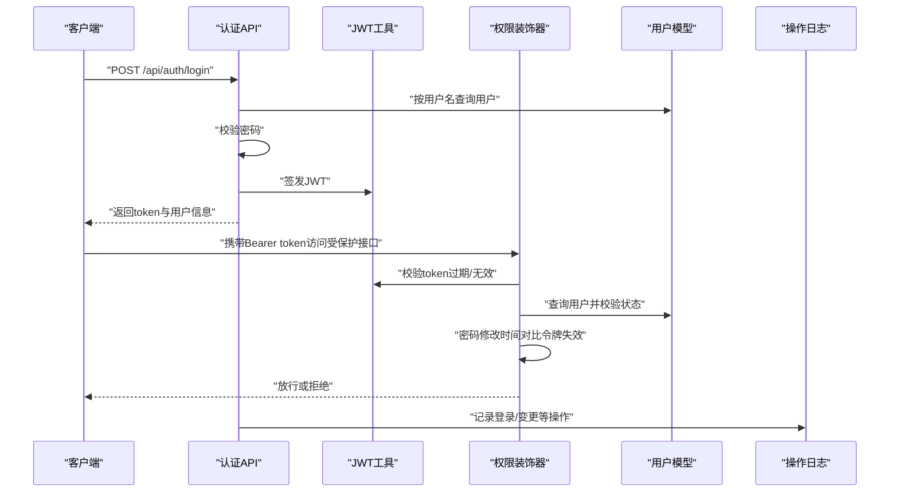
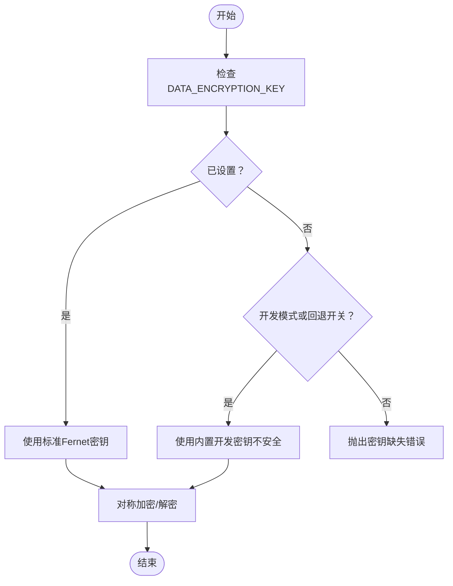
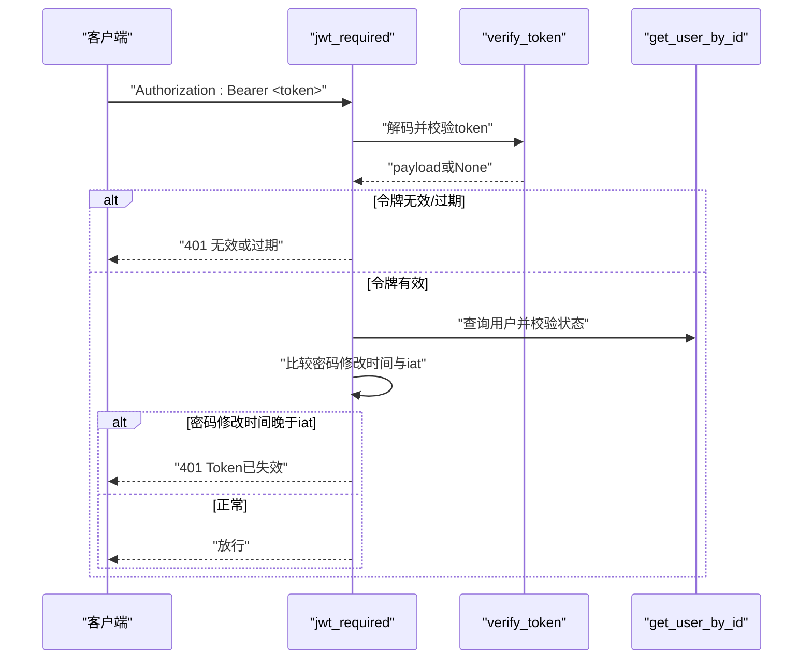
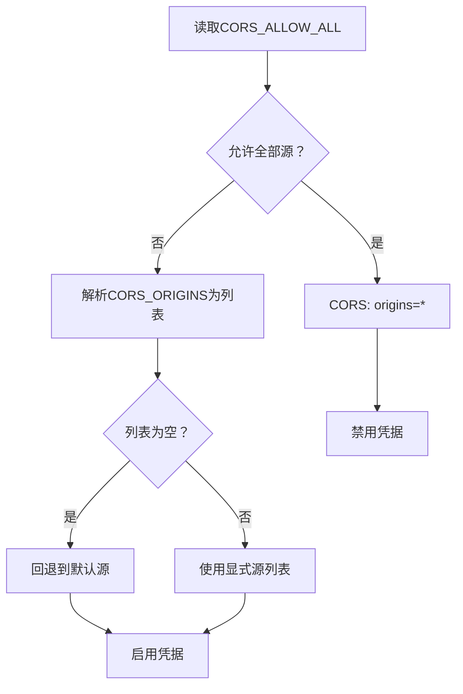
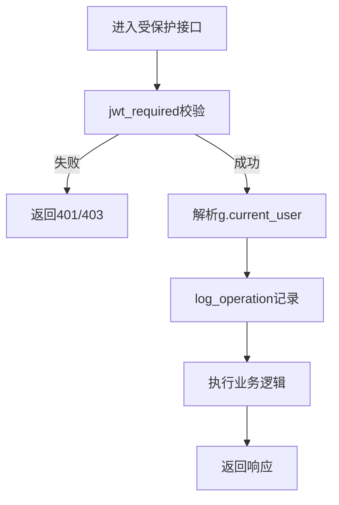
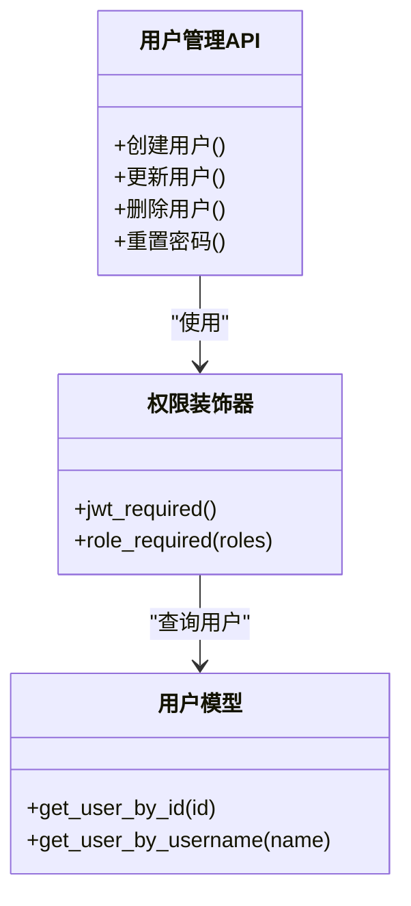
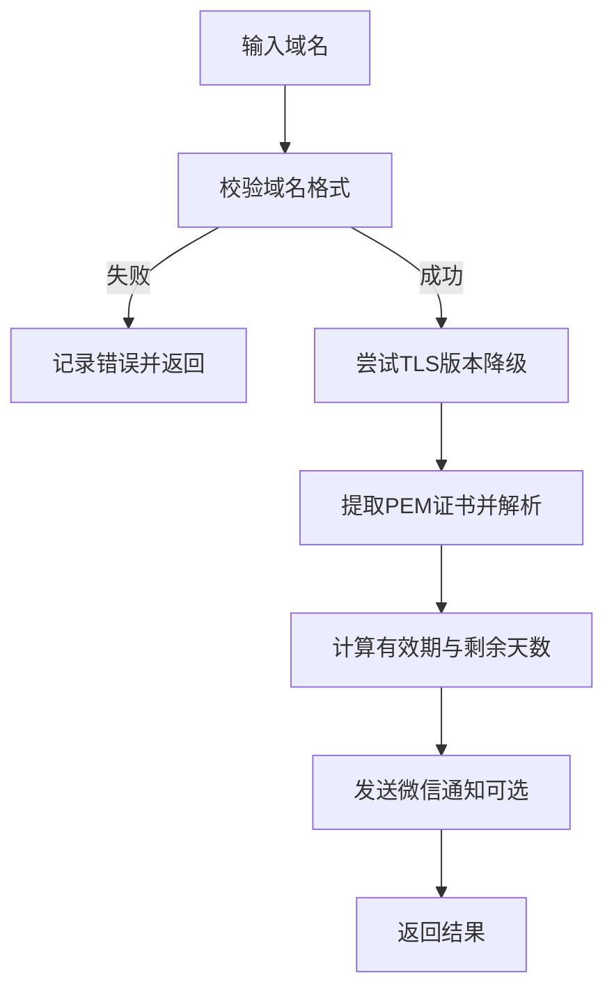
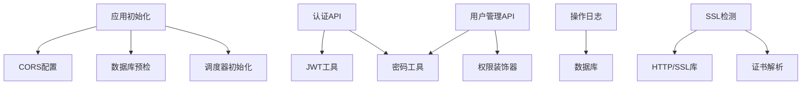

# 安全设计

<cite>
**本文引用的文件**
- [backend/app/__init__.py](file://backend/app/__init__.py)
- [backend/app/config.py](file://backend/app/config.py)
- [backend/app/utils/password_utils.py](file://backend/app/utils/password_utils.py)
- [backend/app/utils/auth.py](file://backend/app/utils/auth.py)
- [backend/app/api/auth.py](file://backend/app/api/auth.py)
- [backend/app/utils/decorators.py](file://backend/app/utils/decorators.py)
- [backend/app/models/user.py](file://backend/app/models/user.py)
- [backend/app/api/users.py](file://backend/app/api/users.py)
- [backend/app/utils/operation_log.py](file://backend/app/utils/operation_log.py)
- [backend/app/utils/ssl_checker.py](file://backend/app/utils/ssl_checker.py)
- [backend/app/utils/validators.py](file://backend/app/utils/validators.py)
- [backend/app/utils/db.py](file://backend/app/utils/db.py)
- [backend/Dockerfile](file://backend/Dockerfile)
- [docker-compose.yml](file://docker-compose.yml)
- [backend/run.py](file://backend/run.py)
</cite>

## 目录
1. [引言](#引言)
2. [项目结构](#项目结构)
3. [核心组件](#核心组件)
4. [架构总览](#架构总览)
5. [详细组件分析](#详细组件分析)
6. [依赖分析](#依赖分析)
7. [性能考量](#性能考量)
8. [故障排查指南](#故障排查指南)
9. [结论](#结论)
10. [附录](#附录)

## 引言
本文件面向OPS项目，提供一套系统化的安全设计文档，覆盖数据加密策略、认证与会话安全、CORS配置安全、操作日志审计、权限控制（RBAC）、安全配置指南、漏洞防护、安全审计与应急响应，以及安全测试与渗透测试建议。文档基于仓库现有实现进行分析与提炼，旨在帮助开发与运维团队在保证功能完备的同时，提升系统的整体安全性。

## 项目结构
后端采用Flask应用，通过蓝图组织API模块，安全相关能力分布在配置、工具模块与API层：
- 配置层：集中管理密钥、CORS、上传与告警等安全相关参数
- 工具层：密码加密、JWT工具、权限装饰器、操作日志、SSL检测、校验器、数据库连接
- API层：认证、用户管理、证书与域名监控等业务接口
- 运行与编排：Dockerfile与docker-compose定义容器化部署与默认安全参数

图表来源
- [backend/app/__init__.py:28-114](file://backend/app/__init__.py#L28-L114)
- [backend/app/api/auth.py:15-96](file://backend/app/api/auth.py#L15-L96)
- [backend/app/api/users.py:19-104](file://backend/app/api/users.py#L19-L104)
- [backend/app/utils/password_utils.py:52-130](file://backend/app/utils/password_utils.py#L52-L130)
- [backend/app/utils/auth.py:9-45](file://backend/app/utils/auth.py#L9-L45)
- [backend/app/utils/decorators.py:26-163](file://backend/app/utils/decorators.py#L26-L163)
- [backend/app/utils/operation_log.py:49-172](file://backend/app/utils/operation_log.py#L49-L172)
- [backend/app/utils/ssl_checker.py:48-167](file://backend/app/utils/ssl_checker.py#L48-L167)
- [backend/app/utils/validators.py:60-151](file://backend/app/utils/validators.py#L60-L151)
- [backend/app/utils/db.py:43-80](file://backend/app/utils/db.py#L43-L80)
- [backend/app/config.py:10-58](file://backend/app/config.py#L10-L58)

章节来源
- [backend/app/__init__.py:28-114](file://backend/app/__init__.py#L28-L114)
- [backend/app/config.py:10-58](file://backend/app/config.py#L10-L58)

## 核心组件
- 数据加密与敏感信息保护
  - 密码加密：bcrypt用于不可逆哈希
  - 对称加密：Fernet用于可逆加密，支持标准密钥或PBKDF2派生
  - 开发回退：在调试模式或特定开关下允许使用内置密钥（仅限开发）
- 认证与会话安全
  - JWT签发与校验：HS256算法，带过期时间；令牌过期与“密码修改后即失效”策略
  - 权限装饰器：统一鉴权与角色校验
- CORS安全配置
  - 默认白名单源 + 凭据支持；当允许全部源时禁用凭据
- 操作日志与审计
  - 统一日志记录：模块、动作、目标、详情、IP、UA、UTC时间
  - 登录/登出/用户管理等关键动作均记录
- 权限控制（RBAC）
  - 角色：admin/operator/viewer
  - 装饰器强制校验JWT与角色
- 传输与外部集成安全
  - SSL证书检测：多TLS版本降级尝试、PEM解析、有效期计算
  - 企业微信通知：Markdown消息、重试机制
- 输入与配置安全
  - 输入校验器：用户名、密码、域名、URL、端口等
  - 配置参数：密钥、CORS、超时、告警阈值等

章节来源
- [backend/app/utils/password_utils.py:52-130](file://backend/app/utils/password_utils.py#L52-L130)
- [backend/app/utils/auth.py:9-45](file://backend/app/utils/auth.py#L9-L45)
- [backend/app/utils/decorators.py:26-163](file://backend/app/utils/decorators.py#L26-L163)
- [backend/app/api/auth.py:15-96](file://backend/app/api/auth.py#L15-L96)
- [backend/app/api/users.py:19-104](file://backend/app/api/users.py#L19-L104)
- [backend/app/utils/operation_log.py:49-172](file://backend/app/utils/operation_log.py#L49-L172)
- [backend/app/utils/ssl_checker.py:48-167](file://backend/app/utils/ssl_checker.py#L48-L167)
- [backend/app/utils/validators.py:60-151](file://backend/app/utils/validators.py#L60-L151)
- [backend/app/config.py:10-58](file://backend/app/config.py#L10-L58)

## 架构总览
下图展示认证与权限控制在系统中的交互路径，以及关键安全决策点。

图表来源
- [backend/app/api/auth.py:15-96](file://backend/app/api/auth.py#L15-L96)
- [backend/app/utils/auth.py:9-45](file://backend/app/utils/auth.py#L9-L45)
- [backend/app/utils/decorators.py:26-163](file://backend/app/utils/decorators.py#L26-L163)
- [backend/app/models/user.py:36-71](file://backend/app/models/user.py#L36-L71)
- [backend/app/utils/operation_log.py:49-172](file://backend/app/utils/operation_log.py#L49-L172)

## 详细组件分析

### 数据加密策略
- 密码加密
  - 使用bcrypt对密码进行不可逆哈希，确保存储安全
  - 支持多种密码格式校验（含Werkzeug scrypt），增强兼容性
- 敏感数据保护
  - 对称加密采用Fernet，支持标准32字节URL安全Base64密钥或PBKDF2派生
  - 生产环境必须设置DATA_ENCRYPTION_KEY；开发模式可启用回退开关（不安全）
- 传输安全
  - 证书检测支持多TLS版本降级，自动解析PEM证书并计算剩余有效期
  - 企业微信通知使用HTTPS发送Markdown消息，具备重试机制

图表来源
- [backend/app/utils/password_utils.py:18-49](file://backend/app/utils/password_utils.py#L18-L49)
- [backend/app/utils/password_utils.py:93-130](file://backend/app/utils/password_utils.py#L93-L130)

章节来源
- [backend/app/utils/password_utils.py:52-130](file://backend/app/utils/password_utils.py#L52-L130)
- [backend/app/utils/ssl_checker.py:48-167](file://backend/app/utils/ssl_checker.py#L48-L167)

### 认证与会话安全
- JWT令牌管理
  - HS256签名算法，过期时间由配置决定
  - 令牌签发失败时明确提示密钥未配置
- 会话安全
  - 令牌过期自动失效
  - “密码修改后即刻使旧令牌失效”策略：签发时间早于密码修改时间则拒绝
- CSRF防护
  - 当前实现未见专用CSRF中间件或CSRF令牌机制；建议在前端引入同源策略与CSRF令牌配合

图表来源
- [backend/app/utils/decorators.py:26-163](file://backend/app/utils/decorators.py#L26-L163)
- [backend/app/utils/auth.py:31-45](file://backend/app/utils/auth.py#L31-L45)
- [backend/app/models/user.py:55-71](file://backend/app/models/user.py#L55-L71)

章节来源
- [backend/app/utils/auth.py:9-45](file://backend/app/utils/auth.py#L9-L45)
- [backend/app/utils/decorators.py:26-163](file://backend/app/utils/decorators.py#L26-L163)
- [backend/app/api/auth.py:15-96](file://backend/app/api/auth.py#L15-L96)

### CORS配置安全
- 默认策略
  - 显式白名单源列表 + 支持凭据（credentials）
  - 当CORS_ALLOW_ALL为真时，允许任意源但禁用凭据
- 安全建议
  - 生产环境务必严格限定CORS_ORIGINS，避免使用通配符
  - 如需跨域携带凭据，确保仅允许可信源

图表来源
- [backend/app/config.py:32-38](file://backend/app/config.py#L32-L38)
- [backend/app/config.py:55-58](file://backend/app/config.py#L55-L58)
- [backend/app/__init__.py:64-80](file://backend/app/__init__.py#L64-L80)

章节来源
- [backend/app/config.py:32-38](file://backend/app/config.py#L32-L38)
- [backend/app/__init__.py:64-80](file://backend/app/__init__.py#L64-L80)

### 操作日志与审计
- 日志记录策略
  - 统一记录模块、动作、目标、详情、IP、UA、UTC时间
  - 登录/登出/用户管理等关键动作均记录
- 审计与异常监控
  - 记录失败场景（如用户不存在、密码错误、禁用用户）
  - 日志输出至stderr，便于容器化收集

图表来源
- [backend/app/utils/decorators.py:26-163](file://backend/app/utils/decorators.py#L26-L163)
- [backend/app/utils/operation_log.py:49-172](file://backend/app/utils/operation_log.py#L49-L172)

章节来源
- [backend/app/utils/operation_log.py:49-172](file://backend/app/utils/operation_log.py#L49-L172)
- [backend/app/api/auth.py:48-72](file://backend/app/api/auth.py#L48-L72)
- [backend/app/api/users.py:97-104](file://backend/app/api/users.py#L97-L104)

### 权限控制（RBAC）
- 角色定义
  - admin/operator/viewer
- 控制实现
  - @jwt_required统一鉴权
  - @role_required按角色放行
  - 用户状态校验（禁用用户拒绝）

图表来源
- [backend/app/models/user.py:36-71](file://backend/app/models/user.py#L36-L71)
- [backend/app/utils/decorators.py:126-163](file://backend/app/utils/decorators.py#L126-L163)
- [backend/app/api/users.py:19-104](file://backend/app/api/users.py#L19-L104)

章节来源
- [backend/app/api/users.py:19-104](file://backend/app/api/users.py#L19-L104)
- [backend/app/utils/decorators.py:126-163](file://backend/app/utils/decorators.py#L126-L163)
- [backend/app/models/user.py:36-71](file://backend/app/models/user.py#L36-L71)

### 传输与外部集成安全
- SSL证书检测
  - 多TLS版本降级尝试，解析PEM证书，计算剩余有效期
- 企业微信通知
  - Markdown消息格式，带重试与错误日志

图表来源
- [backend/app/utils/ssl_checker.py:37-167](file://backend/app/utils/ssl_checker.py#L37-L167)
- [backend/app/utils/ssl_checker.py:304-396](file://backend/app/utils/ssl_checker.py#L304-L396)

章节来源
- [backend/app/utils/ssl_checker.py:48-167](file://backend/app/utils/ssl_checker.py#L48-L167)
- [backend/app/utils/ssl_checker.py:304-396](file://backend/app/utils/ssl_checker.py#L304-L396)

### 输入与配置安全
- 输入校验
  - 用户名、密码、域名、URL、端口、邮箱、整数等
- 配置安全
  - 密钥、CORS、超时、告警阈值、上传大小限制等
  - 生产环境必须设置敏感参数，开发模式下有回退策略但不安全

章节来源
- [backend/app/utils/validators.py:60-151](file://backend/app/utils/validators.py#L60-L151)
- [backend/app/config.py:10-58](file://backend/app/config.py#L10-L58)
- [backend/app/utils/password_utils.py:18-29](file://backend/app/utils/password_utils.py#L18-L29)

## 依赖分析
- 组件耦合
  - API层依赖工具层（密码、JWT、装饰器、日志、SSL、校验、数据库）
  - 应用初始化负责注册蓝图、CORS、数据库预检与调度器
- 外部依赖
  - Flask、Flask-CORS、PyMySQL、bcrypt、cryptography、requests、阿里云CAS SDK（可选）

图表来源
- [backend/app/__init__.py:28-114](file://backend/app/__init__.py#L28-L114)
- [backend/app/api/auth.py:15-96](file://backend/app/api/auth.py#L15-L96)
- [backend/app/api/users.py:19-104](file://backend/app/api/users.py#L19-L104)
- [backend/app/utils/decorators.py:26-163](file://backend/app/utils/decorators.py#L26-L163)
- [backend/app/utils/operation_log.py:49-172](file://backend/app/utils/operation_log.py#L49-L172)
- [backend/app/utils/ssl_checker.py:48-167](file://backend/app/utils/ssl_checker.py#L48-L167)

章节来源
- [backend/app/__init__.py:28-114](file://backend/app/__init__.py#L28-L114)

## 性能考量
- JWT校验与用户查询
  - 建议在网关或反向代理层缓存鉴权结果，减少重复校验
- 日志写入
  - 数据库存储日志可能成为瓶颈，建议结合异步队列或外部日志系统
- SSL检测
  - 多TLS版本降级会增加连接开销，建议批量检测与缓存结果

## 故障排查指南
- 密钥相关
  - DATA_ENCRYPTION_KEY未设置：检查环境变量或开发回退开关
  - JWT_SECRET_KEY未设置：生产环境必须配置
- CORS问题
  - 检查CORS_ORIGINS与CORS_ALLOW_ALL配置，避免通配符与凭据混用
- 数据库连接
  - 查看启动日志中的数据库目标信息，核对DB_HOST/DB_PORT/DB_USER/DB_PASSWORD/DB_NAME
- 日志审计
  - 关注操作日志记录失败的错误级别日志，定位异常

章节来源
- [backend/app/utils/password_utils.py:18-29](file://backend/app/utils/password_utils.py#L18-L29)
- [backend/app/__init__.py:41-45](file://backend/app/__init__.py#L41-L45)
- [backend/app/utils/db.py:28-40](file://backend/app/utils/db.py#L28-L40)
- [backend/app/utils/operation_log.py:113-115](file://backend/app/utils/operation_log.py#L113-L115)

## 结论
OPS项目在数据加密、认证与权限控制、日志审计等方面具备较为完善的实现。建议在生产环境中严格配置密钥与CORS，补充CSRF防护，并优化日志与SSL检测的性能与可靠性，以进一步提升整体安全性与可维护性。

## 附录

### 安全配置清单（生产环境）
- 必填参数
  - SECRET_KEY、JWT_SECRET_KEY、DATA_ENCRYPTION_KEY
  - DB_HOST、DB_PORT、DB_USER、DB_PASSWORD、DB_NAME
- CORS
  - 明确CORS_ORIGINS白名单，避免CORS_ALLOW_ALL=true
- 上传与告警
  - MAX_CONTENT_LENGTH、SSL_CHECK_TIMEOUT、SSL_WARNING_DAYS、WECHAT_WEBHOOK_URL
- 容器与运行
  - Dockerfile中暴露端口与Gunicorn配置，docker-compose中设置健康检查

章节来源
- [backend/app/config.py:10-58](file://backend/app/config.py#L10-L58)
- [backend/Dockerfile:31-36](file://backend/Dockerfile#L31-L36)
- [docker-compose.yml:36-60](file://docker-compose.yml#L36-L60)

### 漏洞防护与安全审计建议
- 密码策略
  - 强制最小长度与复杂度（建议扩展校验器）
- 令牌安全
  - 缩短JWT过期时间，启用刷新令牌机制
  - 密码修改后立即撤销旧令牌
- CORS与CSRF
  - 严格白名单与凭据策略；引入CSRF令牌
- 日志与监控
  - 审计日志分级存储，异常告警联动
- 传输安全
  - 强制HTTPS，定期检查证书与域名到期

### 应急响应方案
- 密钥轮换
  - 生成新密钥，更新环境变量，滚动重启
- 令牌吊销
  - 通过缩短过期时间与密码修改触发失效
- 日志取证
  - 保留至少90天的操作日志，支持审计追踪

### 安全测试与渗透测试建议
- 自动化测试
  - 单元测试覆盖密码哈希/校验、JWT签发/校验、权限装饰器
- 渗透测试
  - 模拟暴力破解、越权访问、CORS滥用、CSRF攻击
  - 测试SSL证书检测与通知链路