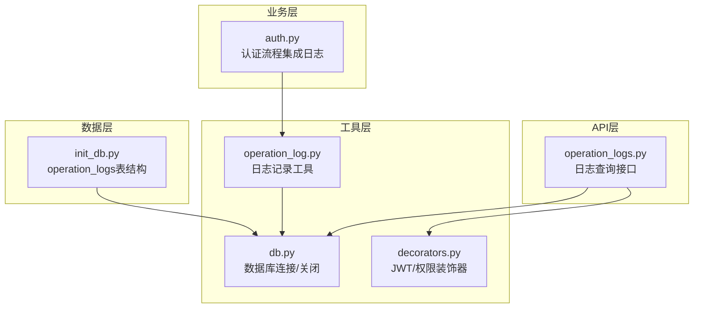
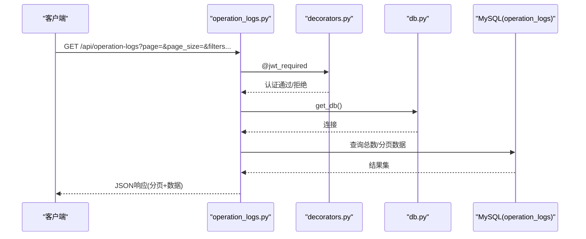
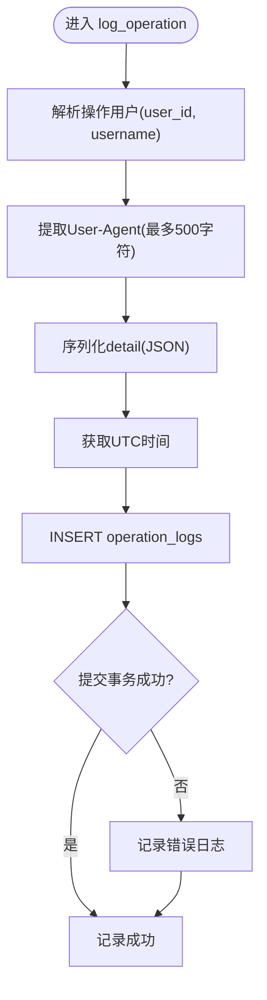
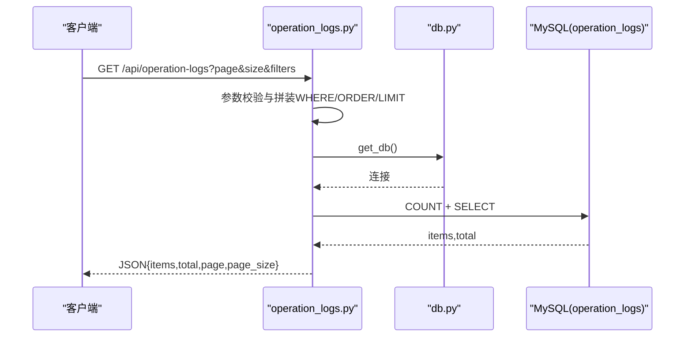
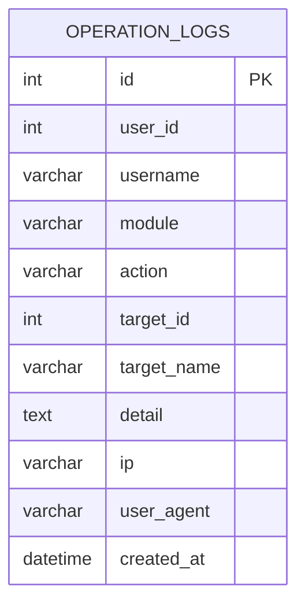
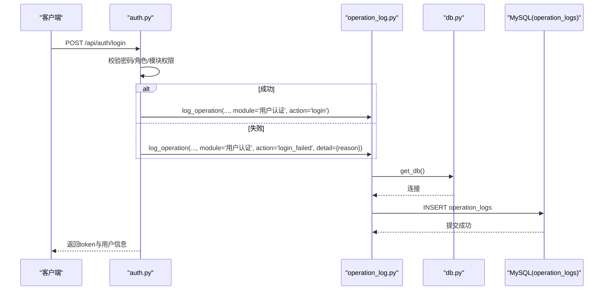
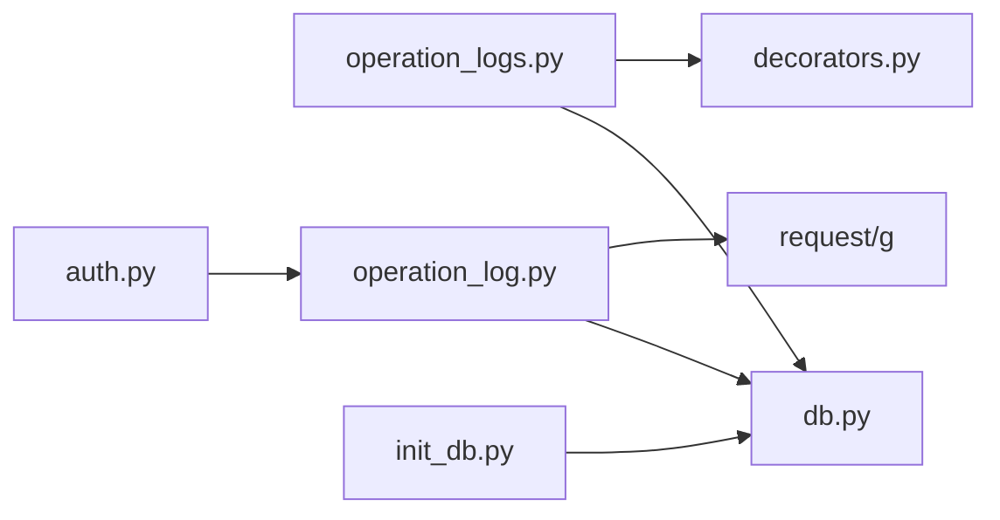

# 操作日志审计

<cite>
**本文引用的文件**
- [operation_logs.py](file://backend/app/api/operation_logs.py)
- [operation_log.py](file://backend/app/utils/operation_log.py)
- [db.py](file://backend/app/utils/db.py)
- [decorators.py](file://backend/app/utils/decorators.py)
- [auth.py](file://backend/app/api/auth.py)
- [init_db.py](file://backend/init_db.py)
- [config.py](file://backend/app/config.py)
- [user.py](file://backend/app/models/user.py)
</cite>

## 目录
1. [简介](#简介)
2. [项目结构](#项目结构)
3. [核心组件](#核心组件)
4. [架构总览](#架构总览)
5. [详细组件分析](#详细组件分析)
6. [依赖关系分析](#依赖关系分析)
7. [性能考量](#性能考量)
8. [故障排查指南](#故障排查指南)
9. [结论](#结论)
10. [附录](#附录)

## 简介
本文件面向OPS项目的操作日志审计需求，系统化梳理日志记录策略、数据采集机制、存储方案、查询与分析能力，并给出日志分类分级、安全保护、合规与性能优化建议及故障排查方法。内容基于后端Python Flask实现与数据库初始化脚本，确保与实际代码一致。

## 项目结构
围绕操作日志的关键文件组织如下：
- API层：提供日志查询接口，支持分页、多维筛选与动态模块/动作枚举。
- 工具层：封装日志记录工具，统一解析操作用户、IP、UA、时间戳与JSON详情。
- 数据层：数据库连接与关闭、索引与表结构定义。
- 权限层：JWT认证与权限装饰器，保障日志接口访问安全。
- 业务集成：在认证流程中自动记录登录/登出与失败事件。

图表来源
- [operation_logs.py:1-136](file://backend/app/api/operation_logs.py#L1-L136)
- [operation_log.py:1-173](file://backend/app/utils/operation_log.py#L1-L173)
- [db.py:1-80](file://backend/app/utils/db.py#L1-L80)
- [decorators.py:1-214](file://backend/app/utils/decorators.py#L1-L214)
- [auth.py:60-103](file://backend/app/api/auth.py#L60-L103)
- [init_db.py:240-259](file://backend/init_db.py#L240-L259)

章节来源
- [operation_logs.py:1-136](file://backend/app/api/operation_logs.py#L1-L136)
- [operation_log.py:1-173](file://backend/app/utils/operation_log.py#L1-L173)
- [db.py:1-80](file://backend/app/utils/db.py#L1-L80)
- [decorators.py:1-214](file://backend/app/utils/decorators.py#L1-L214)
- [auth.py:60-103](file://backend/app/api/auth.py#L60-L103)
- [init_db.py:240-259](file://backend/init_db.py#L240-L259)

## 核心组件
- 日志记录工具：负责解析操作用户、提取客户端IP与UA、序列化详情、写入数据库并提交事务。
- 日志查询API：提供分页查询、按模块/动作/用户名/日期范围筛选，以及模块与动作枚举接口。
- 数据库表结构：定义operation_logs表的字段、索引与注释，支撑高效检索与统计。
- 权限与安全：JWT认证装饰器确保只有认证用户可访问日志接口；日志记录工具对敏感字段做长度截断与安全序列化。
- 业务集成：在认证流程中记录登录/登出与失败事件，形成完整的用户行为审计链路。

章节来源
- [operation_log.py:49-119](file://backend/app/utils/operation_log.py#L49-L119)
- [operation_logs.py:20-99](file://backend/app/api/operation_logs.py#L20-L99)
- [init_db.py:240-259](file://backend/init_db.py#L240-L259)
- [decorators.py:26-123](file://backend/app/utils/decorators.py#L26-L123)
- [auth.py:66-73](file://backend/app/api/auth.py#L66-L73)

## 架构总览
操作日志系统由“业务触发—工具记录—数据库持久化—API查询—前端展示”构成闭环。业务模块在关键操作处调用日志工具，工具层统一解析上下文并写入operation_logs表；查询API提供安全可控的检索能力。

图表来源
- [operation_logs.py:20-99](file://backend/app/api/operation_logs.py#L20-L99)
- [decorators.py:26-123](file://backend/app/utils/decorators.py#L26-L123)
- [db.py:43-79](file://backend/app/utils/db.py#L43-L79)

## 详细组件分析

### 日志记录工具（operation_log.py）
- 操作用户解析：优先使用g.current_user或g上下文中的user_id/username，若缺失则回退为unknown。
- 客户端信息：从X-Forwarded-For或X-Real-IP取真实IP，否则回退到remote_addr；User-Agent截断至500字符。
- 详情序列化：detail为dict时JSON序列化，异常时降级处理；UTC时间写入created_at并与JWT时区保持一致。
- 写入与提交：插入operation_logs表后提交事务，异常时记录错误日志。

图表来源
- [operation_log.py:49-119](file://backend/app/utils/operation_log.py#L49-L119)

章节来源
- [operation_log.py:23-119](file://backend/app/utils/operation_log.py#L23-L119)

### 日志查询API（operation_logs.py）
- 分页与限制：page/page_size安全整数转换，最小1最大10000，单页最大200条。
- 筛选条件：module/action/username模糊匹配，start_date/end_date按日期比较。
- 统计与排序：先COUNT再LIMIT/OFFSET，按created_at倒序。
- 响应格式：统一JSON结构，包含items、total、page、page_size；日期字符串化。

图表来源
- [operation_logs.py:20-99](file://backend/app/api/operation_logs.py#L20-L99)
- [db.py:43-79](file://backend/app/utils/db.py#L43-L79)

章节来源
- [operation_logs.py:20-136](file://backend/app/api/operation_logs.py#L20-L136)

### 数据库表结构（init_db.py）
- 表名：operation_logs
- 关键字段：user_id、username、module、action、target_id、target_name、detail、ip、user_agent、created_at
- 索引：idx_user_id、idx_module、idx_action、idx_created_at，提升查询与统计效率
- 注释：字段具备中文注释，便于理解用途

图表来源
- [init_db.py:240-259](file://backend/init_db.py#L240-L259)

章节来源
- [init_db.py:240-259](file://backend/init_db.py#L240-L259)

### 权限与安全（decorators.py）
- JWT认证：校验Bearer Token、用户存在与启用状态、密码变更时间与签发时间对比，注入g.current_user。
- 接口保护：@jwt_required装饰operation_logs路由，确保只有认证用户可访问。
- 日志记录安全：对IP与UA长度截断，detail序列化降级处理，异常记录错误日志。

章节来源
- [decorators.py:26-123](file://backend/app/utils/decorators.py#L26-L123)
- [operation_log.py:13-119](file://backend/app/utils/operation_log.py#L13-L119)

### 业务集成（auth.py）
- 登录成功：记录module='用户认证', action='login'，同时写入target_id/username与操作用户信息。
- 登录失败：记录module='用户认证', action='login_failed'，detail包含失败原因。
- 登出：记录module='用户认证', action='logout'。

图表来源
- [auth.py:66-73](file://backend/app/api/auth.py#L66-L73)
- [operation_log.py:121-143](file://backend/app/utils/operation_log.py#L121-L143)
- [db.py:43-79](file://backend/app/utils/db.py#L43-L79)

章节来源
- [auth.py:66-73](file://backend/app/api/auth.py#L66-L73)
- [operation_log.py:121-143](file://backend/app/utils/operation_log.py#L121-L143)

## 依赖关系分析
- operation_logs.py依赖：
  - db.py：获取数据库连接与游标
  - decorators.py：JWT认证装饰器
- operation_log.py依赖：
  - db.py：获取数据库连接
  - request/g：获取请求头与上下文
- init_db.py定义operation_logs表结构，供operation_log.py写入与operation_logs.py查询使用
- auth.py在认证流程中调用operation_log.py记录登录/登出/失败事件

图表来源
- [operation_logs.py:4-9](file://backend/app/api/operation_logs.py#L4-L9)
- [operation_log.py:7-8](file://backend/app/utils/operation_log.py#L7-L8)
- [db.py:43-79](file://backend/app/utils/db.py#L43-L79)
- [auth.py:66-73](file://backend/app/api/auth.py#L66-L73)
- [init_db.py:240-259](file://backend/init_db.py#L240-L259)

章节来源
- [operation_logs.py:4-9](file://backend/app/api/operation_logs.py#L4-L9)
- [operation_log.py:7-8](file://backend/app/utils/operation_log.py#L7-L8)
- [db.py:43-79](file://backend/app/utils/db.py#L43-L79)
- [auth.py:66-73](file://backend/app/api/auth.py#L66-L73)
- [init_db.py:240-259](file://backend/init_db.py#L240-L259)

## 性能考量
- 查询性能
  - 已建立idx_user_id、idx_module、idx_action、idx_created_at索引，有利于按用户、模块、动作、时间范围检索。
  - 分页参数限制page(1~10000)与page_size(1~200)，避免超大偏移导致慢查询。
- 写入性能
  - 单条INSERT后立即commit，保证一致性；如需批量写入可考虑事务合并（需评估并发与锁竞争）。
- 字段长度与序列化
  - IP/UA/detail等字段截断与安全序列化，减少异常与存储膨胀风险。
- 数据库连接
  - Flask g上下文缓存连接，避免重复建立连接；异常时记录日志并抛出，便于定位问题。

章节来源
- [operation_logs.py:30-32](file://backend/app/api/operation_logs.py#L30-L32)
- [operation_logs.py:62-76](file://backend/app/api/operation_logs.py#L62-L76)
- [init_db.py:254-257](file://backend/init_db.py#L254-L257)
- [operation_log.py:13-119](file://backend/app/utils/operation_log.py#L13-L119)
- [db.py:43-79](file://backend/app/utils/db.py#L43-L79)

## 故障排查指南
- 数据库连接失败
  - 现象：日志出现连接异常与参数脱敏后的配置信息。
  - 排查：确认DB_HOST/DB_PORT/DB_USER/DB_PASSWORD/DB_NAME环境变量正确；检查MySQL服务状态与防火墙。
- 日志写入失败
  - 现象：记录日志失败错误日志。
  - 排查：检查operation_logs表结构、索引是否存在；确认数据库权限与连接超时设置。
- 查询异常
  - 现象：返回500与错误信息。
  - 排查：检查URL参数类型与范围；确认WHERE条件拼装与参数绑定；查看数据库慢查询。
- 权限拒绝
  - 现象：401/403。
  - 排查：确认Authorization头格式为Bearer token；检查用户状态与密码变更时间；确认模块权限。

章节来源
- [db.py:28-69](file://backend/app/utils/db.py#L28-L69)
- [operation_log.py:113-115](file://backend/app/utils/operation_log.py#L113-L115)
- [operation_logs.py:92-96](file://backend/app/api/operation_logs.py#L92-L96)
- [decorators.py:35-114](file://backend/app/utils/decorators.py#L35-L114)

## 结论
OPS项目已构建起完整、可审计的操作日志体系：统一的日志记录工具、完善的查询接口、明确的表结构与索引、严格的JWT权限控制，以及在认证流程中的关键事件记录。结合本文提供的查询与分析建议、安全保护措施、合规与性能优化策略，可满足日常运营审计与安全合规需求。

## 附录

### 日志内容结构与字段说明
- 用户信息：user_id、username
- 操作模块与类型：module、action
- 操作对象：target_id、target_name
- 详情：detail（JSON字符串）
- 网络信息：ip、user_agent
- 时间戳：created_at（UTC）

章节来源
- [init_db.py:240-259](file://backend/init_db.py#L240-L259)
- [operation_log.py:90-108](file://backend/app/utils/operation_log.py#L90-L108)

### 日志分类与分级管理
- 用户操作日志：用户认证、用户管理、资源管理等模块下的增删改查等常规操作。
- 系统管理日志：平台配置、角色授权、凭证管理等后台管理类操作。
- 安全事件日志：登录失败、异常访问、越权尝试等高风险事件。
- 建议：通过module/action维度进行分类统计，结合IP与UA进行异常行为识别。

章节来源
- [operation_log.py:146-172](file://backend/app/utils/operation_log.py#L146-L172)
- [auth.py:66-73](file://backend/app/api/auth.py#L66-L73)

### 日志查询与分析功能
- 搜索过滤：按module、action、username、start_date、end_date组合筛选。
- 统计分析：基于模块/动作/用户维度聚合统计，结合索引实现高效查询。
- 报表生成：前端可基于查询接口拉取数据，后端可扩展导出接口（建议在operation_logs.py基础上增加导出路由）。

章节来源
- [operation_logs.py:34-59](file://backend/app/api/operation_logs.py#L34-L59)
- [operation_logs.py:102-135](file://backend/app/api/operation_logs.py#L102-L135)

### 日志安全保护措施
- 完整性与防篡改：建议引入日志摘要或签名机制（如SHA-256摘要），并定期比对；当前实现未包含此功能。
- 访问控制：JWT认证与权限装饰器确保仅认证用户可访问日志接口。
- 数据脱敏：IP与UA长度截断，detail序列化降级处理，避免异常与溢出。
- 存储安全：数据库连接参数通过环境变量配置，避免硬编码；建议开启只读账号用于查询。

章节来源
- [decorators.py:26-123](file://backend/app/utils/decorators.py#L26-L123)
- [operation_log.py:13-119](file://backend/app/utils/operation_log.py#L13-L119)
- [config.py:12-20](file://backend/app/config.py#L12-L20)

### 日志保留策略与合规性
- 保留周期：建议根据法规要求设定（如1年、3年或5年），并定期清理过期日志。
- 合规性：确保日志不可抵赖、可追溯，满足审计要求；建议对敏感字段（如密码）进行屏蔽或去标识化。
- 备份与归档：定期备份operation_logs表，归档历史数据至冷存储。

章节来源
- [init_db.py:240-259](file://backend/init_db.py#L240-L259)

### 性能优化建议
- 索引优化：根据高频查询维度（如module、action、created_at）评估是否需要复合索引。
- 分页与缓存：对常用筛选组合结果进行短期缓存；避免超大页码与页大小。
- 异步写入：在高并发场景可考虑异步队列写入，降低主流程阻塞。
- 数据库参数：合理设置连接池、超时与字符集，确保UTF8MB4兼容emoji与特殊字符。

章节来源
- [operation_logs.py:30-32](file://backend/app/api/operation_logs.py#L30-L32)
- [init_db.py:254-257](file://backend/init_db.py#L254-L257)
- [db.py:49-58](file://backend/app/utils/db.py#L49-L58)