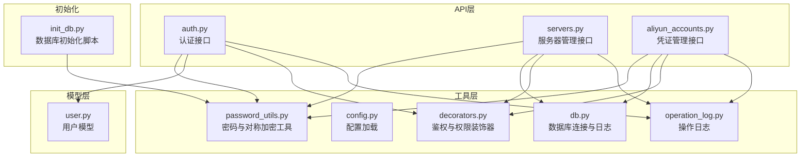
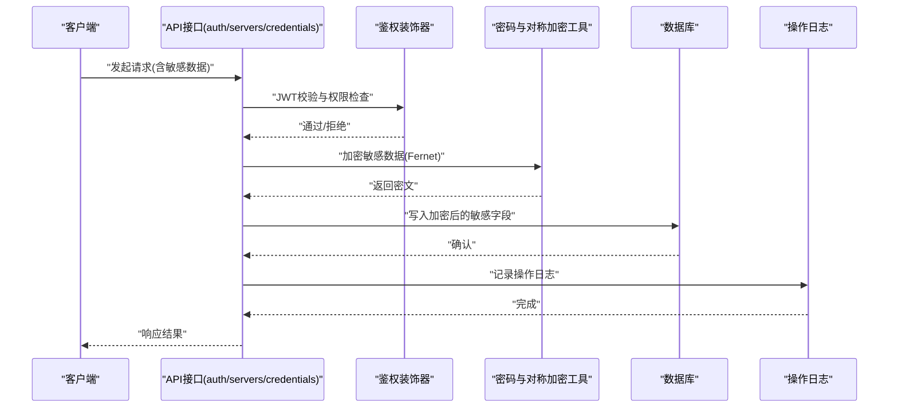
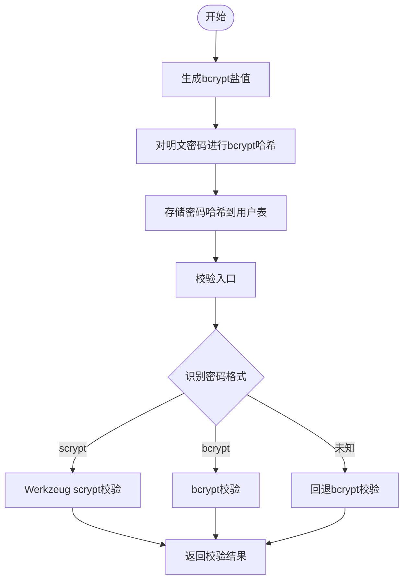
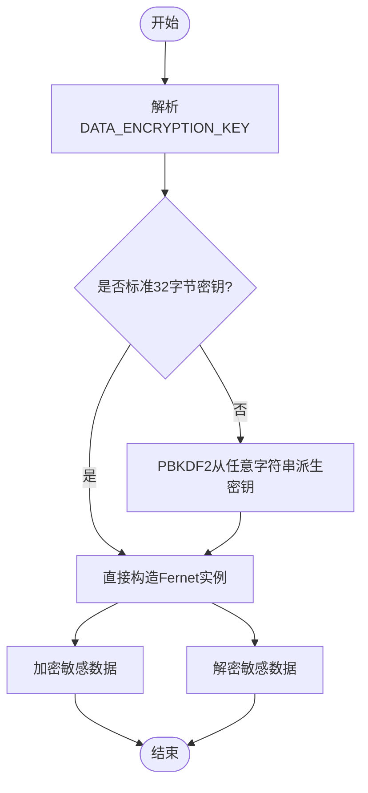
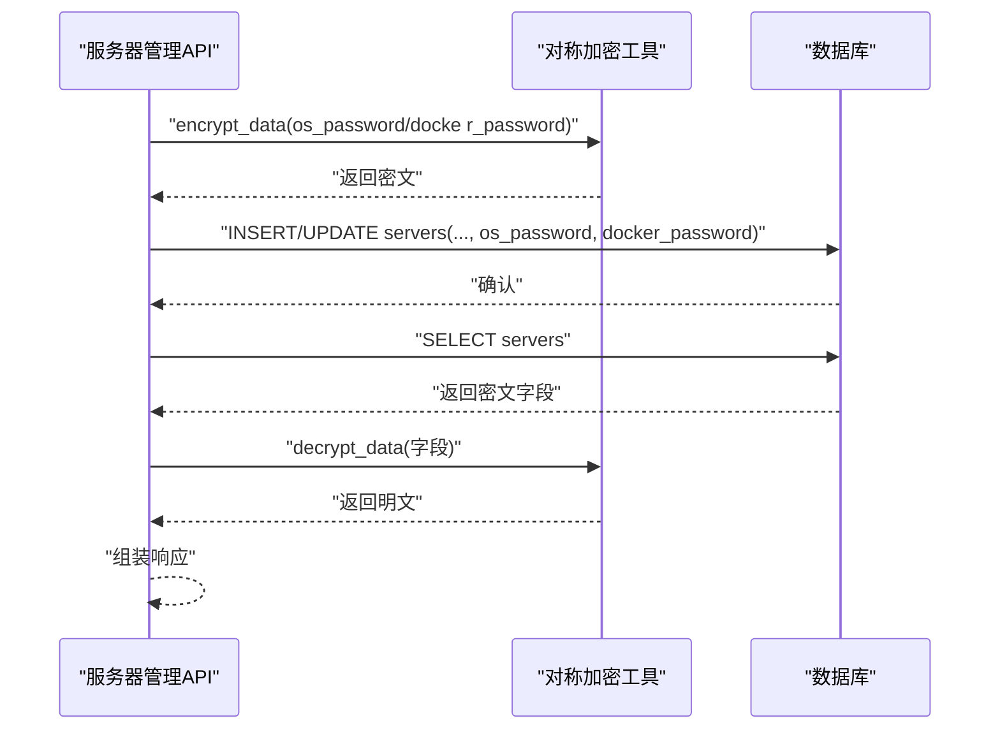
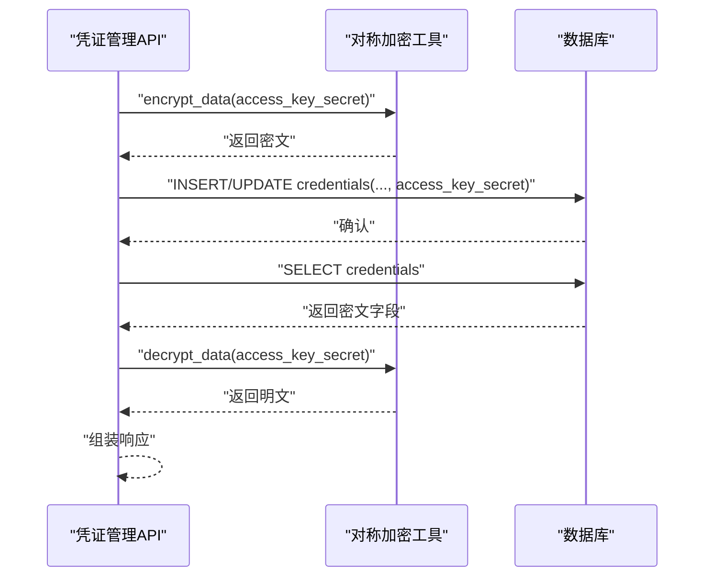
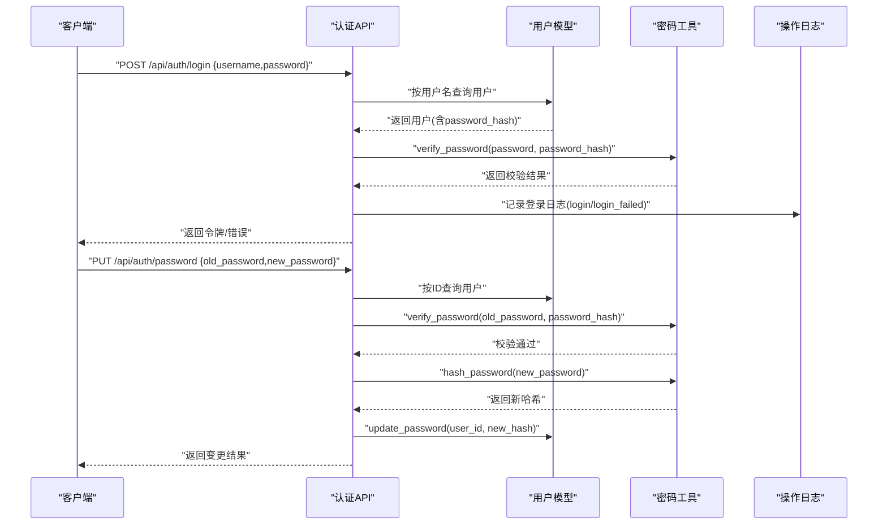
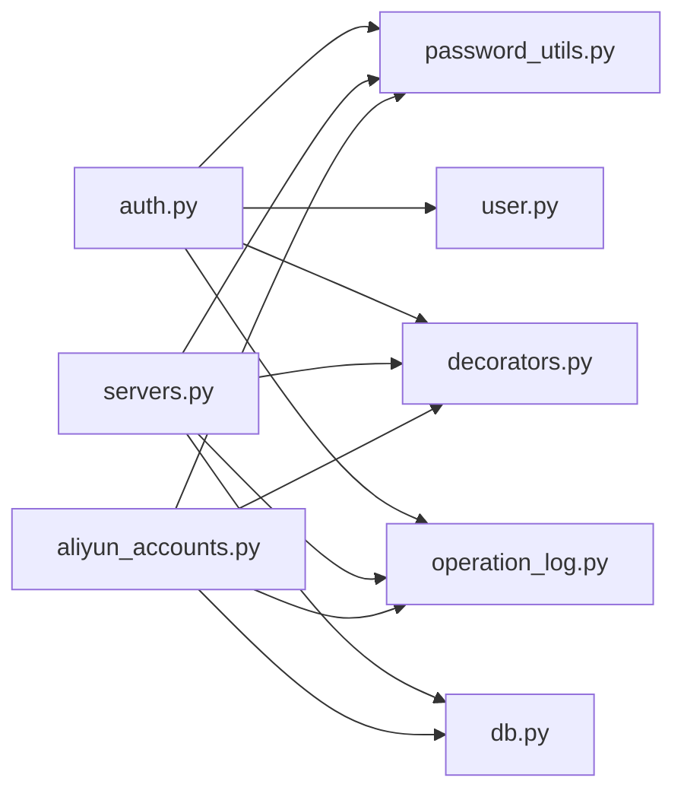

# 数据加密策略

<cite>
**本文引用的文件**
- [password_utils.py](file://backend/app/utils/password_utils.py)
- [config.py](file://backend/app/config.py)
- [aliyun_accounts.py](file://backend/app/api/aliyun_accounts.py)
- [servers.py](file://backend/app/api/servers.py)
- [auth.py](file://backend/app/api/auth.py)
- [user.py](file://backend/app/models/user.py)
- [db.py](file://backend/app/utils/db.py)
- [init_db.py](file://backend/init_db.py)
- [decorators.py](file://backend/app/utils/decorators.py)
- [operation_log.py](file://backend/app/utils/operation_log.py)
</cite>

## 目录
1. [简介](#简介)
2. [项目结构](#项目结构)
3. [核心组件](#核心组件)
4. [架构总览](#架构总览)
5. [详细组件分析](#详细组件分析)
6. [依赖分析](#依赖分析)
7. [性能考虑](#性能考虑)
8. [故障排查指南](#故障排查指南)
9. [结论](#结论)
10. [附录](#附录)

## 简介
本文件面向OPS项目，系统化阐述数据加密策略，涵盖以下方面：
- 密码加密机制：bcrypt算法使用、盐值生成、密码哈希与校验流程
- 对称加密策略：Fernet对称加密实现、密钥管理、PBKDF2密钥派生
- 敏感数据保护：服务器密码、阿里云AccessKey等敏感信息的加密存储与传输
- 环境差异：开发与生产环境的密钥配置与安全风险评估
- 使用示例：加密数据的典型调用链路与错误处理
- 性能优化：加密成本控制与最佳实践
- 运维策略：密钥轮换、加密数据迁移与安全审计要点

## 项目结构
围绕加密相关的关键文件分布如下：
- 工具层：密码与对称加密工具、数据库连接与日志
- API层：服务器与凭证管理接口，负责敏感数据的加解密与持久化
- 模型层：用户模型，负责密码哈希与更新
- 初始化脚本：数据库表结构定义，包含敏感字段设计

图表来源
- [password_utils.py:1-130](file://backend/app/utils/password_utils.py#L1-L130)
- [config.py:1-58](file://backend/app/config.py#L1-L58)
- [auth.py:1-197](file://backend/app/api/auth.py#L1-L197)
- [servers.py:1-578](file://backend/app/api/servers.py#L1-L578)
- [aliyun_accounts.py:1-275](file://backend/app/api/aliyun_accounts.py#L1-L275)
- [user.py:1-162](file://backend/app/models/user.py#L1-L162)
- [db.py:1-80](file://backend/app/utils/db.py#L1-L80)
- [decorators.py:1-163](file://backend/app/utils/decorators.py#L1-L163)
- [operation_log.py:1-172](file://backend/app/utils/operation_log.py#L1-L172)
- [init_db.py:1-395](file://backend/init_db.py#L1-L395)

章节来源
- [password_utils.py:1-130](file://backend/app/utils/password_utils.py#L1-L130)
- [config.py:1-58](file://backend/app/config.py#L1-L58)
- [auth.py:1-197](file://backend/app/api/auth.py#L1-L197)
- [servers.py:1-578](file://backend/app/api/servers.py#L1-L578)
- [aliyun_accounts.py:1-275](file://backend/app/api/aliyun_accounts.py#L1-L275)
- [user.py:1-162](file://backend/app/models/user.py#L1-L162)
- [db.py:1-80](file://backend/app/utils/db.py#L1-L80)
- [decorators.py:1-163](file://backend/app/utils/decorators.py#L1-L163)
- [operation_log.py:1-172](file://backend/app/utils/operation_log.py#L1-L172)
- [init_db.py:1-395](file://backend/init_db.py#L1-L395)

## 核心组件
- 密码加密与校验
  - 使用bcrypt生成盐值并进行哈希；兼容Werkzeug scrypt格式
  - 提供哈希生成与校验函数，保障用户密码不可逆存储与准确校验
- 对称加密与密钥管理
  - Fernet对称加密用于可解密的敏感数据存储
  - 支持标准32字节URL安全Base64密钥；若提供任意字符串，通过PBKDF2从固定盐派生
  - 开发环境支持回退密钥，但严禁用于生产
- 敏感数据保护
  - 服务器密码字段在入库前加密，在查询时解密返回
  - 阿里云AccessKey Secret在入库前加密，在查询时解密返回
- 环境差异与安全
  - 生产环境必须配置DATA_ENCRYPTION_KEY；开发环境可通过调试开关启用回退密钥
  - 登录与密码变更流程均基于密码哈希校验，避免明文泄露

章节来源
- [password_utils.py:52-130](file://backend/app/utils/password_utils.py#L52-L130)
- [auth.py:15-96](file://backend/app/api/auth.py#L15-L96)
- [user.py:143-162](file://backend/app/models/user.py#L143-L162)
- [servers.py:91-103](file://backend/app/api/servers.py#L91-L103)
- [aliyun_accounts.py:32-51](file://backend/app/api/aliyun_accounts.py#L32-L51)

## 架构总览
下图展示从API到工具再到数据库的加密数据流，以及鉴权与日志审计的交互。

图表来源
- [auth.py:15-96](file://backend/app/api/auth.py#L15-L96)
- [servers.py:323-346](file://backend/app/api/servers.py#L323-L346)
- [aliyun_accounts.py:96-111](file://backend/app/api/aliyun_accounts.py#L96-L111)
- [password_utils.py:93-130](file://backend/app/utils/password_utils.py#L93-L130)
- [operation_log.py:49-119](file://backend/app/utils/operation_log.py#L49-L119)

## 详细组件分析

### 组件A：密码加密与校验（bcrypt）
- 盐值生成：使用bcrypt生成高熵盐，确保相同明文产生不同哈希
- 哈希存储：将bcrypt哈希值存入用户表，长度上限满足数据库字段定义
- 校验流程：兼容bcrypt与Werkzeug scrypt格式，异常时返回失败
- 与用户模型协作：创建用户时生成哈希；修改密码时重新计算并更新

图表来源
- [password_utils.py:52-91](file://backend/app/utils/password_utils.py#L52-L91)
- [user.py:8-33](file://backend/app/models/user.py#L8-L33)

章节来源
- [password_utils.py:52-91](file://backend/app/utils/password_utils.py#L52-L91)
- [user.py:8-33](file://backend/app/models/user.py#L8-L33)
- [auth.py:131-197](file://backend/app/api/auth.py#L131-L197)

### 组件B：对称加密与密钥管理（Fernet）
- 密钥解析：优先读取DATA_ENCRYPTION_KEY；开发环境在调试开关开启时使用内置回退密钥
- 密钥形态：支持标准32字节URL安全Base64密钥；若输入非标准长度，则通过PBKDF2+固定盐派生
- 加解密：对称加密用于需要解密查看的敏感数据（服务器密码、AccessKey Secret）

图表来源
- [password_utils.py:18-49](file://backend/app/utils/password_utils.py#L18-L49)
- [password_utils.py:93-130](file://backend/app/utils/password_utils.py#L93-L130)

章节来源
- [password_utils.py:18-49](file://backend/app/utils/password_utils.py#L18-L49)
- [password_utils.py:93-130](file://backend/app/utils/password_utils.py#L93-L130)

### 组件C：服务器密码加密存储
- 入库加密：创建/更新服务器时，对系统密码与Docker密码进行加密后再入库
- 出库解密：查询列表与详情时，对敏感字段进行解密返回
- 异常处理：解密失败时保持原值，避免影响整体查询

图表来源
- [servers.py:323-346](file://backend/app/api/servers.py#L323-L346)
- [servers.py:91-103](file://backend/app/api/servers.py#L91-L103)
- [servers.py:134-144](file://backend/app/api/servers.py#L134-L144)
- [password_utils.py:93-130](file://backend/app/utils/password_utils.py#L93-L130)

章节来源
- [servers.py:91-103](file://backend/app/api/servers.py#L91-L103)
- [servers.py:134-144](file://backend/app/api/servers.py#L134-L144)
- [servers.py:323-346](file://backend/app/api/servers.py#L323-L346)
- [password_utils.py:93-130](file://backend/app/utils/password_utils.py#L93-L130)

### 组件D：阿里云AccessKey加密存储
- 入库加密：创建/更新凭证时，对AccessKey Secret进行加密后再入库
- 出库解密：列表查询时对AccessKey Secret进行解密返回
- 脱敏判断：更新接口支持传入脱敏值（包含星号）时不更新该字段，避免误覆盖

图表来源
- [aliyun_accounts.py:96-111](file://backend/app/api/aliyun_accounts.py#L96-L111)
- [aliyun_accounts.py:40-47](file://backend/app/api/aliyun_accounts.py#L40-L47)
- [aliyun_accounts.py:185-196](file://backend/app/api/aliyun_accounts.py#L185-L196)
- [password_utils.py:93-130](file://backend/app/utils/password_utils.py#L93-L130)

章节来源
- [aliyun_accounts.py:14-16](file://backend/app/api/aliyun_accounts.py#L14-L16)
- [aliyun_accounts.py:40-47](file://backend/app/api/aliyun_accounts.py#L40-L47)
- [aliyun_accounts.py:96-111](file://backend/app/api/aliyun_accounts.py#L96-L111)
- [aliyun_accounts.py:185-196](file://backend/app/api/aliyun_accounts.py#L185-L196)
- [password_utils.py:93-130](file://backend/app/utils/password_utils.py#L93-L130)

### 组件E：认证与密码变更流程
- 登录校验：根据用户表中的密码哈希进行校验，记录登录成功/失败日志
- 密码变更：旧密码校验通过后，重新计算哈希并更新

图表来源
- [auth.py:15-96](file://backend/app/api/auth.py#L15-L96)
- [auth.py:131-197](file://backend/app/api/auth.py#L131-L197)
- [user.py:143-162](file://backend/app/models/user.py#L143-L162)
- [operation_log.py:121-131](file://backend/app/utils/operation_log.py#L121-L131)
- [password_utils.py:52-91](file://backend/app/utils/password_utils.py#L52-L91)

章节来源
- [auth.py:15-96](file://backend/app/api/auth.py#L15-L96)
- [auth.py:131-197](file://backend/app/api/auth.py#L131-L197)
- [user.py:143-162](file://backend/app/models/user.py#L143-L162)
- [operation_log.py:121-131](file://backend/app/utils/operation_log.py#L121-L131)
- [password_utils.py:52-91](file://backend/app/utils/password_utils.py#L52-L91)

## 依赖分析
- 组件耦合
  - API层依赖工具层的加密与校验函数
  - API层依赖模型层的用户查询与更新
  - API层依赖装饰器进行JWT校验与权限控制
  - API层依赖操作日志工具记录审计事件
- 外部依赖
  - bcrypt：密码哈希与校验
  - cryptography.fernet/PBKDF2：对称加密与密钥派生
  - pymysql：数据库连接与事务
- 潜在循环依赖
  - 当前结构清晰，无明显循环依赖

图表来源
- [auth.py:1-197](file://backend/app/api/auth.py#L1-L197)
- [servers.py:1-578](file://backend/app/api/servers.py#L1-L578)
- [aliyun_accounts.py:1-275](file://backend/app/api/aliyun_accounts.py#L1-L275)
- [password_utils.py:1-130](file://backend/app/utils/password_utils.py#L1-L130)
- [user.py:1-162](file://backend/app/models/user.py#L1-L162)
- [db.py:1-80](file://backend/app/utils/db.py#L1-L80)
- [decorators.py:1-163](file://backend/app/utils/decorators.py#L1-L163)
- [operation_log.py:1-172](file://backend/app/utils/operation_log.py#L1-L172)

章节来源
- [auth.py:1-197](file://backend/app/api/auth.py#L1-L197)
- [servers.py:1-578](file://backend/app/api/servers.py#L1-L578)
- [aliyun_accounts.py:1-275](file://backend/app/api/aliyun_accounts.py#L1-L275)
- [password_utils.py:1-130](file://backend/app/utils/password_utils.py#L1-L130)
- [user.py:1-162](file://backend/app/models/user.py#L1-L162)
- [db.py:1-80](file://backend/app/utils/db.py#L1-L80)
- [decorators.py:1-163](file://backend/app/utils/decorators.py#L1-L163)
- [operation_log.py:1-172](file://backend/app/utils/operation_log.py#L1-L172)

## 性能考虑
- bcrypt成本控制
  - 建议在生产环境使用足够高的成本参数，平衡安全性与验证延迟
  - 可通过配置项调整成本（当前实现使用默认参数）
- Fernet加解密
  - 对称加密开销较低，适合频繁读写的敏感字段
  - 批量操作时注意避免重复构造Fernet实例，可复用同一实例
- 数据库I/O
  - 加密/解密发生在应用层，数据库仅存储密文，减少明文暴露风险
  - 建议对敏感字段建立索引，但需权衡性能与安全

## 故障排查指南
- 未设置DATA_ENCRYPTION_KEY
  - 现象：加密/解密报错，提示未配置密钥
  - 处理：生产环境必须设置DATA_ENCRYPTION_KEY；开发环境可开启调试开关使用内置回退密钥（不安全）
- 密钥格式错误
  - 现象：密钥长度或编码异常导致派生失败
  - 处理：确保使用32字节URL安全Base64密钥；若使用任意字符串，确认长度与编码正确
- 解密失败
  - 现象：查询敏感字段时报错或返回为空
  - 处理：检查密钥一致性与数据库中密文完整性；解密失败时保持原值，不影响业务流程
- 登录失败
  - 现象：用户名或密码错误；用户被禁用
  - 处理：检查用户状态与密码哈希；查看操作日志定位失败原因
- 数据库连接问题
  - 现象：连接超时或凭据错误
  - 处理：核对配置项与连接参数；启动时会打印脱敏密码，便于核对

章节来源
- [password_utils.py:18-29](file://backend/app/utils/password_utils.py#L18-L29)
- [password_utils.py:109-110](file://backend/app/utils/password_utils.py#L109-L110)
- [password_utils.py:128-129](file://backend/app/utils/password_utils.py#L128-L129)
- [auth.py:47-69](file://backend/app/api/auth.py#L47-L69)
- [db.py:28-40](file://backend/app/utils/db.py#L28-L40)

## 结论
OPS项目的加密策略以“不可逆哈希+对称加密”为核心：
- 用户密码采用bcrypt，确保不可逆存储与强抗碰撞能力
- 对称加密用于需要解密查看的敏感数据，支持标准密钥与PBKDF2派生
- 严格的环境区分与密钥管理，保障生产安全
- 完整的操作日志与权限控制，形成闭环的安全审计

## 附录

### 环境与密钥配置
- 生产环境
  - 必须设置DATA_ENCRYPTION_KEY（Fernet标准32字节URL安全Base64密钥）
  - JWT密钥与过期时间通过环境变量配置
- 开发环境
  - 可通过调试开关启用内置回退密钥（仅限开发，严禁生产使用）
  - CORS与调试模式通过环境变量控制

章节来源
- [password_utils.py:13-29](file://backend/app/utils/password_utils.py#L13-L29)
- [config.py:10-58](file://backend/app/config.py#L10-L58)

### 敏感数据字段与表结构
- 用户表：password_hash字段存储bcrypt哈希
- 服务器表：os_password、docker_password字段存储加密后的密码
- 凭证表：access_key_secret字段存储加密后的密钥

章节来源
- [init_db.py:35-47](file://backend/init_db.py#L35-L47)
- [init_db.py:50-76](file://backend/init_db.py#L50-L76)
- [init_db.py:290-303](file://backend/init_db.py#L290-L303)

### 使用示例（步骤说明）
- 服务器密码加密
  - 创建/更新服务器时，对os_password与docker_password调用加密函数
  - 查询时对相应字段调用解密函数
- 阿里云AccessKey加密
  - 创建/更新凭证时，对access_key_secret调用加密函数
  - 查询时对该字段调用解密函数
- 用户密码
  - 注册/修改密码时，使用哈希函数生成新哈希并更新

章节来源
- [servers.py:323-346](file://backend/app/api/servers.py#L323-L346)
- [servers.py:490-493](file://backend/app/api/servers.py#L490-L493)
- [aliyun_accounts.py:96-111](file://backend/app/api/aliyun_accounts.py#L96-L111)
- [auth.py:183-185](file://backend/app/api/auth.py#L183-L185)

### 错误处理机制
- 加密/解密异常：抛出明确错误信息，便于定位
- 登录失败：记录失败原因与用户信息，返回统一错误码
- 数据库异常：捕获连接与执行错误，记录日志并向上抛出

章节来源
- [password_utils.py:109-110](file://backend/app/utils/password_utils.py#L109-L110)
- [password_utils.py:128-129](file://backend/app/utils/password_utils.py#L128-L129)
- [auth.py:48-69](file://backend/app/api/auth.py#L48-L69)
- [db.py:48-68](file://backend/app/utils/db.py#L48-L68)

### 性能优化建议
- 合理设置bcrypt成本参数，兼顾安全与性能
- 对称加密批量处理时复用Fernet实例
- 对敏感字段建立必要索引，避免全表扫描

### 密钥轮换策略
- 生成新密钥并更新DATA_ENCRYPTION_KEY
- 使用新密钥重新加密历史数据（见“加密数据迁移方案”）
- 切换完成后，逐步清理旧密钥材料

### 加密数据迁移方案
- 读取数据库中所有敏感字段的密文
- 使用新密钥重新加密并写回
- 更新过程中保持服务可用，建议分批迁移并记录进度

### 安全审计要点
- 操作日志记录模块、动作、目标与详情
- 登录/登出、增删改、密码变更等关键事件必须审计
- 审计日志包含用户、IP、UA、时间戳等信息

章节来源
- [operation_log.py:49-119](file://backend/app/utils/operation_log.py#L49-L119)
- [auth.py:48-72](file://backend/app/api/auth.py#L48-L72)