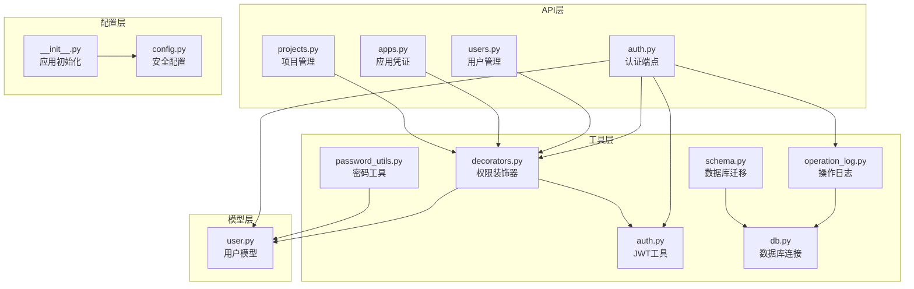
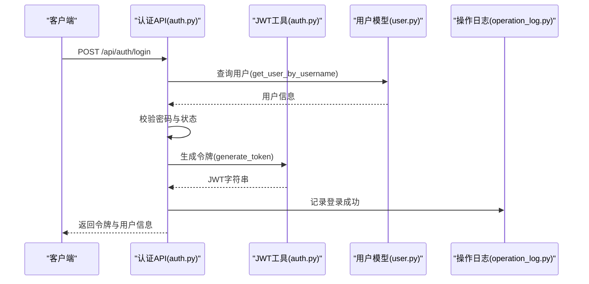
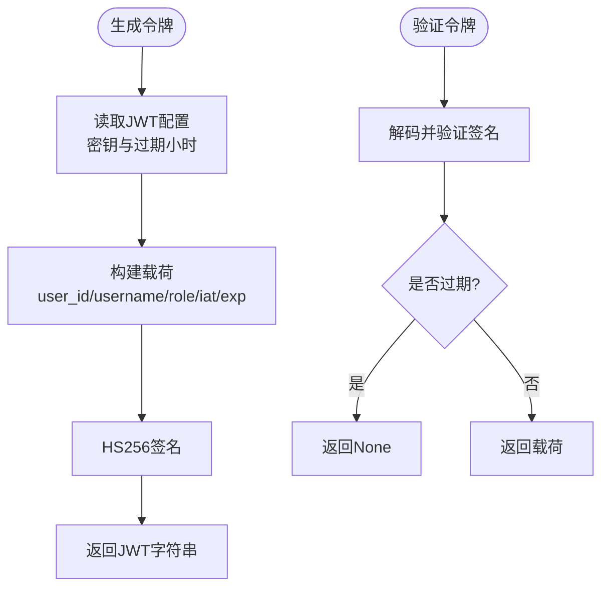
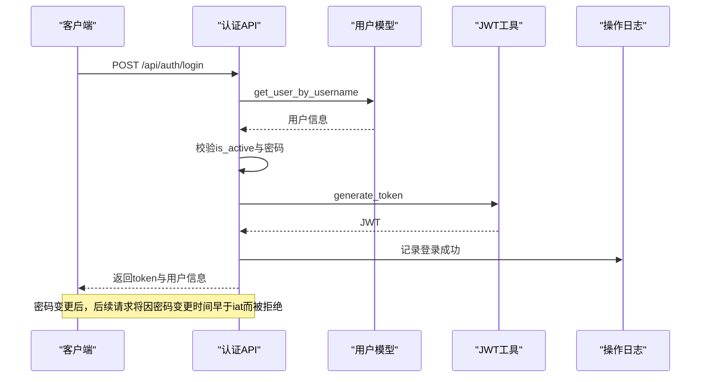
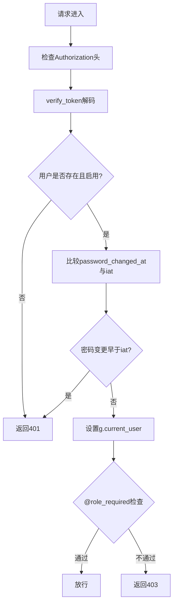
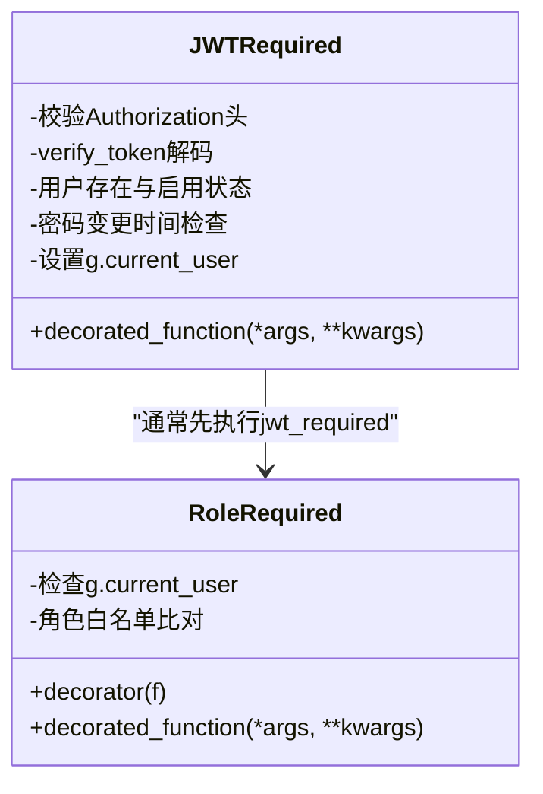
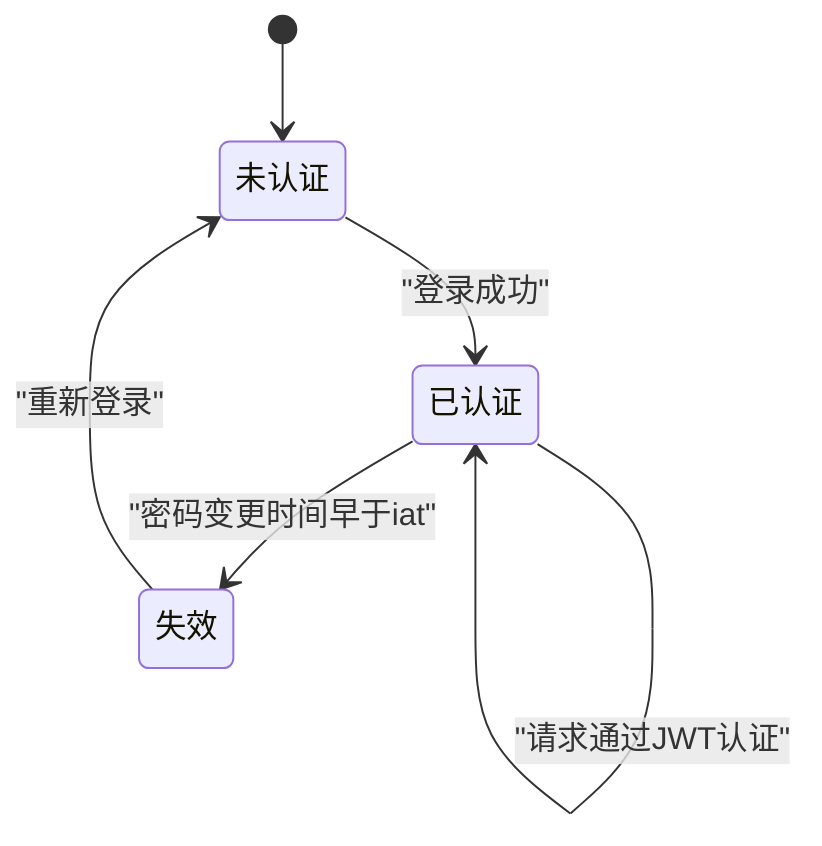
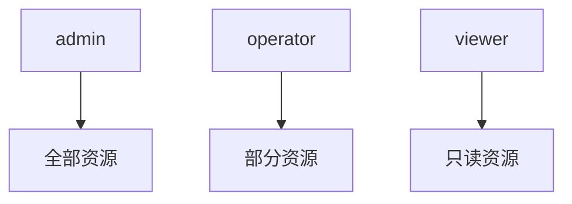
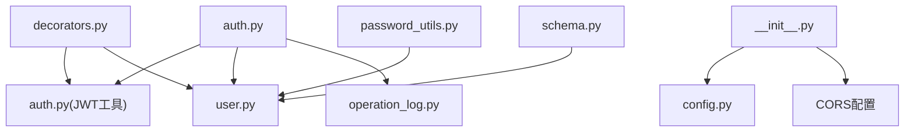

# 认证安全机制

<cite>
**本文档引用的文件**
- [backend/app/api/auth.py](file://backend/app/api/auth.py)
- [backend/app/utils/auth.py](file://backend/app/utils/auth.py)
- [backend/app/utils/decorators.py](file://backend/app/utils/decorators.py)
- [backend/app/models/user.py](file://backend/app/models/user.py)
- [backend/app/config.py](file://backend/app/config.py)
- [backend/app/utils/password_utils.py](file://backend/app/utils/password_utils.py)
- [backend/app/utils/operation_log.py](file://backend/app/utils/operation_log.py)
- [backend/app/utils/schema.py](file://backend/app/utils/schema.py)
- [backend/app/utils/db.py](file://backend/app/utils/db.py)
- [backend/app/__init__.py](file://backend/app/__init__.py)
</cite>

## 目录
1. [简介](#简介)
2. [项目结构](#项目结构)
3. [核心组件](#核心组件)
4. [架构总览](#架构总览)
5. [详细组件分析](#详细组件分析)
6. [依赖关系分析](#依赖关系分析)
7. [性能考虑](#性能考虑)
8. [故障排除指南](#故障排除指南)
9. [结论](#结论)
10. [附录](#附录)

## 简介
本文件系统性梳理OPS项目的认证安全机制，涵盖JWT令牌生成与验证、会话生命周期管理、基于角色的权限控制（RBAC）、认证装饰器实现、安全配置要点、常见攻击防护策略以及令牌泄露处理、多因素认证集成与安全审计日志等高级主题。文档面向不同技术背景读者，既提供高层概览也包含代码级细节与可视化图表。

## 项目结构
认证相关代码主要分布在以下模块：
- API层：认证端点与受保护资源接口
- 工具层：JWT工具、权限装饰器、密码工具、操作日志、数据库连接
- 模型层：用户数据访问与密码变更时间字段
- 配置层：JWT密钥、过期时间、CORS等安全相关配置

**图表来源**
- [backend/app/api/auth.py:1-197](file://backend/app/api/auth.py#L1-L197)
- [backend/app/utils/auth.py:1-45](file://backend/app/utils/auth.py#L1-L45)
- [backend/app/utils/decorators.py:1-163](file://backend/app/utils/decorators.py#L1-L163)
- [backend/app/models/user.py:1-162](file://backend/app/models/user.py#L1-L162)
- [backend/app/config.py:1-58](file://backend/app/config.py#L1-L58)
- [backend/app/utils/password_utils.py:1-130](file://backend/app/utils/password_utils.py#L1-L130)
- [backend/app/utils/operation_log.py:1-172](file://backend/app/utils/operation_log.py#L1-L172)
- [backend/app/utils/schema.py:1-42](file://backend/app/utils/schema.py#L1-L42)
- [backend/app/utils/db.py:1-80](file://backend/app/utils/db.py#L1-L80)
- [backend/app/__init__.py:1-149](file://backend/app/__init__.py#L1-L149)

**章节来源**
- [backend/app/api/auth.py:1-197](file://backend/app/api/auth.py#L1-L197)
- [backend/app/utils/auth.py:1-45](file://backend/app/utils/auth.py#L1-L45)
- [backend/app/utils/decorators.py:1-163](file://backend/app/utils/decorators.py#L1-L163)
- [backend/app/models/user.py:1-162](file://backend/app/models/user.py#L1-L162)
- [backend/app/config.py:1-58](file://backend/app/config.py#L1-L58)
- [backend/app/utils/password_utils.py:1-130](file://backend/app/utils/password_utils.py#L1-L130)
- [backend/app/utils/operation_log.py:1-172](file://backend/app/utils/operation_log.py#L1-L172)
- [backend/app/utils/schema.py:1-42](file://backend/app/utils/schema.py#L1-L42)
- [backend/app/utils/db.py:1-80](file://backend/app/utils/db.py#L1-L80)
- [backend/app/__init__.py:1-149](file://backend/app/__init__.py#L1-L149)

## 核心组件
- JWT工具：负责令牌生成与验证，包含过期时间与签名算法配置
- 权限装饰器：提供JWT认证与角色权限检查能力
- 用户模型：提供用户查询、密码更新与状态校验
- 密码工具：提供安全的密码哈希与对称加密能力
- 操作日志：记录认证与业务操作，支持审计追踪
- 数据库迁移：确保密码变更时间字段存在，支撑令牌失效策略

**章节来源**
- [backend/app/utils/auth.py:9-28](file://backend/app/utils/auth.py#L9-L28)
- [backend/app/utils/decorators.py:26-123](file://backend/app/utils/decorators.py#L26-L123)
- [backend/app/models/user.py:36-71](file://backend/app/models/user.py#L36-L71)
- [backend/app/utils/password_utils.py:52-91](file://backend/app/utils/password_utils.py#L52-L91)
- [backend/app/utils/operation_log.py:49-119](file://backend/app/utils/operation_log.py#L49-L119)
- [backend/app/utils/schema.py:10-41](file://backend/app/utils/schema.py#L10-L41)

## 架构总览
认证系统围绕“登录—令牌—装饰器—资源”的链路构建，关键安全特性包括：
- 令牌结构：包含用户标识、角色、签发时间与过期时间
- 签名算法：使用HS256对称签名
- 过期时间：可配置，默认按小时计算
- 会话生命周期：基于令牌有效期与密码变更时间强制失效
- 权限控制：基于角色的访问控制（RBAC）

**图表来源**
- [backend/app/api/auth.py:15-95](file://backend/app/api/auth.py#L15-L95)
- [backend/app/utils/auth.py:9-28](file://backend/app/utils/auth.py#L9-L28)
- [backend/app/models/user.py:36-52](file://backend/app/models/user.py#L36-L52)
- [backend/app/utils/operation_log.py:70-111](file://backend/app/utils/operation_log.py#L70-L111)

## 详细组件分析

### JWT令牌生成与验证
- 令牌生成：包含用户ID、用户名、角色、签发时间与过期时间，使用HS256签名
- 令牌验证：解码并校验签名，捕获过期与无效令牌异常
- 配置项：JWT密钥与过期小时数来自应用配置

**图表来源**
- [backend/app/utils/auth.py:9-28](file://backend/app/utils/auth.py#L9-L28)
- [backend/app/utils/auth.py:31-44](file://backend/app/utils/auth.py#L31-L44)

**章节来源**
- [backend/app/utils/auth.py:9-28](file://backend/app/utils/auth.py#L9-L28)
- [backend/app/utils/auth.py:31-44](file://backend/app/utils/auth.py#L31-L44)
- [backend/app/config.py:10-14](file://backend/app/config.py#L10-L14)

### 登录流程与会话生命周期
- 登录校验：用户名存在性、账户激活状态、密码验证
- 令牌发放：成功后生成JWT并记录登录成功日志
- 会话失效：若用户密码在令牌签发后发生变更，则令牌立即失效

**图表来源**
- [backend/app/api/auth.py:15-95](file://backend/app/api/auth.py#L15-L95)
- [backend/app/models/user.py:36-52](file://backend/app/models/user.py#L36-L52)
- [backend/app/utils/auth.py:9-28](file://backend/app/utils/auth.py#L9-L28)
- [backend/app/utils/operation_log.py:70-111](file://backend/app/utils/operation_log.py#L70-L111)

**章节来源**
- [backend/app/api/auth.py:15-95](file://backend/app/api/auth.py#L15-L95)
- [backend/app/models/user.py:36-52](file://backend/app/models/user.py#L36-L52)
- [backend/app/utils/operation_log.py:70-111](file://backend/app/utils/operation_log.py#L70-L111)

### 权限验证机制（RBAC）
- JWT认证装饰器：校验Authorization头格式、令牌有效性、用户存在与启用状态、密码变更时间
- 角色权限装饰器：基于g.current_user中的角色进行授权判断
- 授权顺序：@jwt_required需在@role_required之前使用

**图表来源**
- [backend/app/utils/decorators.py:26-123](file://backend/app/utils/decorators.py#L26-L123)
- [backend/app/utils/decorators.py:126-162](file://backend/app/utils/decorators.py#L126-L162)
- [backend/app/models/user.py:55-71](file://backend/app/models/user.py#L55-L71)

**章节来源**
- [backend/app/utils/decorators.py:26-123](file://backend/app/utils/decorators.py#L26-L123)
- [backend/app/utils/decorators.py:126-162](file://backend/app/utils/decorators.py#L126-L162)
- [backend/app/models/user.py:55-71](file://backend/app/models/user.py#L55-L71)

### 认证装饰器安全实现
- @jwt_required：严格校验Bearer令牌格式，解码后进行用户存在性、启用状态与密码变更时间检查
- @role_required：在已认证基础上，基于g.current_user.role进行角色授权
- 安全要点：避免直接信任前端传入的角色信息，始终以数据库为准

**图表来源**
- [backend/app/utils/decorators.py:26-123](file://backend/app/utils/decorators.py#L26-L123)
- [backend/app/utils/decorators.py:126-162](file://backend/app/utils/decorators.py#L126-L162)

**章节来源**
- [backend/app/utils/decorators.py:26-123](file://backend/app/utils/decorators.py#L26-L123)
- [backend/app/utils/decorators.py:126-162](file://backend/app/utils/decorators.py#L126-L162)

### 会话安全管理
- 会话创建：登录成功后发放JWT
- 会话维护：每次请求均通过装饰器进行认证与授权
- 会话销毁：系统未提供显式登出接口；可通过密码变更强制令牌失效
- 令牌失效：密码变更时间早于令牌签发时间即视为失效

**图表来源**
- [backend/app/utils/decorators.py:98-113](file://backend/app/utils/decorators.py#L98-L113)
- [backend/app/models/user.py:143-161](file://backend/app/models/user.py#L143-L161)

**章节来源**
- [backend/app/utils/decorators.py:98-113](file://backend/app/utils/decorators.py#L98-L113)
- [backend/app/models/user.py:143-161](file://backend/app/models/user.py#L143-L161)

### 权限模型与访问控制
- 角色定义：admin、operator、viewer
- 授权方式：@role_required装饰器进行角色白名单检查
- 接口保护：多数业务接口同时使用@jwt_required与@role_required

**图表来源**
- [backend/app/utils/decorators.py:126-162](file://backend/app/utils/decorators.py#L126-L162)
- [backend/app/api/users.py:20-32](file://backend/app/api/users.py#L20-L32)

**章节来源**
- [backend/app/utils/decorators.py:126-162](file://backend/app/utils/decorators.py#L126-L162)
- [backend/app/api/users.py:20-32](file://backend/app/api/users.py#L20-L32)

### 安全配置示例
- JWT密钥与过期时间：通过环境变量配置，生产环境必须设置
- CORS配置：支持凭据与指定源列表，避免通配符
- 数据库连接：连接参数从环境变量读取，启动时打印脱敏日志

**章节来源**
- [backend/app/config.py:10-58](file://backend/app/config.py#L10-L58)
- [backend/app/__init__.py:64-80](file://backend/app/__init__.py#L64-L80)
- [backend/app/utils/db.py:28-40](file://backend/app/utils/db.py#L28-L40)

### 常见攻击防护措施
- 令牌泄露：密码变更强制令牌失效，降低长期泄露风险
- 中间人攻击：建议在生产环境使用HTTPS，结合CORS限制源
- 点击劫持与CSRF：通过CORS凭据与源白名单减少跨域风险
- 异常处理：统一返回码与错误信息，避免泄露内部细节

**章节来源**
- [backend/app/utils/decorators.py:98-113](file://backend/app/utils/decorators.py#L98-L113)
- [backend/app/__init__.py:64-80](file://backend/app/__init__.py#L64-L80)

### 令牌泄露处理
- 立即处理：修改用户密码，触发password_changed_at，使旧令牌失效
- 监控告警：结合操作日志与审计，发现异常登录行为
- 客户端清理：引导用户清除本地存储的令牌

**章节来源**
- [backend/app/models/user.py:143-161](file://backend/app/models/user.py#L143-L161)
- [backend/app/utils/operation_log.py:49-119](file://backend/app/utils/operation_log.py#L49-L119)

### 多因素认证（MFA）集成建议
- 当前系统未实现MFA；建议在登录阶段增加二次验证（短信/邮件/硬件令牌）
- 可扩展点：在generate_token前增加MFA验证步骤，或引入临时短期令牌

[本节为概念性建议，无需代码来源]

### 安全审计日志
- 日志内容：模块、动作、目标、详情、IP、UA、时间
- 记录时机：登录成功/失败、业务操作
- 存储位置：数据库operation_logs表

**章节来源**
- [backend/app/utils/operation_log.py:49-119](file://backend/app/utils/operation_log.py#L49-L119)

## 依赖关系分析

**图表来源**
- [backend/app/api/auth.py:1-12](file://backend/app/api/auth.py#L1-L12)
- [backend/app/utils/auth.py:1-6](file://backend/app/utils/auth.py#L1-L6)
- [backend/app/utils/decorators.py:1-7](file://backend/app/utils/decorators.py#L1-L7)
- [backend/app/models/user.py:1-5](file://backend/app/models/user.py#L1-L5)
- [backend/app/utils/password_utils.py:1-11](file://backend/app/utils/password_utils.py#L1-L11)
- [backend/app/utils/operation_log.py:1-8](file://backend/app/utils/operation_log.py#L1-L8)
- [backend/app/utils/schema.py:1-12](file://backend/app/utils/schema.py#L1-L12)
- [backend/app/__init__.py:28-86](file://backend/app/__init__.py#L28-L86)
- [backend/app/config.py:10-58](file://backend/app/config.py#L10-L58)

**章节来源**
- [backend/app/api/auth.py:1-12](file://backend/app/api/auth.py#L1-L12)
- [backend/app/utils/auth.py:1-6](file://backend/app/utils/auth.py#L1-L6)
- [backend/app/utils/decorators.py:1-7](file://backend/app/utils/decorators.py#L1-L7)
- [backend/app/models/user.py:1-5](file://backend/app/models/user.py#L1-L5)
- [backend/app/utils/password_utils.py:1-11](file://backend/app/utils/password_utils.py#L1-L11)
- [backend/app/utils/operation_log.py:1-8](file://backend/app/utils/operation_log.py#L1-L8)
- [backend/app/utils/schema.py:1-12](file://backend/app/utils/schema.py#L1-L12)
- [backend/app/__init__.py:28-86](file://backend/app/__init__.py#L28-L86)
- [backend/app/config.py:10-58](file://backend/app/config.py#L10-L58)

## 性能考虑
- JWT验证开销：HS256解码与签名验证成本低，适合高并发场景
- 数据库查询：用户查询与密码变更时间比较均为单条记录查询，性能可控
- 缓存策略：可考虑在应用层缓存热点用户信息，减少重复查询
- 日志写入：操作日志异步化可降低阻塞风险

[本节提供通用指导，无需代码来源]

## 故障排除指南
- 401 缺少认证信息：检查Authorization头格式是否为Bearer token
- 401 Token无效或已过期：确认JWT_SECRET_KEY配置与过期时间设置
- 401 用户不存在或被禁用：检查用户状态与数据库一致性
- 403 权限不足：确认角色是否在@role_required白名单内
- 登录失败日志：通过operation_logs定位失败原因

**章节来源**
- [backend/app/utils/decorators.py:35-70](file://backend/app/utils/decorators.py#L35-L70)
- [backend/app/utils/auth.py:35-44](file://backend/app/utils/auth.py#L35-L44)
- [backend/app/utils/operation_log.py:49-119](file://backend/app/utils/operation_log.py#L49-L119)

## 结论
OPS项目的认证安全机制以JWT为核心，结合严格的权限装饰器与密码变更强制失效策略，形成完整的认证与授权闭环。通过环境变量驱动的安全配置、完善的操作日志与可扩展的MFA集成路径，系统在保证易用性的同时兼顾了安全性与可审计性。建议在生产环境中强化HTTPS与CORS策略，并持续完善审计与告警体系。

## 附录
- 令牌结构字段：user_id、username、role、iat、exp
- 签名算法：HS256
- 过期时间：小时级配置
- 角色集合：admin、operator、viewer
- 关键配置项：JWT_SECRET_KEY、JWT_EXPIRATION_HOURS、CORS_ORIGINS、CORS_ALLOW_ALL

[本节为汇总信息，无需代码来源]