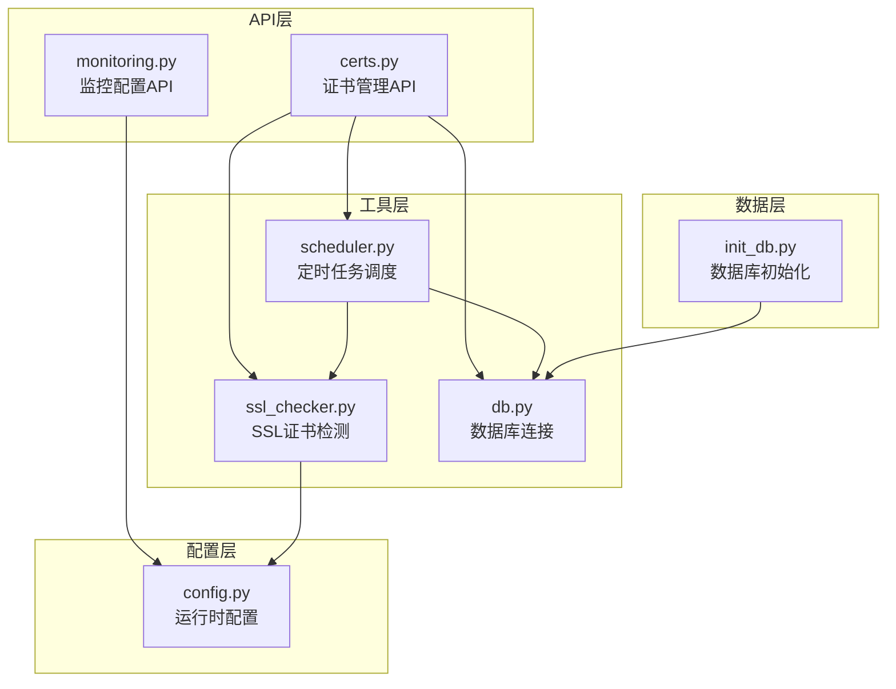
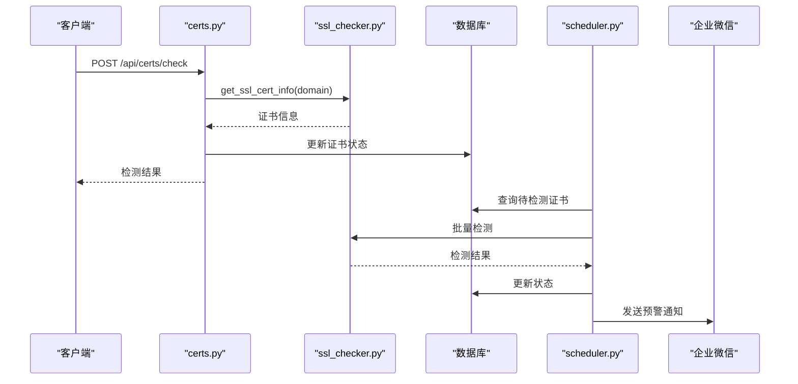
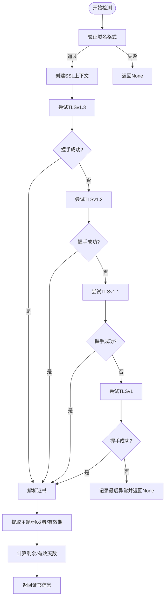
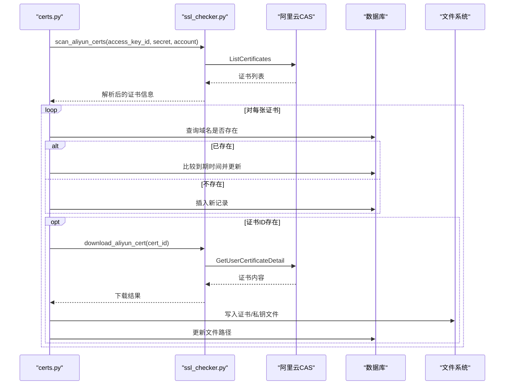
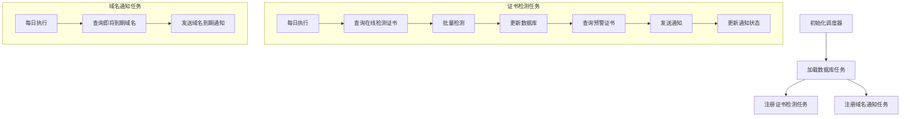
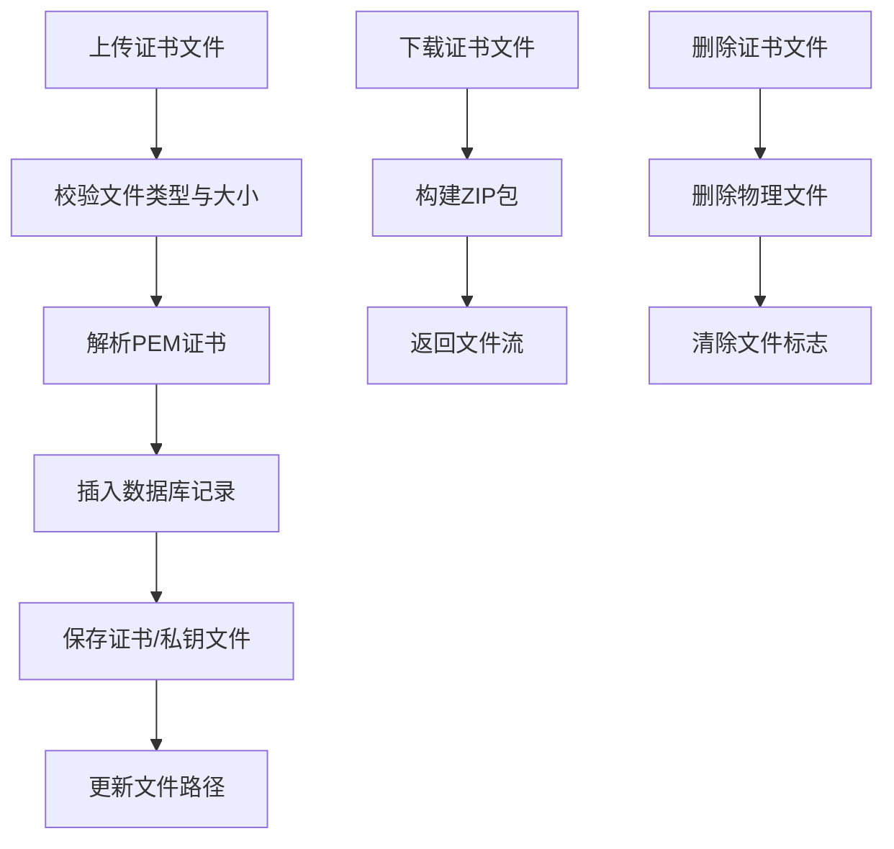
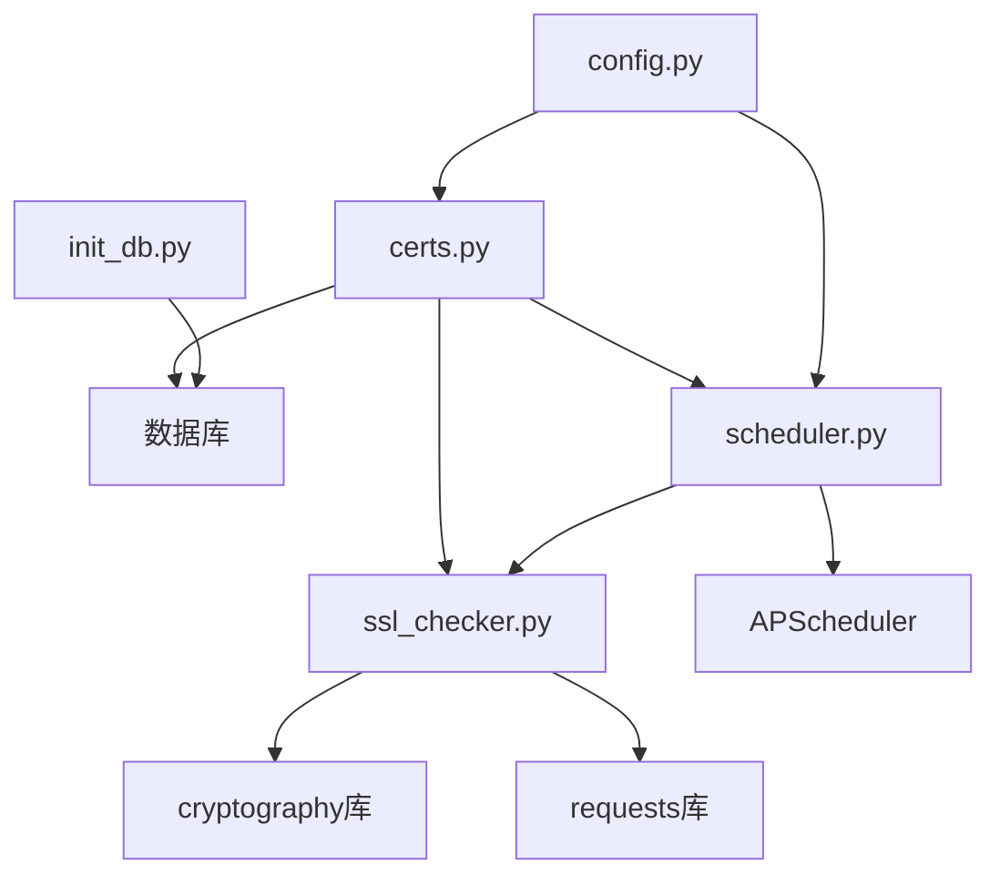

# SSL证书检查工具

<cite>
**本文档引用的文件**
- [ssl_checker.py](file://backend/app/utils/ssl_checker.py)
- [certs.py](file://backend/app/api/certs.py)
- [scheduler.py](file://backend/app/utils/scheduler.py)
- [config.py](file://backend/app/config.py)
- [db.py](file://backend/app/utils/db.py)
- [monitoring.py](file://backend/app/api/monitoring.py)
- [init_db.py](file://backend/init_db.py)
</cite>

## 目录
1. [简介](#简介)
2. [项目结构](#项目结构)
3. [核心组件](#核心组件)
4. [架构总览](#架构总览)
5. [详细组件分析](#详细组件分析)
6. [依赖关系分析](#依赖关系分析)
7. [性能考虑](#性能考虑)
8. [故障排除指南](#故障排除指南)
9. [结论](#结论)
10. [附录](#附录)

## 简介
本项目为OPS平台的SSL证书检查工具，提供在线证书检测、证书文件导入导出、阿里云证书同步、到期预警通知等功能。系统通过定时任务实现自动化的证书监控与告警，支持多种通知渠道（当前为企业微信），并提供完整的证书信息提取与解析能力，涵盖颁发者信息、有效期、公钥算法、指纹计算等关键字段。

## 项目结构
后端采用Flask微服务架构，主要模块如下：
- API层：提供REST接口，负责证书增删改查、批量检测、阿里云同步、通知触发等
- 工具层：封装SSL证书检测、阿里云SDK调用、定时任务调度、数据库连接等通用能力
- 配置层：集中管理运行时配置，包括数据库、通知、定时策略等
- 数据层：数据库初始化脚本，定义证书管理表结构及索引

**图表来源**
- [certs.py:1-1507](file://backend/app/api/certs.py#L1-L1507)
- [ssl_checker.py:1-613](file://backend/app/utils/ssl_checker.py#L1-L613)
- [scheduler.py:1-580](file://backend/app/utils/scheduler.py#L1-L580)
- [config.py:1-58](file://backend/app/config.py#L1-L58)
- [db.py:1-80](file://backend/app/utils/db.py#L1-L80)
- [init_db.py:360-431](file://backend/init_db.py#L360-L431)

**章节来源**
- [certs.py:1-1507](file://backend/app/api/certs.py#L1-L1507)
- [ssl_checker.py:1-613](file://backend/app/utils/ssl_checker.py#L1-L613)
- [scheduler.py:1-580](file://backend/app/utils/scheduler.py#L1-L580)
- [config.py:1-58](file://backend/app/config.py#L1-L58)
- [db.py:1-80](file://backend/app/utils/db.py#L1-L80)
- [init_db.py:360-431](file://backend/init_db.py#L360-L431)

## 核心组件
- SSL证书检测引擎：支持TLS版本降级、SNI、PEM/DER证书解析、域名格式校验
- 阿里云证书同步：扫描证书列表、下载证书文件、自动更新本地记录
- 定时任务调度：自动检测、到期预警、通知发送
- 证书文件管理：上传、存储、打包下载、路径安全控制
- 通知系统：企业微信Markdown通知，支持重试与状态跟踪

**章节来源**
- [ssl_checker.py:48-166](file://backend/app/utils/ssl_checker.py#L48-L166)
- [ssl_checker.py:169-302](file://backend/app/utils/ssl_checker.py#L169-L302)
- [ssl_checker.py:304-491](file://backend/app/utils/ssl_checker.py#L304-L491)
- [scheduler.py:391-580](file://backend/app/utils/scheduler.py#L391-L580)
- [certs.py:325-468](file://backend/app/api/certs.py#L325-L468)
- [certs.py:1205-1260](file://backend/app/api/certs.py#L1205-L1260)

## 架构总览
系统通过API层接收业务请求，工具层提供底层能力，配置层统一管理运行参数，数据层持久化证书与任务状态。定时任务在后台独立执行，避免阻塞主应用。

**图表来源**
- [certs.py:590-714](file://backend/app/api/certs.py#L590-L714)
- [ssl_checker.py:48-166](file://backend/app/utils/ssl_checker.py#L48-L166)
- [scheduler.py:391-580](file://backend/app/utils/scheduler.py#L391-L580)

## 详细组件分析

### SSL证书检测引擎
- 域名验证：支持通配符、子域名、国际化域名格式
- TLS握手：按TLSv1.3→TLSv1.2→TLSv1.1→TLSv1顺序降级，提升兼容性
- SNI支持：通过server_hostname参数确保多站点场景正确获取证书
- 证书解析：使用cryptography库解析PEM证书，提取主题、颁发者、有效期等
- 时间计算：自动计算剩余天数与有效天数，标记过期状态

**图表来源**
- [ssl_checker.py:37-166](file://backend/app/utils/ssl_checker.py#L37-L166)

**章节来源**
- [ssl_checker.py:37-166](file://backend/app/utils/ssl_checker.py#L37-L166)

### 阿里云证书同步
- 账号认证：通过credentials表获取AccessKey，解密后调用CAS API
- 证书扫描：ListCertificates查询，兼容snake_case与PascalCase字段
- 元数据更新：比较到期时间，仅在更晚时才更新
- 文件下载：GetUserCertificateDetail获取证书与私钥内容，自动保存至本地
- 状态追踪：记录同步统计、下载成功/失败计数

**图表来源**
- [certs.py:806-1043](file://backend/app/api/certs.py#L806-L1043)
- [ssl_checker.py:169-302](file://backend/app/utils/ssl_checker.py#L169-L302)
- [ssl_checker.py:494-613](file://backend/app/utils/ssl_checker.py#L494-L613)

**章节来源**
- [certs.py:806-1043](file://backend/app/api/certs.py#L806-L1043)
- [ssl_checker.py:169-302](file://backend/app/utils/ssl_checker.py#L169-L302)
- [ssl_checker.py:494-613](file://backend/app/utils/ssl_checker.py#L494-L613)

### 定时任务调度与预警
- 自动检测：按配置的Cron表达式定期检测cert_type=0的证书
- 预警阈值：根据SSL_WARNING_DAYS配置筛选即将到期证书
- 通知发送：通过send_wechat_notification发送Markdown通知
- 状态更新：记录通知时间与状态，避免重复发送
- 域名到期通知：独立任务监控域名到期情况

**图表来源**
- [scheduler.py:244-384](file://backend/app/utils/scheduler.py#L244-L384)
- [scheduler.py:391-580](file://backend/app/utils/scheduler.py#L391-L580)

**章节来源**
- [scheduler.py:244-384](file://backend/app/utils/scheduler.py#L244-L384)
- [scheduler.py:391-580](file://backend/app/utils/scheduler.py#L391-L580)

### 证书文件管理
- 上传解析：支持.pem/.crt/.cer证书与.key私钥，自动解析域名、SAN、颁发者、有效期
- 安全存储：基于证书ID建立独立目录，防止路径遍历攻击
- 批量下载：将证书与私钥打包为zip文件下载
- 文件清理：提供删除证书文件的接口

**图表来源**
- [certs.py:325-468](file://backend/app/api/certs.py#L325-L468)
- [certs.py:1205-1260](file://backend/app/api/certs.py#L1205-L1260)

**章节来源**
- [certs.py:325-468](file://backend/app/api/certs.py#L325-L468)
- [certs.py:1205-1260](file://backend/app/api/certs.py#L1205-L1260)

### 通知系统
- 企业微信通知：Markdown格式，包含统计信息与逐条明细
- 重试机制：支持最大重试次数配置，失败原因记录到日志
- 状态跟踪：记录通知时间与状态，避免重复发送
- 域名到期通知：独立的通知模板与阈值配置

**章节来源**
- [ssl_checker.py:304-491](file://backend/app/utils/ssl_checker.py#L304-L491)

## 依赖关系分析
- 组件耦合：API层依赖工具层的检测与调度能力；工具层依赖配置层的运行参数
- 外部依赖：cryptography用于证书解析，requests用于HTTP通信，阿里云SDK用于证书同步
- 数据依赖：数据库表ssl_certificates存储证书元数据与文件路径

**图表来源**
- [certs.py:1-1507](file://backend/app/api/certs.py#L1-L1507)
- [ssl_checker.py:1-613](file://backend/app/utils/ssl_checker.py#L1-L613)
- [scheduler.py:1-580](file://backend/app/utils/scheduler.py#L1-L580)
- [config.py:1-58](file://backend/app/config.py#L1-L58)
- [init_db.py:360-431](file://backend/init_db.py#L360-L431)

**章节来源**
- [certs.py:1-1507](file://backend/app/api/certs.py#L1-L1507)
- [ssl_checker.py:1-613](file://backend/app/utils/ssl_checker.py#L1-L613)
- [scheduler.py:1-580](file://backend/app/utils/scheduler.py#L1-L580)
- [config.py:1-58](file://backend/app/config.py#L1-L58)
- [init_db.py:360-431](file://backend/init_db.py#L360-L431)

## 性能考虑
- TLS降级策略：优先高版本TLS，失败再降级，平衡兼容性与安全性
- 连接复用：每次TLS版本尝试均新建socket，避免连接状态污染
- 批量处理：定时任务与API批量检测，减少重复网络开销
- 缓存策略：数据库查询使用索引，避免全表扫描
- 超时控制：统一的SSL检测超时配置，防止长时间阻塞

## 故障排除指南
- SSL检测失败
  - 检查域名格式与DNS解析
  - 查看TLS版本降级日志，确认网络连通性
  - 验证防火墙与代理设置
- 阿里云同步异常
  - 确认AccessKey权限与密钥解密配置
  - 检查CAS API返回状态码与响应结构
  - 查看证书ID与证书详情接口调用日志
- 通知发送失败
  - 检查企业微信Webhook配置
  - 查看重试日志与最终失败原因
  - 验证网络访问与HTTPS证书
- 数据库连接问题
  - 核对DB_HOST/PORT/USER/PASSWORD配置
  - 检查数据库服务状态与网络连通性
  - 查看连接超时与错误日志

**章节来源**
- [ssl_checker.py:147-166](file://backend/app/utils/ssl_checker.py#L147-L166)
- [ssl_checker.py:298-302](file://backend/app/utils/ssl_checker.py#L298-L302)
- [scheduler.py:526-533](file://backend/app/utils/scheduler.py#L526-L533)
- [db.py:43-80](file://backend/app/utils/db.py#L43-L80)

## 结论
该SSL证书检查工具提供了完整的证书生命周期管理能力，包括在线检测、文件导入导出、阿里云同步与自动化预警。通过模块化设计与完善的错误处理机制，系统具备良好的可维护性与扩展性。建议在生产环境中结合监控与告警体系，持续优化检测频率与通知策略。

## 附录

### 配置项说明
- WECHAT_WEBHOOK_URL：企业微信通知Webhook地址
- SSL_CHECK_TIMEOUT：SSL检测超时时间（秒）
- SSL_WARNING_DAYS：SSL预警阈值（天）
- DOMAIN_WARNING_DAYS：域名预警阈值（天）
- CERT_AUTO_CHECK_CRON：证书自动检测Cron表达式
- DOMAIN_AUTO_NOTIFY_CRON：域名到期通知Cron表达式
- CERT_FILES_DIR：证书文件存储根目录

**章节来源**
- [config.py:40-53](file://backend/app/config.py#L40-L53)

### 数据库表结构
- ssl_certificates：证书管理主表，包含域名、类型、颁发者、有效期、状态、文件路径等字段
- 索引：domain、cert_type、cert_expire_time、status

**章节来源**
- [init_db.py:364-393](file://backend/init_db.py#L364-L393)