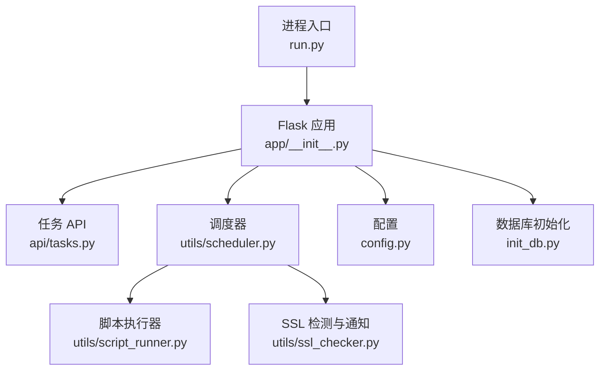
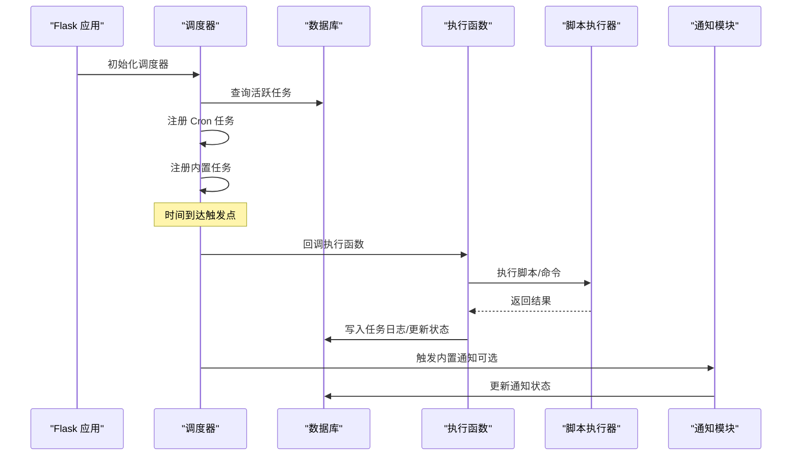
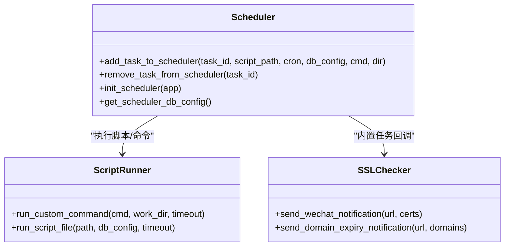
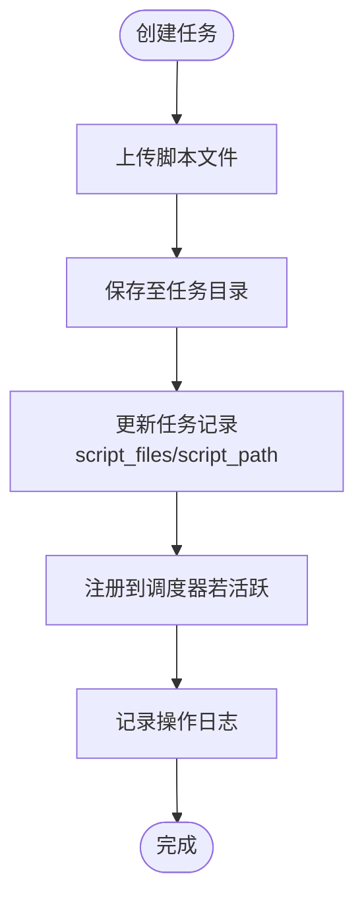
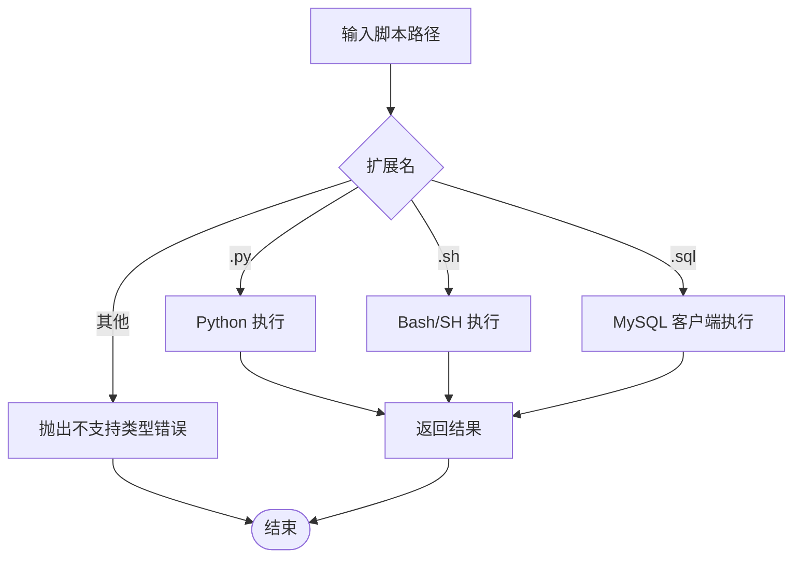
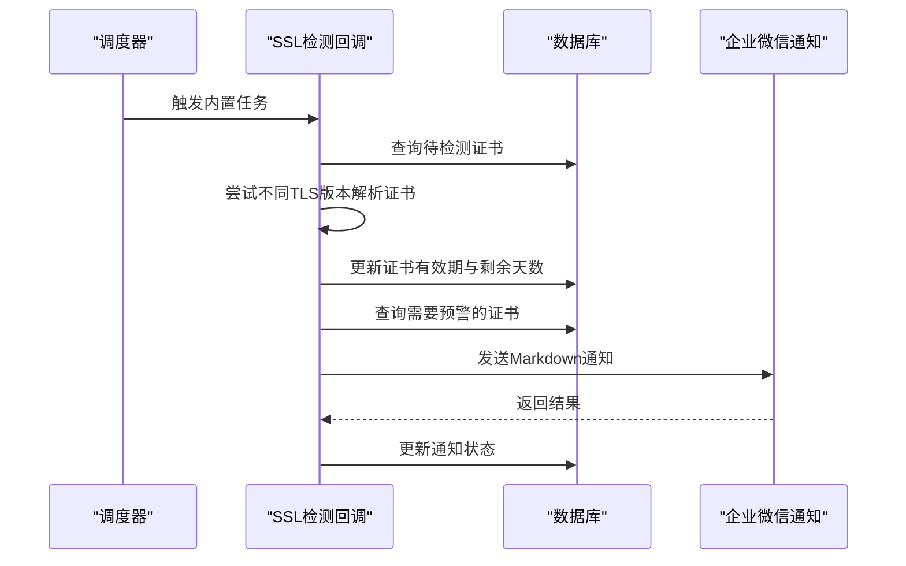
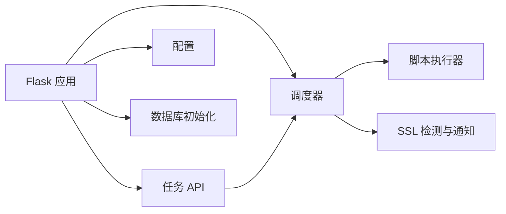
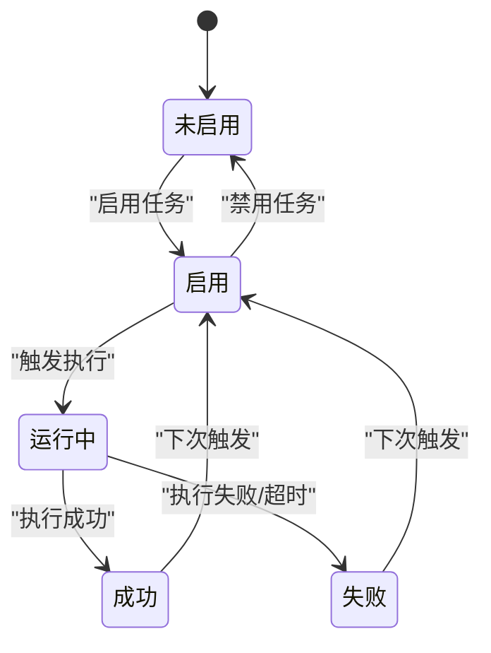

# 任务调度工具

<cite>
**本文引用的文件**
- [scheduler.py](file://backend/app/utils/scheduler.py)
- [tasks.py](file://backend/app/api/tasks.py)
- [config.py](file://backend/app/config.py)
- [script_runner.py](file://backend/app/utils/script_runner.py)
- [ssl_checker.py](file://backend/app/utils/ssl_checker.py)
- [__init__.py](file://backend/app/__init__.py)
- [run.py](file://backend/run.py)
- [requirements.txt](file://backend/requirements.txt)
- [init_db.py](file://backend/init_db.py)
</cite>

## 目录
1. [简介](#简介)
2. [项目结构](#项目结构)
3. [核心组件](#核心组件)
4. [架构总览](#架构总览)
5. [详细组件分析](#详细组件分析)
6. [依赖关系分析](#依赖关系分析)
7. [性能考量](#性能考量)
8. [故障排除指南](#故障排除指南)
9. [结论](#结论)
10. [附录](#附录)

## 简介
本技术文档面向 OPS 项目的任务调度工具，系统性阐述基于 APscheduler 的定时任务框架集成与配置，覆盖任务注册、调度策略、执行计划管理、任务创建与管理（Cron 表达式、间隔调度、一次性任务）、任务执行监控与异常处理、任务持久化与重启恢复机制，并提供任务定义示例、调度配置、性能调优与故障排除建议。读者无需深入编程背景即可理解与使用。

## 项目结构
- 后端采用 Flask 应用，通过蓝图组织 API，调度器作为应用启动时初始化的后台组件。
- 任务调度核心位于 utils/scheduler.py，负责：
  - 从数据库加载活跃任务并注册到 APscheduler
  - 维护内置任务（SSL 证书检测、域名到期通知）
  - 任务执行过程中的日志记录与状态更新
- API 层位于 api/tasks.py，提供任务的增删改查、启停、手动执行与日志查询。
- 配置位于 config.py，包含数据库、上传目录、Webhook、Cron 默认值等。
- 脚本执行器位于 utils/script_runner.py，支持 .py/.sh/.sql 三类脚本的执行与超时控制。
- SSL 证书检测与通知位于 utils/ssl_checker.py，为内置任务提供能力。
- 应用入口与初始化位于 app/__init__.py 与 run.py，负责应用装配与调度器初始化。

图表来源
- [__init__.py:108-111](file://backend/app/__init__.py#L108-L111)
- [tasks.py:11-16](file://backend/app/api/tasks.py#L11-L16)
- [scheduler.py:18,244-384](file://backend/app/utils/scheduler.py#L18,L244-L384)
- [script_runner.py:19-116](file://backend/app/utils/script_runner.py#L19-L116)
- [ssl_checker.py:304-491](file://backend/app/utils/ssl_checker.py#L304-L491)
- [config.py:16-48](file://backend/app/config.py#L16-L48)
- [init_db.py:191-236](file://backend/init_db.py#L191-L236)
- [run.py:1-8](file://backend/run.py#L1-L8)

章节来源
- [__init__.py:28-114](file://backend/app/__init__.py#L28-L114)
- [run.py:1-8](file://backend/run.py#L1-L8)

## 核心组件
- 调度器（BackgroundScheduler）：全局实例，负责任务注册、移除、启动与内置任务注册。
- 任务 API：提供任务 CRUD、启停、手动执行、日志查询。
- 脚本执行器：根据扩展名选择执行器，统一超时控制与错误处理。
- SSL 检测与通知：内置任务依赖的能力，支持 TLS 降级、企业微信通知。
- 配置中心：集中管理数据库、上传目录、Cron 默认值、通知阈值等。
- 数据模型：scheduled_tasks 与 task_logs 两张表，支撑任务定义与执行日志持久化。

章节来源
- [scheduler.py:18,244-384](file://backend/app/utils/scheduler.py#L18,L244-L384)
- [tasks.py:11-16,144-255](file://backend/app/api/tasks.py#L11-L16,L144-L255)
- [script_runner.py:19-116](file://backend/app/utils/script_runner.py#L19-L116)
- [ssl_checker.py:304-491](file://backend/app/utils/ssl_checker.py#L304-L491)
- [config.py:16-48](file://backend/app/config.py#L16-L48)
- [init_db.py:191-236](file://backend/init_db.py#L191-L236)

## 架构总览
调度器在应用启动时初始化，从数据库加载活跃任务并注册到 APscheduler；同时注册内置任务（SSL 证书自动检测+通知、域名到期自动通知）。任务执行时，调度器回调执行函数，该函数在独立线程中执行脚本或命令，捕获输出与异常，写入数据库日志并更新任务状态。API 层负责任务生命周期管理与手动执行。

图表来源
- [__init__.py:108-111](file://backend/app/__init__.py#L108-L111)
- [scheduler.py:244-384](file://backend/app/utils/scheduler.py#L244-L384)
- [scheduler.py:391-580](file://backend/app/utils/scheduler.py#L391-L580)
- [tasks.py:498-631](file://backend/app/api/tasks.py#L498-L631)
- [script_runner.py:19-116](file://backend/app/utils/script_runner.py#L19-L116)

## 详细组件分析

### 调度器组件（APScheduler 集成）
- 全局调度器实例与数据库配置提取
- 任务注册与移除
  - add_task_to_scheduler：解析 Cron 表达式，创建 CronTrigger，注册任务，支持替换同名任务。
  - remove_task_from_scheduler：按任务 ID 移除。
- 初始化与内置任务
  - init_scheduler：从数据库加载活跃任务，判断新旧两种执行模式（自定义命令+多文件目录 vs 单文件），注册到调度器；同时注册内置 SSL 证书检测与域名到期通知任务。
  - 内置任务使用 CronTrigger，回调函数在独立线程中执行，不依赖 Flask 上下文。
- 任务执行流程
  - execute_script：在独立线程中执行，创建任务日志、更新任务最后运行时间、执行脚本或命令、捕获异常、更新日志与任务状态；支持超时处理。
- 数据持久化
  - 任务日志表 task_logs 与任务表 scheduled_tasks，记录状态、输出、错误、触发来源等。

图表来源
- [scheduler.py:18,181-242,244-384](file://backend/app/utils/scheduler.py#L18,L181-L242,L244-L384)
- [script_runner.py:19-116](file://backend/app/utils/script_runner.py#L19-L116)
- [ssl_checker.py:304-491](file://backend/app/utils/ssl_checker.py#L304-L491)

章节来源
- [scheduler.py:18,181-242,244-384](file://backend/app/utils/scheduler.py#L18,L181-L242,L244-L384)

### 任务 API 组件（任务创建与管理）
- 任务迁移：确保 scheduled_tasks 表具备 execute_command、script_files、last_status、last_output 等字段。
- 任务 CRUD
  - GET /api/tasks：查询任务列表，解析 script_files JSON。
  - POST /api/tasks：创建任务，支持多文件上传，保存到任务目录，更新任务记录，必要时添加到调度器。
  - PUT /api/tasks/<id>：更新任务，支持新增/删除文件、更新 Cron、更新自定义命令，必要时重新注册到调度器。
  - DELETE /api/tasks/<id>：删除任务，移除调度器任务、删除任务目录与日志。
  - POST /api/tasks/<id>/toggle：启用/禁用任务，动态注册/移除。
  - POST /api/tasks/<id>/run：手动执行任务，创建日志记录，独立线程执行，更新状态与输出。
  - GET /api/tasks/<id>/logs：查询任务最近 50 条日志。
- 权限控制：基于 JWT 与角色（admin/operator）。

图表来源
- [tasks.py:144-255](file://backend/app/api/tasks.py#L144-L255)
- [tasks.py:257-376](file://backend/app/api/tasks.py#L257-L376)
- [tasks.py:378-433](file://backend/app/api/tasks.py#L378-L433)
- [tasks.py:435-496](file://backend/app/api/tasks.py#L435-L496)
- [tasks.py:498-631](file://backend/app/api/tasks.py#L498-L631)

章节来源
- [tasks.py:144-255,257-376,378-433,435-496,498-631:144-631](file://backend/app/api/tasks.py#L144-L631)

### 脚本执行器组件（多类型脚本支持）
- 扩展名识别与执行
  - .py：使用 Python 可执行文件执行。
  - .sh：优先 bash，其次 sh，否则报错。
  - .sql：使用 mysql 客户端，通过环境变量传入密码，stdin 传入 SQL。
- 超时控制：统一超时参数（默认 300 秒）。
- 错误处理：捕获 FileNotFoundError、RuntimeError、ValueError 等，保证执行器健壮性。

图表来源
- [script_runner.py:19-116](file://backend/app/utils/script_runner.py#L19-L116)

章节来源
- [script_runner.py:19-116](file://backend/app/utils/script_runner.py#L19-L116)

### 内置任务与通知组件
- SSL 证书自动检测与通知
  - 自动检测：遍历在线检测类型的证书域名，尝试不同 TLS 版本，解析证书有效期，更新数据库。
  - 预警通知：根据剩余天数分级，通过企业微信机器人发送 Markdown 通知，支持重试。
- 域名到期自动通知
  - 查询即将过期或已过期域名，按阈值分级，发送通知并更新通知状态。
- 配置项：WECHAT_WEBHOOK_URL、SSL_CHECK_TIMEOUT、SSL_WARNING_DAYS、DOMAIN_WARNING_DAYS、CERT_AUTO_CHECK_CRON、DOMAIN_AUTO_NOTIFY_CRON。

图表来源
- [scheduler.py:391-580](file://backend/app/utils/scheduler.py#L391-L580)
- [ssl_checker.py:304-491](file://backend/app/utils/ssl_checker.py#L304-L491)

章节来源
- [scheduler.py:391-580](file://backend/app/utils/scheduler.py#L391-L580)
- [ssl_checker.py:304-491](file://backend/app/utils/ssl_checker.py#L304-L491)

### 配置与数据库模型
- 配置项
  - 数据库：DB_HOST、DB_PORT、DB_USER、DB_PASSWORD、DB_NAME
  - 上传目录：UPLOAD_FOLDER
  - 通知与检测：WECHAT_WEBHOOK_URL、SSL_CHECK_TIMEOUT、SSL_WARNING_DAYS、DOMAIN_WARNING_DAYS
  - 内置任务 Cron：CERT_AUTO_CHECK_CRON、DOMAIN_AUTO_NOTIFY_CRON
- 数据库表
  - scheduled_tasks：任务定义、Cron、脚本路径/命令、文件列表、状态与元数据。
  - task_logs：任务执行日志、状态、输出、错误、触发来源。

章节来源
- [config.py:16-48](file://backend/app/config.py#L16-L48)
- [init_db.py:191-236](file://backend/init_db.py#L191-L236)

## 依赖关系分析
- 外部依赖
  - Flask、APScheduler、PyMySQL、cryptography、requests、阿里云 SDK 等。
- 内部依赖
  - API 依赖调度器工具函数（添加/移除任务、获取数据库配置）。
  - 调度器依赖脚本执行器与通知模块。
  - 应用初始化时依赖调度器初始化。

图表来源
- [requirements.txt:1-17](file://backend/requirements.txt#L1-L17)
- [__init__.py:116-149](file://backend/app/__init__.py#L116-L149)
- [tasks.py:11-16](file://backend/app/api/tasks.py#L11-L16)
- [scheduler.py:18,244-384](file://backend/app/utils/scheduler.py#L18,L244-L384)

章节来源
- [requirements.txt:1-17](file://backend/requirements.txt#L1-L17)
- [__init__.py:116-149](file://backend/app/__init__.py#L116-L149)

## 性能考量
- 线程与并发
  - 任务执行与手动执行均在独立线程中进行，避免阻塞调度器主线程。
- 超时控制
  - 脚本执行器与手动执行均设置超时（默认 300 秒），防止长时间阻塞。
- 数据库连接
  - 调度器回调使用独立连接，避免与主应用上下文耦合。
- 内置任务频率
  - Cron 默认为每日固定时间，可根据业务需求调整，避免过于频繁导致资源压力。
- 通知重试
  - 企业微信通知支持重试，降低网络抖动影响。

章节来源
- [scheduler.py:51-178,554-621](file://backend/app/utils/scheduler.py#L51-L178,L554-L621)
- [script_runner.py:19-116](file://backend/app/utils/script_runner.py#L19-L116)
- [ssl_checker.py:372-395,467-491](file://backend/app/utils/ssl_checker.py#L372-L395,L467-L491)

## 故障排除指南
- 调度器初始化失败
  - 现象：应用启动但定时任务不可用。
  - 排查：确认数据库连接参数、网络连通性；查看日志中 DB_HOST/DB_PORT/DB_NAME 等信息。
  - 处理：修正环境变量或数据库配置。
- Cron 表达式错误
  - 现象：任务未注册或报错。
  - 排查：确认 Cron 表达式为 5 个字段（分 时 日 月 周）。
  - 处理：修正表达式。
- 脚本执行失败
  - 现象：任务日志显示 failed。
  - 排查：查看输出与错误信息；确认脚本扩展名与执行器可用性（bash/sh/mysql）。
  - 处理：修复脚本或安装缺失依赖。
- 通知失败
  - 现象：内置任务未发送通知。
  - 排查：确认 WECHAT_WEBHOOK_URL 配置；查看重试日志。
  - 处理：检查网络与 Webhook 地址有效性。
- 手动执行无响应
  - 现象：返回“调度服务未就绪”。
  - 排查：确认调度器已启动；检查数据库配置。
  - 处理：等待调度器初始化完成或重启服务。

章节来源
- [scheduler.py:226-228,376-383](file://backend/app/utils/scheduler.py#L226-L228,L376-L383)
- [tasks.py:526-536](file://backend/app/api/tasks.py#L526-L536)

## 结论
本任务调度工具以 APscheduler 为核心，结合 Flask 蓝图与数据库持久化，实现了灵活的任务定义、强大的执行监控与完善的异常处理。通过多类型脚本支持与内置通知能力，满足多样化的运维自动化场景。建议在生产环境中合理配置 Cron、超时与通知阈值，并定期检查数据库与外部依赖的可用性，确保任务稳定运行。

## 附录

### 任务定义与调度配置示例
- Cron 表达式
  - 5 个字段：分 时 日 月 周
  - 示例：每晚 2:00 执行 “0 2 * * *”
- 任务类型
  - 单文件模式：提供 script_path
  - 多文件模式：提供 execute_command 与任务目录，支持多文件协作
- 配置项
  - CERT_AUTO_CHECK_CRON、DOMAIN_AUTO_NOTIFY_CRON：内置任务执行周期
  - SSL_CHECK_TIMEOUT、SSL_WARNING_DAYS、DOMAIN_WARNING_DAYS：检测与预警阈值
  - WECHAT_WEBHOOK_URL：企业微信通知地址

章节来源
- [scheduler.py:194-209,311-322,340-351](file://backend/app/utils/scheduler.py#L194-L209,L311-L322,L340-L351)
- [config.py:40-48](file://backend/app/config.py#L40-L48)

### 任务生命周期与状态流转

图表来源
- [scheduler.py:39-178](file://backend/app/utils/scheduler.py#L39-L178)
- [tasks.py:435-496](file://backend/app/api/tasks.py#L435-L496)