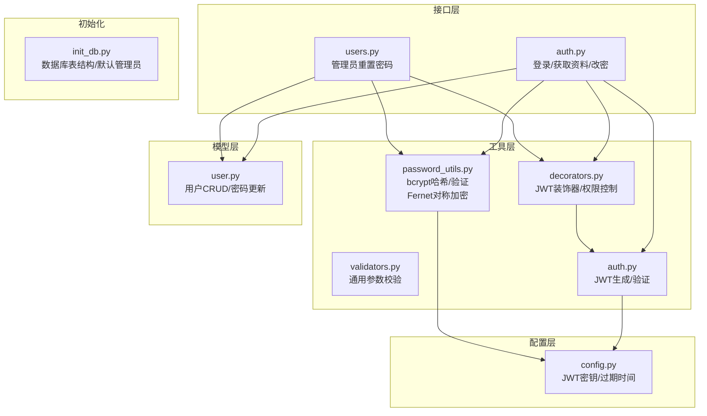
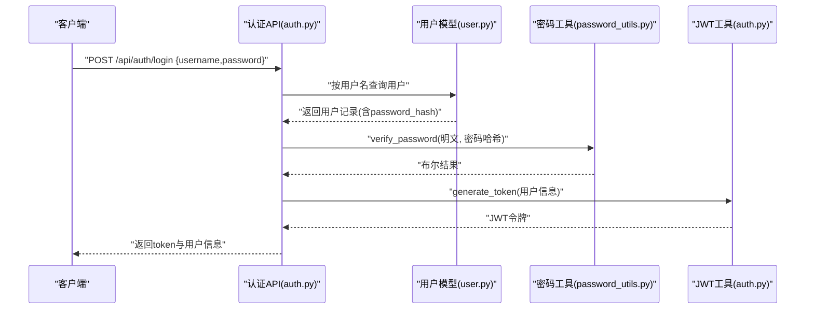
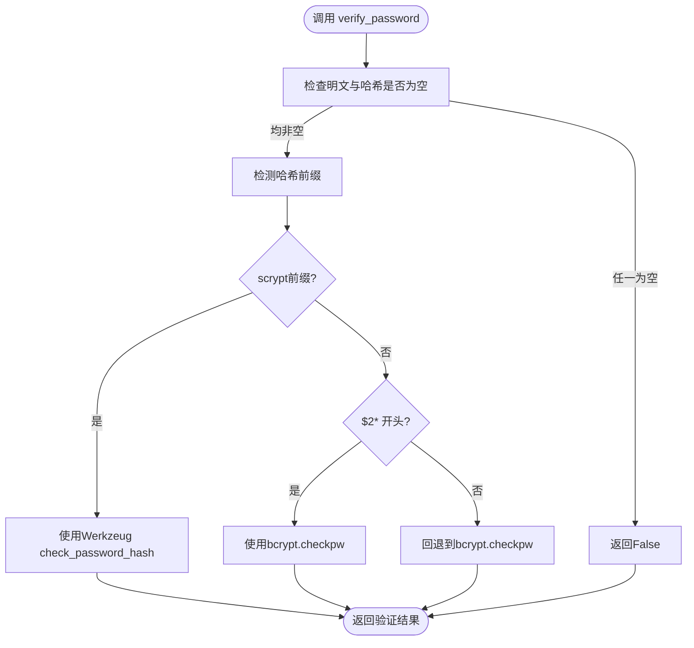
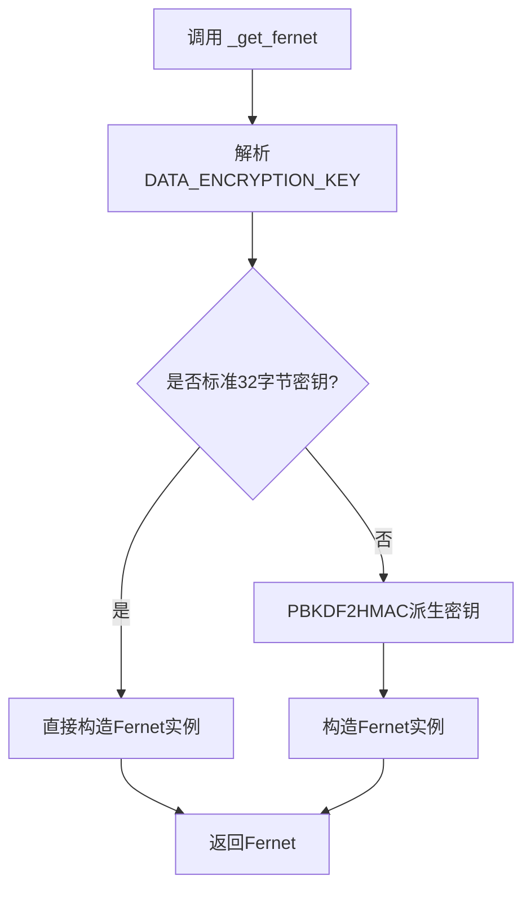
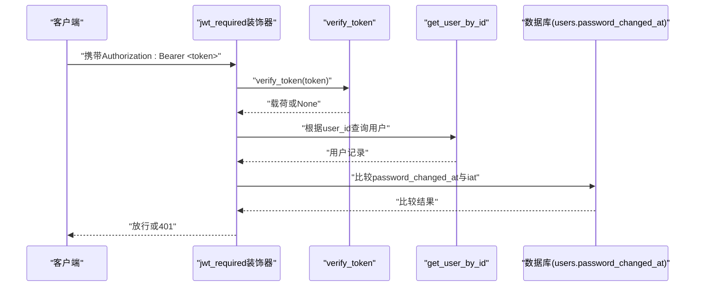
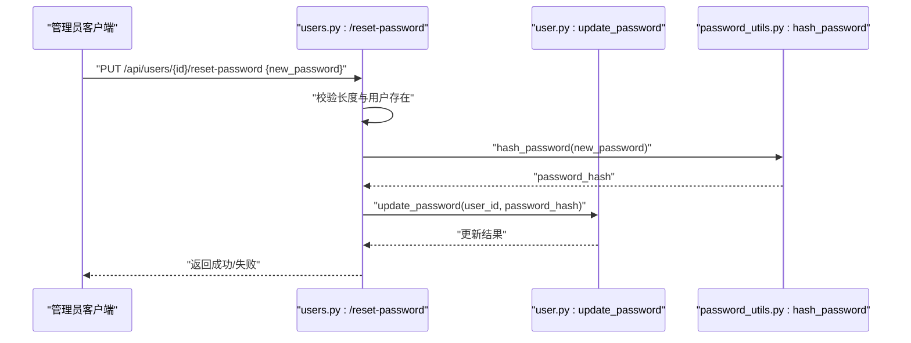
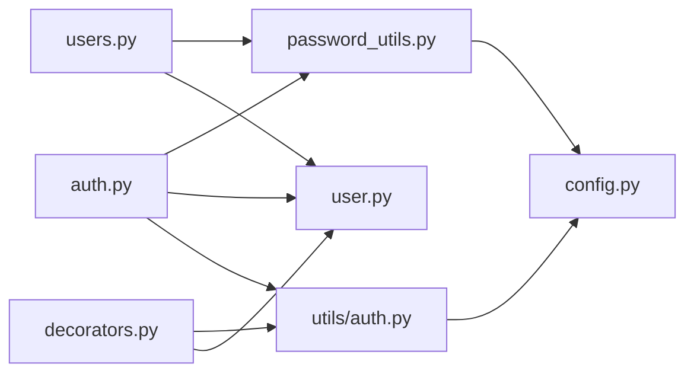

# 密码安全工具

<cite>
**本文引用的文件**
- [password_utils.py](file://backend/app/utils/password_utils.py)
- [validators.py](file://backend/app/utils/validators.py)
- [user.py](file://backend/app/models/user.py)
- [auth.py](file://backend/app/api/auth.py)
- [users.py](file://backend/app/api/users.py)
- [auth.py](file://backend/app/utils/auth.py)
- [decorators.py](file://backend/app/utils/decorators.py)
- [config.py](file://backend/app/config.py)
- [init_db.py](file://backend/init_db.py)
</cite>

## 目录
1. [简介](#简介)
2. [项目结构](#项目结构)
3. [核心组件](#核心组件)
4. [架构总览](#架构总览)
5. [详细组件分析](#详细组件分析)
6. [依赖关系分析](#依赖关系分析)
7. [性能考量](#性能考量)
8. [故障排查指南](#故障排查指南)
9. [结论](#结论)
10. [附录](#附录)

## 简介
本技术文档围绕OPS项目的密码安全工具展开，重点覆盖以下方面：
- bcrypt加密算法的使用：密码哈希生成、密码验证机制、盐值生成策略
- 密码强度验证规则：长度要求、复杂度检查、字符类型要求
- 安全最佳实践：密码存储策略、防暴力破解机制、会话安全管理
- 密码重置流程与临时令牌机制
- 使用示例、安全配置指南与漏洞防护建议

## 项目结构
密码安全相关功能主要分布在以下模块：
- 工具层：密码加密与验证、对称加密、参数校验
- 模型层：用户模型与数据库交互
- 接口层：认证与用户管理API
- 配置层：JWT与密钥配置
- 初始化：数据库表结构与默认管理员

图表来源
- [password_utils.py:1-130](file://backend/app/utils/password_utils.py#L1-L130)
- [validators.py:1-151](file://backend/app/utils/validators.py#L1-L151)
- [auth.py:1-197](file://backend/app/api/auth.py#L1-L197)
- [users.py:1-290](file://backend/app/api/users.py#L1-L290)
- [auth.py:1-45](file://backend/app/utils/auth.py#L1-L45)
- [decorators.py:1-163](file://backend/app/utils/decorators.py#L1-L163)
- [config.py:1-58](file://backend/app/config.py#L1-L58)
- [init_db.py:1-395](file://backend/init_db.py#L1-L395)

章节来源
- [password_utils.py:1-130](file://backend/app/utils/password_utils.py#L1-L130)
- [validators.py:1-151](file://backend/app/utils/validators.py#L1-L151)
- [auth.py:1-197](file://backend/app/api/auth.py#L1-L197)
- [users.py:1-290](file://backend/app/api/users.py#L1-L290)
- [auth.py:1-45](file://backend/app/utils/auth.py#L1-L45)
- [decorators.py:1-163](file://backend/app/utils/decorators.py#L1-L163)
- [config.py:1-58](file://backend/app/config.py#L1-L58)
- [init_db.py:1-395](file://backend/init_db.py#L1-L395)

## 核心组件
- 密码哈希与验证：基于bcrypt的不可逆哈希，支持兼容Werkzeug scrypt格式
- 对称加密：基于Fernet的对称加密，支持直接密钥或PBKDF2派生密钥
- 密码强度校验：最小长度6位（可扩展）
- JWT会话管理：令牌签发、校验、过期控制、密码变更作废机制
- 用户模型：密码哈希入库、密码更新、用户查询
- 管理员重置：管理员重置用户密码的受控流程

章节来源
- [password_utils.py:52-91](file://backend/app/utils/password_utils.py#L52-L91)
- [password_utils.py:93-130](file://backend/app/utils/password_utils.py#L93-L130)
- [validators.py:88-96](file://backend/app/utils/validators.py#L88-L96)
- [auth.py:9-45](file://backend/app/utils/auth.py#L9-L45)
- [user.py:143-162](file://backend/app/models/user.py#L143-L162)
- [users.py:229-290](file://backend/app/api/users.py#L229-L290)

## 架构总览
密码安全体系由“哈希/验证”“对称加密”“JWT会话”“用户模型”“API接口”五部分组成，形成闭环的安全链路。

图表来源
- [auth.py:15-96](file://backend/app/api/auth.py#L15-L96)
- [user.py:36-53](file://backend/app/models/user.py#L36-L53)
- [password_utils.py:64-91](file://backend/app/utils/password_utils.py#L64-L91)
- [auth.py:9-28](file://backend/app/utils/auth.py#L9-L28)

## 详细组件分析

### 组件A：密码哈希与验证（bcrypt）
- 功能要点
  - 使用bcrypt生成盐值并计算哈希，返回可存储的字符串
  - 验证时支持bcrypt与Werkzeug scrypt两种格式，兼容历史数据
  - 对空输入进行健壮性处理，异常即判定失败
- 盐值与成本
  - 通过bcrypt.gensalt()生成随机盐，确保相同明文产生不同哈希
  - bcrypt内部成本参数由库决定，具备抗暴力破解能力
- 兼容性
  - 若数据库中存在scrypt格式哈希，仍可被识别并验证

图表来源
- [password_utils.py:64-91](file://backend/app/utils/password_utils.py#L64-L91)

章节来源
- [password_utils.py:52-91](file://backend/app/utils/password_utils.py#L52-L91)

### 组件B：对称加密（Fernet）
- 功能要点
  - 支持标准32字节urlsafe base64密钥
  - 若未提供标准密钥，通过PBKDF2HMAC从任意字符串派生
  - 提供encrypt_data与decrypt_data两个入口，异常统一抛出
- 密钥解析策略
  - 优先读取环境变量DATA_ENCRYPTION_KEY
  - 开发模式下允许使用内置密钥（仅限调试，严禁生产）
- 应用场景
  - 存储服务器密码、阿里云AccessKey等需解密查看的敏感信息

图表来源
- [password_utils.py:18-49](file://backend/app/utils/password_utils.py#L18-L49)

章节来源
- [password_utils.py:18-49](file://backend/app/utils/password_utils.py#L18-L49)
- [password_utils.py:93-130](file://backend/app/utils/password_utils.py#L93-L130)

### 组件C：密码强度验证规则
- 当前实现
  - 最小长度6位
  - 可扩展：在validators.py中增加复杂度检查（如大小写字母、数字、特殊字符）
- 建议增强
  - 引入字符集多样性检查
  - 增加常见弱口令黑名单
  - 结合业务需求设置最大长度与有效期策略

章节来源
- [validators.py:88-96](file://backend/app/utils/validators.py#L88-L96)

### 组件D：JWT会话管理
- 令牌签发
  - 从配置读取JWT_SECRET_KEY与JWT_EXPIRATION_HOURS
  - 载荷包含user_id、username、role、iat、exp
- 令牌验证
  - 校验签名与过期时间
  - 过期或无效返回None
- 会话失效策略
  - 登录成功后签发令牌
  - 密码变更时更新password_changed_at，装饰器检测并拒绝过期令牌

图表来源
- [decorators.py:26-123](file://backend/app/utils/decorators.py#L26-L123)
- [auth.py:31-45](file://backend/app/utils/auth.py#L31-L45)
- [user.py:143-162](file://backend/app/models/user.py#L143-L162)

章节来源
- [auth.py:9-45](file://backend/app/utils/auth.py#L9-L45)
- [decorators.py:26-123](file://backend/app/utils/decorators.py#L26-L123)
- [config.py:10-15](file://backend/app/config.py#L10-L15)

### 组件E：用户模型与密码更新
- 创建用户
  - 将明文密码经hash_password转换为哈希后入库
- 更新密码
  - 仅更新password_hash与password_changed_at字段
- 查询用户
  - 提供按用户名与ID查询，用于登录与资料获取

章节来源
- [user.py:8-34](file://backend/app/models/user.py#L8-L34)
- [user.py:143-162](file://backend/app/models/user.py#L143-L162)
- [user.py:36-72](file://backend/app/models/user.py#L36-L72)

### 组件F：密码重置流程（管理员）
- 管理员权限
  - 仅admin可调用重置接口
- 流程
  - 校验新密码长度（≥6）
  - 生成新哈希并更新数据库
  - 记录操作日志
- 安全要点
  - 严格的角色校验
  - 与JWT装饰器配合，确保调用方有效

图表来源
- [users.py:229-290](file://backend/app/api/users.py#L229-L290)
- [user.py:143-162](file://backend/app/models/user.py#L143-L162)
- [password_utils.py:52-63](file://backend/app/utils/password_utils.py#L52-L63)

章节来源
- [users.py:229-290](file://backend/app/api/users.py#L229-L290)

### 组件G：登录与改密API
- 登录
  - 校验用户名与密码，激活状态检查
  - 验证通过后签发JWT
- 改密
  - JWT鉴权+旧密码校验
  - 新密码长度校验
  - 生成新哈希并更新

章节来源
- [auth.py:15-96](file://backend/app/api/auth.py#L15-L96)
- [auth.py:131-197](file://backend/app/api/auth.py#L131-L197)

## 依赖关系分析
- 模块耦合
  - API层依赖工具层（密码/加密/JWT）、模型层（用户）
  - 装饰器依赖JWT工具与用户模型
  - 工具层独立，便于复用
- 外部依赖
  - bcrypt：密码哈希
  - cryptography.Fernet：对称加密
  - PyMySQL：数据库连接
  - PyJWT：JWT签发与验证

图表来源
- [auth.py:1-12](file://backend/app/api/auth.py#L1-L12)
- [users.py:1-16](file://backend/app/api/users.py#L1-L16)
- [decorators.py:1-8](file://backend/app/utils/decorators.py#L1-L8)
- [password_utils.py:1-12](file://backend/app/utils/password_utils.py#L1-L12)
- [auth.py:1-6](file://backend/app/utils/auth.py#L1-L6)
- [config.py:1-15](file://backend/app/config.py#L1-L15)

章节来源
- [auth.py:1-12](file://backend/app/api/auth.py#L1-L12)
- [users.py:1-16](file://backend/app/api/users.py#L1-L16)
- [decorators.py:1-8](file://backend/app/utils/decorators.py#L1-L8)
- [password_utils.py:1-12](file://backend/app/utils/password_utils.py#L1-L12)
- [auth.py:1-6](file://backend/app/utils/auth.py#L1-L6)
- [config.py:1-15](file://backend/app/config.py#L1-L15)

## 性能考量
- bcrypt成本
  - bcrypt内部成本参数已优化，适合生产环境
  - 避免在高并发场景下重复计算同一明文
- 数据库索引
  - users.username建立索引，提升登录查询效率
- JWT负载
  - 载荷尽量精简，避免过大payload影响网络传输与解析
- 对称加密
  - Fernet为轻量级对称加密，适用于小规模敏感数据存储

[本节为通用性能建议，无需特定文件引用]

## 故障排查指南
- 无法生成JWT
  - 检查JWT_SECRET_KEY是否配置
  - 检查JWT_EXPIRATION_HOURS是否为合法数值
- 登录失败
  - 确认用户名存在且is_active为真
  - 确认密码哈希格式兼容（bcrypt/scrypt）
- 令牌无效或过期
  - 检查Authorization头格式（Bearer）
  - 检查JWT过期时间
  - 密码变更后旧令牌会被装饰器拒绝
- 密钥问题
  - DATA_ENCRYPTION_KEY必须为32字节urlsafe base64
  - 开发模式下可使用内置密钥（仅限调试）

章节来源
- [auth.py:24-28](file://backend/app/utils/auth.py#L24-L28)
- [config.py:12-15](file://backend/app/config.py#L12-L15)
- [decorators.py:35-44](file://backend/app/utils/decorators.py#L35-L44)
- [password_utils.py:18-29](file://backend/app/utils/password_utils.py#L18-L29)

## 结论
OPS项目的密码安全工具以bcrypt为核心，结合JWT会话管理与对称加密，构建了完整的认证与授权体系。当前实现满足基本安全需求，建议进一步增强密码复杂度校验、引入防暴力破解机制与临时令牌流程，以提升整体安全性与可用性。

[本节为总结性内容，无需特定文件引用]

## 附录

### 使用示例（路径指引）
- 登录获取JWT
  - 请求：POST /api/auth/login
  - 参数：{"username": "...", "password": "..."}
  - 返回：包含token与用户信息
  - 参考：[auth.py:15-96](file://backend/app/api/auth.py#L15-L96)
- 修改密码
  - 请求：PUT /api/auth/password（需Bearer token）
  - 参数：{"old_password": "...", "new_password": "..."}
  - 返回：成功/失败
  - 参考：[auth.py:131-197](file://backend/app/api/auth.py#L131-L197)
- 管理员重置用户密码
  - 请求：PUT /api/users/{id}/reset-password（需admin）
  - 参数：{"new_password": "..."}
  - 返回：成功/失败
  - 参考：[users.py:229-290](file://backend/app/api/users.py#L229-L290)
- 密码哈希生成
  - 函数：hash_password(明文)
  - 返回：哈希字符串
  - 参考：[password_utils.py:52-63](file://backend/app/utils/password_utils.py#L52-L63)
- 密码验证
  - 函数：verify_password(明文, 哈希)
  - 返回：布尔值
  - 参考：[password_utils.py:64-91](file://backend/app/utils/password_utils.py#L64-L91)
- 对称加密/解密
  - 函数：encrypt_data(明文)、decrypt_data(密文)
  - 参考：[password_utils.py:93-130](file://backend/app/utils/password_utils.py#L93-L130)

### 安全配置指南
- 必填环境变量
  - JWT_SECRET_KEY：JWT签名密钥（生产环境务必高强度）
  - DATA_ENCRYPTION_KEY：Fernet对称加密密钥（32字节urlsafe base64）
- 可选环境变量
  - JWT_EXPIRATION_HOURS：令牌过期小时数
  - FLASK_DEBUG/OPS_DEV_ENCRYPTION_FALLBACK：开发调试模式下的降级密钥开关
- 数据库初始化
  - 默认管理员账户：admin/admin123（首次部署后立即修改）
  - 参考：[init_db.py:259-265](file://backend/init_db.py#L259-L265)

### 漏洞防护建议
- 密码策略
  - 增强密码复杂度校验（字符集多样性、常见弱口令黑名单）
  - 设置密码最长使用期限与强制改密策略
- 防暴力破解
  - 引入登录失败计数与临时封禁
  - 速率限制与验证码机制
- 会话安全
  - 短令牌周期+刷新令牌
  - 密码变更即时作废旧令牌
- 数据保护
  - 仅对必要敏感信息进行对称加密
  - 密钥轮换与审计日志

[本节为通用安全建议，无需特定文件引用]