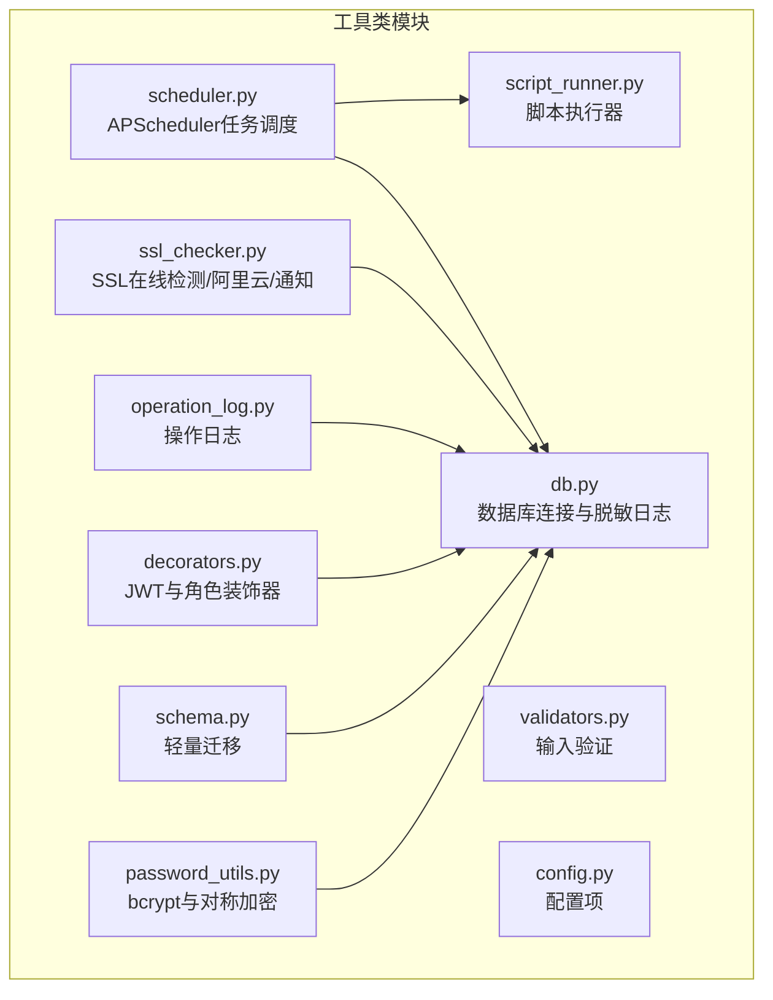
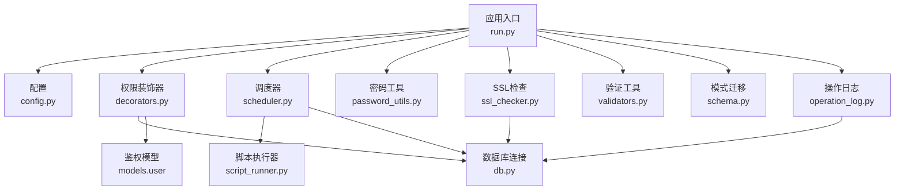
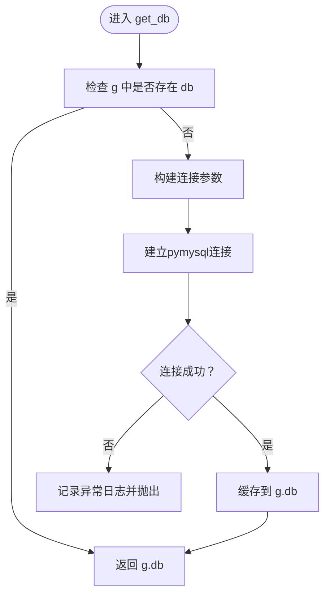
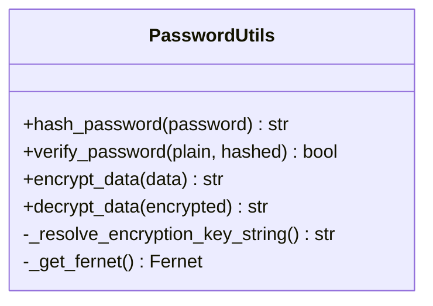
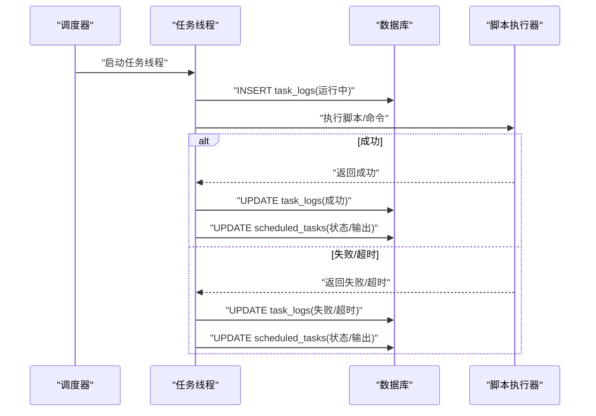
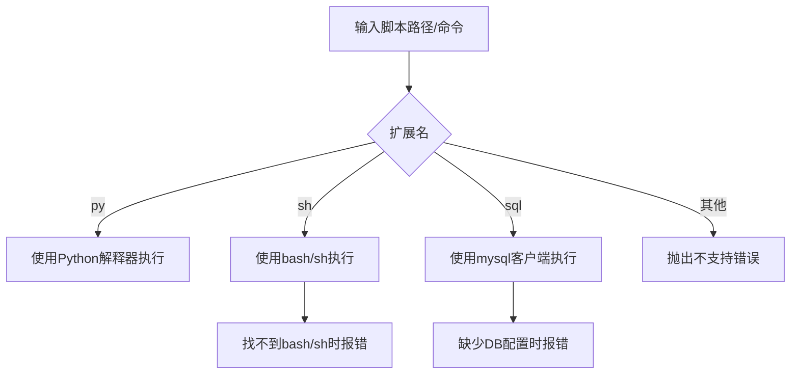
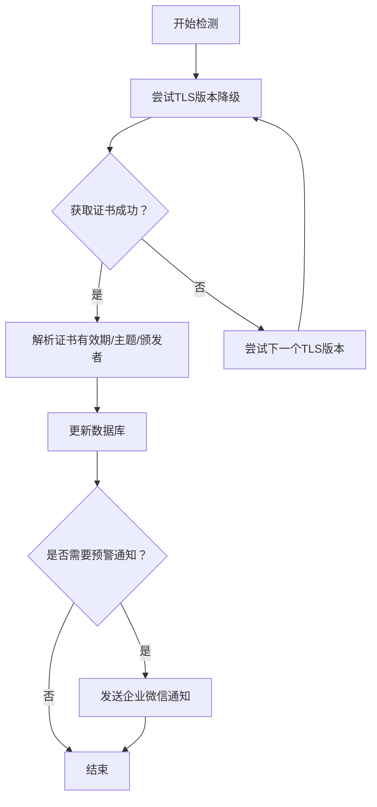
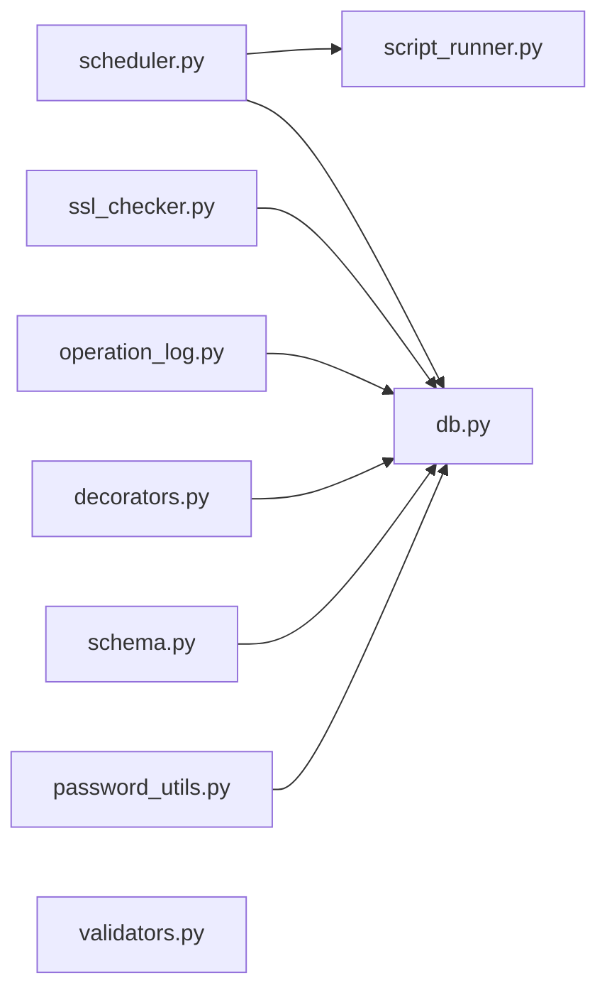

# 工具类模块

<cite>
**本文引用的文件**
- [db.py](file://backend/app/utils/db.py)
- [password_utils.py](file://backend/app/utils/password_utils.py)
- [scheduler.py](file://backend/app/utils/scheduler.py)
- [script_runner.py](file://backend/app/utils/script_runner.py)
- [ssl_checker.py](file://backend/app/utils/ssl_checker.py)
- [validators.py](file://backend/app/utils/validators.py)
- [schema.py](file://backend/app/utils/schema.py)
- [operation_log.py](file://backend/app/utils/operation_log.py)
- [decorators.py](file://backend/app/utils/decorators.py)
- [config.py](file://backend/app/config.py)
</cite>

## 目录
1. [简介](#简介)
2. [项目结构](#项目结构)
3. [核心组件](#核心组件)
4. [架构总览](#架构总览)
5. [详细组件分析](#详细组件分析)
6. [依赖关系分析](#依赖关系分析)
7. [性能考量](#性能考量)
8. [故障排除指南](#故障排除指南)
9. [结论](#结论)
10. [附录](#附录)

## 简介
本文件面向OPS项目的工具类模块，系统性梳理以下工具能力：
- 数据库连接工具：连接参数解析、连接生命周期管理、错误日志与异常传播
- 密码加密工具：bcrypt密码哈希、多格式密码校验、对称加密与密钥派生策略
- 调度器工具：APScheduler集成、Cron触发、任务执行与日志落库、内置任务（SSL证书检测、域名到期通知）
- 脚本执行工具：按扩展名选择执行器（Python/Shell/MySQL）、自定义命令执行、超时控制
- SSL检查工具：在线证书检测、阿里云证书同步与下载、企业微信通知
- 数据验证工具：IP/主机名/URL/端口/域名/密码/用户名/邮箱/整数/正整数/字符串长度
- 模式管理工具：轻量迁移（幂等），补充新增列
- 操作日志工具：统一记录模块、动作、目标、详情、IP、UA、UTC时间
- 权限装饰器：JWT校验、用户存在与启用状态、密码修改后令牌失效、角色权限

## 项目结构
工具类模块集中位于 backend/app/utils 下，围绕“连接、加密、调度、执行、检查、验证、迁移、日志、装饰器”等职责划分文件，职责清晰、耦合度低。

图表来源
- [db.py:1-80](file://backend/app/utils/db.py#L1-L80)
- [password_utils.py:1-130](file://backend/app/utils/password_utils.py#L1-L130)
- [scheduler.py:1-580](file://backend/app/utils/scheduler.py#L1-L580)
- [script_runner.py:1-126](file://backend/app/utils/script_runner.py#L1-L126)
- [ssl_checker.py:1-613](file://backend/app/utils/ssl_checker.py#L1-L613)
- [validators.py:1-151](file://backend/app/utils/validators.py#L1-L151)
- [schema.py:1-42](file://backend/app/utils/schema.py#L1-L42)
- [operation_log.py:1-172](file://backend/app/utils/operation_log.py#L1-L172)
- [decorators.py:1-163](file://backend/app/utils/decorators.py#L1-L163)
- [config.py:1-58](file://backend/app/config.py#L1-L58)

章节来源
- [db.py:1-80](file://backend/app/utils/db.py#L1-L80)
- [config.py:1-58](file://backend/app/config.py#L1-L58)

## 核心组件
- 数据库连接工具：负责连接参数解析、连接建立、连接关闭、日志脱敏输出
- 密码加密工具：bcrypt密码哈希与校验、对称加密（Fernet）与密钥派生、开发回退策略
- 调度器工具：APScheduler后台调度、Cron触发、任务执行线程化、日志落库、内置SSL/域名通知
- 脚本执行工具：按扩展名选择执行器、自定义命令执行、超时控制、SQL脚本通过mysql客户端执行
- SSL检查工具：在线证书检测（TLS降级）、阿里云证书扫描/下载、企业微信通知（Markdown）
- 数据验证工具：IP/主机名/URL/端口/域名/密码/用户名/邮箱/整数/正整数/字符串长度
- 模式管理工具：轻量迁移（幂等），补充新增列
- 操作日志工具：统一记录模块、动作、目标、详情、IP、UA、UTC时间
- 权限装饰器：JWT校验、用户存在与启用状态、密码修改后令牌失效、角色权限

章节来源
- [db.py:1-80](file://backend/app/utils/db.py#L1-L80)
- [password_utils.py:1-130](file://backend/app/utils/password_utils.py#L1-L130)
- [scheduler.py:1-580](file://backend/app/utils/scheduler.py#L1-L580)
- [script_runner.py:1-126](file://backend/app/utils/script_runner.py#L1-L126)
- [ssl_checker.py:1-613](file://backend/app/utils/ssl_checker.py#L1-L613)
- [validators.py:1-151](file://backend/app/utils/validators.py#L1-L151)
- [schema.py:1-42](file://backend/app/utils/schema.py#L1-L42)
- [operation_log.py:1-172](file://backend/app/utils/operation_log.py#L1-L172)
- [decorators.py:1-163](file://backend/app/utils/decorators.py#L1-L163)

## 架构总览
工具类模块与应用主流程的交互如下：
- 应用启动时读取配置，初始化调度器并加载活跃任务
- 各业务API通过装饰器进行JWT校验与角色检查
- 业务逻辑调用数据库工具获取连接，执行增删改查
- 业务逻辑调用密码工具进行哈希与校验、敏感数据加解密
- 业务逻辑调用脚本执行器执行定时任务脚本
- 业务逻辑调用SSL检查工具进行证书检测与通知
- 业务逻辑调用验证工具进行输入校验
- 业务逻辑调用模式管理工具进行轻量迁移
- 业务逻辑调用操作日志工具记录操作轨迹

图表来源
- [config.py:1-58](file://backend/app/config.py#L1-L58)
- [decorators.py:1-163](file://backend/app/utils/decorators.py#L1-L163)
- [db.py:1-80](file://backend/app/utils/db.py#L1-L80)
- [scheduler.py:1-580](file://backend/app/utils/scheduler.py#L1-L580)
- [script_runner.py:1-126](file://backend/app/utils/script_runner.py#L1-L126)
- [password_utils.py:1-130](file://backend/app/utils/password_utils.py#L1-L130)
- [ssl_checker.py:1-613](file://backend/app/utils/ssl_checker.py#L1-L613)
- [validators.py:1-151](file://backend/app/utils/validators.py#L1-L151)
- [schema.py:1-42](file://backend/app/utils/schema.py#L1-L42)
- [operation_log.py:1-172](file://backend/app/utils/operation_log.py#L1-L172)

## 详细组件分析

### 数据库连接工具
- 连接参数解析：从应用配置读取主机、端口、用户、密码、数据库名，提供默认值
- 连接建立：使用pymysql建立连接，设置字符集与游标类型，设置连接超时
- 连接缓存：利用Flask g对象缓存当前请求的数据库连接，避免重复连接
- 关闭连接：在请求结束时关闭连接，异常忽略
- 日志脱敏：连接日志中对密码进行脱敏显示，便于核对配置

图表来源
- [db.py:43-80](file://backend/app/utils/db.py#L43-L80)

章节来源
- [db.py:1-80](file://backend/app/utils/db.py#L1-L80)

### 密码加密工具
- bcrypt密码哈希：生成盐并进行哈希，返回可逆字符串
- 密码校验：支持Werkzeug scrypt与bcrypt格式，自动识别并校验
- 对称加密：Fernet对称加密，支持标准32字节urlsafe base64密钥或PBKDF2派生密钥
- 密钥策略：生产环境必须设置DATA_ENCRYPTION_KEY；开发环境可开启FLASK_DEBUG或OPS_DEV_ENCRYPTION_FALLBACK使用内置密钥（不安全）
- 异常处理：加密/解密失败抛出明确错误

图表来源
- [password_utils.py:1-130](file://backend/app/utils/password_utils.py#L1-L130)

章节来源
- [password_utils.py:1-130](file://backend/app/utils/password_utils.py#L1-L130)

### 调度器工具
- 调度器实例：全局BackgroundScheduler，独立于Flask应用上下文
- 任务加载：从数据库查询活跃任务，支持自定义命令与脚本文件两种模式
- Cron触发：解析“分 时 日 月 周”五段式表达式，创建CronTrigger
- 任务执行：在子线程中执行，避免阻塞调度器；执行前后记录任务日志与状态
- 日志落库：插入task_logs并更新scheduled_tasks的last_run_at/last_status/last_output
- 异常处理：捕获脚本执行异常、超时异常、数据库异常，统一更新日志与状态
- 内置任务：SSL证书自动检测+通知、域名到期自动通知，支持配置化Cron与阈值
- 数据库配置：提供独立连接方法，供调度器回调使用

图表来源
- [scheduler.py:39-179](file://backend/app/utils/scheduler.py#L39-L179)
- [script_runner.py:19-116](file://backend/app/utils/script_runner.py#L19-L116)

章节来源
- [scheduler.py:1-580](file://backend/app/utils/scheduler.py#L1-L580)
- [script_runner.py:1-126](file://backend/app/utils/script_runner.py#L1-L126)

### 脚本执行工具
- 扩展名识别：根据文件扩展名选择执行器
- Python脚本：使用当前Python解释器执行
- Shell脚本：优先bash，其次sh，找不到报错
- SQL脚本：通过mysql客户端执行，需要提供DB配置，使用环境变量传递密码
- 自定义命令：在指定工作目录下执行shell命令，支持超时控制
- 安全校验：上传脚本扩展名白名单校验

图表来源
- [script_runner.py:49-116](file://backend/app/utils/script_runner.py#L49-L116)

章节来源
- [script_runner.py:1-126](file://backend/app/utils/script_runner.py#L1-L126)

### SSL检查工具
- 在线证书检测：支持TLS降级（TLSv1.3→TLSv1），获取PEM证书并解析有效期
- 阿里云证书：扫描账户证书列表，兼容snake_case/PascalCase字段，解析时间戳
- 证书下载：通过阿里云CAS API下载证书与私钥内容
- 企业微信通知：Markdown格式通知，支持重试与状态记录
- 域名到期通知：查询即将过期或已过期域名，发送Markdown通知

图表来源
- [ssl_checker.py:48-167](file://backend/app/utils/ssl_checker.py#L48-L167)

章节来源
- [ssl_checker.py:1-613](file://backend/app/utils/ssl_checker.py#L1-L613)

### 数据验证工具
- IP地址：支持IPv4/IPv6
- 主机名：符合RFC规范，不含非法标签
- URL：http/https协议，包含域名
- 端口：1-65535
- 域名：支持通配符，去除通配符后验证
- 密码：至少6位
- 用户名：3-20位，字母数字下划线
- 邮箱：标准邮箱格式
- 整数/正整数：整数与正整数校验
- 字符串长度：最小/最大长度校验

章节来源
- [validators.py:1-151](file://backend/app/utils/validators.py#L1-L151)

### 模式管理工具
- 轻量迁移：在应用上下文中调用，幂等添加缺失列（如users.password_changed_at）
- 异常处理：连接失败、ALTER失败均记录日志并抛出

章节来源
- [schema.py:1-42](file://backend/app/utils/schema.py#L1-L42)

### 操作日志工具
- 统一记录：模块、动作、目标、详情、IP、UA、UTC时间
- 用户解析：优先显式传入user_id/username，其次从g.current_user或g解析
- JSON序列化：详情转JSON，异常时回退编码
- 异常处理：记录失败时使用error级别确保可见

章节来源
- [operation_log.py:1-172](file://backend/app/utils/operation_log.py#L1-L172)

### 权限装饰器
- JWT校验：Bearer Token解析、签名验证、过期检查
- 用户校验：用户存在、启用状态、密码修改后令牌失效（基于iat与password_changed_at比较）
- 角色校验：基于数据库角色，支持多角色授权

章节来源
- [decorators.py:1-163](file://backend/app/utils/decorators.py#L1-L163)

## 依赖关系分析
- 调度器依赖脚本执行器与数据库工具，二者均不依赖调度器，形成单向依赖
- SSL检查工具依赖数据库与外部HTTP/阿里云SDK，具备条件导入
- 操作日志工具依赖数据库工具
- 权限装饰器依赖鉴权模型与数据库工具
- 密码工具与验证工具相互独立
- 模式管理工具依赖数据库工具

图表来源
- [scheduler.py:1-580](file://backend/app/utils/scheduler.py#L1-L580)
- [script_runner.py:1-126](file://backend/app/utils/script_runner.py#L1-L126)
- [ssl_checker.py:1-613](file://backend/app/utils/ssl_checker.py#L1-L613)
- [operation_log.py:1-172](file://backend/app/utils/operation_log.py#L1-L172)
- [decorators.py:1-163](file://backend/app/utils/decorators.py#L1-L163)
- [schema.py:1-42](file://backend/app/utils/schema.py#L1-L42)
- [password_utils.py:1-130](file://backend/app/utils/password_utils.py#L1-L130)
- [validators.py:1-151](file://backend/app/utils/validators.py#L1-L151)
- [db.py:1-80](file://backend/app/utils/db.py#L1-L80)

## 性能考量
- 数据库连接：使用Flask g缓存连接，减少重复连接开销；建议在高并发场景下结合连接池中间件或数据库连接池配置
- 调度器任务：任务在子线程执行，避免阻塞调度器；注意任务数量与资源占用，合理设置超时
- SSL检测：TLS降级逐次尝试，可能增加网络延迟；可通过调整超时与并发策略优化
- 脚本执行：SQL脚本通过mysql客户端执行，避免在Python中拼接SQL；注意脚本大小与执行时间
- 日志记录：操作日志写入数据库，建议在高吞吐场景下考虑异步队列或批量写入

## 故障排除指南
- 数据库连接失败
  - 检查DB_HOST/DB_PORT/DB_USER/DB_PASSWORD/DB_NAME配置
  - 查看日志中脱敏后的连接参数核对
  - 确认网络可达与防火墙放行
- 调度器任务未执行
  - 检查Cron表达式格式（5段式）
  - 确认任务状态为活跃且脚本/命令存在
  - 查看任务日志表task_logs与scheduled_tasks状态
- SSL检测失败
  - 检查SSL_CHECK_TIMEOUT与网络连通性
  - 确认目标域名可访问且支持TLS
  - 查看日志中TLS降级尝试记录
- 企业微信通知失败
  - 检查WECHAT_WEBHOOK_URL配置
  - 查看通知重试次数与返回状态
- 密钥相关问题
  - 生产环境必须设置DATA_ENCRYPTION_KEY
  - 开发环境仅在FLASK_DEBUG或OPS_DEV_ENCRYPTION_FALLBACK为真时使用内置密钥
- 操作日志记录失败
  - 检查数据库连接与operation_logs表结构
  - 查看日志错误堆栈

章节来源
- [db.py:1-80](file://backend/app/utils/db.py#L1-L80)
- [scheduler.py:1-580](file://backend/app/utils/scheduler.py#L1-L580)
- [ssl_checker.py:1-613](file://backend/app/utils/ssl_checker.py#L1-L613)
- [password_utils.py:1-130](file://backend/app/utils/password_utils.py#L1-L130)
- [operation_log.py:1-172](file://backend/app/utils/operation_log.py#L1-L172)

## 结论
工具类模块围绕“连接、加密、调度、执行、检查、验证、迁移、日志、装饰器”构建了完整的基础设施能力，具备良好的可维护性与扩展性。建议在生产环境中严格配置密钥与数据库参数，关注调度器与SSL检测的性能与稳定性，并持续完善日志与监控体系。

## 附录
- 配置参数清单（来自配置文件）
  - 数据库相关：DB_HOST、DB_PORT、DB_USER、DB_PASSWORD、DB_NAME
  - 应用相关：SECRET_KEY、JWT_SECRET_KEY、JWT_EXPIRATION_HOURS、DEBUG、HOST、PORT、UPLOAD_FOLDER、MAX_CONTENT_LENGTH、JSON_AS_ASCII、CORS_ORIGINS、CORS_ALLOW_ALL
  - 通知与告警：WECHAT_WEBHOOK_URL、SSL_CHECK_TIMEOUT、SSL_WARNING_DAYS、DOMAIN_WARNING_DAYS、CERT_AUTO_CHECK_CRON、DOMAIN_AUTO_NOTIFY_CRON
  - 其他：CERT_FILES_DIR、GRAFANA_URL、GRAFANA_DASHBOARDS

章节来源
- [config.py:1-58](file://backend/app/config.py#L1-L58)