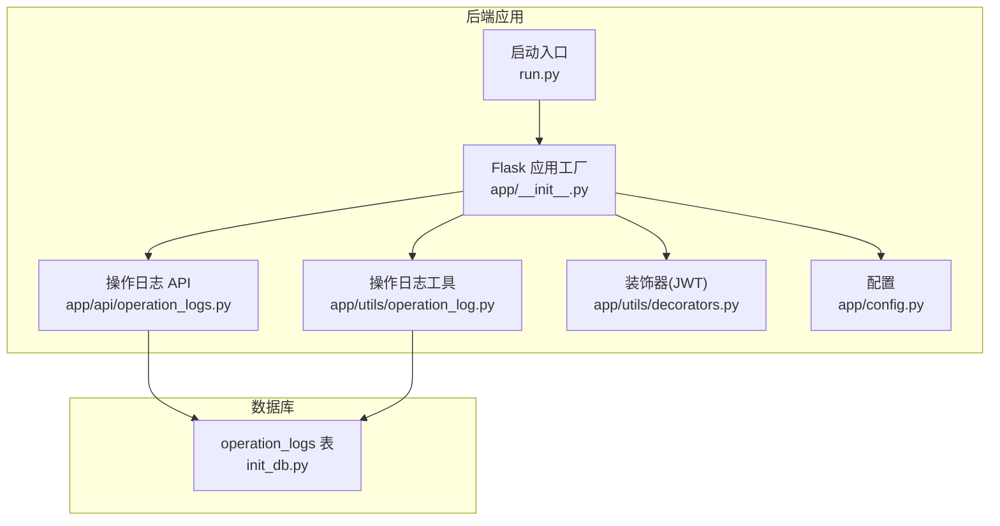
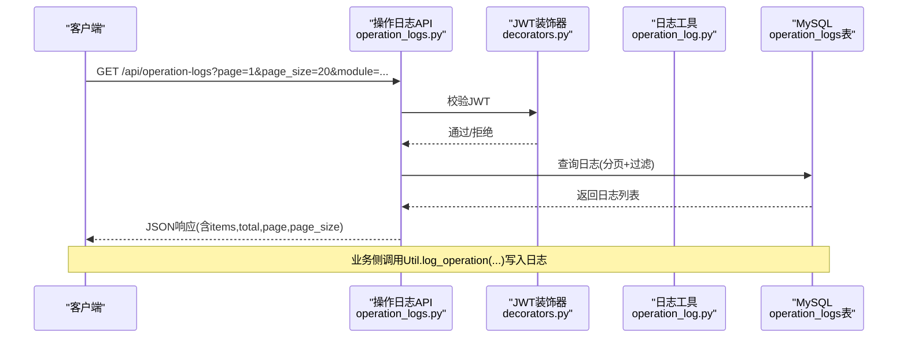
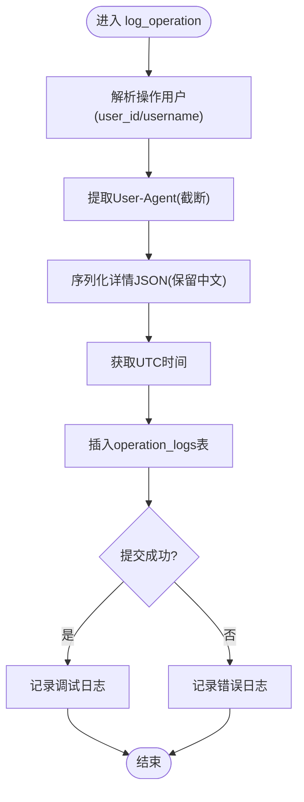
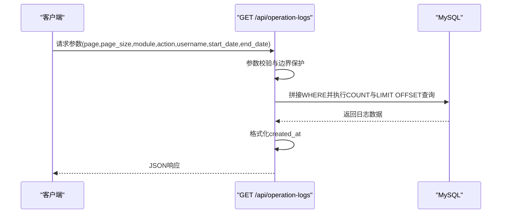
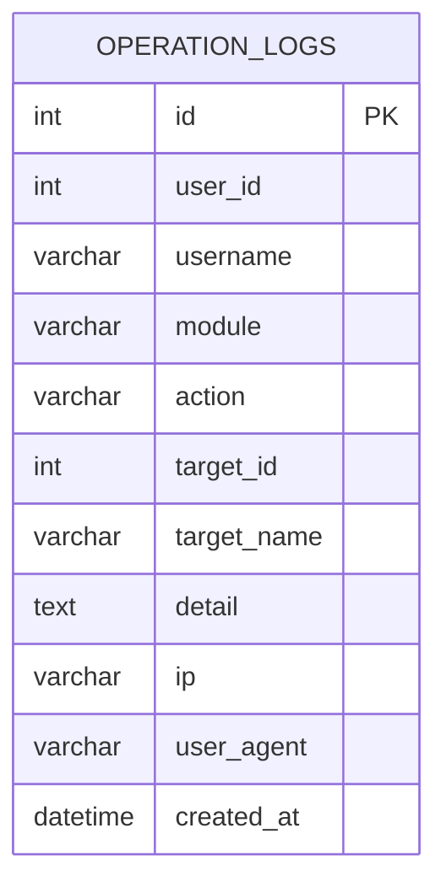
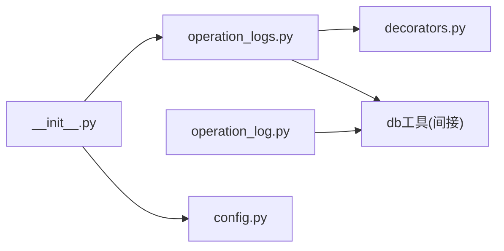

# 操作日志工具

<cite>
**本文引用的文件**
- [operation_log.py](file://backend/app/utils/operation_log.py)
- [operation_logs.py](file://backend/app/api/operation_logs.py)
- [init_db.py](file://backend/init_db.py)
- [config.py](file://backend/app/config.py)
- [decorators.py](file://backend/app/utils/decorators.py)
- [__init__.py](file://backend/app/__init__.py)
- [run.py](file://backend/run.py)
</cite>

## 目录
1. [简介](#简介)
2. [项目结构](#项目结构)
3. [核心组件](#核心组件)
4. [架构总览](#架构总览)
5. [组件详解](#组件详解)
6. [依赖关系分析](#依赖关系分析)
7. [性能考量](#性能考量)
8. [故障排查指南](#故障排查指南)
9. [结论](#结论)
10. [附录](#附录)

## 简介
本技术文档围绕 OPS 项目的“操作日志工具”展开，系统性阐述日志设计与实现，包括：
- 日志级别与格式化策略
- 日志内容结构与字段含义
- 敏感信息处理与过滤思路
- 存储策略与归档机制建议
- 查询与分析能力（搜索过滤、统计分析、报表生成）
- 日志配置示例、审计与合规性指南

该工具基于 Flask + MySQL 实现，提供统一的日志记录入口与 REST API，支持按模块、动作、用户、时间范围等维度检索，并内置模块与动作枚举映射。

## 项目结构
与操作日志相关的关键文件与职责如下：
- backend/app/utils/operation_log.py：日志记录工具，封装统一的 log_operation、log_login、log_logout 及模块/动作映射
- backend/app/api/operation_logs.py：操作日志 API，提供分页查询、模块/动作枚举接口
- backend/init_db.py：数据库初始化脚本，包含 operation_logs 表结构定义与索引
- backend/app/config.py：应用配置，包含数据库连接、CORS、JSON 输出等
- backend/app/utils/decorators.py：JWT 认证装饰器，为日志 API 提供鉴权
- backend/app/__init__.py：Flask 应用工厂，负责日志输出配置、蓝图注册、数据库预检
- backend/run.py：应用启动入口

图表来源
- [__init__.py:116-151](file://backend/app/__init__.py#L116-L151)
- [operation_log.py:49-132](file://backend/app/utils/operation_log.py#L49-L132)
- [operation_logs.py:20-136](file://backend/app/api/operation_logs.py#L20-L136)
- [init_db.py:240-259](file://backend/init_db.py#L240-L259)

章节来源
- [__init__.py:116-151](file://backend/app/__init__.py#L116-L151)
- [operation_log.py:49-132](file://backend/app/utils/operation_log.py#L49-L132)
- [operation_logs.py:20-136](file://backend/app/api/operation_logs.py#L20-L136)
- [init_db.py:240-259](file://backend/init_db.py#L240-L259)

## 核心组件
- 日志记录工具（operation_log.py）
  - 统一日志记录函数 log_operation，支持模块、动作、目标对象、详情 JSON、用户解析
  - 登录/登出专用记录函数 log_login/log_logout
  - 模块与动作的中文映射常量，便于展示与筛选
- 操作日志 API（operation_logs.py）
  - 列表查询：分页、模块/动作/用户名/起止日期过滤
  - 枚举接口：模块列表、动作列表
  - 响应中对时间字段进行格式化
- 数据库初始化（init_db.py）
  - operation_logs 表结构定义，包含主键、索引、字段约束
- 应用配置（config.py）
  - 数据库连接参数、CORS、JSON 输出等
- 认证装饰器（decorators.py）
  - JWT 鉴权装饰器，为日志 API 提供保护
- 应用工厂与日志输出（__init__.py）
  - 标准化日志输出到 stderr，便于容器化收集
  - 蓝图注册与数据库预检

章节来源
- [operation_log.py:49-173](file://backend/app/utils/operation_log.py#L49-L173)
- [operation_logs.py:20-136](file://backend/app/api/operation_logs.py#L20-L136)
- [init_db.py:240-259](file://backend/init_db.py#L240-L259)
- [config.py:10-58](file://backend/app/config.py#L10-L58)
- [decorators.py:26-123](file://backend/app/utils/decorators.py#L26-L123)
- [__init__.py:10-26](file://backend/app/__init__.py#L10-L26)

## 架构总览
操作日志的端到端流程如下：
- 业务模块调用 log_operation 或登录/登出函数
- 工具解析用户上下文、客户端 IP、UA，序列化详情 JSON
- 将日志写入 operation_logs 表
- API 层通过 JWT 鉴权，提供分页查询与枚举接口

图表来源
- [operation_logs.py:20-136](file://backend/app/api/operation_logs.py#L20-L136)
- [decorators.py:26-123](file://backend/app/utils/decorators.py#L26-L123)
- [operation_log.py:49-132](file://backend/app/utils/operation_log.py#L49-L132)
- [init_db.py:240-259](file://backend/init_db.py#L240-L259)

## 组件详解

### 日志记录工具（operation_log.py）
- 用户解析逻辑
  - 优先使用显式传入的 user_id/username
  - 若为空，则从 g.current_user 和 g 中补全
  - 默认未知用户标识
- 客户端信息
  - 优先取 X-Forwarded-For/X-Real-IP，回退至 remote_addr
  - User-Agent 截断长度
- 详情 JSON
  - 优先保留中文字符，异常时回退编码
- 时间与时区
  - 使用 UTC 时间，与 JWT 保持一致
- 错误处理
  - 记录失败时以 error 级别输出，便于排查

图表来源
- [operation_log.py:49-119](file://backend/app/utils/operation_log.py#L49-L119)

章节来源
- [operation_log.py:13-132](file://backend/app/utils/operation_log.py#L13-L132)

### 操作日志 API（operation_logs.py）
- 查询参数
  - module、action、username、start_date、end_date
  - 分页参数 page/page_size，带边界保护
- 过滤与排序
  - 动态拼接 WHERE 条件
  - 按 created_at 降序
- 响应处理
  - 对 created_at 字段格式化为字符串
  - 返回 items、total、page、page_size

图表来源
- [operation_logs.py:20-99](file://backend/app/api/operation_logs.py#L20-L99)

章节来源
- [operation_logs.py:20-136](file://backend/app/api/operation_logs.py#L20-L136)

### 数据库表结构（init_db.py）
- 表名：operation_logs
- 关键字段
  - id、user_id、username、module、action、target_id、target_name、detail、ip、user_agent、created_at
- 索引
  - idx_user_id、idx_module、idx_action、idx_created_at
- 作用
  - 支持按用户、模块、动作、时间快速检索

图表来源
- [init_db.py:240-259](file://backend/init_db.py#L240-L259)

章节来源
- [init_db.py:240-259](file://backend/init_db.py#L240-L259)

### 应用工厂与日志输出（__init__.py）
- 日志输出
  - 标准化输出到 stderr，便于容器化日志收集
  - 格式包含时间、级别、模块名与消息
  - 降低底层库异常不可见风险
- 蓝图注册
  - 包含 operation_logs 蓝图
- 数据库预检
  - 启动前验证数据库连通性

章节来源
- [__init__.py:10-26](file://backend/app/__init__.py#L10-L26)
- [__init__.py:116-151](file://backend/app/__init__.py#L116-L151)

## 依赖关系分析
- operation_logs API 依赖
  - JWT 鉴权装饰器（decorators.py）
  - 数据库连接工具（通过 db.py 引入）
- 日志工具依赖
  - Flask 请求上下文（g、request）
  - 数据库连接工具（db.py）
- 应用工厂依赖
  - 配置（config.py）
  - 蓝图注册（包含 operation_logs）

图表来源
- [operation_logs.py:4-6](file://backend/app/api/operation_logs.py#L4-L6)
- [decorators.py:6](file://backend/app/utils/decorators.py#L6)
- [operation_log.py:7-8](file://backend/app/utils/operation_log.py#L7-L8)
- [__init__.py:116-151](file://backend/app/__init__.py#L116-L151)

章节来源
- [operation_logs.py:4-6](file://backend/app/api/operation_logs.py#L4-L6)
- [decorators.py:6](file://backend/app/utils/decorators.py#L6)
- [operation_log.py:7-8](file://backend/app/utils/operation_log.py#L7-L8)
- [__init__.py:116-151](file://backend/app/__init__.py#L116-L151)

## 性能考量
- 查询性能
  - 表已建立 user_id、module、action、created_at 索引，适合高频过滤与排序
  - 建议在高并发场景下控制 page_size，避免一次性返回过多数据
- 写入性能
  - 单条日志写入为一次 INSERT，事务提交
  - 建议在业务侧减少冗余 detail，避免超大 JSON
- 日志轮转与归档
  - 当前代码未实现数据库层面的轮转/归档
  - 建议结合外部工具（如 MySQL 定时任务、备份策略）实现历史数据归档与清理

[本节为通用性能建议，不直接分析具体文件]

## 故障排查指南
- 日志无法写入
  - 检查数据库连接参数（DB_HOST、DB_PORT、DB_USER、DB_PASSWORD、DB_NAME）
  - 查看应用启动阶段的数据库预检日志
- 查询异常
  - 确认查询参数类型与边界（page/page_size）
  - 检查日期格式是否符合预期
- 认证失败
  - 确认 Authorization 头格式与 JWT 有效性
  - 检查用户状态与密码变更导致的令牌失效

章节来源
- [__init__.py:88-106](file://backend/app/__init__.py#L88-L106)
- [operation_logs.py:12-17](file://backend/app/api/operation_logs.py#L12-L17)
- [decorators.py:26-123](file://backend/app/utils/decorators.py#L26-L123)

## 结论
OPS 的操作日志工具通过统一的记录入口与标准 API，实现了对关键操作的可追溯与可审计。当前实现具备：
- 清晰的日志内容结构与中文映射
- 基于索引的高效查询能力
- 标准化的日志输出与应用集成

建议在生产环境中补充：
- 数据库层面的轮转/归档策略
- 敏感信息过滤与脱敏机制
- 更丰富的统计分析与报表能力

[本节为总结性内容，不直接分析具体文件]

## 附录

### 日志内容结构与字段说明
- 字段
  - user_id、username：操作用户标识
  - module、action：模块与动作（中文映射见常量）
  - target_id、target_name：操作对象标识与名称
  - detail：操作详情（JSON 文本）
  - ip、user_agent：客户端信息
  - created_at：操作时间（UTC）
- 示例字段路径
  - [operation_log.py:90-108](file://backend/app/utils/operation_log.py#L90-L108)
  - [init_db.py:240-259](file://backend/init_db.py#L240-L259)

章节来源
- [operation_log.py:90-108](file://backend/app/utils/operation_log.py#L90-L108)
- [init_db.py:240-259](file://backend/init_db.py#L240-L259)

### 日志级别与格式化
- 日志输出
  - 标准化输出到 stderr，格式包含时间、级别、模块名与消息
- 级别策略
  - 应用日志 INFO/DEBUG
  - 数据库异常抑制（pymysql）以避免噪音
- 示例路径
  - [__init__.py:10-26](file://backend/app/__init__.py#L10-L26)

章节来源
- [__init__.py:10-26](file://backend/app/__init__.py#L10-L26)

### 敏感信息过滤与合规建议
- 当前实现
  - 未内置敏感信息过滤逻辑
- 建议措施
  - 在 detail 写入前进行敏感字段剔除或脱敏
  - 对涉及个人数据的操作增加最小化原则与审计标记
  - 结合企业合规要求制定日志保留期限与销毁策略

[本节为通用合规建议，不直接分析具体文件]

### 查询与分析能力
- 查询接口
  - GET /api/operation-logs：分页+过滤
  - GET /api/operation-logs/modules：模块枚举
  - GET /api/operation-logs/actions：动作枚举
- 建议增强
  - 增加统计分析接口（按日/模块/用户聚合）
  - 报表导出（CSV/PDF）能力
  - 告警联动（异常登录/批量操作）

章节来源
- [operation_logs.py:20-136](file://backend/app/api/operation_logs.py#L20-L136)

### 存储策略与归档机制
- 当前实现
  - 未实现数据库层面的轮转/归档
- 建议方案
  - 定时任务将历史数据迁移到归档表/文件
  - 压缩与分区策略（如按月分区）
  - 清理策略：超过保留期的数据软删除或物理删除

[本节为通用存储建议，不直接分析具体文件]

### 日志配置示例与环境变量
- 必填项（生产环境）
  - SECRET_KEY、JWT_SECRET_KEY
  - DB_HOST、DB_PORT、DB_USER、DB_PASSWORD、DB_NAME
- 其他相关
  - CORS_ORIGINS、CORS_ALLOW_ALL
  - JSON_AS_ASCII（保留中文）
- 示例路径
  - [config.py:10-58](file://backend/app/config.py#L10-L58)
  - [__init__.py:36-46](file://backend/app/__init__.py#L36-L46)

章节来源
- [config.py:10-58](file://backend/app/config.py#L10-L58)
- [__init__.py:36-46](file://backend/app/__init__.py#L36-L46)