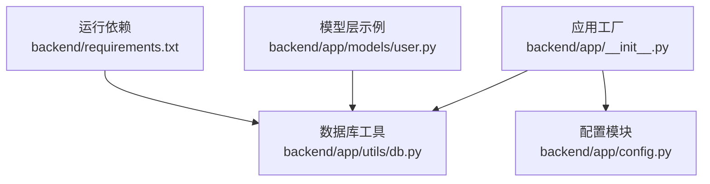
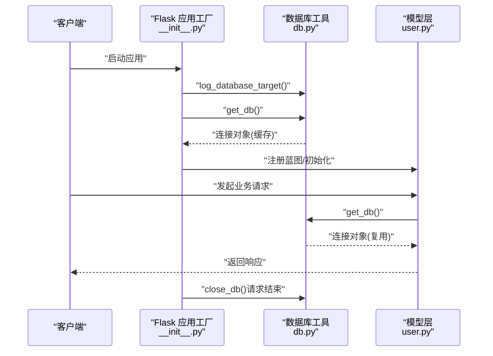
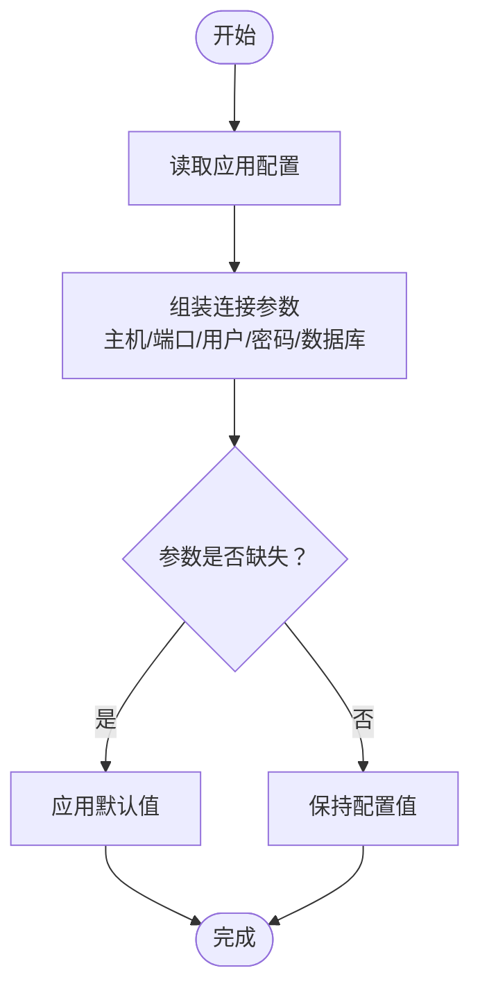
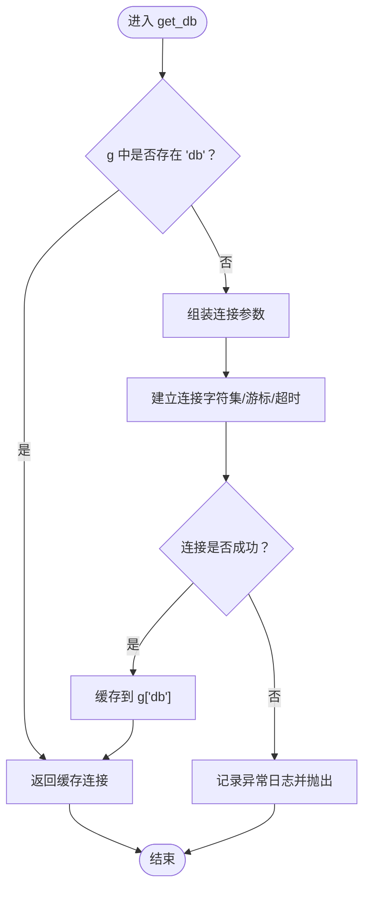
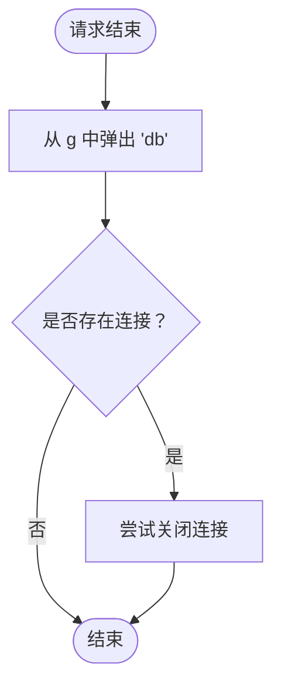
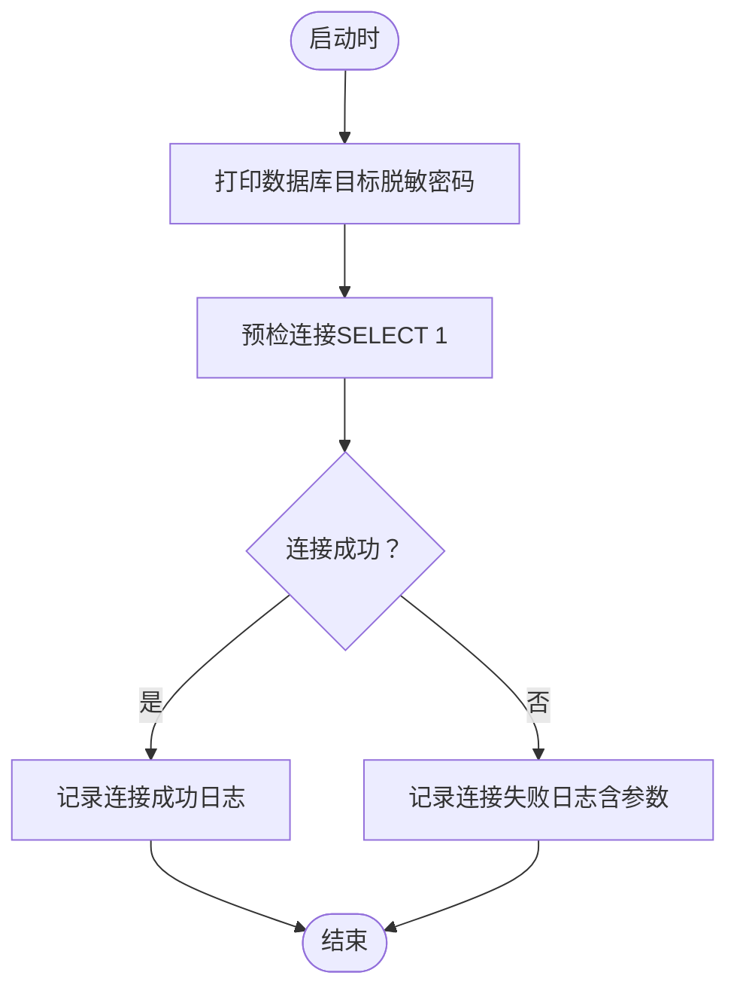
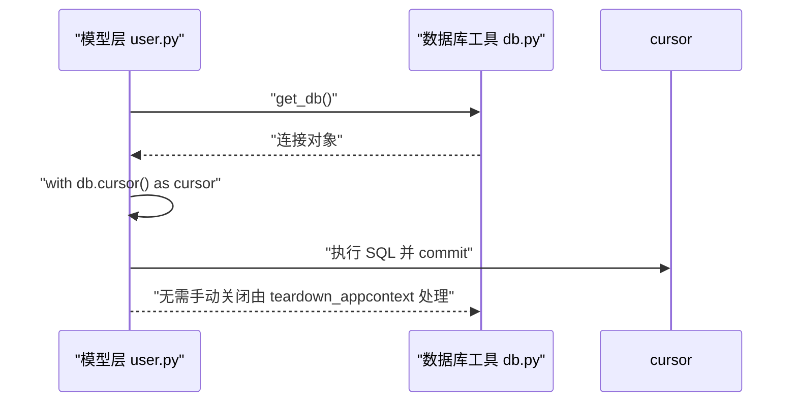
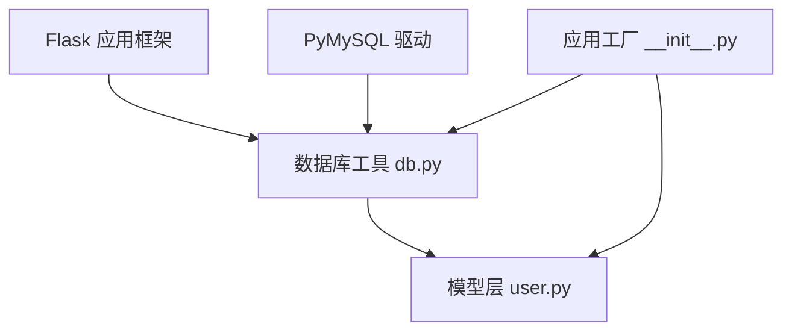

# 数据库连接工具

<cite>
**本文引用的文件**
- [backend/app/utils/db.py](file://backend/app/utils/db.py)
- [backend/app/__init__.py](file://backend/app/__init__.py)
- [backend/app/config.py](file://backend/app/config.py)
- [backend/app/models/user.py](file://backend/app/models/user.py)
- [backend/requirements.txt](file://backend/requirements.txt)
</cite>

## 目录
1. [简介](#简介)
2. [项目结构](#项目结构)
3. [核心组件](#核心组件)
4. [架构总览](#架构总览)
5. [详细组件分析](#详细组件分析)
6. [依赖分析](#依赖分析)
7. [性能考虑](#性能考虑)
8. [故障排查指南](#故障排查指南)
9. [结论](#结论)
10. [附录](#附录)

## 简介
本文件面向OPS项目的数据库连接工具，系统性阐述Flask应用上下文缓存机制、连接参数配置、连接超时设置、连接建立流程、错误处理与日志记录、连接关闭与资源清理策略，并提供配置示例、使用方法、性能优化建议与常见问题解决方案。该工具基于PyMySQL实现，采用Flask应用上下文缓存，确保一次请求生命周期内复用同一连接，避免重复建立连接带来的开销。

## 项目结构
数据库连接工具位于后端应用的工具模块中，配合配置模块与模型层共同完成数据库访问。关键文件与职责如下：
- backend/app/utils/db.py：数据库连接工具，负责连接参数组装、连接建立、连接关闭与日志记录。
- backend/app/config.py：集中式配置读取，从环境变量加载数据库连接参数。
- backend/app/__init__.py：应用工厂创建与初始化，注册应用上下文钩子，执行数据库预检。
- backend/app/models/user.py：模型层示例，展示如何在业务逻辑中调用数据库连接工具。
- backend/requirements.txt：运行依赖，包含PyMySQL等。

**图表来源**
- [backend/app/utils/db.py:1-80](file://backend/app/utils/db.py#L1-L80)
- [backend/app/__init__.py:28-113](file://backend/app/__init__.py#L28-L113)
- [backend/app/config.py:10-27](file://backend/app/config.py#L10-L27)
- [backend/app/models/user.py:1-162](file://backend/app/models/user.py#L1-L162)
- [backend/requirements.txt:1-17](file://backend/requirements.txt#L1-L17)

**章节来源**
- [backend/app/utils/db.py:1-80](file://backend/app/utils/db.py#L1-L80)
- [backend/app/__init__.py:28-113](file://backend/app/__init__.py#L28-L113)
- [backend/app/config.py:10-27](file://backend/app/config.py#L10-L27)
- [backend/app/models/user.py:1-162](file://backend/app/models/user.py#L1-L162)
- [backend/requirements.txt:1-17](file://backend/requirements.txt#L1-L17)

## 核心组件
- 连接参数组装：从应用配置中读取数据库主机、端口、用户名、密码、数据库名，并提供默认值。
- 上下文缓存：利用Flask的g对象在一次请求上下文中缓存数据库连接，避免重复连接。
- 连接建立：使用PyMySQL建立连接，设置字符集与游标类型，并配置连接超时。
- 日志与脱敏：启动时打印数据库目标信息并脱敏密码；连接失败时记录详细日志并抛出异常。
- 连接关闭：在应用上下文结束时关闭数据库连接，释放资源。

**章节来源**
- [backend/app/utils/db.py:18-69](file://backend/app/utils/db.py#L18-L69)
- [backend/app/__init__.py:85-86](file://backend/app/__init__.py#L85-L86)

## 架构总览
数据库连接工具在应用生命周期内的交互如下：
- 应用启动时，应用工厂执行数据库预检，打印脱敏后的连接目标信息。
- 每个请求到达时，业务逻辑通过模型层调用数据库工具获取连接；若g中不存在则建立连接并缓存。
- 请求结束时，应用上下文钩子触发关闭连接，确保资源回收。

**图表来源**
- [backend/app/__init__.py:88-107](file://backend/app/__init__.py#L88-L107)
- [backend/app/utils/db.py:43-79](file://backend/app/utils/db.py#L43-L79)
- [backend/app/models/user.py:8-33](file://backend/app/models/user.py#L8-L33)

## 详细组件分析

### 组件一：连接参数与配置
- 参数来源：从Flask应用配置读取数据库主机、端口、用户名、密码、数据库名。
- 默认值策略：若未设置环境变量，则采用内置默认值，便于本地开发。
- 配置加载：应用工厂将配置类的类属性加载到app.config，供工具模块读取。

**图表来源**
- [backend/app/utils/db.py:18-25](file://backend/app/utils/db.py#L18-L25)
- [backend/app/config.py:16-20](file://backend/app/config.py#L16-L20)
- [backend/app/__init__.py:59-62](file://backend/app/__init__.py#L59-L62)

**章节来源**
- [backend/app/utils/db.py:18-25](file://backend/app/utils/db.py#L18-L25)
- [backend/app/config.py:16-20](file://backend/app/config.py#L16-L20)
- [backend/app/__init__.py:59-62](file://backend/app/__init__.py#L59-L62)

### 组件二：连接建立与上下文缓存
- 缓存位置：使用Flask的g对象缓存连接，键名为“db”。
- 建立连接：设置字符集为utf8mb4，游标类型为字典游标，连接超时为10秒。
- 异常处理：捕获连接异常，记录包含主机、端口、用户、数据库与错误详情的日志，然后重新抛出。

**图表来源**
- [backend/app/utils/db.py:43-69](file://backend/app/utils/db.py#L43-L69)

**章节来源**
- [backend/app/utils/db.py:43-69](file://backend/app/utils/db.py#L43-L69)

### 组件三：连接关闭与资源清理
- 关闭时机：在应用上下文结束时由teardown_appcontext钩子触发。
- 关闭策略：从g中弹出连接并尝试关闭；忽略关闭过程中的异常，保证请求结束流程不受影响。

**图表来源**
- [backend/app/utils/db.py:72-79](file://backend/app/utils/db.py#L72-L79)
- [backend/app/__init__.py:85-86](file://backend/app/__init__.py#L85-L86)

**章节来源**
- [backend/app/utils/db.py:72-79](file://backend/app/utils/db.py#L72-L79)
- [backend/app/__init__.py:85-86](file://backend/app/__init__.py#L85-L86)

### 组件四：日志记录与密码脱敏
- 启动日志：打印即将连接的数据库目标，密码以脱敏形式显示，便于核对配置。
- 异常日志：连接失败时记录主机、端口、用户、数据库与具体错误信息，便于快速定位问题。

**图表来源**
- [backend/app/utils/db.py:28-40](file://backend/app/utils/db.py#L28-L40)
- [backend/app/utils/db.py:59-67](file://backend/app/utils/db.py#L59-L67)
- [backend/app/__init__.py:88-104](file://backend/app/__init__.py#L88-L104)

**章节来源**
- [backend/app/utils/db.py:28-40](file://backend/app/utils/db.py#L28-L40)
- [backend/app/utils/db.py:59-67](file://backend/app/utils/db.py#L59-L67)
- [backend/app/__init__.py:88-104](file://backend/app/__init__.py#L88-L104)

### 组件五：模型层使用示例
- 模型层通过数据库工具获取连接，在事务性上下文中执行SQL语句并提交。
- 示例展示了插入、查询、更新、删除等常用操作，体现连接复用与资源管理。

**图表来源**
- [backend/app/models/user.py:23-33](file://backend/app/models/user.py#L23-L33)
- [backend/app/models/user.py:46-52](file://backend/app/models/user.py#L46-L52)
- [backend/app/models/user.py:65-71](file://backend/app/models/user.py#L65-L71)
- [backend/app/models/user.py:81-90](file://backend/app/models/user.py#L81-L90)
- [backend/app/models/user.py:110-120](file://backend/app/models/user.py#L110-L120)
- [backend/app/models/user.py:133-140](file://backend/app/models/user.py#L133-L140)
- [backend/app/models/user.py:154-161](file://backend/app/models/user.py#L154-L161)

**章节来源**
- [backend/app/models/user.py:8-33](file://backend/app/models/user.py#L8-L33)
- [backend/app/models/user.py:36-52](file://backend/app/models/user.py#L36-L52)
- [backend/app/models/user.py:55-71](file://backend/app/models/user.py#L55-L71)
- [backend/app/models/user.py:74-90](file://backend/app/models/user.py#L74-L90)
- [backend/app/models/user.py:93-120](file://backend/app/models/user.py#L93-L120)
- [backend/app/models/user.py:123-140](file://backend/app/models/user.py#L123-L140)
- [backend/app/models/user.py:143-161](file://backend/app/models/user.py#L143-L161)

## 依赖分析
- PyMySQL：用于建立与管理MySQL连接。
- Flask：提供应用上下文、g对象与teardown钩子，支撑连接缓存与生命周期管理。
- 运行时依赖：应用工厂在启动时打印日志并执行数据库预检，确保连接可用后再继续初始化。

**图表来源**
- [backend/app/utils/db.py:3-4](file://backend/app/utils/db.py#L3-L4)
- [backend/app/__init__.py:28-113](file://backend/app/__init__.py#L28-L113)
- [backend/app/models/user.py:4](file://backend/app/models/user.py#L4)
- [backend/requirements.txt:4](file://backend/requirements.txt#L4)

**章节来源**
- [backend/app/utils/db.py:3-4](file://backend/app/utils/db.py#L3-L4)
- [backend/app/__init__.py:28-113](file://backend/app/__init__.py#L28-L113)
- [backend/app/models/user.py:4](file://backend/app/models/user.py#L4)
- [backend/requirements.txt:4](file://backend/requirements.txt#L4)

## 性能考虑
- 连接复用：通过Flask应用上下文缓存，避免重复建立连接，降低握手与鉴权开销。
- 字符集与游标：使用utf8mb4与字典游标，兼顾兼容性与易用性。
- 超时设置：连接超时为10秒，可在高延迟网络环境下快速失败，避免阻塞请求。
- 事务与提交：模型层在每次写操作后显式提交，确保数据一致性与可见性。
- 建议：
  - 在高并发场景下，结合连接池中间件或外部连接池组件可进一步提升吞吐量。
  - 对长事务与批量操作，注意控制事务时间，避免长时间占用连接。
  - 定期监控连接数与慢查询，结合数据库侧连接参数调优。

[本节为通用性能建议，不直接分析具体文件]

## 故障排查指南
- 连接失败日志：当连接异常时，工具会记录主机、端口、用户、数据库与错误详情，便于快速定位问题。
- 预检失败：应用启动时执行预检（SELECT 1），失败时输出提示信息，指导核对环境变量与网络连通性。
- 密码脱敏：日志中密码以脱敏形式显示，避免敏感信息泄露。
- 关闭异常：关闭连接时忽略异常，不影响请求结束流程，但需关注潜在资源泄漏风险。

**章节来源**
- [backend/app/utils/db.py:59-67](file://backend/app/utils/db.py#L59-L67)
- [backend/app/__init__.py:88-104](file://backend/app/__init__.py#L88-L104)

## 结论
数据库连接工具通过Flask应用上下文缓存实现了高效、简洁的连接管理，结合配置模块与应用工厂，提供了完善的启动预检、日志记录与异常处理能力。模型层示例展示了如何在业务逻辑中安全地使用连接，确保事务性操作的正确性与资源的及时释放。对于更高性能需求，可在现有基础上引入连接池中间件或外部连接池组件以进一步优化吞吐量与稳定性。

[本节为总结性内容，不直接分析具体文件]

## 附录

### 配置项与默认值
- DB_HOST：数据库主机，默认127.0.0.1
- DB_PORT：数据库端口，默认3306
- DB_USER：数据库用户名，默认root
- DB_PASSWORD：数据库密码，默认空
- DB_NAME：数据库名，默认ops_platform

**章节来源**
- [backend/app/config.py:16-20](file://backend/app/config.py#L16-L20)

### 使用方法
- 在业务逻辑中导入数据库工具并调用获取连接，随后在with上下文中执行SQL并提交。
- 无需手动关闭连接，应用上下文结束时自动关闭。

**章节来源**
- [backend/app/models/user.py:23-33](file://backend/app/models/user.py#L23-L33)
- [backend/app/utils/db.py:72-79](file://backend/app/utils/db.py#L72-L79)

### 连接建立流程要点
- 主机与端口：来自配置，支持自定义。
- 用户名与密码：来自配置，密码在日志中脱敏显示。
- 字符集：utf8mb4，确保emoji与多字节字符支持。
- 游标类型：字典游标，便于按列名访问结果。
- 超时设置：连接超时10秒，失败快速返回。

**章节来源**
- [backend/app/utils/db.py:48-58](file://backend/app/utils/db.py#L48-L58)

### 错误处理与日志
- 连接失败：记录主机、端口、用户、数据库与异常详情。
- 预检失败：输出提示信息，指导核对环境变量与网络连通性。
- 密码脱敏：日志中对密码进行脱敏显示。

**章节来源**
- [backend/app/utils/db.py:59-67](file://backend/app/utils/db.py#L59-L67)
- [backend/app/utils/db.py:28-40](file://backend/app/utils/db.py#L28-L40)
- [backend/app/__init__.py:88-104](file://backend/app/__init__.py#L88-L104)