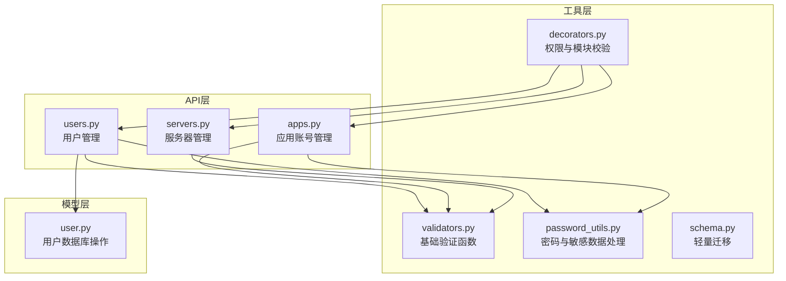
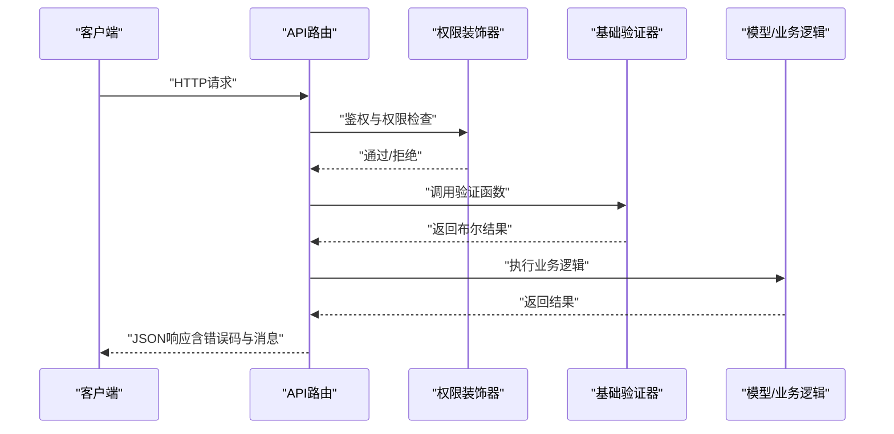
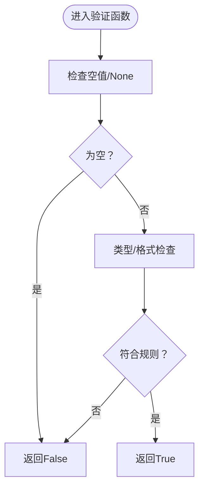
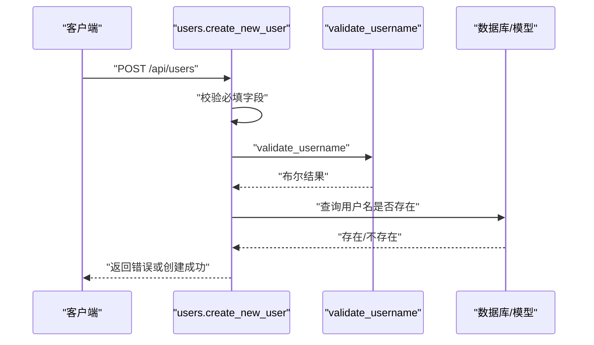
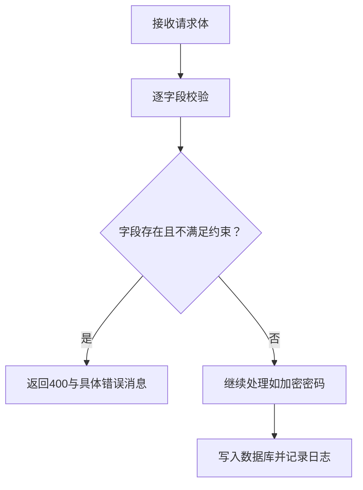
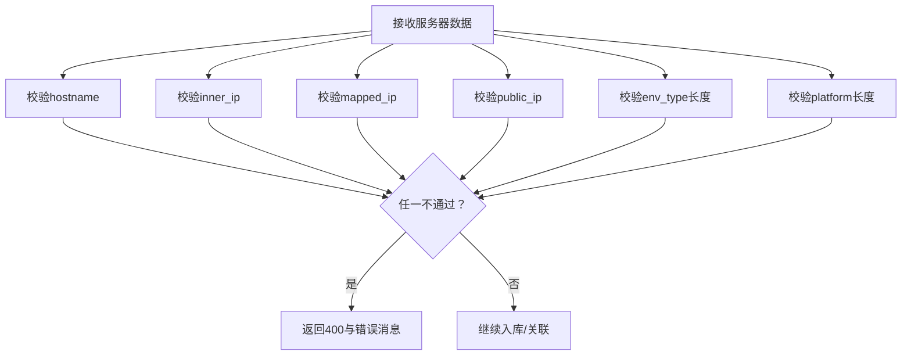
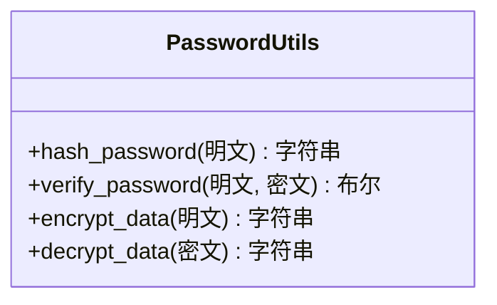
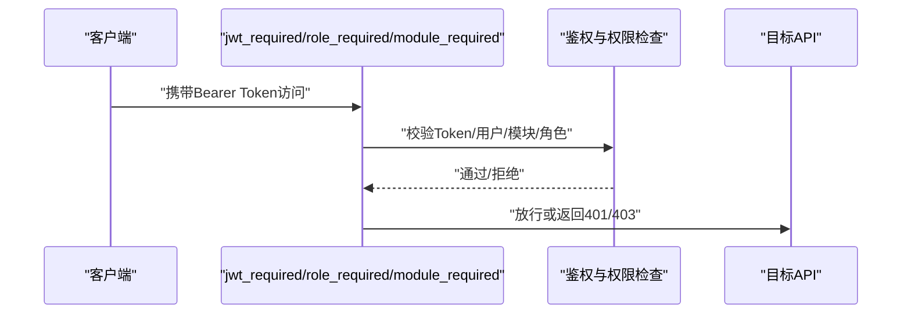
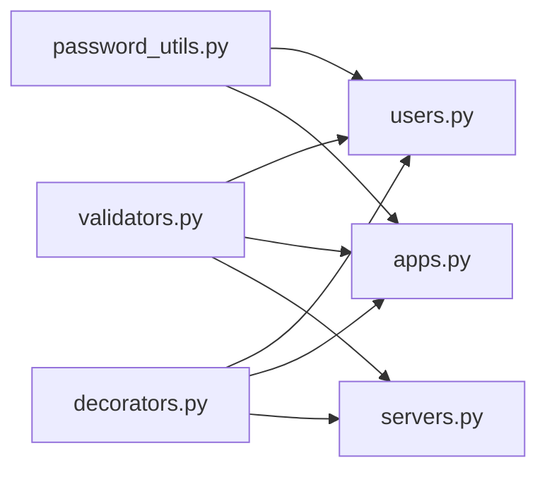

# 数据验证工具

<cite>
**本文引用的文件**
- [validators.py](file://backend/app/utils/validators.py)
- [users.py](file://backend/app/api/users.py)
- [apps.py](file://backend/app/api/apps.py)
- [servers.py](file://backend/app/api/servers.py)
- [password_utils.py](file://backend/app/utils/password_utils.py)
- [user.py](file://backend/app/models/user.py)
- [decorators.py](file://backend/app/utils/decorators.py)
- [schema.py](file://backend/app/utils/schema.py)
</cite>

## 目录
1. [简介](#简介)
2. [项目结构](#项目结构)
3. [核心组件](#核心组件)
4. [架构总览](#架构总览)
5. [详细组件分析](#详细组件分析)
6. [依赖分析](#依赖分析)
7. [性能考虑](#性能考虑)
8. [故障排查指南](#故障排查指南)
9. [结论](#结论)
10. [附录](#附录)

## 简介
本文件面向OPS项目的“数据验证工具”，系统性梳理并解释各类数据验证规则的实现方式，包括：
- 邮箱格式验证
- 手机号码验证（本仓库未提供手机号专用验证器，建议基于字符串长度与正则自行扩展）
- URL格式检查
- IP地址验证
- 主机名与域名验证
- 端口范围验证
- 整数与正整数验证
- 字符串长度验证
- 密码强度与格式验证
- 自定义验证器的创建与使用（正则表达式、业务逻辑、复合字段）
- 验证错误处理与用户友好提示
- 验证器的可复用性与扩展性设计
- 验证规则配置、自定义验证器开发与最佳实践

## 项目结构
验证能力主要集中在工具模块与API层的协作中：
- 工具模块：统一提供基础验证函数，供各API模块按需导入与复用
- API模块：在请求入口处进行输入校验，结合业务规则与错误提示
- 模型与装饰器：与验证结果协同，确保数据一致性与安全性

图表来源
- [validators.py:1-151](file://backend/app/utils/validators.py#L1-L151)
- [users.py:1-290](file://backend/app/api/users.py#L1-L290)
- [apps.py:140-339](file://backend/app/api/apps.py#L140-L339)
- [servers.py:1-200](file://backend/app/api/servers.py#L1-L200)
- [password_utils.py:1-133](file://backend/app/utils/password_utils.py#L1-L133)
- [user.py:1-162](file://backend/app/models/user.py#L1-L162)
- [decorators.py:1-214](file://backend/app/utils/decorators.py#L1-L214)
- [schema.py:1-42](file://backend/app/utils/schema.py#L1-L42)

章节来源
- [validators.py:1-151](file://backend/app/utils/validators.py#L1-L151)
- [users.py:1-290](file://backend/app/api/users.py#L1-L290)
- [apps.py:140-339](file://backend/app/api/apps.py#L140-L339)
- [servers.py:1-200](file://backend/app/api/servers.py#L1-L200)
- [password_utils.py:1-133](file://backend/app/utils/password_utils.py#L1-L133)
- [user.py:1-162](file://backend/app/models/user.py#L1-L162)
- [decorators.py:1-214](file://backend/app/utils/decorators.py#L1-L214)
- [schema.py:1-42](file://backend/app/utils/schema.py#L1-L42)

## 核心组件
- 基础验证器集合：提供IP、主机名、URL、端口、域名、密码、用户名、整数、正整数、字符串长度等通用验证方法
- API层验证集成：在用户、应用账号、服务器等API入口处，统一调用基础验证器，并结合业务规则输出用户友好的错误信息
- 密码与敏感数据处理：提供密码哈希、密码验证、敏感数据对称加解密，保障数据安全
- 权限与模块装饰器：在验证之前确保请求具备合法身份与访问权限

章节来源
- [validators.py:1-151](file://backend/app/utils/validators.py#L1-L151)
- [apps.py:140-339](file://backend/app/api/apps.py#L140-L339)
- [servers.py:1-200](file://backend/app/api/servers.py#L1-L200)
- [password_utils.py:1-133](file://backend/app/utils/password_utils.py#L1-L133)
- [decorators.py:1-214](file://backend/app/utils/decorators.py#L1-L214)

## 架构总览
验证流程在API层形成“请求进入—参数校验—业务处理—响应返回”的闭环，基础验证器作为共享组件贯穿各模块。

图表来源
- [users.py:35-110](file://backend/app/api/users.py#L35-L110)
- [apps.py:140-210](file://backend/app/api/apps.py#L140-L210)
- [servers.py:14-116](file://backend/app/api/servers.py#L14-L116)
- [decorators.py:26-123](file://backend/app/utils/decorators.py#L26-L123)
- [validators.py:1-151](file://backend/app/utils/validators.py#L1-L151)

## 详细组件分析

### 基础验证器（validators.py）
- IP地址验证：支持IPv4与IPv6，使用标准库解析，异常即判定非法
- 主机名验证：长度限制、标签合法性、不允许首尾连字符
- URL验证：要求http/https协议与非空网络位置
- 端口验证：整数范围1~65535
- 域名验证：支持通配符域名，内部委托主机名验证
- 密码强度：至少6位
- 用户名格式：3~20位，仅允许字母、数字、下划线
- 整数与正整数：类型转换与数值范围判断
- 字符串长度：支持最小/最大长度约束

图表来源
- [validators.py:6-17](file://backend/app/utils/validators.py#L6-L17)
- [validators.py:20-38](file://backend/app/utils/validators.py#L20-L38)
- [validators.py:41-57](file://backend/app/utils/validators.py#L41-L57)
- [validators.py:60-71](file://backend/app/utils/validators.py#L60-L71)
- [validators.py:73-85](file://backend/app/utils/validators.py#L73-L85)
- [validators.py:88-95](file://backend/app/utils/validators.py#L88-L95)
- [validators.py:98-109](file://backend/app/utils/validators.py#L98-L109)
- [validators.py:122-133](file://backend/app/utils/validators.py#L122-L133)
- [validators.py:135-142](file://backend/app/utils/validators.py#L135-L142)
- [validators.py:144-151](file://backend/app/utils/validators.py#L144-L151)

章节来源
- [validators.py:1-151](file://backend/app/utils/validators.py#L1-L151)

### 用户管理API中的验证（users.py）
- 请求体必填字段校验：用户名、密码、显示名称均不能为空
- 用户名格式校验：委托基础验证器
- 角色枚举校验：admin/operator/viewer
- 密码长度校验：至少6位
- 重复用户名检查：数据库查询后返回冲突错误
- 成功后记录操作日志

图表来源
- [users.py:35-110](file://backend/app/api/users.py#L35-L110)
- [validators.py:98-109](file://backend/app/utils/validators.py#L98-L109)
- [user.py:36-52](file://backend/app/models/user.py#L36-L52)

章节来源
- [users.py:35-110](file://backend/app/api/users.py#L35-L110)
- [validators.py:98-109](file://backend/app/utils/validators.py#L98-L109)
- [user.py:36-52](file://backend/app/models/user.py#L36-L52)

### 应用账号管理API中的验证（apps.py）
- 名称长度：1~200字符
- 公司名称：最大200字符
- 访问URL：委托URL验证器
- 用户名：最大100字符
- 密码：最大255字符
- 备注：最大500字符
- 更新场景：同上，针对变更字段逐一校验
- 密码字段在入库前进行对称加密

图表来源
- [apps.py:140-210](file://backend/app/api/apps.py#L140-L210)
- [apps.py:219-312](file://backend/app/api/apps.py#L219-L312)
- [validators.py:41-57](file://backend/app/utils/validators.py#L41-L57)
- [validators.py:144-151](file://backend/app/utils/validators.py#L144-L151)
- [password_utils.py:96-114](file://backend/app/utils/password_utils.py#L96-L114)

章节来源
- [apps.py:140-339](file://backend/app/api/apps.py#L140-L339)
- [validators.py:41-57](file://backend/app/utils/validators.py#L41-L57)
- [validators.py:144-151](file://backend/app/utils/validators.py#L144-L151)
- [password_utils.py:96-114](file://backend/app/utils/password_utils.py#L96-L114)

### 服务器管理API中的验证（servers.py）
- 主机名：委托主机名验证器
- 内网/映射/公网IP：委托IP验证器
- 环境类型/平台：长度约束
- CPU/内存：长度约束
- 入库前对敏感字段进行解密展示（与验证器配合）

图表来源
- [servers.py:14-116](file://backend/app/api/servers.py#L14-L116)
- [validators.py:20-38](file://backend/app/utils/validators.py#L20-L38)
- [validators.py:6-17](file://backend/app/utils/validators.py#L6-L17)
- [validators.py:144-151](file://backend/app/utils/validators.py#L144-L151)

章节来源
- [servers.py:14-116](file://backend/app/api/servers.py#L14-L116)
- [validators.py:20-38](file://backend/app/utils/validators.py#L20-L38)
- [validators.py:6-17](file://backend/app/utils/validators.py#L6-L17)
- [validators.py:144-151](file://backend/app/utils/validators.py#L144-L151)

### 密码与敏感数据处理（password_utils.py）
- 密码哈希：bcrypt，不可逆
- 密码验证：兼容多种格式（bcrypt/werkzeug scrypt）
- 敏感数据对称加解密：Fernet，支持从任意字符串派生密钥
- 开发与生产密钥策略：开发默认密钥与环境变量开关

图表来源
- [password_utils.py:55-94](file://backend/app/utils/password_utils.py#L55-L94)
- [password_utils.py:96-133](file://backend/app/utils/password_utils.py#L96-L133)

章节来源
- [password_utils.py:1-133](file://backend/app/utils/password_utils.py#L1-L133)

### 权限与模块装饰器（decorators.py）
- JWT认证：校验Authorization头、解析payload、用户存在与启用状态、密码修改时间与签发时间比较
- 角色权限：admin直通，其他角色检查模块权限映射
- 模块权限：admin直通，其他角色查询角色模块表

图表来源
- [decorators.py:26-123](file://backend/app/utils/decorators.py#L26-L123)
- [decorators.py:126-162](file://backend/app/utils/decorators.py#L126-L162)
- [decorators.py:165-213](file://backend/app/utils/decorators.py#L165-L213)

章节来源
- [decorators.py:1-214](file://backend/app/utils/decorators.py#L1-L214)

### 轻量迁移（schema.py）
- 启动时幂等补全数据库列（如新增password_changed_at），避免全量重建
- 异常捕获与日志记录，保证应用启动稳定性

章节来源
- [schema.py:10-42](file://backend/app/utils/schema.py#L10-L42)

## 依赖分析
- 组件内聚与耦合
  - 基础验证器高度内聚，职责单一，被多API模块复用
  - API模块仅负责组合验证器与业务逻辑，降低复杂度
  - 密码工具与验证器解耦，通过调用关系连接
- 外部依赖
  - 标准库：re、ipaddress、urllib.parse、bcrypt、cryptography
  - Flask装饰器链：jwt_required、role_required、module_required
- 循环依赖规避
  - 装饰器延迟导入模型模块，避免循环引用

图表来源
- [validators.py:1-151](file://backend/app/utils/validators.py#L1-L151)
- [users.py:1-290](file://backend/app/api/users.py#L1-L290)
- [apps.py:140-339](file://backend/app/api/apps.py#L140-L339)
- [servers.py:1-200](file://backend/app/api/servers.py#L1-L200)
- [password_utils.py:1-133](file://backend/app/utils/password_utils.py#L1-L133)
- [decorators.py:1-214](file://backend/app/utils/decorators.py#L1-L214)

章节来源
- [validators.py:1-151](file://backend/app/utils/validators.py#L1-L151)
- [users.py:1-290](file://backend/app/api/users.py#L1-L290)
- [apps.py:140-339](file://backend/app/api/apps.py#L140-L339)
- [servers.py:1-200](file://backend/app/api/servers.py#L1-L200)
- [password_utils.py:1-133](file://backend/app/utils/password_utils.py#L1-L133)
- [decorators.py:1-214](file://backend/app/utils/decorators.py#L1-L214)

## 性能考虑
- 正则与解析开销
  - URL与IP解析属于O(1)级别，但正则匹配在高频场景下仍需关注
- 缓存与预编译
  - 可将常用正则编译为对象并缓存，减少重复编译成本
- I/O与数据库查询
  - 重复用户名检查与项目名称冲突检测应尽量走索引，避免全表扫描
- 错误短路
  - 在首个校验失败时尽早返回，减少后续昂贵操作

## 故障排查指南
- 常见错误与定位
  - 400类：请求体为空、必填字段缺失、字段格式不满足验证器约束
  - 401类：缺少或无效的认证信息、Token过期或密码修改导致失效
  - 403类：角色或模块权限不足
  - 409类：唯一性冲突（如用户名、项目名、域名）
  - 500类：数据库异常、加密/解密失败、未预期异常
- 定位步骤
  - 查看API返回的错误码与消息，确认触发点
  - 检查对应验证器的输入类型与边界值
  - 核对装饰器链顺序与权限配置
  - 关注schema迁移日志，确认数据库列补全是否成功

章节来源
- [users.py:35-110](file://backend/app/api/users.py#L35-L110)
- [apps.py:140-210](file://backend/app/api/apps.py#L140-L210)
- [servers.py:14-116](file://backend/app/api/servers.py#L14-L116)
- [decorators.py:26-123](file://backend/app/utils/decorators.py#L26-L123)
- [schema.py:10-42](file://backend/app/utils/schema.py#L10-L42)

## 结论
OPS项目的验证体系以“基础验证器+API层组合校验+装饰器权限控制”为核心，实现了高内聚、低耦合、可复用与可扩展的数据验证机制。通过统一的验证器与清晰的错误提示，既提升了用户体验，也增强了系统的安全性与稳定性。建议在现有基础上持续完善复合字段验证与手机号等专项验证，进一步提升业务覆盖度与可维护性。

## 附录

### 验证规则配置与最佳实践
- 规则配置
  - 字符串长度：通过validators.py的字符串长度验证器统一管理
  - URL/IP/主机名：通过对应验证器集中处理
  - 密码强度：通过validators.py与password_utils.py共同保障
- 最佳实践
  - 在API入口统一调用验证器，避免重复逻辑
  - 使用明确的错误消息，帮助用户快速定位问题
  - 对敏感字段采用对称加密存储，遵循最小暴露原则
  - 严格区分“格式校验”与“业务校验”，前者用验证器，后者在API层实现
  - 为高频路径引入缓存与预编译，优化正则与解析性能