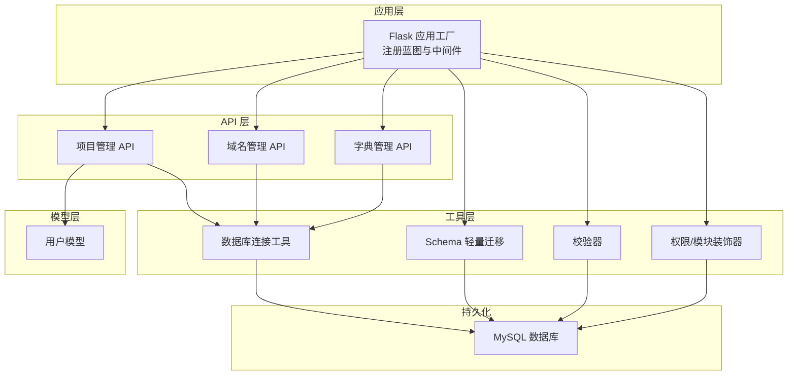
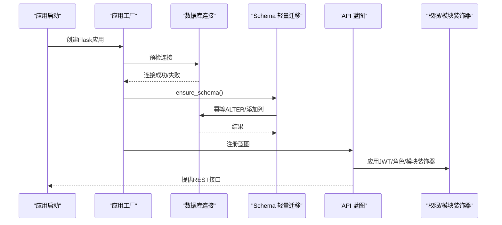
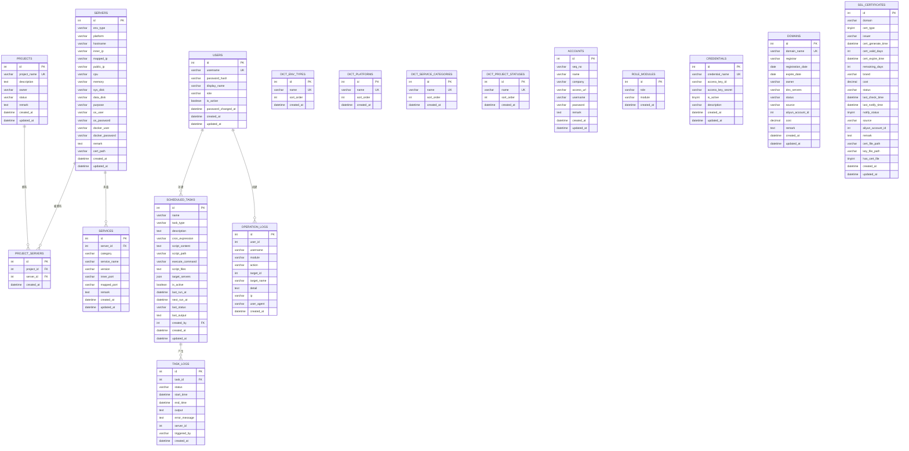
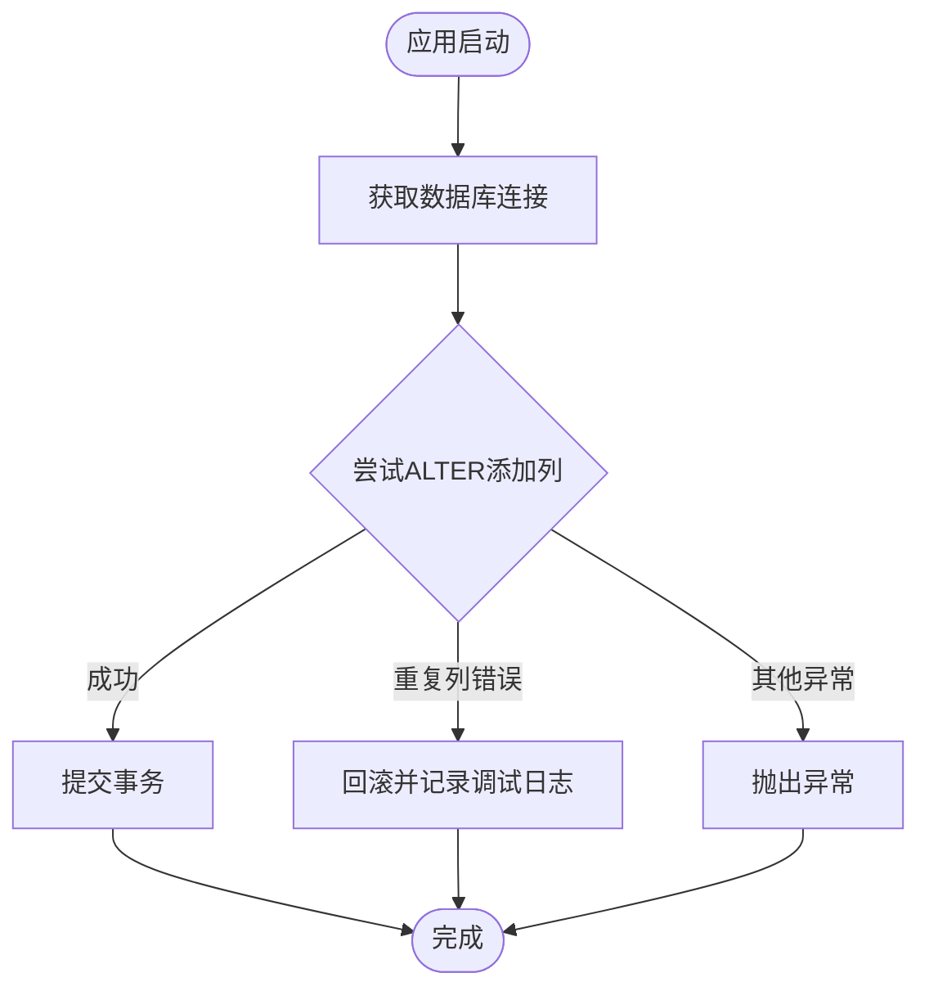
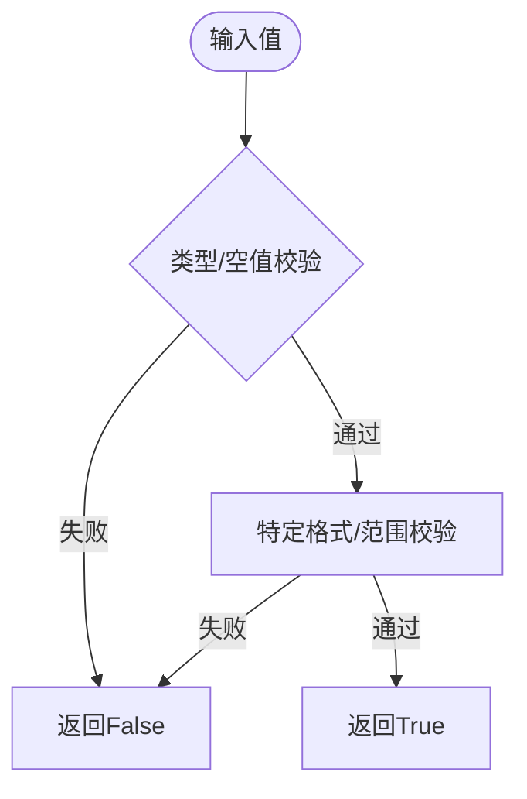
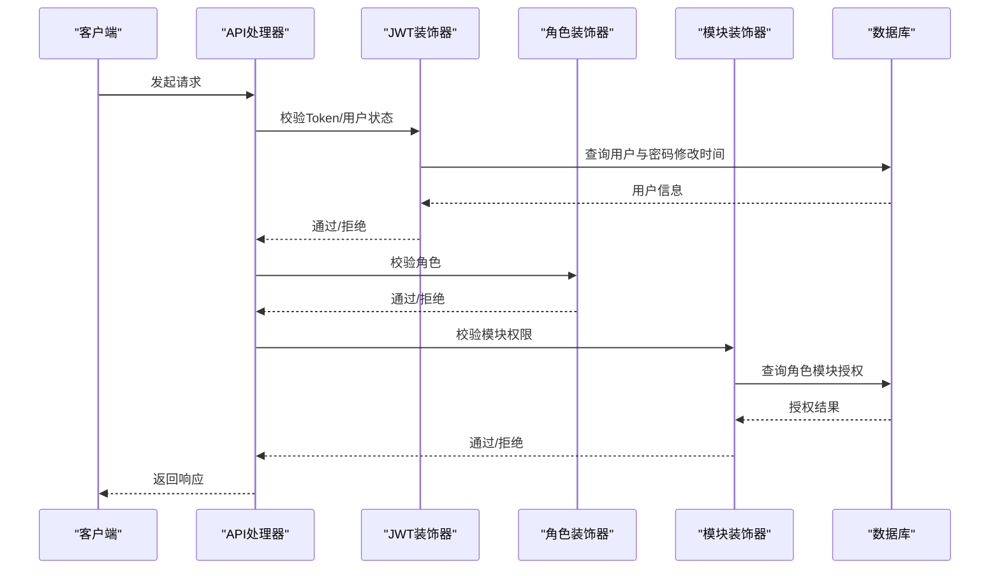
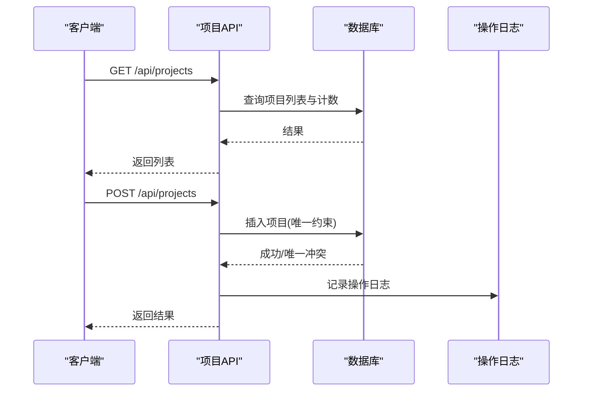
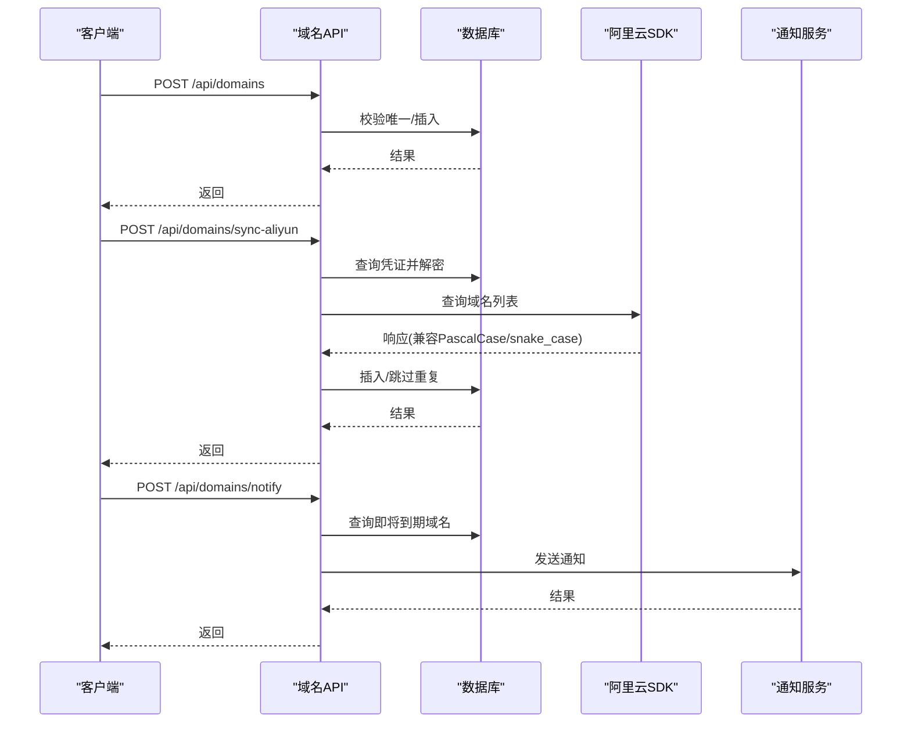
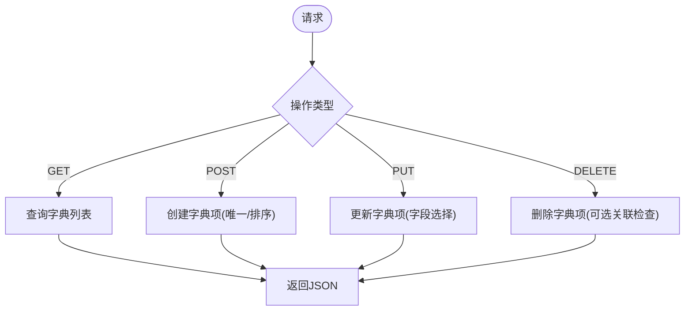
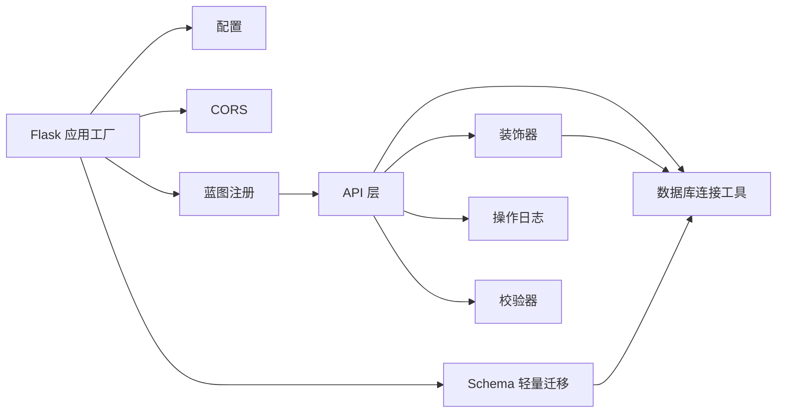

# 模式管理工具

<cite>
**本文引用的文件**
- [backend/app/utils/schema.py](file://backend/app/utils/schema.py)
- [backend/app/utils/validators.py](file://backend/app/utils/validators.py)
- [backend/app/api/dicts.py](file://backend/app/api/dicts.py)
- [backend/app/api/domains.py](file://backend/app/api/domains.py)
- [backend/app/api/projects.py](file://backend/app/api/projects.py)
- [backend/app/utils/db.py](file://backend/app/utils/db.py)
- [backend/app/utils/decorators.py](file://backend/app/utils/decorators.py)
- [backend/app/models/user.py](file://backend/app/models/user.py)
- [backend/init_db.py](file://backend/init_db.py)
- [backend/app/config.py](file://backend/app/config.py)
- [backend/app/__init__.py](file://backend/app/__init__.py)
- [backend/requirements.txt](file://backend/requirements.txt)
</cite>

## 目录
1. [简介](#简介)
2. [项目结构](#项目结构)
3. [核心组件](#核心组件)
4. [架构总览](#架构总览)
5. [详细组件分析](#详细组件分析)
6. [依赖分析](#依赖分析)
7. [性能考虑](#性能考虑)
8. [故障排查指南](#故障排查指南)
9. [结论](#结论)
10. [附录](#附录)

## 简介
本文件面向“OPS项目模式管理工具”的技术文档，聚焦于数据模式的定义与管理、字段类型与约束、默认值配置、模式验证机制（类型、范围、格式）、模式版本与兼容性处理、动态模式生成与继承机制，并提供模式定义示例、验证规则配置与模式演进指南。文档基于仓库中的数据库初始化脚本、API层、工具层与配置层进行系统化梳理，帮助开发者与运维人员快速理解并扩展模式体系。

## 项目结构
后端采用Flask应用，按功能模块组织蓝图（Blueprint），核心目录如下：
- app/api：各业务模块API（如项目、域名、字典）
- app/utils：通用工具（数据库连接、模式迁移、校验器、装饰器等）
- app/models：模型层（用户等）
- init_db.py：数据库初始化与全量建表
- app/config.py：应用配置
- app/__init__.py：应用工厂、蓝图注册、CORS、日志与Schema迁移入口

图表来源
- [backend/app/__init__.py:116-151](file://backend/app/__init__.py#L116-L151)
- [backend/app/api/projects.py:1-547](file://backend/app/api/projects.py#L1-L547)
- [backend/app/api/domains.py:1-670](file://backend/app/api/domains.py#L1-L670)
- [backend/app/api/dicts.py:1-263](file://backend/app/api/dicts.py#L1-L263)
- [backend/app/utils/db.py:1-80](file://backend/app/utils/db.py#L1-L80)
- [backend/app/utils/schema.py:1-42](file://backend/app/utils/schema.py#L1-L42)
- [backend/app/utils/validators.py:1-151](file://backend/app/utils/validators.py#L1-L151)
- [backend/app/utils/decorators.py:1-214](file://backend/app/utils/decorators.py#L1-L214)
- [backend/app/models/user.py:1-162](file://backend/app/models/user.py#L1-L162)

章节来源
- [backend/app/__init__.py:28-113](file://backend/app/__init__.py#L28-L113)
- [backend/app/__init__.py:116-151](file://backend/app/__init__.py#L116-L151)

## 核心组件
- 数据库初始化与全量建表：负责创建核心表、字典表、索引与外键约束，确保初始模式完整。
- Schema 轻量迁移：在应用启动时进行幂等的列级变更，补充缺失列与注释，保证运行时模式一致性。
- 校验器：提供IP、主机名、URL、端口、域名、密码、用户名、邮箱、整数、正整数、字符串长度等校验逻辑。
- 权限与模块装饰器：统一鉴权、角色与模块访问控制，保障API层面的模式使用边界。
- API 层：围绕项目、域名、字典等实体提供CRUD与业务流程，体现模式的实际使用与约束。
- 模型层：用户模型封装用户相关数据库操作，体现字段与约束的使用。

章节来源
- [backend/init_db.py:24-431](file://backend/init_db.py#L24-L431)
- [backend/app/utils/schema.py:10-42](file://backend/app/utils/schema.py#L10-L42)
- [backend/app/utils/validators.py:1-151](file://backend/app/utils/validators.py#L1-L151)
- [backend/app/utils/decorators.py:26-214](file://backend/app/utils/decorators.py#L26-L214)
- [backend/app/api/projects.py:13-547](file://backend/app/api/projects.py#L13-L547)
- [backend/app/api/domains.py:34-670](file://backend/app/api/domains.py#L34-L670)
- [backend/app/api/dicts.py:118-263](file://backend/app/api/dicts.py#L118-L263)
- [backend/app/models/user.py:8-162](file://backend/app/models/user.py#L8-L162)

## 架构总览
应用启动时，先进行数据库连接预检，随后执行Schema轻量迁移，确保运行时模式与期望一致。API层通过装饰器进行鉴权与模块权限控制，工具层提供数据库连接、校验与迁移能力，模型层封装用户相关操作。

图表来源
- [backend/app/__init__.py:88-113](file://backend/app/__init__.py#L88-L113)
- [backend/app/utils/schema.py:10-42](file://backend/app/utils/schema.py#L10-L42)
- [backend/app/utils/decorators.py:26-214](file://backend/app/utils/decorators.py#L26-L214)

## 详细组件分析

### 数据库初始化与全量建表（模式定义）
- 负责创建用户、服务器、项目、服务、字典、账号、定时任务、任务日志、操作日志、角色模块授权、云凭证、域名、证书等表。
- 定义字段类型、非空约束、唯一约束、索引与外键，确保数据完整性与查询效率。
- 为现有表动态添加project_id字段，体现模式演进与兼容性处理。

图表来源
- [backend/init_db.py:35-393](file://backend/init_db.py#L35-L393)

章节来源
- [backend/init_db.py:24-431](file://backend/init_db.py#L24-L431)

### Schema 轻量迁移（运行时模式补丁）
- 在应用上下文中执行，确保新增列（如用户密码修改时间）存在且具备注释与默认值。
- 使用事务与异常捕获，对重复列名错误进行幂等处理，保证多次启动不报错。

图表来源
- [backend/app/utils/schema.py:10-42](file://backend/app/utils/schema.py#L10-L42)

章节来源
- [backend/app/utils/schema.py:10-42](file://backend/app/utils/schema.py#L10-L42)

### 校验器（模式验证机制）
- 提供IP、主机名、URL、端口、域名、密码、用户名、邮箱、整数、正整数、字符串长度等校验方法。
- 作为API层输入校验与业务规则的基础，确保写入数据库前的数据质量。

图表来源
- [backend/app/utils/validators.py:6-151](file://backend/app/utils/validators.py#L6-L151)

章节来源
- [backend/app/utils/validators.py:1-151](file://backend/app/utils/validators.py#L1-L151)

### 权限与模块装饰器（访问控制与模式边界）
- JWT认证：校验令牌有效性、用户存在与启用状态、密码修改时间与签发时间关系。
- 角色权限：限定操作角色集合。
- 模块权限：基于角色-模块授权表，控制模块访问。

图表来源
- [backend/app/utils/decorators.py:26-214](file://backend/app/utils/decorators.py#L26-L214)
- [backend/app/models/user.py:36-71](file://backend/app/models/user.py#L36-L71)

章节来源
- [backend/app/utils/decorators.py:26-214](file://backend/app/utils/decorators.py#L26-L214)
- [backend/app/models/user.py:8-162](file://backend/app/models/user.py#L8-L162)

### 项目管理API（模式使用范例）
- 提供项目CRUD、关联服务器、查询详情与聚合资源统计。
- 使用数据库连接工具与操作日志工具，体现模式约束与业务流程。

图表来源
- [backend/app/api/projects.py:13-547](file://backend/app/api/projects.py#L13-L547)
- [backend/app/utils/db.py:43-80](file://backend/app/utils/db.py#L43-L80)

章节来源
- [backend/app/api/projects.py:13-547](file://backend/app/api/projects.py#L13-L547)
- [backend/app/utils/db.py:1-80](file://backend/app/utils/db.py#L1-L80)

### 域名管理API（模式验证与外部集成）
- 提供域名CRUD、阿里云同步、到期通知等功能。
- 对输入进行格式与范围校验，结合阿里云SDK解析响应，兼容多种命名风格。

图表来源
- [backend/app/api/domains.py:114-670](file://backend/app/api/domains.py#L114-L670)
- [backend/app/utils/db.py:43-80](file://backend/app/utils/db.py#L43-L80)

章节来源
- [backend/app/api/domains.py:114-670](file://backend/app/api/domains.py#L114-L670)
- [backend/app/utils/db.py:1-80](file://backend/app/utils/db.py#L1-L80)

### 字典管理API（模式字典与约束）
- 提供环境类型、平台、服务分类等字典的增删改查，支持排序与唯一约束。
- 通用方法封装查询、创建、更新、删除，减少重复SQL与异常处理。

图表来源
- [backend/app/api/dicts.py:16-263](file://backend/app/api/dicts.py#L16-L263)

章节来源
- [backend/app/api/dicts.py:118-263](file://backend/app/api/dicts.py#L118-L263)

### 用户模型（字段与约束使用）
- 用户表包含用户名唯一、角色默认值、激活状态、密码修改时间等字段。
- 提供创建、查询、更新、删除与密码更新等操作，体现模式约束与业务规则。

章节来源
- [backend/app/models/user.py:8-162](file://backend/app/models/user.py#L8-L162)
- [backend/init_db.py:35-49](file://backend/init_db.py#L35-L49)

## 依赖分析
- Flask应用通过应用工厂集中配置，注册蓝图与CORS，注入配置与日志。
- 数据库连接工具提供Flask上下文缓存与连接超时控制。
- Schema迁移与API层均依赖数据库连接工具。
- API层依赖装饰器进行权限控制，模型层依赖数据库连接工具。

图表来源
- [backend/app/__init__.py:28-113](file://backend/app/__init__.py#L28-L113)
- [backend/app/utils/db.py:43-80](file://backend/app/utils/db.py#L43-L80)
- [backend/app/utils/schema.py:10-42](file://backend/app/utils/schema.py#L10-L42)
- [backend/app/utils/decorators.py:26-214](file://backend/app/utils/decorators.py#L26-L214)

章节来源
- [backend/app/__init__.py:28-113](file://backend/app/__init__.py#L28-L113)
- [backend/app/utils/db.py:1-80](file://backend/app/utils/db.py#L1-L80)
- [backend/app/utils/schema.py:10-42](file://backend/app/utils/schema.py#L10-L42)
- [backend/app/utils/decorators.py:26-214](file://backend/app/utils/decorators.py#L26-L214)

## 性能考虑
- 索引设计：在高频查询字段（如用户名、项目名、状态、IP、域名等）建立索引，提升查询性能。
- 连接池与上下文缓存：数据库连接在Flask应用上下文中缓存，减少连接开销。
- 批量操作：在导入/同步场景（如域名同步）中批量插入，减少往返次数。
- 日志级别：生产环境降低pymysql日志级别，避免噪声影响性能。

## 故障排查指南
- 数据库连接失败：检查环境变量与网络连通性，查看启动日志中的连接预检信息。
- Schema迁移失败：关注重复列错误的幂等处理与异常堆栈，确认数据库权限。
- API权限错误：确认JWT令牌格式、角色与模块授权配置，检查用户状态与密码修改时间。
- 校验失败：根据校验器返回结果定位输入格式问题（如IP、端口、域名、用户名等）。

章节来源
- [backend/app/__init__.py:88-113](file://backend/app/__init__.py#L88-L113)
- [backend/app/utils/schema.py:14-41](file://backend/app/utils/schema.py#L14-L41)
- [backend/app/utils/decorators.py:35-123](file://backend/app/utils/decorators.py#L35-L123)
- [backend/app/utils/validators.py:6-151](file://backend/app/utils/validators.py#L6-L151)

## 结论
本模式管理工具通过“全量建表+轻量迁移”的双轨策略，确保数据库模式在初始化与运行时的一致性；通过装饰器与校验器形成“访问控制+输入验证”的双重保障；通过API层体现模式的实际使用与演进。建议在新增字段或表时遵循“先迁移、后API”的流程，并持续完善校验规则与日志追踪，以提升系统的稳定性与可维护性。

## 附录

### 模式验证规则配置示例（路径指引）
- IP/主机名/URL/端口/域名/密码/用户名/邮箱/整数/正整数/字符串长度：参考校验器文件路径
  - [backend/app/utils/validators.py:1-151](file://backend/app/utils/validators.py#L1-L151)
- API层输入校验（示例：项目创建、域名创建、字典项创建）：参考API文件路径
  - [backend/app/api/projects.py:113-171](file://backend/app/api/projects.py#L113-L171)
  - [backend/app/api/domains.py:118-192](file://backend/app/api/domains.py#L118-L192)
  - [backend/app/api/dicts.py:127-156](file://backend/app/api/dicts.py#L127-L156)

### 模式演进与兼容性处理指南
- 新增字段：使用Schema轻量迁移进行幂等ALTER，避免破坏现有数据。
  - [backend/app/utils/schema.py:10-42](file://backend/app/utils/schema.py#L10-L42)
- 修改约束：在全量建表脚本中更新约束定义，确保新部署一致性。
  - [backend/init_db.py:35-393](file://backend/init_db.py#L35-L393)
- 外键与索引：在新增表或字段时补充必要的索引与外键，保证查询与一致性。
  - [backend/init_db.py:96-109](file://backend/init_db.py#L96-L109)
- 动态模式生成：通过工具层抽象通用SQL构造（如字典管理的通用查询/更新），减少重复与错误。
  - [backend/app/api/dicts.py:16-115](file://backend/app/api/dicts.py#L16-L115)

### 配置与环境变量
- 数据库与JWT配置、CORS、通知与调度等参数通过环境变量注入。
  - [backend/app/config.py:10-58](file://backend/app/config.py#L10-L58)
- 依赖包与版本要求：
  - [backend/requirements.txt:1-17](file://backend/requirements.txt#L1-L17)