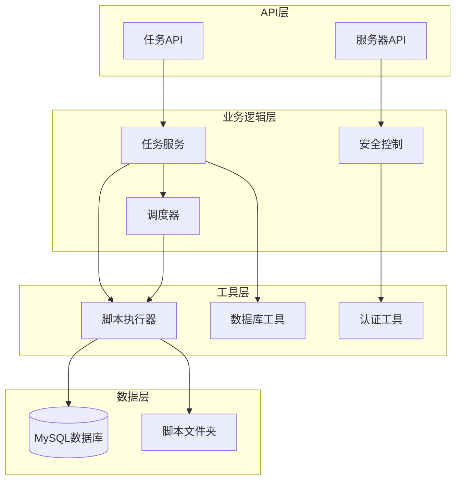
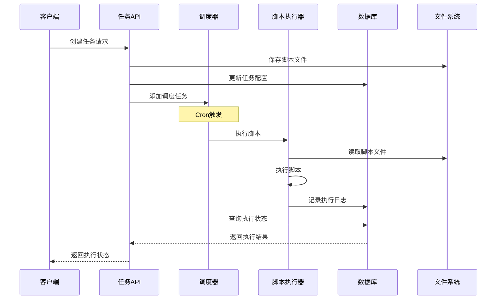
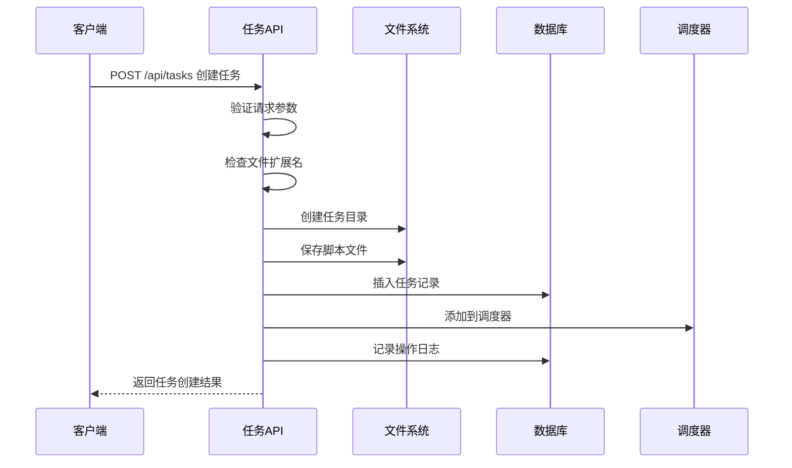
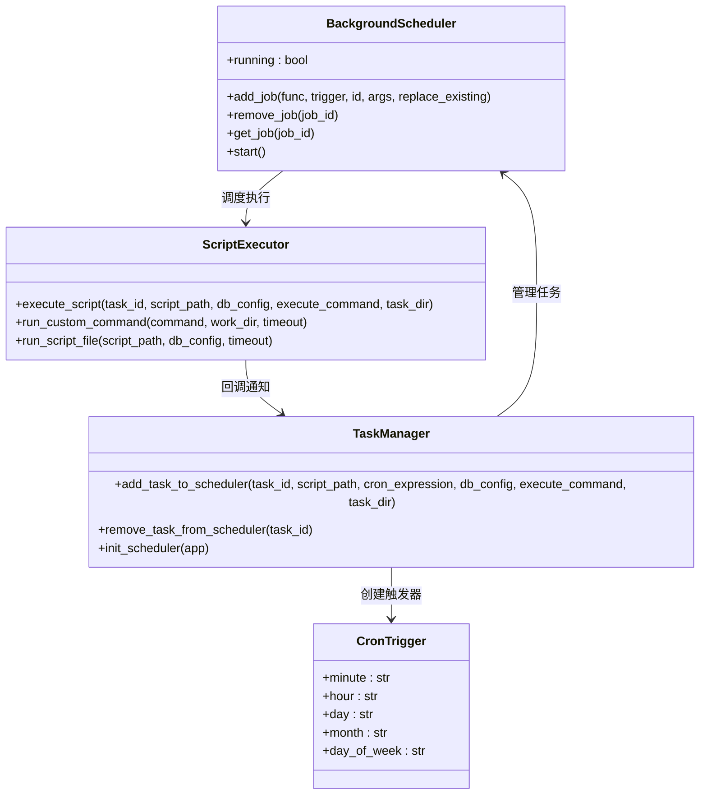
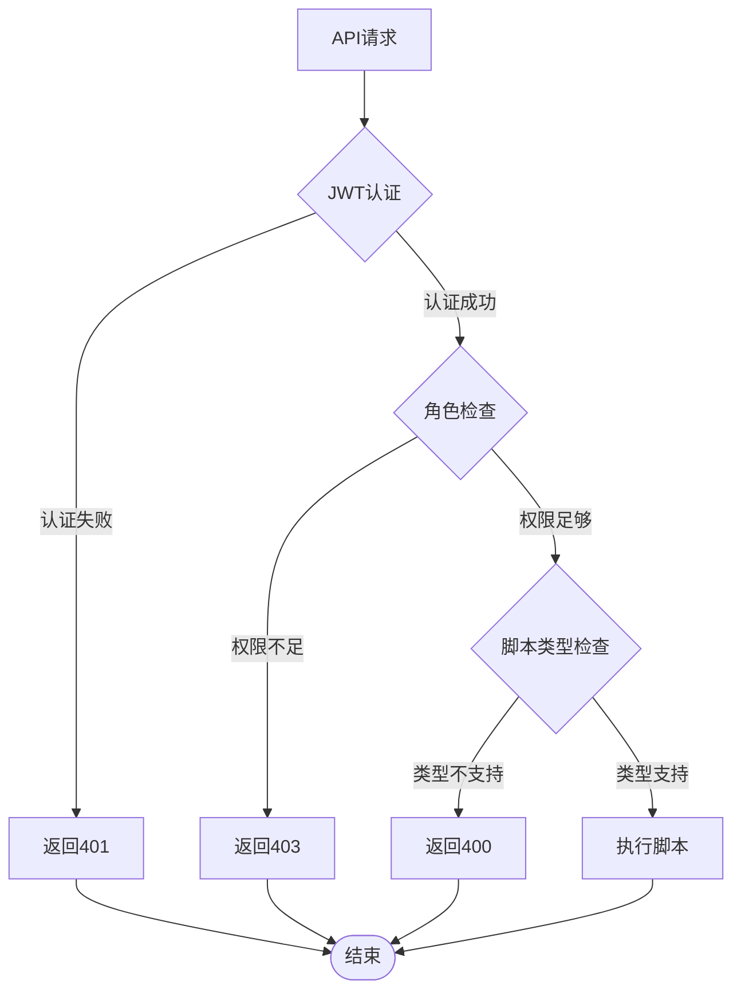
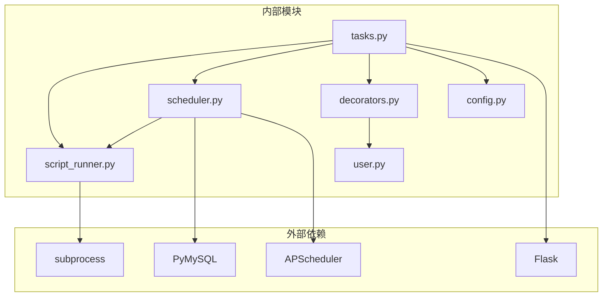

# 脚本执行工具

<cite>
**本文档引用的文件**
- [script_runner.py](file://backend/app/utils/script_runner.py)
- [tasks.py](file://backend/app/api/tasks.py)
- [scheduler.py](file://backend/app/utils/scheduler.py)
- [decorators.py](file://backend/app/utils/decorators.py)
- [config.py](file://backend/app/config.py)
- [user.py](file://backend/app/models/user.py)
- [init_db.py](file://backend/init_db.py)
</cite>

## 目录
1. [简介](#简介)
2. [项目结构](#项目结构)
3. [核心组件](#核心组件)
4. [架构概览](#架构概览)
5. [详细组件分析](#详细组件分析)
6. [依赖关系分析](#依赖关系分析)
7. [性能考虑](#性能考虑)
8. [故障排除指南](#故障排除指南)
9. [结论](#结论)
10. [附录](#附录)

## 简介

OPS项目脚本执行工具是一个基于Python Flask框架构建的自动化脚本执行平台，专门设计用于管理和执行各种类型的自动化脚本。该工具提供了完整的脚本生命周期管理，包括脚本上传、执行、监控和日志记录功能。

该系统支持多种脚本类型，包括Python脚本、Shell脚本和SQL脚本，通过统一的接口实现了跨平台的脚本执行能力。系统采用异步执行机制，确保长时间运行的脚本不会阻塞主进程，同时提供了完善的错误处理和超时控制机制。

## 项目结构

脚本执行工具采用典型的三层架构设计，主要分为API层、业务逻辑层和工具层：



**图表来源**
- [tasks.py:1-667](file://backend/app/api/tasks.py#L1-L667)
- [scheduler.py:1-580](file://backend/app/utils/scheduler.py#L1-L580)
- [script_runner.py:1-126](file://backend/app/utils/script_runner.py#L1-L126)

**章节来源**
- [tasks.py:1-667](file://backend/app/api/tasks.py#L1-L667)
- [config.py:1-58](file://backend/app/config.py#L1-L58)

## 核心组件

### 脚本执行器 (ScriptRunner)

脚本执行器是整个系统的核心组件，负责实际的脚本执行工作。它支持三种主要的脚本类型：

1. **Python脚本 (.py)**: 使用系统Python解释器直接执行
2. **Shell脚本 (.sh)**: 自动检测并使用bash或sh解释器
3. **SQL脚本 (.sql)**: 通过mysql客户端执行数据库脚本

### 任务管理系统

任务管理系统提供了完整的任务生命周期管理功能：
- 任务创建和配置
- 脚本文件上传和管理
- Cron表达式调度
- 手动执行控制
- 执行状态监控

### 调度器系统

调度器系统基于APScheduler实现，提供了强大的定时任务执行能力：
- Cron表达式解析和执行
- 多任务并发控制
- 异步执行机制
- 错误恢复和重试

**章节来源**
- [script_runner.py:1-126](file://backend/app/utils/script_runner.py#L1-L126)
- [tasks.py:1-667](file://backend/app/api/tasks.py#L1-L667)
- [scheduler.py:1-580](file://backend/app/utils/scheduler.py#L1-L580)

## 架构概览

系统采用微服务架构设计，各个组件通过清晰的接口进行交互：



**图表来源**
- [tasks.py:498-631](file://backend/app/api/tasks.py#L498-L631)
- [scheduler.py:39-178](file://backend/app/utils/scheduler.py#L39-L178)
- [script_runner.py:49-115](file://backend/app/utils/script_runner.py#L49-L115)

## 详细组件分析

### 脚本执行器组件

脚本执行器是系统中最核心的组件，负责实际的脚本执行工作。它采用了工厂模式的设计，根据脚本类型自动选择合适的执行方式。

#### 执行流程图

```mermaid
flowchart TD
Start([开始执行]) --> CheckType{检查脚本类型}
CheckType --> |Python (.py)| PyExec[Python执行器]
CheckType --> |Shell (.sh)| ShExec[Shell执行器]
CheckType --> |SQL (.sql)| SqlExec[SQL执行器]
PyExec --> PyRun[使用sys.executable执行]
ShExec --> DetectShell{检测shell环境}
DetectShell --> |bash可用| BashRun[使用bash执行]
DetectShell --> |sh可用| ShRun[使用sh执行]
DetectShell --> |都不可用| ShellError[抛出RuntimeError]
SqlExec --> CheckDB{检查数据库配置}
CheckDB --> |配置完整| MysqlRun[使用mysql客户端执行]
CheckDB --> |配置缺失| DbError[抛出RuntimeError]
PyRun --> CaptureOutput[捕获输出]
BashRun --> CaptureOutput
ShRun --> CaptureOutput
MysqlRun --> CaptureOutput
CaptureOutput --> TimeoutCheck{检查超时}
TimeoutCheck --> |超时| TimeoutError[抛出TimeoutExpired]
TimeoutCheck --> |正常| UpdateStatus[更新执行状态]
UpdateStatus --> LogResult[记录执行结果]
LogResult --> End([执行完成])
TimeoutError --> LogError[记录错误]
ShellError --> LogError
DbError --> LogError
LogError --> End
```

**图表来源**
- [script_runner.py:19-115](file://backend/app/utils/script_runner.py#L19-L115)

#### 脚本类型支持

系统支持以下脚本类型的执行：

| 脚本类型 | 执行方式 | 环境要求 | 输出捕获 |
|---------|----------|----------|----------|
| Python (.py) | `sys.executable script_path` | Python解释器 | ✓ |
| Shell (.sh) | `bash script_path` 或 `sh script_path` | bash/sh解释器 | ✓ |
| SQL (.sql) | `mysql -u user -p password database` | mysql客户端 | ✓ |

**章节来源**
- [script_runner.py:49-115](file://backend/app/utils/script_runner.py#L49-L115)

### 任务管理组件

任务管理组件提供了完整的任务生命周期管理功能，包括任务的创建、更新、删除和执行控制。

#### 任务创建流程



**图表来源**
- [tasks.py:144-254](file://backend/app/api/tasks.py#L144-L254)

#### 任务执行策略

系统提供了两种主要的任务执行策略：

1. **自定义命令模式**: 使用用户提供的自定义命令执行
2. **脚本文件模式**: 直接执行上传的脚本文件

**章节来源**
- [tasks.py:144-254](file://backend/app/api/tasks.py#L144-L254)
- [tasks.py:257-375](file://backend/app/api/tasks.py#L257-L375)

### 调度器组件

调度器组件基于APScheduler实现，提供了强大的定时任务执行能力。它支持复杂的Cron表达式，并能够处理任务的并发执行。

#### 调度器架构



**图表来源**
- [scheduler.py:1-580](file://backend/app/utils/scheduler.py#L1-L580)

#### 并发控制策略

调度器采用了线程池和锁机制来控制并发执行：

1. **线程隔离**: 每个任务在独立的线程中执行
2. **超时控制**: 统一的300秒超时限制
3. **资源清理**: 自动清理执行完成的线程
4. **错误隔离**: 单个任务的错误不影响其他任务

**章节来源**
- [scheduler.py:175-178](file://backend/app/utils/scheduler.py#L175-L178)

### 安全控制组件

系统实现了多层次的安全控制机制，确保脚本执行的安全性。

#### 权限控制机制



**图表来源**
- [decorators.py:26-163](file://backend/app/utils/decorators.py#L26-L163)

#### 脚本类型白名单

系统实现了严格的脚本类型白名单机制：

| 脚本类型 | 允许上传 | 允许执行 | 安全级别 |
|---------|----------|----------|----------|
| Python (.py) | ✅ | ✅ | 中等 |
| Shell (.sh) | ✅ | ✅ | 中等 |
| SQL (.sql) | ❌ | ✅ | 高风险 |
| 批处理 (.bat) | ❌ | ❌ | 不支持 |

**章节来源**
- [decorators.py:26-163](file://backend/app/utils/decorators.py#L26-L163)
- [script_runner.py:118-126](file://backend/app/utils/script_runner.py#L118-L126)

## 依赖关系分析

系统采用模块化设计，各组件之间的依赖关系清晰明确：



**图表来源**
- [tasks.py:1-18](file://backend/app/api/tasks.py#L1-L18)
- [scheduler.py:1-13](file://backend/app/utils/scheduler.py#L1-L13)
- [script_runner.py:1-8](file://backend/app/utils/script_runner.py#L1-L8)

### 关键依赖关系

1. **TaskAPI → ScriptRunner**: 任务API依赖脚本执行器进行实际执行
2. **TaskAPI → Scheduler**: 任务API依赖调度器进行定时执行
3. **Scheduler → ScriptRunner**: 调度器依赖脚本执行器进行脚本执行
4. **Decorators → UserModel**: 权限装饰器依赖用户模型进行身份验证

**章节来源**
- [tasks.py:1-18](file://backend/app/api/tasks.py#L1-L18)
- [scheduler.py:1-13](file://backend/app/utils/scheduler.py#L1-L13)

## 性能考虑

系统在设计时充分考虑了性能优化，采用了多种策略来提升执行效率：

### 并发执行策略

1. **线程池管理**: 每个任务在独立线程中执行，避免阻塞
2. **超时控制**: 统一的300秒超时限制，防止长时间占用
3. **资源回收**: 自动清理已完成任务的线程资源
4. **错误隔离**: 单个任务失败不影响整体系统稳定性

### 内存管理

1. **输出截断**: 执行输出最多保存500字符，避免内存溢出
2. **临时文件**: 脚本文件存储在临时目录，执行完成后自动清理
3. **连接池**: 数据库连接采用独立连接，避免连接泄漏

### 网络优化

1. **异步执行**: 手动执行任务立即返回，后台异步执行
2. **批量操作**: 支持多文件上传和批量任务管理
3. **缓存机制**: 任务状态和配置信息采用缓存策略

## 故障排除指南

### 常见问题及解决方案

#### 脚本执行超时

**问题描述**: 脚本执行超过300秒导致超时

**可能原因**:
1. 脚本逻辑过于复杂
2. 网络连接超时
3. 数据库查询耗时过长

**解决方案**:
1. 优化脚本算法，减少不必要的循环
2. 添加适当的超时参数给外部调用
3. 优化数据库查询语句

#### 脚本类型不支持

**问题描述**: 上传的脚本类型不在白名单中

**可能原因**:
1. 文件扩展名不正确
2. 脚本类型不在支持列表

**解决方案**:
1. 确保文件扩展名为 .py 或 .sh
2. 使用正确的脚本类型

#### 数据库连接失败

**问题描述**: 调度器无法连接到数据库

**可能原因**:
1. 数据库配置错误
2. 网络连接问题
3. 数据库服务不可用

**解决方案**:
1. 检查数据库连接参数
2. 验证网络连通性
3. 重启数据库服务

#### 权限不足

**问题描述**: API调用返回403错误

**可能原因**:
1. 用户权限不足
2. JWT令牌过期
3. 角色不在允许范围内

**解决方案**:
1. 确认用户角色具有相应权限
2. 重新登录获取新的JWT令牌
3. 联系管理员提升权限

**章节来源**
- [tasks.py:599-607](file://backend/app/api/tasks.py#L599-L607)
- [scheduler.py:134-148](file://backend/app/utils/scheduler.py#L134-L148)

## 结论

OPS项目脚本执行工具是一个功能完整、安全性高、性能优良的自动化脚本执行平台。系统通过模块化设计实现了良好的可维护性和扩展性，通过多层次的安全控制确保了执行的安全性，通过异步执行机制保证了系统的响应性。

该工具特别适合需要定期执行各种类型脚本的企业应用场景，提供了从脚本上传、执行到监控的完整解决方案。其灵活的配置选项和强大的扩展能力使其能够适应各种复杂的业务需求。

## 附录

### 数据库表结构

#### scheduled_tasks 表
| 字段名 | 类型 | 描述 |
|--------|------|------|
| id | INT | 主键 |
| name | VARCHAR(255) | 任务名称 |
| task_type | VARCHAR(50) | 任务类型 |
| description | TEXT | 任务描述 |
| cron_expression | VARCHAR(50) | Cron表达式 |
| execute_command | VARCHAR(500) | 自定义执行命令 |
| script_files | TEXT | 脚本文件列表 |
| script_path | VARCHAR(500) | 脚本路径 |
| is_active | BOOLEAN | 是否启用 |
| last_run_at | DATETIME | 上次执行时间 |
| last_status | VARCHAR(50) | 上次执行状态 |
| last_output | TEXT | 上次执行输出 |
| created_by | INT | 创建人ID |
| created_at | DATETIME | 创建时间 |
| updated_at | DATETIME | 更新时间 |

#### task_logs 表
| 字段名 | 类型 | 描述 |
|--------|------|------|
| id | INT | 主键 |
| task_id | INT | 任务ID |
| status | VARCHAR(50) | 执行状态 |
| start_time | DATETIME | 开始时间 |
| end_time | DATETIME | 结束时间 |
| output | TEXT | 执行输出 |
| error_message | TEXT | 错误信息 |
| server_id | INT | 执行服务器ID |
| triggered_by | VARCHAR(50) | 触发方式 |
| created_at | DATETIME | 创建时间 |

### 配置参数

#### 系统配置
| 参数名 | 默认值 | 描述 |
|--------|--------|------|
| SECRET_KEY | "" | Flask密钥 |
| JWT_SECRET_KEY | "" | JWT密钥 |
| JWT_EXPIRATION_HOURS | 2 | JWT过期时间（小时） |
| DB_HOST | 127.0.0.1 | 数据库主机 |
| DB_PORT | 3306 | 数据库端口 |
| UPLOAD_FOLDER | uploads | 上传目录 |
| MAX_CONTENT_LENGTH | 16MB | 最大文件大小 |

#### 调度配置
| 参数名 | 默认值 | 描述 |
|--------|--------|------|
| CERT_AUTO_CHECK_CRON | "0 8 * * *" | 证书检查Cron表达式 |
| DOMAIN_AUTO_NOTIFY_CRON | "0 8 * * *" | 域名通知Cron表达式 |
| SSL_CHECK_TIMEOUT | 10 | SSL检查超时时间 |
| SSL_WARNING_DAYS | 30 | SSL警告天数 |
| DOMAIN_WARNING_DAYS | 30 | 域名警告天数 |