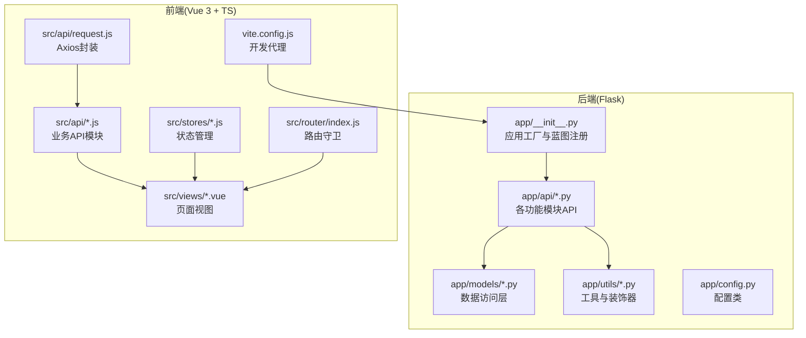
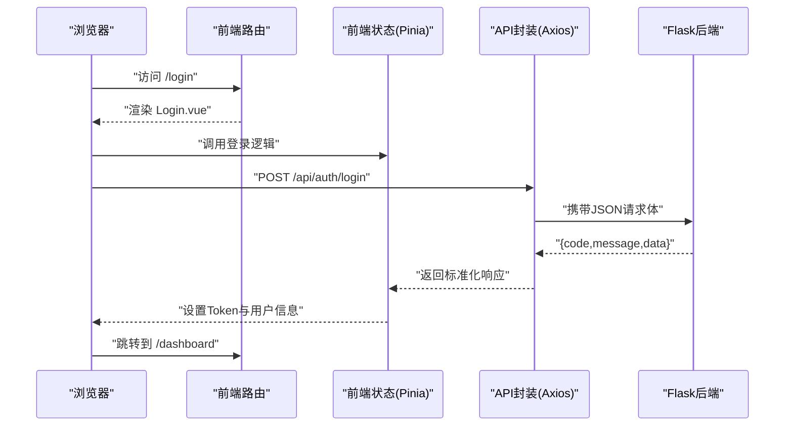
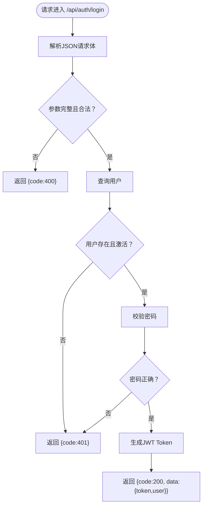
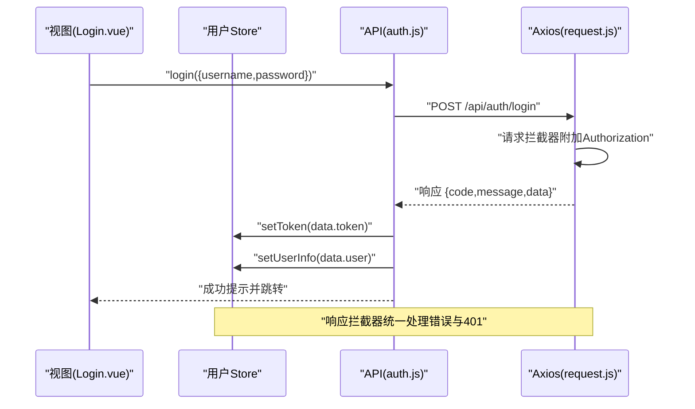
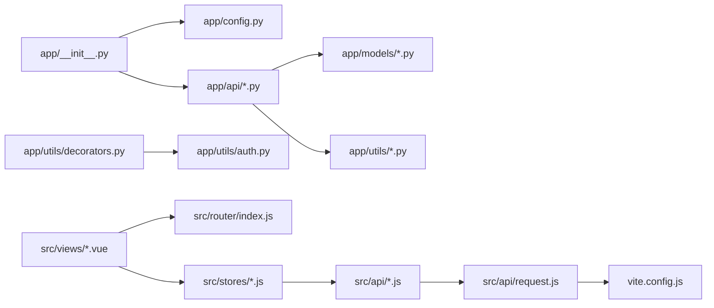

# 代码规范

<cite>
**本文引用的文件**
- [backend/app/__init__.py](file://backend/app/__init__.py)
- [backend/app/config.py](file://backend/app/config.py)
- [backend/app/extensions.py](file://backend/app/extensions.py)
- [backend/app/api/auth.py](file://backend/app/api/auth.py)
- [backend/app/api/users.py](file://backend/app/api/users.py)
- [backend/app/models/user.py](file://backend/app/models/user.py)
- [backend/app/utils/auth.py](file://backend/app/utils/auth.py)
- [backend/app/utils/decorators.py](file://backend/app/utils/decorators.py)
- [backend/app/utils/scheduler.py](file://backend/app/utils/scheduler.py)
- [backend/run.py](file://backend/run.py)
- [backend/init_db.py](file://backend/init_db.py)
- [backend/import_data.py](file://backend/import_data.py)
- [frontend/src/main.ts](file://frontend/src/main.ts)
- [frontend/package.json](file://frontend/package.json)
- [frontend/tsconfig.json](file://frontend/tsconfig.json)
- [frontend/src/api/request.js](file://frontend/src/api/request.js)
- [frontend/src/api/auth.js](file://frontend/src/api/auth.js)
- [frontend/src/views/Login.vue](file://frontend/src/views/Login.vue)
- [frontend/src/stores/user.js](file://frontend/src/stores/user.js)
- [frontend/src/router/index.js](file://frontend/src/router/index.js)
- [frontend/vite.config.js](file://frontend/vite.config.js)
</cite>

## 目录
1. [简介](#简介)
2. [项目结构](#项目结构)
3. [核心组件](#核心组件)
4. [架构总览](#架构总览)
5. [详细组件分析](#详细组件分析)
6. [依赖分析](#依赖分析)
7. [性能考虑](#性能考虑)
8. [故障排查指南](#故障排查指南)
9. [结论](#结论)
10. [附录](#附录)

## 简介
本文件为“运维管理平台”项目的代码规范文档，覆盖后端 Python 与前端 Vue.js 的编码标准、命名约定、注释规范、错误处理模式、API 接口命名与参数传递规范、响应格式标准、代码审查检查清单、Git 提交规范与版本控制最佳实践，并提供保持代码一致性、可读性与可维护性的建议。

## 项目结构
项目采用前后端分离架构：
- 后端基于 Flask，采用蓝图组织 API，统一响应格式，集中于 app/api 下按功能模块划分。
- 前端基于 Vue 3 + TypeScript + Vite，使用 Element Plus、Pinia、Vue Router，API 请求通过 axios 统一封装。

图表来源
- [backend/app/__init__.py:1-62](file://backend/app/__init__.py#L1-L62)
- [backend/app/api/auth.py:1-184](file://backend/app/api/auth.py#L1-L184)
- [backend/app/models/user.py:1-183](file://backend/app/models/user.py#L1-L183)
- [backend/app/utils/decorators.py:1-95](file://backend/app/utils/decorators.py#L1-L95)
- [frontend/src/api/request.js:1-54](file://frontend/src/api/request.js#L1-L54)
- [frontend/src/api/auth.js:1-14](file://frontend/src/api/auth.js#L1-L14)
- [frontend/src/views/Login.vue:1-114](file://frontend/src/views/Login.vue#L1-L114)
- [frontend/src/stores/user.js:1-41](file://frontend/src/stores/user.js#L1-L41)
- [frontend/src/router/index.js:1-61](file://frontend/src/router/index.js#L1-L61)
- [frontend/vite.config.js:1-16](file://frontend/vite.config.js#L1-L16)

章节来源
- [backend/app/__init__.py:1-62](file://backend/app/__init__.py#L1-L62)
- [frontend/src/main.ts:1-61](file://frontend/src/main.ts#L1-L61)

## 核心组件
- 应用工厂与蓝图注册：应用工厂负责配置 CORS、注册蓝图、初始化定时任务等；蓝图按功能模块注册，便于扩展与维护。
- 配置管理：集中于配置类，支持环境变量注入，便于本地与生产差异化配置。
- 权限与认证：JWT 工具与装饰器组合，提供通用的认证与授权能力。
- 数据访问层：用户模型封装数据库操作，遵循最小暴露原则，避免直接在 API 层编写 SQL。
- 前端请求封装：Axios 封装统一处理鉴权头、错误提示与路由跳转。
- 路由与状态：路由守卫实现登录态与角色校验；Pinia Store 管理用户信息与 Token。

章节来源
- [backend/app/__init__.py:6-34](file://backend/app/__init__.py#L6-L34)
- [backend/app/config.py:4-21](file://backend/app/config.py#L4-L21)
- [backend/app/utils/auth.py:11-35](file://backend/app/utils/auth.py#L11-L35)
- [backend/app/utils/decorators.py:9-56](file://backend/app/utils/decorators.py#L9-L56)
- [backend/app/models/user.py:8-36](file://backend/app/models/user.py#L8-L36)
- [frontend/src/api/request.js:5-51](file://frontend/src/api/request.js#L5-L51)
- [frontend/src/router/index.js:35-58](file://frontend/src/router/index.js#L35-L58)
- [frontend/src/stores/user.js:5-40](file://frontend/src/stores/user.js#L5-L40)

## 架构总览
后端采用“应用工厂 + 蓝图 + 工具层 + 数据模型”的分层设计；前端采用“视图 + API 封装 + 状态 + 路由”的分层设计。前后端通过统一的 /api 前缀交互，开发时通过 Vite 代理转发至后端服务。

图表来源
- [frontend/src/views/Login.vue:50-66](file://frontend/src/views/Login.vue#L50-L66)
- [frontend/src/api/auth.js:3-5](file://frontend/src/api/auth.js#L3-L5)
- [frontend/src/api/request.js:26-34](file://frontend/src/api/request.js#L26-L34)
- [backend/app/api/auth.py:14-82](file://backend/app/api/auth.py#L14-L82)

## 详细组件分析

### 后端：认证与用户管理
- 统一响应格式：所有 API 返回包含 code、message、data 的结构化对象，便于前端统一处理。
- 路由与权限：使用装饰器实现 JWT 认证与角色校验，确保受保护接口的安全性。
- 数据访问：用户模型封装数据库操作，避免在 API 层直接拼接 SQL，提升可维护性。
- 错误处理：对常见错误场景（缺失参数、权限不足、资源不存在、密码不合法等）给出明确的错误码与消息。

图表来源
- [backend/app/api/auth.py:14-82](file://backend/app/api/auth.py#L14-L82)
- [backend/app/utils/auth.py:11-35](file://backend/app/utils/auth.py#L11-L35)
- [backend/app/utils/decorators.py:9-56](file://backend/app/utils/decorators.py#L9-L56)

章节来源
- [backend/app/api/auth.py:14-184](file://backend/app/api/auth.py#L14-L184)
- [backend/app/api/users.py:17-268](file://backend/app/api/users.py#L17-L268)
- [backend/app/models/user.py:8-183](file://backend/app/models/user.py#L8-L183)
- [backend/app/utils/auth.py:11-83](file://backend/app/utils/auth.py#L11-L83)
- [backend/app/utils/decorators.py:9-95](file://backend/app/utils/decorators.py#L9-L95)

### 前端：请求封装与路由守卫
- Axios 封装：统一设置 baseURL、超时、Content-Type；请求拦截器自动附加 Bearer Token；响应拦截器统一处理业务错误与 401 登录态失效。
- 路由守卫：根据 meta 标记判断是否需要认证与管理员权限；登录页与已登录用户的重定向逻辑清晰。
- 状态管理：Pinia Store 管理 Token 与用户信息，持久化到 localStorage，提供计算属性简化模板使用。

图表来源
- [frontend/src/views/Login.vue:50-66](file://frontend/src/views/Login.vue#L50-L66)
- [frontend/src/stores/user.js:13-21](file://frontend/src/stores/user.js#L13-L21)
- [frontend/src/api/auth.js:3-5](file://frontend/src/api/auth.js#L3-L5)
- [frontend/src/api/request.js:14-23](file://frontend/src/api/request.js#L14-L23)
- [frontend/src/router/index.js:35-58](file://frontend/src/router/index.js#L35-L58)

章节来源
- [frontend/src/api/request.js:5-51](file://frontend/src/api/request.js#L5-L51)
- [frontend/src/router/index.js:35-58](file://frontend/src/router/index.js#L35-L58)
- [frontend/src/stores/user.js:5-40](file://frontend/src/stores/user.js#L5-L40)
- [frontend/src/views/Login.vue:50-66](file://frontend/src/views/Login.vue#L50-L66)

### 配置与部署
- 后端配置：通过环境变量注入密钥、数据库连接、调试与主机端口等；上传目录与最大内容长度集中配置。
- 前端开发：Vite 代理将 /api 请求转发至后端地址，便于前后端联调。

章节来源
- [backend/app/config.py:4-21](file://backend/app/config.py#L4-L21)
- [frontend/vite.config.js:4-15](file://frontend/vite.config.js#L4-L15)

## 依赖分析
- 后端：应用工厂依赖配置类与蓝图注册；API 蓝图依赖模型与工具；装饰器依赖认证工具；定时任务通过调度器初始化。
- 前端：视图依赖路由、状态与 API；API 依赖请求封装；路由依赖状态以判断权限。

图表来源
- [backend/app/__init__.py:37-62](file://backend/app/__init__.py#L37-L62)
- [backend/app/utils/decorators.py:6-6](file://backend/app/utils/decorators.py#L6-L6)
- [frontend/src/router/index.js:1-61](file://frontend/src/router/index.js#L1-L61)
- [frontend/src/api/request.js:1-54](file://frontend/src/api/request.js#L1-L54)

章节来源
- [backend/app/__init__.py:37-62](file://backend/app/__init__.py#L37-L62)
- [backend/app/utils/decorators.py:6-6](file://backend/app/utils/decorators.py#L6-L6)
- [frontend/src/router/index.js:1-61](file://frontend/src/router/index.js#L1-L61)
- [frontend/src/api/request.js:1-54](file://frontend/src/api/request.js#L1-L54)

## 性能考虑
- 后端
  - 数据库操作使用上下文管理器确保连接释放，避免资源泄漏。
  - 蓝图按需注册，减少启动时的导入开销。
  - 定时任务初始化在应用工厂中进行，保证单实例调度。
- 前端
  - Axios 设置合理超时时间，避免长时间阻塞。
  - 组件按需加载路由视图，降低首屏体积。
  - 严格类型检查与未使用变量/参数检测，减少运行时错误与包体积。

章节来源
- [backend/app/models/user.py:24-36](file://backend/app/models/user.py#L24-L36)
- [backend/app/__init__.py:31-32](file://backend/app/__init__.py#L31-L32)
- [frontend/tsconfig.json:18-23](file://frontend/tsconfig.json#L18-L23)

## 故障排查指南
- 后端
  - 缺少认证信息或 Token 格式错误：返回 401，检查 Authorization 头是否为 Bearer 格式。
  - Token 无效或过期：返回 401，前端清除本地存储并跳转登录页。
  - 业务异常：统一返回 {code,message}，前端通过响应拦截器提示。
- 前端
  - 登录失败：检查请求拦截器是否附加 Token，确认后端返回的 code 与 message。
  - 路由跳转异常：检查路由守卫中的 requiresAuth 与 requiresAdmin 标记。
  - 开发代理：确认 vite.config.js 中 /api 代理目标地址与端口正确。

章节来源
- [backend/app/utils/decorators.py:22-45](file://backend/app/utils/decorators.py#L22-L45)
- [backend/app/utils/auth.py:38-55](file://backend/app/utils/auth.py#L38-L55)
- [frontend/src/api/request.js:26-50](file://frontend/src/api/request.js#L26-L50)
- [frontend/src/router/index.js:35-58](file://frontend/src/router/index.js#L35-L58)
- [frontend/vite.config.js:8-13](file://frontend/vite.config.js#L8-L13)

## 结论
本项目在后端采用清晰的分层与统一的响应格式，在前端采用统一的请求封装与路由守卫，整体具备良好的可读性与可维护性。建议在后续迭代中持续完善单元测试、接口文档与自动化质量门禁，以进一步提升代码质量与团队协作效率。

## 附录

### Python 后端编码规范
- 代码风格
  - 使用 PEP 8 风格，缩进为 4 空格，行宽不超过 100 字符。
  - 函数与类之间空两行，方法之间空一行；模块内类之间空一行。
- 命名约定
  - 模块与函数：小写下划线命名（如 user_api、get_user_by_id）。
  - 类：帕斯卡命名（如 UserModel、AuthBlueprint）。
  - 常量：全大写加下划线（如 JWT_EXPIRATION_HOURS）。
- 注释规范
  - 模块顶部包含简短描述与作者信息；复杂函数提供 docstring，说明参数、返回值与异常。
  - TODO/FIXME 使用统一标记并在后续版本修复。
- 错误处理
  - 对输入参数进行显式校验，返回明确的错误码与消息。
  - 使用装饰器统一处理认证与权限，避免重复代码。
- API 设计
  - 统一响应格式：{code, message, data}；错误码使用 HTTP 语义化范围（4xx/5xx）。
  - 参数传递：优先使用 JSON；必要时使用查询参数或路径参数。
  - 响应格式：成功返回 200，业务错误返回对应 code，异常返回 500。

章节来源
- [backend/app/api/auth.py:14-82](file://backend/app/api/auth.py#L14-L82)
- [backend/app/api/users.py:17-96](file://backend/app/api/users.py#L17-L96)
- [backend/app/utils/decorators.py:9-56](file://backend/app/utils/decorators.py#L9-L56)

### Vue.js 前端编码规范
- 代码组织
  - 视图组件按功能放置于 views；通用 API 封装于 api；状态管理使用 Pinia；路由集中于 router。
- 组件命名
  - 视图组件使用帕斯卡命名（如 Login.vue、Dashboard.vue）；工具组件使用帕斯卡命名（如 PasswordDisplay.vue）。
- 样式规范
  - 使用 scoped 样式隔离组件样式；布局使用 Flex/Grid；颜色与尺寸通过 CSS 变量统一管理。
- TypeScript 使用
  - 启用严格模式与未使用变量/参数检查；组件脚本使用 <script setup> 语法；API 返回值定义接口类型。
- 响应式与状态
  - 使用 ref/computed 管理局部状态；Pinia Store 管理跨组件共享状态；避免在模板中直接调用副作用函数。

章节来源
- [frontend/src/views/Login.vue:1-114](file://frontend/src/views/Login.vue#L1-L114)
- [frontend/src/stores/user.js:1-41](file://frontend/src/stores/user.js#L1-L41)
- [frontend/tsconfig.json:18-23](file://frontend/tsconfig.json#L18-L23)

### API 接口命名与参数规范
- 命名规范
  - 资源命名使用复数名词（如 /api/users），动词使用 HTTP 方法表达动作（GET/POST/PUT/DELETE）。
  - 子资源使用层级路径（如 /api/users/{id}/reset-password）。
- 参数传递
  - 必填参数在请求体中明确声明；可选参数提供默认值或在后端校验。
  - 分页参数：page、size；排序参数：sort、order；过滤参数：按字段名传递。
- 响应格式
  - 成功：{code: 200, data: ...}
  - 参数错误：{code: 400, message: "..."}
  - 权限不足：{code: 403, message: "..."}
  - 未认证：{code: 401, message: "..."}
  - 资源不存在：{code: 404, message: "..."}
  - 服务器错误：{code: 500, message: "..."}

章节来源
- [backend/app/api/auth.py:14-184](file://backend/app/api/auth.py#L14-L184)
- [backend/app/api/users.py:17-268](file://backend/app/api/users.py#L17-L268)
- [frontend/src/api/request.js:26-34](file://frontend/src/api/request.js#L26-L34)

### 代码审查检查清单
- 后端
  - 是否使用统一响应格式与错误码？
  - 是否对输入参数进行完整校验？
  - 是否使用装饰器实现认证与权限？
  - 数据库操作是否使用上下文管理器？
  - 是否存在硬编码敏感信息？
- 前端
  - 是否使用 Axios 统一封装请求？
  - 是否在路由守卫中实现登录态与角色校验？
  - 是否启用 TypeScript 严格模式？
  - 是否存在未使用的变量或参数？

章节来源
- [backend/app/utils/decorators.py:9-95](file://backend/app/utils/decorators.py#L9-L95)
- [backend/app/models/user.py:24-36](file://backend/app/models/user.py#L24-L36)
- [frontend/src/api/request.js:14-50](file://frontend/src/api/request.js#L14-L50)
- [frontend/src/router/index.js:35-58](file://frontend/src/router/index.js#L35-L58)
- [frontend/tsconfig.json:18-23](file://frontend/tsconfig.json#L18-L23)

### Git 提交规范与版本控制最佳实践
- 提交信息
  - 标题使用祈使句，不超过 50 字；正文说明动机与影响，必要时附带变更摘要。
  - 类型前缀：feat、fix、docs、style、refactor、test、chore。
- 分支策略
  - 主分支仅允许合并，使用 Pull Request 进行代码审查；特性分支以功能命名（如 feature/user-management）。
- 版本发布
  - 使用语义化版本号；变更日志记录重大改动与破坏性变更；打标签并推送。

[本节为通用实践指导，无需特定文件来源]

### 保持一致性、可读性与可维护性的建议
- 统一风格：前后端均采用一致的命名与注释风格，建立共享规范文档。
- 自动化：引入 linter、formatter 与 CI 质量门禁，减少人工审查负担。
- 文档：为关键流程绘制序列图与类图，辅助新成员理解架构。
- 测试：补充单元测试与集成测试，确保变更不会破坏既有功能。

[本节为通用指导，无需特定文件来源]