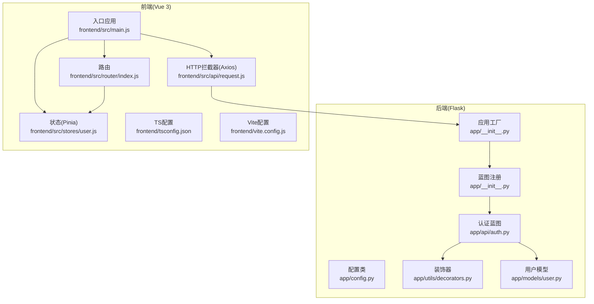
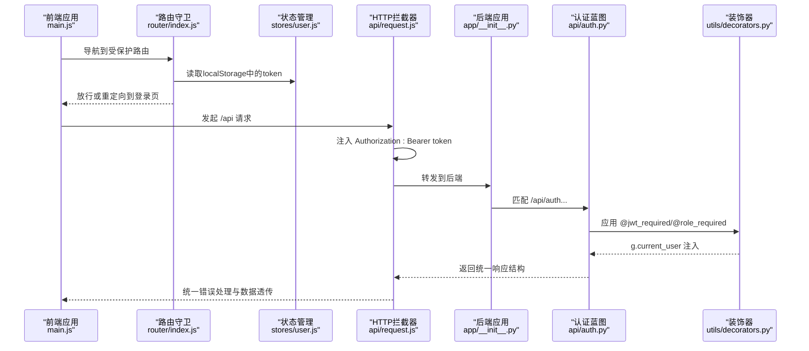
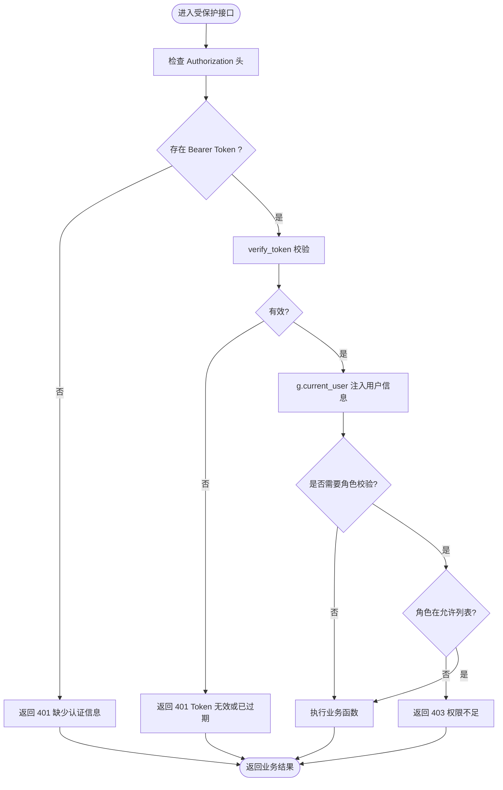
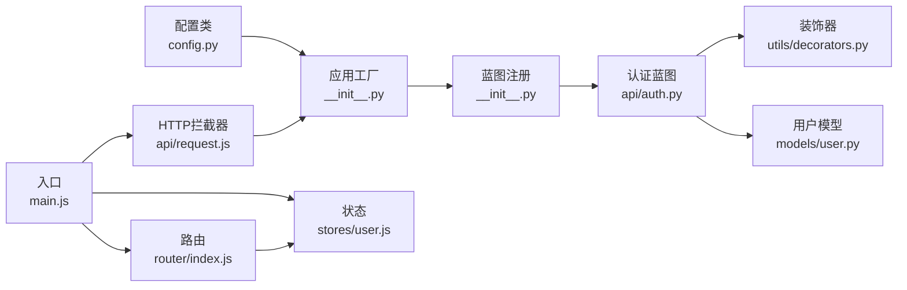

# 代码规范

<cite>
**本文引用的文件**
- [backend/app/__init__.py](file://backend/app/__init__.py)
- [backend/app/config.py](file://backend/app/config.py)
- [backend/app/extensions.py](file://backend/app/extensions.py)
- [backend/app/utils/decorators.py](file://backend/app/utils/decorators.py)
- [backend/app/api/auth.py](file://backend/app/api/auth.py)
- [backend/app/models/user.py](file://backend/app/models/user.py)
- [frontend/src/main.js](file://frontend/src/main.js)
- [frontend/src/main.ts](file://frontend/src/main.ts)
- [frontend/src/router/index.js](file://frontend/src/router/index.js)
- [frontend/src/stores/user.js](file://frontend/src/stores/user.js)
- [frontend/src/api/request.js](file://frontend/src/api/request.js)
- [frontend/package.json](file://frontend/package.json)
- [frontend/tsconfig.json](file://frontend/tsconfig.json)
- [frontend/vite.config.js](file://frontend/vite.config.js)
</cite>

## 目录
1. 引言
2. 项目结构
3. 核心组件
4. 架构总览
5. 详细组件分析
6. 依赖分析
7. 性能考虑
8. 故障排查指南
9. 结论
10. 附录

## 引言
本文件为云运维平台的代码规范文档，覆盖后端 Python（Flask）与前端 JavaScript/TypeScript 的编码标准，包括但不限于：蓝图模式的代码组织、装饰器使用、API 接口设计、命名约定、代码格式化、注释规范、错误处理模式、以及 Vue 3 Composition API 与 TypeScript 类型约束等。文档以现有仓库实现为依据，提供正反例对比与图示，帮助团队统一风格、提升可维护性与协作效率。

## 项目结构
后端采用 Flask 应用工厂与蓝图分层组织；前端采用 Vite + Vue 3 + Pinia + Vue Router 的现代工程化结构。整体通过代理将前端对 /api 的请求转发至后端服务。

图表来源
- [backend/app/__init__.py:6-34](file://backend/app/__init__.py#L6-L34)
- [backend/app/__init__.py:37-62](file://backend/app/__init__.py#L37-L62)
- [backend/app/config.py:4-21](file://backend/app/config.py#L4-L21)
- [backend/app/api/auth.py:11-184](file://backend/app/api/auth.py#L11-L184)
- [backend/app/utils/decorators.py:9-95](file://backend/app/utils/decorators.py#L9-L95)
- [backend/app/models/user.py:8-183](file://backend/app/models/user.py#L8-L183)
- [frontend/src/main.js:1-23](file://frontend/src/main.js#L1-L23)
- [frontend/src/router/index.js:1-61](file://frontend/src/router/index.js#L1-L61)
- [frontend/src/stores/user.js:1-41](file://frontend/src/stores/user.js#L1-L41)
- [frontend/src/api/request.js:1-54](file://frontend/src/api/request.js#L1-L54)
- [frontend/tsconfig.json:1-27](file://frontend/tsconfig.json#L1-L27)
- [frontend/vite.config.js:1-17](file://frontend/vite.config.js#L1-L17)

章节来源
- [backend/app/__init__.py:6-62](file://backend/app/__init__.py#L6-L62)
- [frontend/src/main.js:1-23](file://frontend/src/main.js#L1-L23)

## 核心组件
- 后端应用工厂与蓝图注册：集中创建 Flask 实例、CORS、蓝图注册与定时任务初始化。
- 认证蓝图与装饰器：统一 JWT 认证与角色校验，规范接口访问控制。
- 用户模型：封装数据库读写逻辑，提供安全的密码哈希与查询接口。
- 前端应用入口与插件：统一注册 Pinia、路由、Element Plus 及图标。
- 路由与鉴权：基于 meta 字段与本地存储进行通用鉴权与管理员权限控制。
- 状态管理：Pinia Store 管理 token 与用户信息，并持久化到 localStorage。
- HTTP 拦截器：Axios 统一注入 Authorization、错误提示与 401 自动登出。
- TS 与构建：严格 TS 编译选项、Vite 代理与开发服务器配置。

章节来源
- [backend/app/__init__.py:6-62](file://backend/app/__init__.py#L6-L62)
- [backend/app/utils/decorators.py:9-95](file://backend/app/utils/decorators.py#L9-L95)
- [backend/app/api/auth.py:14-184](file://backend/app/api/auth.py#L14-L184)
- [backend/app/models/user.py:8-183](file://backend/app/models/user.py#L8-L183)
- [frontend/src/main.js:1-23](file://frontend/src/main.js#L1-L23)
- [frontend/src/router/index.js:36-58](file://frontend/src/router/index.js#L36-L58)
- [frontend/src/stores/user.js:1-41](file://frontend/src/stores/user.js#L1-L41)
- [frontend/src/api/request.js:14-51](file://frontend/src/api/request.js#L14-L51)
- [frontend/tsconfig.json:18-24](file://frontend/tsconfig.json#L18-L24)
- [frontend/vite.config.js:6-15](file://frontend/vite.config.js#L6-L15)

## 架构总览
前后端通过 Axios 拦截器统一注入 Bearer Token，后端使用蓝图划分功能域，装饰器统一处理认证与授权，路由守卫与 Pinia Store 协同完成前端侧鉴权与状态管理。

图表来源
- [frontend/src/main.js:10-22](file://frontend/src/main.js#L10-L22)
- [frontend/src/router/index.js:36-58](file://frontend/src/router/index.js#L36-L58)
- [frontend/src/stores/user.js:23-30](file://frontend/src/stores/user.js#L23-L30)
- [frontend/src/api/request.js:14-51](file://frontend/src/api/request.js#L14-L51)
- [backend/app/__init__.py:37-62](file://backend/app/__init__.py#L37-L62)
- [backend/app/api/auth.py:14-184](file://backend/app/api/auth.py#L14-L184)
- [backend/app/utils/decorators.py:9-95](file://backend/app/utils/decorators.py#L9-L95)

## 详细组件分析

### 后端：Flask 应用工厂与蓝图组织
- 应用工厂负责创建 Flask 实例、加载配置、CORS、注册蓝图与定时任务初始化。
- 蓝图按领域划分（如 auth、users、servers 等），统一前缀 /api，便于扩展与维护。
- 建议：新增模块时遵循“领域/蓝图”命名，保持 url_prefix 一致，避免硬编码路径。

章节来源
- [backend/app/__init__.py:6-34](file://backend/app/__init__.py#L6-L34)
- [backend/app/__init__.py:37-62](file://backend/app/__init__.py#L37-L62)

### 后端：认证与装饰器
- 装饰器 jwt_required：从 Authorization 头解析 Bearer Token，校验失败直接返回统一错误结构。
- 装饰器 role_required：在 jwt_required 之后使用，检查 g.current_user 中的角色是否在允许列表。
- 建议：装饰器链顺序固定为先 @jwt_required 再 @role_required；错误响应统一为 { code, message }。

图表来源
- [backend/app/utils/decorators.py:9-95](file://backend/app/utils/decorators.py#L9-L95)

章节来源
- [backend/app/utils/decorators.py:9-95](file://backend/app/utils/decorators.py#L9-L95)

### 后端：认证蓝图与接口设计
- 登录接口：校验用户名、密码与账户状态，成功返回 token 与用户简档。
- 获取资料接口：需 JWT 认证，返回用户完整信息。
- 修改密码接口：需 JWT 认证，校验旧密码长度与存在性，成功更新密码并返回统一结构。
- 建议：所有接口返回统一结构 { code, message?, data? }；状态码语义化；对敏感信息脱敏输出。

章节来源
- [backend/app/api/auth.py:14-184](file://backend/app/api/auth.py#L14-L184)

### 后端：用户模型与数据库交互
- 提供创建、查询、更新、删除与密码更新等方法，统一使用上下文管理关闭数据库连接。
- 建议：对外暴露稳定函数签名，内部 SQL 参数化，避免拼接；对返回数据做类型与空值检查。

章节来源
- [backend/app/models/user.py:8-183](file://backend/app/models/user.py#L8-L183)

### 前端：应用入口与插件注册
- 使用 createApp、createPinia、ElementPlus 插件化注册，全局注册 Element Plus 图标组件。
- 建议：保持插件注册顺序与职责单一，避免在入口做复杂逻辑。

章节来源
- [frontend/src/main.js:1-23](file://frontend/src/main.js#L1-L23)

### 前端：路由与鉴权
- 路由守卫根据 meta.requiresAuth 与 requiresAdmin 控制放行；支持登录页免认证与已登录跳转首页。
- 建议：meta 字段命名统一，结合 Pinia Store 管理用户角色与显示名。

章节来源
- [frontend/src/router/index.js:36-58](file://frontend/src/router/index.js#L36-L58)

### 前端：状态管理（Pinia）
- Store 管理 token 与 userInfo，并持久化到 localStorage；提供 fetchProfile、logout 等方法。
- 建议：异常捕获与日志记录规范化；避免在 Store 中直接发起网络请求，统一通过 API 层。

章节来源
- [frontend/src/stores/user.js:1-41](file://frontend/src/stores/user.js#L1-L41)

### 前端：HTTP 拦截器（Axios）
- 请求拦截：自动注入 Authorization: Bearer token。
- 响应拦截：统一处理非 200 状态、401 自动登出与消息提示。
- 建议：错误分类与提示文案本地化；区分业务错误与网络错误。

章节来源
- [frontend/src/api/request.js:14-51](file://frontend/src/api/request.js#L14-L51)

### 前端：TypeScript 与构建配置
- tsconfig.json 开启严格模式与未使用项检查，确保类型安全与代码质量。
- vite.config.js 配置开发服务器与 /api 代理，便于前后端联调。
- 建议：新增页面与组件时遵循命名约定与目录结构；构建产物与环境变量分离。

章节来源
- [frontend/tsconfig.json:18-24](file://frontend/tsconfig.json#L18-L24)
- [frontend/vite.config.js:6-15](file://frontend/vite.config.js#L6-L15)

## 依赖分析
- 后端：Flask 应用工厂依赖配置类与蓝图注册；认证蓝图依赖装饰器与用户模型；定时任务初始化在应用工厂内完成。
- 前端：main.js 依赖路由、状态与 Element Plus；路由守卫依赖 localStorage；API 拦截器依赖路由与 Element Plus 消息组件。

图表来源
- [backend/app/config.py:4-21](file://backend/app/config.py#L4-L21)
- [backend/app/__init__.py:37-62](file://backend/app/__init__.py#L37-L62)
- [backend/app/api/auth.py:11-184](file://backend/app/api/auth.py#L11-L184)
- [backend/app/utils/decorators.py:9-95](file://backend/app/utils/decorators.py#L9-L95)
- [backend/app/models/user.py:8-183](file://backend/app/models/user.py#L8-L183)
- [frontend/src/main.js:1-23](file://frontend/src/main.js#L1-L23)
- [frontend/src/router/index.js:1-61](file://frontend/src/router/index.js#L1-L61)
- [frontend/src/stores/user.js:1-41](file://frontend/src/stores/user.js#L1-L41)
- [frontend/src/api/request.js:1-54](file://frontend/src/api/request.js#L1-L54)

章节来源
- [backend/app/__init__.py:37-62](file://backend/app/__init__.py#L37-L62)
- [frontend/src/main.js:1-23](file://frontend/src/main.js#L1-L23)

## 性能考虑
- 后端：数据库连接使用上下文管理器确保及时释放；蓝图按需注册，减少启动开销；CORS 放宽范围仅限 /api/*。
- 前端：Axios 默认超时设置合理；路由与组件采用异步加载；Pinia Store 仅保存必要状态；Vite 开发服务器启用代理减少跨域问题。
- 建议：接口分页与缓存策略、前端懒加载与图片优化、后端索引与查询优化。

章节来源
- [backend/app/models/user.py:24-36](file://backend/app/models/user.py#L24-L36)
- [backend/app/__init__.py:24-25](file://backend/app/__init__.py#L24-L25)
- [frontend/src/api/request.js:5-11](file://frontend/src/api/request.js#L5-L11)
- [frontend/vite.config.js:9-14](file://frontend/vite.config.js#L9-L14)

## 故障排查指南
- 后端认证失败
  - 现象：返回 401 缺少认证信息或 Token 无效。
  - 排查：确认 Authorization 头格式为 Bearer；检查装饰器链顺序；核对密钥与过期时间。
- 前端登录后无法访问受保护路由
  - 现象：被重定向到登录页。
  - 排查：检查 localStorage 中 token 与 userInfo 是否存在；核对路由守卫逻辑与 meta 字段。
- 前端 401 自动登出
  - 现象：出现“登录已过期，请重新登录”提示并跳转登录页。
  - 排查：检查拦截器响应处理与路由守卫联动；确认后端 JWT 过期时间与前端刷新策略。
- 数据库连接问题
  - 现象：查询或写入失败。
  - 排查：确认配置类中的数据库参数；检查连接池与事务提交；查看模型层是否正确关闭连接。

章节来源
- [backend/app/utils/decorators.py:22-56](file://backend/app/utils/decorators.py#L22-L56)
- [frontend/src/router/index.js:36-58](file://frontend/src/router/index.js#L36-L58)
- [frontend/src/api/request.js:35-51](file://frontend/src/api/request.js#L35-L51)
- [backend/app/models/user.py:24-36](file://backend/app/models/user.py#L24-L36)

## 结论
本规范以现有实现为基础，总结了后端蓝图组织、装饰器使用、统一响应结构与前端路由、状态与拦截器的最佳实践。建议在后续迭代中持续完善：统一代码格式化工具、补充单元测试与集成测试、完善文档注释与变更日志、强化安全与性能监控。

## 附录

### 命名约定与代码组织
- 后端
  - 蓝图：领域小写，如 auth、users、servers。
  - 装饰器：函数名清晰表达意图，如 jwt_required、role_required。
  - 模型函数：动词+名词，如 create_user、get_user_by_id。
- 前端
  - 组件：PascalCase，如 HelloWorld.vue、MainLayout.vue。
  - Store：useXxxStore，如 useUserStore。
  - 路由：视图组件与路径映射清晰，嵌套路由 children 结构明确。

章节来源
- [backend/app/api/auth.py:11](file://backend/app/api/auth.py#L11)
- [backend/app/utils/decorators.py:9](file://backend/app/utils/decorators.py#L9)
- [backend/app/models/user.py:8](file://backend/app/models/user.py#L8)
- [frontend/src/router/index.js:3-28](file://frontend/src/router/index.js#L3-L28)
- [frontend/src/stores/user.js:5](file://frontend/src/stores/user.js#L5)

### 注释规范
- 函数/方法：使用三引号文档字符串，描述用途、参数、返回值与错误场景。
- 关键流程：在复杂分支处添加注释说明决策依据。
- 建议：注释简洁明了，避免显而易懂的重复描述。

章节来源
- [backend/app/api/auth.py:14-22](file://backend/app/api/auth.py#L14-L22)
- [backend/app/models/user.py:8-20](file://backend/app/models/user.py#L8-L20)
- [backend/app/utils/decorators.py:9-19](file://backend/app/utils/decorators.py#L9-L19)

### 错误处理模式
- 统一响应结构：{ code, message?, data? }。
- 状态码语义化：400 表示请求错误，401/403 表示认证/授权问题，500 表示服务器错误。
- 前端拦截：Axios 统一处理非 200 与 401，提示用户并跳转登录。

章节来源
- [backend/app/api/auth.py:25-47](file://backend/app/api/auth.py#L25-L47)
- [frontend/src/api/request.js:26-51](file://frontend/src/api/request.js#L26-L51)

### 蓝图模式与装饰器使用规范
- 蓝图：按领域拆分，url_prefix 统一为 /api；路由函数职责单一。
- 装饰器：@jwt_required 在前，@role_required 在后；在函数文档中说明使用方式与前置条件。

章节来源
- [backend/app/__init__.py:37-62](file://backend/app/__init__.py#L37-L62)
- [backend/app/utils/decorators.py:9-95](file://backend/app/utils/decorators.py#L9-L95)

### API 接口设计标准
- 请求体：JSON；必填字段在接口文档中明确。
- 响应体：统一结构；业务错误与系统错误区分。
- 安全：强制使用 HTTPS；JWT 过期时间合理；敏感字段不回显明文。

章节来源
- [backend/app/api/auth.py:14-184](file://backend/app/api/auth.py#L14-L184)
- [frontend/src/api/request.js:5-11](file://frontend/src/api/request.js#L5-L11)

### Vue 3 Composition API 与 TypeScript 类型定义
- 组件：使用 <script setup> 与组合式 API；props 与 emits 明确类型。
- Store：defineStore 返回值解构使用；ref/computed 声明类型。
- TS：开启严格模式，避免 any；未使用变量与参数报错。

章节来源
- [frontend/src/stores/user.js:1-41](file://frontend/src/stores/user.js#L1-L41)
- [frontend/tsconfig.json:18-24](file://frontend/tsconfig.json#L18-L24)

### 代码示例与反例对比
- 正例：装饰器链顺序正确，接口返回统一结构，前端拦截器统一处理错误。
- 反例：装饰器顺序颠倒导致权限判断失效；接口返回结构不统一；前端未处理 401 导致状态不一致。
- 建议：在 PR 审查中重点检查装饰器链、响应结构与拦截器行为。

章节来源
- [backend/app/utils/decorators.py:9-95](file://backend/app/utils/decorators.py#L9-L95)
- [backend/app/api/auth.py:14-184](file://backend/app/api/auth.py#L14-L184)
- [frontend/src/api/request.js:26-51](file://frontend/src/api/request.js#L26-L51)