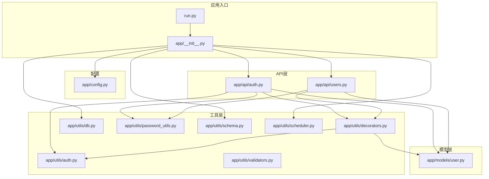
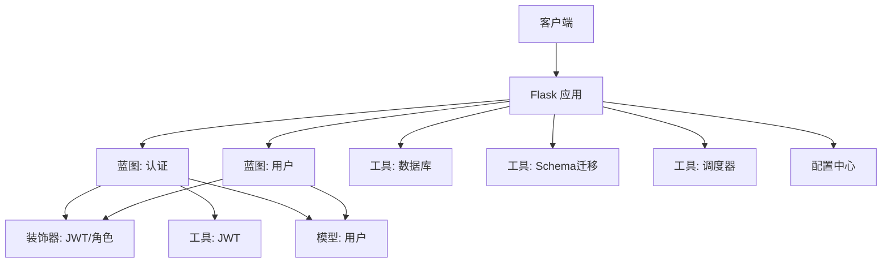
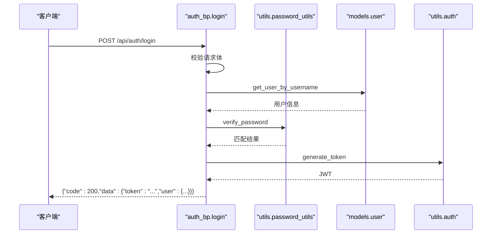
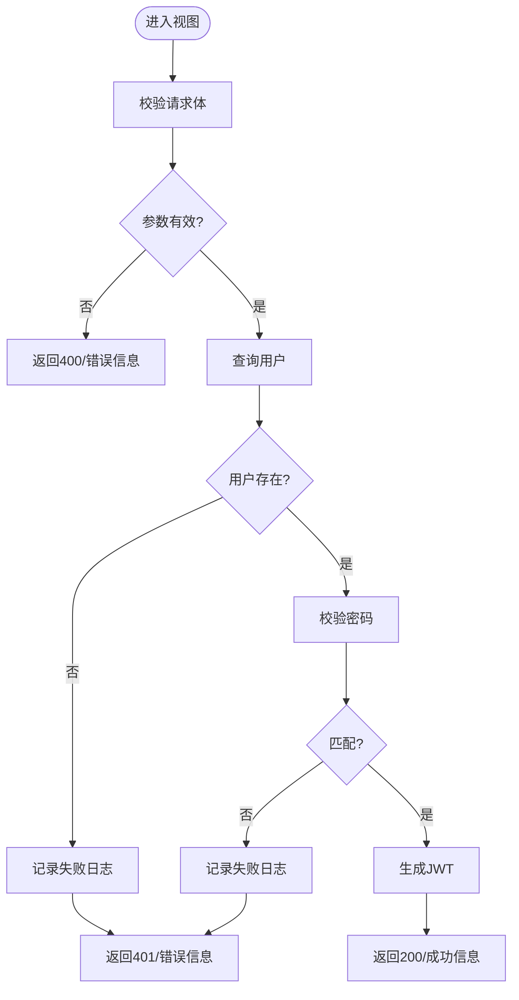
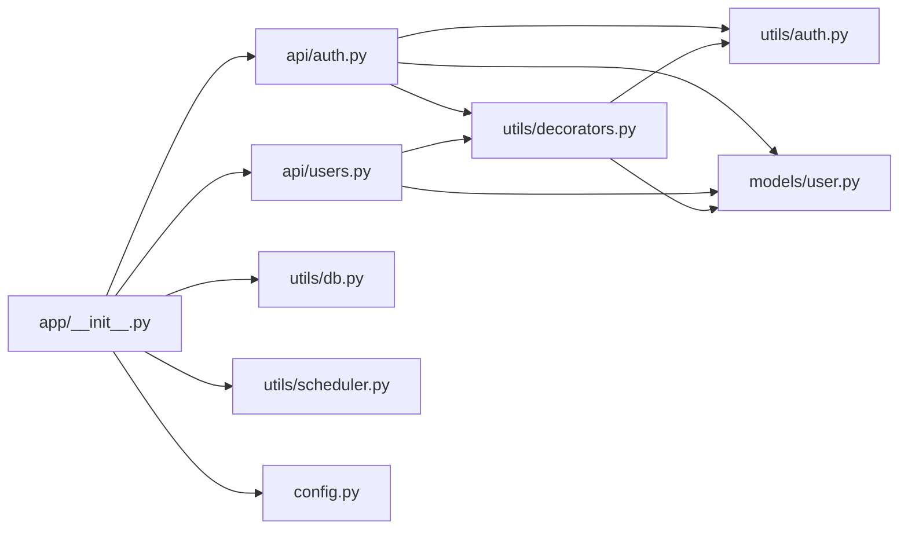

# 代码规范

<cite>
**本文引用的文件**
- [backend/app/__init__.py](file://backend/app/__init__.py)
- [backend/app/config.py](file://backend/app/config.py)
- [backend/app/extensions.py](file://backend/app/extensions.py)
- [backend/app/utils/auth.py](file://backend/app/utils/auth.py)
- [backend/app/utils/db.py](file://backend/app/utils/db.py)
- [backend/app/utils/decorators.py](file://backend/app/utils/decorators.py)
- [backend/app/utils/schema.py](file://backend/app/utils/schema.py)
- [backend/app/utils/password_utils.py](file://backend/app/utils/password_utils.py)
- [backend/app/utils/validators.py](file://backend/app/utils/validators.py)
- [backend/app/utils/scheduler.py](file://backend/app/utils/scheduler.py)
- [backend/app/api/auth.py](file://backend/app/api/auth.py)
- [backend/app/api/users.py](file://backend/app/api/users.py)
- [backend/app/models/user.py](file://backend/app/models/user.py)
- [backend/run.py](file://backend/run.py)
- [backend/Dockerfile](file://backend/Dockerfile)
</cite>

## 目录
1. [引言](#引言)
2. [项目结构](#项目结构)
3. [核心组件](#核心组件)
4. [架构总览](#架构总览)
5. [详细组件分析](#详细组件分析)
6. [依赖分析](#依赖分析)
7. [性能考虑](#性能考虑)
8. [故障排查指南](#故障排查指南)
9. [结论](#结论)
10. [附录](#附录)

## 引言
本文件旨在为OPS项目的Python后端建立统一、可维护的代码规范，覆盖PEP8风格、命名约定、注释规范、代码组织原则、Flask应用开发规范（蓝图、路由、错误处理），并通过实际文件示例给出“正确”和“错误”的对比指引，帮助新成员快速理解并遵循团队标准。

## 项目结构
后端采用按功能域划分的层次化组织：
- 应用入口与工厂：app/__init__.py、run.py
- 配置中心：app/config.py
- 扩展占位：app/extensions.py
- API层：app/api/*.py（按资源划分）
- 模型层：app/models/*.py（数据访问函数）
- 工具层：app/utils/*.py（认证、数据库、装饰器、调度、校验、密码、日志等）

图表来源
- [backend/run.py:1-8](file://backend/run.py#L1-L8)
- [backend/app/__init__.py:1-149](file://backend/app/__init__.py#L1-L149)
- [backend/app/config.py:1-58](file://backend/app/config.py#L1-L58)
- [backend/app/api/auth.py:1-197](file://backend/app/api/auth.py#L1-L197)
- [backend/app/api/users.py:1-290](file://backend/app/api/users.py#L1-L290)
- [backend/app/models/user.py:1-162](file://backend/app/models/user.py#L1-L162)
- [backend/app/utils/decorators.py:1-163](file://backend/app/utils/decorators.py#L1-L163)
- [backend/app/utils/auth.py:1-45](file://backend/app/utils/auth.py#L1-L45)
- [backend/app/utils/db.py:1-80](file://backend/app/utils/db.py#L1-L80)
- [backend/app/utils/password_utils.py:1-130](file://backend/app/utils/password_utils.py#L1-L130)
- [backend/app/utils/validators.py:1-151](file://backend/app/utils/validators.py#L1-L151)
- [backend/app/utils/schema.py:1-42](file://backend/app/utils/schema.py#L1-L42)
- [backend/app/utils/scheduler.py:1-580](file://backend/app/utils/scheduler.py#L1-L580)

章节来源
- [backend/app/__init__.py:1-149](file://backend/app/__init__.py#L1-L149)
- [backend/app/config.py:1-58](file://backend/app/config.py#L1-L58)
- [backend/run.py:1-8](file://backend/run.py#L1-L8)

## 核心组件
- 应用工厂与蓝图注册：应用在工厂函数中集中初始化配置、CORS、数据库连接钩子、蓝图注册与调度器初始化。
- 配置中心：集中管理环境变量映射、CORS策略、JSON行为、上传目录与定时任务计划。
- 权限与认证：基于JWT的装饰器链，结合用户模型实现认证与授权。
- 数据访问：统一通过工具层db封装连接、关闭与日志脱敏输出。
- 工具函数：密码哈希/校验、参数校验、调度器、Schema迁移等。

章节来源
- [backend/app/__init__.py:28-149](file://backend/app/__init__.py#L28-L149)
- [backend/app/config.py:10-58](file://backend/app/config.py#L10-L58)
- [backend/app/utils/decorators.py:26-163](file://backend/app/utils/decorators.py#L26-L163)
- [backend/app/utils/db.py:43-80](file://backend/app/utils/db.py#L43-L80)
- [backend/app/utils/password_utils.py:52-130](file://backend/app/utils/password_utils.py#L52-L130)
- [backend/app/utils/validators.py:1-151](file://backend/app/utils/validators.py#L1-L151)
- [backend/app/utils/scheduler.py:244-384](file://backend/app/utils/scheduler.py#L244-L384)

## 架构总览
应用采用Flask工厂模式，通过蓝图按资源拆分API，工具层提供横切能力（认证、数据库、调度、校验等），模型层提供数据访问函数，配置中心统一注入环境变量。

图表来源
- [backend/app/__init__.py:116-149](file://backend/app/__init__.py#L116-L149)
- [backend/app/api/auth.py:12-197](file://backend/app/api/auth.py#L12-L197)
- [backend/app/api/users.py:16-290](file://backend/app/api/users.py#L16-L290)
- [backend/app/utils/decorators.py:26-163](file://backend/app/utils/decorators.py#L26-L163)
- [backend/app/utils/auth.py:9-45](file://backend/app/utils/auth.py#L9-L45)
- [backend/app/models/user.py:8-162](file://backend/app/models/user.py#L8-L162)
- [backend/app/utils/db.py:43-80](file://backend/app/utils/db.py#L43-L80)
- [backend/app/utils/schema.py:10-42](file://backend/app/utils/schema.py#L10-L42)
- [backend/app/utils/scheduler.py:244-384](file://backend/app/utils/scheduler.py#L244-L384)
- [backend/app/config.py:10-58](file://backend/app/config.py#L10-L58)

## 详细组件分析

### Python编码标准与PEP8
- 缩进与格式
  - 统一使用4空格缩进，避免混用制表符。
  - 函数与类之间使用两个空行分隔；方法之间使用一个空行。
  - 行宽不超过100字符；必要时使用括号换行。
- 命名约定
  - 类名：PascalCase（如Config、BackgroundScheduler）
  - 函数/方法/变量：snake_case（如generate_token、get_db、log_database_target）
  - 常量：UPPER_CASE（如MAX_CONTENT_LENGTH、JWT_EXPIRATION_HOURS）
- 导入顺序
  - 标准库 → 第三方库 → 项目内相对导入（按层级从高到低）
  - 同类导入按字母序排列，不同类别用空行分隔
- 空行与注释
  - 文件顶部模块级注释（三引号）描述用途
  - 函数/类前使用三引号文档字符串，首行简述，随后空行列出参数与返回
  - 行内注释与语句至少留两个空格间距
- 字符串与编码
  - 默认UTF-8；JSON响应保留中文，避免Unicode转义
- 异常处理
  - 明确捕获具体异常，避免裸except；记录异常栈以便排障

章节来源
- [backend/app/config.py:10-58](file://backend/app/config.py#L10-L58)
- [backend/app/utils/auth.py:1-45](file://backend/app/utils/auth.py#L1-L45)
- [backend/app/utils/db.py:1-80](file://backend/app/utils/db.py#L1-L80)
- [backend/app/utils/decorators.py:1-163](file://backend/app/utils/decorators.py#L1-L163)
- [backend/app/utils/password_utils.py:1-130](file://backend/app/utils/password_utils.py#L1-L130)
- [backend/app/utils/validators.py:1-151](file://backend/app/utils/validators.py#L1-L151)
- [backend/app/utils/schema.py:1-42](file://backend/app/utils/schema.py#L1-L42)
- [backend/app/utils/scheduler.py:1-580](file://backend/app/utils/scheduler.py#L1-L580)
- [backend/app/api/auth.py:1-197](file://backend/app/api/auth.py#L1-L197)
- [backend/app/api/users.py:1-290](file://backend/app/api/users.py#L1-L290)
- [backend/app/models/user.py:1-162](file://backend/app/models/user.py#L1-L162)

### 注释规范
- 模块注释：文件顶部三引号，说明模块职责与范围
- 类注释：类定义上方三引号，简述用途与关键行为
- 函数/方法注释：函数/方法上方三引号，首行简述功能，空行后说明参数、返回值与异常
- 示例参考
  - 模块注释：[backend/app/utils/auth.py:1-3](file://backend/app/utils/auth.py#L1-L3)
  - 函数注释：[backend/app/utils/auth.py:9-28](file://backend/app/utils/auth.py#L9-L28)、[backend/app/utils/db.py:28-40](file://backend/app/utils/db.py#L28-L40)
  - 类注释：[backend/app/config.py:10-11](file://backend/app/config.py#L10-L11)

章节来源
- [backend/app/utils/auth.py:1-45](file://backend/app/utils/auth.py#L1-L45)
- [backend/app/utils/db.py:28-40](file://backend/app/utils/db.py#L28-L40)
- [backend/app/config.py:10-11](file://backend/app/config.py#L10-L11)

### 代码组织原则
- 导入顺序
  - 标准库：logging、os、sys、datetime、json等
  - 第三方库：flask、pymysql、jwt、bcrypt、APScheduler等
  - 项目内相对导入：from ..api.*、from ..utils.*、from ..models.*
- 模块划分
  - API层：按资源划分蓝图（auth、users、apps、servers等）
  - 模型层：数据访问函数（user.py）
  - 工具层：认证、数据库、装饰器、调度、校验、密码、Schema迁移等
- 文件命名
  - 蓝图文件：小写复数名词（如users.py、servers.py）
  - 工具模块：小写下划线（如password_utils.py、operation_log.py）
  - 配置与入口：config.py、__init__.py、run.py

章节来源
- [backend/app/__init__.py:1-149](file://backend/app/__init__.py#L1-L149)
- [backend/app/api/auth.py:1-197](file://backend/app/api/auth.py#L1-L197)
- [backend/app/api/users.py:1-290](file://backend/app/api/users.py#L1-L290)
- [backend/app/models/user.py:1-162](file://backend/app/models/user.py#L1-L162)
- [backend/app/utils/decorators.py:1-163](file://backend/app/utils/decorators.py#L1-L163)
- [backend/app/utils/db.py:1-80](file://backend/app/utils/db.py#L1-L80)
- [backend/app/utils/password_utils.py:1-130](file://backend/app/utils/password_utils.py#L1-L130)
- [backend/app/utils/validators.py:1-151](file://backend/app/utils/validators.py#L1-L151)
- [backend/app/utils/schema.py:1-42](file://backend/app/utils/schema.py#L1-L42)
- [backend/app/utils/scheduler.py:1-580](file://backend/app/utils/scheduler.py#L1-L580)

### Flask应用开发规范
- 蓝图组织
  - 每个资源一个蓝图，url_prefix统一前缀/api/{resource}
  - 在工厂函数中集中注册蓝图
- 路由设计
  - 统一返回结构：{"code": ..., "message": "...", "data": ...}
  - 明确HTTP状态码与业务code对应关系
- 错误处理模式
  - 参数校验失败：返回400/401/403/404/409/500等
  - 装饰器统一拦截未认证/权限不足
  - 数据库异常与外部依赖异常记录完整上下文

图表来源
- [backend/app/api/auth.py:15-95](file://backend/app/api/auth.py#L15-L95)
- [backend/app/utils/password_utils.py:64-91](file://backend/app/utils/password_utils.py#L64-L91)
- [backend/app/models/user.py:36-52](file://backend/app/models/user.py#L36-L52)
- [backend/app/utils/auth.py:9-28](file://backend/app/utils/auth.py#L9-L28)

章节来源
- [backend/app/__init__.py:116-149](file://backend/app/__init__.py#L116-L149)
- [backend/app/api/auth.py:1-197](file://backend/app/api/auth.py#L1-L197)
- [backend/app/api/users.py:1-290](file://backend/app/api/users.py#L1-L290)
- [backend/app/utils/decorators.py:26-163](file://backend/app/utils/decorators.py#L26-L163)

### 关键流程与算法
- 登录流程（含鉴权与日志）
- 密码校验与哈希
- 数据库连接与脱敏日志
- 调度器任务执行与超时处理

图表来源
- [backend/app/api/auth.py:15-95](file://backend/app/api/auth.py#L15-L95)
- [backend/app/utils/password_utils.py:64-91](file://backend/app/utils/password_utils.py#L64-L91)
- [backend/app/utils/auth.py:9-28](file://backend/app/utils/auth.py#L9-L28)

## 依赖分析
- 组件耦合
  - API层依赖装饰器、认证工具、模型层与操作日志
  - 工具层彼此低耦合，通过配置中心与Flask上下文交互
- 外部依赖
  - Flask生态（CORS、JSON配置）
  - 数据库驱动（pymysql）
  - 调度框架（APScheduler）
  - 加解密（bcrypt、cryptography.Fernet）

图表来源
- [backend/app/api/auth.py:1-197](file://backend/app/api/auth.py#L1-L197)
- [backend/app/api/users.py:1-290](file://backend/app/api/users.py#L1-L290)
- [backend/app/utils/decorators.py:1-163](file://backend/app/utils/decorators.py#L1-L163)
- [backend/app/utils/auth.py:1-45](file://backend/app/utils/auth.py#L1-L45)
- [backend/app/models/user.py:1-162](file://backend/app/models/user.py#L1-L162)
- [backend/app/utils/db.py:1-80](file://backend/app/utils/db.py#L1-L80)
- [backend/app/utils/scheduler.py:1-580](file://backend/app/utils/scheduler.py#L1-L580)
- [backend/app/__init__.py:1-149](file://backend/app/__init__.py#L1-L149)
- [backend/app/config.py:1-58](file://backend/app/config.py#L1-L58)

章节来源
- [backend/app/__init__.py:1-149](file://backend/app/__init__.py#L1-L149)
- [backend/app/api/auth.py:1-197](file://backend/app/api/auth.py#L1-L197)
- [backend/app/api/users.py:1-290](file://backend/app/api/users.py#L1-L290)
- [backend/app/utils/decorators.py:1-163](file://backend/app/utils/decorators.py#L1-L163)

## 性能考虑
- 数据库连接
  - 使用Flask g缓存连接，避免重复建立
  - 连接超时与字符集设置合理
- 调度器
  - 单worker多线程部署，避免重复注册任务
  - 任务执行超时控制与日志落库
- JSON响应
  - 保留中文，减少转义开销

章节来源
- [backend/app/utils/db.py:43-80](file://backend/app/utils/db.py#L43-L80)
- [backend/Dockerfile:34-36](file://backend/Dockerfile#L34-L36)
- [backend/app/utils/scheduler.py:134-178](file://backend/app/utils/scheduler.py#L134-L178)

## 故障排查指南
- 数据库连接失败
  - 查看启动时的日志脱敏输出，核对DB_HOST/DB_PORT/DB_USER/DB_NAME
  - 预检SQL为SELECT 1，异常栈包含完整上下文
- JWT相关
  - 缺少或格式错误的Authorization头
  - Token过期或用户被禁用
  - 密码变更导致签发时间早于变更时间
- CORS问题
  - CORS_ALLOW_ALL为真时允许任意源，否则需显式白名单
- 调度器
  - 任务脚本不存在或命令不可用
  - 超时与异常均记录到任务日志表

章节来源
- [backend/app/__init__.py:89-113](file://backend/app/__init__.py#L89-L113)
- [backend/app/utils/decorators.py:35-121](file://backend/app/utils/decorators.py#L35-L121)
- [backend/app/utils/db.py:28-40](file://backend/app/utils/db.py#L28-L40)
- [backend/app/utils/scheduler.py:134-178](file://backend/app/utils/scheduler.py#L134-L178)

## 结论
本规范以现有代码为依据，总结了命名、注释、组织与Flask开发最佳实践，并通过关键流程图与示例路径帮助团队统一风格、提升可维护性。建议在CI中引入格式检查与静态分析，持续保障质量。

## 附录
- 正确与错误示例路径（以路径代替代码内容）
  - 命名约定
    - 类名：[backend/app/config.py:10-11](file://backend/app/config.py#L10-L11)
    - 函数名：[backend/app/utils/auth.py:9-28](file://backend/app/utils/auth.py#L9-L28)
    - 常量：[backend/app/config.py:26-30](file://backend/app/config.py#L26-L30)
  - 注释规范
    - 模块注释：[backend/app/utils/auth.py:1-3](file://backend/app/utils/auth.py#L1-L3)
    - 函数注释：[backend/app/utils/db.py:28-40](file://backend/app/utils/db.py#L28-L40)
  - 导入顺序
    - 标准库/第三方/项目内相对导入：[backend/app/__init__.py:1-8](file://backend/app/__init__.py#L1-L8)
  - 蓝图组织
    - 统一url_prefix与注册：[backend/app/__init__.py:116-149](file://backend/app/__init__.py#L116-L149)
  - 路由返回结构
    - 统一{"code","message","data"}：[backend/app/api/auth.py:15-95](file://backend/app/api/auth.py#L15-L95)
  - 错误处理模式
    - 参数校验与装饰器拦截：[backend/app/api/users.py:35-110](file://backend/app/api/users.py#L35-L110)
    - 未认证/权限不足：[backend/app/utils/decorators.py:35-121](file://backend/app/utils/decorators.py#L35-L121)
  - 数据库连接与日志
    - 连接与脱敏日志：[backend/app/utils/db.py:43-80](file://backend/app/utils/db.py#L43-L80)
  - 调度器
    - 任务执行与超时处理：[backend/app/utils/scheduler.py:134-178](file://backend/app/utils/scheduler.py#L134-L178)