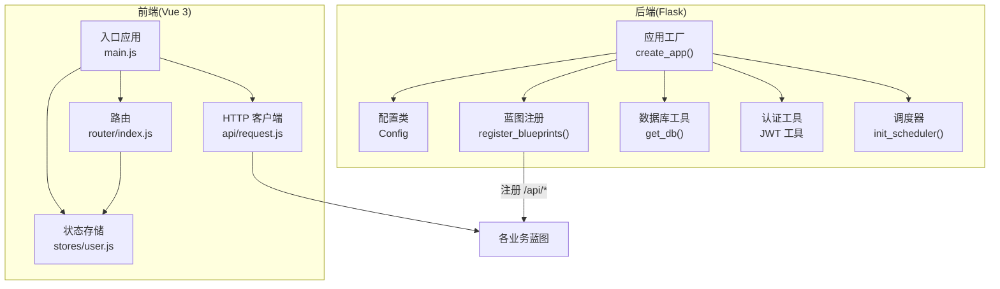
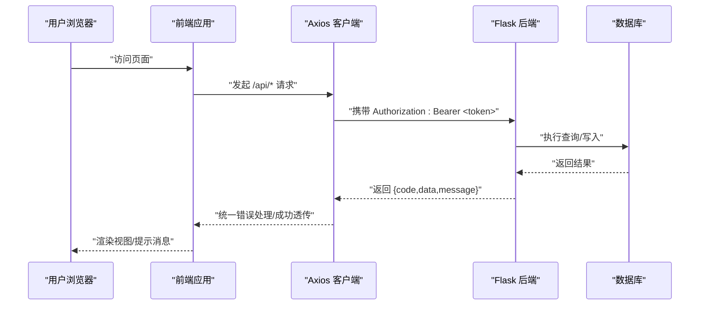
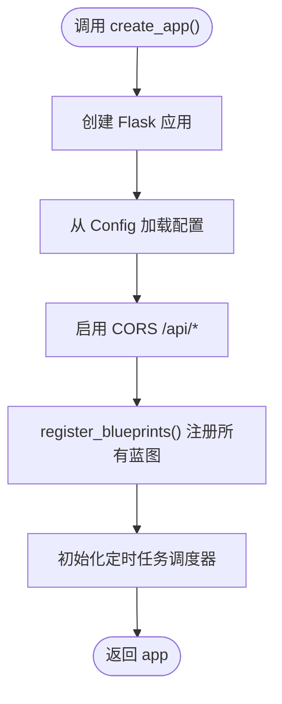
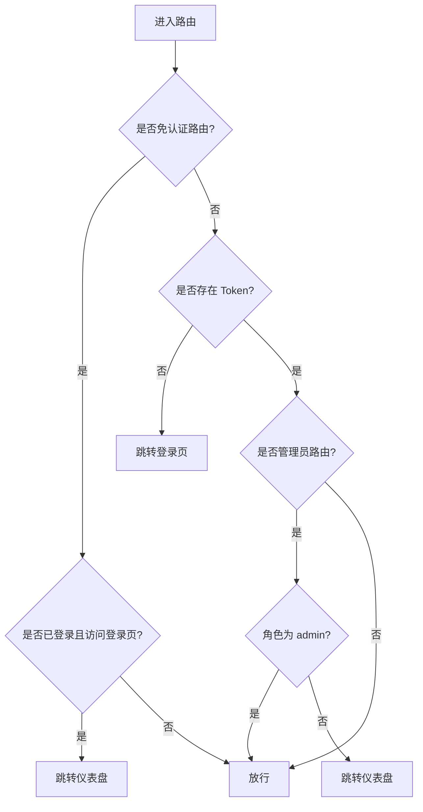
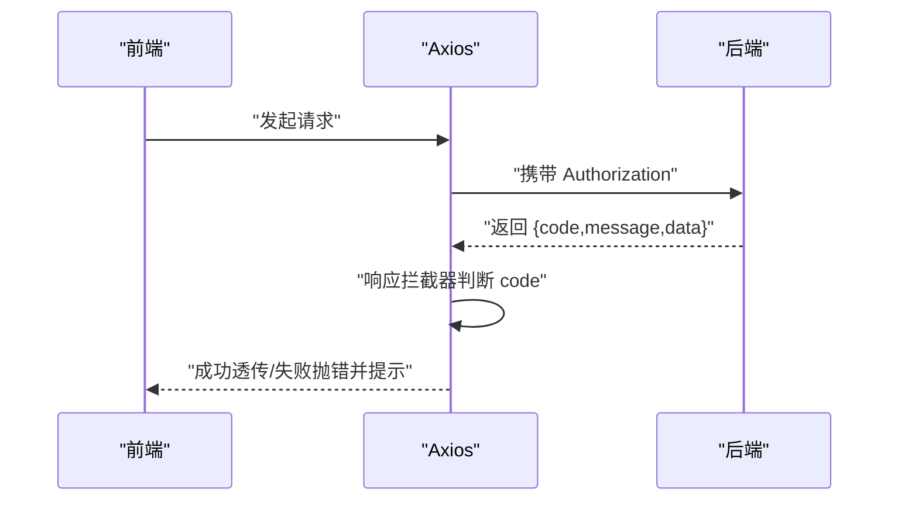
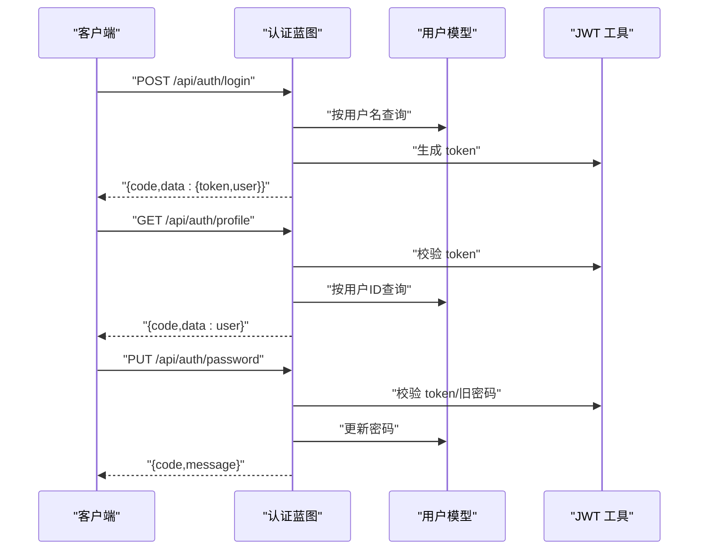
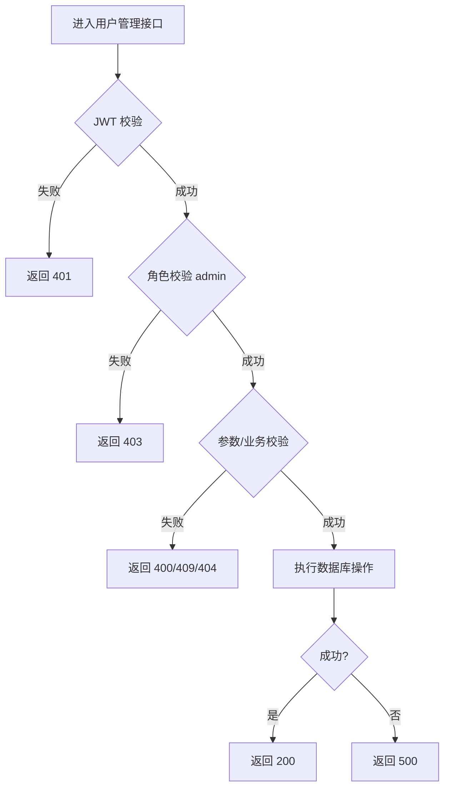
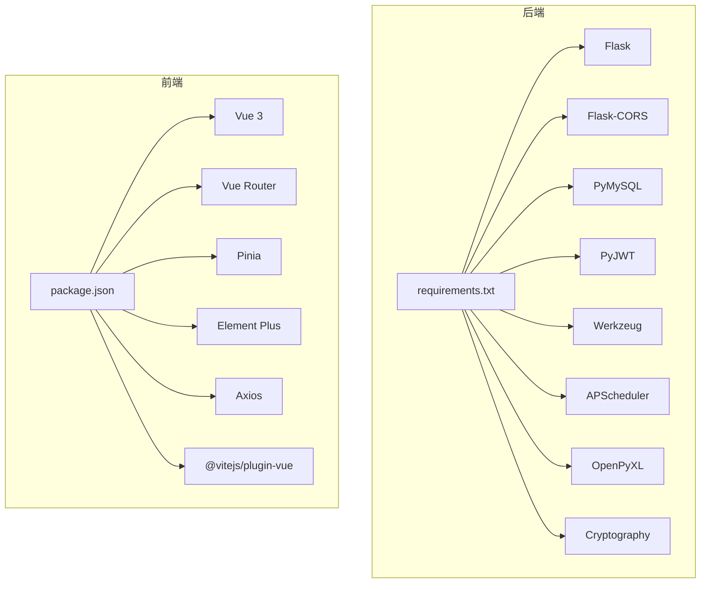

# 开发指南

<cite>
**本文引用的文件**
- [backend/app/__init__.py](file://backend/app/__init__.py)
- [backend/app/config.py](file://backend/app/config.py)
- [backend/app/extensions.py](file://backend/app/extensions.py)
- [backend/requirements.txt](file://backend/requirements.txt)
- [backend/app/utils/db.py](file://backend/app/utils/db.py)
- [backend/app/utils/auth.py](file://backend/app/utils/auth.py)
- [backend/app/utils/scheduler.py](file://backend/app/utils/scheduler.py)
- [backend/app/api/auth.py](file://backend/app/api/auth.py)
- [backend/app/api/users.py](file://backend/app/api/users.py)
- [frontend/package.json](file://frontend/package.json)
- [frontend/vite.config.js](file://frontend/vite.config.js)
- [frontend/src/main.js](file://frontend/src/main.js)
- [frontend/src/router/index.js](file://frontend/src/router/index.js)
- [frontend/src/stores/user.js](file://frontend/src/stores/user.js)
- [frontend/src/api/request.js](file://frontend/src/api/request.js)
</cite>

## 目录
1. [简介](#简介)
2. [项目结构](#项目结构)
3. [核心组件](#核心组件)
4. [架构总览](#架构总览)
5. [详细组件分析](#详细组件分析)
6. [依赖分析](#依赖分析)
7. [性能考虑](#性能考虑)
8. [故障排查指南](#故障排查指南)
9. [结论](#结论)
10. [附录](#附录)

## 简介
本开发指南面向云运维平台的后端与前端开发者，目标是帮助你快速理解并高效扩展系统。内容涵盖：代码规范、开发流程与最佳实践；前后端开发环境配置与调试技巧；测试策略；项目结构组织与模块化开发；API 开发规范、数据库操作规范与前端组件开发规范；性能优化建议、错误处理模式与日志记录标准；以及如何添加新功能、扩展现有模块与集成第三方服务。

## 项目结构
项目采用前后端分离架构：
- 后端基于 Flask，使用蓝图组织 API，统一通过 /api 前缀暴露接口，支持跨域与定时任务。
- 前端基于 Vue 3 + Vite，使用 Pinia 状态管理、Element Plus UI 组件库与 Vue Router 路由。
- 数据库连接通过 PyMySQL 提供，配置集中于 Config 类并通过 Flask 应用上下文注入。

图表来源
- [backend/app/__init__.py:6-25](file://backend/app/__init__.py#L6-L25)
- [backend/app/config.py:4-21](file://backend/app/config.py#L4-L21)
- [backend/app/utils/db.py:5-17](file://backend/app/utils/db.py#L5-L17)
- [backend/app/utils/auth.py:11-35](file://backend/app/utils/auth.py#L11-L35)
- [backend/app/utils/scheduler.py](file://backend/app/utils/scheduler.py)
- [frontend/src/main.js:10-22](file://frontend/src/main.js#L10-L22)
- [frontend/src/router/index.js:30-61](file://frontend/src/router/index.js#L30-L61)
- [frontend/src/stores/user.js:1-41](file://frontend/src/stores/user.js#L1-L41)
- [frontend/src/api/request.js:5-54](file://frontend/src/api/request.js#L5-L54)

章节来源
- [backend/app/__init__.py:6-53](file://backend/app/__init__.py#L6-L53)
- [backend/app/config.py:4-21](file://backend/app/config.py#L4-L21)
- [frontend/src/main.js:10-22](file://frontend/src/main.js#L10-L22)

## 核心组件
- 应用工厂与蓝图注册：通过 create_app() 初始化 Flask 应用、CORS、注册全部蓝图，并启动定时任务。
- 配置中心：集中管理密钥、数据库连接、上传目录与调试参数等。
- 数据库工具：提供统一的数据库连接获取方法，便于在各模块中复用。
- 认证工具：封装 JWT 的生成、校验与密码哈希/校验逻辑。
- 前端入口与路由：全局安装 UI 组件库、路由守卫与状态存储，统一处理鉴权与错误提示。
- HTTP 客户端：Axios 实例封装，自动注入 Authorization 头与统一错误处理。

章节来源
- [backend/app/__init__.py:6-53](file://backend/app/__init__.py#L6-L53)
- [backend/app/config.py:4-21](file://backend/app/config.py#L4-L21)
- [backend/app/utils/db.py:5-17](file://backend/app/utils/db.py#L5-L17)
- [backend/app/utils/auth.py:11-83](file://backend/app/utils/auth.py#L11-L83)
- [frontend/src/main.js:10-22](file://frontend/src/main.js#L10-L22)
- [frontend/src/router/index.js:30-61](file://frontend/src/router/index.js#L30-L61)
- [frontend/src/stores/user.js:1-41](file://frontend/src/stores/user.js#L1-L41)
- [frontend/src/api/request.js:5-54](file://frontend/src/api/request.js#L5-L54)

## 架构总览
后端以 Flask 为核心，通过蓝图划分业务域，统一在 /api 下提供 REST 接口；前端通过 Axios 发起请求，自动携带 Token 并进行统一错误处理；路由守卫控制访问权限与页面跳转；状态存储持久化用户信息与登录态。

图表来源
- [frontend/src/api/request.js:14-51](file://frontend/src/api/request.js#L14-L51)
- [backend/app/api/auth.py:14-82](file://backend/app/api/auth.py#L14-L82)
- [backend/app/utils/db.py:5-17](file://backend/app/utils/db.py#L5-L17)

## 详细组件分析

### 后端应用工厂与蓝图注册
- create_app(): 初始化 Flask 应用、从 Config 注入配置、启用 CORS、注册所有业务蓝图、初始化定时任务。
- register_blueprints(): 统一注册认证、用户、导出、任务、服务器、服务、账号、应用、证书、记录、仪表盘等蓝图。

图表来源
- [backend/app/__init__.py:6-25](file://backend/app/__init__.py#L6-L25)
- [backend/app/__init__.py:28-53](file://backend/app/__init__.py#L28-L53)

章节来源
- [backend/app/__init__.py:6-53](file://backend/app/__init__.py#L6-L53)

### 配置管理
- Config 类集中定义密钥、数据库连接、主机与端口、上传目录与最大文件大小、调试开关等。
- 后端通过 app.config.from_object(Config) 与逐项赋值方式注入配置。

章节来源
- [backend/app/config.py:4-21](file://backend/app/config.py#L4-L21)
- [backend/app/__init__.py:8-13](file://backend/app/__init__.py#L8-L13)

### 数据库连接工具
- get_db(): 从 Flask 当前应用配置读取数据库参数，返回 PyMySQL 连接对象，DictCursor 便于字典化查询结果。

章节来源
- [backend/app/utils/db.py:5-17](file://backend/app/utils/db.py#L5-L17)

### 认证与密码处理
- generate_token(): 生成带过期时间的 JWT，payload 包含用户 ID、用户名、角色与签发/过期时间。
- verify_token(): 校验并解码 JWT，处理过期与无效令牌。
- hash_password()/check_password(): 使用 Werkzeug 生成与校验密码哈希。

章节来源
- [backend/app/utils/auth.py:11-83](file://backend/app/utils/auth.py#L11-L83)

### 前端应用入口与插件安装
- main.js: 创建 Vue 应用，安装 Pinia、Vue Router、Element Plus（中文本地化），注册 Element Plus 图标组件，挂载应用。

章节来源
- [frontend/src/main.js:10-22](file://frontend/src/main.js#L10-L22)

### 路由与权限控制
- 路由定义：登录页无需认证；根路径进入主布局并重定向至仪表盘；子路由覆盖主要业务页面。
- 路由守卫：未登录访问受保护路由跳转登录；管理员专属路由需校验用户角色；登录页已登录跳转仪表盘。

图表来源
- [frontend/src/router/index.js:36-58](file://frontend/src/router/index.js#L36-L58)

章节来源
- [frontend/src/router/index.js:30-61](file://frontend/src/router/index.js#L30-L61)

### 状态存储与用户信息
- useUserStore：维护 token 与 userInfo，计算登录态与管理员态，提供设置、拉取资料与登出方法；持久化到 localStorage。

章节来源
- [frontend/src/stores/user.js:1-41](file://frontend/src/stores/user.js#L1-L41)

### HTTP 客户端与统一错误处理
- Axios 实例：baseURL 指向 /api，超时 15 秒，JSON 默认头。
- 请求拦截：自动附加 Authorization: Bearer token。
- 响应拦截：当 code 非 200 时统一弹窗报错并拒绝 Promise；401 清理本地存储并跳转登录。

图表来源
- [frontend/src/api/request.js:14-51](file://frontend/src/api/request.js#L14-L51)

章节来源
- [frontend/src/api/request.js:5-54](file://frontend/src/api/request.js#L5-L54)

### 认证 API 流程
- 登录：校验用户名/密码与激活状态，生成 JWT 返回用户信息。
- 获取资料：JWT 校验后返回用户信息。
- 修改密码：JWT 校验、旧密码校验、新密码长度校验、更新密码。

图表来源
- [backend/app/api/auth.py:14-184](file://backend/app/api/auth.py#L14-L184)
- [backend/app/utils/auth.py:11-35](file://backend/app/utils/auth.py#L11-L35)

章节来源
- [backend/app/api/auth.py:14-184](file://backend/app/api/auth.py#L14-L184)
- [backend/app/utils/auth.py:11-83](file://backend/app/utils/auth.py#L11-L83)

### 用户管理 API 流程
- 列表、创建、更新、删除、重置密码均需管理员权限与 JWT 校验；创建与更新对字段进行严格校验；删除禁止自删。

图表来源
- [backend/app/api/users.py:17-268](file://backend/app/api/users.py#L17-L268)

章节来源
- [backend/app/api/users.py:17-268](file://backend/app/api/users.py#L17-L268)

## 依赖分析
- 后端依赖：Flask、Flask-CORS、PyMySQL、PyJWT、Werkzeug、APScheduler、OpenPyXL、Cryptography。
- 前端依赖：Vue 3、Vue Router、Pinia、Element Plus、Axios、Vite 插件。

图表来源
- [backend/requirements.txt:1-9](file://backend/requirements.txt#L1-L9)
- [frontend/package.json:11-22](file://frontend/package.json#L11-L22)

章节来源
- [backend/requirements.txt:1-9](file://backend/requirements.txt#L1-L9)
- [frontend/package.json:11-22](file://frontend/package.json#L11-L22)

## 性能考虑
- 后端
  - 数据库连接：使用统一连接工具，避免重复创建连接；在高并发场景下可引入连接池或连接复用策略。
  - 调度任务：合理设置任务间隔与并发度，避免阻塞主线程；将耗时任务放入后台队列。
  - 响应体大小：通过 MAX_CONTENT_LENGTH 控制上传大小，防止内存压力过大。
- 前端
  - 按需加载：路由与组件使用动态导入，减少首屏体积。
  - 缓存策略：利用浏览器缓存与状态存储缓存用户信息，减少重复请求。
  - 请求节流：对频繁触发的 API 调用增加防抖/节流。

## 故障排查指南
- 后端
  - CORS 问题：确认 /api 前缀已正确配置允许来源与凭据。
  - 认证失败：检查 JWT_SECRET_KEY、过期时间与前端是否正确携带 Authorization 头。
  - 数据库连接：核对 DB_HOST/DB_PORT/DB_USER/DB_PASSWORD/DB_NAME 环境变量。
  - 定时任务：确认调度器初始化与任务注册顺序正确。
- 前端
  - 代理不通：确认 Vite 代理指向后端地址与端口一致。
  - 登录态异常：检查 localStorage 中 token 与 userInfo 是否同步更新；401 时是否被清理。
  - 统一错误：响应拦截器会根据 code 弹窗提示，注意查看控制台与消息提示。

章节来源
- [backend/app/__init__.py:15-23](file://backend/app/__init__.py#L15-L23)
- [backend/app/config.py:5-21](file://backend/app/config.py#L5-L21)
- [frontend/vite.config.js:8-14](file://frontend/vite.config.js#L8-L14)
- [frontend/src/api/request.js:25-51](file://frontend/src/api/request.js#L25-L51)

## 结论
本指南提供了云运维平台的开发与扩展路径：以 Flask 蓝图为骨架组织后端 API，以 Vue 3 生态构建前端交互；通过统一的认证与数据库工具提升可维护性；借助路由守卫与状态存储保障安全与体验。遵循本文的规范与流程，你可以高效地新增模块、集成第三方能力并持续优化性能与稳定性。

## 附录

### 开发环境配置与调试
- 后端
  - 安装依赖：使用 requirements.txt。
  - 设置环境变量：SECRET_KEY、JWT_SECRET_KEY、DB_*、FLASK_*。
  - 启动应用：通过 run.py 或 Flask CLI。
- 前端
  - 安装依赖：使用 package.json。
  - 启动开发服务器：Vite 默认端口 3000，代理 /api 到后端 5000。
  - 构建与预览：npm scripts 提供 dev/build/preview。

章节来源
- [backend/requirements.txt:1-9](file://backend/requirements.txt#L1-L9)
- [backend/app/config.py:5-21](file://backend/app/config.py#L5-L21)
- [frontend/package.json:6-10](file://frontend/package.json#L6-L10)
- [frontend/vite.config.js:6-14](file://frontend/vite.config.js#L6-L14)

### API 开发规范
- 路由前缀：统一使用 /api/{domain}。
- 响应格式：统一 {code, message, data}，code=200 表示成功。
- 认证：需要鉴权的接口使用 @jwt_required；管理员接口使用 @role_required(['admin'])。
- 参数校验：在视图函数内进行必填与范围校验，返回明确的错误码与提示。
- 错误处理：捕获异常并返回 500，同时在前端统一拦截与提示。

章节来源
- [backend/app/api/auth.py:14-184](file://backend/app/api/auth.py#L14-L184)
- [backend/app/api/users.py:17-268](file://backend/app/api/users.py#L17-L268)

### 数据库操作规范
- 连接获取：使用 get_db() 从应用配置读取连接参数。
- 查询结果：使用 DictCursor，便于字典化访问。
- 事务与并发：复杂写入建议使用事务；高并发场景评估锁与重试策略。
- 安全：参数化查询，避免 SQL 注入；敏感字段加密存储。

章节来源
- [backend/app/utils/db.py:5-17](file://backend/app/utils/db.py#L5-L17)

### 前端组件开发规范
- 组件命名：语义化命名，按页面拆分目录。
- 状态管理：用户信息与登录态放入 Pinia Store，持久化到 localStorage。
- 路由设计：受保护路由与管理员路由明确 meta 标记，配合路由守卫。
- 请求封装：统一使用 api/request.js，自动注入 Token 与错误处理。
- UI 组件：优先使用 Element Plus，保持风格一致。

章节来源
- [frontend/src/main.js:10-22](file://frontend/src/main.js#L10-L22)
- [frontend/src/router/index.js:30-61](file://frontend/src/router/index.js#L30-L61)
- [frontend/src/stores/user.js:1-41](file://frontend/src/stores/user.js#L1-L41)
- [frontend/src/api/request.js:5-54](file://frontend/src/api/request.js#L5-L54)

### 测试策略
- 单元测试：针对工具函数（JWT、密码哈希、数据库连接）编写测试。
- 接口测试：使用 pytest + Flask 测试客户端或 curl/postman，覆盖正常/异常路径。
- 前端测试：组件快照与交互测试，结合路由守卫与状态存储行为验证。
- 性能测试：压测 /api 接口，观察数据库连接与响应延迟。

### 新功能添加与模块扩展
- 后端
  - 新增蓝图：在 app/api 下创建模块文件，定义蓝图与路由。
  - 注册蓝图：在 register_blueprints() 中添加新蓝图。
  - 配置扩展：在 Config 中新增必要参数并在 create_app() 注入。
- 前端
  - 新增页面：在 views 下创建组件，在 router 中注册路由。
  - 新增 API：在 src/api 下新增模块，封装请求方法。
  - 状态扩展：在 stores 中新增 Store 或扩展现有 Store。

### 第三方服务集成
- 认证：可替换为 OAuth2/OpenID Connect，调整鉴权中间件与前端登录流程。
- 存储：可接入对象存储 SDK，替换上传逻辑与文件管理。
- 监控：接入日志与指标 SDK，统一埋点与告警。