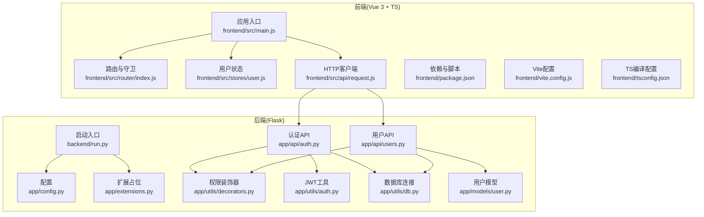
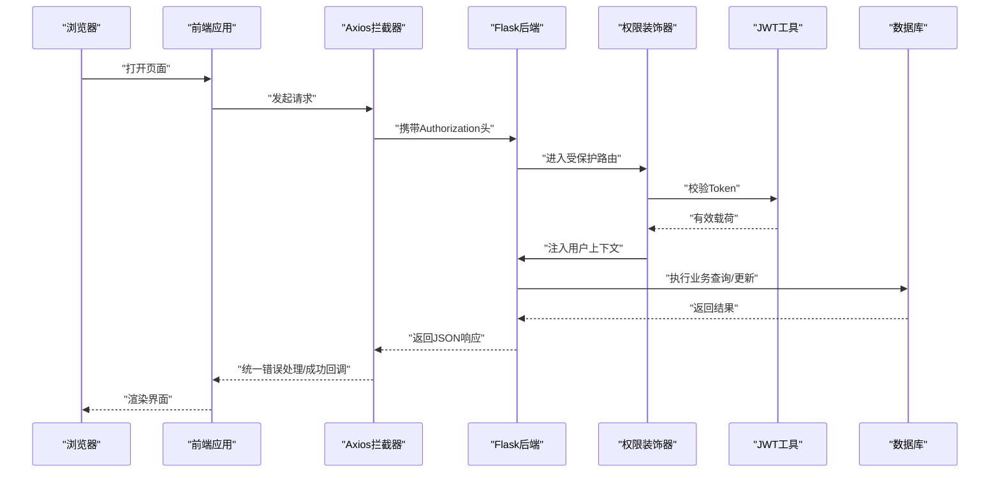
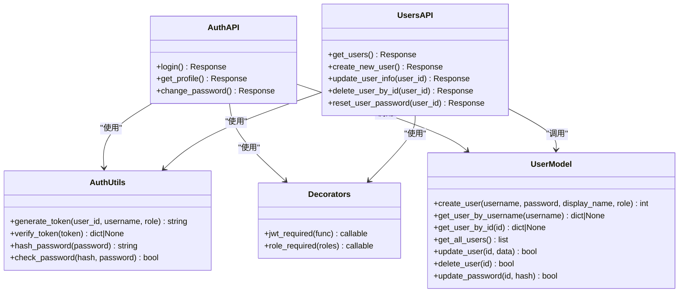
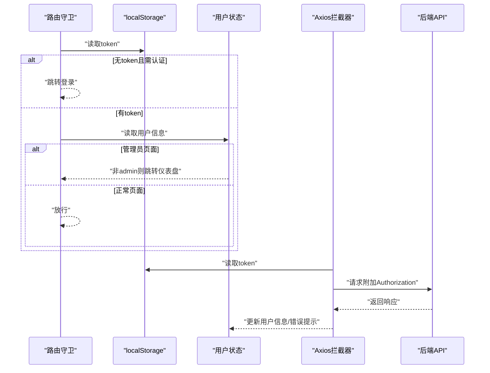
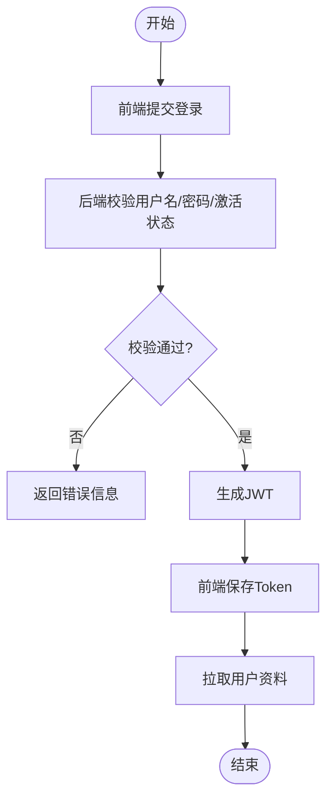
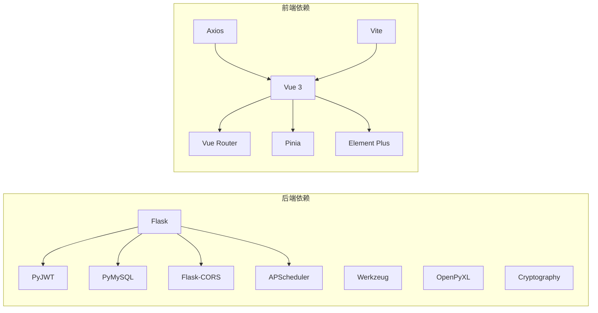

# 开发指南

<cite>
**本文引用的文件**
- [requirements.txt](file://backend/requirements.txt)
- [config.py](file://backend/app/config.py)
- [extensions.py](file://backend/app/extensions.py)
- [run.py](file://backend/run.py)
- [auth.py](file://backend/app/api/auth.py)
- [users.py](file://backend/app/api/users.py)
- [decorators.py](file://backend/app/utils/decorators.py)
- [auth_utils.py](file://backend/app/utils/auth.py)
- [db.py](file://backend/app/utils/db.py)
- [user_model.py](file://backend/app/models/user.py)
- [package.json](file://frontend/package.json)
- [vite.config.js](file://frontend/vite.config.js)
- [tsconfig.json](file://frontend/tsconfig.json)
- [main.js](file://frontend/src/main.js)
- [router_index.js](file://frontend/src/router/index.js)
- [user_store.js](file://frontend/src/stores/user.js)
- [request.js](file://frontend/src/api/request.js)
</cite>

## 目录
1. [简介](#简介)
2. [项目结构](#项目结构)
3. [核心组件](#核心组件)
4. [架构总览](#架构总览)
5. [详细组件分析](#详细组件分析)
6. [依赖关系分析](#依赖关系分析)
7. [性能考虑](#性能考虑)
8. [故障排查指南](#故障排查指南)
9. [结论](#结论)
10. [附录](#附录)

## 简介
本开发指南面向云运维平台的后端与前端开发者，提供统一的代码规范、最佳实践、开发环境配置、调试技巧、测试方法、扩展性设计、插件系统开发思路、第三方服务集成方式与性能优化建议，并涵盖代码审查流程、持续集成配置要点与文档维护规范等团队协作实践。

## 项目结构
项目采用前后端分离架构：后端基于 Flask，提供 REST API；前端基于 Vue 3 + TypeScript，使用 Vite 构建与代理开发。核心目录与职责如下：
- 后端 backend
  - app/api：按功能划分的蓝图模块，如认证、用户、仪表盘等
  - app/utils：通用工具，如认证、数据库连接、调度器、装饰器
  - app/models：领域模型封装，如用户模型
  - app/config.py：运行时配置加载
  - app/extensions.py：扩展初始化占位
  - requirements.txt：后端依赖
  - run.py：后端启动入口
- 前端 frontend
  - src/api：HTTP 客户端封装与各业务 API 模块
  - src/stores：状态管理（Pinia）
  - src/router：路由定义与鉴权守卫
  - vite.config.js：开发服务器与代理配置
  - tsconfig.json：TypeScript 编译选项
  - package.json：前端依赖与脚本

图表来源
- [config.py:1-21](file://backend/app/config.py#L1-L21)
- [extensions.py:1-2](file://backend/app/extensions.py#L1-L2)
- [auth.py:1-184](file://backend/app/api/auth.py#L1-L184)
- [users.py:1-268](file://backend/app/api/users.py#L1-L268)
- [decorators.py:1-95](file://backend/app/utils/decorators.py#L1-L95)
- [auth_utils.py:1-83](file://backend/app/utils/auth.py#L1-L83)
- [db.py:1-17](file://backend/app/utils/db.py#L1-L17)
- [user_model.py:1-183](file://backend/app/models/user.py#L1-L183)
- [main.js:1-23](file://frontend/src/main.js#L1-L23)
- [router_index.js:1-61](file://frontend/src/router/index.js#L1-L61)
- [user_store.js:1-41](file://frontend/src/stores/user.js#L1-L41)
- [request.js:1-54](file://frontend/src/api/request.js#L1-L54)
- [run.py](file://backend/run.py)

章节来源
- [requirements.txt:1-9](file://backend/requirements.txt#L1-L9)
- [config.py:1-21](file://backend/app/config.py#L1-L21)
- [package.json:1-24](file://frontend/package.json#L1-L24)
- [vite.config.js:1-17](file://frontend/vite.config.js#L1-L17)
- [tsconfig.json:1-27](file://frontend/tsconfig.json#L1-L27)

## 核心组件
- 后端配置与启动
  - 配置加载：从环境变量读取密钥、数据库、主机与端口、上传目录与大小限制等
  - 启动入口：通过 run.py 启动 Flask 应用
- 认证与授权
  - JWT 工具：生成与校验 Token，支持过期时间与算法
  - 权限装饰器：统一从请求头提取 Bearer Token 并注入用户上下文；角色权限校验
  - 认证 API：登录、获取当前用户资料、修改密码
  - 用户管理 API：管理员视角的用户增删改查与密码重置
- 数据访问层
  - 数据库连接：基于 PyMySQL 的连接池配置
  - 用户模型：封装用户 CRUD 与密码更新
- 前端应用
  - 应用入口：注册 Pinia、路由、Element Plus 国际化与图标
  - 路由与守卫：登录态判断、管理员权限控制
  - 状态管理：用户令牌与信息持久化到本地存储
  - HTTP 客户端：统一请求头注入、响应拦截与错误提示

章节来源
- [config.py:1-21](file://backend/app/config.py#L1-L21)
- [auth_utils.py:1-83](file://backend/app/utils/auth.py#L1-L83)
- [decorators.py:1-95](file://backend/app/utils/decorators.py#L1-L95)
- [auth.py:1-184](file://backend/app/api/auth.py#L1-L184)
- [users.py:1-268](file://backend/app/api/users.py#L1-L268)
- [db.py:1-17](file://backend/app/utils/db.py#L1-L17)
- [user_model.py:1-183](file://backend/app/models/user.py#L1-L183)
- [main.js:1-23](file://frontend/src/main.js#L1-L23)
- [router_index.js:1-61](file://frontend/src/router/index.js#L1-L61)
- [user_store.js:1-41](file://frontend/src/stores/user.js#L1-L41)
- [request.js:1-54](file://frontend/src/api/request.js#L1-L54)

## 架构总览
后端以蓝图模块化组织 API，统一通过装饰器完成认证与授权；前端通过 Axios 封装统一处理鉴权头与错误提示，路由守卫保障页面级访问控制。开发时前端通过 Vite 代理将 /api 请求转发至后端。

图表来源
- [request.js:1-54](file://frontend/src/api/request.js#L1-L54)
- [router_index.js:1-61](file://frontend/src/router/index.js#L1-L61)
- [decorators.py:1-95](file://backend/app/utils/decorators.py#L1-L95)
- [auth_utils.py:1-83](file://backend/app/utils/auth.py#L1-L83)
- [auth.py:1-184](file://backend/app/api/auth.py#L1-L184)
- [users.py:1-268](file://backend/app/api/users.py#L1-L268)
- [db.py:1-17](file://backend/app/utils/db.py#L1-L17)

## 详细组件分析

### 后端认证与授权组件
- JWT 工具
  - 生成：包含用户 ID、用户名、角色、签发时间与过期时间，使用 HS256 算法签名
  - 校验：捕获过期与无效 Token 异常，返回空表示失败
- 权限装饰器
  - 从 Authorization 头解析 Bearer Token，校验失败直接返回 401
  - 将用户信息写入 flask.g.current_user，供后续中间件使用
  - 角色装饰器在 JWT 之后使用，检查用户角色是否在允许列表内
- 认证 API
  - 登录：校验用户名与密码，检查账户激活状态，生成 Token 返回
  - 获取资料：JWT 校验后返回用户信息
  - 修改密码：校验旧密码，长度限制，更新密码哈希
- 用户管理 API
  - 管理员权限：仅 admin 可调用
  - 创建用户：校验必填字段、角色合法性、密码长度，检查用户名唯一性
  - 更新用户：支持显示名、角色、激活状态，构建动态 SQL 更新
  - 删除用户：禁止删除自身，检查用户存在性
  - 重置密码：管理员重置指定用户密码

图表来源
- [auth_utils.py:1-83](file://backend/app/utils/auth.py#L1-L83)
- [decorators.py:1-95](file://backend/app/utils/decorators.py#L1-L95)
- [auth.py:1-184](file://backend/app/api/auth.py#L1-L184)
- [users.py:1-268](file://backend/app/api/users.py#L1-L268)
- [user_model.py:1-183](file://backend/app/models/user.py#L1-L183)

章节来源
- [auth_utils.py:1-83](file://backend/app/utils/auth.py#L1-L83)
- [decorators.py:1-95](file://backend/app/utils/decorators.py#L1-L95)
- [auth.py:1-184](file://backend/app/api/auth.py#L1-L184)
- [users.py:1-268](file://backend/app/api/users.py#L1-L268)
- [user_model.py:1-183](file://backend/app/models/user.py#L1-L183)

### 前端组件与交互
- 应用入口
  - 初始化 Pinia、路由、Element Plus（中文）与全局图标
- 路由与守卫
  - 登录页免认证；未登录访问受保护路由跳转登录
  - 管理员页面要求 admin 角色
  - 登录成功后自动跳转仪表盘
- 状态管理
  - 令牌与用户信息持久化到 localStorage
  - 提供获取资料、登出等方法
- HTTP 客户端
  - 默认 baseURL 为 /api，超时 15 秒
  - 请求拦截器自动附加 Bearer Token
  - 响应拦截器统一处理业务错误与 401 登录过期

图表来源
- [router_index.js:1-61](file://frontend/src/router/index.js#L1-L61)
- [user_store.js:1-41](file://frontend/src/stores/user.js#L1-L41)
- [request.js:1-54](file://frontend/src/api/request.js#L1-L54)

章节来源
- [main.js:1-23](file://frontend/src/main.js#L1-L23)
- [router_index.js:1-61](file://frontend/src/router/index.js#L1-L61)
- [user_store.js:1-41](file://frontend/src/stores/user.js#L1-L41)
- [request.js:1-54](file://frontend/src/api/request.js#L1-L54)

### 数据流与处理逻辑
- 登录流程
  - 前端提交用户名与密码
  - 后端查询用户并校验激活状态与密码
  - 生成 Token 并返回给前端
  - 前端保存 Token 并拉取用户资料
- 用户管理流程
  - 管理员调用用户管理 API
  - 后端校验 JWT 与角色
  - 动态构造 SQL 执行更新/删除
  - 返回统一业务码与消息

图表来源
- [auth.py:1-184](file://backend/app/api/auth.py#L1-L184)
- [auth_utils.py:1-83](file://backend/app/utils/auth.py#L1-L83)
- [request.js:1-54](file://frontend/src/api/request.js#L1-L54)

章节来源
- [auth.py:1-184](file://backend/app/api/auth.py#L1-L184)
- [auth_utils.py:1-83](file://backend/app/utils/auth.py#L1-L83)
- [request.js:1-54](file://frontend/src/api/request.js#L1-L54)

## 依赖关系分析
- 后端依赖
  - Flask 核心框架、CORS、PyMySQL、JWT、Werkzeug、APScheduler、OpenPyXL、Cryptography
- 前端依赖
  - Vue 3、Vue Router、Pinia、Element Plus、Axios、Vite 插件

图表来源
- [requirements.txt:1-9](file://backend/requirements.txt#L1-L9)
- [package.json:1-24](file://frontend/package.json#L1-L24)

章节来源
- [requirements.txt:1-9](file://backend/requirements.txt#L1-L9)
- [package.json:1-24](file://frontend/package.json#L1-L24)

## 性能考虑
- 后端
  - 连接池与游标：使用 DictCursor 便于字典化返回；注意在 finally 中关闭连接
  - 调度任务：APScheduler 用于定时任务，建议将耗时任务异步化
  - 序列化：统一返回结构，避免在视图中做复杂序列化
- 前端
  - 懒加载：路由按需加载组件，减少首屏体积
  - 状态最小化：Pinia 精简存储，避免冗余响应式
  - 请求缓存：对不频繁变更的数据可增加本地缓存策略
- 通用
  - 日志与监控：为关键路径埋点，结合后端日志与前端错误上报
  - CDN 与静态资源：生产环境启用压缩与缓存头

## 故障排查指南
- 认证相关
  - 401 缺少或格式错误的 Authorization 头；Token 过期或无效
  - 建议：检查前端拦截器是否正确附加 Bearer Token；确认后端 JWT 密钥一致
- 数据库连接
  - 连接失败：核对 DB_HOST/PORT/USER/PASSWORD/NAME；确保网络可达
  - 建议：在 get_db 中增加连接超时与重试策略
- 路由与权限
  - 页面无法访问：检查路由守卫逻辑与 localStorage 中的 token 与 userInfo
  - 管理员页面被拒绝：确认用户角色为 admin
- 前端代理
  - /api 404：确认 Vite 代理 target 地址与后端监听地址一致

章节来源
- [decorators.py:1-95](file://backend/app/utils/decorators.py#L1-L95)
- [auth_utils.py:1-83](file://backend/app/utils/auth.py#L1-L83)
- [db.py:1-17](file://backend/app/utils/db.py#L1-L17)
- [router_index.js:1-61](file://frontend/src/router/index.js#L1-L61)
- [request.js:1-54](file://frontend/src/api/request.js#L1-L54)
- [vite.config.js:1-17](file://frontend/vite.config.js#L1-L17)

## 结论
本指南提供了从架构到实现、从开发到运维的全链路实践建议。建议团队在日常开发中严格遵循本文规范，配合统一的 CI/CD 流程与文档维护机制，持续提升系统的稳定性、可扩展性与可维护性。

## 附录

### 代码规范与最佳实践
- Python 后端
  - 命名：模块与蓝图使用小写下划线；类使用 PascalCase；常量大写
  - 文档：每个 API 函数提供清晰的请求/响应说明与错误码约定
  - 错误处理：统一返回结构 {code, message, data?}；异常捕获与状态码映射
  - 安全：密码使用哈希；JWT 密钥在环境变量中管理；输入参数校验
- JavaScript/TypeScript 前端
  - 类型：开启严格模式；合理使用类型声明
  - 命名：组件与方法语义化；API 模块按功能拆分
  - 状态：Pinia 状态单一职责；避免在组件中直接操作 localStorage
  - 交互：Axios 统一拦截器；错误提示与用户引导明确

### Git 工作流程与分支管理
- 分支策略
  - main/master：发布分支
  - develop：开发主分支
  - feature/*：功能开发分支
  - hotfix/*：紧急修复分支
- 提交规范
  - type(scope): subject
  - 示例：feat(auth): 添加用户登录接口
- 合并与审查
  - Pull Request 必须通过代码审查与自动化测试
  - 合并前清理无用分支

### 开发环境配置
- 后端
  - 安装依赖：pip install -r requirements.txt
  - 设置环境变量：SECRET_KEY、JWT_SECRET_KEY、DB_*、FLASK_* 等
  - 启动：python run.py
- 前端
  - 安装依赖：npm install
  - 启动：npm run dev
  - 代理：Vite 将 /api 代理到后端地址

章节来源
- [requirements.txt:1-9](file://backend/requirements.txt#L1-L9)
- [config.py:1-21](file://backend/app/config.py#L1-L21)
- [package.json:1-24](file://frontend/package.json#L1-L24)
- [vite.config.js:1-17](file://frontend/vite.config.js#L1-L17)

### 调试技巧
- 后端
  - 使用 Flask 的调试模式（DEBUG），结合断点与日志
  - 对数据库操作增加事务回滚点，定位问题 SQL
- 前端
  - 使用浏览器开发者工具 Network 面板查看请求与响应
  - 在 Axios 拦截器中打印关键头与错误信息

### 单元测试与集成测试
- 后端
  - 使用 pytest 或 unittest；针对装饰器、工具函数与模型层编写用例
  - Mock 外部依赖（如数据库、JWT）以隔离测试
- 前端
  - 使用 Vitest/Jest；对 API 模块与组合式函数进行单元测试
  - 集成测试：使用 Playwright/Cypress 进行端到端验证

### 扩展性设计与插件系统
- 后端
  - 扩展初始化占位：在 extensions.py 中集中注册扩展
  - 蓝图模块化：新增功能以蓝图形式组织，保持高内聚低耦合
- 前端
  - 组件库化：将通用组件抽取为独立包
  - 插件化：通过插件注册中心管理功能开关与动态加载

章节来源
- [extensions.py:1-2](file://backend/app/extensions.py#L1-L2)

### 第三方服务集成
- 认证与授权：JWT 作为跨域安全令牌；可接入 OIDC/OAuth2 作为扩展
- 存储：MySQL 为主存储；可引入 Redis 缓存热点数据
- 文件：后端 uploads 目录用于文件上传；建议接入对象存储（如 OSS/COS）

### 性能优化技巧
- 后端
  - SQL 优化：索引覆盖、避免 N+1 查询；批量插入与更新
  - 缓存：热点数据缓存；分布式锁避免并发问题
- 前端
  - 资源压缩与懒加载；图片与字体优化；CDN 加速
- 监控
  - 接入 APM（如 Prometheus + Grafana）与日志聚合

### 代码审查流程
- 提交前自检：格式化、类型检查、单元测试通过
- Review 清单：安全性、健壮性、可读性、性能影响
- 合并策略：squash 合并，保证提交历史整洁

### 持续集成配置
- 触发条件：push 到 feature/*、hotfix/*；PR 合并到 develop/main
- 步骤：安装依赖、类型检查、单元测试、集成测试、打包构建、部署预览/生产
- 产物：后端镜像与前端静态资源

### 文档维护规范
- API 文档：OpenAPI/Swagger 自动生成与同步
- 架构文档：Mermaid 绘制，随代码变更同步更新
- 团队知识库：FAQ、最佳实践、排障手册