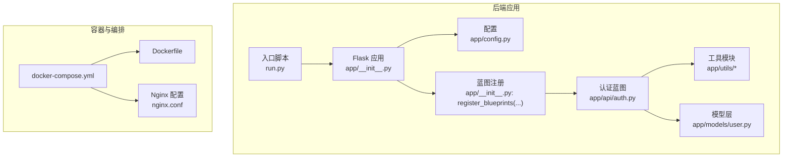
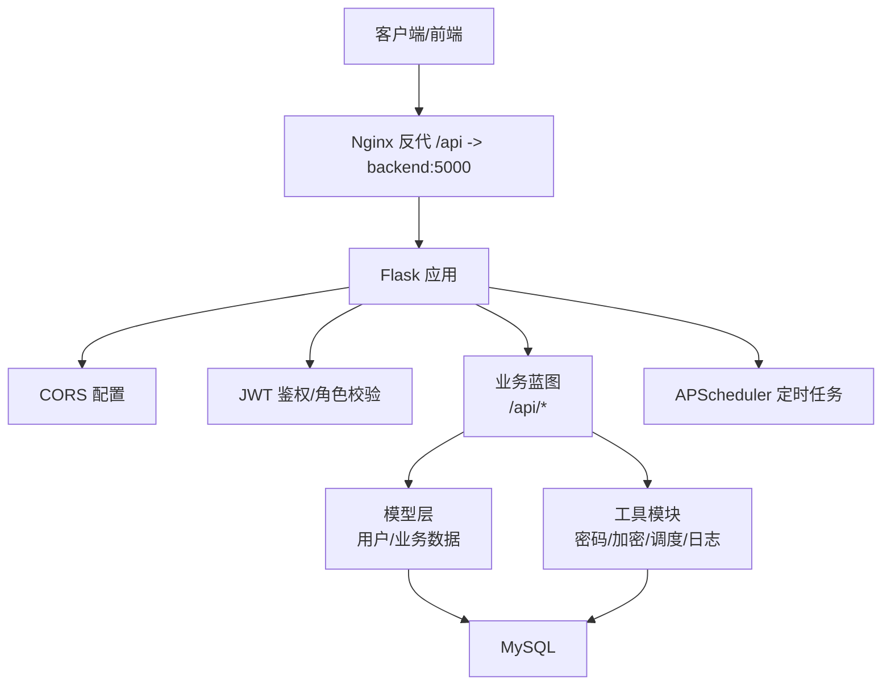
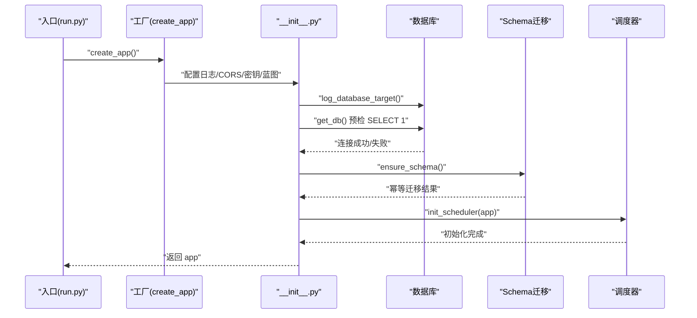
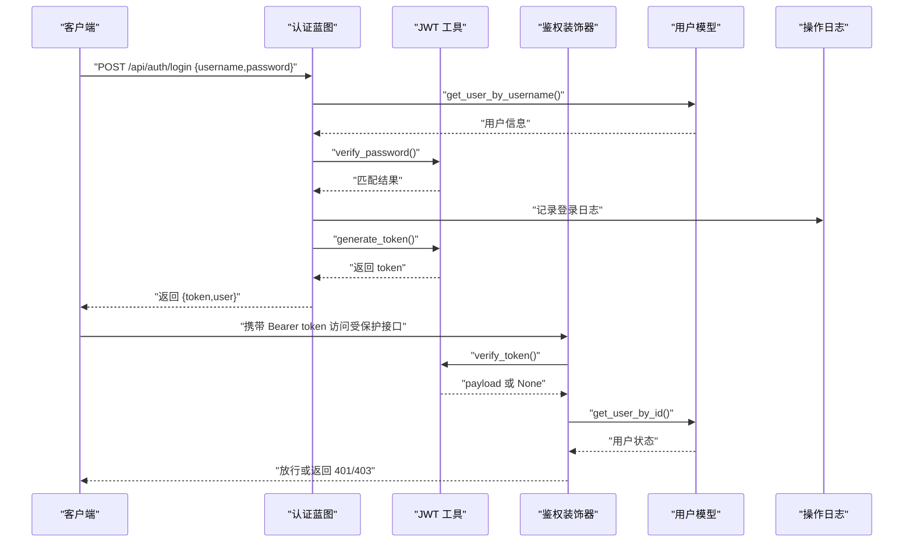
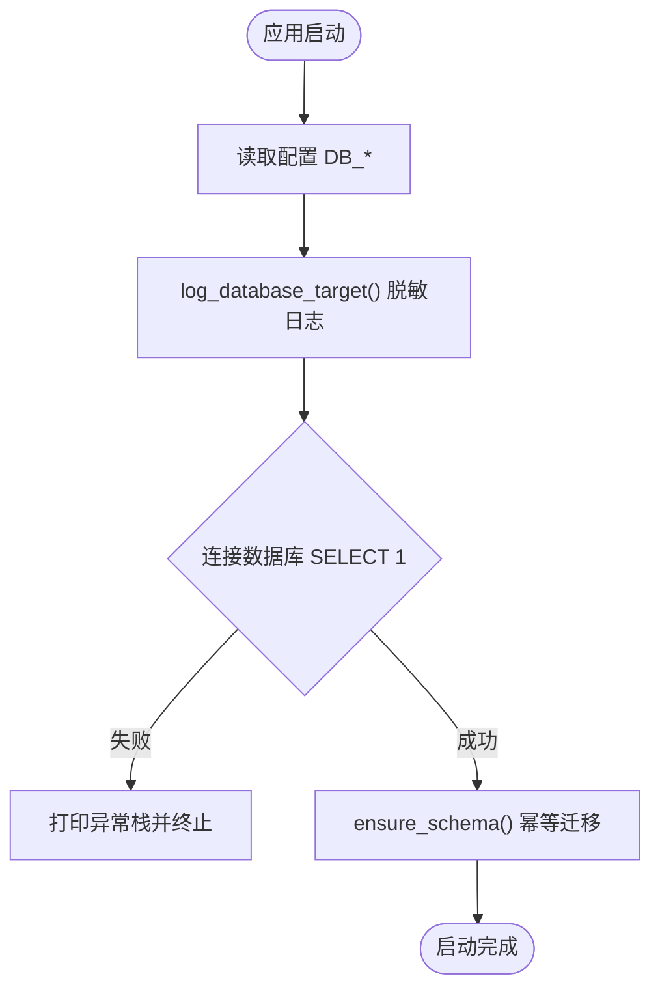
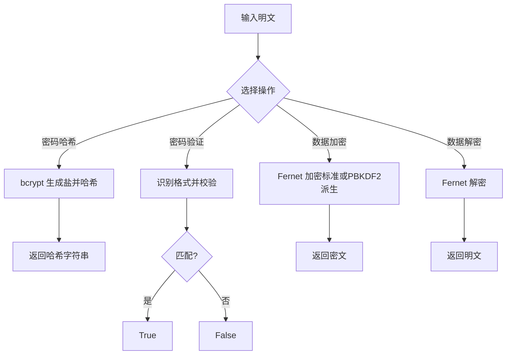
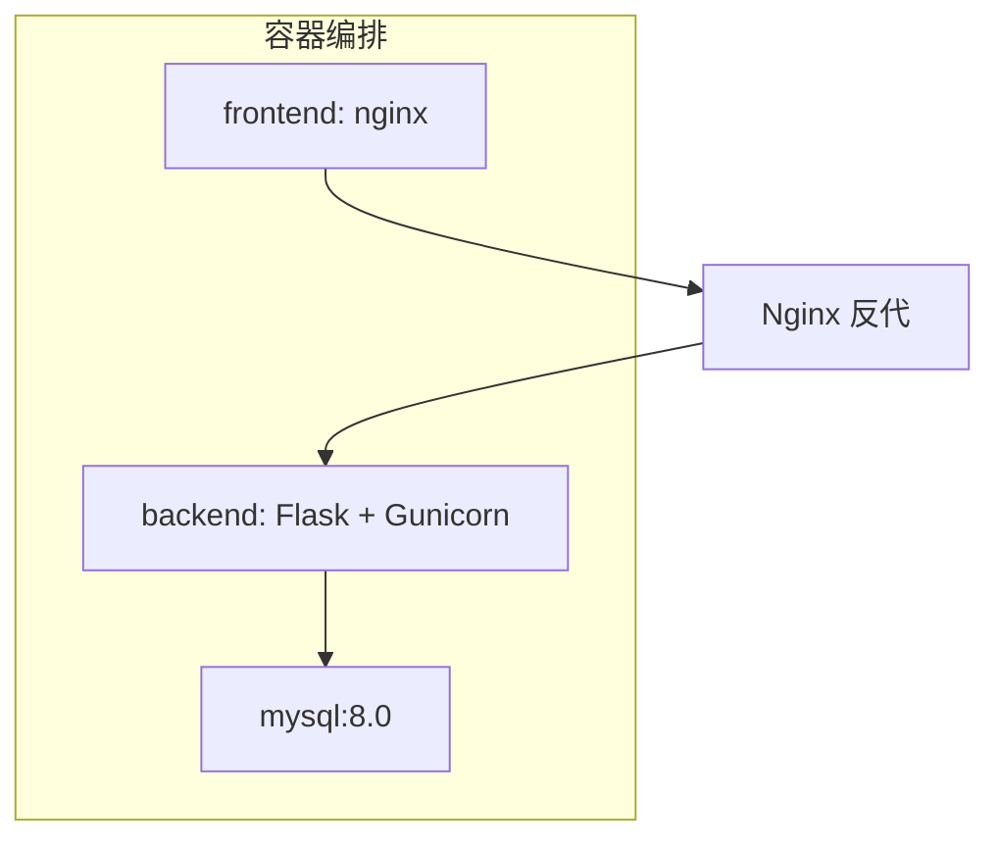
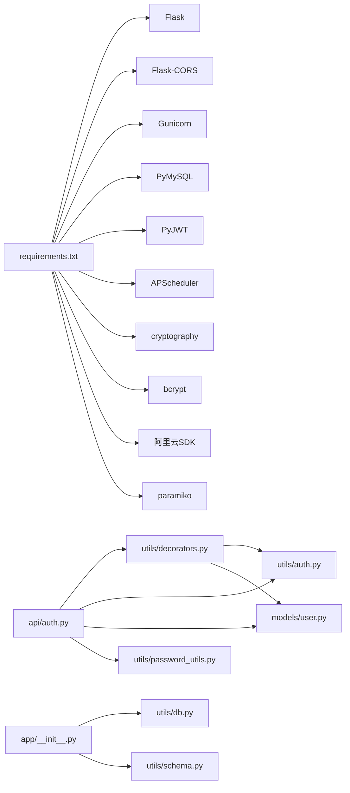

# 开发指南

<cite>
**本文引用的文件**
- [backend/app/__init__.py](file://backend/app/__init__.py)
- [backend/app/config.py](file://backend/app/config.py)
- [backend/run.py](file://backend/run.py)
- [backend/Dockerfile](file://backend/Dockerfile)
- [backend/docker-compose.yml](file://backend/docker-compose.yml)
- [backend/nginx.conf](file://backend/nginx.conf)
- [backend/app/api/auth.py](file://backend/app/api/auth.py)
- [backend/app/utils/db.py](file://backend/app/utils/db.py)
- [backend/app/utils/schema.py](file://backend/app/utils/schema.py)
- [backend/app/utils/decorators.py](file://backend/app/utils/decorators.py)
- [backend/app/utils/auth.py](file://backend/app/utils/auth.py)
- [backend/app/utils/password_utils.py](file://backend/app/utils/password_utils.py)
- [backend/app/models/user.py](file://backend/app/models/user.py)
- [backend/requirements.txt](file://backend/requirements.txt)
</cite>

## 目录
1. [简介](#简介)
2. [项目结构](#项目结构)
3. [核心组件](#核心组件)
4. [架构总览](#架构总览)
5. [详细组件分析](#详细组件分析)
6. [依赖分析](#依赖分析)
7. [性能考虑](#性能考虑)
8. [故障排查指南](#故障排查指南)
9. [结论](#结论)
10. [附录](#附录)

## 简介
本开发指南面向OPS项目的后端团队成员，旨在提供统一的代码规范、最佳实践、开发流程、测试策略、调试技巧、版本控制与分支管理策略，以及开发环境配置与团队协作规范。内容基于现有代码库进行提炼与总结，确保新功能开发与维护过程高效、安全、可追溯。

## 项目结构
后端采用Flask应用，按功能域组织蓝图（Blueprint），工具与通用逻辑集中在utils目录，模型层封装数据库访问，配置集中于Config类并通过环境变量注入。Docker与docker-compose提供容器化部署与前后端联调，Nginx负责静态资源与反向代理。

图表来源
- [backend/app/__init__.py:28-149](file://backend/app/__init__.py#L28-L149)
- [backend/app/config.py:10-58](file://backend/app/config.py#L10-L58)
- [backend/run.py:1-8](file://backend/run.py#L1-L8)
- [backend/app/api/auth.py:1-197](file://backend/app/api/auth.py#L1-L197)
- [backend/app/models/user.py:1-162](file://backend/app/models/user.py#L1-L162)
- [backend/app/utils/db.py:1-80](file://backend/app/utils/db.py#L1-L80)
- [backend/Dockerfile:1-36](file://backend/Dockerfile#L1-L36)
- [backend/docker-compose.yml:1-103](file://backend/docker-compose.yml#L1-L103)
- [backend/nginx.conf:1-70](file://backend/nginx.conf#L1-L70)

章节来源
- [backend/app/__init__.py:28-149](file://backend/app/__init__.py#L28-L149)
- [backend/app/config.py:10-58](file://backend/app/config.py#L10-L58)
- [backend/run.py:1-8](file://backend/run.py#L1-L8)
- [backend/Dockerfile:1-36](file://backend/Dockerfile#L1-L36)
- [backend/docker-compose.yml:1-103](file://backend/docker-compose.yml#L1-L103)
- [backend/nginx.conf:1-70](file://backend/nginx.conf#L1-L70)

## 核心组件
- 应用工厂与蓝图注册：通过工厂函数创建Flask应用，集中配置日志、CORS、JSON处理、数据库预检、定时任务初始化，并注册全部蓝图。
- 配置中心：Config类从环境变量读取密钥、数据库、CORS、定时任务计划、Grafana等参数，提供CORS源列表解析。
- 认证与授权：JWT签发与校验、装饰器鉴权与角色校验、密码哈希与验证、敏感数据对称加解密。
- 数据访问：Flask g上下文缓存数据库连接、连接参数脱敏日志、连接关闭钩子、轻量Schema迁移。
- 运行与容器化：run.py提供本地开发入口；Dockerfile定义镜像构建、Gunicorn部署、线程模型；docker-compose编排MySQL、后端、前端；Nginx反代/api与静态资源。

章节来源
- [backend/app/__init__.py:28-149](file://backend/app/__init__.py#L28-L149)
- [backend/app/config.py:10-58](file://backend/app/config.py#L10-L58)
- [backend/app/utils/auth.py:9-45](file://backend/app/utils/auth.py#L9-L45)
- [backend/app/utils/decorators.py:26-163](file://backend/app/utils/decorators.py#L26-L163)
- [backend/app/utils/password_utils.py:52-130](file://backend/app/utils/password_utils.py#L52-L130)
- [backend/app/utils/db.py:43-80](file://backend/app/utils/db.py#L43-L80)
- [backend/app/utils/schema.py:10-42](file://backend/app/utils/schema.py#L10-L42)
- [backend/run.py:1-8](file://backend/run.py#L1-L8)
- [backend/Dockerfile:34-36](file://backend/Dockerfile#L34-L36)
- [backend/docker-compose.yml:30-81](file://backend/docker-compose.yml#L30-L81)
- [backend/nginx.conf:32-47](file://backend/nginx.conf#L32-L47)

## 架构总览
后端采用“应用工厂 + 蓝图 + 工具模块 + 模型层”的分层结构，认证与业务API分离，数据库连接与Schema迁移在应用启动阶段完成，容器化部署由Gunicorn承载，Nginx负责静态资源与/api反代。

图表来源
- [backend/app/__init__.py:64-80](file://backend/app/__init__.py#L64-L80)
- [backend/app/utils/decorators.py:26-163](file://backend/app/utils/decorators.py#L26-L163)
- [backend/app/api/auth.py:15-96](file://backend/app/api/auth.py#L15-L96)
- [backend/app/models/user.py:36-71](file://backend/app/models/user.py#L36-L71)
- [backend/app/utils/db.py:43-80](file://backend/app/utils/db.py#L43-L80)
- [backend/nginx.conf:32-47](file://backend/nginx.conf#L32-L47)
- [backend/Dockerfile:34-36](file://backend/Dockerfile#L34-L36)

## 详细组件分析

### 组件A：应用工厂与启动流程
- 职责：创建Flask应用、配置日志、CORS、JSON中文输出、密钥校验、请求体大小限制、根路由、蓝图注册、数据库预检、Schema迁移、定时任务初始化。
- 关键点：日志输出到stderr便于容器收集；生产环境必须设置SECRET_KEY与JWT_SECRET_KEY；数据库预检失败时打印完整异常栈；Schema迁移幂等处理重复列。
- 性能与可靠性：数据库连接超时、DictCursor、teardown关闭连接；定时任务独立连接，失败不影响应用启动。

图表来源
- [backend/run.py:1-8](file://backend/run.py#L1-L8)
- [backend/app/__init__.py:28-113](file://backend/app/__init__.py#L28-L113)
- [backend/app/utils/db.py:28-69](file://backend/app/utils/db.py#L28-L69)
- [backend/app/utils/schema.py:10-42](file://backend/app/utils/schema.py#L10-L42)

章节来源
- [backend/run.py:1-8](file://backend/run.py#L1-L8)
- [backend/app/__init__.py:28-113](file://backend/app/__init__.py#L28-L113)
- [backend/app/utils/db.py:28-69](file://backend/app/utils/db.py#L28-L69)
- [backend/app/utils/schema.py:10-42](file://backend/app/utils/schema.py#L10-L42)

### 组件B：认证与授权（JWT）
- 职责：登录签发token、获取当前用户资料、修改密码；装饰器校验Bearer Token、用户状态、密码变更后Token失效；角色权限校验。
- 关键点：Token载荷包含user_id、username、role、exp、iat；密码验证兼容多种格式；密码修改后更新password_changed_at，使早于该时间签发的Token失效。
- 安全性：生产环境必须配置JWT_SECRET_KEY；密码哈希使用bcrypt；敏感数据使用Fernet对称加密。

图表来源
- [backend/app/api/auth.py:15-96](file://backend/app/api/auth.py#L15-L96)
- [backend/app/utils/auth.py:9-45](file://backend/app/utils/auth.py#L9-L45)
- [backend/app/utils/decorators.py:26-163](file://backend/app/utils/decorators.py#L26-L163)
- [backend/app/models/user.py:36-71](file://backend/app/models/user.py#L36-L71)
- [backend/app/utils/password_utils.py:64-91](file://backend/app/utils/password_utils.py#L64-L91)

章节来源
- [backend/app/api/auth.py:15-96](file://backend/app/api/auth.py#L15-L96)
- [backend/app/utils/auth.py:9-45](file://backend/app/utils/auth.py#L9-L45)
- [backend/app/utils/decorators.py:26-163](file://backend/app/utils/decorators.py#L26-L163)
- [backend/app/models/user.py:36-71](file://backend/app/models/user.py#L36-L71)
- [backend/app/utils/password_utils.py:64-91](file://backend/app/utils/password_utils.py#L64-L91)

### 组件C：数据库连接与Schema迁移
- 职责：提供Flask g上下文缓存的数据库连接、连接参数脱敏日志、连接关闭钩子；在应用上下文中执行轻量Schema迁移，保证新增列的幂等。
- 关键点：连接超时、DictCursor、异常栈打印；Schema迁移捕获重复列错误并跳过；迁移失败记录异常并抛出。

图表来源
- [backend/app/utils/db.py:28-69](file://backend/app/utils/db.py#L28-L69)
- [backend/app/utils/schema.py:10-42](file://backend/app/utils/schema.py#L10-L42)
- [backend/app/__init__.py:88-111](file://backend/app/__init__.py#L88-L111)

章节来源
- [backend/app/utils/db.py:28-69](file://backend/app/utils/db.py#L28-L69)
- [backend/app/utils/schema.py:10-42](file://backend/app/utils/schema.py#L10-L42)
- [backend/app/__init__.py:88-111](file://backend/app/__init__.py#L88-L111)

### 组件D：密码与敏感数据安全
- 职责：密码哈希与验证（bcrypt/Werkzeug scrypt兼容）、敏感数据对称加解密（Fernet，支持PBKDF2派生密钥）。
- 关键点：生产环境必须设置DATA_ENCRYPTION_KEY；开发模式可启用回退密钥但不安全；加密失败抛出明确错误。

图表来源
- [backend/app/utils/password_utils.py:52-130](file://backend/app/utils/password_utils.py#L52-L130)

章节来源
- [backend/app/utils/password_utils.py:52-130](file://backend/app/utils/password_utils.py#L52-L130)

### 组件E：容器化与部署
- Dockerfile：基础镜像、系统依赖、Python依赖、工作目录、环境变量、暴露端口、Gunicorn CMD（单worker多线程）。
- docker-compose：MySQL、后端、前端三服务编排，健康检查，卷挂载，环境变量覆盖。
- Nginx：静态资源、/api反代、Grafana反代、超时与缓冲配置。

图表来源
- [backend/Dockerfile:1-36](file://backend/Dockerfile#L1-L36)
- [backend/docker-compose.yml:9-103](file://backend/docker-compose.yml#L9-L103)
- [backend/nginx.conf:1-70](file://backend/nginx.conf#L1-L70)

章节来源
- [backend/Dockerfile:1-36](file://backend/Dockerfile#L1-L36)
- [backend/docker-compose.yml:30-81](file://backend/docker-compose.yml#L30-L81)
- [backend/nginx.conf:32-47](file://backend/nginx.conf#L32-L47)

## 依赖分析
- 外部依赖：Flask、Flask-CORS、Gunicorn、PyMySQL、PyJWT、Werkzeug、APScheduler、OpenPyXL、cryptography、bcrypt、阿里云SDK、paramiko。
- 内部耦合：API蓝图依赖装饰器、认证工具、模型层；装饰器依赖认证工具与模型层；工具模块依赖配置与数据库；应用工厂聚合各模块。

图表来源
- [backend/requirements.txt:1-17](file://backend/requirements.txt#L1-L17)
- [backend/app/api/auth.py:1-197](file://backend/app/api/auth.py#L1-L197)
- [backend/app/utils/decorators.py:1-163](file://backend/app/utils/decorators.py#L1-L163)
- [backend/app/utils/auth.py:1-45](file://backend/app/utils/auth.py#L1-L45)
- [backend/app/models/user.py:1-162](file://backend/app/models/user.py#L1-L162)
- [backend/app/utils/password_utils.py:1-130](file://backend/app/utils/password_utils.py#L1-L130)
- [backend/app/__init__.py:1-149](file://backend/app/__init__.py#L1-L149)
- [backend/app/utils/db.py:1-80](file://backend/app/utils/db.py#L1-L80)
- [backend/app/utils/schema.py:1-42](file://backend/app/utils/schema.py#L1-L42)

章节来源
- [backend/requirements.txt:1-17](file://backend/requirements.txt#L1-L17)
- [backend/app/api/auth.py:1-197](file://backend/app/api/auth.py#L1-L197)
- [backend/app/utils/decorators.py:1-163](file://backend/app/utils/decorators.py#L1-L163)
- [backend/app/utils/auth.py:1-45](file://backend/app/utils/auth.py#L1-L45)
- [backend/app/models/user.py:1-162](file://backend/app/models/user.py#L1-L162)
- [backend/app/utils/password_utils.py:1-130](file://backend/app/utils/password_utils.py#L1-L130)
- [backend/app/__init__.py:1-149](file://backend/app/__init__.py#L1-L149)
- [backend/app/utils/db.py:1-80](file://backend/app/utils/db.py#L1-L80)
- [backend/app/utils/schema.py:1-42](file://backend/app/utils/schema.py#L1-L42)

## 性能考虑
- 线程模型：Gunicorn采用单worker多线程，避免APScheduler多进程重复注册定时任务。
- 数据库连接：使用Flask g上下文缓存连接，减少重复建立；连接超时与DictCursor提升稳定性与易用性。
- 日志：输出到stderr便于容器日志收集；pymysql日志降级，避免噪声。
- 反向代理：Nginx设置合理的超时与缓冲参数，保障长连接与大文件传输。

章节来源
- [backend/Dockerfile:34-36](file://backend/Dockerfile#L34-L36)
- [backend/app/utils/db.py:43-69](file://backend/app/utils/db.py#L43-L69)
- [backend/app/__init__.py:10-25](file://backend/app/__init__.py#L10-L25)
- [backend/nginx.conf:35-41](file://backend/nginx.conf#L35-L41)

## 故障排查指南
- 启动阶段
  - 数据库连接失败：检查DB_HOST/DB_PORT/DB_USER/DB_PASSWORD/DB_NAME，确认MySQL可达与容器网络；查看启动日志中的异常栈。
  - Schema迁移失败：关注重复列错误并忽略，其他错误需修正SQL或权限。
- 认证相关
  - 登录失败：确认用户是否存在、是否启用、密码正确；查看操作日志定位原因。
  - Token无效/过期：确认JWT_SECRET_KEY配置、Token格式（Bearer）、用户密码变更导致Token失效。
- 容器与网络
  - 健康检查失败：查看compose健康检查命令与后端根路由响应；确认Nginx反代/api路径正确。
  - CORS跨域：核对CORS_ORIGINS/CORS_ALLOW_ALL配置，credentials场景下不可使用通配符。
- 日志与调试
  - 日志级别：DEBUG模式下降低日志阈值；生产环境关注异常栈与pymysql警告。
  - 调试建议：在开发环境开启DEBUG，必要时临时开启更详细的日志；使用curl或Postman验证接口。

章节来源
- [backend/app/__init__.py:88-111](file://backend/app/__init__.py#L88-L111)
- [backend/app/utils/db.py:48-69](file://backend/app/utils/db.py#L48-L69)
- [backend/app/utils/schema.py:32-38](file://backend/app/utils/schema.py#L32-L38)
- [backend/app/api/auth.py:47-72](file://backend/app/api/auth.py#L47-L72)
- [backend/app/utils/auth.py:24-28](file://backend/app/utils/auth.py#L24-L28)
- [backend/docker-compose.yml:66-80](file://backend/docker-compose.yml#L66-L80)
- [backend/nginx.conf:32-47](file://backend/nginx.conf#L32-L47)

## 结论
本指南基于现有代码库总结了OPS后端的架构、组件职责、安全机制与部署方式，提供了开发流程、测试策略、调试与故障排查建议。遵循本文规范可显著提升开发效率与系统稳定性。

## 附录

### A. 代码规范与最佳实践
- Python编码标准
  - 版本：Python 3.11；使用类型提示与文档字符串；缩进统一为4空格；行宽不超过100字符。
  - 命名约定：模块与文件小写下划线；类名驼峰；常量全大写；私有成员以下划线前缀。
  - 注释规范：模块顶部描述用途；复杂函数/流程提供docstring；关键逻辑添加简要注释。
- Flask与蓝图
  - 蓝图url_prefix统一以/api开头；视图函数返回统一结构（code/message/data）；错误处理返回标准HTTP状态码。
- 安全
  - 生产环境必须设置SECRET_KEY、JWT_SECRET_KEY、DATA_ENCRYPTION_KEY；禁止在代码中硬编码密钥。
  - 密码使用bcrypt哈希；敏感数据使用Fernet对称加密；Token过期与密码变更后失效。
- 数据库
  - 使用Flask g缓存连接；异常时记录完整参数与错误；Schema迁移幂等处理重复列。
- 部署
  - 使用Gunicorn单worker多线程；容器内日志输出到stderr；Nginx设置合理超时与缓冲。

章节来源
- [backend/app/__init__.py:10-25](file://backend/app/__init__.py#L10-L25)
- [backend/app/api/auth.py:15-96](file://backend/app/api/auth.py#L15-L96)
- [backend/app/utils/auth.py:24-28](file://backend/app/utils/auth.py#L24-L28)
- [backend/app/utils/password_utils.py:13-29](file://backend/app/utils/password_utils.py#L13-L29)
- [backend/app/utils/db.py:43-69](file://backend/app/utils/db.py#L43-L69)
- [backend/Dockerfile:34-36](file://backend/Dockerfile#L34-L36)
- [backend/nginx.conf:35-41](file://backend/nginx.conf#L35-L41)

### B. 新功能开发流程
- 需求分析：明确API边界、数据模型、权限要求与安全影响。
- 设计文档：绘制API交互序列图、数据流图；确定数据库变更与Schema迁移策略。
- 代码实现：新建蓝图与视图函数，补充模型层数据库操作；完善装饰器与工具模块；编写日志记录。
- 测试验证：单元测试覆盖关键逻辑；集成测试验证端到端流程；API测试验证接口契约；性能测试评估瓶颈。
- 文档更新：更新README与API文档；补充故障排查指引。

章节来源
- [backend/app/api/auth.py:1-197](file://backend/app/api/auth.py#L1-L197)
- [backend/app/models/user.py:1-162](file://backend/app/models/user.py#L1-L162)
- [backend/app/utils/decorators.py:26-163](file://backend/app/utils/decorators.py#L26-L163)
- [backend/app/utils/auth.py:9-45](file://backend/app/utils/auth.py#L9-L45)

### C. 测试策略与方法
- 单元测试：针对密码哈希/验证、JWT签发/校验、装饰器鉴权、数据库连接与Schema迁移等模块进行隔离测试。
- 集成测试：模拟完整请求链路，验证认证、授权、业务流程与数据库一致性。
- API测试：使用Postman或curl验证接口返回结构、状态码与CORS行为。
- 性能测试：使用压力测试工具评估并发下的响应时间与吞吐量，关注数据库连接池与Gunicorn线程数。

章节来源
- [backend/app/utils/password_utils.py:52-130](file://backend/app/utils/password_utils.py#L52-L130)
- [backend/app/utils/auth.py:9-45](file://backend/app/utils/auth.py#L9-L45)
- [backend/app/utils/decorators.py:26-163](file://backend/app/utils/decorators.py#L26-L163)
- [backend/app/utils/db.py:43-69](file://backend/app/utils/db.py#L43-L69)
- [backend/app/utils/schema.py:10-42](file://backend/app/utils/schema.py#L10-L42)

### D. 调试技巧与工具
- 日志分析：生产环境关注异常栈与数据库连接失败；开发环境提高日志级别；容器日志通过stderr收集。
- 错误追踪：使用Flask上下文g记录当前用户；结合操作日志快速定位问题。
- 性能分析：关注数据库慢查询、连接超时与Nginx超时配置；评估Gunicorn线程数与APScheduler并发。

章节来源
- [backend/app/__init__.py:10-25](file://backend/app/__init__.py#L10-L25)
- [backend/app/utils/db.py:48-69](file://backend/app/utils/db.py#L48-L69)
- [backend/app/utils/decorators.py:115-121](file://backend/app/utils/decorators.py#L115-L121)
- [backend/nginx.conf:35-41](file://backend/nginx.conf#L35-L41)

### E. 版本控制与分支管理策略
- Git工作流程：采用feature分支开发，提交信息清晰描述变更；合并前确保通过CI与本地测试。
- 代码审查：PR至少一名Reviewer，关注安全性、健壮性与可维护性；审查要点包括密钥配置、异常处理、日志与Schema迁移。
- 发布管理：使用语义化版本；发布前更新版本号与变更日志；容器镜像标签与Compose版本对应。

章节来源
- [backend/app/config.py:12-14](file://backend/app/config.py#L12-L14)
- [backend/app/__init__.py:41-45](file://backend/app/__init__.py#L41-L45)

### F. 开发环境配置与IDE设置
- Python环境：使用Python 3.11；虚拟环境隔离；安装requirements.txt依赖。
- IDE设置：启用Pylance/PyCharm等的类型检查与自动格式化；配置Flask调试模式与断点。
- 开发工具：Postman或curl进行API调试；VS Code/PyCharm集成Docker与Compose；使用GitLens查看提交历史。

章节来源
- [backend/requirements.txt:1-17](file://backend/requirements.txt#L1-L17)
- [backend/docker-compose.yml:36-51](file://backend/docker-compose.yml#L36-L51)
- [backend/run.py:6-7](file://backend/run.py#L6-L7)

### G. 团队协作规范
- 统一代码风格与命名约定；优先使用装饰器与工具模块复用逻辑；避免在视图中直接拼接SQL。
- 安全第一：生产环境密钥与敏感配置集中管理；禁止将密钥提交至仓库。
- 文档同步：每次变更同步更新API文档与故障排查指南；保持README与实际实现一致。

章节来源
- [backend/app/utils/password_utils.py:13-29](file://backend/app/utils/password_utils.py#L13-L29)
- [backend/app/api/auth.py:15-96](file://backend/app/api/auth.py#L15-L96)
- [backend/app/utils/decorators.py:26-163](file://backend/app/utils/decorators.py#L26-L163)