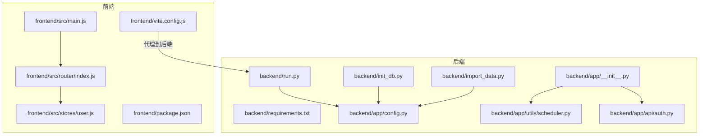
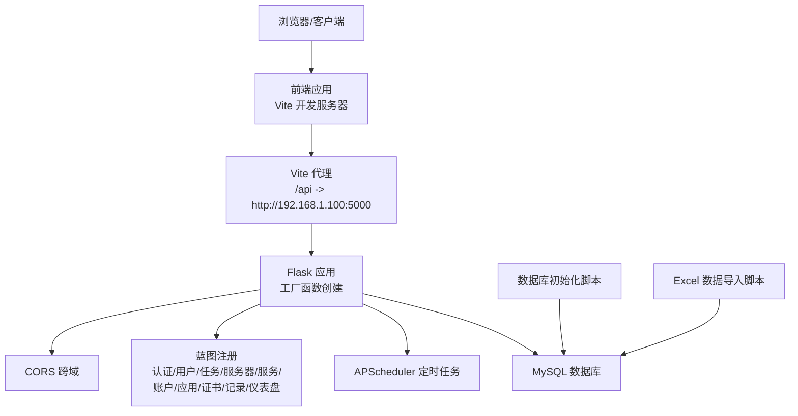
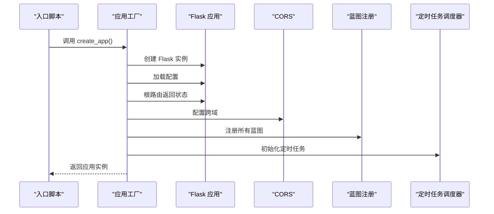
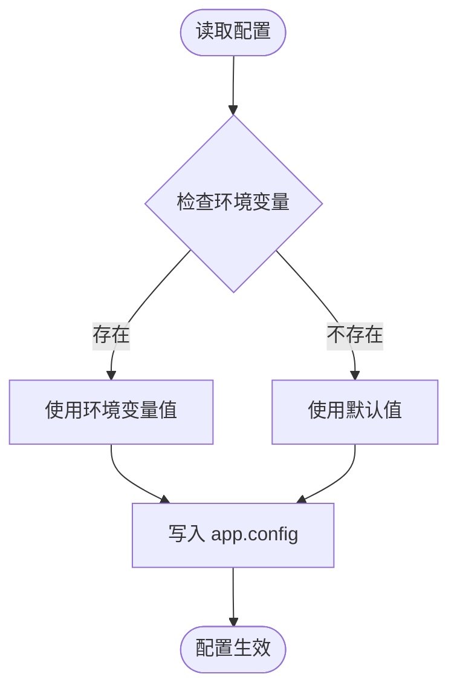
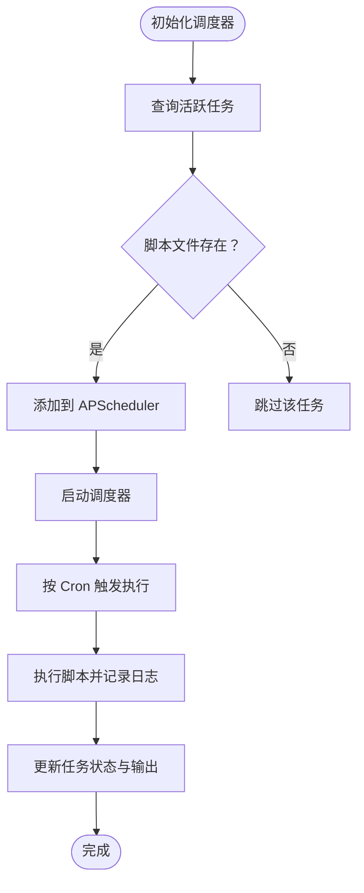
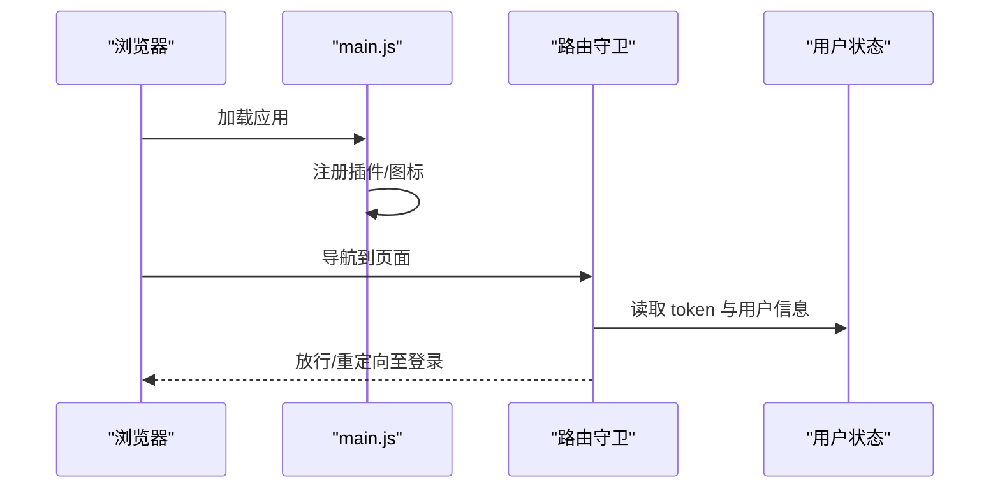
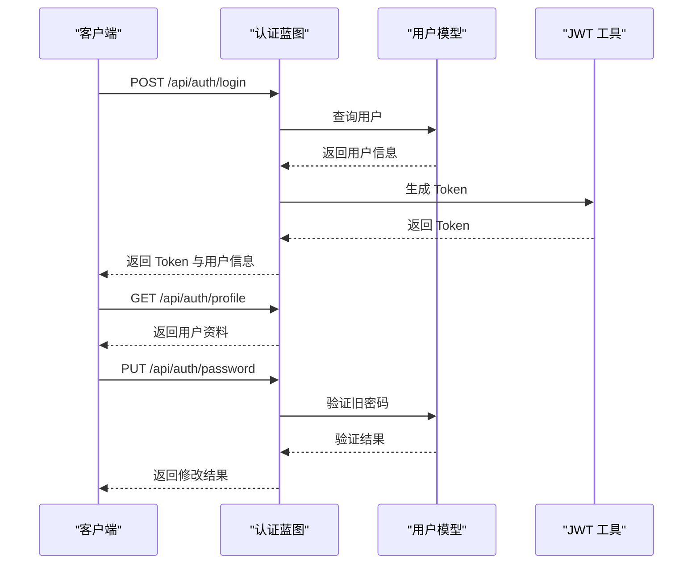
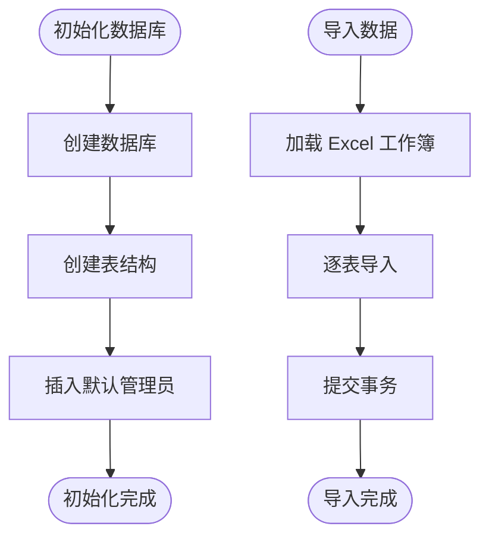
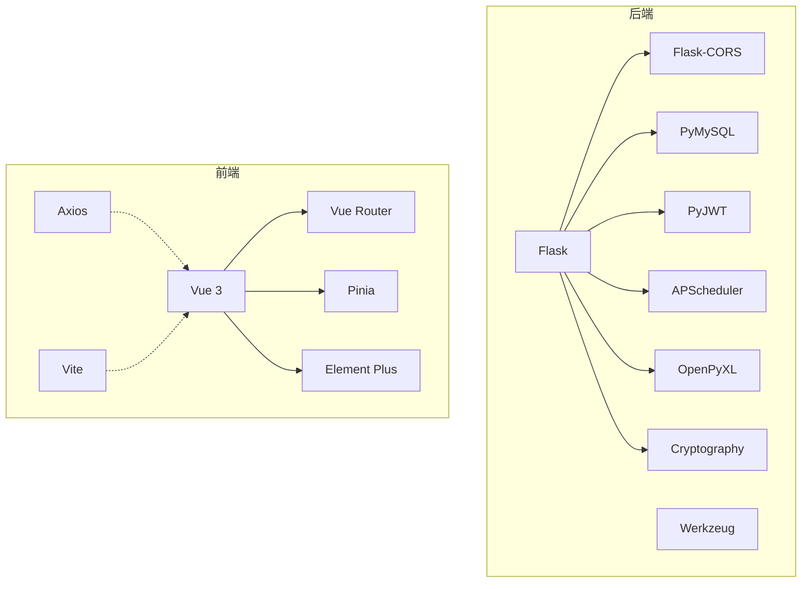

# 开发流程

<cite>
**本文引用的文件**
- [backend/app/__init__.py](file://backend/app/__init__.py)
- [backend/app/config.py](file://backend/app/config.py)
- [backend/run.py](file://backend/run.py)
- [backend/requirements.txt](file://backend/requirements.txt)
- [backend/init_db.py](file://backend/init_db.py)
- [backend/import_data.py](file://backend/import_data.py)
- [backend/app/utils/scheduler.py](file://backend/app/utils/scheduler.py)
- [backend/app/api/auth.py](file://backend/app/api/auth.py)
- [frontend/package.json](file://frontend/package.json)
- [frontend/vite.config.js](file://frontend/vite.config.js)
- [frontend/src/main.js](file://frontend/src/main.js)
- [frontend/src/router/index.js](file://frontend/src/router/index.js)
- [frontend/src/stores/user.js](file://frontend/src/stores/user.js)
</cite>

## 目录
1. [简介](#简介)
2. [项目结构](#项目结构)
3. [核心组件](#核心组件)
4. [架构总览](#架构总览)
5. [详细组件分析](#详细组件分析)
6. [依赖分析](#依赖分析)
7. [性能考虑](#性能考虑)
8. [故障排查指南](#故障排查指南)
9. [结论](#结论)
10. [附录](#附录)

## 简介
本指南面向参与“运维管理平台”项目的开发者，覆盖从环境搭建、依赖安装、项目启动，到功能开发、分支管理与代码合并、测试验证与部署发布的全流程。文档同时提供开发工具使用建议、IDE配置要点、调试技巧，以及单元测试、集成测试与端到端测试的实践方法。

## 项目结构
项目采用前后端分离架构：
- 后端基于 Flask，提供 REST API 服务，支持跨域、定时任务调度、数据库初始化与数据导入。
- 前端基于 Vue 3 + Vite，使用 Element Plus 组件库与 Pinia 状态管理，通过路由守卫控制权限与导航。
- 数据库初始化脚本负责创建表结构与默认管理员账户；数据导入脚本负责从 Excel 导入业务数据。

图表来源
- [frontend/src/main.js:1-23](file://frontend/src/main.js#L1-L23)
- [frontend/src/router/index.js:1-61](file://frontend/src/router/index.js#L1-L61)
- [frontend/src/stores/user.js:1-41](file://frontend/src/stores/user.js#L1-L41)
- [frontend/package.json:1-24](file://frontend/package.json#L1-L24)
- [frontend/vite.config.js:1-16](file://frontend/vite.config.js#L1-L16)
- [backend/app/__init__.py:1-62](file://backend/app/__init__.py#L1-L62)
- [backend/run.py:1-8](file://backend/run.py#L1-L8)
- [backend/requirements.txt:1-9](file://backend/requirements.txt#L1-L9)
- [backend/app/config.py:1-21](file://backend/app/config.py#L1-L21)
- [backend/app/utils/scheduler.py:1-249](file://backend/app/utils/scheduler.py#L1-L249)
- [backend/init_db.py:1-230](file://backend/init_db.py#L1-L230)
- [backend/import_data.py:1-371](file://backend/import_data.py#L1-L371)
- [backend/app/api/auth.py:1-184](file://backend/app/api/auth.py#L1-L184)

章节来源
- [backend/app/__init__.py:1-62](file://backend/app/__init__.py#L1-L62)
- [backend/app/config.py:1-21](file://backend/app/config.py#L1-L21)
- [backend/run.py:1-8](file://backend/run.py#L1-L8)
- [backend/requirements.txt:1-9](file://backend/requirements.txt#L1-L9)
- [frontend/package.json:1-24](file://frontend/package.json#L1-L24)
- [frontend/vite.config.js:1-16](file://frontend/vite.config.js#L1-L16)
- [frontend/src/main.js:1-23](file://frontend/src/main.js#L1-L23)
- [frontend/src/router/index.js:1-61](file://frontend/src/router/index.js#L1-L61)
- [frontend/src/stores/user.js:1-41](file://frontend/src/stores/user.js#L1-L41)
- [backend/init_db.py:1-230](file://backend/init_db.py#L1-L230)
- [backend/import_data.py:1-371](file://backend/import_data.py#L1-L371)
- [backend/app/utils/scheduler.py:1-249](file://backend/app/utils/scheduler.py#L1-L249)
- [backend/app/api/auth.py:1-184](file://backend/app/api/auth.py#L1-L184)

## 核心组件
- 后端应用工厂与蓝图注册：通过工厂函数创建 Flask 应用，统一注册认证、用户、导出、任务、服务器、服务、账户、应用、证书、变更记录、仪表盘等蓝图。
- 配置管理：集中定义密钥、JWT 过期时间、数据库连接参数、Flask 运行参数、上传目录与最大内容长度。
- 定时任务调度器：基于 APScheduler，支持从数据库加载活跃任务，按 Cron 表达式执行脚本，记录日志与状态。
- 前端应用入口与路由：应用初始化、插件注册、国际化、图标全局注册；路由守卫处理登录态、权限与页面标题。
- 状态管理：Pinia Store 管理 token、用户信息、登录状态与管理员角色判断。
- 数据库初始化与数据导入：自动创建数据库与表结构，插入默认管理员；从 Excel 导入多类业务数据。

章节来源
- [backend/app/__init__.py:6-62](file://backend/app/__init__.py#L6-L62)
- [backend/app/config.py:4-21](file://backend/app/config.py#L4-L21)
- [backend/app/utils/scheduler.py:14-249](file://backend/app/utils/scheduler.py#L14-L249)
- [frontend/src/main.js:1-23](file://frontend/src/main.js#L1-L23)
- [frontend/src/router/index.js:35-58](file://frontend/src/router/index.js#L35-L58)
- [frontend/src/stores/user.js:5-40](file://frontend/src/stores/user.js#L5-L40)
- [backend/init_db.py:22-226](file://backend/init_db.py#L22-L226)
- [backend/import_data.py:11-371](file://backend/import_data.py#L11-L371)

## 架构总览
后端以 Flask 为核心，通过蓝图模块化组织 API；前端通过 Vite 开发服务器与后端建立代理，实现本地联调；数据库初始化与数据导入脚本确保初始数据可用；定时任务调度器在后台异步执行脚本并记录日志。

图表来源
- [frontend/vite.config.js:6-14](file://frontend/vite.config.js#L6-L14)
- [backend/app/__init__.py:37-62](file://backend/app/__init__.py#L37-L62)
- [backend/app/utils/scheduler.py:201-249](file://backend/app/utils/scheduler.py#L201-L249)
- [backend/init_db.py:22-226](file://backend/init_db.py#L22-L226)
- [backend/import_data.py:11-371](file://backend/import_data.py#L11-L371)

## 详细组件分析

### 后端应用工厂与蓝图注册
- 工厂函数负责创建 Flask 实例、加载配置、根路由返回服务状态、注册 CORS、注册所有蓝图、初始化定时任务调度器。
- 蓝图注册涵盖认证、用户、导出、任务、服务器、服务、账户、应用、证书、变更记录、仪表盘等模块。

图表来源
- [backend/app/__init__.py:6-34](file://backend/app/__init__.py#L6-L34)
- [backend/app/__init__.py:37-62](file://backend/app/__init__.py#L37-L62)
- [backend/app/utils/scheduler.py:201-249](file://backend/app/utils/scheduler.py#L201-L249)

章节来源
- [backend/app/__init__.py:6-62](file://backend/app/__init__.py#L6-L62)

### 配置管理
- 配置类集中定义密钥、JWT 过期时间、数据库连接参数、Flask 运行参数、上传目录与最大内容长度。
- 支持通过环境变量覆盖默认值，便于不同环境部署。

图表来源
- [backend/app/config.py:4-21](file://backend/app/config.py#L4-L21)

章节来源
- [backend/app/config.py:4-21](file://backend/app/config.py#L4-L21)

### 定时任务调度器
- 从数据库查询活跃任务，解析 Cron 表达式，添加到调度器；执行时创建日志记录、更新任务状态与输出；支持超时与异常处理。
- 提供添加、移除、初始化调度器等接口。

图表来源
- [backend/app/utils/scheduler.py:201-249](file://backend/app/utils/scheduler.py#L201-L249)
- [backend/app/utils/scheduler.py:146-186](file://backend/app/utils/scheduler.py#L146-L186)
- [backend/app/utils/scheduler.py:32-144](file://backend/app/utils/scheduler.py#L32-L144)

章节来源
- [backend/app/utils/scheduler.py:14-249](file://backend/app/utils/scheduler.py#L14-L249)

### 前端应用入口与路由
- 应用入口注册 Pinia、路由、Element Plus 国际化与图标，挂载应用。
- 路由守卫根据 token 控制访问，支持管理员权限校验与页面标题设置。

图表来源
- [frontend/src/main.js:10-22](file://frontend/src/main.js#L10-L22)
- [frontend/src/router/index.js:35-58](file://frontend/src/router/index.js#L35-L58)
- [frontend/src/stores/user.js:13-37](file://frontend/src/stores/user.js#L13-L37)

章节来源
- [frontend/src/main.js:1-23](file://frontend/src/main.js#L1-L23)
- [frontend/src/router/index.js:1-61](file://frontend/src/router/index.js#L1-L61)
- [frontend/src/stores/user.js:1-41](file://frontend/src/stores/user.js#L1-L41)

### 认证 API
- 提供登录、获取用户资料、修改密码接口；登录成功返回 JWT Token 与用户信息；修改密码前验证旧密码与长度。

图表来源
- [backend/app/api/auth.py:14-82](file://backend/app/api/auth.py#L14-L82)
- [backend/app/api/auth.py:85-115](file://backend/app/api/auth.py#L85-L115)
- [backend/app/api/auth.py:118-183](file://backend/app/api/auth.py#L118-L183)

章节来源
- [backend/app/api/auth.py:1-184](file://backend/app/api/auth.py#L1-L184)

### 数据库初始化与数据导入
- 初始化脚本创建数据库与多张业务表，插入默认管理员；导入脚本从 Excel 读取多张工作表，清洗数据后批量写入对应表。

图表来源
- [backend/init_db.py:22-226](file://backend/init_db.py#L22-L226)
- [backend/import_data.py:11-371](file://backend/import_data.py#L11-L371)

章节来源
- [backend/init_db.py:1-230](file://backend/init_db.py#L1-L230)
- [backend/import_data.py:1-371](file://backend/import_data.py#L1-L371)

## 依赖分析
- 后端依赖：Flask、CORS、PyMySQL、PyJWT、Werkzeug、APScheduler、OpenPyXL、Cryptography。
- 前端依赖：Vue 3、Vue Router、Pinia、Element Plus、Axios、Vite 插件。

图表来源
- [backend/requirements.txt:1-9](file://backend/requirements.txt#L1-L9)
- [frontend/package.json:11-22](file://frontend/package.json#L11-L22)

章节来源
- [backend/requirements.txt:1-9](file://backend/requirements.txt#L1-L9)
- [frontend/package.json:1-24](file://frontend/package.json#L1-L24)

## 性能考虑
- 后端
  - 使用 APScheduler 异步执行脚本，避免阻塞主请求线程；对脚本执行设置超时，防止长时间占用。
  - 数据库连接在调度器回调中独立创建与关闭，减少连接泄漏风险。
  - CORS 支持凭据传输，注意生产环境限制 origins。
- 前端
  - 使用 Vite 快速热更新与代理，提升开发体验；生产构建开启压缩与缓存策略。
  - Pinia 状态持久化仅保存必要字段，避免不必要的存储开销。

[本节为通用指导，无需列出具体文件来源]

## 故障排查指南
- 后端启动失败
  - 检查配置项是否正确，特别是数据库连接参数与 Flask 运行参数。
  - 确认依赖安装完整，版本满足 requirements。
- 前端无法访问后端接口
  - 检查 Vite 代理配置是否指向正确的后端地址与端口。
  - 确认 CORS 配置允许前端源与凭据传输。
- 定时任务未执行
  - 检查数据库中任务是否为活跃状态且脚本路径存在。
  - 查看调度器初始化日志与任务日志表中的状态。
- 数据导入失败
  - 确认 Excel 文件存在且表头与数据格式符合预期。
  - 检查数据库连接参数与字符集设置。

章节来源
- [backend/app/config.py:4-21](file://backend/app/config.py#L4-L21)
- [backend/requirements.txt:1-9](file://backend/requirements.txt#L1-L9)
- [frontend/vite.config.js:6-14](file://frontend/vite.config.js#L6-L14)
- [backend/app/utils/scheduler.py:201-249](file://backend/app/utils/scheduler.py#L201-L249)
- [backend/import_data.py:11-371](file://backend/import_data.py#L11-L371)

## 结论
本指南提供了从环境搭建到功能开发、测试与发布的完整流程说明。通过明确的组件职责、清晰的依赖关系与可操作的故障排查建议，开发者可以高效地开展迭代开发与维护工作。

[本节为总结性内容，无需列出具体文件来源]

## 附录

### 环境搭建与项目启动
- 后端
  - 安装依赖：使用 requirements.txt 中的包列表安装后端依赖。
  - 设置环境变量：如需自定义密钥、数据库连接与运行参数，请设置相应环境变量。
  - 初始化数据库：运行数据库初始化脚本创建表结构并插入默认管理员。
  - 导入数据：准备 Excel 文件，运行数据导入脚本完成业务数据入库。
  - 启动应用：通过入口脚本启动 Flask 应用，监听配置中的主机与端口。
- 前端
  - 安装依赖：使用 package.json 中的依赖列表安装前端依赖。
  - 启动开发服务器：使用 Vite 开发服务器，代理 /api 到后端地址。
  - 构建与预览：生产构建与预览命令按 package.json 中脚本执行。

章节来源
- [backend/requirements.txt:1-9](file://backend/requirements.txt#L1-L9)
- [backend/app/config.py:4-21](file://backend/app/config.py#L4-L21)
- [backend/init_db.py:22-226](file://backend/init_db.py#L22-L226)
- [backend/import_data.py:11-371](file://backend/import_data.py#L11-L371)
- [backend/run.py:1-8](file://backend/run.py#L1-L8)
- [frontend/package.json:6-9](file://frontend/package.json#L6-L9)
- [frontend/vite.config.js:6-14](file://frontend/vite.config.js#L6-L14)

### 功能开发流程
- 需求分析：明确功能范围、接口与数据模型，输出设计文档。
- 设计评审：评审接口规范、数据库设计与前端交互方案。
- 开发实现：后端新增蓝图与模型，前端新增页面与组件，前后端联调。
- 测试验证：编写单元测试、集成测试与端到端测试，覆盖关键路径。
- 部署发布：打包构建、更新数据库结构与数据、部署到目标环境。

[本节为流程性说明，无需列出具体文件来源]

### 分支管理策略与代码合并
- 分支命名：feature/功能名、bugfix/问题描述、hotfix/紧急修复、release/版本号。
- 提交流程：提交前先拉取主干最新代码，解决冲突；提交信息清晰描述变更内容。
- 代码评审：发起 MR/PR，至少一名同事评审；修复评审意见后再次审核。
- 合并策略：优先使用 squash 合并保持历史整洁；合并前确保 CI 通过。

[本节为通用流程建议，无需列出具体文件来源]

### 单元测试、集成测试与端到端测试
- 单元测试：针对后端函数与方法编写测试用例，覆盖正常与异常分支。
- 集成测试：测试蓝图路由与数据库交互，验证接口行为与数据一致性。
- 端到端测试：使用前端自动化测试框架模拟用户操作，验证页面渲染与交互逻辑。

[本节为通用测试建议，无需列出具体文件来源]

### 开发工具与 IDE 配置建议
- 后端
  - Python 版本：使用与 requirements 兼容的版本。
  - Linter：使用 flake8 或 ruff，统一代码风格。
  - Formatter：使用 black 或 autopep8。
  - 调试：使用 VS Code 或 PyCharm，设置断点与环境变量。
- 前端
  - Node.js 版本：使用与 package.json 兼容的版本。
  - Linter：ESLint + Prettier。
  - 调试：VS Code 配置 Vue DevTools 与 Vite 插件，启用断点调试。
- 数据库
  - 使用 MySQL 客户端工具查看表结构与数据，便于联调与排错。

[本节为通用工具建议，无需列出具体文件来源]