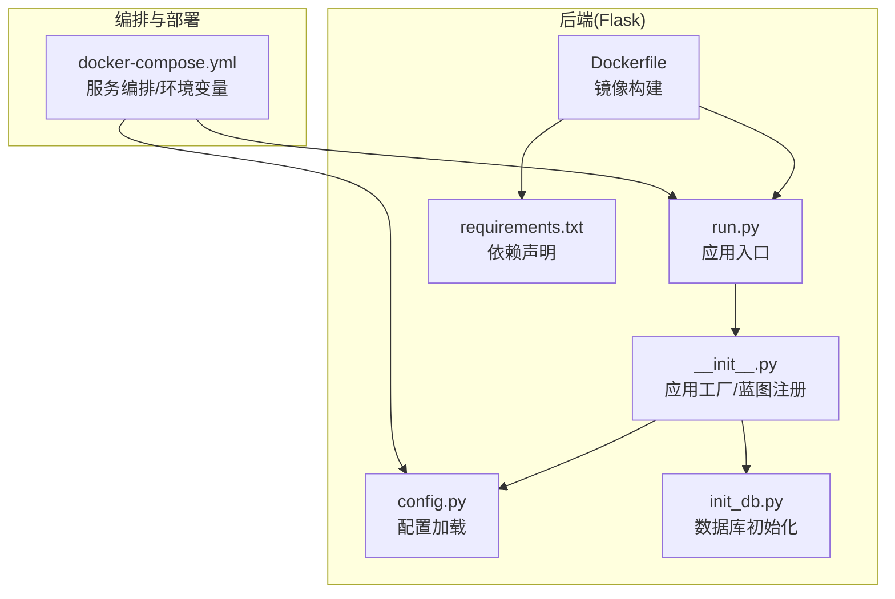
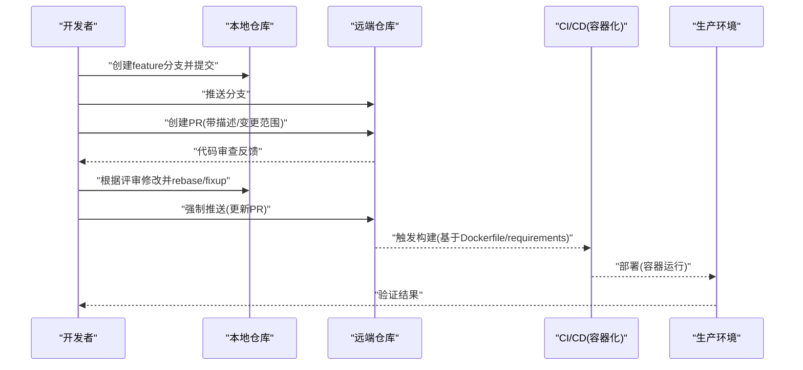
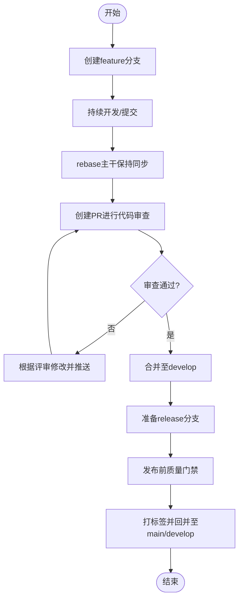
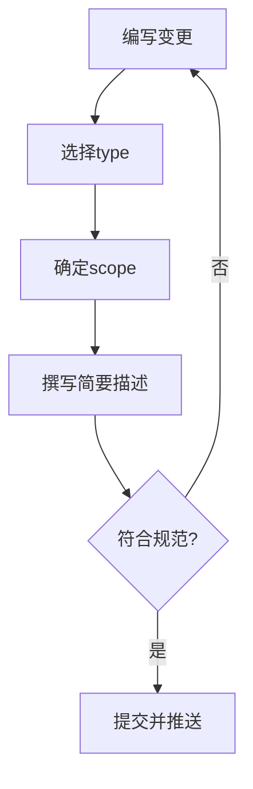
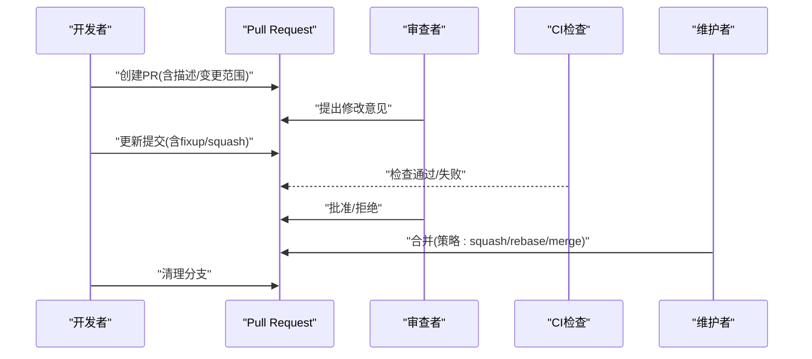
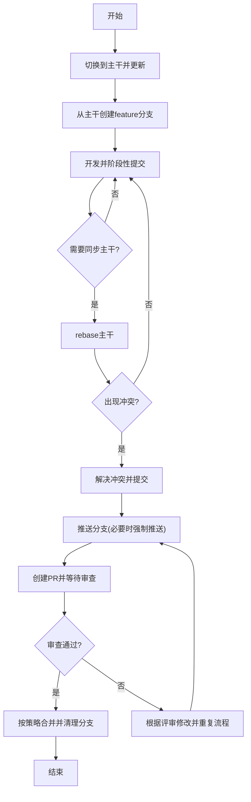
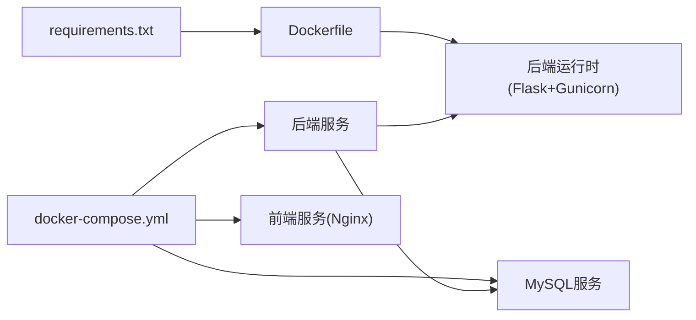

# Git工作流程

<cite>
**本文引用的文件**
- [README.md](file://README.md)
- [docker-compose.yml](file://docker-compose.yml)
- [backend/Dockerfile](file://backend/Dockerfile)
- [backend/app/config.py](file://backend/app/config.py)
- [backend/app/__init__.py](file://backend/app/__init__.py)
- [backend/init_db.py](file://backend/init_db.py)
- [backend/run.py](file://backend/run.py)
- [backend/requirements.txt](file://backend/requirements.txt)
</cite>

## 目录
1. [引言](#引言)
2. [项目结构](#项目结构)
3. [核心组件](#核心组件)
4. [架构总览](#架构总览)
5. [详细组件分析](#详细组件分析)
6. [依赖分析](#依赖分析)
7. [性能考虑](#性能考虑)
8. [故障排查指南](#故障排查指南)
9. [结论](#结论)
10. [附录](#附录)

## 引言
本文件面向OPS项目的日常开发与协作，系统化梳理Git工作流程，包括分支策略、提交规范、合并流程、日常操作与最佳实践。文档以项目现有README中的贡献与开发指南为基础，结合后端应用配置与部署文件，给出可落地的Git实践建议。

## 项目结构
- 项目采用前后端分离架构，后端基于Flask，前端基于Vue 3 + Vite，通过Nginx反向代理与Docker Compose统一编排。
- 后端应用入口与配置位于backend目录，包含Dockerfile、requirements.txt、run.py、config.py、__init__.py、init_db.py等关键文件。
- docker-compose.yml定义了MySQL、后端、前端三服务的编排与环境变量，是开发与部署的关键参考。

**图表来源**
- [backend/run.py:1-8](file://backend/run.py#L1-L8)
- [backend/app/__init__.py:28-113](file://backend/app/__init__.py#L28-L113)
- [backend/app/config.py:10-58](file://backend/app/config.py#L10-L58)
- [backend/init_db.py:1-431](file://backend/init_db.py#L1-L431)
- [backend/Dockerfile:1-36](file://backend/Dockerfile#L1-L36)
- [backend/requirements.txt:1-17](file://backend/requirements.txt#L1-L17)
- [docker-compose.yml:1-108](file://docker-compose.yml#L1-L108)

**章节来源**
- [README.md:261-331](file://README.md#L261-L331)
- [docker-compose.yml:1-108](file://docker-compose.yml#L1-L108)

## 核心组件
- 分支策略：以功能开发为主，采用feature分支驱动，develop作为集成基线，release用于发布前收敛。
- 提交规范：采用语义化提交，明确type、scope与简要描述，保证变更可追溯与自动化工具可用。
- 合并流程：通过Pull Request进行代码审查，解决冲突后由维护者合并，保持主干稳定。
- 日常操作：分支切换、同步上游、冲突处理、历史回滚等，均围绕上述策略展开。

以上策略在贡献指南中已有体现，本文在此基础上补充具体落地细节与可视化流程。

**章节来源**
- [README.md:750-769](file://README.md#L750-L769)

## 架构总览
下图展示从开发者本地到容器化运行的整体流程，强调分支与提交如何影响最终部署产物。

**图表来源**
- [README.md:758-763](file://README.md#L758-L763)
- [backend/Dockerfile:34-36](file://backend/Dockerfile#L34-L36)
- [backend/requirements.txt:1-17](file://backend/requirements.txt#L1-L17)
- [docker-compose.yml:30-82](file://docker-compose.yml#L30-L82)

## 详细组件分析

### 分支策略与命名约定
- feature分支
  - 用途：承载新功能开发，隔离变更，便于评审与回滚。
  - 命名：feature/功能主题，如feature/user-authentication。
  - 同步：定期rebase主干，减少合并复杂度。
- develop分支
  - 用途：集成feature分支变更，作为release的稳定基线。
  - 同步：频繁与feature合并，必要时进行内部rebase。
- release分支
  - 用途：发布前的最终验证与小修复，确保版本质量。
  - 命名：release/vX.Y.Z，合并后同时打标签并回并至develop/main。

**章节来源**
- [README.md:758-763](file://README.md#L758-L763)

### 提交规范与类型分类
- 类型(type)
  - feat：新增功能
  - fix：修复缺陷
  - docs：仅文档变更
  - style：不影响逻辑的格式调整
  - refactor：重构但不改变行为
  - test：新增/修改测试
  - chore：构建过程或辅助工具变动
- 范围(scope)
  - 明确变更影响的模块或文件，如backend/utils/db、frontend/views/Servers等。
- 规范格式
  - type(scope): 简要描述
  - 例如：feat(api): 新增用户登录接口
- 例外与说明
  - 语义化提交已在贡献指南中明确，配合PR描述可提升可读性与自动化潜力。

**章节来源**
- [README.md:765-768](file://README.md#L765-L768)

### 合并流程与代码审查
- 创建PR
  - 选择合适的base分支(如develop)，填写标题与描述，关联Issue。
- 代码审查
  - 关注点：功能正确性、边界条件、安全性、性能、可维护性、测试覆盖。
  - 评审工具：利用平台评论、线程讨论，必要时要求二次审查。
- 冲突解决
  - rebase主干或合并主干，解决冲突后更新PR。
- 合并策略
  - 优先squash合并以保持主干整洁；重大变更可选择rebase或merge。
  - 合并后清理分支，避免遗留垃圾分支。

**章节来源**
- [README.md:758-763](file://README.md#L758-L763)

### 日常开发中的Git操作指南
- 分支切换与同步
  - 切换到主干并更新：git switch main && git pull
  - 从主干创建并切换到新分支：git checkout -b feature/xxx
  - 同步主干到feature：git rebase main
- 代码同步与推送
  - 推送feature分支：git push origin feature/xxx
  - 强制推送(仅在rebase后必要时)：git push origin -f feature/xxx
- 冲突处理
  - 定位冲突文件，逐个解决，添加并提交
  - 使用rebase保持线性历史，或在release阶段使用merge
- 历史回滚
  - 本地回滚：git reset --soft/--mixed/--hard
  - 远端回滚：谨慎使用git revert，避免破坏他人工作
- 提交与推送
  - 小步提交，清晰描述；必要时使用git commit --amend修正最近一次提交

**章节来源**
- [README.md:758-763](file://README.md#L758-L763)

### 提交规范与范围定义示例
- 后端API变更
  - type: feat/fix/refactor
  - scope: backend/api/auth、backend/utils/db、backend/utils/scheduler
  - 示例：feat(api): 新增JWT刷新接口
- 前端页面/组件变更
  - scope: frontend/views、frontend/components、frontend/router
  - 示例：fix(view): 修复服务器列表加载状态
- 配置与部署
  - scope: docker-compose.yml、backend/Dockerfile、backend/requirements.txt
  - 示例：chore(deploy): 更新Gunicorn线程数

**章节来源**
- [README.md:765-768](file://README.md#L765-L768)
- [backend/Dockerfile:34-36](file://backend/Dockerfile#L34-L36)
- [backend/requirements.txt:1-17](file://backend/requirements.txt#L1-L17)
- [docker-compose.yml:30-82](file://docker-compose.yml#L30-L82)

## 依赖分析
- 后端运行时依赖
  - Flask、Gunicorn、PyMySQL、PyJWT、APScheduler、Cryptography、bcrypt、Paramiko、OpenPyXL、阿里云SDK等。
- 镜像构建与运行
  - Dockerfile指定Python 3.11 slim基础镜像，安装系统依赖与Python包，暴露5000端口，使用Gunicorn运行应用。
- 编排与环境变量
  - docker-compose.yml定义MySQL、后端、前端服务，注入SECRET_KEY、JWT_SECRET_KEY、DB_*、CORS_*、WEBHOOK、GRAFANA等环境变量。

**图表来源**
- [backend/requirements.txt:1-17](file://backend/requirements.txt#L1-L17)
- [backend/Dockerfile:1-36](file://backend/Dockerfile#L1-L36)
- [docker-compose.yml:10-108](file://docker-compose.yml#L10-L108)

**章节来源**
- [backend/requirements.txt:1-17](file://backend/requirements.txt#L1-L17)
- [backend/Dockerfile:1-36](file://backend/Dockerfile#L1-L36)
- [docker-compose.yml:1-108](file://docker-compose.yml#L1-L108)

## 性能考虑
- 分支粒度与提交频率
  - 小步提交、短生命周期feature分支，降低rebase与合并成本。
- 代码审查效率
  - 明确scope与类型，缩短审查周期，减少往返修改。
- 镜像与依赖
  - Dockerfile中一次性安装依赖，避免重复层；requirements.txt集中管理，减少版本漂移。
- 定时任务与并发
  - Gunicorn配置为单worker多线程，避免APScheduler在多进程重复注册导致的任务重复执行。

**章节来源**
- [backend/Dockerfile:34-36](file://backend/Dockerfile#L34-L36)
- [backend/app/config.py:47-48](file://backend/app/config.py#L47-L48)

## 故障排查指南
- 数据库连接失败
  - 检查MySQL服务健康状态与日志；确认DB_HOST、DB_PORT、DB_USER、DB_PASSWORD、DB_NAME配置一致。
- 前端页面空白
  - 确认已构建前端产物；必要时重建并重启前端容器。
- CORS跨域错误
  - 校验CORS_ORIGINS与CORS_ALLOW_ALL配置，生产环境建议显式白名单。
- SSL检测失败
  - 调整SSL_CHECK_TIMEOUT；检查网络连通性与目标域名可达性。
- 定时任务不执行
  - 查看后端日志中scheduler相关内容；核对Cron表达式与系统时间。
- 企业微信通知收不到
  - 校验WECHAT_WEBHOOK_URL；使用curl测试Webhook连通性。

**章节来源**
- [README.md:661-748](file://README.md#L661-L748)
- [docker-compose.yml:337-382](file://docker-compose.yml#L337-L382)
- [backend/app/config.py:40-53](file://backend/app/config.py#L40-L53)

## 结论
通过明确的分支策略、规范的提交格式、严谨的合并流程与日常操作指引，OPS项目可在保证质量的同时提升协作效率。建议团队在实践中持续优化审查标准与自动化检查，确保主干稳定与交付节奏可控。

## 附录
- 常用命令速查
  - 切换分支：git checkout <branch>
  - 创建并切换：git checkout -b <branch>
  - 同步主干：git rebase main
  - 推送分支：git push origin <branch>
  - 强制推送：git push origin -f <branch>
  - 回滚提交：git revert <commit>
  - 本地回滚：git reset --soft/--mixed/--hard <commit>
- 最佳实践清单
  - 每次提交聚焦单一变更，避免“大杂烩”
  - PR描述清晰，包含动机、方案与风险评估
  - 审查者关注安全性、可维护性与测试覆盖
  - 避免在共享分支上进行重型rebase，必要时创建临时分支