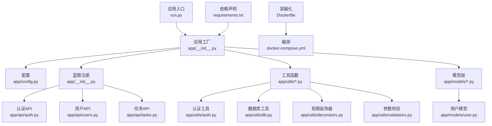
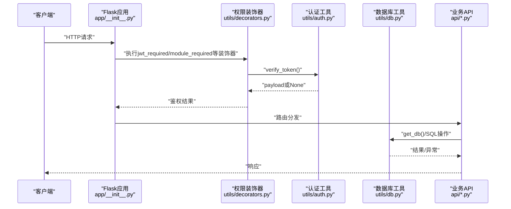
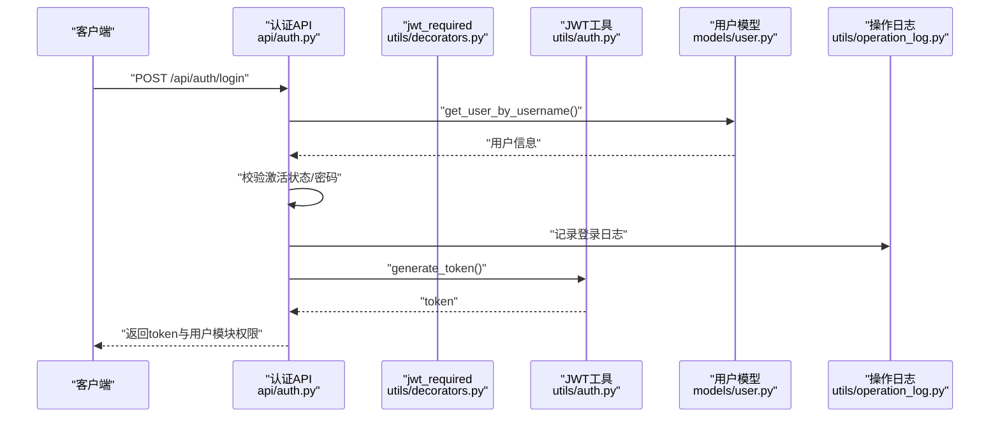
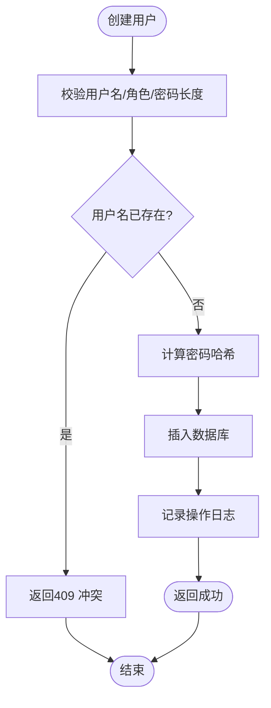
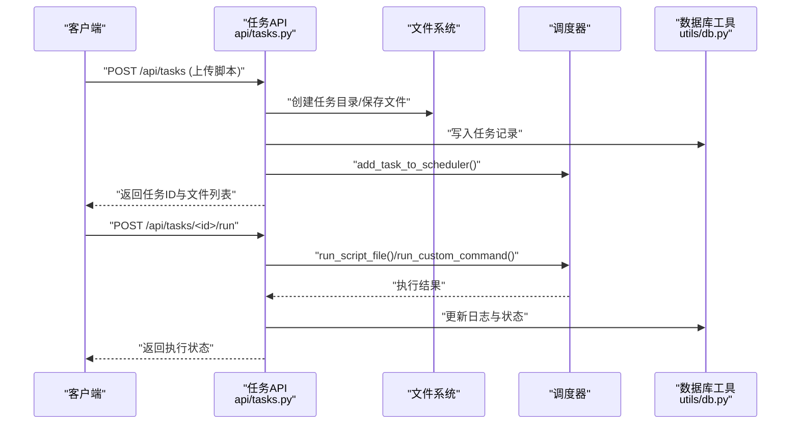
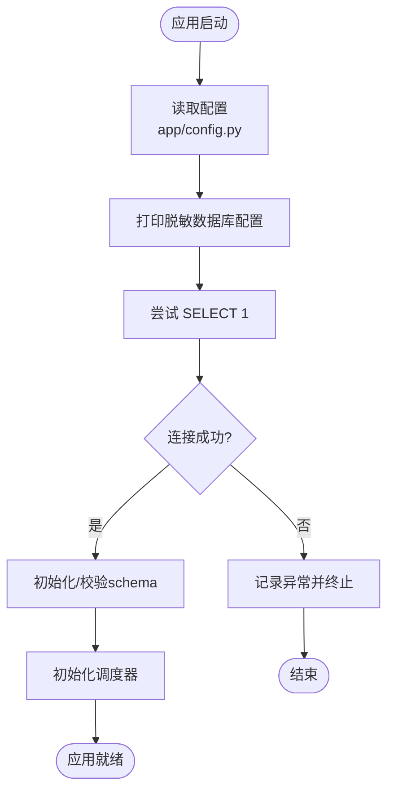
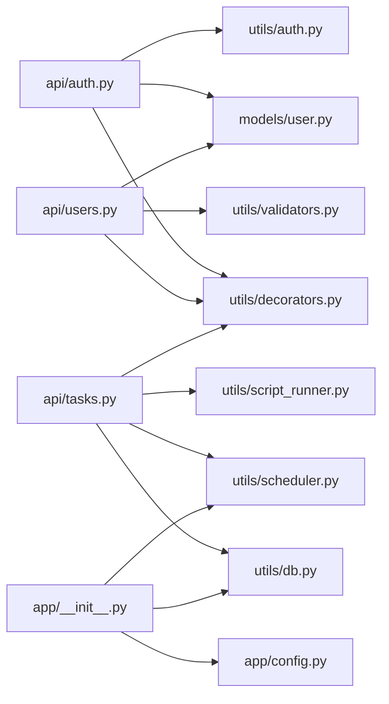

# 代码审查

<cite>
**本文引用的文件**
- [backend/app/__init__.py](file://backend/app/__init__.py)
- [backend/app/config.py](file://backend/app/config.py)
- [backend/run.py](file://backend/run.py)
- [backend/Dockerfile](file://backend/Dockerfile)
- [docker-compose.yml](file://docker-compose.yml)
- [backend/requirements.txt](file://backend/requirements.txt)
- [backend/app/api/auth.py](file://backend/app/api/auth.py)
- [backend/app/utils/auth.py](file://backend/app/utils/auth.py)
- [backend/app/utils/db.py](file://backend/app/utils/db.py)
- [backend/app/utils/decorators.py](file://backend/app/utils/decorators.py)
- [backend/app/utils/validators.py](file://backend/app/utils/validators.py)
- [backend/app/api/users.py](file://backend/app/api/users.py)
- [backend/app/models/user.py](file://backend/app/models/user.py)
- [backend/app/api/tasks.py](file://backend/app/api/tasks.py)
</cite>

## 目录
1. [简介](#简介)
2. [项目结构](#项目结构)
3. [核心组件](#核心组件)
4. [架构总览](#架构总览)
5. [详细组件分析](#详细组件分析)
6. [依赖分析](#依赖分析)
7. [性能考虑](#性能考虑)
8. [故障排查指南](#故障排查指南)
9. [结论](#结论)
10. [附录](#附录)

## 简介
本文件面向OPS项目的后端代码，提供一套完整的代码审查标准与流程规范，覆盖代码风格、安全性、性能、可维护性等方面，并结合现有代码实现给出可操作的检查清单、工具建议与最佳实践。审查对象主要聚焦Flask应用的蓝图API、认证授权、数据库访问、工具函数与配置。

## 项目结构
后端采用Flask应用结构，按功能模块划分蓝图，工具函数集中于utils，配置集中在config，入口在run.py，容器化部署由Dockerfile与docker-compose共同完成。

图示来源
- [backend/run.py:1-8](file://backend/run.py#L1-L8)
- [backend/app/__init__.py:28-151](file://backend/app/__init__.py#L28-L151)
- [backend/app/config.py:10-58](file://backend/app/config.py#L10-L58)
- [backend/app/api/auth.py:13-210](file://backend/app/api/auth.py#L13-L210)
- [backend/app/api/users.py:16-290](file://backend/app/api/users.py#L16-L290)
- [backend/app/api/tasks.py:18-674](file://backend/app/api/tasks.py#L18-L674)
- [backend/app/utils/auth.py:9-45](file://backend/app/utils/auth.py#L9-L45)
- [backend/app/utils/db.py:43-80](file://backend/app/utils/db.py#L43-L80)
- [backend/app/utils/decorators.py:26-214](file://backend/app/utils/decorators.py#L26-L214)
- [backend/app/utils/validators.py:1-151](file://backend/app/utils/validators.py#L1-L151)
- [backend/app/models/user.py:8-162](file://backend/app/models/user.py#L8-L162)
- [backend/Dockerfile:1-36](file://backend/Dockerfile#L1-L36)
- [docker-compose.yml:1-108](file://docker-compose.yml#L1-L108)
- [backend/requirements.txt:1-17](file://backend/requirements.txt#L1-L17)

章节来源
- [backend/app/__init__.py:28-151](file://backend/app/__init__.py#L28-L151)
- [backend/app/config.py:10-58](file://backend/app/config.py#L10-L58)
- [backend/run.py:1-8](file://backend/run.py#L1-L8)
- [backend/Dockerfile:1-36](file://backend/Dockerfile#L1-L36)
- [docker-compose.yml:1-108](file://docker-compose.yml#L1-L108)
- [backend/requirements.txt:1-17](file://backend/requirements.txt#L1-L17)

## 核心组件
- 应用工厂与蓝图注册：负责应用初始化、CORS、日志、数据库预检、定时任务调度器初始化以及蓝图注册。
- 配置模块：集中管理环境变量与默认值，提供CORS来源解析等辅助方法。
- 认证与授权：JWT生成与校验、基于装饰器的认证与权限控制、模块级权限。
- 数据访问：统一的数据库连接获取、关闭与异常日志记录。
- 参数校验：针对IP、主机名、URL、端口、域名、密码、用户名、邮箱、整数、正整数、字符串长度等的校验。
- API层：认证、用户管理、定时任务等业务接口，均使用装饰器进行鉴权与权限控制。
- 模型层：用户相关数据库操作封装。

章节来源
- [backend/app/__init__.py:28-151](file://backend/app/__init__.py#L28-L151)
- [backend/app/config.py:10-58](file://backend/app/config.py#L10-L58)
- [backend/app/utils/auth.py:9-45](file://backend/app/utils/auth.py#L9-L45)
- [backend/app/utils/decorators.py:26-214](file://backend/app/utils/decorators.py#L26-L214)
- [backend/app/utils/db.py:43-80](file://backend/app/utils/db.py#L43-L80)
- [backend/app/utils/validators.py:1-151](file://backend/app/utils/validators.py#L1-L151)
- [backend/app/api/auth.py:13-210](file://backend/app/api/auth.py#L13-L210)
- [backend/app/api/users.py:16-290](file://backend/app/api/users.py#L16-L290)
- [backend/app/api/tasks.py:18-674](file://backend/app/api/tasks.py#L18-L674)
- [backend/app/models/user.py:8-162](file://backend/app/models/user.py#L8-L162)

## 架构总览
下图展示应用启动、请求进入、认证授权、数据库访问与API处理的整体流程。

图示来源
- [backend/app/__init__.py:28-151](file://backend/app/__init__.py#L28-L151)
- [backend/app/utils/decorators.py:26-214](file://backend/app/utils/decorators.py#L26-L214)
- [backend/app/utils/auth.py:31-45](file://backend/app/utils/auth.py#L31-L45)
- [backend/app/utils/db.py:43-80](file://backend/app/utils/db.py#L43-L80)
- [backend/app/api/auth.py:16-210](file://backend/app/api/auth.py#L16-L210)
- [backend/app/api/users.py:19-290](file://backend/app/api/users.py#L19-L290)
- [backend/app/api/tasks.py:105-674](file://backend/app/api/tasks.py#L105-L674)

## 详细组件分析

### 组件A：认证与授权
- 关键点
  - JWT生成与校验：生成时包含用户标识、角色、签发/过期时间；校验失败返回None。
  - 装饰器链：jwt_required先于role_required/module_required，确保顺序正确。
  - 登录流程：用户名存在性、账户激活状态、密码校验、操作日志记录、模块权限下发。
  - 密码修改：旧密码校验、新密码长度校验、哈希更新与日志记录。
- 安全性审查要点
  - JWT密钥必须通过环境变量注入，生产环境必须强制配置。
  - 登录失败与密码错误需记录操作日志，便于审计。
  - 密码变更后，令牌因签发时间早于密码修改而失效，防止旧令牌滥用。
- 性能与可维护性
  - 装饰器内部延迟导入避免循环依赖。
  - 对payload中iat的时区转换便于与数据库DATETIME比较。

图示来源
- [backend/app/api/auth.py:16-103](file://backend/app/api/auth.py#L16-L103)
- [backend/app/utils/decorators.py:26-123](file://backend/app/utils/decorators.py#L26-L123)
- [backend/app/utils/auth.py:9-28](file://backend/app/utils/auth.py#L9-L28)
- [backend/app/models/user.py:36-52](file://backend/app/models/user.py#L36-L52)

章节来源
- [backend/app/api/auth.py:16-210](file://backend/app/api/auth.py#L16-L210)
- [backend/app/utils/auth.py:9-45](file://backend/app/utils/auth.py#L9-L45)
- [backend/app/utils/decorators.py:26-214](file://backend/app/utils/decorators.py#L26-L214)
- [backend/app/models/user.py:8-162](file://backend/app/models/user.py#L8-L162)

### 组件B：用户管理
- 关键点
  - 管理员专用接口，提供用户列表、创建、更新、删除、重置密码。
  - 创建用户前进行用户名格式、角色、密码长度校验，检查重复。
  - 更新用户时构建安全的字段集合，避免未授权字段更新。
  - 删除用户禁止删除自身，防止自我权限剥夺。
- 安全性审查要点
  - 所有接口均要求管理员角色，避免越权。
  - 密码重置走哈希更新流程，避免明文泄露。
- 可维护性
  - 接口返回统一结构，便于前端消费。
  - 操作日志记录关键动作，便于审计。

图示来源
- [backend/app/api/users.py:35-110](file://backend/app/api/users.py#L35-L110)
- [backend/app/utils/validators.py:98-109](file://backend/app/utils/validators.py#L98-L109)
- [backend/app/models/user.py:8-34](file://backend/app/models/user.py#L8-L34)

章节来源
- [backend/app/api/users.py:19-290](file://backend/app/api/users.py#L19-L290)
- [backend/app/utils/validators.py:1-151](file://backend/app/utils/validators.py#L1-L151)
- [backend/app/models/user.py:8-162](file://backend/app/models/user.py#L8-L162)

### 组件C：定时任务
- 关键点
  - 任务创建：支持多文件上传、文件类型校验、任务目录隔离、兼容旧字段。
  - 任务更新：支持增删文件、兼容旧字段、必要时重新加入调度器。
  - 任务启停：根据状态动态添加/移除调度器任务。
  - 手动执行：线程异步执行，记录日志与最终状态。
  - 日志查询：按任务ID查询最近执行日志。
- 安全性审查要点
  - 仅允许.py与.sh文件上传，避免可执行风险。
  - 任务目录隔离，避免文件冲突与越权读取。
  - 手动执行设置超时，防止长时间阻塞。
- 可维护性
  - 迁移逻辑在蓝图注册时执行，保证表结构演进。
  - 统一的日志记录与状态更新，便于追踪。

图示来源
- [backend/app/api/tasks.py:145-256](file://backend/app/api/tasks.py#L145-L256)
- [backend/app/api/tasks.py:503-636](file://backend/app/api/tasks.py#L503-L636)
- [backend/app/utils/db.py:43-80](file://backend/app/utils/db.py#L43-L80)

章节来源
- [backend/app/api/tasks.py:18-674](file://backend/app/api/tasks.py#L18-L674)
- [backend/app/utils/db.py:43-80](file://backend/app/utils/db.py#L43-L80)

### 组件D：数据库与配置
- 关键点
  - 应用启动时进行数据库连接预检，失败打印完整异常栈，便于定位DB_HOST/DB_PORT/DB_USER/DB_NAME与网络问题。
  - 数据库连接参数来自配置，连接超时与字符集设置合理。
  - 配置集中管理，CORS来源解析支持逗号分隔与通配符域名场景。
- 安全性审查要点
  - 生产环境必须设置SECRET_KEY与JWT_SECRET_KEY，避免默认值泄漏。
  - 日志中脱敏密码，防止敏感信息泄露。
- 可维护性
  - 通过环境变量驱动配置，便于不同环境切换。
  - CORS策略可灵活配置，支持任意源或白名单。

图示来源
- [backend/app/__init__.py:88-113](file://backend/app/__init__.py#L88-L113)
- [backend/app/utils/db.py:28-40](file://backend/app/utils/db.py#L28-L40)
- [backend/app/utils/db.py:49-69](file://backend/app/utils/db.py#L49-L69)
- [backend/app/config.py:16-20](file://backend/app/config.py#L16-L20)

章节来源
- [backend/app/__init__.py:88-113](file://backend/app/__init__.py#L88-L113)
- [backend/app/utils/db.py:18-80](file://backend/app/utils/db.py#L18-L80)
- [backend/app/config.py:10-58](file://backend/app/config.py#L10-L58)

## 依赖分析
- 组件耦合
  - API层依赖装饰器、认证工具、数据库工具与模型层。
  - 装饰器依赖认证工具与模型层用户查询。
  - 应用工厂集中管理CORS、日志、蓝图注册与数据库预检。
- 外部依赖
  - Flask生态、PyMySQL、APScheduler、Gunicorn、Cryptography、Paramiko等。
- 循环依赖规避
  - 装饰器中延迟导入模型层，避免循环依赖。

图示来源
- [backend/app/api/auth.py:13-210](file://backend/app/api/auth.py#L13-L210)
- [backend/app/api/users.py:16-290](file://backend/app/api/users.py#L16-L290)
- [backend/app/api/tasks.py:18-674](file://backend/app/api/tasks.py#L18-L674)
- [backend/app/utils/decorators.py:26-214](file://backend/app/utils/decorators.py#L26-L214)
- [backend/app/utils/auth.py:9-45](file://backend/app/utils/auth.py#L9-L45)
- [backend/app/utils/db.py:43-80](file://backend/app/utils/db.py#L43-L80)
- [backend/app/models/user.py:8-162](file://backend/app/models/user.py#L8-L162)
- [backend/app/__init__.py:28-151](file://backend/app/__init__.py#L28-L151)
- [backend/app/config.py:10-58](file://backend/app/config.py#L10-L58)

章节来源
- [backend/app/__init__.py:28-151](file://backend/app/__init__.py#L28-L151)
- [backend/app/api/auth.py:13-210](file://backend/app/api/auth.py#L13-L210)
- [backend/app/api/users.py:16-290](file://backend/app/api/users.py#L16-L290)
- [backend/app/api/tasks.py:18-674](file://backend/app/api/tasks.py#L18-L674)
- [backend/app/utils/decorators.py:26-214](file://backend/app/utils/decorators.py#L26-L214)
- [backend/app/utils/auth.py:9-45](file://backend/app/utils/auth.py#L9-L45)
- [backend/app/utils/db.py:43-80](file://backend/app/utils/db.py#L43-L80)
- [backend/app/models/user.py:8-162](file://backend/app/models/user.py#L8-L162)
- [backend/app/config.py:10-58](file://backend/app/config.py#L10-L58)

## 性能考虑
- 数据库连接
  - 使用Flask应用上下文缓存连接，减少重复建立连接的开销。
  - 连接超时与字符集设置合理，避免慢查询与乱码。
- 调度与并发
  - Gunicorn单worker多线程，避免APScheduler多进程重复注册。
  - 任务手动执行使用线程异步，避免阻塞主请求。
- 日志与可观测性
  - 标准输出日志便于容器收集，异常栈完整，便于快速定位问题。

章节来源
- [backend/app/utils/db.py:43-80](file://backend/app/utils/db.py#L43-L80)
- [backend/Dockerfile:34-36](file://backend/Dockerfile#L34-L36)
- [backend/app/__init__.py:108-113](file://backend/app/__init__.py#L108-L113)

## 故障排查指南
- 启动阶段
  - 数据库连接失败：检查DB_HOST、DB_PORT、DB_USER、DB_PASSWORD、DB_NAME与网络连通性。
  - CORS跨域问题：检查CORS_ORIGINS/CORS_ALLOW_ALL配置与前端地址一致性。
- 认证与授权
  - 缺少或格式错误的Authorization头：确认Bearer token格式。
  - Token无效或过期：检查JWT_SECRET_KEY与iat/exp时间。
  - 权限不足：确认用户角色与模块权限映射。
- 任务执行
  - 文件类型不被允许：仅支持.py与.sh。
  - 执行超时：调整超时阈值或优化脚本。
  - 调度器未就绪：等待后端健康检查通过后再试。

章节来源
- [backend/app/__init__.py:88-113](file://backend/app/__init__.py#L88-L113)
- [backend/app/utils/decorators.py:33-123](file://backend/app/utils/decorators.py#L33-L123)
- [backend/app/api/tasks.py:97-103](file://backend/app/api/tasks.py#L97-L103)
- [backend/app/api/tasks.py:503-636](file://backend/app/api/tasks.py#L503-L636)

## 结论
本审查文档基于现有代码实现了从架构到组件的全面梳理，明确了认证授权、数据库访问、API设计与配置管理的关键风险点与改进方向。建议在CI中引入静态检查与单元测试覆盖率统计，持续提升代码质量与交付稳定性。

## 附录

### 代码审查标准与检查清单
- 代码风格
  - 命名规范：函数/变量/类命名清晰，遵循Python命名约定。
  - 文档字符串：公共接口与复杂逻辑具备简明描述。
  - 异常处理：明确捕获与抛出，避免吞异常。
  - 日志记录：关键路径与错误路径均有日志。
- 安全性
  - 密钥管理：生产环境必须通过环境变量注入密钥。
  - 输入校验：所有外部输入均进行格式与范围校验。
  - 权限控制：装饰器使用顺序正确，模块权限细化。
  - 文件上传：严格限制扩展名，隔离存储目录。
- 性能
  - 数据库连接复用：使用应用上下文缓存。
  - 超时控制：任务执行与网络请求设置合理超时。
  - 并发模型：选择合适的WSGI与线程模型。
- 可维护性
  - 依赖清晰：避免循环依赖，延迟导入解决耦合。
  - 配置集中：通过环境变量驱动配置。
  - 升级兼容：迁移逻辑向前兼容，逐步演进。

### 代码质量工具建议
- 静态分析与格式化
  - 使用flake8或pylint进行语法与风格检查。
  - 使用black或isort统一代码格式与导入排序。
- 类型检查
  - mypy进行类型注解检查，降低运行时错误。
- 测试与覆盖率
  - pytest编写单元测试，覆盖率报告用于指导补充测试。
- 容器与部署
  - Dockerfile中固定Python版本与依赖安装，避免缓存污染。
  - docker-compose中健康检查与资源限制，保障服务可用性。

### 审查流程
- PR创建
  - 描述变更内容与动机，关联Issue。
  - 提供测试步骤与预期结果。
- 审查者分配
  - 按模块分配给相应负责人，确保领域知识覆盖。
- 反馈处理
  - 针对性回复与修改，必要时进行二次审查。
- 修改确认
  - 本地与CI通过后方可合并。
- 最终合并
  - Squash或Rebase提交历史，保持整洁。

### 审查清单模板
- [ ] 代码风格符合团队规范
- [ ] 关键路径具备日志记录
- [ ] 输入参数全部校验
- [ ] 权限控制装饰器使用正确
- [ ] 数据库连接与事务处理正确
- [ ] 文件上传与目录隔离有效
- [ ] 超时与异常处理完备
- [ ] 配置通过环境变量注入
- [ ] CI通过（静态检查+测试+覆盖率）
- [ ] 自测通过（含边界与异常场景）

### 常见问题处理
- “缺少认证信息”或“Token无效”
  - 检查Authorization头格式与JWT_SECRET_KEY配置。
- “权限不足”
  - 核对用户角色与模块权限映射。
- “任务没有配置有效的执行命令或脚本文件”
  - 确认execute_command或script_path配置。
- “数据库连接失败”
  - 核对DB_HOST/DB_PORT/DB_USER/DB_NAME与网络连通性。