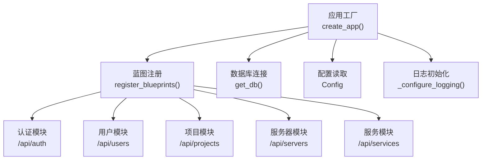
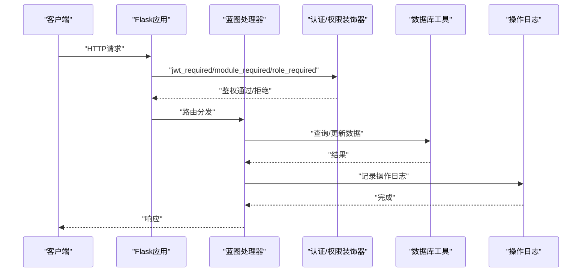
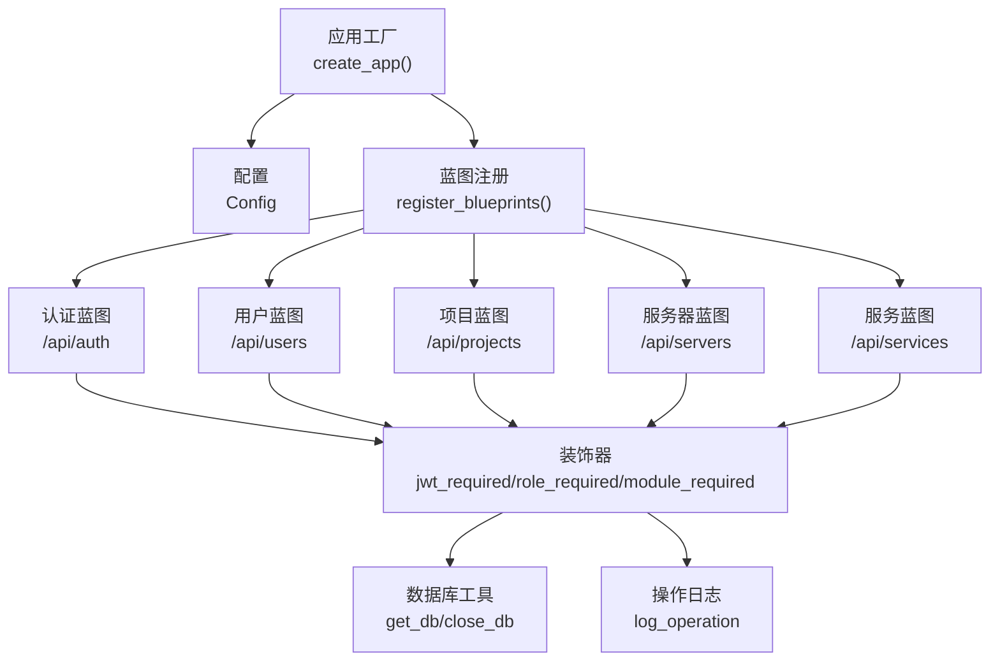

# 功能开发流程

<cite>
**本文引用的文件**
- [backend/app/__init__.py](file://backend/app/__init__.py)
- [backend/app/config.py](file://backend/app/config.py)
- [backend/app/extensions.py](file://backend/app/extensions.py)
- [backend/run.py](file://backend/run.py)
- [backend/init_db.py](file://backend/init_db.py)
- [backend/app/api/auth.py](file://backend/app/api/auth.py)
- [backend/app/api/users.py](file://backend/app/api/users.py)
- [backend/app/api/projects.py](file://backend/app/api/projects.py)
- [backend/app/api/servers.py](file://backend/app/api/servers.py)
- [backend/app/api/services.py](file://backend/app/api/services.py)
- [backend/app/utils/decorators.py](file://backend/app/utils/decorators.py)
- [backend/app/utils/auth.py](file://backend/app/utils/auth.py)
- [backend/app/utils/db.py](file://backend/app/utils/db.py)
- [backend/app/utils/password_utils.py](file://backend/app/utils/password_utils.py)
- [backend/app/utils/operation_log.py](file://backend/app/utils/operation_log.py)
</cite>

## 目录
1. [简介](#简介)
2. [项目结构](#项目结构)
3. [核心组件](#核心组件)
4. [架构总览](#架构总览)
5. [详细组件分析](#详细组件分析)
6. [依赖分析](#依赖分析)
7. [性能考虑](#性能考虑)
8. [故障排查指南](#故障排查指南)
9. [结论](#结论)
10. [附录](#附录)

## 简介
本文件面向OPS项目的功能开发流程，提供从需求分析到功能上线的完整方法论与实操指南。内容涵盖需求评审、技术方案设计、API设计规范、数据库变更设计、代码实现步骤、单元测试与集成测试执行、前后端协作流程、功能开发模板与检查清单等。旨在帮助开发者快速、高质量地交付功能，并确保与现有系统架构与安全策略保持一致。

## 项目结构
后端基于Flask应用，采用蓝图（Blueprint）组织API模块，统一通过应用工厂函数创建应用实例，并集中注册各模块蓝图。数据库连接通过Flask上下文缓存，工具类提供认证、权限控制、日志、密码与加密等通用能力。

**图表来源**
- [backend/app/__init__.py:28-151](file://backend/app/__init__.py#L28-L151)
- [backend/app/config.py:10-58](file://backend/app/config.py#L10-L58)
- [backend/app/utils/db.py:43-80](file://backend/app/utils/db.py#L43-L80)

**章节来源**
- [backend/app/__init__.py:28-151](file://backend/app/__init__.py#L28-L151)
- [backend/app/config.py:10-58](file://backend/app/config.py#L10-L58)
- [backend/run.py:1-8](file://backend/run.py#L1-L8)

## 核心组件
- 应用工厂与蓝图注册：负责应用初始化、CORS配置、数据库预检、定时任务初始化以及蓝图注册。
- 权限与认证：JWT生成与校验、角色与模块权限装饰器、登录失败/成功的操作日志。
- 数据访问：数据库连接池封装、连接关闭钩子、数据库目标日志。
- 安全与加密：密码哈希、对称加密/解密（Fernet）、PBKDF2派生密钥。
- 日志：统一操作日志记录，支持模块化与动作枚举。

**章节来源**
- [backend/app/__init__.py:28-151](file://backend/app/__init__.py#L28-L151)
- [backend/app/utils/decorators.py:26-214](file://backend/app/utils/decorators.py#L26-L214)
- [backend/app/utils/auth.py:9-45](file://backend/app/utils/auth.py#L9-L45)
- [backend/app/utils/db.py:43-80](file://backend/app/utils/db.py#L43-L80)
- [backend/app/utils/password_utils.py:55-133](file://backend/app/utils/password_utils.py#L55-L133)
- [backend/app/utils/operation_log.py:49-173](file://backend/app/utils/operation_log.py#L49-L173)

## 架构总览
后端采用“应用工厂 + 蓝图 + 工具类”的分层架构。请求进入后经认证与权限装饰器校验，再由具体蓝图处理业务逻辑，最终通过数据库工具类持久化数据，并记录操作日志。

**图表来源**
- [backend/app/__init__.py:116-151](file://backend/app/__init__.py#L116-L151)
- [backend/app/utils/decorators.py:26-214](file://backend/app/utils/decorators.py#L26-L214)
- [backend/app/utils/db.py:43-80](file://backend/app/utils/db.py#L43-L80)
- [backend/app/utils/operation_log.py:49-173](file://backend/app/utils/operation_log.py#L49-L173)

## 详细组件分析

### 需求评审与技术方案设计
- 明确功能边界与业务目标，识别涉及的模块（如项目、服务器、服务等）。
- 评估数据模型变更需求，确定是否需要新增表或字段。
- 设计API接口范围与权限层级，明确认证与模块授权要求。
- 输出技术方案文档，包含接口清单、数据模型、异常处理策略与日志记录规范。

### API设计规范
- 统一响应结构：包含状态码、消息与数据体，便于前端解析与错误提示。
- 路由命名：采用REST风格，使用url_prefix区分模块。
- 权限控制：在蓝图方法上叠加jwt_required、module_required、role_required装饰器。
- 参数校验：在业务处理前进行输入校验与长度/格式约束。
- 错误处理：捕获异常并返回标准化错误响应，必要时回滚事务。

示例参考：
- 登录接口：[backend/app/api/auth.py:16-103](file://backend/app/api/auth.py#L16-L103)
- 用户管理接口：[backend/app/api/users.py:19-290](file://backend/app/api/users.py#L19-L290)
- 项目管理接口：[backend/app/api/projects.py:13-547](file://backend/app/api/projects.py#L13-L547)
- 服务器管理接口：[backend/app/api/servers.py:14-604](file://backend/app/api/servers.py#L14-L604)
- 服务管理接口：[backend/app/api/services.py:12-210](file://backend/app/api/services.py#L12-L210)

**章节来源**
- [backend/app/api/auth.py:16-103](file://backend/app/api/auth.py#L16-L103)
- [backend/app/api/users.py:19-290](file://backend/app/api/users.py#L19-L290)
- [backend/app/api/projects.py:13-547](file://backend/app/api/projects.py#L13-L547)
- [backend/app/api/servers.py:14-604](file://backend/app/api/servers.py#L14-L604)
- [backend/app/api/services.py:12-210](file://backend/app/api/services.py#L12-L210)

### 数据库变更设计
- 新增表：参考数据库初始化脚本，按需在初始化脚本中添加CREATE TABLE语句，并补充索引与约束。
- 字段变更：提供“若不存在则添加”逻辑，避免破坏现有数据。
- 外键与级联：合理使用外键与级联删除，确保数据一致性。
- 默认值与索引：为常用查询字段建立索引，设置合理的默认值与注释。

参考脚本位置：
- [backend/init_db.py:24-431](file://backend/init_db.py#L24-L431)

**章节来源**
- [backend/init_db.py:24-431](file://backend/init_db.py#L24-L431)

### 代码实现步骤
- 蓝图创建：在app/api目录下新建模块文件，定义Blueprint与url_prefix。
- 路由定义：在蓝图内定义GET/POST/PUT/DELETE路由，绑定处理函数。
- 模型与工具类：复用现有工具类（认证、权限、数据库、日志、加密）。
- 错误处理：捕获异常并返回标准化响应，必要时回滚事务。
- 日志记录：在关键操作点调用log_operation记录模块、动作、目标与详情。

参考实现位置：
- [backend/app/__init__.py:116-151](file://backend/app/__init__.py#L116-L151)
- [backend/app/utils/decorators.py:26-214](file://backend/app/utils/decorators.py#L26-L214)
- [backend/app/utils/operation_log.py:49-173](file://backend/app/utils/operation_log.py#L49-L173)

**章节来源**
- [backend/app/__init__.py:116-151](file://backend/app/__init__.py#L116-L151)
- [backend/app/utils/decorators.py:26-214](file://backend/app/utils/decorators.py#L26-L214)
- [backend/app/utils/operation_log.py:49-173](file://backend/app/utils/operation_log.py#L49-L173)

### 单元测试与集成测试
- 单元测试：针对工具类（认证、加密、权限装饰器、日志）编写测试用例，覆盖边界条件与异常分支。
- 集成测试：通过HTTP客户端发起请求，验证路由、权限、参数校验、数据库变更与日志记录的端到端流程。
- 测试数据：使用测试数据库或内存数据库，确保测试隔离与可重复性。
- 覆盖率：至少覆盖核心路径与异常路径，确保关键逻辑100%覆盖。

（本节为通用指导，不直接分析具体文件）

### 前后端协作流程
- API接口约定：后端提供清晰的接口文档与示例，前端据此对接。
- 数据模型定义：前后端共同确认实体字段、类型与约束，避免歧义。
- 前端集成方式：通过统一的HTTP客户端调用后端接口，处理统一响应结构与错误提示。

（本节为通用指导，不直接分析具体文件）

### 功能开发模板
- 蓝图创建：在app/api下新增模块文件，定义Blueprint与url_prefix。
- 路由定义：在蓝图内定义CRUD路由，绑定处理函数。
- 权限与认证：在路由上叠加jwt_required、module_required、role_required装饰器。
- 数据模型：复用现有模型与工具类，必要时扩展数据库表或字段。
- 工具类调用：使用认证、权限、数据库、日志、加密工具类。
- 错误处理：捕获异常并返回标准化响应，必要时回滚事务。
- 日志记录：在关键操作点调用log_operation记录模块、动作、目标与详情。

参考模板位置：
- [backend/app/api/auth.py:13-103](file://backend/app/api/auth.py#L13-L103)
- [backend/app/api/users.py:16-290](file://backend/app/api/users.py#L16-L290)
- [backend/app/api/projects.py:10-547](file://backend/app/api/projects.py#L10-L547)
- [backend/app/api/servers.py:11-604](file://backend/app/api/servers.py#L11-L604)
- [backend/app/api/services.py:9-210](file://backend/app/api/services.py#L9-L210)

**章节来源**
- [backend/app/api/auth.py:13-103](file://backend/app/api/auth.py#L13-L103)
- [backend/app/api/users.py:16-290](file://backend/app/api/users.py#L16-L290)
- [backend/app/api/projects.py:10-547](file://backend/app/api/projects.py#L10-L547)
- [backend/app/api/servers.py:11-604](file://backend/app/api/servers.py#L11-L604)
- [backend/app/api/services.py:9-210](file://backend/app/api/services.py#L9-L210)

## 依赖分析
- 应用工厂依赖配置与工具类，负责初始化日志、CORS、蓝图注册与数据库预检。
- 蓝图依赖装饰器、数据库工具与日志工具，实现认证、权限与数据持久化。
- 工具类之间低耦合，职责清晰：认证/权限、数据库连接、密码与加密、操作日志。

**图表来源**
- [backend/app/__init__.py:28-151](file://backend/app/__init__.py#L28-L151)
- [backend/app/utils/decorators.py:26-214](file://backend/app/utils/decorators.py#L26-L214)
- [backend/app/utils/db.py:43-80](file://backend/app/utils/db.py#L43-L80)
- [backend/app/utils/operation_log.py:49-173](file://backend/app/utils/operation_log.py#L49-L173)

**章节来源**
- [backend/app/__init__.py:28-151](file://backend/app/__init__.py#L28-L151)
- [backend/app/utils/decorators.py:26-214](file://backend/app/utils/decorators.py#L26-L214)
- [backend/app/utils/db.py:43-80](file://backend/app/utils/db.py#L43-L80)
- [backend/app/utils/operation_log.py:49-173](file://backend/app/utils/operation_log.py#L49-L173)

## 性能考虑
- 数据库连接：使用Flask上下文缓存连接，减少连接开销；设置连接超时与字符集。
- 查询优化：为高频查询字段建立索引；避免N+1查询；合理分页与LIMIT。
- 缓存策略：对静态字典数据（如环境类型、平台、服务分类）进行缓存或预加载。
- 日志级别：生产环境降低日志级别，避免过多I/O；仅在异常时记录详细堆栈。
- 加密成本：对称加密/解密在敏感数据频繁读写时需评估性能影响，必要时引入缓存或批量处理。

（本节为通用指导，不直接分析具体文件）

## 故障排查指南
- 数据库连接失败：检查DB_HOST、DB_PORT、DB_USER、DB_PASSWORD、DB_NAME；查看启动日志中的脱敏连接信息。
- JWT无效或过期：确认JWT_SECRET_KEY配置；检查token过期时间；确保客户端携带正确的Bearer Token。
- 权限不足：确认用户角色与模块授权；检查role_modules表配置。
- 操作日志未记录：确认数据库连接正常；检查log_operation异常处理日志。

**章节来源**
- [backend/app/__init__.py:88-113](file://backend/app/__init__.py#L88-L113)
- [backend/app/utils/db.py:28-80](file://backend/app/utils/db.py#L28-L80)
- [backend/app/utils/auth.py:31-45](file://backend/app/utils/auth.py#L31-L45)
- [backend/app/utils/operation_log.py:113-118](file://backend/app/utils/operation_log.py#L113-L118)

## 结论
通过遵循本文档提供的开发流程与模板，结合现有认证、权限、数据库与日志工具，可以高效、安全地完成新功能的全生命周期交付。建议在每次迭代中严格执行需求评审、技术方案设计、代码实现与测试验证，并持续完善质量保障措施。

## 附录

### 功能开发检查清单
- 需求评审：功能边界、业务目标、涉及模块、权限与数据模型。
- 技术方案：接口清单、参数校验规则、异常处理策略、日志记录规范。
- API设计：统一响应结构、路由命名、权限装饰器、错误处理。
- 数据库：新增表/字段、索引、外键、默认值与约束。
- 代码实现：蓝图创建、路由定义、工具类调用、日志记录。
- 单元测试：工具类与核心逻辑覆盖。
- 集成测试：端到端验证、权限与异常路径。
- 上线准备：配置检查、数据库迁移、日志与监控。

### API设计规范要点
- 统一响应结构：包含code、message、data。
- 路由命名：REST风格，url_prefix区分模块。
- 权限控制：jwt_required、module_required、role_required。
- 参数校验：输入验证、长度与格式约束。
- 错误处理：捕获异常并返回标准化响应。
- 日志记录：关键操作调用log_operation。

### 数据库变更规范
- 新增表：在初始化脚本中添加CREATE TABLE与索引。
- 字段变更：提供“若不存在则添加”逻辑。
- 外键与级联：确保数据一致性。
- 默认值与注释：提升可维护性。

### 安全与合规
- 密码哈希：使用bcrypt；禁止明文存储。
- 对称加密：使用Fernet；生产环境配置DATA_ENCRYPTION_KEY。
- JWT配置：生产环境配置JWT_SECRET_KEY与过期时间。
- 操作日志：记录模块、动作、目标与详情，便于审计。