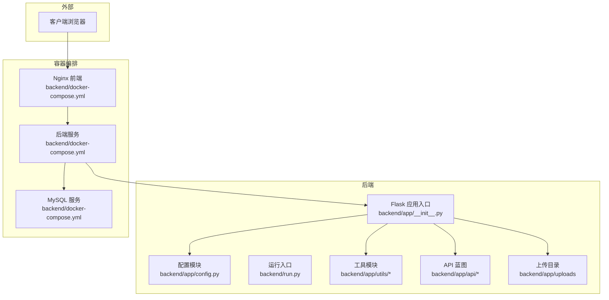
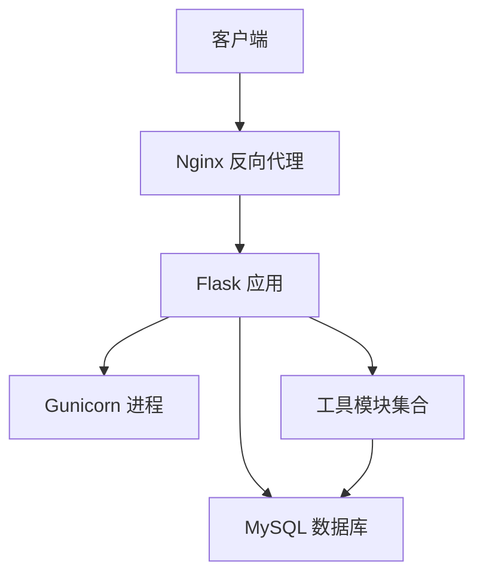
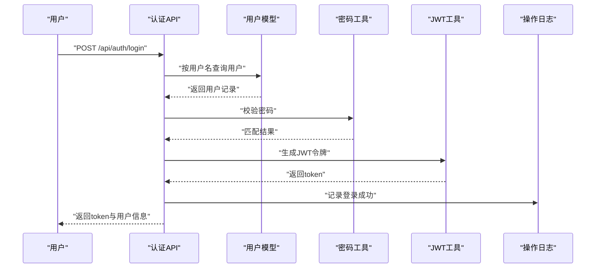
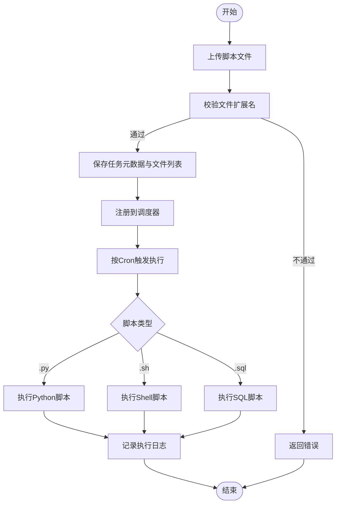
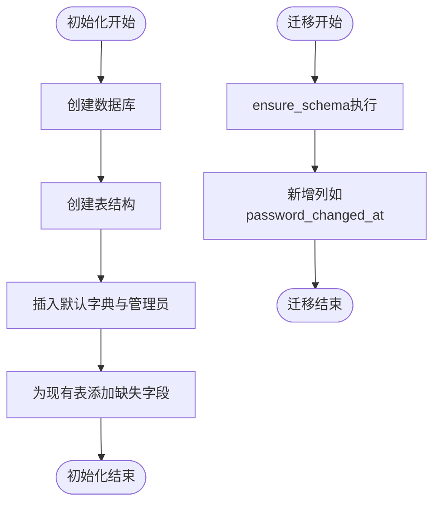
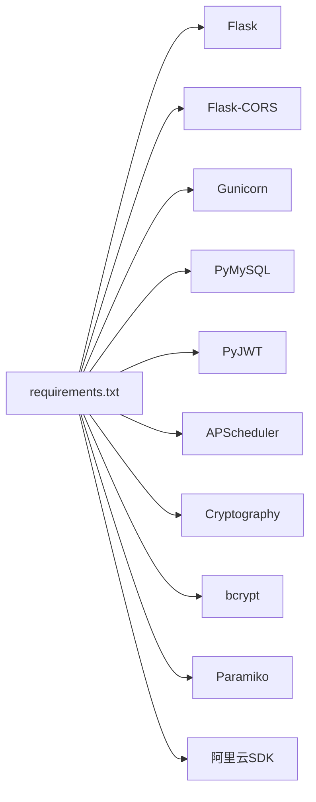

# 开发流程

<cite>
**本文引用的文件**
- [backend/app/__init__.py](file://backend/app/__init__.py)
- [backend/app/config.py](file://backend/app/config.py)
- [backend/run.py](file://backend/run.py)
- [backend/docker-compose.yml](file://backend/docker-compose.yml)
- [backend/Dockerfile](file://backend/Dockerfile)
- [backend/requirements.txt](file://backend/requirements.txt)
- [backend/init_db.py](file://backend/init_db.py)
- [backend/app/utils/db.py](file://backend/app/utils/db.py)
- [backend/app/utils/schema.py](file://backend/app/utils/schema.py)
- [backend/app/api/auth.py](file://backend/app/api/auth.py)
- [backend/app/api/tasks.py](file://backend/app/api/tasks.py)
- [backend/app/utils/script_runner.py](file://backend/app/utils/script_runner.py)
- [backend/app/utils/validators.py](file://backend/app/utils/validators.py)
- [backend/app/utils/password_utils.py](file://backend/app/utils/password_utils.py)
- [backend/app/utils/ssl_checker.py](file://backend/app/utils/ssl_checker.py)
- [backend/app/utils/operation_log.py](file://backend/app/utils/operation_log.py)
- [backend/app/utils/scheduler.py](file://backend/app/utils/scheduler.py)
- [nginx.conf](file://nginx.conf)
</cite>

## 目录
1. [简介](#简介)
2. [项目结构](#项目结构)
3. [核心组件](#核心组件)
4. [架构总览](#架构总览)
5. [详细组件分析](#详细组件分析)
6. [依赖分析](#依赖分析)
7. [性能考虑](#性能考虑)
8. [故障排查指南](#故障排查指南)
9. [结论](#结论)
10. [附录](#附录)

## 简介
本开发流程文档面向OPS项目的全生命周期管理，覆盖从需求分析到功能上线的完整流程，包括需求评审、技术方案设计、开发环境搭建、代码实现、单元测试、集成测试、代码审查、文档更新等环节。同时，明确Git工作流（分支策略、提交规范、合并流程）、版本控制最佳实践（commit message格式、标签管理、发布流程）、开发工具配置指南以及常见开发场景的处理方法。本文档旨在帮助团队统一协作标准，提升交付质量与效率。

## 项目结构
OPS采用前后端分离架构，后端基于Flask，使用Docker编排MySQL、后端服务与Nginx前端代理。核心目录与职责如下：
- backend/app：Flask应用入口、蓝图注册、配置与工具模块
- backend/app/api：各业务模块的HTTP接口（认证、任务、服务器、证书等）
- backend/app/utils：通用工具（数据库连接、模式迁移、调度器、脚本执行、校验器、密码工具、SSL检查、操作日志等）
- backend/app/uploads：上传目录（脚本与证书）
- backend/docker-compose.yml：服务编排（MySQL、后端、Nginx）
- backend/Dockerfile：后端镜像构建
- backend/requirements.txt：Python依赖
- backend/init_db.py：数据库初始化脚本
- nginx.conf：Nginx反向代理配置

图表来源
- [backend/app/__init__.py:28-113](file://backend/app/__init__.py#L28-L113)
- [backend/app/config.py:10-57](file://backend/app/config.py#L10-L57)
- [backend/docker-compose.yml:9-102](file://backend/docker-compose.yml#L9-L102)

章节来源
- [backend/app/__init__.py:28-113](file://backend/app/__init__.py#L28-L113)
- [backend/app/config.py:10-57](file://backend/app/config.py#L10-L57)
- [backend/docker-compose.yml:9-102](file://backend/docker-compose.yml#L9-L102)

## 核心组件
- 应用工厂与蓝图注册：通过应用工厂创建Flask实例，集中注册认证、用户、导出、任务、服务器、服务、应用、证书、仪表盘、字典、阿里云凭证、域名、操作日志、监控、项目等蓝图。
- 配置中心：集中管理密钥、数据库、CORS、定时任务计划、Grafana集成等配置项，并支持运行时读取环境变量。
- 数据层：统一数据库连接、连接参数掩码化日志、应用启动时Schema幂等迁移。
- 工具链：密码校验与哈希、脚本执行器（.py/.sh/.sql）、输入校验器、SSL证书检测、操作日志记录、APScheduler调度器。
- 前后端联调：Nginx反向代理/api前缀至后端，静态资源由Nginx提供，后端启用CORS并限制请求体大小。

章节来源
- [backend/app/__init__.py:116-149](file://backend/app/__init__.py#L116-L149)
- [backend/app/config.py:10-57](file://backend/app/config.py#L10-L57)
- [backend/app/utils/db.py:43-79](file://backend/app/utils/db.py#L43-L79)
- [backend/app/utils/schema.py:10-42](file://backend/app/utils/schema.py#L10-L42)

## 架构总览
后端通过Gunicorn以单worker多线程模式运行，避免APScheduler在多进程场景重复注册；Nginx负责静态资源与/api反向代理；MySQL提供持久化存储；应用启动时进行数据库健康检查与Schema迁移，确保服务可用性与数据一致性。

图表来源
- [backend/Dockerfile:34-35](file://backend/Dockerfile#L34-L35)
- [backend/docker-compose.yml:69-80](file://backend/docker-compose.yml#L69-L80)
- [nginx.conf:32-44](file://nginx.conf#L32-L44)

章节来源
- [backend/Dockerfile:34-35](file://backend/Dockerfile#L34-L35)
- [backend/docker-compose.yml:69-80](file://backend/docker-compose.yml#L69-L80)
- [nginx.conf:32-44](file://nginx.conf#L32-L44)

## 详细组件分析

### 认证与授权流程
- 登录接口接收用户名与密码，查询用户并校验激活状态，随后验证密码并生成JWT令牌，记录操作日志。
- 个人资料接口要求JWT认证，返回当前用户信息。
- 修改密码接口要求JWT认证，校验旧密码并更新为新密码哈希，记录操作日志。

图表来源
- [backend/app/api/auth.py:15-95](file://backend/app/api/auth.py#L15-L95)
- [backend/app/utils/password_utils.py:64-90](file://backend/app/utils/password_utils.py#L64-L90)
- [backend/app/utils/operation_log.py](file://backend/app/utils/operation_log.py)

章节来源
- [backend/app/api/auth.py:15-95](file://backend/app/api/auth.py#L15-L95)
- [backend/app/utils/password_utils.py:64-90](file://backend/app/utils/password_utils.py#L64-L90)

### 定时任务执行流程
- 任务创建：支持多文件上传，校验扩展名，写入任务元数据与脚本文件列表，记录操作日志。
- 调度器：将任务注册到APScheduler，按Cron表达式周期执行。
- 执行器：根据脚本扩展名选择执行方式（Python、Shell、MySQL），支持超时控制与输出捕获。

图表来源
- [backend/app/api/tasks.py:147-216](file://backend/app/api/tasks.py#L147-L216)
- [backend/app/utils/script_runner.py:49-89](file://backend/app/utils/script_runner.py#L49-L89)
- [backend/app/utils/scheduler.py](file://backend/app/utils/scheduler.py)

章节来源
- [backend/app/api/tasks.py:147-216](file://backend/app/api/tasks.py#L147-L216)
- [backend/app/utils/script_runner.py:49-89](file://backend/app/utils/script_runner.py#L49-L89)

### 数据库初始化与Schema迁移
- 初始化脚本：创建数据库与表结构，插入默认字典数据与管理员账户，兼容历史表字段缺失场景。
- 启动迁移：应用启动时执行轻量迁移，保证新增列（如password_changed_at）的幂等补全。

图表来源
- [backend/init_db.py:22-391](file://backend/init_db.py#L22-L391)
- [backend/app/utils/schema.py:10-42](file://backend/app/utils/schema.py#L10-L42)

章节来源
- [backend/init_db.py:22-391](file://backend/init_db.py#L22-L391)
- [backend/app/utils/schema.py:10-42](file://backend/app/utils/schema.py#L10-L42)

### 输入校验与安全
- 校验器：提供IP、主机名、URL、端口、域名、密码、用户名、邮箱、整数、正整数、字符串长度等校验逻辑。
- 密码工具：支持Werkzeug scrypt与bcrypt两种格式的密码校验，增强兼容性与安全性。
- 敏感信息：服务器台账中的系统密码与Docker密码在入库前进行加密处理。

章节来源
- [backend/app/utils/validators.py:1-150](file://backend/app/utils/validators.py#L1-L150)
- [backend/app/utils/password_utils.py:64-90](file://backend/app/utils/password_utils.py#L64-L90)
- [backend/app/api/servers.py:292-497](file://backend/app/api/servers.py#L292-L497)

### SSL证书检测与告警
- 功能：在线SSL证书检测、阿里云证书同步（可选）、微信告警通知。
- 依赖：可选导入阿里云CAS SDK，若未安装则记录警告并降级为非阿里云能力。

章节来源
- [backend/app/utils/ssl_checker.py:1-44](file://backend/app/utils/ssl_checker.py#L1-L44)

## 依赖分析
- 运行时依赖：Flask、CORS、Gunicorn、PyMySQL、PyJWT、Werkzeug、APScheduler、OpenPyXL、Cryptography、bcrypt、Paramiko、阿里云相关SDK等。
- 构建依赖：Python 3.11 Slim镜像、系统编译工具与MySQL客户端库。
- 编排依赖：Docker Compose v3.8，MySQL 8.0，Nginx Alpine，后端Python应用。

图表来源
- [backend/requirements.txt:1-17](file://backend/requirements.txt#L1-L17)

章节来源
- [backend/requirements.txt:1-17](file://backend/requirements.txt#L1-L17)
- [backend/Dockerfile:14-23](file://backend/Dockerfile#L14-L23)

## 性能考虑
- 单worker多线程：后端以单worker多线程运行，避免APScheduler在多进程场景重复注册，降低并发冲突风险。
- 连接池与超时：数据库连接设置连接超时；脚本执行设置超时阈值，防止阻塞。
- 健康检查：后端与MySQL均配置健康检查，保障容器编排稳定性。
- 前端缓存：Nginx对静态资源设置长缓存，减少带宽占用。

章节来源
- [backend/Dockerfile:34-35](file://backend/Dockerfile#L34-L35)
- [backend/app/utils/db.py:49-68](file://backend/app/utils/db.py#L49-L68)
- [backend/app/utils/script_runner.py:19-46](file://backend/app/utils/script_runner.py#L19-L46)
- [backend/docker-compose.yml:25-28](file://backend/docker-compose.yml#L25-L28)
- [nginx.conf:26-30](file://nginx.conf#L26-L30)

## 故障排查指南
- 数据库连接失败：检查DB_HOST、DB_PORT、DB_USER、DB_PASSWORD、DB_NAME，确认MySQL容器健康与网络互通。
- Schema迁移异常：关注ensure_schema日志，确认列是否已存在，必要时手动回滚并重试。
- 密码校验失败：确认密码哈希格式（Werkzeug scrypt或bcrypt），避免未知格式导致校验异常。
- 任务执行失败：查看脚本扩展名是否受支持，确认工作目录与命令参数，检查超时与输出日志。
- CORS跨域问题：核对CORS_ORIGINS与CORS_ALLOW_ALL配置，确保前端域名与凭证设置一致。
- 前端静态资源404：确认Nginx挂载路径与index.html存在，检查静态资源缓存头设置。

章节来源
- [backend/app/__init__.py:88-104](file://backend/app/__init__.py#L88-L104)
- [backend/app/utils/schema.py:14-41](file://backend/app/utils/schema.py#L14-L41)
- [backend/app/utils/password_utils.py:77-90](file://backend/app/utils/password_utils.py#L77-L90)
- [backend/app/utils/script_runner.py:49-89](file://backend/app/utils/script_runner.py#L49-L89)
- [backend/app/config.py:32-38](file://backend/app/config.py#L32-L38)
- [nginx.conf:8-30](file://nginx.conf#L8-L30)

## 结论
OPS项目通过清晰的模块划分、完善的工具链与容器化编排，实现了高可用、可维护的运维管理平台。遵循本文档的开发流程与最佳实践，可有效提升开发效率、降低回归风险，并确保版本演进的可控性与可追溯性。

## 附录

### Git工作流程与分支策略
- 分支策略
  - develop：主开发分支，合并feature分支后进行集成测试与代码审查。
  - feature/<name>：功能开发分支，命名建议使用“模块/子模块/功能点”层级。
  - release/<version>：发布分支，用于修复紧急问题与最终验证。
- 提交规范
  - 类型：feat、fix、docs、style、refactor、test、chore、perf、ci、build
  - 格式：type(scope): subject
  - 示例：feat(auth): 新增用户登录接口
- 合并流程
  - feature分支完成开发后，创建Pull Request至develop，通过CI与代码审查后合并。
  - release分支仅允许热修复，合并后同步回develop与main。

### 版本控制最佳实践
- commit message格式
  - type(scope): subject
  - type取值：feat、fix、docs、style、refactor、test、chore、perf、ci、build
- 标签管理
  - 使用语义化版本（X.Y.Z），发布时创建对应tag并推送。
- 发布流程
  - 在release分支上进行最终验证，合并至main并打标签，随后合并回develop。

### 开发工具配置指南
- 后端运行
  - 本地开发：使用Flask内置调试运行或Docker Compose启动后端+MySQL+前端。
  - 环境变量：通过docker-compose.yml设置SECRET_KEY、JWT_SECRET_KEY、DB_*、CORS_*等。
- 前端联调
  - Nginx将/api反代至后端5000端口，静态资源指向dist目录。
- 数据库初始化
  - 首次启动后，应用会进行Schema迁移；也可使用init_db.py进行全量建表与默认数据初始化。

章节来源
- [backend/docker-compose.yml:36-59](file://backend/docker-compose.yml#L36-L59)
- [backend/run.py:1-8](file://backend/run.py#L1-L8)
- [nginx.conf:32-44](file://nginx.conf#L32-L44)
- [backend/init_db.py:22-391](file://backend/init_db.py#L22-L391)

### 新功能开发模板（步骤指引）
- 需求评审
  - 明确功能范围、接口约束、数据模型与权限要求。
- 技术方案设计
  - 设计API端点、请求/响应结构、数据库变更与索引策略。
- 开发环境搭建
  - 启动MySQL与后端服务，确认CORS与上传目录权限。
- 代码实现
  - 在backend/app/api下新增蓝图与路由，实现业务逻辑；在backend/app/utils中复用或新增工具函数。
- 单元测试
  - 针对工具函数与API端点编写测试用例，覆盖正常与异常路径。
- 集成测试
  - 通过Swagger或curl验证端到端流程，检查日志与告警。
- 代码审查
  - 关注安全性（密码、敏感字段加密）、健壮性（超时、异常处理）、可维护性（日志、注释）。
- 文档更新
  - 更新接口文档与README，补充变更日志。

### 常见开发场景处理
- 新增API端点
  - 在backend/app/api下创建模块文件，注册蓝图并在backend/app/__init__.py中注册。
- 数据库变更
  - 在backend/app/utils/schema.py中添加幂等迁移逻辑，或在init_db.py中补充建表/默认数据。
- 前端集成
  - 确认Nginx反向代理与CORS配置，确保静态资源与/api接口均可访问。
- 定时任务
  - 使用APScheduler与脚本执行器，注意脚本扩展名与超时设置，记录任务日志。

章节来源
- [backend/app/__init__.py:116-149](file://backend/app/__init__.py#L116-L149)
- [backend/app/utils/schema.py:10-42](file://backend/app/utils/schema.py#L10-L42)
- [backend/app/api/tasks.py:147-216](file://backend/app/api/tasks.py#L147-L216)
- [nginx.conf:32-44](file://nginx.conf#L32-L44)