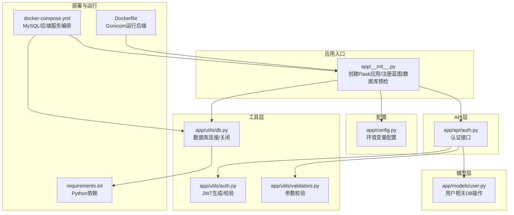
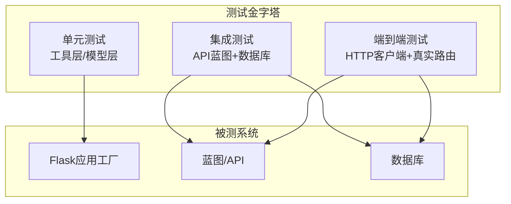
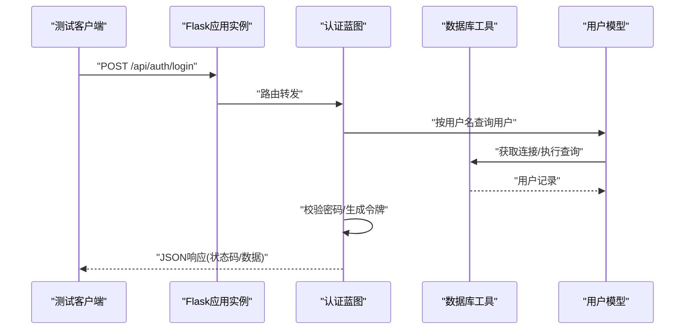
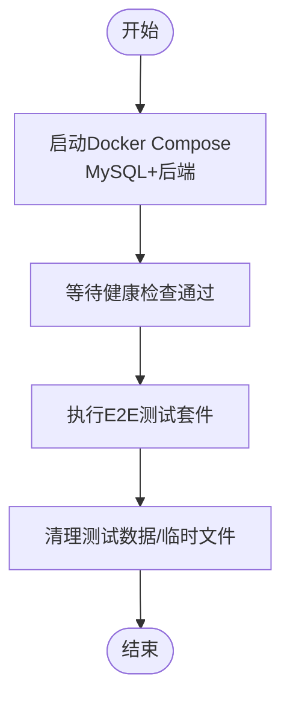
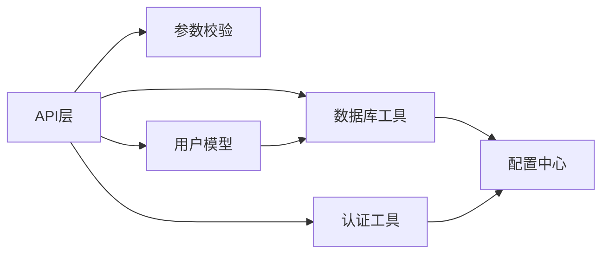

# 测试策略

<cite>
**本文引用的文件**
- [backend/app/__init__.py](file://backend/app/__init__.py)
- [backend/app/config.py](file://backend/app/config.py)
- [backend/app/utils/db.py](file://backend/app/utils/db.py)
- [backend/app/utils/auth.py](file://backend/app/utils/auth.py)
- [backend/app/utils/validators.py](file://backend/app/utils/validators.py)
- [backend/app/models/user.py](file://backend/app/models/user.py)
- [backend/app/api/auth.py](file://backend/app/api/auth.py)
- [backend/docker-compose.yml](file://backend/docker-compose.yml)
- [backend/Dockerfile](file://backend/Dockerfile)
- [backend/requirements.txt](file://backend/requirements.txt)
</cite>

## 目录
1. [引言](#引言)
2. [项目结构](#项目结构)
3. [核心组件](#核心组件)
4. [架构总览](#架构总览)
5. [详细组件分析](#详细组件分析)
6. [依赖分析](#依赖分析)
7. [性能考量](#性能考量)
8. [故障排查指南](#故障排查指南)
9. [结论](#结论)
10. [附录](#附录)

## 引言
本测试策略文档面向OPS后端服务，围绕测试金字塔（单元测试、集成测试、端到端测试）制定系统化的实施策略与覆盖率目标，并结合现有Flask应用结构与依赖，明确测试框架选择（pytest）、Mock对象设计、测试数据准备、API测试方法（请求/响应、状态码、数据完整性）、数据库测试策略（环境隔离、数据清理、事务回滚），以及在CI中的测试执行流程。

## 项目结构
后端采用Flask应用，蓝图按功能模块划分，工具层提供数据库连接、认证、参数校验等通用能力，模型层封装数据库访问。整体结构清晰，便于分层测试与隔离。

图示来源
- [backend/app/__init__.py:28-113](file://backend/app/__init__.py#L28-L113)
- [backend/app/config.py:10-57](file://backend/app/config.py#L10-L57)
- [backend/app/utils/db.py:43-79](file://backend/app/utils/db.py#L43-L79)
- [backend/app/utils/auth.py:9-44](file://backend/app/utils/auth.py#L9-L44)
- [backend/app/utils/validators.py:1-151](file://backend/app/utils/validators.py#L1-L151)
- [backend/app/models/user.py:1-162](file://backend/app/models/user.py#L1-L162)
- [backend/app/api/auth.py:1-210](file://backend/app/api/auth.py#L1-L210)
- [backend/docker-compose.yml:9-107](file://backend/docker-compose.yml#L9-L107)
- [backend/Dockerfile:1-36](file://backend/Dockerfile#L1-L36)
- [backend/requirements.txt:1-17](file://backend/requirements.txt#L1-L17)

章节来源
- [backend/app/__init__.py:28-113](file://backend/app/__init__.py#L28-L113)
- [backend/app/config.py:10-57](file://backend/app/config.py#L10-L57)
- [backend/docker-compose.yml:9-107](file://backend/docker-compose.yml#L9-L107)
- [backend/Dockerfile:1-36](file://backend/Dockerfile#L1-L36)
- [backend/requirements.txt:1-17](file://backend/requirements.txt#L1-L17)

## 核心组件
- 应用工厂与蓝图注册：应用在工厂函数中完成配置、CORS、蓝图注册、数据库预检与定时任务初始化，便于在测试中按需创建隔离的测试应用实例。
- 配置中心：集中管理密钥、数据库、CORS、定时任务等配置，支持通过环境变量注入，利于测试环境隔离。
- 工具层：
  - 数据库工具：提供连接获取、关闭与连接参数构造，便于测试中替换或模拟。
  - 认证工具：提供JWT生成与校验，便于鉴权相关测试。
  - 参数校验：提供IP、主机名、URL、端口、域名、密码、用户名、邮箱、整数、正整数、字符串长度等校验，便于输入合法性测试。
- 模型层：封装用户表的增删改查与密码更新，便于单元测试与集成测试。
- API层：认证接口包含登录、获取个人资料、修改密码，覆盖鉴权、业务逻辑与错误处理，是测试重点。

章节来源
- [backend/app/__init__.py:28-113](file://backend/app/__init__.py#L28-L113)
- [backend/app/config.py:10-57](file://backend/app/config.py#L10-L57)
- [backend/app/utils/db.py:43-79](file://backend/app/utils/db.py#L43-L79)
- [backend/app/utils/auth.py:9-44](file://backend/app/utils/auth.py#L9-L44)
- [backend/app/utils/validators.py:1-151](file://backend/app/utils/validators.py#L1-L151)
- [backend/app/models/user.py:1-162](file://backend/app/models/user.py#L1-L162)
- [backend/app/api/auth.py:1-210](file://backend/app/api/auth.py#L1-L210)

## 架构总览
测试金字塔在OPS后端的应用映射如下：
- 单元测试：针对工具层（认证、校验、数据库连接）、模型层（用户DB操作）进行最小粒度测试，确保函数级正确性与边界条件。
- 集成测试：以测试应用实例调用API蓝图，验证API路由、鉴权装饰器、业务逻辑与数据库交互，关注状态码、响应结构与数据一致性。
- 端到端测试：通过HTTP客户端访问后端API，覆盖真实请求/响应链路，验证跨模块协作、CORS、定时任务触发等。

图示来源
- [backend/app/__init__.py:28-113](file://backend/app/__init__.py#L28-L113)
- [backend/app/api/auth.py:16-210](file://backend/app/api/auth.py#L16-L210)
- [backend/app/utils/db.py:43-79](file://backend/app/utils/db.py#L43-L79)
- [backend/app/models/user.py:1-162](file://backend/app/models/user.py#L1-L162)

## 详细组件分析

### 单元测试策略
- 工具层测试
  - 认证工具：验证JWT生成与过期校验、无效密钥场景；使用Mock替换配置中的密钥，覆盖异常路径。
  - 参数校验：针对每类校验函数编写边界用例（空值、越界、非法格式），确保输入健壮性。
  - 数据库连接：使用Mock替换底层连接库，验证连接参数构造、异常日志与关闭流程。
- 模型层测试
  - 用户模型：针对创建、查询、更新、删除、密码更新编写用例，覆盖空结果、字段过滤、提交/回滚等。
- 覆盖率目标
  - 工具层与模型层：语句覆盖率≥90%，分支覆盖率≥80%。

章节来源
- [backend/app/utils/auth.py:9-44](file://backend/app/utils/auth.py#L9-L44)
- [backend/app/utils/validators.py:1-151](file://backend/app/utils/validators.py#L1-L151)
- [backend/app/utils/db.py:43-79](file://backend/app/utils/db.py#L43-L79)
- [backend/app/models/user.py:1-162](file://backend/app/models/user.py#L1-L162)

### 集成测试策略
- 应用实例与蓝图
  - 在测试前构建测试应用实例（复用应用工厂），关闭生产特性（如定时任务），确保可重复性。
  - 使用Flask测试客户端发起请求，覆盖鉴权装饰器、路由参数、请求体、CORS头等。
- API测试要点
  - 登录接口：用户名/密码为空、用户不存在、用户禁用、密码错误、成功登录与返回模块列表。
  - 个人资料接口：未登录访问、用户不存在、成功返回。
  - 修改密码接口：旧密码错误、新密码长度不足、成功与失败场景。
- 覆盖率目标
  - API层：语句覆盖率≥85%，分支覆盖率≥80%。

图示来源
- [backend/app/api/auth.py:16-103](file://backend/app/api/auth.py#L16-L103)
- [backend/app/models/user.py:36-52](file://backend/app/models/user.py#L36-L52)
- [backend/app/utils/db.py:43-69](file://backend/app/utils/db.py#L43-L69)

章节来源
- [backend/app/api/auth.py:16-210](file://backend/app/api/auth.py#L16-L210)
- [backend/app/models/user.py:1-162](file://backend/app/models/user.py#L1-L162)
- [backend/app/utils/db.py:43-79](file://backend/app/utils/db.py#L43-L79)

### 端到端测试策略
- 环境准备
  - 使用Docker Compose启动MySQL与后端服务，确保健康检查通过后再执行测试。
  - 通过环境变量隔离测试数据库与配置，避免污染生产或共享环境。
- 场景覆盖
  - 基础路由：根路径返回服务状态。
  - 认证链路：登录→携带令牌访问受保护路由→登出（若实现）。
  - CORS：验证允许源、凭据传递、头部白名单。
  - 文件上传/下载：上传目录存在性与访问权限。
- 覆盖率目标
  - 端到端：场景覆盖率≥80%，关键路径100%。

图示来源
- [backend/docker-compose.yml:68-82](file://backend/docker-compose.yml#L68-L82)
- [backend/Dockerfile:34-36](file://backend/Dockerfile#L34-L36)

章节来源
- [backend/docker-compose.yml:9-107](file://backend/docker-compose.yml#L9-L107)
- [backend/Dockerfile:1-36](file://backend/Dockerfile#L1-L36)

### 测试框架与配置
- 框架选择：pytest（轻量、插件丰富、与Flask测试客户端契合）。
- 插件建议：pytest-mock（Mock对象）、pytest-cov（覆盖率）、pytest-env（环境变量注入）、pytest-ordering（用例顺序控制）。
- 配置要点：
  - conftest.py中定义测试应用工厂、测试数据库连接、Mock补丁与环境变量。
  - 使用pytest.mark.parametrize组织参数化测试，提升用例复用性。
  - 使用fixture管理测试资源（如测试用户、测试文件）。

章节来源
- [backend/requirements.txt:1-17](file://backend/requirements.txt#L1-L17)

### Mock对象设计
- 对数据库连接进行Mock，确保测试不依赖真实数据库，同时验证异常路径的日志输出。
- 对认证工具的密钥读取进行Mock，覆盖未配置密钥的异常分支。
- 对外部依赖（如定时任务）进行Mock，避免测试期间触发真实任务。

章节来源
- [backend/app/utils/db.py:43-79](file://backend/app/utils/db.py#L43-L79)
- [backend/app/utils/auth.py:24-28](file://backend/app/utils/auth.py#L24-L28)

### 测试数据准备
- 工具层与模型层：使用小而精的测试数据集，覆盖正常、边界与异常三类输入。
- API层：通过模型层或数据库工具插入最小必要数据，测试完成后清理。
- 端到端：在Docker环境中初始化测试数据库，测试结束后清空或回滚。

章节来源
- [backend/app/models/user.py:8-33](file://backend/app/models/user.py#L8-L33)
- [backend/app/utils/db.py:43-79](file://backend/app/utils/db.py#L43-L79)

### API测试方法
- 请求/响应验证：断言HTTP状态码、响应体结构、字段类型与范围。
- 状态码检查：覆盖2xx成功、4xx客户端错误、5xx服务器错误。
- 数据完整性验证：校验返回数据与数据库一致性、JWT令牌有效性、CORS头与凭据传递。

章节来源
- [backend/app/api/auth.py:16-210](file://backend/app/api/auth.py#L16-L210)
- [backend/app/utils/auth.py:31-44](file://backend/app/utils/auth.py#L31-L44)

### 数据库测试策略
- 环境隔离：测试使用独立数据库实例或独立库名，避免与开发/生产冲突。
- 数据清理：测试后删除测试数据或回滚事务；对于长事务场景，使用嵌套事务或保存点。
- 连接管理：在测试中统一通过工具层获取/关闭连接，确保资源释放与异常日志可见。

章节来源
- [backend/app/utils/db.py:43-79](file://backend/app/utils/db.py#L43-L79)
- [backend/app/models/user.py:1-162](file://backend/app/models/user.py#L1-L162)

### 测试自动化与持续集成
- CI流水线建议：
  - 依赖安装：安装Python与系统依赖（MySQL客户端）。
  - 数据库准备：拉起MySQL容器并等待健康检查。
  - 单元测试：运行pytest，生成覆盖率报告。
  - 集成测试：启动测试应用实例，运行API相关测试。
  - 端到端测试：使用Docker Compose运行全栈测试，收集日志与截图。
  - 报告与归档：上传覆盖率与测试报告至制品库。
- 关键环境变量：SECRET_KEY、JWT_SECRET_KEY、DB_HOST/PORT/USER/PASSWORD/NAME、CORS配置等均通过CI注入。

章节来源
- [backend/docker-compose.yml:36-59](file://backend/docker-compose.yml#L36-L59)
- [backend/Dockerfile:14-23](file://backend/Dockerfile#L14-L23)
- [backend/requirements.txt:1-17](file://backend/requirements.txt#L1-L17)

## 依赖分析
- 组件耦合：API层依赖工具层与模型层；工具层依赖配置中心；数据库工具依赖配置中心与连接库。
- 外部依赖：Flask、PyMySQL、PyJWT、APScheduler、OpenPyXL、Cryptography、Paramiko等。
- 风险点：定时任务多进程风险（Dockerfile中使用单worker多线程），测试中需避免重复注册。

图示来源
- [backend/app/api/auth.py:1-210](file://backend/app/api/auth.py#L1-L210)
- [backend/app/utils/auth.py:1-44](file://backend/app/utils/auth.py#L1-L44)
- [backend/app/utils/db.py:1-80](file://backend/app/utils/db.py#L1-L80)
- [backend/app/utils/validators.py:1-151](file://backend/app/utils/validators.py#L1-L151)
- [backend/app/models/user.py:1-162](file://backend/app/models/user.py#L1-L162)
- [backend/app/config.py:10-57](file://backend/app/config.py#L10-L57)

章节来源
- [backend/app/api/auth.py:1-210](file://backend/app/api/auth.py#L1-L210)
- [backend/app/utils/auth.py:1-44](file://backend/app/utils/auth.py#L1-L44)
- [backend/app/utils/db.py:1-80](file://backend/app/utils/db.py#L1-L80)
- [backend/app/utils/validators.py:1-151](file://backend/app/utils/validators.py#L1-L151)
- [backend/app/models/user.py:1-162](file://backend/app/models/user.py#L1-L162)
- [backend/app/config.py:10-57](file://backend/app/config.py#L10-L57)

## 性能考量
- 单元测试：优先使用Mock，避免真实IO；保持测试快速稳定。
- 集成测试：批量用例合并，减少应用实例创建与销毁开销；合理拆分测试套件。
- 端到端测试：并发控制与资源复用，避免Docker容器频繁重启；使用健康检查确保服务可用。

## 故障排查指南
- 数据库连接失败：检查连接参数与健康检查日志；确认容器间网络与端口映射。
- JWT签发失败：确认密钥配置；在测试中Mock密钥读取。
- CORS问题：核对允许源、凭据与头部白名单；在测试中显式设置。
- 定时任务异常：确认单worker多线程配置；在测试中禁用或Mock任务调度。

章节来源
- [backend/app/utils/db.py:28-40](file://backend/app/utils/db.py#L28-L40)
- [backend/app/utils/auth.py:24-28](file://backend/app/utils/auth.py#L24-L28)
- [backend/app/config.py:32-38](file://backend/app/config.py#L32-L38)
- [backend/Dockerfile:34-36](file://backend/Dockerfile#L34-L36)

## 结论
通过分层测试策略与明确的覆盖率目标，OPS后端可在保证质量的同时提升交付效率。建议优先完善单元与集成测试，逐步扩展端到端测试覆盖面，并在CI中固化测试流程与报告输出。

## 附录
- 测试用例清单（示例）
  - 工具层：JWT生成/校验、参数校验边界、数据库连接异常。
  - 模型层：用户创建/查询/更新/删除/密码更新。
  - API层：登录（成功/失败）、获取个人资料、修改密码。
  - 端到端：根路径、CORS、上传目录访问。