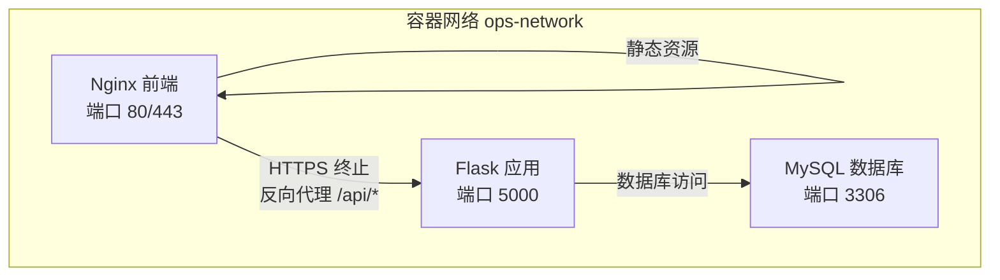
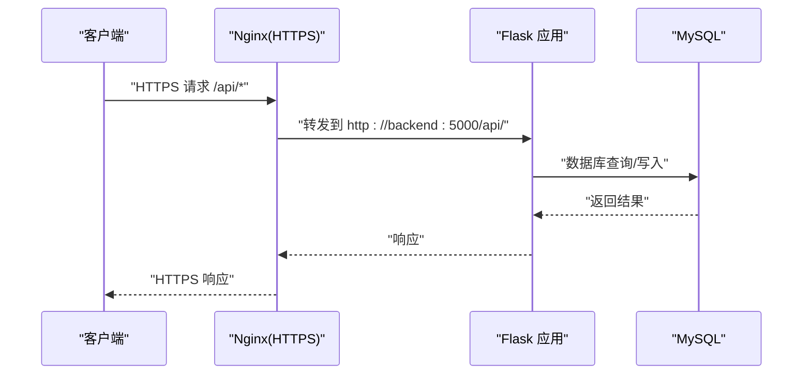
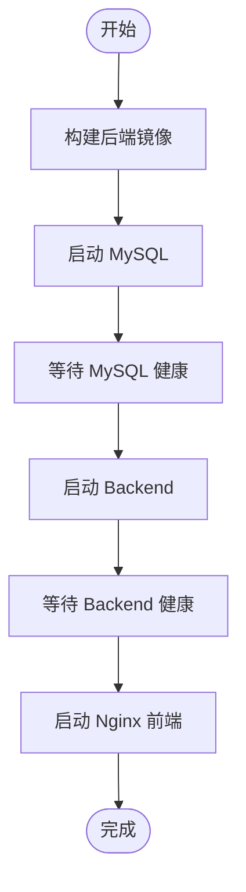
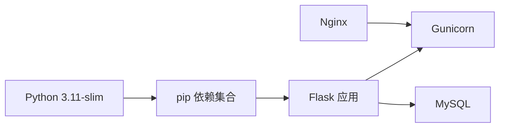

# 部署发布

<cite>
**本文引用的文件**
- [Dockerfile](file://backend/Dockerfile)
- [docker-compose.yml](file://docker-compose.yml)
- [nginx.conf](file://nginx.conf)
- [run.py](file://backend/run.py)
- [config.py](file://backend/app/config.py)
- [__init__.py](file://backend/app/__init__.py)
- [requirements.txt](file://backend/requirements.txt)
- [init_db.py](file://backend/init_db.py)
</cite>

## 目录
1. [简介](#简介)
2. [项目结构](#项目结构)
3. [核心组件](#核心组件)
4. [架构总览](#架构总览)
5. [详细组件分析](#详细组件分析)
6. [依赖分析](#依赖分析)
7. [性能考虑](#性能考虑)
8. [故障排查指南](#故障排查指南)
9. [结论](#结论)
10. [附录](#附录)

## 简介
本文件面向OPS项目的部署与发布流程，覆盖发布前准备（版本号管理、变更日志更新、环境配置检查）、部署流程（Docker镜像构建、容器编排、服务启动、健康检查）、发布策略（蓝绿部署、滚动更新、回滚机制）、生产环境部署指南（环境变量、数据库迁移、文件权限）、发布后验证与监控、以及CI/CD流水线配置与自动化最佳实践。文档严格基于仓库中的实际配置与实现，确保可落地、可追溯。

## 项目结构
OPS采用前后端分离架构，后端为Flask应用，通过Gunicorn提供WSGI服务；Nginx作为反向代理，负责HTTPS终止与静态资源分发；MySQL提供持久化存储；Compose统一编排三者，并内置健康检查与依赖顺序控制。

图表来源
- [docker-compose.yml:9-108](file://docker-compose.yml#L9-L108)
- [nginx.conf:1-76](file://nginx.conf#L1-L76)

章节来源
- [docker-compose.yml:1-108](file://docker-compose.yml#L1-108)
- [nginx.conf:1-76](file://nginx.conf#L1-76)

## 核心组件
- 后端应用（Flask + Gunicorn）
  - 运行入口与配置加载：应用通过工厂函数创建Flask实例，加载环境变量配置，注册蓝图与数据库连接钩子，并在启动阶段进行数据库连通性预检与Schema校验。
  - 端口与监听：默认监听0.0.0.0:5000，由Gunicorn承载。
- 反向代理（Nginx）
  - HTTP重定向至HTTPS；/api前缀反代至后端；静态资源缓存与安全头配置。
- 数据库（MySQL）
  - 提供持久化存储，支持健康检查与数据初始化脚本。
- 配置与环境变量
  - 通过环境变量驱动应用行为，如密钥、数据库连接、CORS、监控集成、定时任务等。

章节来源
- [run.py:1-8](file://backend/run.py#L1-8)
- [config.py:10-58](file://backend/app/config.py#L10-58)
- [__init__.py:28-114](file://backend/app/__init__.py#L28-114)
- [docker-compose.yml:30-82](file://docker-compose.yml#L30-82)
- [nginx.conf:10-76](file://nginx.conf#L10-76)

## 架构总览
下图展示从客户端到后端API的完整链路，以及Nginx的HTTPS终止与反向代理行为。

图表来源
- [docker-compose.yml:84-100](file://docker-compose.yml#L84-100)
- [nginx.conf:50-65](file://nginx.conf#L50-65)
- [__init__.py:88-111](file://backend/app/__init__.py#L88-111)

## 详细组件分析

### 发布前准备
- 版本号管理
  - 后端根路由返回版本标识，可用于发布版本标记与追踪。
  - 建议在CI中以标签或制品元数据形式固化版本号，结合根路由版本字段进行一致性校验。
- 变更日志更新
  - 建议在发布分支中维护变更日志，记录功能、修复、安全与兼容性变更，便于回溯与审计。
- 环境配置检查
  - 关键环境变量必须在生产环境显式设置，且不得使用默认值。检查清单：
    - 密钥类：SECRET_KEY、JWT_SECRET_KEY、DATA_ENCRYPTION_KEY
    - 数据库：DB_HOST、DB_PORT、DB_USER、DB_PASSWORD、DB_NAME
    - CORS：CORS_ORIGINS、CORS_ALLOW_ALL
    - 安全与监控：WECHAT_WEBHOOK_URL、GRAFANA_URL、GRAFANA_DASHBOARDS
    - 定时任务：CERT_AUTO_CHECK_CRON、DOMAIN_AUTO_NOTIFY_CRON
    - 其他：FLASK_DEBUG=false、ADMIN_PASSWORD（初始化管理员）

章节来源
- [__init__.py:50-58](file://backend/app/__init__.py#L50-58)
- [config.py:10-58](file://backend/app/config.py#L10-58)
- [docker-compose.yml:36-60](file://docker-compose.yml#L36-60)

### 部署流程
- Docker镜像构建
  - 基础镜像：Python 3.11 slim
  - 系统依赖：gcc、default-libmysqlclient-dev、pkg-config
  - 依赖安装：pip安装requirements.txt
  - 工作目录与端口：/app，暴露5000
  - CMD：Gunicorn以1个worker、8线程启动，超时120秒，日志输出至标准流
- 容器编排与启动顺序
  - MySQL → Backend → Frontend（Nginx）
  - Backend依赖MySQL健康；Frontend依赖Backend健康
- 健康检查
  - MySQL：mysqladmin ping
  - Backend：访问本地根路径（/）进行探活
  - Nginx：由上游健康状态间接保障

图表来源
- [Dockerfile:1-36](file://backend/Dockerfile#L1-L36)
- [docker-compose.yml:30-100](file://docker-compose.yml#L30-100)

章节来源
- [Dockerfile:1-36](file://backend/Dockerfile#L1-36)
- [docker-compose.yml:30-100](file://docker-compose.yml#L30-100)

### 发布策略
- 蓝绿部署
  - 通过两套完全相同的后端服务（不同容器名/端口或镜像标签）实现切换；Nginx指向当前“绿”服务，切换时将流量切至“蓝”，旧版本在健康检查通过后再停止。
- 滚动更新
  - 在Compose中逐个重启容器，配合健康检查与超时参数，确保平滑过渡。
- 回滚机制
  - 通过镜像标签回滚至上一个稳定版本；若涉及数据库结构变更，需同步回滚迁移脚本或执行逆向迁移。

章节来源
- [docker-compose.yml:35-82](file://docker-compose.yml#L35-82)

### 生产环境部署指南
- 环境变量配置
  - 必须在生产环境显式设置以下变量（示例来源于Compose文件注释与配置读取逻辑）：
    - SECRET_KEY、JWT_SECRET_KEY、JWT_EXPIRATION_HOURS
    - DB_HOST、DB_PORT、DB_USER、DB_PASSWORD、DB_NAME
    - CORS_ORIGINS、CORS_ALLOW_ALL
    - DATA_ENCRYPTION_KEY、OPS_DEV_ENCRYPTION_FALLBACK
    - WECHAT_WEBHOOK_URL、SSL_CHECK_TIMEOUT、SSL_WARNING_DAYS、DOMAIN_WARNING_DAYS
    - CERT_AUTO_CHECK_CRON、DOMAIN_AUTO_NOTIFY_CRON
    - GRAFANA_URL、GRAFANA_DASHBOARDS
    - ADMIN_PASSWORD（用于初始化管理员）
  - 注意：FLASK_DEBUG必须为false；CORS_ALLOW_ALL建议为false。
- 数据库迁移与初始化
  - 启动后端会进行数据库连通性预检与Schema校验；同时提供初始化脚本，用于创建数据库、表结构、默认字典数据与管理员账户。
  - 建议在首次部署时先运行初始化脚本，确保数据库结构完整。
- 文件权限与挂载
  - 后端上传目录挂载至宿主机，需确保容器内用户对挂载目录具有读写权限。
  - SSL证书目录挂载至Nginx，需保证证书文件存在且权限正确。

章节来源
- [config.py:10-58](file://backend/app/config.py#L10-58)
- [docker-compose.yml:36-66](file://docker-compose.yml#L36-66)
- [init_db.py:24-427](file://backend/init_db.py#L24-427)

### 发布后验证与监控
- 功能验证
  - 访问根路径确认服务可用；调用关键API接口验证业务功能。
- 健康检查
  - Backend健康检查通过后方可对外提供服务；可结合外部探针进行二次验证。
- 监控与告警
  - 集成Grafana仪表盘；可通过WECHAT_WEBHOOK_URL配置企业微信告警。
- 日志
  - 应用日志输出至标准错误流，便于容器日志收集与分析。

章节来源
- [docker-compose.yml:71-82](file://docker-compose.yml#L71-82)
- [__init__.py:10-26](file://backend/app/__init__.py#L10-26)
- [nginx.conf:10-25](file://nginx.conf#L10-25)

### CI/CD流水线与自动化最佳实践
- 构建阶段
  - 基于Dockerfile构建后端镜像；缓存pip依赖层以提升速度。
- 测试阶段
  - 在容器内运行单元测试与集成测试；数据库使用临时实例或专用测试库。
- 发布阶段
  - 推送镜像至镜像仓库；使用Compose或Kubernetes进行部署；按策略执行滚动/蓝绿发布。
- 回滚与审计
  - 保留最近N个版本镜像；发布记录与变更日志纳入制品库；回滚时明确责任人与审批流程。
- 安全与合规
  - 使用只读根文件系统、最小权限原则；定期扫描镜像漏洞；密钥与敏感配置通过Secret管理。

## 依赖分析
- 运行时依赖
  - Flask、Flask-CORS、Gunicorn、PyMySQL、APScheduler、OpenPyXL、Cryptography、bcrypt、Paramiko、阿里云相关SDK等。
- 镜像构建依赖
  - Python 3.11-slim基础镜像；系统级编译工具与MySQL客户端开发包。
- 组件耦合
  - 后端通过环境变量与数据库交互；Nginx仅作为反向代理；MySQL为单点依赖，建议在生产中引入高可用方案。

图表来源
- [requirements.txt:1-17](file://backend/requirements.txt#L1-17)
- [Dockerfile:14-23](file://backend/Dockerfile#L14-23)

章节来源
- [requirements.txt:1-17](file://backend/requirements.txt#L1-17)
- [Dockerfile:14-23](file://backend/Dockerfile#L14-23)

## 性能考虑
- 进程与线程模型
  - Gunicorn采用1个worker、8线程模型，避免APScheduler在多进程中重复注册定时任务。
- 超时与并发
  - Gunicorn超时120秒；Nginx代理缓冲与超时参数需根据业务吞吐调整。
- 缓存与静态资源
  - 对JS/CSS/图片等静态资源设置长缓存与immutable标志，减少带宽占用。
- 数据库连接
  - 合理设置连接池与查询超时；避免大事务与阻塞查询。

章节来源
- [Dockerfile:34-36](file://backend/Dockerfile#L34-36)
- [nginx.conf:44-48](file://nginx.conf#L44-48)

## 故障排查指南
- 后端无法启动
  - 检查密钥类环境变量是否设置；查看日志中数据库连接预检失败提示，核对DB_HOST、DB_PORT、DB_USER、DB_PASSWORD、DB_NAME。
- 健康检查失败
  - Backend健康检查依赖本地根路径可达；确认Gunicorn已启动且端口监听正常。
- 数据库初始化问题
  - 确认ADMIN_PASSWORD已设置；初始化脚本会插入默认字典数据与管理员账户。
- CORS跨域问题
  - 核对CORS_ORIGINS与CORS_ALLOW_ALL配置；生产环境建议显式列出来源而非使用通配符。
- SSL证书与HTTPS
  - 确保Nginx挂载了有效的证书与私钥；证书路径与权限正确。

章节来源
- [__init__.py:88-111](file://backend/app/__init__.py#L88-111)
- [docker-compose.yml:71-82](file://docker-compose.yml#L71-82)
- [init_db.py:273-283](file://backend/init_db.py#L273-283)
- [config.py:33-38](file://backend/app/config.py#L33-38)
- [nginx.conf:15-17](file://nginx.conf#L15-17)

## 结论
OPS的部署发布以Docker与Compose为核心，结合Nginx反向代理与MySQL数据库，形成清晰的三层架构。通过严格的环境变量管理、健康检查与初始化脚本，可在生产环境中实现稳定交付。建议在CI/CD中固化版本号、变更日志与发布策略，配合蓝绿/滚动发布与回滚机制，持续提升交付质量与风险控制能力。

## 附录
- 关键端口与服务
  - Nginx：80（HTTP重定向）、443（HTTPS）
  - Backend：5000
  - MySQL：3306
- 常用命令参考
  - 构建镜像：基于Dockerfile构建后端镜像
  - 启动服务：使用Compose启动MySQL、Backend、Nginx
  - 初始化数据库：运行初始化脚本创建表结构与默认数据

章节来源
- [docker-compose.yml:21-22](file://docker-compose.yml#L21-22)
- [docker-compose.yml:64-65](file://docker-compose.yml#L64-65)
- [docker-compose.yml:21-22](file://docker-compose.yml#L21-22)
- [init_db.py:24-427](file://backend/init_db.py#L24-427)