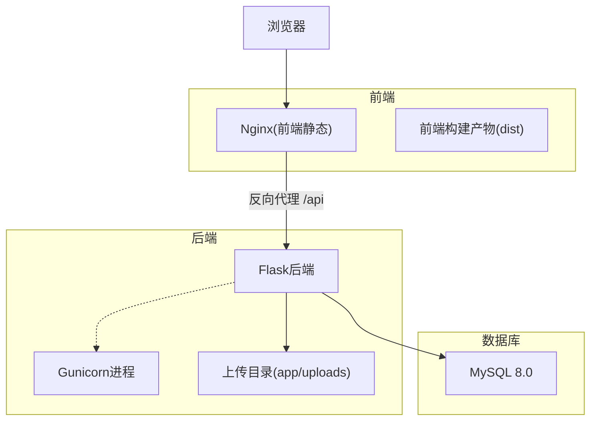
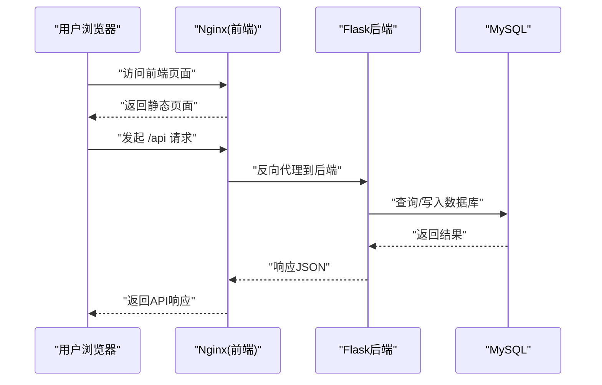
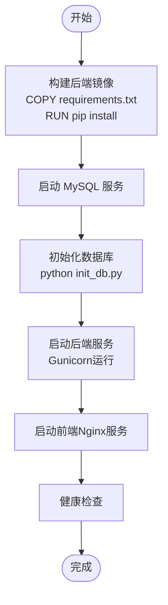
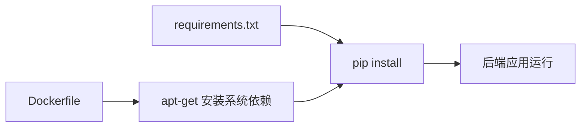

# 开发环境配置

<cite>
**本文引用的文件**
- [requirements.txt](file://backend/requirements.txt)
- [Dockerfile](file://backend/Dockerfile)
- [docker-compose.yml](file://docker-compose.yml)
- [config.py](file://backend/app/config.py)
- [run.py](file://backend/run.py)
- [init_db.py](file://backend/init_db.py)
- [nginx.conf](file://nginx.conf)
- [README.md](file://README.md)
</cite>

## 目录
1. [简介](#简介)
2. [项目结构](#项目结构)
3. [核心组件](#核心组件)
4. [架构总览](#架构总览)
5. [详细组件分析](#详细组件分析)
6. [依赖分析](#依赖分析)
7. [性能考虑](#性能考虑)
8. [故障排除指南](#故障排除指南)
9. [结论](#结论)
10. [附录](#附录)

## 简介
本文件面向OPS项目的开发者，提供从零搭建开发环境的完整指南，涵盖本地开发与Docker容器化两种方式，包括Python版本与操作系统兼容性、硬件配置建议、虚拟环境与依赖安装、数据库初始化、环境变量配置、容器化编排与数据卷挂载、IDE与编辑器推荐配置、开发工具链（Git、代码格式化、测试框架）以及常见问题与性能优化建议。

## 项目结构
OPS采用前后端分离架构，后端基于Flask，前端基于Vue 3，通过Nginx反向代理统一对外提供HTTP/HTTPS服务，数据库使用MySQL 8.0。Docker Compose负责服务编排，包含MySQL、后端Flask应用、Nginx前端三部分。

**图表来源**
- [docker-compose.yml:10-108](file://docker-compose.yml#L10-L108)
- [nginx.conf:1-76](file://nginx.conf#L1-L76)
- [Dockerfile:1-36](file://backend/Dockerfile#L1-L36)
- [config.py:16-24](file://backend/app/config.py#L16-L24)

**章节来源**
- [README.md:261-331](file://README.md#L261-L331)

## 核心组件
- 后端运行时与依赖
  - Python版本：容器基础镜像使用Python 3.11-slim，建议本地开发也使用Python 3.11以保持一致性。
  - Web服务器：生产使用Gunicorn（单worker多线程），开发可使用Flask内置服务器。
  - 依赖管理：通过requirements.txt声明，包含Flask、Flask-CORS、Gunicorn、PyMySQL、PyJWT、APScheduler、OpenPyXL、Cryptography、bcrypt、Paramiko及阿里云SDK等。
- 数据库
  - MySQL 8.0，使用PyMySQL驱动，字符集utf8mb4，排序规则utf8mb4_unicode_ci。
- 前端与反向代理
  - Nginx Alpine镜像，静态站点托管与/api反向代理，支持HTTP到HTTPS重定向。
- 配置管理
  - 后端通过环境变量注入配置，如数据库连接、JWT密钥、CORS、定时任务、Grafana集成等。

**章节来源**
- [requirements.txt:1-17](file://backend/requirements.txt#L1-L17)
- [Dockerfile:1-36](file://backend/Dockerfile#L1-L36)
- [docker-compose.yml:10-108](file://docker-compose.yml#L10-L108)
- [config.py:10-58](file://backend/app/config.py#L10-L58)
- [nginx.conf:1-76](file://nginx.conf#L1-L76)

## 架构总览
下图展示了从浏览器到后端API再到数据库的数据流与服务交互关系。

**图表来源**
- [nginx.conf:50-65](file://nginx.conf#L50-L65)
- [docker-compose.yml:84-100](file://docker-compose.yml#L84-L100)
- [config.py:16-24](file://backend/app/config.py#L16-L24)

## 详细组件分析

### 本地开发环境搭建
- 操作系统与硬件
  - 推荐Windows 10/11、macOS 10.15+、Linux发行版（Ubuntu 20.04+）。
  - 硬件建议：CPU双核以上、内存4GB起步（开发时建议8GB+）、磁盘空间20GB可用空间。
- Python版本与虚拟环境
  - 使用Python 3.11（与容器一致），创建虚拟环境并激活。
  - 安装依赖：pip install -r backend/requirements.txt。
- 环境变量与数据库初始化
  - 复制并修改环境变量模板，初始化数据库：python backend/init_db.py。
  - 启动后端开发服务器：python backend/run.py。
- 前端开发
  - 进入frontend目录，安装依赖后启动开发服务器，访问http://localhost:5173。

**章节来源**
- [README.md:209-247](file://README.md#L209-L247)
- [requirements.txt:1-17](file://backend/requirements.txt#L1-L17)
- [init_db.py:1-50](file://backend/init_db.py#L1-L50)
- [run.py:1-8](file://backend/run.py#L1-L8)

### Docker开发环境配置
- 镜像构建与服务编排
  - 后端镜像基于python:3.11-slim，安装系统依赖与Python依赖，暴露5000端口，使用Gunicorn运行。
  - docker-compose定义三个服务：mysql、backend、frontend，均使用自定义bridge网络。
- 环境变量与密钥
  - 在docker-compose.yml中设置数据库密码、Flask密钥、JWT密钥、数据加密密钥、CORS、定时任务、Grafana集成等。
  - 建议使用命令生成密钥并替换占位符。
- 数据卷挂载
  - 后端挂载上传目录，前端挂载dist与Nginx配置，持久化MySQL数据至命名卷。
- 健康检查与依赖顺序
  - backend依赖mysql健康检查通过，frontend依赖backend健康检查通过。
  - 后端健康检查通过HTTP探测本地API端点实现。

**图表来源**
- [Dockerfile:21-35](file://backend/Dockerfile#L21-L35)
- [docker-compose.yml:30-100](file://docker-compose.yml#L30-L100)
- [init_db.py:24-431](file://backend/init_db.py#L24-L431)

**章节来源**
- [Dockerfile:1-36](file://backend/Dockerfile#L1-L36)
- [docker-compose.yml:1-108](file://docker-compose.yml#L1-L108)
- [init_db.py:1-50](file://backend/init_db.py#L1-L50)

### IDE与编辑器配置推荐
- VS Code
  - 插件：Python、Pylance、ESLint、Vetur/Volar、EditorConfig、Bracket Pair Colorizer、GitLens。
  - Python格式化：black或autopep8，结合flake8/linting。
  - Vue开发：TypeScript + ESLint + Prettier，保存时自动格式化。
  - 调试：Python调试配置launch.json，后端使用Flask调试，前端使用Vite调试。
- PyCharm
  - 使用Python 3.11解释器，启用项目结构识别Flask蓝本。
  - 配置Flask运行配置，指定环境变量与工作目录。
  - 使用内置ESLint/Prettier或通过External Tools集成前端格式化。
- 通用设置
  - 编码：UTF-8。
  - 行尾：LF（Unix）。
  - 缩进：Python 4空格，JavaScript/TypeScript 2空格。
  - 最大行宽：120。

[本节为通用实践建议，无需特定文件引用]

### 开发工具链配置
- Git
  - 提交信息采用语义化格式，分支策略：feature/、fix/、docs/等前缀。
  - 使用.pre-commit钩子（可选）：prettier、eslint、black等。
- 代码格式化与Linting
  - Python：black + flake8，或autopep8 + pycodestyle。
  - JavaScript/TypeScript：ESLint + Prettier，Vue文件使用Vetur/Volar。
  - 在IDE中配置保存时自动格式化。
- 测试框架
  - 后端：pytest + Flask Test Client，按模块编写单元测试。
  - 前端：Vitest或Jest，结合@vue/test-utils。
  - 建议：为API接口、工具函数、定时任务编写测试用例。

[本节为通用实践建议，无需特定文件引用]

## 依赖分析
后端依赖通过requirements.txt集中管理，Dockerfile中按顺序安装系统依赖与Python依赖，确保镜像构建稳定。

**图表来源**
- [requirements.txt:1-17](file://backend/requirements.txt#L1-L17)
- [Dockerfile:14-23](file://backend/Dockerfile#L14-L23)

**章节来源**
- [requirements.txt:1-17](file://backend/requirements.txt#L1-L17)
- [Dockerfile:14-23](file://backend/Dockerfile#L14-L23)

## 性能考虑
- 后端并发模型
  - 容器中使用Gunicorn单worker多线程（1个worker×8线程），避免APScheduler在多进程场景重复注册定时任务。
- 数据库性能
  - 使用utf8mb4字符集与合适索引，避免全表扫描；合理设置连接池与查询超时。
- 前端静态资源
  - Nginx开启缓存与压缩，静态资源设置长缓存；HTML采用SPA路由回退。
- 网络与代理
  - Nginx代理缓冲区与超时参数根据业务调整；API请求尽量合并与去抖。
- 日志与监控
  - 后端日志输出到标准输出，便于容器日志收集；结合Grafana仪表盘监控。

**章节来源**
- [Dockerfile:34-35](file://backend/Dockerfile#L34-L35)
- [nginx.conf:44-65](file://nginx.conf#L44-L65)
- [config.py:42-48](file://backend/app/config.py#L42-L48)

## 故障排除指南
- 数据库连接失败
  - 检查MySQL服务状态与健康检查；确认DB_HOST、DB_PORT、DB_USER、DB_PASSWORD一致。
- 前端页面空白
  - 确认frontend/dist存在；若缺失则重新构建；重启frontend容器。
- CORS跨域错误
  - 在docker-compose.yml中正确配置CORS_ORIGINS与CORS_ALLOW_ALL。
- SSL检测失败
  - 调整SSL_CHECK_TIMEOUT；检查后端网络连通性与目标域名可达性。
- 定时任务不执行
  - 查看后端日志中scheduler相关内容；核对Cron表达式；必要时手动触发。
- 企业微信通知失败
  - 校验WECHAT_WEBHOOK_URL；使用curl测试Webhook连通性。

**章节来源**
- [docker-compose.yml:36-60](file://docker-compose.yml#L36-L60)
- [README.md:661-748](file://README.md#L661-L748)

## 结论
通过本指南，您可以在本地或容器环境中快速搭建OPS项目的开发环境。建议优先使用Docker Compose进行开发，以获得与生产一致的运行时环境；同时在本地使用IDE的调试与格式化能力提升开发效率。遇到问题时，可依据故障排除指南逐项排查。

## 附录
- 快速启动（Docker方式）
  - 克隆项目 → docker-compose up -d → docker exec -it ops-backend python init_db.py → 访问http://localhost与http://localhost:5000/api。
- 快速启动（本地方式）
  - cd backend → 创建并激活虚拟环境 → pip install -r requirements.txt → cp .env.example .env → python init_db.py → python run.py → cd ../frontend → npm install → npm run dev。

**章节来源**
- [README.md:183-259](file://README.md#L183-L259)