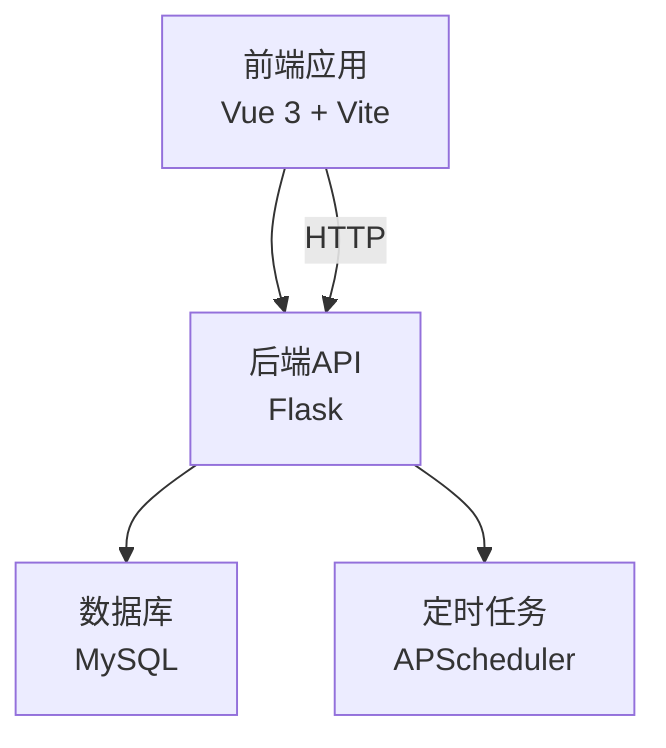
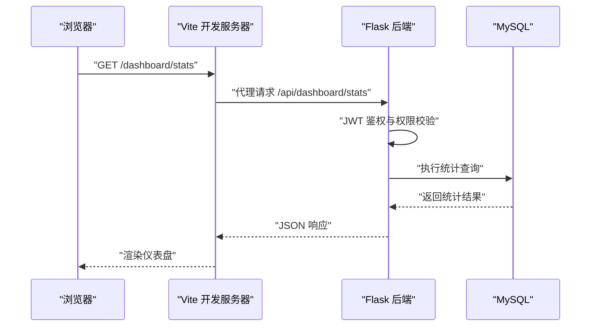
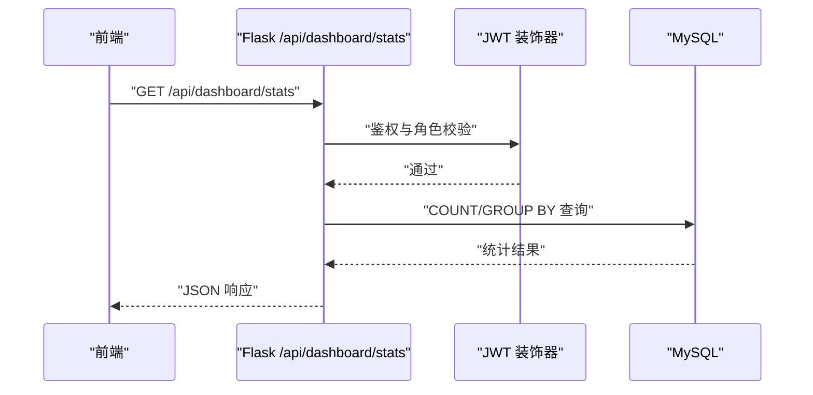
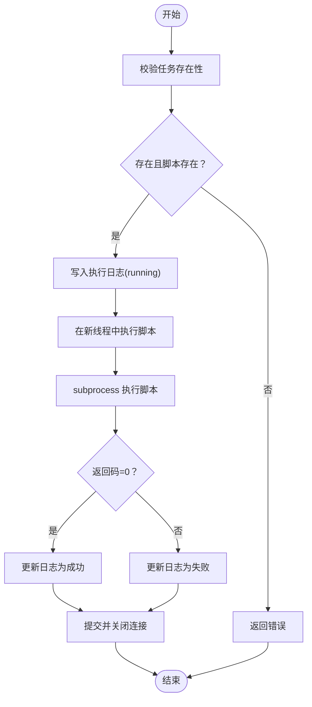
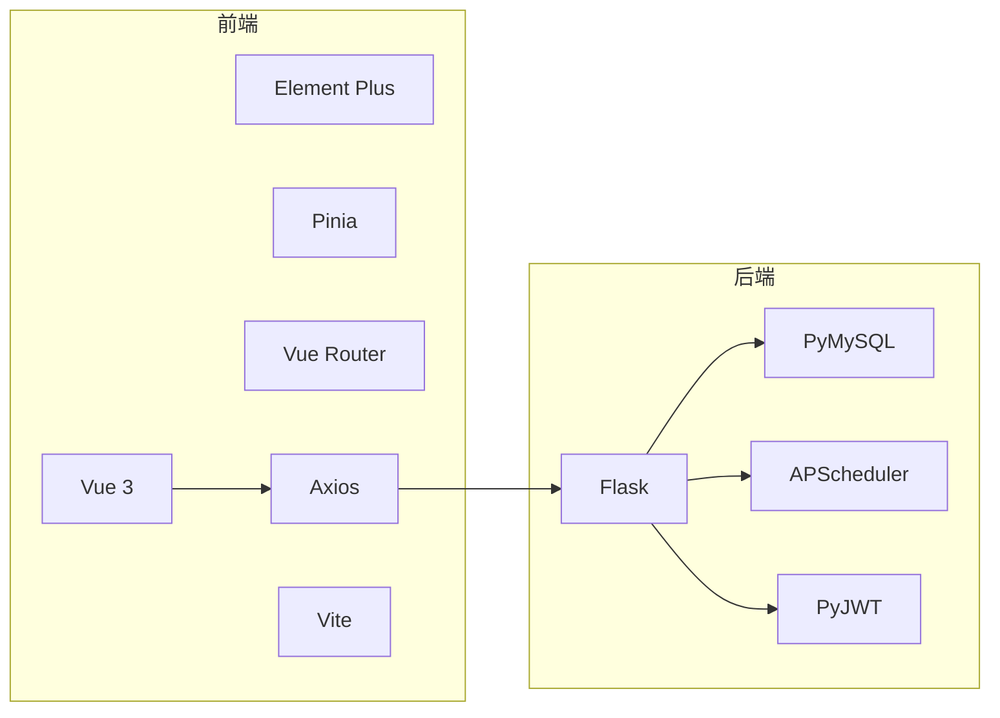

# 性能优化

<cite>
**本文引用的文件**
- [backend/app/config.py](file://backend/app/config.py)
- [backend/app/extensions.py](file://backend/app/extensions.py)
- [backend/app/utils/db.py](file://backend/app/utils/db.py)
- [backend/app/utils/scheduler.py](file://backend/app/utils/scheduler.py)
- [backend/app/utils/decorators.py](file://backend/app/utils/decorators.py)
- [backend/app/api/dashboard.py](file://backend/app/api/dashboard.py)
- [backend/app/api/tasks.py](file://backend/app/api/tasks.py)
- [frontend/src/main.js](file://frontend/src/main.js)
- [frontend/vite.config.js](file://frontend/vite.config.js)
- [frontend/src/router/index.js](file://frontend/src/router/index.js)
- [frontend/src/stores/user.js](file://frontend/src/stores/user.js)
- [frontend/src/views/Dashboard.vue](file://frontend/src/views/Dashboard.vue)
- [frontend/src/api/dashboard.js](file://frontend/src/api/dashboard.js)
- [frontend/package.json](file://frontend/package.json)
- [backend/requirements.txt](file://backend/requirements.txt)
</cite>

## 目录
1. [简介](#简介)
2. [项目结构](#项目结构)
3. [核心组件](#核心组件)
4. [架构总览](#架构总览)
5. [详细组件分析](#详细组件分析)
6. [依赖分析](#依赖分析)
7. [性能考虑](#性能考虑)
8. [故障排查指南](#故障排查指南)
9. [结论](#结论)
10. [附录](#附录)

## 简介
本指南聚焦于该云平台项目的性能优化最佳实践，覆盖前端与后端两大侧重点。前端方面，围绕组件与路由懒加载、图片优化与缓存策略展开；后端方面，围绕数据库查询优化、索引设计、连接池配置、定时任务优化、API 响应时间与并发处理、内存使用等维度给出可操作建议，并提供性能监控指标、测试方法与问题排查技巧。

## 项目结构
该项目采用前后端分离架构：
- 前端基于 Vue 3 + Vite，使用 Element Plus、Pinia、Vue Router 构建界面与状态管理。
- 后端基于 Flask，提供 REST API，使用 APScheduler 进行定时任务调度，pymysql 连接 MySQL 数据库。

图表来源
- [frontend/src/main.js:1-23](file://frontend/src/main.js#L1-L23)
- [frontend/vite.config.js:1-17](file://frontend/vite.config.js#L1-L17)
- [backend/app/api/dashboard.py:1-86](file://backend/app/api/dashboard.py#L1-L86)
- [backend/app/utils/db.py:1-17](file://backend/app/utils/db.py#L1-L17)
- [backend/app/utils/scheduler.py:1-249](file://backend/app/utils/scheduler.py#L1-L249)

章节来源
- [frontend/src/main.js:1-23](file://frontend/src/main.js#L1-L23)
- [frontend/vite.config.js:1-17](file://frontend/vite.config.js#L1-L17)
- [backend/app/config.py:1-21](file://backend/app/config.py#L1-L21)

## 核心组件
- 前端应用入口与插件注册：应用初始化、路由、状态管理与 UI 组件库注册。
- 路由与鉴权：基于 Vue Router 的路由懒加载与全局前置守卫。
- 状态管理：Pinia Store 管理登录态与用户信息。
- API 层：仪表盘统计与定时任务相关接口。
- 后端工具：数据库连接封装、定时任务调度器、JWT 权限装饰器。
- 开发与构建：Vite 反向代理、开发服务器配置。

章节来源
- [frontend/src/main.js:1-23](file://frontend/src/main.js#L1-L23)
- [frontend/src/router/index.js:1-61](file://frontend/src/router/index.js#L1-L61)
- [frontend/src/stores/user.js:1-41](file://frontend/src/stores/user.js#L1-L41)
- [frontend/src/views/Dashboard.vue:1-307](file://frontend/src/views/Dashboard.vue#L1-L307)
- [frontend/src/api/dashboard.js:1-6](file://frontend/src/api/dashboard.js#L1-L6)
- [backend/app/api/dashboard.py:1-86](file://backend/app/api/dashboard.py#L1-L86)
- [backend/app/api/tasks.py:1-458](file://backend/app/api/tasks.py#L1-L458)
- [backend/app/utils/db.py:1-17](file://backend/app/utils/db.py#L1-L17)
- [backend/app/utils/scheduler.py:1-249](file://backend/app/utils/scheduler.py#L1-L249)
- [backend/app/utils/decorators.py:1-95](file://backend/app/utils/decorators.py#L1-L95)

## 架构总览
前端通过 Axios 发起请求，经由 Vite 开发服务器代理转发至 Flask 后端。后端接口完成鉴权与业务处理，必要时访问数据库或调度定时任务。

图表来源
- [frontend/vite.config.js:1-17](file://frontend/vite.config.js#L1-L17)
- [frontend/src/api/dashboard.js:1-6](file://frontend/src/api/dashboard.js#L1-L6)
- [backend/app/api/dashboard.py:1-86](file://backend/app/api/dashboard.py#L1-L86)
- [backend/app/utils/decorators.py:1-95](file://backend/app/utils/decorators.py#L1-L95)
- [backend/app/utils/db.py:1-17](file://backend/app/utils/db.py#L1-L17)

## 详细组件分析

### 前端性能优化策略
- 组件懒加载与路由懒加载
  - 路由按需加载：在路由定义中使用动态导入实现视图组件懒加载，减少首屏资源体积与解析时间。
  - 适用范围：登录页、仪表盘、服务器、服务、账户、应用、证书、记录、任务、用户管理等视图。
  - 章节来源
    - [frontend/src/router/index.js:1-61](file://frontend/src/router/index.js#L1-L61)

- 图片优化与缓存策略
  - 静态资源：Vite 构建默认对静态资源进行哈希命名与压缩，建议结合 CDN 与浏览器缓存头提升命中率。
  - 图标与主题：Element Plus 图标按需引入，避免全量打包。
  - 章节来源
    - [frontend/src/main.js:1-23](file://frontend/src/main.js#L1-L23)
    - [frontend/package.json:1-24](file://frontend/package.json#L1-L24)

- 缓存与状态持久化
  - 登录态与用户信息本地存储：使用 Pinia Store 与 localStorage 缓存 token 与用户信息，减少重复请求与二次鉴权成本。
  - 章节来源
    - [frontend/src/stores/user.js:1-41](file://frontend/src/stores/user.js#L1-L41)

- 请求与渲染优化
  - 首屏渲染：Dashboard 页面在 mounted 时发起一次统计请求，建议增加骨架屏与分页/虚拟滚动以优化大数据集展示。
  - 章节来源
    - [frontend/src/views/Dashboard.vue:138-167](file://frontend/src/views/Dashboard.vue#L138-L167)

- 构建与开发体验
  - Vite 代理：开发阶段通过反向代理将 /api 前缀转发至后端，便于联调与跨域处理。
  - 章节来源
    - [frontend/vite.config.js:1-17](file://frontend/vite.config.js#L1-L17)

### 后端性能优化策略
- 数据库查询优化与连接池
  - 连接复用：当前使用每次请求创建连接的方式，建议引入连接池（如 PyMySQL 的连接池参数或 SQLAlchemy 池）降低连接开销。
  - 查询优化：仪表盘接口存在多条 COUNT 与 GROUP BY 查询，建议评估是否合并为一次性聚合查询或引入物化视图/缓存中间表。
  - 索引设计：为常用过滤列（如 change_records.seq_no、domains_certs.status、servers.env_type）建立合适索引。
  - 章节来源
    - [backend/app/utils/db.py:1-17](file://backend/app/utils/db.py#L1-L17)
    - [backend/app/api/dashboard.py:1-86](file://backend/app/api/dashboard.py#L1-L86)

- 定时任务优化
  - 线程模型：调度器回调在独立线程中执行，避免阻塞调度器主线程；但大量并发任务仍可能造成线程风暴，建议限制并发度或引入线程池。
  - 超时与异常：脚本执行设置超时保护，防止僵尸进程；建议增加重试策略与告警通知。
  - 章节来源
    - [backend/app/utils/scheduler.py:1-249](file://backend/app/utils/scheduler.py#L1-L249)
    - [backend/app/api/tasks.py:1-458](file://backend/app/api/tasks.py#L1-L458)

- API 响应时间与并发处理
  - 鉴权链路：JWT 鉴权与角色校验在装饰器中完成，建议在高并发场景下缓存用户角色信息，减少重复解码与校验成本。
  - 并发控制：对高耗时接口（如手动执行任务）建议引入队列与异步处理，避免阻塞请求线程。
  - 章节来源
    - [backend/app/utils/decorators.py:1-95](file://backend/app/utils/decorators.py#L1-L95)
    - [backend/app/api/tasks.py:309-421](file://backend/app/api/tasks.py#L309-L421)

- 内存使用优化
  - 临时对象：接口中创建的游标与连接需确保 finally 分支关闭，避免连接泄漏导致内存增长。
  - 大数据集：仪表盘接口返回固定上限记录，建议配合分页或懒加载，避免一次性传输过多数据。
  - 章节来源
    - [backend/app/api/dashboard.py:1-86](file://backend/app/api/dashboard.py#L1-L86)
    - [backend/app/api/tasks.py:33-136](file://backend/app/api/tasks.py#L33-L136)

### 关键流程图与时序图

#### 仪表盘统计接口时序

图表来源
- [frontend/src/api/dashboard.js:1-6](file://frontend/src/api/dashboard.js#L1-L6)
- [backend/app/api/dashboard.py:1-86](file://backend/app/api/dashboard.py#L1-L86)
- [backend/app/utils/decorators.py:1-95](file://backend/app/utils/decorators.py#L1-L95)
- [backend/app/utils/db.py:1-17](file://backend/app/utils/db.py#L1-L17)

#### 定时任务执行流程（手动触发）

图表来源
- [backend/app/api/tasks.py:309-421](file://backend/app/api/tasks.py#L309-L421)
- [backend/app/utils/scheduler.py:32-144](file://backend/app/utils/scheduler.py#L32-L144)

## 依赖分析
- 前端依赖：Vue 3、Element Plus、Pinia、Vue Router、Axios、Vite。
- 后端依赖：Flask、Flask-CORS、PyMySQL、PyJWT、APScheduler、Werkzeug、OpenPyXL、Cryptography。

图表来源
- [frontend/package.json:1-24](file://frontend/package.json#L1-L24)
- [backend/requirements.txt:1-9](file://backend/requirements.txt#L1-L9)

章节来源
- [frontend/package.json:1-24](file://frontend/package.json#L1-L24)
- [backend/requirements.txt:1-9](file://backend/requirements.txt#L1-L9)

## 性能考虑
- 前端
  - 路由与组件懒加载：减少首屏 JS 体积，提升 TTI。
  - 图片与静态资源：CDN 缓存、Gzip/Brotli 压缩、合理缓存头。
  - 状态与缓存：本地存储与 Pinia 缓存，减少重复请求。
  - 渲染优化：大数据表格分页/虚拟滚动、骨架屏、防抖/节流。
- 后端
  - 数据库：连接池、索引、查询合并、分页、只读副本。
  - 定时任务：并发限制、超时与重试、健康检查与告警。
  - API：鉴权缓存、限流、批量接口、响应压缩。
  - 内存：及时释放连接与游标、避免大对象常驻、定期 GC。

## 故障排查指南
- 鉴权失败
  - 确认请求头 Authorization 格式为 Bearer Token，Token 未过期且签名有效。
  - 章节来源
    - [backend/app/utils/decorators.py:20-56](file://backend/app/utils/decorators.py#L20-L56)

- 接口超时或慢查询
  - 检查数据库慢查询日志，确认 COUNT/GROUP BY 是否有合适索引。
  - 章节来源
    - [backend/app/api/dashboard.py:20-86](file://backend/app/api/dashboard.py#L20-L86)
    - [backend/app/utils/db.py:1-17](file://backend/app/utils/db.py#L1-L17)

- 定时任务执行异常
  - 查看任务日志表与调度器线程状态，确认脚本路径、权限与超时设置。
  - 章节来源
    - [backend/app/api/tasks.py:309-421](file://backend/app/api/tasks.py#L309-L421)
    - [backend/app/utils/scheduler.py:32-144](file://backend/app/utils/scheduler.py#L32-L144)

- 前端路由跳转异常
  - 检查路由守卫逻辑与本地存储 token、userInfo。
  - 章节来源
    - [frontend/src/router/index.js:35-58](file://frontend/src/router/index.js#L35-L58)
    - [frontend/src/stores/user.js:1-41](file://frontend/src/stores/user.js#L1-L41)

## 结论
通过在前端实施路由与组件懒加载、图片与静态资源优化、状态缓存与渲染优化，在后端引入数据库连接池与索引优化、定时任务并发控制与超时保护、API 鉴权缓存与限流，以及完善的性能监控与告警机制，可以显著提升系统的整体性能与用户体验。

## 附录
- 性能监控指标建议
  - 前端：首屏时间(TTFB/FCP/LCP)、交互延迟(FID)、路由切换时间、缓存命中率。
  - 后端：RPS、P95/P99 延迟、数据库 QPS/慢查询、连接池利用率、CPU/内存使用率、定时任务执行时延与失败率。
- 性能测试方法
  - 前端：Lighthouse、WebPageTest、Browser DevTools Performance 面板。
  - 后端：wrk/JMeter、sysbench、慢查询日志分析。
- 瓶颈分析步骤
  - 前端：Network 面板定位大资源与慢请求，Performance 面板定位主线程阻塞。
  - 后端：APM 工具火焰图、数据库 EXPLAIN、连接池等待队列与拒绝次数。