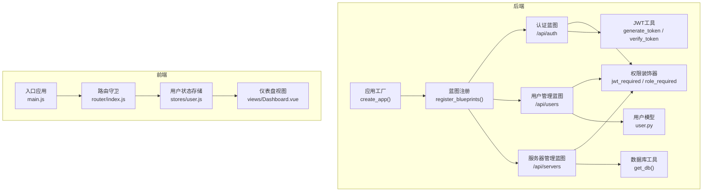
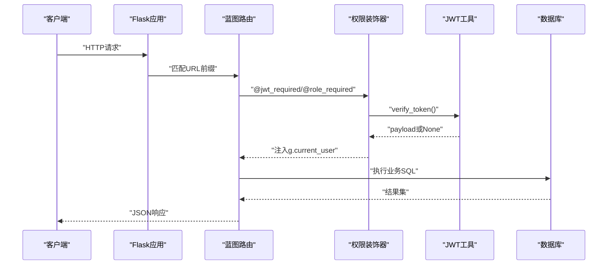
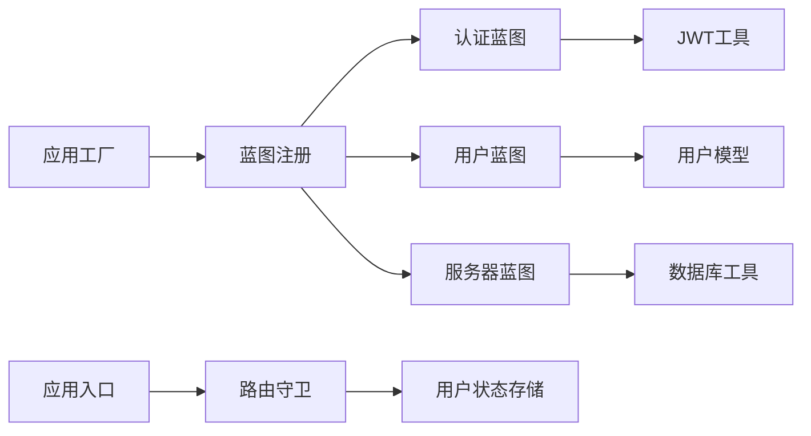

# 扩展开发

<cite>
**本文引用的文件**
- [backend/app/__init__.py](file://backend/app/__init__.py)
- [backend/app/config.py](file://backend/app/config.py)
- [backend/run.py](file://backend/run.py)
- [backend/app/extensions.py](file://backend/app/extensions.py)
- [backend/app/utils/decorators.py](file://backend/app/utils/decorators.py)
- [backend/app/utils/auth.py](file://backend/app/utils/auth.py)
- [backend/app/utils/db.py](file://backend/app/utils/db.py)
- [backend/app/models/user.py](file://backend/app/models/user.py)
- [backend/app/api/auth.py](file://backend/app/api/auth.py)
- [backend/app/api/users.py](file://backend/app/api/users.py)
- [backend/app/api/servers.py](file://backend/app/api/servers.py)
- [frontend/src/main.js](file://frontend/src/main.js)
- [frontend/src/router/index.js](file://frontend/src/router/index.js)
- [frontend/src/stores/user.js](file://frontend/src/stores/user.js)
- [frontend/src/views/Dashboard.vue](file://frontend/src/views/Dashboard.vue)
</cite>

## 目录
1. [简介](#简介)
2. [项目结构](#项目结构)
3. [核心组件](#核心组件)
4. [架构总览](#架构总览)
5. [详细组件分析](#详细组件分析)
6. [依赖分析](#依赖分析)
7. [性能考虑](#性能考虑)
8. [故障排查指南](#故障排查指南)
9. [结论](#结论)
10. [附录](#附录)

## 简介
本指南面向希望在现有云运维平台基础上进行功能扩展与二次开发的工程师。内容覆盖后端API蓝图扩展、前端组件与路由扩展、数据库模型扩展、插件系统（装饰器扩展、中间件开发、第三方服务集成）、权限控制扩展（自定义权限验证、角色扩展、资源访问控制），并提供具体扩展示例与最佳实践。

## 项目结构
- 后端采用Flask框架，通过应用工厂模式创建应用实例，统一注册蓝图，集中初始化定时任务与CORS跨域策略。
- 前端采用Vue 3 + Pinia + Vue Router，Element Plus作为UI框架，路由守卫实现基本鉴权与页面级权限控制。
- 数据层通过独立的数据库工具模块提供连接，模型层封装用户相关数据库操作。

**图表来源**
- [backend/app/__init__.py:6-34](file://backend/app/__init__.py#L6-L34)
- [backend/app/__init__.py:37-62](file://backend/app/__init__.py#L37-L62)
- [backend/app/utils/decorators.py:9-95](file://backend/app/utils/decorators.py#L9-L95)
- [backend/app/utils/auth.py:11-83](file://backend/app/utils/auth.py#L11-L83)
- [backend/app/utils/db.py:5-17](file://backend/app/utils/db.py#L5-L17)
- [backend/app/models/user.py:1-183](file://backend/app/models/user.py#L1-L183)
- [frontend/src/main.js:1-23](file://frontend/src/main.js#L1-L23)
- [frontend/src/router/index.js:35-58](file://frontend/src/router/index.js#L35-L58)
- [frontend/src/stores/user.js:1-41](file://frontend/src/stores/user.js#L1-L41)
- [frontend/src/views/Dashboard.vue:129-158](file://frontend/src/views/Dashboard.vue#L129-L158)

**章节来源**
- [backend/app/__init__.py:6-34](file://backend/app/__init__.py#L6-L34)
- [backend/app/__init__.py:37-62](file://backend/app/__init__.py#L37-L62)
- [frontend/src/main.js:1-23](file://frontend/src/main.js#L1-L23)
- [frontend/src/router/index.js:35-58](file://frontend/src/router/index.js#L35-L58)

## 核心组件
- 应用工厂与蓝图注册：通过应用工厂集中配置CORS、注册蓝图、初始化定时任务，便于扩展新的API模块。
- 权限控制：基于JWT的认证装饰器与角色权限装饰器，支持在蓝图路由上叠加使用。
- 认证与令牌：JWT生成与校验工具，配合后端装饰器注入用户上下文。
- 数据库访问：统一的数据库连接工具，便于在新模型中复用。
- 前端路由与状态：路由守卫实现基础鉴权与管理员页面保护；Pinia状态管理持久化用户信息。

**章节来源**
- [backend/app/__init__.py:6-34](file://backend/app/__init__.py#L6-L34)
- [backend/app/utils/decorators.py:9-95](file://backend/app/utils/decorators.py#L9-L95)
- [backend/app/utils/auth.py:11-83](file://backend/app/utils/auth.py#L11-L83)
- [backend/app/utils/db.py:5-17](file://backend/app/utils/db.py#L5-L17)
- [frontend/src/router/index.js:35-58](file://frontend/src/router/index.js#L35-L58)
- [frontend/src/stores/user.js:1-41](file://frontend/src/stores/user.js#L1-L41)

## 架构总览
后端采用“应用工厂 + 蓝图 + 装饰器 + 工具模块”的分层设计，前端以“路由守卫 + 状态存储 + 视图组件”实现界面层控制。整体架构清晰、职责分离，便于按功能域扩展新的API与前端页面。

**图表来源**
- [backend/app/api/auth.py:14-82](file://backend/app/api/auth.py#L14-L82)
- [backend/app/utils/decorators.py:9-56](file://backend/app/utils/decorators.py#L9-L56)
- [backend/app/utils/auth.py:38-55](file://backend/app/utils/auth.py#L38-L55)
- [backend/app/utils/db.py:5-17](file://backend/app/utils/db.py#L5-L17)

## 详细组件分析

### 后端：API蓝图扩展（新增运维功能模块）
- 扩展步骤
  1) 在后端目录新增蓝图文件，定义url前缀与路由。
  2) 在应用工厂的蓝图注册函数中导入并注册该蓝图。
  3) 如需鉴权，在路由上叠加@jwt_required与@role_required装饰器。
  4) 若涉及数据库，复用get_db()工具，或在models目录新增对应模型函数。
- 示例路径
  - 新增蓝图：参考现有蓝图文件结构，如[auth.py:1-184](file://backend/app/api/auth.py#L1-L184)、[users.py:1-268](file://backend/app/api/users.py#L1-L268)、[servers.py:1-232](file://backend/app/api/servers.py#L1-L232)。
  - 注册蓝图：在[backend/app/__init__.py:37-62](file://backend/app/__init__.py#L37-L62)中追加导入与注册。
- 最佳实践
  - 统一响应结构：参考现有接口返回结构，确保code/message/data一致。
  - 参数校验：在蓝图内完成输入校验与业务规则判断。
  - 错误处理：捕获异常并返回标准错误码与消息。
  - 权限控制：对敏感接口叠加@role_required，避免越权访问。

**章节来源**
- [backend/app/__init__.py:37-62](file://backend/app/__init__.py#L37-L62)
- [backend/app/api/auth.py:14-82](file://backend/app/api/auth.py#L14-L82)
- [backend/app/api/users.py:17-30](file://backend/app/api/users.py#L17-L30)
- [backend/app/api/servers.py:11-72](file://backend/app/api/servers.py#L11-L72)

### 后端：数据库模型扩展（新增运维对象）
- 扩展步骤
  1) 在models目录新增模型函数，封装CRUD操作，复用get_db()。
  2) 在蓝图中调用模型函数，完成业务逻辑。
  3) 对外暴露REST接口，遵循统一响应结构。
- 示例路径
  - 用户模型：[user.py:1-183](file://backend/app/models/user.py#L1-L183)
  - 数据库工具：[db.py:5-17](file://backend/app/utils/db.py#L5-L17)
- 最佳实践
  - 使用参数化查询防止SQL注入。
  - 对外仅暴露必要字段，避免泄露敏感信息。
  - 对批量查询设置合理的分页参数与最大页大小。

**章节来源**
- [backend/app/models/user.py:1-183](file://backend/app/models/user.py#L1-L183)
- [backend/app/utils/db.py:5-17](file://backend/app/utils/db.py#L5-L17)

### 后端：插件系统与中间件开发
- 插件系统（装饰器扩展）
  - 可在装饰器工具中新增通用权限/审计装饰器，复用@jwt_required与@role_required。
  - 示例路径：[decorators.py:9-95](file://backend/app/utils/decorators.py#L9-L95)
- 中间件开发
  - 可在应用工厂中注册Flask中间件或使用before_request/after_request钩子实现统一日志、限流、跨域等。
  - 示例路径：[backend/app/__init__.py:6-34](file://backend/app/__init__.py#L6-L34)
- 第三方服务集成
  - 在蓝图中引入外部SDK或HTTP客户端，统一异常处理与响应格式。
  - 参考认证流程中的令牌生成与校验，确保与平台安全策略一致。
  - 示例路径：[auth.py:14-82](file://backend/app/api/auth.py#L14-L82)，[auth.py:11-35](file://backend/app/utils/auth.py#L11-L35)

**章节来源**
- [backend/app/utils/decorators.py:9-95](file://backend/app/utils/decorators.py#L9-L95)
- [backend/app/__init__.py:6-34](file://backend/app/__init__.py#L6-L34)
- [backend/app/api/auth.py:14-82](file://backend/app/api/auth.py#L14-L82)
- [backend/app/utils/auth.py:11-35](file://backend/app/utils/auth.py#L11-L35)

### 后端：权限控制扩展（自定义权限验证、角色扩展、资源访问控制）
- 自定义权限验证
  - 在装饰器工具中新增更细粒度的权限检查，结合g.current_user与资源标识进行授权。
  - 示例路径：[decorators.py:59-94](file://backend/app/utils/decorators.py#L59-L94)
- 角色扩展
  - 在用户模型与蓝图中维护角色集合，新增角色时同步更新权限装饰器与前端路由守卫。
  - 示例路径：[users.py:64-68](file://backend/app/api/users.py#L64-L68)
- 资源访问控制
  - 在蓝图中增加资源归属校验（如只允许查看本人负责的服务器）。
  - 示例路径：[servers.py:130-165](file://backend/app/api/servers.py#L130-L165)

**章节来源**
- [backend/app/utils/decorators.py:59-94](file://backend/app/utils/decorators.py#L59-L94)
- [backend/app/api/users.py:64-68](file://backend/app/api/users.py#L64-L68)
- [backend/app/api/servers.py:130-165](file://backend/app/api/servers.py#L130-L165)

### 前端：组件与路由扩展（新增运维功能页面）
- 扩展步骤
  1) 在views目录新增页面组件，使用Element Plus与布局组件。
  2) 在router中新增路由项，设置meta信息（如requiresAuth、requiresAdmin）。
  3) 在store中维护必要的状态（如用户信息、权限标记）。
  4) 在main.js中确保插件与图标正确注册。
- 示例路径
  - 路由守卫：[frontend/src/router/index.js:35-58](file://frontend/src/router/index.js#L35-L58)
  - 用户状态存储：[frontend/src/stores/user.js:1-41](file://frontend/src/stores/user.js#L1-L41)
  - 应用入口：[frontend/src/main.js:1-23](file://frontend/src/main.js#L1-L23)
  - 仪表盘示例：[frontend/src/views/Dashboard.vue:129-158](file://frontend/src/views/Dashboard.vue#L129-L158)

**章节来源**
- [frontend/src/router/index.js:35-58](file://frontend/src/router/index.js#L35-L58)
- [frontend/src/stores/user.js:1-41](file://frontend/src/stores/user.js#L1-L41)
- [frontend/src/main.js:1-23](file://frontend/src/main.js#L1-L23)
- [frontend/src/views/Dashboard.vue:129-158](file://frontend/src/views/Dashboard.vue#L129-L158)

### 扩展示例

#### 示例一：新增“监控告警”功能模块
- 后端
  1) 新建蓝图文件，定义告警列表、告警详情、处理状态等路由。
  2) 在应用工厂注册蓝图。
  3) 在蓝图中使用@jwt_required与@role_required保护接口。
  4) 若需要对接第三方监控系统，可在蓝图中调用其API并统一封装响应。
- 前端
  1) 新增告警列表与详情页面组件。
  2) 在路由中新增对应路由项，设置meta权限。
  3) 在store中维护告警状态与筛选条件。
- 参考路径
  - 蓝图注册：[backend/app/__init__.py:37-62](file://backend/app/__init__.py#L37-L62)
  - 权限装饰器：[backend/app/utils/decorators.py:9-95](file://backend/app/utils/decorators.py#L9-L95)
  - 路由守卫：[frontend/src/router/index.js:35-58](file://frontend/src/router/index.js#L35-L58)

**章节来源**
- [backend/app/__init__.py:37-62](file://backend/app/__init__.py#L37-L62)
- [backend/app/utils/decorators.py:9-95](file://backend/app/utils/decorators.py#L9-L95)
- [frontend/src/router/index.js:35-58](file://frontend/src/router/index.js#L35-L58)

#### 示例二：自定义认证方式（企业微信扫码登录）
- 后端
  1) 新增认证蓝图路由，接收第三方回调并换取用户信息。
  2) 生成平台JWT令牌并返回给前端。
  3) 在装饰器中保持与现有JWT一致的鉴权流程。
- 前端
  1) 新增扫码登录页面，调用后端回调接口。
  2) 登录成功后写入localStorage并跳转首页。
- 参考路径
  - 登录流程：[backend/app/api/auth.py:14-82](file://backend/app/api/auth.py#L14-L82)
  - JWT生成：[backend/app/utils/auth.py:11-35](file://backend/app/utils/auth.py#L11-L35)
  - 路由守卫：[frontend/src/router/index.js:35-58](file://frontend/src/router/index.js#L35-L58)

**章节来源**
- [backend/app/api/auth.py:14-82](file://backend/app/api/auth.py#L14-L82)
- [backend/app/utils/auth.py:11-35](file://backend/app/utils/auth.py#L11-L35)
- [frontend/src/router/index.js:35-58](file://frontend/src/router/index.js#L35-L58)

#### 示例三：第三方监控系统集成
- 后端
  1) 在蓝图中调用第三方监控系统的API，解析并缓存关键指标。
  2) 提供统一的查询接口，返回标准化数据。
- 前端
  1) 新增监控看板组件，调用后端接口渲染图表。
  2) 在仪表盘中嵌入关键指标卡片。
- 参考路径
  - 仪表盘接口调用：[frontend/src/views/Dashboard.vue:132-158](file://frontend/src/views/Dashboard.vue#L132-L158)

**章节来源**
- [frontend/src/views/Dashboard.vue:132-158](file://frontend/src/views/Dashboard.vue#L132-L158)

## 依赖分析
- 后端
  - 应用工厂依赖蓝图注册函数，后者集中导入并注册各API蓝图。
  - 权限装饰器依赖JWT工具进行令牌校验，并将用户信息注入flask.g。
  - 蓝图依赖数据库工具与模型函数，实现数据访问。
- 前端
  - 应用入口注册路由、状态与UI库。
  - 路由守卫依赖localStorage中的token与userInfo，实现页面级权限控制。

**图表来源**
- [backend/app/__init__.py:37-62](file://backend/app/__init__.py#L37-L62)
- [backend/app/utils/decorators.py:9-95](file://backend/app/utils/decorators.py#L9-L95)
- [backend/app/utils/auth.py:11-83](file://backend/app/utils/auth.py#L11-L83)
- [backend/app/models/user.py:1-183](file://backend/app/models/user.py#L1-L183)
- [backend/app/utils/db.py:5-17](file://backend/app/utils/db.py#L5-L17)
- [frontend/src/main.js:1-23](file://frontend/src/main.js#L1-L23)
- [frontend/src/router/index.js:35-58](file://frontend/src/router/index.js#L35-L58)
- [frontend/src/stores/user.js:1-41](file://frontend/src/stores/user.js#L1-L41)

**章节来源**
- [backend/app/__init__.py:37-62](file://backend/app/__init__.py#L37-L62)
- [backend/app/utils/decorators.py:9-95](file://backend/app/utils/decorators.py#L9-L95)
- [backend/app/utils/auth.py:11-83](file://backend/app/utils/auth.py#L11-L83)
- [backend/app/models/user.py:1-183](file://backend/app/models/user.py#L1-L183)
- [backend/app/utils/db.py:5-17](file://backend/app/utils/db.py#L5-L17)
- [frontend/src/main.js:1-23](file://frontend/src/main.js#L1-L23)
- [frontend/src/router/index.js:35-58](file://frontend/src/router/index.js#L35-L58)
- [frontend/src/stores/user.js:1-41](file://frontend/src/stores/user.js#L1-L41)

## 性能考虑
- 接口层面
  - 对分页查询设置最大页大小，避免超大结果集导致内存压力。
  - 对高频接口考虑缓存热点数据（如字典类配置）。
- 数据库层面
  - 使用参数化查询与合适的索引，避免全表扫描。
  - 控制事务范围，减少长事务占用。
- 前端层面
  - 按需加载组件与路由，减少首屏体积。
  - 对表格与列表使用虚拟滚动，提升大数据量渲染性能。

## 故障排查指南
- 认证失败
  - 检查请求头是否包含正确的Bearer Token，格式是否为“Bearer <token>”。
  - 校验JWT密钥与过期时间配置，确认服务端与客户端一致。
  - 参考路径：[decorators.py:20-56](file://backend/app/utils/decorators.py#L20-L56)、[auth.py:38-55](file://backend/app/utils/auth.py#L38-L55)
- 权限不足
  - 确认用户角色是否满足@role_required要求。
  - 检查装饰器顺序：@jwt_required需置于@role_required之前。
  - 参考路径：[decorators.py:59-94](file://backend/app/utils/decorators.py#L59-L94)
- 数据库连接异常
  - 检查数据库连接参数与网络连通性。
  - 参考路径：[db.py:5-17](file://backend/app/utils/db.py#L5-L17)
- 前端路由跳转异常
  - 检查路由守卫逻辑与localStorage中的token与userInfo。
  - 参考路径：[router/index.js:35-58](file://frontend/src/router/index.js#L35-L58)、[stores/user.js:1-41](file://frontend/src/stores/user.js#L1-L41)

**章节来源**
- [backend/app/utils/decorators.py:20-56](file://backend/app/utils/decorators.py#L20-L56)
- [backend/app/utils/auth.py:38-55](file://backend/app/utils/auth.py#L38-L55)
- [backend/app/utils/decorators.py:59-94](file://backend/app/utils/decorators.py#L59-L94)
- [backend/app/utils/db.py:5-17](file://backend/app/utils/db.py#L5-L17)
- [frontend/src/router/index.js:35-58](file://frontend/src/router/index.js#L35-L58)
- [frontend/src/stores/user.js:1-41](file://frontend/src/stores/user.js#L1-L41)

## 结论
通过本指南，您可以在现有架构上高效地扩展API蓝图、前端页面与数据库模型，同时保持权限控制与安全策略的一致性。建议在扩展过程中遵循统一的响应结构、严格的参数校验与完善的错误处理机制，并结合装饰器与路由守卫实现细粒度的权限控制。

## 附录
- 配置管理
  - 通过Config类集中管理数据库、JWT、调试与上传等配置项。
  - 参考路径：[config.py:4-21](file://backend/app/config.py#L4-L21)
- 应用启动
  - 应用工厂与run脚本分离，便于部署与热更新。
  - 参考路径：[run.py:1-8](file://backend/run.py#L1-L8)

**章节来源**
- [backend/app/config.py:4-21](file://backend/app/config.py#L4-L21)
- [backend/run.py:1-8](file://backend/run.py#L1-L8)