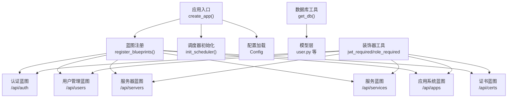
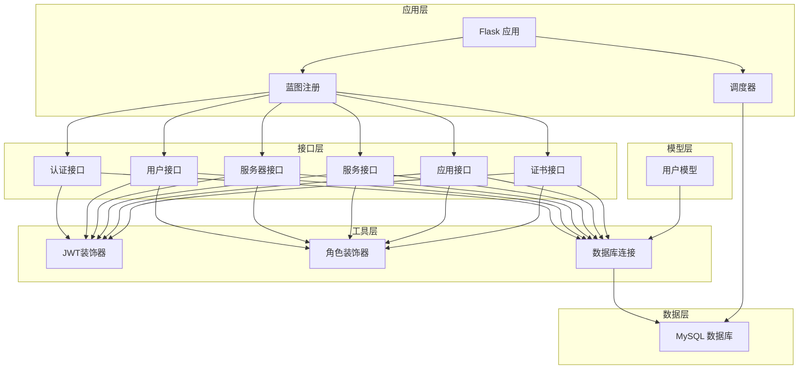
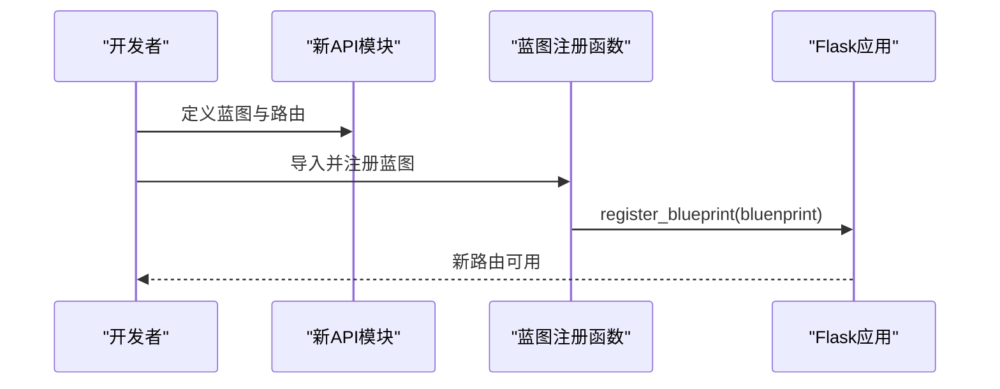
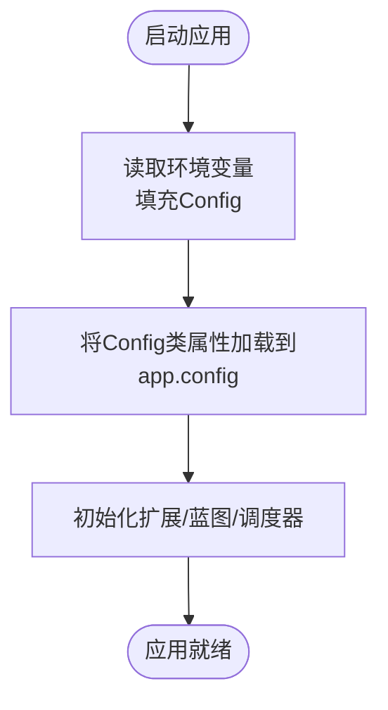
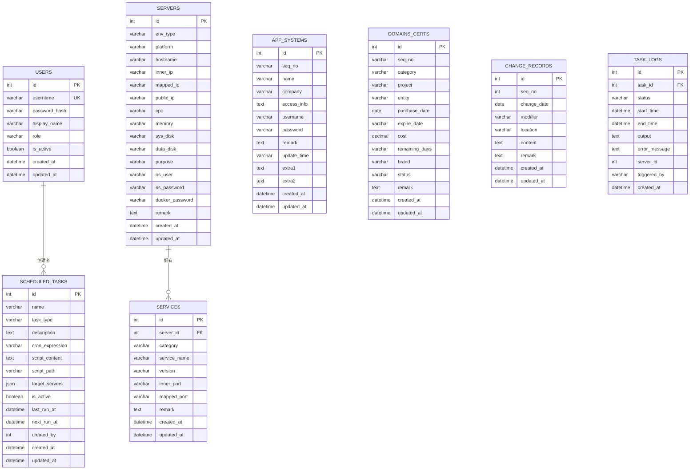
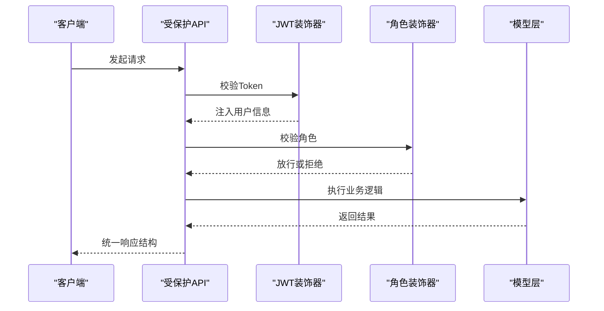
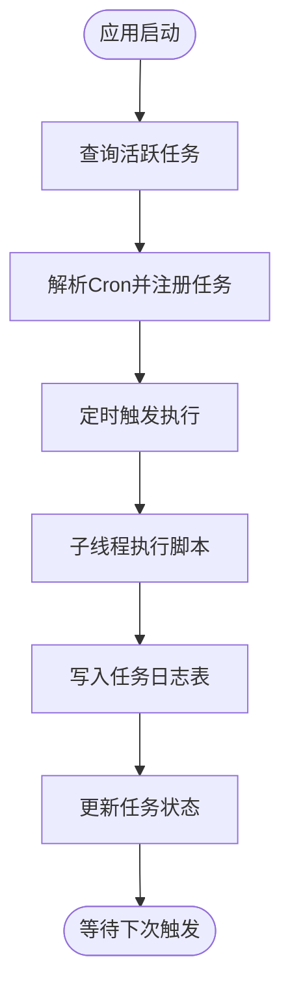
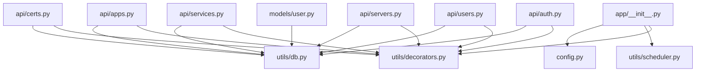

# 扩展开发

<cite>
**本文引用的文件**
- [backend/app/__init__.py](file://backend/app/__init__.py)
- [backend/app/config.py](file://backend/app/config.py)
- [backend/app/extensions.py](file://backend/app/extensions.py)
- [backend/init_db.py](file://backend/init_db.py)
- [backend/app/utils/db.py](file://backend/app/utils/db.py)
- [backend/app/utils/decorators.py](file://backend/app/utils/decorators.py)
- [backend/app/utils/scheduler.py](file://backend/app/utils/scheduler.py)
- [backend/app/models/user.py](file://backend/app/models/user.py)
- [backend/app/api/auth.py](file://backend/app/api/auth.py)
- [backend/app/api/users.py](file://backend/app/api/users.py)
- [backend/app/api/servers.py](file://backend/app/api/servers.py)
- [backend/app/api/services.py](file://backend/app/api/services.py)
- [backend/app/api/apps.py](file://backend/app/api/apps.py)
- [backend/app/api/certs.py](file://backend/app/api/certs.py)
</cite>

## 目录
1. [简介](#简介)
2. [项目结构](#项目结构)
3. [核心组件](#核心组件)
4. [架构总览](#架构总览)
5. [详细组件分析](#详细组件分析)
6. [依赖分析](#依赖分析)
7. [性能考虑](#性能考虑)
8. [故障排查指南](#故障排查指南)
9. [结论](#结论)
10. [附录](#附录)

## 简介
本指南面向希望扩展云运维平台功能的开发者，围绕以下目标展开：
- 如何添加新的功能模块（蓝图）、扩展现有API接口与集成第三方服务
- 蓝图扩展机制、插件开发模式与配置扩展方法
- 新功能开发流程、数据库表结构设计与API接口设计规范
- 现有模块扩展示例、代码复用模式与最佳实践
- 功能测试、文档编写与版本兼容性管理

平台采用Flask作为后端框架，通过蓝图组织API，统一的装饰器实现JWT认证与角色校验，数据库连接通过工具模块集中管理，定时任务调度器负责周期性任务的执行。

## 项目结构
后端采用按功能域划分的蓝图架构，核心入口负责注册蓝图与初始化调度器；数据库初始化脚本定义了完整的表结构；工具层提供认证、权限、数据库连接与调度器等通用能力；模型层封装数据库操作；API层实现REST接口。

图表来源
- [backend/app/__init__.py:37-60](file://backend/app/__init__.py#L37-L60)
- [backend/app/utils/db.py:5-17](file://backend/app/utils/db.py#L5-L17)
- [backend/app/utils/decorators.py:9-95](file://backend/app/utils/decorators.py#L9-L95)
- [backend/app/utils/scheduler.py:201-249](file://backend/app/utils/scheduler.py#L201-L249)
- [backend/app/config.py:4-21](file://backend/app/config.py#L4-L21)

章节来源
- [backend/app/__init__.py:6-34](file://backend/app/__init__.py#L6-L34)
- [backend/app/__init__.py:37-60](file://backend/app/__init__.py#L37-L60)
- [backend/app/config.py:4-21](file://backend/app/config.py#L4-L21)

## 核心组件
- 应用入口与蓝图注册：负责创建Flask应用、加载配置、注册蓝图、初始化调度器。
- 配置中心：集中管理数据库、JWT、上传目录与调试开关等配置项。
- 数据库工具：提供统一的数据库连接获取方法，便于在各模块中复用。
- 权限装饰器：提供JWT认证与角色权限校验，保障API安全。
- 调度器：基于APScheduler实现定时任务的加载、执行与日志记录。
- 模型层：封装用户等实体的数据库操作，提供增删改查与业务逻辑支持。
- API层：以蓝图形式组织REST接口，遵循统一响应结构与鉴权策略。

章节来源
- [backend/app/__init__.py:6-34](file://backend/app/__init__.py#L6-L34)
- [backend/app/config.py:4-21](file://backend/app/config.py#L4-L21)
- [backend/app/utils/db.py:5-17](file://backend/app/utils/db.py#L5-L17)
- [backend/app/utils/decorators.py:9-95](file://backend/app/utils/decorators.py#L9-L95)
- [backend/app/utils/scheduler.py:14-249](file://backend/app/utils/scheduler.py#L14-L249)
- [backend/app/models/user.py:8-183](file://backend/app/models/user.py#L8-L183)

## 架构总览
平台采用“入口应用 -> 蓝图API -> 工具层 -> 模型层 -> 数据库”的分层架构。认证与权限控制贯穿所有受保护接口；调度器独立于主请求流，通过独立连接与线程执行任务并回写日志。

图表来源
- [backend/app/__init__.py:37-60](file://backend/app/__init__.py#L37-L60)
- [backend/app/api/auth.py:14-184](file://backend/app/api/auth.py#L14-L184)
- [backend/app/api/users.py:17-268](file://backend/app/api/users.py#L17-L268)
- [backend/app/api/servers.py:11-203](file://backend/app/api/servers.py#L11-L203)
- [backend/app/api/services.py:11-144](file://backend/app/api/services.py#L11-L144)
- [backend/app/api/apps.py:11-139](file://backend/app/api/apps.py#L11-L139)
- [backend/app/api/certs.py:11-145](file://backend/app/api/certs.py#L11-L145)
- [backend/app/utils/decorators.py:9-95](file://backend/app/utils/decorators.py#L9-L95)
- [backend/app/utils/db.py:5-17](file://backend/app/utils/db.py#L5-L17)
- [backend/app/utils/scheduler.py:201-249](file://backend/app/utils/scheduler.py#L201-L249)

## 详细组件分析

### 蓝图扩展机制与插件开发模式
- 新蓝图创建：在API目录新增模块文件，定义蓝图对象与路由，确保URL前缀与命名规范一致。
- 注册蓝图：在应用入口的蓝图注册函数中导入并注册新蓝图，保证路由生效。
- 插件化思路：将第三方服务适配为独立模块，通过配置中心注入参数，避免硬编码；在工具层抽象HTTP客户端与回调处理，便于替换与扩展。

图表来源
- [backend/app/__init__.py:37-60](file://backend/app/__init__.py#L37-L60)

章节来源
- [backend/app/__init__.py:37-60](file://backend/app/__init__.py#L37-L60)

### 配置扩展方法
- 环境变量驱动：通过配置类读取环境变量，支持运行时切换数据库、JWT密钥、上传目录与调试模式。
- 扩展点建议：新增配置项时，先在配置类中声明默认值，再在应用入口加载到app.config；对敏感配置使用环境变量注入。

图表来源
- [backend/app/config.py:4-21](file://backend/app/config.py#L4-L21)
- [backend/app/__init__.py:19-34](file://backend/app/__init__.py#L19-L34)

章节来源
- [backend/app/config.py:4-21](file://backend/app/config.py#L4-L21)
- [backend/app/__init__.py:19-34](file://backend/app/__init__.py#L19-L34)

### 数据库表结构设计与模型层复用
- 表结构设计：参考数据库初始化脚本中的表定义，遵循字段命名规范、索引设计与外键约束；为查询频繁的字段建立索引。
- 模型层复用：统一使用数据库工具获取连接，封装CRUD操作；在模型层暴露清晰的函数接口，避免在API层直接拼接SQL。
- 新表扩展：新增表时，同步完善初始化脚本与相关API；对外键关系保持一致性，确保级联删除与更新行为符合预期。

图表来源
- [backend/init_db.py:34-211](file://backend/init_db.py#L34-L211)

章节来源
- [backend/init_db.py:34-211](file://backend/init_db.py#L34-L211)
- [backend/app/utils/db.py:5-17](file://backend/app/utils/db.py#L5-L17)
- [backend/app/models/user.py:8-183](file://backend/app/models/user.py#L8-L183)

### API接口设计规范
- 统一响应结构：所有接口返回统一的JSON结构，包含状态码与消息；成功时携带data字段。
- 鉴权策略：受保护接口使用JWT装饰器；管理员接口使用角色装饰器限定权限。
- 参数校验：在API层进行基础参数校验与业务规则检查；异常情况返回明确的错误码与提示。
- 错误处理：捕获异常并返回标准错误响应；对数据库事务进行回滚，保证数据一致性。

图表来源
- [backend/app/api/auth.py:14-184](file://backend/app/api/auth.py#L14-L184)
- [backend/app/api/users.py:17-268](file://backend/app/api/users.py#L17-L268)
- [backend/app/utils/decorators.py:9-95](file://backend/app/utils/decorators.py#L9-L95)
- [backend/app/models/user.py:8-183](file://backend/app/models/user.py#L8-L183)

章节来源
- [backend/app/api/auth.py:14-184](file://backend/app/api/auth.py#L14-L184)
- [backend/app/api/users.py:17-268](file://backend/app/api/users.py#L17-L268)
- [backend/app/utils/decorators.py:9-95](file://backend/app/utils/decorators.py#L9-L95)

### 定时任务调度与日志记录
- 任务加载：应用启动时从数据库加载活跃任务，解析Cron表达式并注册到调度器。
- 任务执行：独立线程执行脚本，捕获输出与错误，写入任务日志表并更新任务状态。
- 配置传递：调度器持有数据库配置，避免在回调中重复构造连接。

图表来源
- [backend/app/utils/scheduler.py:201-249](file://backend/app/utils/scheduler.py#L201-L249)
- [backend/app/utils/scheduler.py:32-144](file://backend/app/utils/scheduler.py#L32-L144)

章节来源
- [backend/app/utils/scheduler.py:201-249](file://backend/app/utils/scheduler.py#L201-L249)
- [backend/app/utils/scheduler.py:32-144](file://backend/app/utils/scheduler.py#L32-L144)

### 扩展现有API接口示例
- 用户管理扩展：在用户蓝图中新增接口（如批量导入、导出），复用模型层的用户操作函数与装饰器。
- 服务器管理扩展：在服务器蓝图中新增查询条件或统计接口，复用数据库工具与装饰器。
- 服务管理扩展：在服务蓝图中新增批量操作或关联查询，保持统一的响应结构与权限控制。

章节来源
- [backend/app/api/users.py:17-268](file://backend/app/api/users.py#L17-L268)
- [backend/app/api/servers.py:11-203](file://backend/app/api/servers.py#L11-L203)
- [backend/app/api/services.py:11-144](file://backend/app/api/services.py#L11-L144)

### 第三方服务集成
- 抽象适配层：在工具层新增HTTP客户端或SDK封装，统一错误处理与日志记录。
- 配置注入：通过配置类与环境变量注入第三方服务的访问凭据与端点。
- 蓝图对接：在API蓝图中调用适配层，返回统一响应结构；必要时增加定时任务轮询或回调处理。

章节来源
- [backend/app/config.py:4-21](file://backend/app/config.py#L4-L21)
- [backend/app/utils/db.py:5-17](file://backend/app/utils/db.py#L5-L17)

## 依赖分析
- 组件耦合：API层依赖装饰器与数据库工具；模型层依赖数据库工具；调度器依赖数据库工具与配置。
- 外部依赖：Flask、PyMySQL、APScheduler、Werkzeug等。
- 循环依赖：当前结构未见循环导入，蓝图注册集中在入口文件，避免相互引用。

图表来源
- [backend/app/api/auth.py:14-184](file://backend/app/api/auth.py#L14-L184)
- [backend/app/api/users.py:17-268](file://backend/app/api/users.py#L17-L268)
- [backend/app/api/servers.py:11-203](file://backend/app/api/servers.py#L11-L203)
- [backend/app/api/services.py:11-144](file://backend/app/api/services.py#L11-L144)
- [backend/app/api/apps.py:11-139](file://backend/app/api/apps.py#L11-L139)
- [backend/app/api/certs.py:11-145](file://backend/app/api/certs.py#L11-L145)
- [backend/app/utils/decorators.py:9-95](file://backend/app/utils/decorators.py#L9-L95)
- [backend/app/utils/db.py:5-17](file://backend/app/utils/db.py#L5-L17)
- [backend/app/models/user.py:8-183](file://backend/app/models/user.py#L8-L183)
- [backend/app/__init__.py:37-60](file://backend/app/__init__.py#L37-L60)
- [backend/app/utils/scheduler.py:201-249](file://backend/app/utils/scheduler.py#L201-L249)
- [backend/app/config.py:4-21](file://backend/app/config.py#L4-L21)

章节来源
- [backend/app/__init__.py:37-60](file://backend/app/__init__.py#L37-L60)
- [backend/app/utils/decorators.py:9-95](file://backend/app/utils/decorators.py#L9-L95)
- [backend/app/utils/db.py:5-17](file://backend/app/utils/db.py#L5-L17)
- [backend/app/utils/scheduler.py:201-249](file://backend/app/utils/scheduler.py#L201-L249)
- [backend/app/config.py:4-21](file://backend/app/config.py#L4-L21)

## 性能考虑
- 数据库连接：统一通过工具函数获取连接，避免在API层重复创建；对长事务与批量操作使用上下文管理器。
- 查询优化：为高频查询字段建立索引；避免N+1查询，尽量使用JOIN与批量查询。
- 调度器并发：任务在独立线程执行，注意I/O与超时控制；对长时间任务设置超时阈值并记录日志。
- 缓存策略：对静态配置与只读数据可引入缓存，减少数据库压力（需结合实际场景评估）。

## 故障排查指南
- 认证失败：检查Authorization头格式是否为Bearer Token；确认Token未过期；核对用户状态与角色。
- 权限不足：确认角色装饰器顺序在JWT装饰器之后；检查g.current_user是否正确注入。
- 数据库连接：核对配置类中的数据库参数；检查网络连通性与账号权限。
- 调度器异常：查看任务日志表中的错误信息；确认脚本路径存在且可执行；检查Cron表达式格式。

章节来源
- [backend/app/utils/decorators.py:9-95](file://backend/app/utils/decorators.py#L9-L95)
- [backend/app/utils/db.py:5-17](file://backend/app/utils/db.py#L5-L17)
- [backend/app/utils/scheduler.py:32-144](file://backend/app/utils/scheduler.py#L32-L144)

## 结论
通过蓝图扩展机制、统一的配置与工具层、严格的鉴权与日志体系，平台提供了良好的扩展性与可维护性。开发者应遵循统一的接口设计规范与数据库设计原则，在模型层与API层之间建立清晰的边界，结合调度器与第三方服务适配层，实现稳定高效的扩展开发。

## 附录
- 新功能开发流程建议
  - 设计API：确定URL、方法、请求/响应结构与鉴权要求
  - 设计模型：定义数据模型与索引，完善初始化脚本
  - 实现API：在蓝图中实现接口，复用装饰器与工具函数
  - 单元测试：编写接口与模型测试，覆盖正常与异常分支
  - 文档编写：更新接口文档与数据库变更说明
  - 版本兼容：遵循向后兼容原则，必要时提供迁移脚本
- 数据库表设计要点
  - 字段命名采用小写下划线；为常用查询字段建立索引
  - 对外键关系明确约束与级联行为
  - 对文本字段合理选择TEXT或VARCHAR长度
- API设计规范要点
  - 统一响应结构；错误码与消息清晰明确
  - 参数校验前置；业务规则在API层体现
  - 对敏感信息脱敏；对大字段分页或懒加载